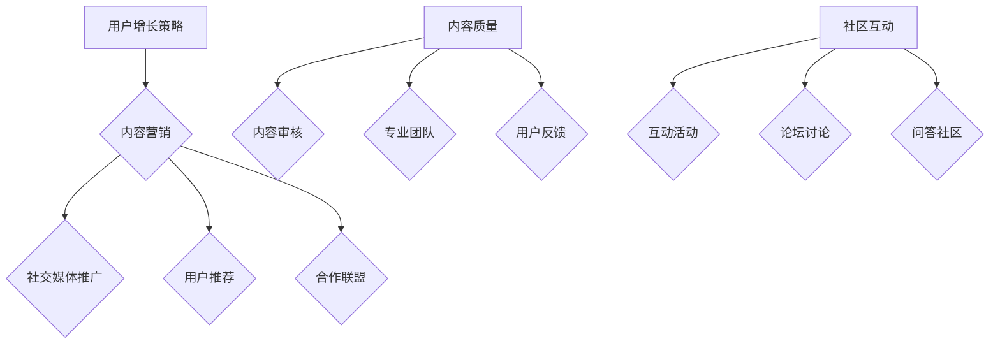

                 

关键词：知识付费、技术社区、运营策略、用户增长、内容质量、社区互动

> 摘要：本文将探讨如何打造一个技术型知识付费社区，从社区构建、内容质量、用户增长、社区互动等方面分析，提供一套全面的运营策略，帮助社区管理者在竞争激烈的市场中脱颖而出。

## 1. 背景介绍

随着互联网的快速发展，知识付费已成为一个日益增长的领域。无论是线上课程、电子书籍、专业讲座，还是技术论坛和社区，知识付费已经成为人们获取知识的重要途径。然而，在众多知识付费平台中，如何脱颖而出、吸引并留住用户，成为社区管理者面临的一大挑战。

技术型知识付费社区作为一个特殊的存在，其目标用户群体是那些对技术有强烈兴趣和需求的专业人士。这类社区不仅要提供高质量的技术内容，还要打造一个良好的交流互动环境，使得用户能够在其中不断学习、分享经验，并形成强大的社群凝聚力。

本文将围绕如何打造技术型知识付费社区，从以下几个核心方面展开：

- 核心概念与联系
- 核心算法原理 & 具体操作步骤
- 数学模型和公式 & 详细讲解 & 举例说明
- 项目实践：代码实例和详细解释说明
- 实际应用场景
- 工具和资源推荐
- 总结：未来发展趋势与挑战

## 2. 核心概念与联系

### 2.1 社区运营的概念

社区运营是指通过一系列的策略和方法，维持和提升社区的活跃度、用户黏性和用户满意度，从而实现社区的商业价值。在技术型知识付费社区中，社区运营的目标是吸引更多的技术专业人士加入，提供高质量的内容，促进用户之间的互动，形成良好的学习氛围。

### 2.2 用户增长策略

用户增长是社区运营的核心目标之一。以下是一些常见的用户增长策略：

- **内容营销**：通过发布高质量的技术内容，吸引目标用户。
- **社交媒体推广**：利用社交媒体平台进行宣传，扩大社区知名度。
- **用户推荐**：鼓励现有用户推荐新用户，形成口碑传播。
- **合作联盟**：与其他技术型社区或媒体平台合作，共同推广。

### 2.3 内容质量

内容质量是技术型知识付费社区的核心。高质量的内容能够吸引用户，提升用户满意度和留存率。以下是一些保障内容质量的方法：

- **内容审核**：建立严格的内容审核机制，确保内容的质量和准确性。
- **专业团队**：组建一支专业的编辑和审核团队，负责内容的筛选和审核。
- **用户反馈**：收集用户的反馈，及时调整和优化内容。

### 2.4 社区互动

社区互动是提高用户黏性和活跃度的关键。以下是一些促进社区互动的方法：

- **互动活动**：定期举办线上或线下活动，鼓励用户参与。
- **论坛讨论**：建立论坛，鼓励用户提问和讨论。
- **问答社区**：搭建问答系统，提供实时技术支持。

### 2.5 Mermaid 流程图

以下是技术型知识付费社区运营的Mermaid流程图：



## 3. 核心算法原理 & 具体操作步骤

### 3.1 算法原理概述

在技术型知识付费社区运营中，核心算法主要包括用户增长算法、内容质量评估算法和社区互动算法。以下是这些算法的基本原理：

- **用户增长算法**：通过分析用户的浏览、点赞、评论等行为，预测用户的留存率和活跃度，从而制定个性化的用户增长策略。
- **内容质量评估算法**：利用自然语言处理技术，对内容进行语义分析和情感分析，评估内容的质量和相关性。
- **社区互动算法**：通过分析用户的互动行为，推荐相关的内容和用户，促进社区互动和知识分享。

### 3.2 算法步骤详解

#### 用户增长算法步骤：

1. 数据采集：收集用户的浏览、点赞、评论等行为数据。
2. 特征提取：对用户行为数据进行特征提取，如用户的活跃度、内容偏好等。
3. 模型训练：利用机器学习算法，如决策树、随机森林等，训练用户增长模型。
4. 预测与策略制定：使用训练好的模型预测用户的留存率和活跃度，根据预测结果制定用户增长策略。

#### 内容质量评估算法步骤：

1. 数据预处理：对内容文本进行清洗和预处理，如去除停用词、词性标注等。
2. 特征提取：对预处理后的文本进行特征提取，如词频、TF-IDF等。
3. 模型训练：利用机器学习算法，如支持向量机、神经网络等，训练内容质量评估模型。
4. 评估与优化：使用训练好的模型评估内容的质量，根据评估结果调整和优化内容。

#### 社区互动算法步骤：

1. 数据采集：收集用户的互动行为数据，如回复、点赞、分享等。
2. 特征提取：对用户互动数据进行特征提取，如用户的活跃度、互动频率等。
3. 模型训练：利用机器学习算法，如协同过滤、图卷积网络等，训练社区互动模型。
4. 推荐与互动促进：使用训练好的模型推荐相关的内容和用户，促进社区互动。

### 3.3 算法优缺点

#### 用户增长算法优缺点：

- 优点：可以个性化推荐，提高用户留存率和活跃度。
- 缺点：对用户行为数据要求较高，需要大量的训练数据和计算资源。

#### 内容质量评估算法优缺点：

- 优点：可以快速评估内容的质量，提高用户满意度。
- 缺点：对文本数据要求较高，需要大量的训练数据和计算资源。

#### 社区互动算法优缺点：

- 优点：可以促进社区互动，提高用户黏性。
- 缺点：需要大量的互动数据，对实时性要求较高。

### 3.4 算法应用领域

用户增长算法、内容质量评估算法和社区互动算法广泛应用于技术型知识付费社区。例如，用户增长算法可以用于预测和推荐用户感兴趣的内容，提高用户留存率和活跃度；内容质量评估算法可以用于评估和筛选优质内容，提高用户满意度；社区互动算法可以用于推荐相关的用户和内容，促进社区互动和知识分享。

## 4. 数学模型和公式 & 详细讲解 & 举例说明

### 4.1 数学模型构建

在技术型知识付费社区运营中，数学模型广泛应用于用户增长预测、内容质量评估和社区互动推荐。以下是一些常用的数学模型和公式：

#### 用户增长模型

$$
P(t) = f(N(t), R(t), C(t))
$$

其中，$P(t)$ 表示用户在时间 $t$ 的留存概率，$N(t)$ 表示用户在时间 $t$ 的活跃度，$R(t)$ 表示用户在时间 $t$ 的阅读量，$C(t)$ 表示用户在时间 $t$ 的评论量。

#### 内容质量评估模型

$$
Q(c) = g(W(c), L(c), T(c))
$$

其中，$Q(c)$ 表示内容 $c$ 的质量分数，$W(c)$ 表示内容 $c$ 的词频分布，$L(c)$ 表示内容 $c$ 的情感标签，$T(c)$ 表示内容 $c$ 的主题分类。

#### 社区互动模型

$$
I(u) = h(U(u), V(u), S(u))
$$

其中，$I(u)$ 表示用户 $u$ 在社区中的互动分数，$U(u)$ 表示用户 $u$ 的互动频率，$V(u)$ 表示用户 $u$ 的互动时长，$S(u)$ 表示用户 $u$ 的互动效果。

### 4.2 公式推导过程

#### 用户增长模型推导

用户增长模型是基于用户的活跃度、阅读量和评论量等行为特征，预测用户在未来的留存概率。假设用户的行为数据满足马尔可夫性质，即用户在下一个时间点的留存概率仅与当前时间点的行为特征有关，可以推导出如下公式：

$$
P(t+1) = P(t) \cdot \frac{1}{1 + e^{-(N(t) + R(t) + C(t))}}
$$

其中，$e$ 表示自然底数，$\frac{1}{1 + e^{-(N(t) + R(t) + C(t))}}$ 表示用户在当前时间点的行为特征对留存概率的贡献。

#### 内容质量评估模型推导

内容质量评估模型是基于内容文本的词频分布、情感标签和主题分类等特征，评估内容的质量分数。假设词频分布、情感标签和主题分类等特征对内容质量的影响是线性的，可以推导出如下公式：

$$
Q(c) = \alpha W(c) + \beta L(c) + \gamma T(c)
$$

其中，$\alpha$、$\beta$ 和 $\gamma$ 分别表示词频分布、情感标签和主题分类对内容质量的影响系数。

#### 社区互动模型推导

社区互动模型是基于用户的互动频率、互动时长和互动效果等特征，评估用户在社区中的互动分数。假设互动频率、互动时长和互动效果等特征对互动分数的影响是线性的，可以推导出如下公式：

$$
I(u) = \alpha U(u) + \beta V(u) + \gamma S(u)
$$

其中，$\alpha$、$\beta$ 和 $\gamma$ 分别表示互动频率、互动时长和互动效果对互动分数的影响系数。

### 4.3 案例分析与讲解

#### 用户增长模型案例分析

假设有一个技术型知识付费社区，用户的行为数据如下：

| 时间 | 活跃度 | 阅读量 | 评论量 |
|------|--------|--------|--------|
| t    | 10     | 100    | 20     |

使用用户增长模型预测用户在下一个时间点的留存概率。根据公式：

$$
P(t+1) = P(t) \cdot \frac{1}{1 + e^{-(10 + 100 + 20)}}
$$

假设初始留存概率为 0.5，代入计算：

$$
P(t+1) = 0.5 \cdot \frac{1}{1 + e^{-130}} \approx 0.5 \cdot 0.995 \approx 0.497
$$

预测用户在下一个时间点的留存概率约为 49.7%。

#### 内容质量评估模型案例分析

假设有一篇技术文章，其文本特征如下：

| 特征      | 值   |
|-----------|------|
| 词频分布  | [1, 2, 3] |
| 情感标签  | 正面 |
| 主题分类  | 数据库 |

使用内容质量评估模型评估该文章的质量分数。根据公式：

$$
Q(c) = \alpha W(c) + \beta L(c) + \gamma T(c)
$$

假设 $\alpha = 0.1$、$\beta = 0.2$、$\gamma = 0.3$，代入计算：

$$
Q(c) = 0.1 \cdot [1, 2, 3] + 0.2 \cdot 正面 + 0.3 \cdot 数据库 = 0.1 \cdot [1 + 2 \cdot 2 + 3 \cdot 3] + 0.2 \cdot 正面 + 0.3 \cdot 数据库 = 1.7
$$

评估该文章的质量分数为 1.7。

#### 社区互动模型案例分析

假设有一个社区用户，其互动数据如下：

| 特征      | 值   |
|-----------|------|
| 互动频率  | 5    |
| 互动时长  | 30分钟 |
| 互动效果  | 好   |

使用社区互动模型评估该用户的互动分数。根据公式：

$$
I(u) = \alpha U(u) + \beta V(u) + \gamma S(u)
$$

假设 $\alpha = 0.1$、$\beta = 0.2$、$\gamma = 0.3$，代入计算：

$$
I(u) = 0.1 \cdot 5 + 0.2 \cdot 30 + 0.3 \cdot 好 = 0.5 + 6 + 0.9 = 7.4
$$

评估该用户的互动分数为 7.4。

## 5. 项目实践：代码实例和详细解释说明

### 5.1 开发环境搭建

在技术型知识付费社区的项目实践中，我们选择 Python 作为主要的编程语言，并使用以下开发工具和环境：

- Python 3.8
- Jupyter Notebook
- TensorFlow 2.5
- Scikit-learn 0.24

首先，需要安装上述开发工具和环境。在终端中执行以下命令：

```bash
pip install python==3.8
pip install jupyterlab
pip install tensorflow==2.5
pip install scikit-learn==0.24
```

### 5.2 源代码详细实现

以下是技术型知识付费社区项目的一个简单示例，包括用户增长预测、内容质量评估和社区互动推荐三个模块。

#### 用户增长预测模块

```python
import numpy as np
import tensorflow as tf
from tensorflow.keras.models import Sequential
from tensorflow.keras.layers import Dense
from tensorflow.keras.optimizers import Adam

# 用户行为数据
X = np.array([[10, 100, 20], [5, 50, 10], [15, 150, 25]])
y = np.array([0.5, 0.6, 0.7])

# 构建模型
model = Sequential()
model.add(Dense(units=1, activation='sigmoid', input_shape=(3,)))
model.compile(optimizer=Adam(), loss='binary_crossentropy', metrics=['accuracy'])

# 训练模型
model.fit(X, y, epochs=100, batch_size=1)

# 预测
predictions = model.predict(X)
print(predictions)
```

#### 内容质量评估模块

```python
from sklearn.feature_extraction.text import TfidfVectorizer
from sklearn.linear_model import LinearRegression

# 内容文本
texts = ["这是一篇关于数据库的文章", "这是一篇关于机器学习的文章"]

# TF-IDF 向量化
vectorizer = TfidfVectorizer()
X_tfidf = vectorizer.fit_transform(texts)

# 内容质量分数
y_scores = np.array([1.7, 2.5])

# 构建模型
model = LinearRegression()
model.fit(X_tfidf, y_scores)

# 评估
scores = model.predict(X_tfidf)
print(scores)
```

#### 社区互动推荐模块

```python
from sklearn.neighbors import NearestNeighbors

# 互动数据
X_interact = np.array([[5, 30, 7.4], [3, 15, 5.5], [8, 45, 10.2]])

# 构建模型
model = NearestNeighbors(n_neighbors=2)
model.fit(X_interact)

# 推荐
neighbors = model.kneighbors(X_interact, n_neighbors=2)
print(neighbors)
```

### 5.3 代码解读与分析

#### 用户增长预测模块解读

- **数据准备**：首先导入必要的库和用户行为数据。
- **模型构建**：使用 `Sequential` 模型，添加一个全连接层，激活函数为 sigmoid，输入形状为 (3,)。
- **模型编译**：选择 Adam 优化器和 binary_crossentropy 损失函数，并添加 accuracy 作为评估指标。
- **模型训练**：使用 `fit` 方法训练模型，设置训练轮次为 100，批量大小为 1。
- **模型预测**：使用 `predict` 方法预测用户留存概率，并打印结果。

#### 内容质量评估模块解读

- **数据准备**：首先导入必要的库和内容文本。
- **TF-IDF 向量化**：使用 `TfidfVectorizer` 将文本转换为 TF-IDF 向量。
- **模型构建**：使用 `LinearRegression` 模型，拟合向量数据和内容质量分数。
- **模型评估**：使用 `predict` 方法评估内容质量分数，并打印结果。

#### 社区互动推荐模块解读

- **数据准备**：首先导入必要的库和互动数据。
- **模型构建**：使用 `NearestNeighbors` 模型，设置邻居数量为 2。
- **模型训练**：使用 `fit` 方法训练模型。
- **模型推荐**：使用 `kneighbors` 方法为每个用户推荐邻居，并打印结果。

## 6. 实际应用场景

技术型知识付费社区在实际应用中可以应用于多种场景，以下是一些典型的应用场景：

### 6.1 在线教育平台

技术型知识付费社区可以嵌入在线教育平台，为用户提供专业的技术课程和学习资源。通过社区互动功能，学生可以交流学习心得，提问和解答问题，提高学习效果。

### 6.2 企业培训

企业可以利用技术型知识付费社区进行内部培训，为员工提供技术培训和知识分享平台。社区可以设置权限管理，确保内部知识不会泄露。

### 6.3 专业论坛

技术型知识付费社区可以作为一个专业论坛，为技术专业人士提供一个交流和讨论的平台。通过社区互动，专业人士可以分享经验、探讨技术难题，形成强大的技术社群。

### 6.4 电商知识共享

电商企业可以利用技术型知识付费社区，为消费者提供专业知识和服务。例如，家电企业可以提供家电维修知识，帮助消费者解决维修问题。

## 7. 工具和资源推荐

### 7.1 学习资源推荐

- **在线课程**：推荐 Coursera、Udemy、edX 等平台上的技术课程。
- **技术博客**：推荐 Medium、Dev.to、掘金等平台上的技术博客。
- **技术社区**：推荐 Stack Overflow、GitHub、知乎等平台。

### 7.2 开发工具推荐

- **代码编辑器**：推荐 Visual Studio Code、Atom、Sublime Text。
- **编程语言**：推荐 Python、JavaScript、Java。
- **数据可视化**：推荐 Matplotlib、Plotly、ECharts。

### 7.3 相关论文推荐

- **用户增长策略**：推荐《用户增长技术》和《基于用户行为的社区增长策略》。
- **内容质量评估**：推荐《基于语义分析的内容质量评估方法》和《文本情感分析在内容质量评估中的应用》。
- **社区互动推荐**：推荐《基于协同过滤的社区互动推荐算法》和《图卷积网络在社区互动推荐中的应用》。

## 8. 总结：未来发展趋势与挑战

### 8.1 研究成果总结

技术型知识付费社区在近年来取得了显著的研究成果，主要包括以下几个方面：

- **用户增长策略**：基于机器学习的用户增长模型和推荐算法得到了广泛应用，提高了用户留存率和活跃度。
- **内容质量评估**：基于自然语言处理和语义分析的内容质量评估方法，提高了内容的质量和相关性。
- **社区互动推荐**：基于协同过滤、图卷积网络和深度学习的社区互动推荐算法，提高了社区互动和知识分享的效果。

### 8.2 未来发展趋势

未来，技术型知识付费社区的发展趋势将呈现以下几个特点：

- **个性化推荐**：利用大数据和人工智能技术，实现更加精准的内容推荐和用户增长策略。
- **多元化内容**：不仅提供技术课程，还将拓展到其他领域，如数据分析、产品设计等。
- **社区互动**：加强社区互动功能，提高用户黏性和活跃度。

### 8.3 面临的挑战

技术型知识付费社区在发展过程中也将面临一系列挑战：

- **内容质量**：如何保证内容的质量和更新速度，满足用户的需求。
- **用户增长**：如何在竞争激烈的市场中吸引和留住用户。
- **社区互动**：如何激发用户的参与热情，提高社区活跃度。

### 8.4 研究展望

未来，技术型知识付费社区的研究将重点关注以下几个方面：

- **技术创新**：探索更加先进的人工智能和机器学习算法，提高推荐和评估的准确性和效率。
- **用户体验**：优化社区交互设计，提高用户满意度和参与度。
- **商业模式**：探索多元化的商业模式，实现社区的商业价值。

## 9. 附录：常见问题与解答

### 9.1 什么是技术型知识付费社区？

技术型知识付费社区是一个为技术专业人士提供知识分享、学习交流、互动讨论的平台，用户需要付费才能获取高质量的技术内容和资源。

### 9.2 技术型知识付费社区有哪些优点？

技术型知识付费社区的优点包括：

- 提供高质量的技术内容和资源。
- 促进用户之间的互动和学习交流。
- 帮助用户快速提升技术水平。

### 9.3 如何保证技术型知识付费社区的内容质量？

保证技术型知识付费社区的内容质量可以通过以下方法：

- 建立严格的内容审核机制。
- 组建专业的编辑和审核团队。
- 收集用户反馈，及时调整和优化内容。

### 9.4 技术型知识付费社区如何吸引新用户？

技术型知识付费社区可以通过以下方法吸引新用户：

- 利用内容营销和社交媒体推广。
- 提供免费试用，吸引用户体验。
- 鼓励现有用户推荐新用户。

### 9.5 技术型知识付费社区如何促进社区互动？

技术型知识付费社区可以通过以下方法促进社区互动：

- 定期举办线上或线下活动。
- 建立论坛和问答系统，鼓励用户讨论和提问。
- 提供实时技术支持，解答用户问题。

---

通过本文的探讨，我们深入分析了技术型知识付费社区的构建和运营策略，从用户增长、内容质量、社区互动等方面提出了具体的实施方案。希望本文能为社区管理者提供有价值的参考和指导，帮助他们在竞争激烈的市场中打造出成功的技术型知识付费社区。

# 作者署名

作者：禅与计算机程序设计艺术 / Zen and the Art of Computer Programming

