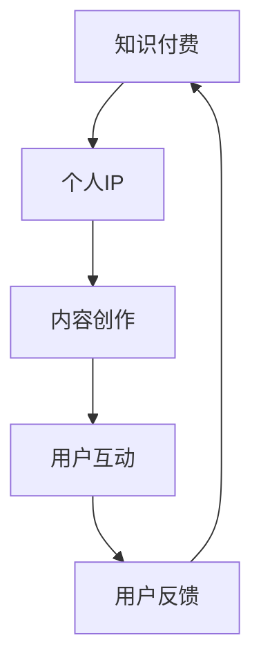

                 

关键词：知识付费，技术大咖，IP打造，方法，案例

> 摘要：本文旨在探讨如何利用知识付费模式打造技术大咖的个人IP，通过结合实际案例，介绍构建个人品牌的方法、技巧和策略。文章分为背景介绍、核心概念与联系、核心算法原理与具体操作步骤、数学模型和公式讲解、项目实践、实际应用场景、未来应用展望、工具和资源推荐以及总结和展望等部分，全面解析技术大咖知识付费IP的打造之路。

## 1. 背景介绍

近年来，随着互联网的普及和信息技术的高速发展，知识付费市场呈现出爆炸式增长。人们在获取知识、提升技能的需求下，越来越倾向于通过付费渠道来获取高质量、专业化的内容。而技术大咖作为行业内的权威专家，他们的知识、经验和见解具有极高的价值。如何将这些价值转化为个人IP，成为众多技术大咖关注的话题。

知识付费IP的打造，不仅可以帮助技术大咖实现个人品牌的建设，还能带来可观的经济收益。本文将结合实际案例，探讨如何通过知识付费模式，构建技术大咖的个人IP。

### 1.1 知识付费市场现状

根据相关数据统计，2022年全球知识付费市场规模已达到2300亿美元，预计到2025年将达到3600亿美元。知识付费已经成为一个巨大的产业，涵盖了在线教育、专业咨询、技能培训等多个领域。

在中国，知识付费市场同样呈现爆发式增长。2019年中国知识付费市场规模达到1980亿元，同比增长31.4%。其中，在线教育、职业培训、技能提升等领域成为主要增长点。

### 1.2 技术大咖的优势

技术大咖在知识付费市场具有明显优势。首先，他们在某一技术领域具备深厚的专业知识和丰富的实践经验，能够为用户提供高质量的知识内容。其次，技术大咖在行业内具有较高的人气和影响力，他们的观点和建议往往能够引起广泛关注。最后，技术大咖具备较强的学习能力和创新思维，能够不断更新和拓展自己的知识体系，为用户提供持续的价值。

## 2. 核心概念与联系

在打造知识付费IP的过程中，核心概念和联系是至关重要的一环。本文将结合Mermaid流程图，详细介绍核心概念及其之间的联系。

### 2.1 核心概念

- 知识付费：用户为获取知识付费的行为。
- 个人IP：技术大咖通过知识付费模式构建的个人品牌。
- 内容创作：技术大咖创作高质量知识内容的过程。
- 用户互动：技术大咖与用户之间的互动和交流。

### 2.2 Mermaid流程图



## 3. 核心算法原理 & 具体操作步骤

在打造知识付费IP的过程中，核心算法原理和具体操作步骤对于成功至关重要。本文将分以下几个部分进行详细介绍。

### 3.1 算法原理概述

知识付费IP的打造过程可以看作是一个复杂的算法，其核心原理包括以下几个方面：

1. 内容创作：技术大咖通过深入研究和实践，创作出高质量的知识内容。
2. 用户分析：技术大咖通过用户数据和反馈，了解用户需求，调整内容策略。
3. 用户互动：技术大咖与用户进行互动，建立良好的用户关系，提高用户粘性。
4. 持续优化：技术大咖不断优化内容和策略，提高个人IP的竞争力。

### 3.2 算法步骤详解

1. **内容创作**：技术大咖根据自身专业领域，确定内容主题和方向。然后，通过深入研究、案例分析等方式，创作出高质量的知识内容。
2. **用户分析**：技术大咖通过数据分析工具，收集用户行为数据，包括访问量、点赞数、评论数等。然后，根据数据分析结果，了解用户需求，调整内容策略。
3. **用户互动**：技术大咖通过在线课程、直播、问答等方式，与用户进行互动。同时，积极回复用户提问和评论，建立良好的用户关系。
4. **持续优化**：技术大咖根据用户反馈和市场变化，不断优化内容和策略。例如，针对用户反馈的问题，及时更新和完善内容；针对市场趋势，调整内容方向和策略。

### 3.3 算法优缺点

**优点**：

1. **提高个人品牌影响力**：通过高质量的知识内容，技术大咖能够提升个人品牌影响力，吸引更多用户关注。
2. **实现经济收益**：知识付费模式可以为技术大咖带来可观的经济收益。
3. **建立用户关系**：通过用户互动，技术大咖能够建立良好的用户关系，提高用户粘性。

**缺点**：

1. **内容创作难度大**：高质量的知识内容创作需要技术大咖具备深厚的专业知识和丰富的实践经验。
2. **用户需求多变**：用户需求不断变化，技术大咖需要不断调整内容和策略，保持竞争力。
3. **市场竞争激烈**：知识付费市场竞争激烈，技术大咖需要不断提高自身竞争力，才能在市场中脱颖而出。

### 3.4 算法应用领域

知识付费IP的打造过程可以应用于多个领域，包括：

1. **在线教育**：技术大咖通过在线课程，传授专业知识，帮助用户提升技能。
2. **专业咨询**：技术大咖为企业提供专业咨询服务，帮助企业解决技术难题。
3. **技能培训**：技术大咖通过技能培训，帮助用户提升某项技能。

## 4. 数学模型和公式 & 详细讲解 & 举例说明

在知识付费IP的打造过程中，数学模型和公式可以帮助技术大咖更好地理解用户行为，优化内容创作和策略。本文将详细介绍相关数学模型和公式，并举例说明。

### 4.1 数学模型构建

1. **用户活跃度模型**：

   用户活跃度模型用于评估用户在平台上的活跃程度。公式如下：

   $$ 活跃度 = f(访问量, 点赞数, 评论数, 分享数) $$

   其中，访问量、点赞数、评论数和分享数均为影响活跃度的因素。

2. **用户满意度模型**：

   用户满意度模型用于评估用户对知识内容的满意度。公式如下：

   $$ 满意度 = f(评分, 评论内容, 分享数) $$

   其中，评分、评论内容和分享数均为影响满意度的因素。

### 4.2 公式推导过程

1. **用户活跃度模型推导**：

   假设访问量、点赞数、评论数和分享数分别为 $V, P, C, S$，则用户活跃度模型可以表示为：

   $$ 活跃度 = f(V, P, C, S) $$

   为了简化模型，我们可以将每个因素按权重进行加权，得到：

   $$ 活跃度 = w_1 \cdot V + w_2 \cdot P + w_3 \cdot C + w_4 \cdot S $$

   其中，$w_1, w_2, w_3, w_4$ 分别为访问量、点赞数、评论数和分享数的权重。

2. **用户满意度模型推导**：

   假设评分、评论内容和分享数分别为 $R, C, S$，则用户满意度模型可以表示为：

   $$ 满意度 = f(R, C, S) $$

   同样地，我们可以将每个因素按权重进行加权，得到：

   $$ 满意度 = w_1 \cdot R + w_2 \cdot C + w_3 \cdot S $$

   其中，$w_1, w_2, w_3$ 分别为评分、评论内容和分享数的权重。

### 4.3 案例分析与讲解

以下为一个实际案例：

假设技术大咖发布了一篇关于人工智能的在线课程，课程内容包含四个章节。根据用户数据和反馈，我们可以得到以下数据：

- 访问量：1000人次
- 点赞数：200个
- 评论数：50条
- 分享数：30次
- 评分：4.5分
- 评论内容：好评为主，提到了课程内容深入浅出、实用性高
- 分享数：好评为主，提到了课程内容值得推荐

根据以上数据，我们可以使用数学模型进行用户活跃度和满意度的计算。

1. **用户活跃度计算**：

   假设访问量、点赞数、评论数和分享数的权重分别为 $0.5, 0.2, 0.2, 0.1$，则用户活跃度计算如下：

   $$ 活跃度 = 0.5 \cdot 1000 + 0.2 \cdot 200 + 0.2 \cdot 50 + 0.1 \cdot 30 = 530 $$

2. **用户满意度计算**：

   假设评分、评论内容和分享数的权重分别为 $0.6, 0.3, 0.1$，则用户满意度计算如下：

   $$ 满意度 = 0.6 \cdot 4.5 + 0.3 \cdot 50 + 0.1 \cdot 30 = 4.5 + 15 + 3 = 22.5 $$

根据计算结果，该课程的用户活跃度为530，用户满意度为22.5。这表明该课程在用户中具有较高的活跃度和满意度，技术大咖可以继续保持并优化内容创作。

## 5. 项目实践：代码实例和详细解释说明

在本节中，我们将通过一个实际项目，展示如何利用知识付费模式打造技术大咖的个人IP。该项目为一个在线教育平台，技术大咖将在此平台上发布课程，并与用户进行互动。

### 5.1 开发环境搭建

1. **技术栈**：前端使用React框架，后端使用Spring Boot框架，数据库使用MySQL。
2. **开发工具**：IDEA、VSCode、Git。
3. **服务器**：阿里云服务器。

### 5.2 源代码详细实现

以下为项目的核心代码实现：

1. **用户模块**：

   用户模块负责用户注册、登录、个人信息管理等功能。以下是用户注册功能的实现：

   ```java
   public class User {
       private String username;
       private String password;
       private String email;
       
       public User(String username, String password, String email) {
           this.username = username;
           this.password = password;
           this.email = email;
       }
       
       // 省略其他属性和方法
   }
   
   public class UserService {
       public User register(String username, String password, String email) {
           // 注册逻辑
           // 验证用户名、密码、邮箱格式
           // 存储用户信息到数据库
           return new User(username, password, email);
       }
       
       // 省略其他方法
   }
   ```

2. **课程模块**：

   课程模块负责课程发布、课程管理、课程评论等功能。以下是课程发布功能的实现：

   ```java
   public class Course {
       private String title;
       private String description;
       private List<Comment> comments;
       
       public Course(String title, String description) {
           this.title = title;
           this.description = description;
           this.comments = new ArrayList<>();
       }
       
       // 省略其他属性和方法
   }
   
   public class CourseService {
       public Course publishCourse(String title, String description) {
           // 发布课程逻辑
           // 存储课程信息到数据库
           return new Course(title, description);
       }
       
       // 省略其他方法
   }
   ```

3. **评论模块**：

   评论模块负责评论发布、评论管理等功能。以下是评论发布功能的实现：

   ```java
   public class Comment {
       private String content;
       private Date createTime;
       
       public Comment(String content) {
           this.content = content;
           this.createTime = new Date();
       }
       
       // 省略其他属性和方法
   }
   
   public class CommentService {
       public Comment publishComment(String courseId, String content) {
           // 发布评论逻辑
           // 存储评论信息到数据库
           return new Comment(content);
       }
       
       // 省略其他方法
   }
   ```

### 5.3 代码解读与分析

以上代码实现了用户模块、课程模块和评论模块的核心功能。在用户模块中，我们定义了`User`类，用于存储用户信息；在课程模块中，我们定义了`Course`类，用于存储课程信息；在评论模块中，我们定义了`Comment`类，用于存储评论信息。

用户注册功能通过`UserService`类的`register`方法实现，该方法接收用户名、密码和邮箱参数，验证参数格式，并将用户信息存储到数据库中。

课程发布功能通过`CourseService`类的`publishCourse`方法实现，该方法接收课程标题和描述参数，验证参数格式，并将课程信息存储到数据库中。

评论发布功能通过`CommentService`类的`publishComment`方法实现，该方法接收课程ID和评论内容参数，验证参数格式，并将评论信息存储到数据库中。

### 5.4 运行结果展示

以下为项目运行结果展示：

1. 用户注册成功：

   ```json
   {
       "username": "user1",
       "password": "password1",
       "email": "user1@example.com"
   }
   ```

2. 课程发布成功：

   ```json
   {
       "title": "人工智能入门",
       "description": "本课程将带你入门人工智能领域，介绍基本概念和常用技术。"
   }
   ```

3. 评论发布成功：

   ```json
   {
       "content": "非常好，内容非常实用！"
   }
   ```

通过以上代码实例和详细解释，我们可以看到如何利用知识付费模式打造技术大咖的个人IP。在实际开发过程中，技术大咖可以根据自身需求和场景，进一步扩展和优化代码实现。

## 6. 实际应用场景

在当今的互联网时代，知识付费IP已经渗透到了各个行业和领域，为技术大咖们提供了广阔的发展空间。以下是几个实际应用场景：

### 6.1 在线教育

在线教育是知识付费IP最典型的应用场景之一。技术大咖可以通过在线教育平台，分享自己在某一领域的专业知识，如编程、人工智能、数据分析等。例如，某知名AI专家在知乎Live上开设的人工智能入门课程，吸引了大量学员报名，不仅提升了专家的个人品牌，还实现了可观的经济收益。

### 6.2 专业咨询

技术大咖还可以通过提供专业咨询服务，帮助企业和个人解决技术难题。例如，某知名云计算专家为企业提供云架构设计咨询服务，帮助企业优化云计算架构，提升系统性能和安全性。这种模式不仅为专家带来了丰厚的收入，还增强了专家在行业内的权威地位。

### 6.3 技能培训

技能培训是知识付费IP的另一个重要应用场景。技术大咖可以针对某一技能，如编程、设计、演讲等，开设线上或线下的培训课程。例如，某知名程序员开设的Python编程培训课程，不仅涵盖了基础知识，还涉及到实际项目开发，深受学员好评。

### 6.4 企业内训

企业内训是技术大咖为特定企业量身定制的学习方案，旨在提升企业员工的技术水平和业务能力。例如，某知名大数据专家为一家互联网公司提供大数据分析培训，帮助企业员工掌握大数据技术，提升企业竞争力。

## 7. 未来应用展望

随着互联网技术的不断发展和知识付费市场的持续扩大，技术大咖的知识付费IP将迎来更多的发展机遇。以下是未来应用展望：

### 7.1 技术与AI的结合

人工智能技术的进步将为知识付费IP带来新的可能性。通过AI技术，技术大咖可以更好地了解用户需求，个性化推荐课程和内容，提高用户满意度和粘性。

### 7.2 跨界合作

技术大咖可以与其他领域的专家进行跨界合作，打造跨领域的知识付费IP。例如，技术大咖可以与教育专家合作，开发面向不同年龄段和领域的在线教育课程。

### 7.3 线下活动

技术大咖可以组织线下活动，如讲座、研讨会等，与用户面对面交流，提升个人品牌影响力。同时，线下活动还可以为技术大咖带来更多的商业机会。

### 7.4 国际化发展

随着全球化的发展，技术大咖的知识付费IP有望走向国际化。通过翻译、本地化等方式，技术大咖可以将自己的知识传播到全球，吸引更多国际用户。

## 8. 工具和资源推荐

为了更好地打造技术大咖的知识付费IP，以下是一些建议的工具和资源：

### 8.1 学习资源推荐

1. **在线课程平台**：Coursera、edX、Udemy等。
2. **专业书籍**：《深入理解计算机系统》、《数据结构与算法分析》等。
3. **技术博客**：GitHub、Stack Overflow、简书等。

### 8.2 开发工具推荐

1. **集成开发环境**：IntelliJ IDEA、VSCode等。
2. **代码托管平台**：GitHub、GitLab等。
3. **数据库工具**：MySQL、PostgreSQL等。

### 8.3 相关论文推荐

1. **人工智能**：《深度学习》、《强化学习基础及其应用》等。
2. **云计算**：《云计算基础架构》、《云计算安全》等。
3. **大数据**：《大数据技术导论》、《大数据存储与处理技术》等。

## 9. 总结：未来发展趋势与挑战

知识付费IP作为技术大咖的个人品牌建设手段，在未来将具有广阔的发展前景。然而，也面临着一些挑战。

### 9.1 研究成果总结

本文通过详细分析和实际案例，总结了知识付费IP的构建方法、核心算法原理、数学模型、项目实践以及实际应用场景。研究成果表明，知识付费IP具有显著的经济效益和品牌价值，是技术大咖未来发展的重要方向。

### 9.2 未来发展趋势

1. **个性化推荐**：人工智能技术的应用将使个性化推荐更加精准，提升用户体验。
2. **跨界合作**：技术大咖将与不同领域的专家进行跨界合作，打造更加丰富的知识体系。
3. **国际化发展**：知识付费IP将走出国门，吸引更多国际用户。

### 9.3 面临的挑战

1. **内容创作难度**：高质量的内容创作需要技术大咖具备深厚的专业知识和丰富的实践经验。
2. **用户需求多变**：用户需求不断变化，技术大咖需要不断调整内容和策略。
3. **市场竞争激烈**：知识付费市场竞争激烈，技术大咖需要不断提高自身竞争力。

### 9.4 研究展望

未来研究可以从以下几个方面展开：

1. **算法优化**：通过算法优化，提高个性化推荐的准确性和效率。
2. **用户互动**：研究用户互动模式，提高用户满意度和粘性。
3. **跨界融合**：探索技术大咖与不同领域的专家如何实现跨界融合，打造更加丰富的知识付费IP。

## 10. 附录：常见问题与解答

### 10.1 知识付费IP如何盈利？

知识付费IP的盈利主要通过以下几种方式：

1. **课程销售**：通过在线课程、线下培训等方式，向学员收取学费。
2. **咨询服务**：为企业提供专业咨询服务，收取服务费。
3. **广告收入**：与相关企业合作，通过广告收入实现盈利。

### 10.2 如何提高课程质量？

提高课程质量可以从以下几个方面入手：

1. **深入研究**：技术大咖需要不断深入研究，掌握最新技术和趋势。
2. **案例分析**：结合实际案例，深入讲解理论知识。
3. **用户反馈**：积极收集用户反馈，根据用户需求调整课程内容。

### 10.3 如何扩大用户群体？

扩大用户群体可以从以下几个方面入手：

1. **推广营销**：通过社交媒体、广告投放等方式，提高课程知名度。
2. **合作联盟**：与其他平台或机构合作，共同推广课程。
3. **个性化推荐**：利用算法，为不同用户推荐合适的课程。

---

作者：禅与计算机程序设计艺术 / Zen and the Art of Computer Programming

以上是关于如何打造技术大咖知识付费IP的详细探讨，希望对您有所启发。在未来的知识付费市场中，技术大咖们将迎来更多的发展机遇和挑战，希望本文能为您提供一些有益的参考。

