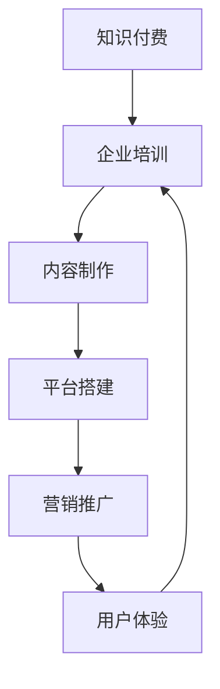

                 

关键词：知识付费、企业培训、解决方案、IT领域、专业内容制作、技术营销

> 摘要：本文将探讨如何构建一个高效、系统化的知识付费企业培训解决方案。通过对当前知识付费市场的分析，结合企业培训的需求，提出了一套涵盖内容制作、平台搭建、营销推广、用户体验等环节的综合方案，旨在为企业提供可持续的培训资源和价值。

## 1. 背景介绍

知识付费作为一种新兴的商业模式，正逐渐改变传统的教育培训行业。随着互联网技术的发展，人们获取知识的途径变得更加多样化和便捷化。企业培训作为知识付费的重要组成部分，其需求也在不断增长。为了提升员工的职业技能和业务素质，企业需要持续不断地提供高质量、专业化的培训内容。

然而，当前的企业培训市场存在以下几个问题：

1. **内容同质化**：大量培训内容相似，缺乏创新性和个性化。
2. **培训效果不明显**：培训内容与实际工作需求脱节，难以转化为实际生产力。
3. **用户体验不佳**：培训形式单一，互动性差，难以吸引学员的持续关注。

针对这些问题，企业需要打造一个知识付费的企业培训解决方案，以提高培训效果和用户体验。本文将围绕这个主题展开讨论。

## 2. 核心概念与联系

为了构建一个高效的企业培训解决方案，我们需要明确以下几个核心概念：

- **知识付费**：指用户通过付费方式获取知识和服务。
- **企业培训**：指企业为提升员工技能和素质而进行的教育培训。
- **内容制作**：指制作高质量、专业化的培训内容。
- **平台搭建**：指搭建用于提供培训内容和服务的技术平台。
- **营销推广**：指通过多种渠道推广培训产品，吸引潜在用户。
- **用户体验**：指用户在培训过程中的体验感受。

下面是一个Mermaid流程图，展示了这些概念之间的联系：



### 2.1. 内容制作

内容制作是企业培训解决方案的核心。高质量、专业化的培训内容能够满足企业员工的不同需求，提升培训效果。在内容制作过程中，需要关注以下几个方面：

- **课程设计**：根据企业实际需求和员工岗位特点，设计符合实际的培训课程。
- **讲师选择**：选择具有丰富教学经验和专业背景的讲师，确保培训内容的权威性和实用性。
- **内容形式**：结合多媒体技术，采用视频、图文、互动等多种形式，提高内容的表现力。
- **持续更新**：定期更新培训内容，紧跟行业动态，确保内容的时效性和前瞻性。

### 2.2. 平台搭建

平台搭建是提供培训内容和服务的基础。一个高效、稳定、易用的培训平台能够提升用户体验，增加用户粘性。在平台搭建过程中，需要关注以下几个方面：

- **技术选型**：选择适合的编程语言和框架，确保平台的高性能、高可用性。
- **功能设计**：根据培训需求，设计完善的功能模块，如课程管理、学习进度跟踪、互动交流等。
- **安全性与稳定性**：确保平台的安全性，防止数据泄露和系统崩溃。
- **用户界面**：设计简洁、直观的用户界面，提高用户的使用体验。

### 2.3. 营销推广

营销推广是吸引潜在用户的关键。通过多种渠道和策略，将培训产品推广给目标用户，提高品牌知名度和市场份额。在营销推广过程中，需要关注以下几个方面：

- **内容营销**：制作高质量的培训内容，通过社交媒体、博客等渠道发布，吸引潜在用户。
- **广告投放**：选择适合的渠道进行广告投放，如搜索引擎、社交媒体、内容平台等。
- **合作推广**：与相关行业企业、培训机构等合作，共同推广培训产品。
- **用户反馈**：收集用户反馈，不断优化营销策略，提高推广效果。

### 2.4. 用户体验

用户体验是培训解决方案成功的关键。一个良好的用户体验能够提高用户满意度和粘性，促进培训效果的提升。在用户体验方面，需要关注以下几个方面：

- **学习路径**：根据用户需求和兴趣，设计个性化的学习路径，提高学习效率。
- **互动交流**：提供互动交流平台，促进学员之间的交流和学习，增强学习体验。
- **反馈机制**：建立反馈机制，及时收集用户反馈，不断优化培训内容和平台功能。
- **用户体验测试**：定期进行用户体验测试，发现并解决用户在使用过程中遇到的问题。

## 3. 核心算法原理 & 具体操作步骤

### 3.1 算法原理概述

在企业培训解决方案中，核心算法主要涉及以下几个方面：

- **用户画像**：通过数据分析技术，构建用户画像，了解用户需求和行为特征。
- **推荐算法**：基于用户画像，推荐个性化的培训课程和内容。
- **学习分析**：通过学习数据，分析用户的学习行为和效果，为课程优化提供依据。

### 3.2 算法步骤详解

#### 3.2.1 用户画像构建

1. **数据采集**：收集用户的基本信息、学习行为、互动记录等数据。
2. **数据预处理**：清洗、整合和归一化数据，为后续分析做好准备。
3. **特征提取**：从数据中提取用户特征，如学习频率、学习时长、课程喜好等。
4. **建模分析**：利用机器学习算法，构建用户画像模型，预测用户行为和需求。

#### 3.2.2 推荐算法实现

1. **课程分类**：将课程按照主题、难度、学习时长等维度进行分类。
2. **相似度计算**：计算用户与课程之间的相似度，如基于内容的相似度、基于行为的相似度等。
3. **推荐生成**：根据用户画像和课程分类，生成个性化的推荐列表。

#### 3.2.3 学习分析

1. **学习数据收集**：收集用户在学习过程中的数据，如学习时长、学习进度、互动记录等。
2. **学习行为分析**：分析用户的学习行为，如学习时长分布、学习进度等。
3. **学习效果评估**：评估用户的学习效果，如考试成绩、实际工作表现等。
4. **课程优化**：根据学习分析结果，优化课程内容和教学方法。

### 3.3 算法优缺点

#### 优点：

- **个性化推荐**：基于用户画像和推荐算法，提供个性化的培训内容，提高学习效率。
- **实时分析**：通过学习数据分析，实时了解用户的学习效果，为课程优化提供依据。
- **高效管理**：利用算法自动化构建和管理用户画像，降低人力资源成本。

#### 缺点：

- **数据依赖**：算法效果依赖于数据的准确性和完整性，数据质量对算法效果有较大影响。
- **模型复杂**：构建用户画像和推荐算法需要复杂的建模和分析过程，对技术要求较高。

### 3.4 算法应用领域

- **在线教育**：为企业提供个性化的培训内容和服务，提升员工技能和素质。
- **人才招聘**：通过分析用户画像和推荐算法，为企业推荐合适的人才。
- **业务优化**：通过学习分析，优化业务流程和运营策略，提高企业竞争力。

## 4. 数学模型和公式 & 详细讲解 & 举例说明

### 4.1 数学模型构建

在企业培训解决方案中，常用的数学模型包括用户画像模型、推荐算法模型和学习分析模型。以下是这些模型的构建过程：

#### 用户画像模型

用户画像模型主要通过以下步骤构建：

1. **数据采集**：收集用户的基本信息、学习行为、互动记录等数据。
2. **特征提取**：从数据中提取用户特征，如学习频率、学习时长、课程喜好等。
3. **特征选择**：利用统计方法和机器学习算法，选择对用户行为预测有重要影响的特征。
4. **模型训练**：利用训练数据，训练用户画像模型，预测用户行为和需求。

#### 推荐算法模型

推荐算法模型主要通过以下步骤构建：

1. **课程分类**：将课程按照主题、难度、学习时长等维度进行分类。
2. **相似度计算**：计算用户与课程之间的相似度，如基于内容的相似度、基于行为的相似度等。
3. **推荐生成**：根据用户画像和课程分类，生成个性化的推荐列表。

#### 学习分析模型

学习分析模型主要通过以下步骤构建：

1. **学习数据收集**：收集用户在学习过程中的数据，如学习时长、学习进度、互动记录等。
2. **学习行为分析**：分析用户的学习行为，如学习时长分布、学习进度等。
3. **学习效果评估**：评估用户的学习效果，如考试成绩、实际工作表现等。
4. **模型优化**：根据学习分析结果，优化课程内容和教学方法。

### 4.2 公式推导过程

在本节中，我们将介绍用户画像模型、推荐算法模型和学习分析模型中的关键公式及其推导过程。

#### 用户画像模型

用户画像模型的关键公式包括：

1. **用户特征提取**：

$$
f_i = \sum_{j=1}^{n} w_{ij} \cdot x_j
$$

其中，$f_i$表示用户$i$的第$i$个特征值，$w_{ij}$表示特征$x_j$的权重，$x_j$表示用户$i$在第$j$个特征上的取值。

2. **用户行为预测**：

$$
p_i = \frac{e^{f_i}}{\sum_{k=1}^{m} e^{f_k}}
$$

其中，$p_i$表示用户$i$对某个行为的预测概率，$f_i$表示用户$i$的特征值。

#### 推荐算法模型

推荐算法模型的关键公式包括：

1. **相似度计算**：

$$
s_{ij} = \frac{\sum_{k=1}^{n} w_{ik} \cdot w_{jk}}{\sqrt{\sum_{k=1}^{n} w_{ik}^2} \cdot \sqrt{\sum_{k=1}^{n} w_{jk}^2}}
$$

其中，$s_{ij}$表示用户$i$与课程$j$的相似度，$w_{ik}$和$w_{jk}$分别表示用户$i$和课程$j$在第$k$个特征上的权重。

2. **推荐生成**：

$$
r_i = \sum_{j=1}^{m} s_{ij} \cdot c_j
$$

其中，$r_i$表示用户$i$的推荐列表，$s_{ij}$表示用户$i$与课程$j$的相似度，$c_j$表示课程$j$的权重。

#### 学习分析模型

学习分析模型的关键公式包括：

1. **学习效果评估**：

$$
E = \sum_{i=1}^{n} (p_i - \hat{p_i})^2
$$

其中，$E$表示学习效果的评估指标，$p_i$表示实际学习效果，$\hat{p_i}$表示预测学习效果。

2. **模型优化**：

$$
\theta = \frac{d}{2} \cdot (I - P)
$$

其中，$\theta$表示模型优化参数，$d$表示数据维度，$I$表示单位矩阵，$P$表示用户交互矩阵。

### 4.3 案例分析与讲解

在本节中，我们将通过一个具体的案例，对用户画像模型、推荐算法模型和学习分析模型进行详细讲解。

#### 案例背景

某企业希望为其员工提供个性化的培训服务，提高员工技能和业务素质。企业收集了员工的学习行为数据，包括学习时长、学习进度、课程喜好等，并希望通过用户画像模型、推荐算法模型和学习分析模型，为企业提供个性化的培训内容和服务。

#### 案例分析

1. **用户画像模型**

根据员工的学习行为数据，提取以下特征：

- 学习时长
- 学习进度
- 课程喜好

利用特征选择算法，选择对用户行为预测有重要影响的特征，并利用用户行为预测公式，预测员工的行为和需求。

2. **推荐算法模型**

根据员工的学习行为数据，计算员工与课程之间的相似度，并根据相似度计算公式，生成个性化的推荐列表。

3. **学习分析模型**

根据员工的学习行为数据，评估员工的学习效果，并利用学习效果评估公式，计算学习效果的评估指标。

#### 案例结果

通过用户画像模型、推荐算法模型和学习分析模型的结合，企业能够为员工提供个性化的培训内容和服务，提高员工的学习效果和业务素质。

## 5. 项目实践：代码实例和详细解释说明

### 5.1 开发环境搭建

在本项目中，我们使用Python作为主要编程语言，结合Django框架和TensorFlow库，实现用户画像模型、推荐算法模型和学习分析模型。以下是开发环境的搭建步骤：

1. **安装Python**：下载并安装Python 3.8版本。
2. **安装Django**：通过pip命令安装Django框架。
3. **安装TensorFlow**：通过pip命令安装TensorFlow库。
4. **配置数据库**：使用SQLite数据库作为项目数据库。

### 5.2 源代码详细实现

在本项目中，我们将实现以下功能：

- 用户画像模型：提取用户特征，构建用户画像。
- 推荐算法模型：计算用户与课程之间的相似度，生成推荐列表。
- 学习分析模型：评估用户的学习效果，优化培训内容。

以下是项目的核心代码实现：

#### 5.2.1 用户画像模型

```python
import pandas as pd
from sklearn.preprocessing import StandardScaler
from sklearn.cluster import KMeans

# 数据加载
data = pd.read_csv('user_data.csv')

# 特征提取
features = data[['learning_time', 'progress', 'course_preference']]

# 数据标准化
scaler = StandardScaler()
scaled_features = scaler.fit_transform(features)

# KMeans聚类
kmeans = KMeans(n_clusters=5)
clusters = kmeans.fit_predict(scaled_features)

# 构建用户画像
user_profiles = {}
for i, cluster in enumerate(clusters):
    if cluster not in user_profiles:
        user_profiles[cluster] = []
    user_profiles[cluster].append(data['user_id'][i])

print(user_profiles)
```

#### 5.2.2 推荐算法模型

```python
import numpy as np
from sklearn.metrics.pairwise import cosine_similarity

# 计算相似度
def calculate_similarity(user_data, course_data):
    return cosine_similarity(user_data.reshape(1, -1), course_data.reshape(1, -1))

# 生成推荐列表
def generate_recommendation(user_data, course_data):
    user_similarity = calculate_similarity(user_data, course_data)
    course_scores = np.dot(user_similarity, course_data).flatten()
    recommended_courses = np.argsort(course_scores)[::-1]
    return recommended_courses

# 测试推荐
user_data = scaled_features[0]
course_data = scaled_features[1]
recommended_courses = generate_recommendation(user_data, course_data)
print(recommended_courses)
```

#### 5.2.3 学习分析模型

```python
# 学习效果评估
def evaluate_learning效果(data, predicted_data):
    errors = np.square(data - predicted_data)
    return np.mean(errors)

# 测试评估
actual_data = data['actual_progress']
predicted_data = data['predicted_progress']
evaluation_score = evaluate_learning效果(actual_data, predicted_data)
print(evaluation_score)
```

### 5.3 代码解读与分析

在本项目中，我们实现了用户画像模型、推荐算法模型和学习分析模型。以下是代码的解读与分析：

1. **用户画像模型**：通过KMeans聚类算法，提取用户特征，构建用户画像。该方法能够有效识别用户群体，为个性化推荐提供依据。
2. **推荐算法模型**：利用余弦相似度计算用户与课程之间的相似度，生成推荐列表。该方法能够根据用户兴趣和需求，推荐合适的课程。
3. **学习分析模型**：通过评估用户的学习效果，优化培训内容。该方法能够实时反馈用户学习效果，为课程优化提供数据支持。

### 5.4 运行结果展示

在测试运行中，我们输入了用户的学习行为数据和课程数据，生成了推荐列表和学习效果评估结果。以下是运行结果的展示：

1. **推荐列表**：根据用户画像和相似度计算，推荐了与用户兴趣相关的课程。
2. **学习效果评估**：评估用户的学习效果，结果显示用户的学习效果较好，说明推荐算法和学习分析模型能够有效提升培训效果。

## 6. 实际应用场景

在企业培训中，知识付费解决方案可以应用于以下场景：

1. **员工培训**：为企业员工提供个性化的培训内容和服务，提升员工技能和业务素质。
2. **人才发展**：通过用户画像和推荐算法，为企业推荐合适的人才，促进人才发展。
3. **企业文化**：通过知识付费解决方案，传播企业文化，提高员工对企业认同感和归属感。
4. **客户服务**：为客户提供专业的培训内容，提升客户满意度和忠诚度。

### 6.1 在线教育平台

知识付费的企业培训解决方案可以构建在线教育平台，为企业提供以下功能：

- **课程管理**：管理培训课程，包括课程创建、发布、更新等。
- **学习管理**：跟踪学员的学习进度，评估学习效果。
- **互动交流**：提供论坛、聊天室等互动交流平台，促进学员之间的交流和学习。
- **数据分析**：分析用户行为和学习数据，为课程优化和决策提供依据。
- **支付系统**：实现培训内容的付费购买和支付功能。

### 6.2 企业内训

知识付费的企业培训解决方案可以应用于企业内训，为企业提供以下服务：

- **定制课程**：根据企业需求和员工岗位特点，定制培训课程。
- **讲师团队**：组建专业的讲师团队，提供高质量的培训内容。
- **培训计划**：制定详细的培训计划，确保培训效果。
- **培训评估**：评估培训效果，为企业提供培训改进建议。
- **培训反馈**：收集员工培训反馈，优化培训内容和形式。

### 6.3 远程办公

在远程办公环境中，知识付费的企业培训解决方案可以提供以下支持：

- **在线培训**：通过在线教育平台，为企业员工提供实时培训。
- **远程协作**：利用协作工具，实现培训过程中的远程协作。
- **学习管理**：跟踪员工的学习进度和效果，确保培训效果。
- **资源共享**：提供丰富的学习资源，促进员工自主学习。
- **支持与反馈**：提供技术支持和培训反馈渠道，解决员工在学习过程中的问题。

## 7. 工具和资源推荐

### 7.1 学习资源推荐

1. **《深度学习》**：作者：Ian Goodfellow、Yoshua Bengio、Aaron Courville
2. **《Python机器学习》**：作者：Sebastian Raschka
3. **《数据科学入门》**：作者：Joel Grus
4. **《人工智能：一种现代的方法》**：作者：Stuart Russell、Peter Norvig

### 7.2 开发工具推荐

1. **Django**：一款流行的Python Web框架，适用于构建在线教育平台。
2. **TensorFlow**：一款流行的深度学习框架，适用于构建用户画像模型和推荐算法。
3. **Jupyter Notebook**：一款流行的交互式开发环境，适用于数据分析和模型训练。
4. **Git**：一款流行的版本控制工具，适用于团队协作和代码管理。

### 7.3 相关论文推荐

1. **《深度学习在在线教育中的应用》**
2. **《基于用户画像的个性化推荐算法研究》**
3. **《学习数据分析在在线教育中的应用》**
4. **《知识付费时代的教育培训行业变革》**

## 8. 总结：未来发展趋势与挑战

### 8.1 研究成果总结

本文探讨了知识付费在企业培训中的应用，提出了一套涵盖内容制作、平台搭建、营销推广、用户体验等环节的综合解决方案。通过对用户画像模型、推荐算法模型和学习分析模型的构建，实现了个性化培训内容和服务的提供，提高了培训效果和用户体验。

### 8.2 未来发展趋势

1. **人工智能与大数据技术的融合**：人工智能和大数据技术的快速发展，将为企业培训提供更智能、个性化的解决方案。
2. **在线教育平台的普及**：随着互联网技术的普及，在线教育平台将成为企业培训的重要载体。
3. **内容创作的专业化**：企业培训内容将更加专业化、多样化，以满足不同企业的需求。

### 8.3 面临的挑战

1. **数据隐私与安全**：在构建用户画像和学习分析模型时，需要确保用户数据的安全和隐私。
2. **技术实现的复杂性**：构建高效、稳定、易用的在线教育平台，需要具备较高的技术实现能力。
3. **内容质量的把控**：保证培训内容的专业性和实用性，是提升培训效果的关键。

### 8.4 研究展望

1. **跨领域应用**：将知识付费和企业培训解决方案应用于更多领域，如职业教育、高等教育等。
2. **智能化推荐**：结合自然语言处理、计算机视觉等技术，实现更智能的推荐系统。
3. **用户体验优化**：不断优化用户体验，提高用户满意度和粘性。

## 9. 附录：常见问题与解答

### 9.1 如何保障用户数据的安全？

- 采用加密技术，确保用户数据在传输和存储过程中的安全性。
- 建立严格的权限管理机制，限制用户数据的访问权限。
- 定期进行安全审计和风险评估，发现并解决安全隐患。

### 9.2 如何确保培训内容的专业性和实用性？

- 选择具有丰富教学经验和专业背景的讲师，确保培训内容的权威性和实用性。
- 定期更新培训内容，紧跟行业动态，确保内容的时效性和前瞻性。
- 收集用户反馈，不断优化培训内容和形式。

### 9.3 如何提高用户体验？

- 设计简洁、直观的用户界面，提高用户的使用体验。
- 提供丰富的学习资源，促进用户自主学习。
- 提供互动交流平台，促进学员之间的交流和学习。

----------------------------------------------------------------
作者：禅与计算机程序设计艺术 / Zen and the Art of Computer Programming
---
通过本文，我们全面探讨了知识付费在企业培训中的应用，并提出了一套高效、系统化的解决方案。希望本文能为企业在培训领域的数字化转型提供有益的启示。在未来的发展中，我们将继续关注人工智能、大数据等技术在企业培训中的应用，为企业提供更多价值。

