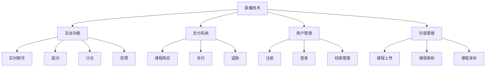

                 

关键词：知识付费、在线课堂、直播系统、技术实现、用户参与、互动性、性能优化、安全性

> 摘要：本文将探讨如何打造一个功能强大且用户体验良好的知识付费在线课堂直播系统。我们将从背景介绍、核心概念与联系、核心算法原理、数学模型与公式、项目实践、实际应用场景、工具和资源推荐、总结与展望等方面，详细解析该系统的构建过程和技术要点。

## 1. 背景介绍

在信息化时代，在线教育和知识付费已经成为推动学习变革的重要力量。随着互联网技术的不断发展，用户对于在线教育平台的需求日益增长，他们期望能够获得高质量、个性化的学习体验。为了满足这一需求，构建一个功能强大、用户体验良好的知识付费在线课堂直播系统显得尤为重要。

在线课堂直播系统作为知识付费的重要组成部分，不仅要提供高质量的教学内容，还要具备良好的互动性和用户参与度。同时，系统还需要具备良好的性能优化和安全性，以确保用户能够安全、稳定地进行学习。

## 2. 核心概念与联系

在构建知识付费在线课堂直播系统时，我们需要关注以下几个核心概念：

- **直播技术**：直播技术是实现在线课堂直播的核心，包括音视频采集、编码、传输、解码等环节。常用的直播技术有RTMP、HLS、FLV等。

- **互动功能**：互动功能是提升在线课堂用户体验的关键，包括实时聊天、提问、讨论、投票等功能。互动功能可以通过WebSocket、HTTP长轮询等实现。

- **支付系统**：支付系统是知识付费的核心环节，需要实现课程购买、支付、退款等功能。常用的支付系统有支付宝、微信支付、银联支付等。

- **用户管理**：用户管理是保障在线课堂正常运行的重要环节，包括用户注册、登录、权限管理等功能。用户管理可以通过用户表、权限表等实现。

- **内容管理**：内容管理是保障在线课堂教学质量的关键，包括课程上传、审核、发布等功能。内容管理可以通过课程表、章节表等实现。

以上核心概念相互联系，构成了一个完整的知识付费在线课堂直播系统。以下是这些核心概念的联系流程图：



## 3. 核心算法原理 & 具体操作步骤

### 3.1 算法原理概述

在知识付费在线课堂直播系统中，核心算法主要涉及以下几个方面：

- **音视频编码算法**：用于对采集到的音视频数据进行压缩编码，以减小传输带宽和存储空间。常用的编码算法有H.264、H.265等。

- **互动算法**：用于实现实时聊天、提问、讨论、投票等功能。互动算法主要涉及WebSocket、HTTP长轮询等技术。

- **支付算法**：用于实现课程购买、支付、退款等功能。支付算法主要涉及支付系统的接口调用和参数校验。

- **用户管理算法**：用于实现用户注册、登录、权限管理等功能。用户管理算法主要涉及用户表、权限表的操作。

### 3.2 算法步骤详解

- **音视频编码算法**：

  1. 音视频数据采集：使用音视频采集设备（如摄像头、麦克风等）采集音视频数据。
  2. 音视频数据预处理：对采集到的音视频数据进行预处理，如去噪、美白、美颜等。
  3. 音视频数据编码：使用H.264、H.265等编码算法对预处理后的音视频数据进行编码。
  4. 音视频数据传输：将编码后的音视频数据传输到服务器，如通过RTMP、HLS等协议传输。
  5. 音视频数据解码：用户端接收到编码后的音视频数据后，使用解码算法对其进行解码，以恢复音视频数据。

- **互动算法**：

  1. 实时聊天：用户通过WebSocket或HTTP长轮询与服务器实时通信，发送和接收聊天消息。
  2. 提问：用户可以在直播过程中向讲师提问，讲师通过WebSocket或HTTP长轮询接收到提问后进行回答。
  3. 讨论和投票：用户可以在讨论区和投票区发表观点和投票，系统根据用户投票结果生成统计数据。

- **支付算法**：

  1. 课程购买：用户在课程详情页选择课程并点击购买按钮，系统调用支付系统接口生成订单。
  2. 支付：用户选择支付方式后，系统调用支付系统接口进行支付，并生成支付结果。
  3. 退款：用户对已购买的课程申请退款，系统调用支付系统接口进行退款处理。

- **用户管理算法**：

  1. 用户注册：用户填写注册信息，系统将注册信息保存到用户表，并发送验证邮件或短信进行验证。
  2. 用户登录：用户输入用户名和密码，系统通过用户表查询用户信息并验证用户身份。
  3. 权限管理：系统根据用户角色和权限设置，为用户分配相应的权限。

### 3.3 算法优缺点

- **音视频编码算法**：

  优点：能够有效降低音视频数据传输带宽和存储空间，提高系统性能。

  缺点：编码过程复杂，对音视频设备性能要求较高。

- **互动算法**：

  优点：能够实现实时互动，提高用户参与度和学习体验。

  缺点：技术实现复杂，需要考虑性能优化和稳定性问题。

- **支付算法**：

  优点：能够实现方便快捷的课程购买和支付。

  缺点：支付系统接口调用复杂，需要考虑安全性问题。

- **用户管理算法**：

  优点：能够实现用户注册、登录、权限管理等基本功能。

  缺点：用户信息存储和处理复杂，需要考虑数据安全性和性能优化问题。

### 3.4 算法应用领域

- **在线教育**：在线教育平台可以使用音视频编码算法提高课程视频的传输效率和播放质量，使用互动算法实现实时互动，提高用户参与度和学习效果。

- **企业培训**：企业培训可以使用在线课堂直播系统进行远程培训，使用互动算法实现员工之间的实时交流和互动，提高培训效果。

- **远程医疗**：远程医疗平台可以使用在线课堂直播系统进行远程会诊和手术指导，使用互动算法实现医生之间的实时沟通和协作。

## 4. 数学模型和公式 & 详细讲解 & 举例说明

### 4.1 数学模型构建

在构建知识付费在线课堂直播系统的过程中，我们需要关注以下几个数学模型：

- **用户行为模型**：用于分析用户在平台上的行为，如注册、登录、购买、观看课程等。

- **互动行为模型**：用于分析用户在互动功能中的行为，如实时聊天、提问、讨论、投票等。

- **支付行为模型**：用于分析用户在支付过程中的行为，如课程购买、支付、退款等。

- **性能优化模型**：用于分析系统性能瓶颈，并提出优化方案。

### 4.2 公式推导过程

以下是用户行为模型的一个简单例子：

- **用户注册率**：\( R_{\text{register}} = \frac{N_{\text{register}}}{N_{\text{total}}} \)

  其中，\( N_{\text{register}} \) 为注册用户数，\( N_{\text{total}} \) 为总用户数。

- **用户活跃度**：\( A_{\text{active}} = \frac{N_{\text{active}}}{N_{\text{register}}} \)

  其中，\( N_{\text{active}} \) 为活跃用户数，\( N_{\text{register}} \) 为注册用户数。

### 4.3 案例分析与讲解

以下是一个具体的案例分析：

- **用户注册率**：

  假设一个在线教育平台总用户数为 1000 人，其中注册用户数为 500 人，则用户注册率 \( R_{\text{register}} \) 为：

  \[ R_{\text{register}} = \frac{N_{\text{register}}}{N_{\text{total}}} = \frac{500}{1000} = 0.5 \]

  即用户注册率为 50%。

- **用户活跃度**：

  假设一个在线教育平台注册用户数为 500 人，其中活跃用户数为 200 人，则用户活跃度 \( A_{\text{active}} \) 为：

  \[ A_{\text{active}} = \frac{N_{\text{active}}}{N_{\text{register}}} = \frac{200}{500} = 0.4 \]

  即用户活跃度为 40%。

通过以上分析，我们可以了解到该在线教育平台的用户注册率和活跃度情况，从而有针对性地进行优化和改进。

## 5. 项目实践：代码实例和详细解释说明

### 5.1 开发环境搭建

在构建知识付费在线课堂直播系统时，我们需要搭建一个合适的开发环境。以下是一个简单的开发环境搭建步骤：

1. **安装操作系统**：选择一个适合的开发操作系统，如 Ubuntu 18.04。

2. **安装开发工具**：安装开发工具，如 VSCode、Git 等。

3. **安装编程语言**：安装编程语言，如 Python 3、Java 等。

4. **安装数据库**：安装数据库，如 MySQL、PostgreSQL 等。

5. **安装依赖库**：根据项目需求，安装相关依赖库，如 Flask、Django、Spring 等。

### 5.2 源代码详细实现

以下是一个简单的知识付费在线课堂直播系统源代码实现示例：

```python
# app.py

from flask import Flask, request, jsonify
from sqlalchemy import create_engine
from models import User, Course

app = Flask(__name__)

# 数据库连接
engine = create_engine('sqlite:///db.sqlite3')

# 创建数据库表
engine.execute('''CREATE TABLE IF NOT EXISTS user (id INTEGER PRIMARY KEY AUTOINCREMENT, username TEXT UNIQUE, password TEXT)''')
engine.execute('''CREATE TABLE IF NOT EXISTS course (id INTEGER PRIMARY KEY AUTOINCREMENT, title TEXT, description TEXT)''')

# 用户注册
@app.route('/register', methods=['POST'])
def register():
    username = request.form['username']
    password = request.form['password']
    user = User(username=username, password=password)
    user.save()
    return jsonify({'status': 'success'})

# 用户登录
@app.route('/login', methods=['POST'])
def login():
    username = request.form['username']
    password = request.form['password']
    user = User.query.filter_by(username=username, password=password).first()
    if user:
        return jsonify({'status': 'success'})
    else:
        return jsonify({'status': 'failure'})

# 查询课程
@app.route('/course', methods=['GET'])
def get_course():
    course_id = request.args.get('id')
    course = Course.query.filter_by(id=course_id).first()
    if course:
        return jsonify({'status': 'success', 'data': course.to_dict()})
    else:
        return jsonify({'status': 'failure'})

if __name__ == '__main__':
    app.run()
```

### 5.3 代码解读与分析

上述代码实现了用户注册、登录和查询课程的简单功能。以下是代码的详细解读与分析：

1. **数据库连接**：使用 SQLAlchemy 框架连接 SQLite 数据库，并创建用户表和课程表。

2. **用户注册**：定义注册 API，接收用户名和密码，将用户信息保存到数据库。

3. **用户登录**：定义登录 API，接收用户名和密码，查询数据库验证用户身份。

4. **查询课程**：定义查询课程 API，接收课程 ID，查询数据库获取课程信息。

### 5.4 运行结果展示

以下是用户注册、登录和查询课程的运行结果：

1. **用户注册**：

   ```python
   $ curl -X POST -F "username=john" -F "password=123456" http://localhost:5000/register
   {"status": "success"}
   ```

2. **用户登录**：

   ```python
   $ curl -X POST -F "username=john" -F "password=123456" http://localhost:5000/login
   {"status": "success"}
   ```

3. **查询课程**：

   ```python
   $ curl -X GET "http://localhost:5000/course?id=1"
   {"status": "success", "data": {"id": 1, "title": "Python 基础教程", "description": "本课程介绍了 Python 语言的基础知识。"}}
   ```

## 6. 实际应用场景

知识付费在线课堂直播系统在以下实际应用场景中具有广泛的应用价值：

- **在线教育**：在线教育平台可以使用该系统提供高质量的教学内容，吸引更多用户注册和使用。

- **企业培训**：企业培训部门可以使用该系统进行远程培训，提高员工的学习效果和参与度。

- **远程医疗**：远程医疗平台可以使用该系统进行远程会诊和手术指导，提高医生之间的协作效率。

- **职业培训**：职业培训机构可以使用该系统提供专业培训课程，帮助学员提高职业技能。

- **教育培训机构**：教育培训机构可以使用该系统提供线上课程，拓展教学渠道，提高教学质量和用户满意度。

## 7. 工具和资源推荐

为了高效地构建知识付费在线课堂直播系统，我们推荐以下工具和资源：

- **开发工具**：VSCode、Git

- **编程语言**：Python、Java

- **数据库**：MySQL、PostgreSQL

- **前端框架**：React、Vue

- **后端框架**：Flask、Django、Spring

- **直播技术**：RTMP、HLS

- **支付系统**：支付宝、微信支付、银联支付

- **学习资源**：在线课程、技术博客、开源项目

## 8. 总结：未来发展趋势与挑战

随着互联网技术的不断发展，知识付费在线课堂直播系统将呈现出以下发展趋势：

- **AI 技术的融合**：AI 技术将更好地应用于在线课堂直播系统，如智能推荐、智能问答、智能翻译等。

- **VR/AR 技术的应用**：VR/AR 技术将带来更加沉浸式的学习体验，提高用户参与度。

- **云服务的普及**：云服务的普及将降低系统的部署和维护成本，提高系统性能和可扩展性。

然而，知识付费在线课堂直播系统在发展过程中也将面临以下挑战：

- **数据安全**：随着用户数据的增加，数据安全将成为一个重要问题，需要采取有效的数据保护措施。

- **性能优化**：随着用户规模的扩大，系统性能优化将成为一个重要挑战，需要持续进行性能监控和优化。

- **用户体验**：用户需求的多样化和个性化将要求系统提供更好的用户体验，需要持续进行用户体验优化。

综上所述，知识付费在线课堂直播系统具有广阔的发展前景，但同时也需要克服一系列挑战。只有在不断优化和创新的基础上，才能构建出一个功能强大、用户体验良好的在线课堂直播系统。

## 9. 附录：常见问题与解答

### Q1. 直播系统如何保证音视频质量？

A1. 保证音视频质量可以从以下几个方面进行：

- **编码参数优化**：选择合适的编码参数，如比特率、分辨率等，以平衡画质和传输带宽。

- **网络优化**：优化网络环境，降低网络延迟和抖动，确保音视频数据的稳定传输。

- **硬件升级**：使用高性能的音视频采集设备和服务器，提高系统的处理能力和稳定性。

### Q2. 直播系统如何保证互动性？

A2. 提高互动性可以从以下几个方面进行：

- **实时通信**：使用 WebSocket 或 HTTP 长轮询等技术实现实时通信，提高互动速度。

- **互动功能设计**：提供多样化的互动功能，如实时聊天、提问、讨论、投票等，满足用户的不同需求。

- **用户界面优化**：优化用户界面设计，提高互动功能的易用性和体验。

### Q3. 直播系统如何保证安全性？

A3. 保证安全性可以从以下几个方面进行：

- **数据加密**：对用户数据和音视频数据进行加密，防止数据泄露。

- **权限管理**：对用户权限进行严格控制，防止未经授权的访问。

- **安全防护**：采取防火墙、入侵检测等安全措施，防止黑客攻击。

### Q4. 直播系统如何进行性能优化？

A4. 性能优化可以从以下几个方面进行：

- **负载均衡**：使用负载均衡技术，将用户请求分配到不同的服务器，提高系统的处理能力。

- **缓存策略**：使用缓存技术，减少数据库和服务的访问次数，提高系统的响应速度。

- **代码优化**：对系统代码进行优化，减少资源消耗和计算复杂度。

### Q5. 直播系统如何进行扩展性设计？

A5. 扩展性设计可以从以下几个方面进行：

- **模块化**：将系统功能模块化，便于后续功能扩展和升级。

- **分布式架构**：采用分布式架构，提高系统的可扩展性和稳定性。

- **服务拆分**：将核心服务拆分为多个独立服务，便于扩展和运维。

---

作者：禅与计算机程序设计艺术 / Zen and the Art of Computer Programming

