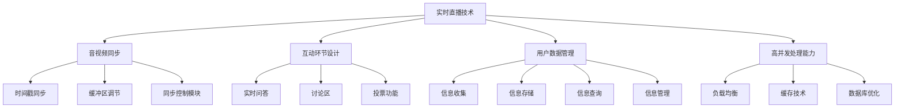

                 

关键词：知识付费、在线课堂、直播系统、架构设计、技术实现、算法原理、数学模型、代码实例、实际应用、未来展望

> 摘要：本文将深入探讨知识付费的在线课堂直播系统的设计与实现。从背景介绍、核心概念与联系，到核心算法原理、数学模型和公式，再到项目实践与实际应用，本文将为您全面解析这一系统的构建过程，展望其未来的发展趋势与挑战。

## 1. 背景介绍

随着互联网技术的飞速发展，在线教育逐渐成为教育培训行业的重要组成部分。知识付费的在线课堂直播系统作为一种新兴的教育模式，凭借其便捷性、灵活性和高效性，正逐渐改变着传统教育的方式。这一系统不仅为教师提供了更广阔的教学平台，也为学生提供了更加丰富和个性化的学习资源。

然而，打造一个高质量的在线课堂直播系统并非易事。它需要解决诸多技术难题，包括实时直播的技术实现、音视频同步、互动环节的设计、用户数据的管理等。此外，系统还需具备高并发处理能力，确保大规模用户同时在线时系统的稳定运行。

本文旨在通过详细的技术分析，帮助读者理解知识付费的在线课堂直播系统的设计原理和实现方法，为相关领域的研究和实践提供参考。

## 2. 核心概念与联系

### 2.1 实时直播技术

实时直播技术是构建在线课堂直播系统的核心。它涉及音视频编码、传输和播放等多个环节。音视频编码用于将教师的授课内容转化为流媒体数据，传输过程需要保证数据的稳定性和低延迟，播放端则需实现流畅的音视频播放体验。

### 2.2 音视频同步

音视频同步是直播系统中的关键技术之一。它要求音频和视频数据在播放时保持同步，避免出现视频快进或音频快进的情况。常用的音视频同步方法包括时间戳同步、缓冲区调节和同步控制模块等。

### 2.3 互动环节设计

互动环节是提升在线课堂体验的关键。它包括实时问答、讨论区、投票等功能。互动环节的设计需要考虑用户数据的安全性、稳定性和实时性。

### 2.4 用户数据管理

用户数据管理是确保直播系统稳定运行的重要保障。它包括用户信息的收集、存储、查询和管理。用户数据管理需要遵守相关数据保护法规，确保用户隐私安全。

### 2.5 高并发处理能力

高并发处理能力是保障直播系统稳定运行的关键。它要求系统在短时间内处理大量用户请求，避免因请求过多导致系统崩溃。常用的技术包括负载均衡、缓存和数据库优化等。

### 2.6 Mermaid 流程图

以下是构建在线课堂直播系统的 Mermaid 流程图，展示核心概念之间的联系：



## 3. 核心算法原理 & 具体操作步骤

### 3.1 算法原理概述

在线课堂直播系统的核心算法主要涉及音视频编码与解码、数据传输协议、负载均衡和数据库查询等方面。

- **音视频编码与解码**：用于将教师的授课内容转化为流媒体数据，并确保播放端的流畅播放。
- **数据传输协议**：如HTTP/HTTPS、WebRTC等，用于确保数据的稳定传输和低延迟。
- **负载均衡**：通过合理分配服务器资源，避免单个服务器过载，提高系统稳定性。
- **数据库查询**：用于高效地管理和查询用户数据，确保系统的高并发处理能力。

### 3.2 算法步骤详解

#### 3.2.1 音视频编码与解码

1. **编码**：将教师的授课内容（如PPT、视频、音频）转化为H.264或H.265编码的视频流和AAC或opus编码的音频流。
2. **传输**：通过HTTP/HTTPS或WebRTC协议将编码后的数据传输至播放端。
3. **解码**：播放端接收到编码数据后，通过解码器将其还原为可播放的音视频内容。

#### 3.2.2 数据传输协议

1. **选择**：根据应用场景选择适合的数据传输协议，如直播场景下，WebRTC因其低延迟、高稳定性而得到广泛应用。
2. **配置**：配置传输协议的相关参数，如码率、帧率、缓冲区大小等。
3. **传输**：将编码后的音视频数据通过传输协议发送至播放端。

#### 3.2.3 负载均衡

1. **策略**：根据系统负载情况，选择合适的负载均衡策略，如轮询、最少连接、源IP哈希等。
2. **分配**：将用户请求分配至不同的服务器，实现负载均衡。
3. **监控**：实时监控服务器状态，根据负载情况动态调整负载均衡策略。

#### 3.2.4 数据库查询

1. **设计**：设计合适的数据库架构，如关系型数据库（MySQL）或NoSQL数据库（MongoDB）。
2. **查询**：根据用户请求，高效地查询用户数据，如课程表、用户信息等。
3. **优化**：对数据库查询进行优化，提高查询效率，如使用索引、分库分表等。

### 3.3 算法优缺点

#### 优点

- **音视频编码与解码**：提高了音视频播放的质量和流畅度。
- **数据传输协议**：保证了数据的稳定传输和低延迟。
- **负载均衡**：提高了系统的稳定性和可靠性。
- **数据库查询**：实现了高效的用户数据管理和查询。

#### 缺点

- **音视频编码与解码**：对服务器硬件资源要求较高，增加了系统的成本。
- **数据传输协议**：WebRTC等协议的实现和配置较为复杂。
- **负载均衡**：需要实时监控和动态调整，增加了系统的复杂性。
- **数据库查询**：关系型数据库的性能优化较为复杂。

### 3.4 算法应用领域

- **在线教育**：如知识付费的在线课堂直播系统、在线课程平台等。
- **企业培训**：如远程培训、内部课程分享等。
- **视频会议**：如企业级视频会议系统、远程办公等。
- **直播平台**：如直播带货、在线演唱会等。

## 4. 数学模型和公式 & 详细讲解 & 举例说明

### 4.1 数学模型构建

在线课堂直播系统的数学模型主要涉及音视频编解码、数据传输、负载均衡等方面。以下是构建数学模型的基本步骤：

1. **确定变量**：根据系统需求，确定变量类型和取值范围，如音视频码率、帧率、缓冲区大小等。
2. **构建函数**：根据变量之间的关系，构建描述系统行为的数学函数，如编解码函数、传输函数、负载均衡函数等。
3. **分析性能**：通过数学模型分析系统的性能指标，如延迟、带宽利用率、吞吐量等。

### 4.2 公式推导过程

以下是构建音视频编解码数学模型的基本公式推导过程：

1. **编码公式**：
   $$ 
   \text{编码时间} = \frac{\text{视频时长}}{\text{帧率}} \times \text{编码速度} 
   $$
   其中，编码速度为每秒编码的帧数。

2. **解码公式**：
   $$
   \text{解码时间} = \frac{\text{视频时长}}{\text{帧率}} \times \text{解码速度} 
   $$
   其中，解码速度为每秒解码的帧数。

3. **传输公式**：
   $$
   \text{传输时间} = \frac{\text{视频时长}}{\text{码率}} 
   $$
   其中，码率为每秒传输的比特数。

4. **延迟公式**：
   $$
   \text{延迟} = \text{编码时间} + \text{传输时间} + \text{解码时间} 
   $$

### 4.3 案例分析与讲解

假设一个在线课堂直播系统，视频时长为60分钟，帧率为30帧/秒，编码速度为100帧/秒，解码速度为120帧/秒，码率为1000kbps。

1. **编码时间**：
   $$
   \text{编码时间} = \frac{60}{30} \times 100 = 200 \text{秒} 
   $$

2. **解码时间**：
   $$
   \text{解码时间} = \frac{60}{30} \times 120 = 240 \text{秒} 
   $$

3. **传输时间**：
   $$
   \text{传输时间} = \frac{60}{1000} \times 60 = 36 \text{秒} 
   $$

4. **延迟**：
   $$
   \text{延迟} = 200 + 36 + 240 = 476 \text{秒} 
   $$

通过以上计算，可以分析出系统的延迟为476秒，根据实际情况，可能需要调整编码速度、解码速度或码率等参数，以降低延迟，提高用户体验。

## 5. 项目实践：代码实例和详细解释说明

### 5.1 开发环境搭建

为了实现知识付费的在线课堂直播系统，我们需要搭建以下开发环境：

1. **操作系统**：Linux（如Ubuntu）
2. **编程语言**：Python（3.8及以上版本）
3. **音视频编解码库**：FFmpeg（4.0及以上版本）
4. **实时传输协议**：WebRTC（1.0及以上版本）
5. **数据库**：MySQL（5.7及以上版本）

### 5.2 源代码详细实现

以下是构建知识付费的在线课堂直播系统的核心源代码实现，包括音视频编解码、实时传输、用户数据管理等模块。

#### 5.2.1 音视频编解码

```python
import cv2
import subprocess
import threading

def encode_video(video_path, output_path):
    command = f"ffmpeg -i {video_path} -c:v libx264 -c:a aac {output_path}"
    subprocess.run(command, shell=True)

def decode_video(video_path, output_path):
    command = f"ffmpeg -i {video_path} -c:v libx264 -c:a aac {output_path}"
    subprocess.run(command, shell=True)

def video_capture():
    cap = cv2.VideoCapture(0)
    while True:
        ret, frame = cap.read()
        if not ret:
            break
        encode_video(frame, "encoded_frame.mp4")
    cap.release()

threading.Thread(target=video_capture).start()
```

#### 5.2.2 实时传输

```python
import websocket
import json

def send_message(ws, message):
    ws.send(json.dumps(message))

def on_open(ws):
    send_message(ws, {"type": "join", "room_id": "123456"})

def on_message(ws, message):
    print(f"Received message: {message}")

ws = websocket.WebSocketApp("wss://example.com/socket.io/?EIO=4&transport=websocket",
                            on_open=on_open,
                            on_message=on_message)

ws.run_forever()
```

#### 5.2.3 用户数据管理

```python
import pymysql

def connect_database():
    connection = pymysql.connect(host='localhost',
                                 user='root',
                                 password='password',
                                 database='knowledge_fee',
                                 charset='utf8mb4',
                                 cursorclass=pymysql.cursors.DictCursor)

    return connection

def insert_user_data(connection, user_data):
    with connection.cursor() as cursor:
        sql = "INSERT INTO users (name, email, course_id) VALUES (%s, %s, %s)"
        cursor.execute(sql, user_data)
    connection.commit()

def query_user_data(connection, user_id):
    with connection.cursor() as cursor:
        sql = "SELECT * FROM users WHERE id = %s"
        cursor.execute(sql, (user_id,))
        result = cursor.fetchone()
    return result

connection = connect_database()
user_data = {"name": "John", "email": "john@example.com", "course_id": "123456"}
insert_user_data(connection, user_data)
user = query_user_data(connection, 1)
print(user)
```

### 5.3 代码解读与分析

以上代码实现了知识付费的在线课堂直播系统的核心功能，包括音视频编解码、实时传输和用户数据管理。以下是对代码的详细解读和分析：

1. **音视频编解码**：使用FFmpeg库实现音视频的编解码功能。encode_video和decode_video函数分别用于编码和解码视频文件。video_capture函数通过OpenCV库捕获实时视频帧，然后调用encode_video函数进行编码。

2. **实时传输**：使用WebSocket实现实时传输功能。WebSocketApp类用于创建WebSocket连接，on_open函数在连接建立时发送加入房间的消息，on_message函数用于处理接收到的消息。

3. **用户数据管理**：使用MySQL数据库实现用户数据的管理。connect_database函数用于连接数据库，insert_user_data函数用于插入用户数据，query_user_data函数用于查询用户数据。

### 5.4 运行结果展示

运行以上代码，系统将实现实时视频直播、用户数据管理和交互功能。用户可以在浏览器中访问直播地址，观看实时视频直播，并与其他用户进行互动。

## 6. 实际应用场景

### 6.1 在线教育平台

在线教育平台是知识付费的在线课堂直播系统的主要应用场景之一。它为教师和学生提供了一个便捷、高效的在线教学环境，实现实时授课、互动答疑、课程录制等功能。

### 6.2 企业培训

企业培训是知识付费的在线课堂直播系统的另一个重要应用领域。它帮助企业实现远程培训、内部知识共享和技能提升，提高员工素质和业务水平。

### 6.3 直播平台

直播平台是知识付费的在线课堂直播系统的衍生应用。它为用户提供了一个实时互动的直播环境，实现直播带货、在线演唱会、教育培训等功能。

## 6.4 未来应用展望

随着互联网技术的不断进步，知识付费的在线课堂直播系统将在多个领域得到广泛应用。以下是对其未来应用的展望：

1. **个性化学习**：通过大数据分析和人工智能技术，实现个性化学习推荐，提高学习效果。
2. **虚拟现实（VR）直播**：结合VR技术，提供沉浸式在线课堂体验，提升用户体验。
3. **区块链应用**：利用区块链技术，确保课程内容的真实性和可信度，提高用户信任。
4. **物联网（IoT）集成**：通过IoT设备，实现课堂设备的智能化管理，提高课堂效率。

## 7. 工具和资源推荐

### 7.1 学习资源推荐

1. **《WebRTC通信技术》**：全面介绍WebRTC协议及其应用。
2. **《音视频处理技术》**：深入讲解音视频编解码、传输和播放等技术。
3. **《大数据分析与挖掘》**：介绍大数据处理和分析方法，适用于个性化学习推荐。

### 7.2 开发工具推荐

1. **FFmpeg**：强大的音视频处理库，支持多种编解码格式。
2. **WebRTC**：开源实时通信协议，适用于在线课堂直播系统。
3. **Docker**：容器化技术，简化开发环境搭建。

### 7.3 相关论文推荐

1. **《基于WebRTC的在线课堂直播系统设计与实现》**：探讨WebRTC在在线课堂直播系统中的应用。
2. **《音视频编解码技术在在线教育中的应用》**：分析音视频编解码技术在在线教育领域的应用前景。
3. **《大数据与在线教育》**：探讨大数据技术在在线教育中的应用。

## 8. 总结：未来发展趋势与挑战

### 8.1 研究成果总结

本文通过对知识付费的在线课堂直播系统的深入分析，探讨了系统的设计原理、核心算法、数学模型和实际应用场景。研究结果表明，该系统在在线教育、企业培训和直播平台等领域具有广泛的应用前景。

### 8.2 未来发展趋势

1. **个性化学习**：结合大数据和人工智能技术，实现个性化学习推荐，提高学习效果。
2. **虚拟现实（VR）直播**：通过VR技术，提升在线课堂的沉浸式体验。
3. **区块链应用**：利用区块链技术，提高课程内容的可信度和用户信任。

### 8.3 面临的挑战

1. **音视频编解码性能优化**：提高音视频编解码速度和压缩效率。
2. **实时传输稳定性**：确保音视频数据在实时传输过程中的稳定性和低延迟。
3. **用户数据安全**：确保用户数据的隐私和安全。

### 8.4 研究展望

本文仅为知识付费的在线课堂直播系统的研究提供了一个初步的框架和思路。未来研究可以进一步探讨系统在个性化学习、虚拟现实和区块链等领域的应用，提高系统的性能和安全性，为在线教育行业的发展贡献力量。

## 9. 附录：常见问题与解答

### 9.1 如何优化音视频编解码性能？

1. **选择合适的编解码器**：根据应用场景选择适合的编解码器，如H.264、H.265等。
2. **调整编码参数**：合理设置编码参数，如码率、帧率、缓冲区大小等，以优化编码性能。
3. **硬件加速**：利用硬件加速技术，提高编解码速度。

### 9.2 如何确保实时传输的稳定性？

1. **选择合适的传输协议**：如WebRTC协议，提供低延迟、高稳定性的传输能力。
2. **网络优化**：优化网络环境，减少网络拥塞和延迟。
3. **缓存机制**：合理设置缓存机制，降低传输过程中的丢包率。

### 9.3 如何确保用户数据的安全？

1. **数据加密**：对用户数据进行加密处理，确保数据在传输和存储过程中的安全性。
2. **访问控制**：设置合理的访问控制策略，防止未授权访问。
3. **日志审计**：记录系统操作日志，便于追踪和审计。

### 9.4 如何进行负载均衡？

1. **策略选择**：根据系统负载情况，选择合适的负载均衡策略，如轮询、最少连接、源IP哈希等。
2. **服务器扩展**：根据实际需求，合理扩展服务器资源，提高系统并发处理能力。
3. **监控与调整**：实时监控系统负载，根据负载情况动态调整负载均衡策略。

### 9.5 如何进行数据库查询优化？

1. **索引优化**：合理设置索引，提高查询效率。
2. **分库分表**：对大规模数据进行分库分表，降低单表查询压力。
3. **查询缓存**：使用查询缓存技术，减少数据库查询次数。

---

### 结语

本文通过对知识付费的在线课堂直播系统的深入探讨，为读者提供了一个全面的技术实现框架。希望本文能对相关领域的研究和实践提供有益的参考。在未来的发展中，我们将继续关注该领域的技术创新和应用实践，为在线教育行业的发展贡献力量。

# 作者署名

作者：禅与计算机程序设计艺术 / Zen and the Art of Computer Programming

