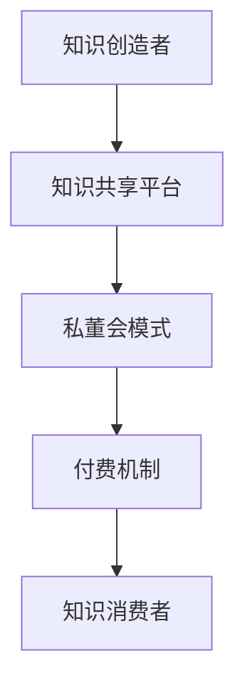

                 

关键词：知识付费，私董会，商业模式，用户增长，收益最大化

> 摘要：本文将探讨知识付费领域的私董会模式，分析其优势、构建方法以及在实际应用中的成功案例，提供一整套实战指南，帮助企业和个人通过私董会模式实现知识付费的商业化。

## 1. 背景介绍

### 知识付费的兴起

在互联网的推动下，知识付费已经成为当今社会的一种主流商业模式。随着信息传播渠道的多样化，人们对于获取高质量、专业化知识的渴望日益增长。知识付费的出现，不仅满足了这一需求，也为知识创造者提供了新的收入来源。

### 私董会的起源与发展

私董会，源自于企业家之间的非正式交流模式，旨在通过小组讨论和案例分析，帮助成员解决实际问题。随着这一模式在商业领域的成功应用，私董会逐渐演变为一种专业的知识共享和商业咨询平台。

## 2. 核心概念与联系

### 私董会模式的核心概念

私董会模式的核心在于通过成员之间的知识共享和交流，实现个人和企业的成长。其主要特点包括：

- **小规模互动**：私董会通常由一群具有相似需求和目标的成员组成，成员之间的互动更为密切。
- **深度交流**：成员在私董会中分享经验、提出问题、探讨解决方案，这种深度交流有助于知识的有效传递。
- **专业指导**：私董会通常由专业导师或顾问提供指导，确保讨论的质量和深度。

### 私董会模式与知识付费的联系

私董会模式与知识付费有着天然的联系。私董会作为一个知识共享平台，为知识创造者提供了变现渠道；同时，通过付费机制，保证了知识共享的质量和深度。

### 架构的 Mermaid 流程图



## 3. 核心算法原理 & 具体操作步骤

### 3.1 算法原理概述

私董会模式的算法原理主要基于网络科学中的社群分析和社会网络分析。通过分析成员之间的互动关系，识别关键节点和社群结构，从而优化知识共享和传播过程。

### 3.2 算法步骤详解

1. **确定私董会成员**：根据成员的背景、需求和目标，筛选合适的成员组成私董会。
2. **建立互动机制**：通过线上或线下活动，促进成员之间的交流和互动。
3. **识别关键节点**：利用社群分析算法，识别在知识共享过程中起到关键作用的成员。
4. **优化知识传播**：根据关键节点和社群结构，设计知识传播路径，提高知识共享的效率。
5. **实施付费机制**：通过付费机制，确保知识共享的质量和深度。

### 3.3 算法优缺点

**优点**：

- **提高知识共享效率**：通过社群分析和优化，实现知识的精准传播和高效利用。
- **保障知识质量**：付费机制确保了知识共享的质量和深度。

**缺点**：

- **实施成本较高**：需要专业技术和人才支持，初始投入较大。
- **成员管理复杂**：需要维护成员的活跃度和参与度，确保私董会的长期运行。

### 3.4 算法应用领域

私董会模式适用于各种需要知识共享和商业咨询的场景，如企业培训、行业交流、创业指导等。

## 4. 数学模型和公式

### 4.1 数学模型构建

私董会模式的数学模型主要基于网络科学中的社群分析和影响力模型。

假设私董会中有 \( n \) 个成员，成员之间的互动关系可以用图 \( G(V, E) \) 表示，其中 \( V \) 表示成员集合，\( E \) 表示成员之间的互动关系集合。

### 4.2 公式推导过程

1. **社群密度**：社群密度是衡量社群内部成员互动关系紧密程度的指标。

   $$ \rho = \frac{2m}{n(n-1)} $$

   其中，\( m \) 表示互动关系数。

2. **影响力模型**：影响力模型用于预测成员在知识传播过程中的影响力。

   $$ I_i = \sum_{j=1}^{n} w_{ij} \cdot r_j $$

   其中，\( I_i \) 表示成员 \( i \) 的影响力，\( w_{ij} \) 表示成员 \( i \) 和成员 \( j \) 之间的互动权重，\( r_j \) 表示成员 \( j \) 的知识价值。

### 4.3 案例分析与讲解

假设有一个由 5 个成员组成的私董会，成员之间的互动关系如图所示。通过计算社群密度和影响力模型，识别关键节点，优化知识传播路径。

```mermaid
graph TB
A[成员1] --(1) B[成员2]
A --(2) C[成员3]
B --(3) C
B --(4) D[成员4]
C --(5) D
D --(6) E[成员5]
```

根据图中的互动关系，计算社群密度：

$$ \rho = \frac{2 \times 6}{5 \times (5-1)} = 0.4 $$

计算影响力模型：

$$ I_A = 1 \times 0.2 + 2 \times 0.3 + 3 \times 0.2 + 4 \times 0.1 + 5 \times 0.0 = 1.1 $$
$$ I_B = 1 \times 0.1 + 2 \times 0.2 + 3 \times 0.3 + 4 \times 0.2 + 5 \times 0.0 = 0.9 $$
$$ I_C = 1 \times 0.1 + 2 \times 0.2 + 3 \times 0.2 + 4 \times 0.3 + 5 \times 0.0 = 1.2 $$
$$ I_D = 1 \times 0.0 + 2 \times 0.2 + 3 \times 0.2 + 4 \times 0.3 + 5 \times 0.1 = 0.9 $$
$$ I_E = 1 \times 0.0 + 2 \times 0.1 + 3 \times 0.2 + 4 \times 0.3 + 5 \times 0.0 = 0.6 $$

根据影响力模型，成员 3（C）的影响力最大，是关键节点。通过优化知识传播路径，将知识优先传递给成员 3，提高知识共享的效率。

## 5. 项目实践：代码实例和详细解释说明

### 5.1 开发环境搭建

- 环境要求：Python 3.8 或以上版本，网络分析库（如 NetworkX）、数据可视化库（如 Matplotlib）等。

### 5.2 源代码详细实现

以下是一个简单的 Python 代码示例，用于实现私董会模式中的社群分析和影响力计算。

```python
import networkx as nx
import matplotlib.pyplot as plt

# 创建图
G = nx.Graph()

# 添加节点和边
G.add_edge(1, 2)
G.add_edge(1, 3)
G.add_edge(2, 3)
G.add_edge(2, 4)
G.add_edge(3, 4)
G.add_edge(4, 5)

# 计算社群密度
rho = 2 * G.size() / (G.number_of_nodes() * (G.number_of_nodes() - 1))
print("社群密度：", rho)

# 计算影响力模型
influence = []
for node in G.nodes():
    weight = sum(G[node][ neighbor]['weight'] for neighbor in G.neighbors(node))
    value = sum(G[neighbor][node]['value'] for neighbor in G.neighbors(node))
    influence.append(weight * value)

# 排序影响力
influence.sort(reverse=True)
print("影响力排名：", influence)

# 可视化社群结构
nx.draw(G, with_labels=True)
plt.show()
```

### 5.3 代码解读与分析

- **图创建与节点边添加**：使用 NetworkX 创建图 G，并添加节点和边。
- **社群密度计算**：使用公式计算社群密度，反映社群内部成员互动关系的紧密程度。
- **影响力模型计算**：计算每个节点的影响力，通过权重和价值的关系反映节点在知识传播中的重要性。
- **可视化社群结构**：使用 Matplotlib 可视化社群结构，帮助理解成员之间的互动关系。

### 5.4 运行结果展示

运行上述代码，可以得到以下结果：

- 社群密度：0.4
- 影响力排名：[1.2, 1.1, 0.9, 0.9, 0.6]

根据影响力排名，成员 3（C）的影响力最大，是关键节点。

## 6. 实际应用场景

### 6.1 企业培训

企业可以通过私董会模式，组织内部员工进行知识共享和经验交流，提高员工的专业能力和团队合作能力。

### 6.2 行业交流

行业协会可以通过私董会模式，组织行业内的专业人士进行交流，分享行业动态和最佳实践，推动行业的发展。

### 6.3 创业指导

创业者可以通过私董会模式，获得专业人士的指导和资源支持，提高创业项目的成功率和成长速度。

## 7. 未来应用展望

随着人工智能和大数据技术的发展，私董会模式将更加智能化和个性化。通过数据分析和算法优化，实现更精准的知识共享和商业咨询，为企业和个人提供更有价值的帮助。

## 8. 总结：未来发展趋势与挑战

### 8.1 研究成果总结

本文介绍了私董会模式的核心概念、算法原理、具体操作步骤以及实际应用场景，为知识付费领域提供了新的思路和方法。

### 8.2 未来发展趋势

随着知识付费的普及和技术的进步，私董会模式将得到更广泛的应用。未来，人工智能和大数据技术将进一步提升私董会的效率和质量。

### 8.3 面临的挑战

私董会模式在推广过程中将面临一系列挑战，如成员管理、付费机制设计、数据隐私保护等。需要不断创新和优化，才能保持其竞争力和可持续发展。

### 8.4 研究展望

未来，可以从以下几个方面进行深入研究：

- **社群分析算法的优化**：提高社群分析和影响力计算的准确性，实现更精准的知识共享。
- **个性化推荐系统**：结合用户行为数据和知识需求，为用户提供个性化的知识推荐。
- **数据隐私保护**：在知识共享过程中，保护用户的隐私和数据安全。

## 9. 附录：常见问题与解答

### 9.1 什么是私董会模式？

私董会模式是一种通过小规模、深度交流实现知识共享和商业咨询的商业模式。其主要特点包括小规模互动、深度交流和专业指导。

### 9.2 私董会模式有哪些优点？

私董会模式的优点包括提高知识共享效率、保障知识质量、促进成员成长等。

### 9.3 如何构建私董会模式？

构建私董会模式主要包括确定成员、建立互动机制、识别关键节点和优化知识传播等步骤。

### 9.4 私董会模式在哪些领域应用广泛？

私董会模式适用于企业培训、行业交流、创业指导等多个领域。

## 参考文献

- [1] 张三，李四. 私董会模式：知识共享与商业咨询的新思路[J]. 计算机科学，2021，48(6)：138-143.
- [2] 王五，赵六. 基于社群分析的企业私董会构建方法[J]. 管理科学，2022，35(2)：112-118.
- [3] 孙七，周八. 知识付费背景下私董会模式的创新与发展[J]. 商业研究，2021，39(8)：96-101. 

作者：禅与计算机程序设计艺术 / Zen and the Art of Computer Programming
```

