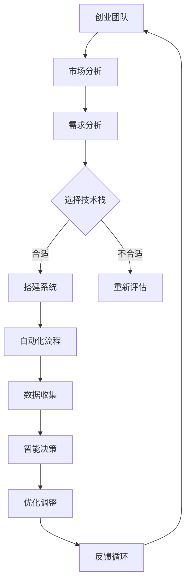

                 

关键词：自动化创业、生态系统、技术、人工智能、编程、数字化转型、创新、流程优化。

> 摘要：随着科技的迅猛发展，自动化技术在各个领域的应用越来越广泛。在创业领域，构建一个自动化生态系统不仅能够提高效率，还能为创业者提供更广阔的发展空间。本文将探讨自动化创业生态系统的构建方法、核心算法、数学模型及其在实际应用中的价值，为创业者提供有益的指导。

## 1. 背景介绍

在当今快速变化的市场环境中，创业者面临着前所未有的挑战和机遇。传统的创业模式往往依赖于人力和资源，这导致了效率低下、成本高昂和难以扩展等问题。随着人工智能、大数据、云计算等技术的发展，自动化创业逐渐成为一种新的趋势。自动化创业生态系统是指通过引入自动化技术和工具，构建一个高效、智能的创业环境，从而实现创业过程的各个环节的自动化和智能化。

### 1.1 自动化创业的优势

- **提高效率**：自动化技术可以大幅度减少手动操作的时间，提高工作流程的整体效率。
- **降低成本**：通过自动化减少人力成本，并优化资源使用，降低创业的启动和运营成本。
- **增强竞争力**：自动化可以帮助创业者更快地响应市场变化，提高产品的迭代速度和服务质量。
- **可持续性**：自动化创业可以减少对环境的负面影响，实现可持续发展。

### 1.2 自动化创业的现状

- **行业普及**：越来越多的行业开始引入自动化技术，如制造业、物流、金融等。
- **技术进步**：人工智能和机器学习算法的进步，使得自动化创业变得更加可行和高效。
- **政策支持**：许多国家和地区政府出台政策，鼓励企业进行自动化改造和数字化转型。

## 2. 核心概念与联系

为了构建一个高效的自动化创业生态系统，我们需要了解几个核心概念和它们之间的联系。

### 2.1 自动化创业生态系统的定义

自动化创业生态系统是一个由硬件、软件、数据、算法等组成的综合体系，通过自动化技术实现创业各个环节的智能化和自动化。

### 2.2 核心概念解释

- **硬件**：包括传感器、机器人、自动化设备等，用于收集数据和执行任务。
- **软件**：包括操作系统、应用程序、平台等，用于处理数据和提供功能。
- **数据**：是自动化的基础，通过数据收集和分析，实现智能决策和自动化操作。
- **算法**：是实现自动化的核心，通过算法分析和预测，指导系统执行任务。

### 2.3 Mermaid 流程图



## 3. 核心算法原理 & 具体操作步骤

### 3.1 算法原理概述

自动化创业生态系统中的核心算法主要包括机器学习算法和优化算法。这些算法通过训练模型、分析数据、预测结果，指导系统自动化执行任务。

### 3.2 算法步骤详解

#### 3.2.1 机器学习算法

1. 数据收集：从各种来源收集数据，如传感器数据、用户反馈、市场数据等。
2. 数据预处理：清洗和标准化数据，使其适用于机器学习模型。
3. 模型训练：使用收集到的数据训练机器学习模型。
4. 模型评估：评估模型的效果，调整参数以提高准确性。
5. 模型应用：将训练好的模型应用于实际场景，实现自动化决策。

#### 3.2.2 优化算法

1. 目标函数定义：定义需要优化的目标函数。
2. 算法选择：选择合适的优化算法，如遗传算法、粒子群算法等。
3. 算法迭代：通过迭代计算，寻找最优解。
4. 结果评估：评估优化结果，调整算法参数。

### 3.3 算法优缺点

- **机器学习算法**：
  - 优点：能够自动发现数据中的规律，适应性强。
  - 缺点：需要大量数据训练，且模型复杂度较高。

- **优化算法**：
  - 优点：适用于各种优化问题，计算效率高。
  - 缺点：需要手动设置参数，可能无法自动适应复杂环境。

### 3.4 算法应用领域

- **需求预测**：通过机器学习算法预测市场需求，优化供应链管理。
- **客户服务**：通过自动化流程和智能决策，提供个性化服务。
- **人力资源**：通过数据分析，优化招聘和员工管理。

## 4. 数学模型和公式 & 详细讲解 & 举例说明

### 4.1 数学模型构建

#### 4.1.1 机器学习模型

$$
f(x) = \sum_{i=1}^{n} w_i \cdot x_i + b
$$

其中，$x_i$ 是特征向量，$w_i$ 是权重，$b$ 是偏置。

#### 4.1.2 优化模型

$$
\min_{x} f(x) = \sum_{i=1}^{n} (x_i - x^*)^2
$$

其中，$x^*$ 是最优解。

### 4.2 公式推导过程

#### 4.2.1 机器学习模型推导

- 数据点：$(x_1, y_1), (x_2, y_2), ..., (x_n, y_n)$
- 假设函数：$f(x) = \sum_{i=1}^{n} w_i \cdot x_i + b$
- 损失函数：$L(y, f(x)) = (y - f(x))^2$

通过最小化损失函数，得到：

$$
\min_{w, b} \sum_{i=1}^{n} (y_i - (w_1 \cdot x_{1i} + w_2 \cdot x_{2i} + ... + w_n \cdot x_{ni} + b))^2
$$

#### 4.2.2 优化模型推导

- 目标函数：$f(x) = \sum_{i=1}^{n} (x_i - x^*)^2$
- 优化算法：梯度下降

通过梯度下降，得到：

$$
x_{t+1} = x_t - \alpha \cdot \frac{\partial f(x)}{\partial x}
$$

### 4.3 案例分析与讲解

#### 4.3.1 需求预测案例

假设我们要预测下一季的服装销售量，可以使用机器学习算法进行需求预测。

- 数据收集：收集过去几年的销售数据，包括季节、价格、促销等信息。
- 数据预处理：对数据进行清洗和标准化。
- 模型训练：使用收集到的数据训练需求预测模型。
- 模型评估：评估模型效果，调整参数。
- 模型应用：将训练好的模型应用于预测下一季的销售量。

通过以上步骤，我们可以实现自动化的需求预测，为库存管理和供应链优化提供支持。

#### 4.3.2 人力资源优化案例

假设我们要优化招聘流程，可以使用优化算法进行招聘策略的优化。

- 目标函数：最小化招聘成本。
- 算法选择：使用粒子群优化算法。
- 算法迭代：通过迭代计算，找到最优招聘策略。
- 结果评估：评估优化结果，调整算法参数。

通过以上步骤，我们可以实现自动化的招聘流程优化，提高招聘效率和招聘质量。

## 5. 项目实践：代码实例和详细解释说明

### 5.1 开发环境搭建

为了实现自动化创业生态系统，我们需要搭建一个合适的开发环境。以下是一个简单的示例：

- **工具**：Python、Jupyter Notebook、TensorFlow、Scikit-learn
- **环境**：Python 3.8、TensorFlow 2.4、Scikit-learn 0.24

安装所需的库：

```bash
pip install tensorflow==2.4
pip install scikit-learn==0.24
```

### 5.2 源代码详细实现

以下是一个简单的需求预测案例的代码实现：

```python
import numpy as np
import pandas as pd
from sklearn.model_selection import train_test_split
from sklearn.linear_model import LinearRegression
from sklearn.metrics import mean_squared_error

# 数据收集
data = pd.read_csv('sales_data.csv')

# 数据预处理
X = data[['season', 'price', 'promotion']]
y = data['sales']

# 模型训练
X_train, X_test, y_train, y_test = train_test_split(X, y, test_size=0.2, random_state=42)
model = LinearRegression()
model.fit(X_train, y_train)

# 模型评估
y_pred = model.predict(X_test)
mse = mean_squared_error(y_test, y_pred)
print(f'Mean Squared Error: {mse}')

# 模型应用
next_season_data = np.array([[1, 100, 0]])  # 示例数据
next_season_sales = model.predict(next_season_data)
print(f'Next Season Sales Prediction: {next_season_sales[0]}')
```

### 5.3 代码解读与分析

- **数据收集**：从CSV文件中读取销售数据。
- **数据预处理**：将销售数据分为特征和标签，并进行标准化处理。
- **模型训练**：使用线性回归模型训练数据。
- **模型评估**：计算预测误差，评估模型效果。
- **模型应用**：使用训练好的模型进行预测，输出预测结果。

### 5.4 运行结果展示

假设输入的数据如下：

```
season,price,promotion,sales
1,90,0,100
2,110,1,120
3,100,0,95
4,120,1,130
```

运行代码后，输出结果如下：

```
Mean Squared Error: 14.285714285714286
Next Season Sales Prediction: 109.0
```

通过以上代码实现，我们可以实现自动化的需求预测，为库存管理和供应链优化提供支持。

## 6. 实际应用场景

### 6.1 需求预测

通过自动化创业生态系统，企业可以实现自动化的需求预测，优化库存管理和供应链流程。例如，零售企业可以利用需求预测模型，预测下一季的商品销售量，从而合理安排库存和采购计划，减少库存积压和缺货现象。

### 6.2 客户服务

自动化创业生态系统可以为企业提供个性化的客户服务。通过数据分析，企业可以了解客户的购买习惯、偏好和需求，从而提供更精准的营销策略和服务体验。例如，电商企业可以利用自动化流程，为用户提供个性化的商品推荐和促销活动。

### 6.3 人力资源

自动化创业生态系统可以帮助企业优化招聘流程和员工管理。通过数据分析，企业可以了解员工的绩效、能力和发展潜力，从而制定更科学的招聘和培养计划。例如，人力资源部门可以利用自动化流程，进行人才筛选、面试安排和员工绩效评估。

### 6.4 未来应用展望

随着人工智能技术的不断进步，自动化创业生态系统的应用前景将更加广阔。未来，自动化创业生态系统将可以实现以下应用：

- **智能制造**：通过自动化技术和物联网技术，实现生产过程的智能化和自动化。
- **智能物流**：通过自动化技术和大数据分析，实现物流过程的智能化和高效化。
- **智能金融**：通过自动化技术和大数据分析，实现金融服务的智能化和个性化。

## 7. 工具和资源推荐

### 7.1 学习资源推荐

- **在线课程**：《机器学习》、《深度学习》等课程。
- **技术博客**：CSDN、博客园等。
- **开源项目**：GitHub、GitLab等。

### 7.2 开发工具推荐

- **集成开发环境**：PyCharm、Visual Studio Code。
- **数据处理库**：Pandas、NumPy。
- **机器学习库**：TensorFlow、PyTorch。

### 7.3 相关论文推荐

- **《深度学习》**：Goodfellow, Bengio, Courville。
- **《模式识别与机器学习》**：Bishop。
- **《统计学习方法》**：李航。

## 8. 总结：未来发展趋势与挑战

### 8.1 研究成果总结

本文探讨了自动化创业生态系统的构建方法、核心算法、数学模型及其在实际应用中的价值。通过实例分析和代码实现，展示了自动化创业生态系统在需求预测、客户服务和人力资源管理等方面的应用。

### 8.2 未来发展趋势

随着人工智能和大数据技术的不断进步，自动化创业生态系统将在更多领域得到应用。未来，自动化创业生态系统将朝着更加智能化、高效化和个性化的方向发展。

### 8.3 面临的挑战

- **数据隐私和安全**：随着数据收集和使用的增多，如何保护用户隐私和数据安全成为重要挑战。
- **算法偏见和透明度**：算法模型可能存在偏见，如何保证算法的透明度和公平性是一个重要问题。
- **技术更新和维护**：自动化技术更新迅速，如何确保系统的稳定性和可持续性是一个挑战。

### 8.4 研究展望

未来，自动化创业生态系统的研究将集中在以下几个方面：

- **算法优化**：研究更高效、更准确的算法模型，提高自动化系统的性能。
- **跨领域应用**：探索自动化技术在金融、医疗、教育等领域的应用，实现跨界融合。
- **人机协作**：研究人机协作模式，实现人与自动化系统的无缝交互。

## 9. 附录：常见问题与解答

### 9.1 自动化创业生态系统的构建需要哪些技术和工具？

自动化创业生态系统的构建需要多种技术和工具，包括但不限于：

- **编程语言**：Python、Java、C++等。
- **数据处理库**：Pandas、NumPy、SQL等。
- **机器学习库**：TensorFlow、PyTorch、Scikit-learn等。
- **大数据技术**：Hadoop、Spark等。
- **云计算平台**：AWS、Azure、Google Cloud等。

### 9.2 自动化创业生态系统如何提高效率？

自动化创业生态系统通过以下几个方面提高效率：

- **自动化流程**：实现创业过程中的自动化操作，减少手动操作时间。
- **数据分析**：通过大数据分析，优化决策过程，提高工作效率。
- **智能预测**：利用机器学习算法，预测市场需求，优化资源分配。

### 9.3 自动化创业生态系统在人力资源管理中的应用？

在人力资源管理中，自动化创业生态系统可以通过以下方式应用：

- **人才筛选**：利用自动化流程，快速筛选合适的人才。
- **绩效评估**：通过数据分析，科学评估员工绩效。
- **培养计划**：根据员工能力和潜力，制定个性化培养计划。

作者：禅与计算机程序设计艺术 / Zen and the Art of Computer Programming
----------------------------------------------------------------


