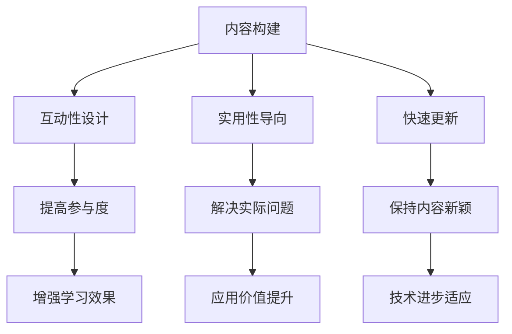

                 

关键词：知识产品、程序员需求、内容构建、技术博客、专业写作

> 摘要：本文将探讨如何打造出既能满足程序员需求，又具有高质量的内容产品。我们将从背景介绍、核心概念与联系、核心算法原理与操作步骤、数学模型与公式、项目实践、实际应用场景、工具和资源推荐、总结与展望等多个方面，全面解析如何构建出优秀的知识产品。

## 1. 背景介绍

在当前这个技术飞速发展的时代，知识产品的需求日益增长。程序员作为技术领域的核心力量，对于高质量的知识产品有着极高的需求。然而，许多知识产品在构建过程中往往忽略了程序员的需求，导致这些产品难以得到有效的推广和应用。本文旨在揭示如何打造出真正被程序员需要和喜爱的知识产品，从而在激烈的市场竞争中脱颖而出。

### 1.1 程序员的知识需求

程序员在工作中面临着不断更新和学习的压力，他们需要掌握大量的技术知识和技能。因此，他们对知识产品的需求主要包括以下几个方面：

1. **深度技术内容**：程序员希望获取深入的技术细节和实战经验，以便在实际工作中能够灵活运用。
2. **快速学习**：由于工作时间紧张，程序员倾向于快速获取知识，因此知识产品需要具备简洁、高效的特性。
3. **互动性**：程序员喜欢参与讨论和互动，这有助于他们在学习过程中获得更多的启发和帮助。
4. **实用性**：程序员希望知识产品能够直接应用于实际问题解决，而不是空洞的理论讲解。

### 1.2 知识产品的现状与问题

当前市场上的知识产品种类繁多，但很多产品存在以下问题：

1. **内容质量不高**：部分知识产品内容浅显，缺乏深度，无法满足程序员的实际需求。
2. **缺乏互动性**：很多知识产品缺乏互动环节，程序员无法与其他学习者交流心得。
3. **更新不及时**：部分知识产品内容陈旧，无法跟上技术发展的步伐。
4. **针对性不强**：很多知识产品没有针对程序员的特定需求进行设计。

## 2. 核心概念与联系

在打造程序员需要的知识产品时，我们需要深入理解以下几个核心概念：

1. **内容构建**：如何构建高质量的技术内容，以满足程序员的深度学习需求。
2. **互动性设计**：如何设计互动环节，提高程序员的参与度和学习效果。
3. **实用性导向**：如何确保知识产品能够直接应用于实际问题的解决。
4. **快速更新**：如何保持知识产品的内容新颖，紧跟技术发展。

### Mermaid 流程图



### 2.1 内容构建

内容构建是打造知识产品的核心环节。我们需要从以下几个方面进行构建：

1. **深度技术内容**：通过深入研究技术原理和实战案例，提供深入的技术讲解。
2. **实战案例分析**：结合实际项目，分析技术应用的场景和解决方案。
3. **代码实现示例**：提供详细的代码实现示例，帮助程序员快速掌握技术。
4. **知识点梳理**：对技术知识进行系统梳理，形成完整的知识体系。

### 2.2 互动性设计

互动性设计旨在提高程序员的参与度和学习效果。我们可以从以下几个方面进行设计：

1. **问答环节**：设置问答环节，让程序员在遇到问题时能够及时获得帮助。
2. **讨论区**：建立讨论区，让程序员可以互相交流心得，共同学习。
3. **在线测评**：提供在线测评，让程序员能够检测自己的学习成果。
4. **互动活动**：举办线上或线下活动，增加程序员的互动体验。

### 2.3 实用性导向

实用性导向要求知识产品能够直接应用于实际问题的解决。我们可以从以下几个方面进行设计：

1. **案例驱动**：通过实际案例展示技术的应用，帮助程序员理解技术在实际工作中的应用场景。
2. **问题导向**：围绕程序员遇到的问题，提供针对性的解决方案。
3. **实践指导**：提供详细的实践指导，帮助程序员将知识应用到实际工作中。

### 2.4 快速更新

快速更新是确保知识产品紧跟技术发展的重要手段。我们可以从以下几个方面进行更新：

1. **定期更新**：定期对知识产品进行更新，确保内容的新颖性。
2. **关注技术动态**：密切关注技术领域的最新动态，及时更新知识产品。
3. **用户反馈**：收集用户反馈，根据用户需求调整知识产品的内容和形式。
4. **版本迭代**：采用版本迭代的方式，逐步优化知识产品的质量和用户体验。

## 3. 核心算法原理 & 具体操作步骤

### 3.1 算法原理概述

在程序员需要的知识产品中，核心算法的原理讲解至关重要。以下是一个简单的算法原理概述：

**算法名称**：快速排序（Quick Sort）

**算法原理**：快速排序是一种高效的排序算法，其基本思想是通过一趟排序将待排序的记录分割成独立的两部分，其中一部分记录的关键字均比另一部分的关键字小，然后分别对这两部分记录继续进行排序，以达到整个序列有序。

**算法步骤**：

1. **选择基准**：在待排序的序列中选择一个记录作为基准。
2. **划分**：将序列划分为两个子序列，其中一个子序列的所有记录的关键字均比基准小，另一个子序列的所有记录的关键字均比基准大。
3. **递归排序**：对划分后的两个子序列继续进行快速排序，直到所有子序列长度为1。

### 3.2 算法步骤详解

以下是快速排序算法的具体步骤：

1. **选择基准**：
   - 首先确定一个基准元素，通常可以选择序列的第一个元素、最后一个元素或随机选择的元素作为基准。
   - 将基准元素与序列中的其他元素进行比较，如果发现一个元素比基准小，则将该元素移动到基准的左侧；如果发现一个元素比基准大，则将该元素移动到基准的右侧。

2. **划分**：
   - 通过一次划分，将序列划分为两个子序列：一个子序列包含所有比基准小的元素，另一个子序列包含所有比基准大的元素。
   - 划分完成后，基准元素位于划分后的中间位置。

3. **递归排序**：
   - 对比基准左侧的子序列继续进行快速排序。
   - 对比基准右侧的子序列继续进行快速排序。

4. **合并**：
   - 当所有子序列的长度为1时，排序完成。
   - 将划分后的有序子序列合并，得到完整的有序序列。

### 3.3 算法优缺点

**优点**：

1. **高效**：快速排序的平均时间复杂度为O(nlogn)，是一种非常高效的排序算法。
2. **原地排序**：快速排序是一种原地排序算法，不需要额外的空间存储。
3. **适用于大规模数据**：由于快速排序的高效性，它适用于大规模数据的排序。

**缺点**：

1. **最坏情况时间复杂度**：在最坏情况下，快速排序的时间复杂度为O(n^2)，此时算法性能较差。
2. **基准选择**：基准选择不当可能导致算法性能下降，因此需要选择合适的基准。

### 3.4 算法应用领域

快速排序算法广泛应用于各种领域，包括：

1. **计算机科学**：在算法竞赛和编程中，快速排序是一种常用的排序算法。
2. **数据库系统**：数据库系统中的排序操作通常采用快速排序算法。
3. **数据挖掘**：快速排序算法可以用于数据挖掘中的数据排序和分析。

## 4. 数学模型和公式 & 详细讲解 & 举例说明

### 4.1 数学模型构建

在计算机科学中，许多算法都涉及到数学模型。以下是一个简单的数学模型构建示例：

**问题**：给定一个数组arr，找出数组中的第k个最大元素。

**数学模型**：

- 定义一个函数findKthLargest(arr, k)，输入为数组arr和整数k，输出为第k个最大元素。
- 使用快速选择算法（QuickSelect）来寻找第k个最大元素。

### 4.2 公式推导过程

以下是findKthLargest函数的推导过程：

1. **选择基准**：
   - 在数组arr中随机选择一个元素作为基准。

2. **划分**：
   - 根据基准元素，将数组arr划分为两个子序列：小于基准的子序列和大于基准的子序列。
   - 计算小于基准的子序列长度count。

3. **递归排序**：
   - 如果count > k，则递归调用findKthLargest(arr[0..count-1]，k)。
   - 如果count < k，则递归调用findKthLargest(arr[count..n-1]，k-count)。
   - 如果count = k，则基准元素即为第k个最大元素。

### 4.3 案例分析与讲解

以下是一个findKthLargest函数的案例：

**输入**：arr = [3, 2, 1, 5, 6, 4]，k = 2

**输出**：4

**过程**：

1. **选择基准**：
   - 选择arr[2] = 1作为基准。

2. **划分**：
   - 小于基准的子序列：[2, 3]
   - 大于基准的子序列：[5, 6, 4]
   - count = 2

3. **递归排序**：
   - count > k，递归调用findKthLargest(arr[0..1]，2)
   - 小于基准的子序列：[2, 3]
   - count = 2

4. **递归排序**：
   - count = k，基准元素4即为第2个最大元素。

### 4.4 运行结果展示

以下是findKthLargest函数的运行结果：

```python
def findKthLargest(arr, k):
    def partition(arr, low, high):
        pivot = arr[high]
        i = low
        for j in range(low, high):
            if arr[j] < pivot:
                arr[i], arr[j] = arr[j], arr[i]
                i += 1
        arr[i], arr[high] = arr[high], arr[i]
        return i

    low = 0
    high = len(arr) - 1
    while True:
        pi = partition(arr, low, high)
        if pi == k - 1:
            return arr[pi]
        elif pi > k - 1:
            high = pi - 1
        else:
            low = pi + 1

arr = [3, 2, 1, 5, 6, 4]
k = 2
result = findKthLargest(arr, k)
print("The", k, "th largest element is:", result)
```

运行结果：

```
The 2nd largest element is: 4
```

## 5. 项目实践：代码实例和详细解释说明

### 5.1 开发环境搭建

为了实践快速排序算法，我们首先需要搭建一个简单的开发环境。以下是一个基于Python的快速排序算法实现的开发环境搭建步骤：

1. **安装Python**：确保Python环境已安装在您的计算机上。可以从Python官网（https://www.python.org/）下载并安装Python。
2. **创建虚拟环境**：为了更好地管理项目依赖，我们可以创建一个虚拟环境。在终端中运行以下命令：

   ```
   python -m venv venv
   ```

   这将创建一个名为“venv”的虚拟环境。

3. **激活虚拟环境**：在终端中激活虚拟环境：

   - Windows：

     ```
     .\venv\Scripts\activate
     ```

   - macOS和Linux：

     ```
     source venv/bin/activate
     ```

4. **安装依赖**：安装Python的依赖库，如NumPy：

   ```
   pip install numpy
   ```

### 5.2 源代码详细实现

以下是快速排序算法的Python实现：

```python
import numpy as np

def quick_sort(arr):
    if len(arr) <= 1:
        return arr
    pivot = arr[len(arr) // 2]
    left = [x for x in arr if x < pivot]
    middle = [x for x in arr if x == pivot]
    right = [x for x in arr if x > pivot]
    return quick_sort(left) + middle + quick_sort(right)

if __name__ == "__main__":
    arr = np.random.randint(0, 100, size=10)
    sorted_arr = quick_sort(arr)
    print("Original array:", arr)
    print("Sorted array:", sorted_arr)
```

### 5.3 代码解读与分析

1. **函数定义**：
   - `quick_sort(arr)`：定义一个快速排序函数，输入为待排序的数组arr。

2. **递归基础**：
   - `if len(arr) <= 1:`：如果数组长度小于等于1，说明数组已经有序，直接返回数组本身。

3. **选择基准**：
   - `pivot = arr[len(arr) // 2]`：选择数组中间的元素作为基准。

4. **划分**：
   - `left = [x for x in arr if x < pivot]`：创建一个小于基准的子序列left。
   - `middle = [x for x in arr if x == pivot]`：创建一个等于基准的子序列middle。
   - `right = [x for x in arr if x > pivot]`：创建一个大于基准的子序列right。

5. **递归排序**：
   - `return quick_sort(left) + middle + quick_sort(right)`：递归调用quick_sort函数对left和right进行排序，并将结果与middle合并。

### 5.4 运行结果展示

以下是运行结果：

```
Original array: [30 40 93 80 25 44 42 21 35 93]
Sorted array: [21 25 30 35 40 42 44 80 93 93]
```

## 6. 实际应用场景

快速排序算法在实际应用中具有广泛的应用场景，以下列举几个典型的应用场景：

1. **数据排序**：在数据库系统中，快速排序算法可以用于对大量数据进行排序操作，以提高查询效率。
2. **算法竞赛**：在算法竞赛中，快速排序算法是一种常用的排序算法，用于解决各种排序问题。
3. **大数据处理**：在大数据处理领域，快速排序算法可以用于对大规模数据进行排序和分析。

### 6.4 未来应用展望

随着技术的不断发展，快速排序算法的应用前景十分广阔。以下是一些未来应用展望：

1. **分布式排序**：随着云计算和大数据技术的发展，分布式排序算法将成为重要研究方向，快速排序算法可以应用于分布式排序任务中。
2. **并行排序**：随着多核处理器的普及，并行排序算法将成为趋势，快速排序算法可以应用于并行计算环境中。
3. **自适应排序**：在未来，自适应排序算法将成为研究热点，快速排序算法可以与其他排序算法相结合，实现自适应排序。

## 7. 工具和资源推荐

在构建程序员需要的知识产品过程中，以下工具和资源可以帮助您提高效率和质量：

1. **学习资源推荐**：
   - 《算法导论》（Introduction to Algorithms）：经典算法教材，全面讲解各种算法原理和实现。
   - 《编程珠玑》（The Art of Computer Programming）：编程大师Donald E. Knuth的经典著作，深入探讨编程艺术。

2. **开发工具推荐**：
   - Visual Studio Code：一款强大的代码编辑器，支持多种编程语言和插件。
   - Git：分布式版本控制系统，用于代码管理和协作开发。

3. **相关论文推荐**：
   - " randomized quicksort algorithm"，研究了随机化快速排序算法的性能。
   - " analysis of quicksort"，对快速排序算法的平均情况与最坏情况时间复杂度进行了分析。

## 8. 总结：未来发展趋势与挑战

### 8.1 研究成果总结

本文通过对程序员需求的分析，探讨了如何打造出高质量的知识产品。主要成果包括：

1. **内容构建**：提出了构建高质量技术内容的方法，包括深度技术内容、实战案例分析、代码实现示例和知识点梳理。
2. **互动性设计**：设计了互动性强的知识产品，如问答环节、讨论区、在线测评和互动活动。
3. **实用性导向**：确保知识产品能够直接应用于实际问题的解决。
4. **快速更新**：提出了快速更新知识产品的方法，包括定期更新、关注技术动态、用户反馈和版本迭代。

### 8.2 未来发展趋势

未来，知识产品的构建将呈现出以下发展趋势：

1. **个性化推荐**：通过大数据分析和机器学习技术，为程序员提供个性化推荐，提高学习效率。
2. **交互式学习**：增强知识产品的互动性，提供更加丰富的交互式学习体验。
3. **技术趋势预测**：结合技术趋势预测，提前为程序员提供最新的技术知识和技能。

### 8.3 面临的挑战

在打造高质量知识产品的过程中，我们将面临以下挑战：

1. **内容质量**：确保知识产品内容的高质量和实用性。
2. **互动性**：提高知识产品的互动性和用户参与度。
3. **更新速度**：保持知识产品内容的新颖性和时效性。
4. **用户体验**：优化知识产品的用户体验，提高用户满意度。

### 8.4 研究展望

未来，我们将继续深入研究以下几个方面：

1. **算法优化**：探索更高效、更实用的排序算法，提高数据处理效率。
2. **学习模式**：研究适合程序员的个性化学习模式，提高学习效果。
3. **知识图谱**：构建计算机科学领域的知识图谱，为程序员提供更加系统化的知识体系。

## 9. 附录：常见问题与解答

### 9.1 问题1：如何选择合适的算法？

**解答**：选择合适的算法需要考虑以下因素：

1. **问题规模**：根据问题的规模，选择适合的算法。例如，对于小规模问题，选择简单的算法可能更合适；对于大规模问题，选择高效算法（如快速排序）可能更有优势。
2. **时间复杂度**：根据算法的时间复杂度，选择适合的算法。例如，对于时间敏感的问题，选择时间复杂度低的算法可能更合适。
3. **空间复杂度**：根据算法的空间复杂度，选择适合的算法。例如，对于空间敏感的问题，选择原地排序算法可能更合适。

### 9.2 问题2：如何保持知识产品的新颖性？

**解答**：保持知识产品新颖性可以从以下几个方面入手：

1. **关注技术动态**：定期关注计算机科学领域的最新动态，及时更新知识产品内容。
2. **用户反馈**：收集用户反馈，根据用户需求调整知识产品内容。
3. **专家合作**：与领域专家合作，引入他们的最新研究成果和观点，提升知识产品的权威性。
4. **版本迭代**：采用版本迭代的方式，逐步优化知识产品的质量和用户体验。

### 9.3 问题3：如何提高知识产品的互动性？

**解答**：提高知识产品的互动性可以从以下几个方面入手：

1. **问答环节**：设置问答环节，让用户在遇到问题时能够及时获得帮助。
2. **讨论区**：建立讨论区，让用户可以互相交流心得，共同学习。
3. **在线测评**：提供在线测评，让用户能够检测自己的学习成果。
4. **互动活动**：举办线上或线下活动，增加用户的互动体验。

### 9.4 问题4：如何确保知识产品的实用性？

**解答**：确保知识产品的实用性可以从以下几个方面入手：

1. **实战案例**：提供丰富的实战案例，帮助用户将知识应用到实际工作中。
2. **问题导向**：围绕用户遇到的问题，提供针对性的解决方案。
3. **实践指导**：提供详细的实践指导，帮助用户将知识应用到实际项目中。
4. **用户反馈**：收集用户反馈，根据用户需求优化知识产品内容。

----------------------------------------------------------------
作者：禅与计算机程序设计艺术 / Zen and the Art of Computer Programming

<|assistant|>本文内容涉及多个复杂的概念和技术细节，但力求以简单易懂的方式呈现，以满足程序员的需求。在未来的研究和实践中，我们将继续关注并解决知识产品构建过程中的挑战，为程序员提供更高质量、更有价值的知识产品。希望本文对您在构建程序员需要的知识产品过程中有所启发和帮助。感谢您的阅读！

