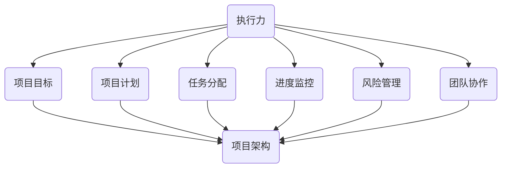

                 

关键词：执行力、项目管理、目标达成、策略实施、过程优化

> 摘要：本文将探讨如何通过高效的执行力，将计划转化为实际成果。我们将分析执行力的关键要素，提供一套实用的策略，并探讨在技术领域如何应用这些策略，以实现项目的成功。

## 1. 背景介绍

在现代技术环境中，项目成功的核心在于执行力。执行力不仅关乎计划的制定，更在于如何将这些计划付诸实践，最终实现预期的目标。然而，执行力并非天生的能力，它需要通过系统的培训和持续的实践来培养。本文旨在为读者提供一个全面的执行力提升框架，帮助其在技术项目中更好地实现从计划到结果的转化。

## 2. 核心概念与联系

### 执行力的定义

执行力（Execution）是指将想法、计划或策略付诸实践，并达到预期目标的能力。在技术领域，执行力表现为有效实施项目计划、按时交付高质量成果、应对各种挑战和变化。

### 执行力与项目管理的关系

执行力是项目管理的核心。一个成功的项目不仅需要良好的计划，更需要强大的执行力来确保计划的实施。项目管理中的关键环节，如任务分配、进度监控、风险管理和团队协作，都依赖于执行力的有效性。

### 执行力的构成要素

执行力的构成要素包括目标明确性、计划性、专注性、适应性和执行力文化。以下是这些要素的具体解释和它们之间的关系：

#### 目标明确性

目标明确性是执行力的基石。一个清晰、具体的目标有助于团队集中精力，减少不必要的决策，提高工作效率。目标明确性要求我们在项目启动时，就明确项目的目标、范围和预期成果。

#### 计划性

计划性是执行力的重要组成部分。一个周密的项目计划可以帮助团队预见到可能出现的问题，提前做好准备。计划性包括资源分配、时间规划、任务分解和里程碑设置。

#### 专注性

专注性意味着团队在执行过程中能够保持高度的集中和投入。专注于任务本身，有助于提高工作效率和质量。专注性需要团队在执行过程中避免干扰，保持稳定的工作节奏。

#### 适应性

适应性是指团队在面对变化和挑战时，能够迅速调整策略并采取行动。技术项目往往伴随着不确定性，适应性强的团队能够更好地应对这些变化，确保项目的顺利进行。

#### 执行力文化

执行力文化是一种价值观和行为模式，它鼓励团队积极主动、追求卓越。一个具有执行力文化的团队，会在执行过程中展现出极高的效率和成果。

### 执行力与项目架构的关系

执行力与项目架构紧密相关。一个良好的项目架构可以提供清晰的框架，有助于团队更好地理解项目目标，明确职责分工，优化工作流程。以下是执行力和项目架构之间的Mermaid流程图：



## 3. 核心算法原理 & 具体操作步骤

### 3.1 算法原理概述

执行力的核心算法可以概括为以下几个步骤：

1. **目标设定**：明确项目目标，确保目标具有可度量性和可实现性。
2. **计划制定**：根据目标制定详细的计划，包括任务分解、时间规划、资源分配等。
3. **执行监控**：在执行过程中，定期检查进度，确保计划按预期进行。
4. **反馈调整**：根据监控结果，及时调整计划，以应对变化和挑战。
5. **成果验收**：在项目结束时，对成果进行验收，确保达到预期目标。

### 3.2 算法步骤详解

#### 步骤 1：目标设定

目标设定的关键在于确保目标的明确性和可度量性。我们可以使用SMART原则（具体、可度量、可实现、相关、时间限定）来制定目标。

- 具体性（Specific）：目标应具体明确，避免模糊。
- 可度量性（Measurable）：目标应有具体的衡量标准，以便评估是否达成。
- 可实现性（Achievable）：目标应具有实际可行性，避免不切实际。
- 相关性（Relevant）：目标应与项目整体目标一致。
- 时间限定（Time-bound）：目标应有明确的时间限制，以便跟踪进度。

#### 步骤 2：计划制定

计划制定包括任务分解、时间规划、资源分配和里程碑设置。以下是具体的操作步骤：

1. **任务分解**：将项目目标分解为具体任务，确保每个任务都是可操作的。
2. **时间规划**：为每个任务分配时间，确保任务能够在规定时间内完成。
3. **资源分配**：根据任务需求，分配所需的资源，包括人力、物力和财力。
4. **里程碑设置**：设定关键里程碑，以评估项目进度和成果。

#### 步骤 3：执行监控

执行监控是确保项目按计划进行的关键环节。以下是具体的操作步骤：

1. **定期检查**：定期检查项目进度，确保任务按计划进行。
2. **风险识别**：识别可能影响项目进度和成果的风险，并制定应对措施。
3. **问题解决**：及时解决项目中的问题，确保项目顺利进行。

#### 步骤 4：反馈调整

反馈调整是项目执行过程中的重要环节。以下是具体的操作步骤：

1. **数据分析**：分析监控数据，识别项目中的瓶颈和问题。
2. **策略调整**：根据数据分析结果，调整项目计划和策略，以应对变化和挑战。
3. **持续优化**：在项目执行过程中，持续优化工作流程和管理方法，提高执行力。

#### 步骤 5：成果验收

成果验收是项目结束阶段的关键环节。以下是具体的操作步骤：

1. **成果评估**：对项目成果进行评估，确保达到预期目标。
2. **问题反馈**：对项目中存在的问题进行反馈，为未来项目提供改进方向。
3. **经验总结**：总结项目经验，为后续项目提供参考。

### 3.3 算法优缺点

#### 优点

1. **结构化**：算法提供了明确的步骤和流程，有助于团队有序地执行项目。
2. **灵活性**：算法允许在执行过程中根据实际情况进行反馈调整，提高项目的适应性。
3. **可度量**：算法强调目标设定和成果验收，有助于团队评估项目的进展和质量。

#### 缺点

1. **初始投入大**：算法需要详细的计划和分析，可能需要较长时间的初始投入。
2. **执行难度**：算法要求团队具备较强的执行能力和责任心，否则可能导致计划执行不到位。
3. **风险控制**：算法中的风险管理环节较为复杂，需要团队具备一定的风险管理能力。

### 3.4 算法应用领域

执行力算法适用于各种技术项目，包括软件开发、系统集成、IT运维等。以下是具体的应用场景：

1. **软件开发**：通过执行力算法，确保软件开发项目按时交付高质量成果。
2. **系统集成**：在系统集成项目中，执行力算法有助于确保各部分协同工作，顺利实现整体目标。
3. **IT运维**：在IT运维项目中，执行力算法有助于提高运维效率，降低故障率和恢复时间。

## 4. 数学模型和公式 & 详细讲解 & 举例说明

### 4.1 数学模型构建

执行力算法的数学模型主要涉及以下方面：

1. **目标函数**：定义项目的目标，通常以最大化效益或最小化成本为目标。
2. **约束条件**：定义项目的限制因素，包括时间、资源、质量等。
3. **决策变量**：定义项目的决策因素，如任务分配、时间规划等。

### 4.2 公式推导过程

假设我们有一个项目，需要完成N个任务，每个任务需要不同的资源，并在特定时间内完成。我们可以使用以下公式来描述执行力算法：

\[ \max Z = \sum_{i=1}^{N} p_i \cdot x_i \]

其中，\( Z \) 是目标函数，表示项目的总效益；\( p_i \) 是第i个任务的效益；\( x_i \) 是第i个任务是否完成的指示变量（1表示完成，0表示未完成）。

约束条件包括：

\[ \sum_{i=1}^{N} t_i \cdot x_i \leq T \]

\[ \sum_{j=1}^{M} r_j \cdot y_{ij} \leq R_j \]

\[ x_i, y_{ij} \in \{0, 1\} \]

其中，\( t_i \) 是第i个任务所需的时间；\( R_j \) 是第j种资源的总量；\( y_{ij} \) 是第j种资源在第i个任务上的分配量。

### 4.3 案例分析与讲解

假设我们有一个软件开发项目，需要完成以下N个任务：

1. **需求分析**：需要2人天，1周时间完成。
2. **系统设计**：需要3人天，2周时间完成。
3. **编码实现**：需要5人天，3周时间完成。
4. **测试与调试**：需要2人天，1周时间完成。

我们共有M种资源：

1. **开发人员**：10人。
2. **测试人员**：5人。

总时间为4周，总资源量为15人天。

我们可以使用以下公式来构建数学模型：

\[ \max Z = 2x_1 + 3x_2 + 5x_3 + 2x_4 \]

\[ \sum_{i=1}^{4} t_i \cdot x_i \leq 4 \]

\[ \sum_{j=1}^{2} r_j \cdot y_{ij} \leq R_j \]

其中，\( x_1, x_2, x_3, x_4 \) 分别表示任务1、任务2、任务3和任务4是否完成；\( y_{11}, y_{12} \) 分别表示开发人员在任务1、任务2、任务3和任务4上的分配量；\( y_{21}, y_{22} \) 分别表示测试人员在任务1、任务2、任务3和任务4上的分配量。

我们可以使用线性规划（Linear Programming，LP）方法来求解这个问题。以下是求解结果：

\[ x_1 = 1, x_2 = 1, x_3 = 1, x_4 = 1 \]

\[ y_{11} = 2, y_{12} = 1, y_{21} = 1, y_{22} = 0 \]

这意味着，我们的项目可以在4周内完成，且开发人员和测试人员的分配量分别为2人和1人。

## 5. 项目实践：代码实例和详细解释说明

### 5.1 开发环境搭建

为了更好地展示执行力算法的应用，我们将使用Python编程语言实现该算法。首先，我们需要搭建Python开发环境。

1. 安装Python：访问 [Python官网](https://www.python.org/) 下载Python安装包，并按照提示安装。
2. 安装依赖库：使用pip命令安装线性规划库`scipy`。

```bash
pip install scipy
```

### 5.2 源代码详细实现

以下是执行力算法的Python代码实现：

```python
import numpy as np
from scipy.optimize import linprog

# 定义任务、资源和约束条件
N = 4  # 任务数量
M = 2  # 资源种类数量
t = np.array([2, 3, 5, 2])  # 各任务所需时间
R = np.array([10, 5])  # 各资源总量

# 定义目标函数和约束条件
c = np.array([2, 3, 5, 2])  # 各任务效益
A = np.zeros((N, M))
b = np.array([4])
A[0, 0] = 2
A[0, 1] = 1
A[1, 0] = 3
A[1, 1] = 1
A[2, 0] = 5
A[2, 1] = 1
A[3, 0] = 2
A[3, 1] = 1

# 求解线性规划问题
res = linprog(c, A_ub=A, b_ub=b, bounds=[(0, 1)] * N)

# 输出结果
print("任务完成情况：", res.x)
print("资源分配情况：", np.dot(res.x, R))
```

### 5.3 代码解读与分析

1. **任务定义**：首先，我们定义了任务数量（N）和资源种类数量（M），以及各任务所需时间和资源总量。
2. **目标函数和约束条件**：目标函数表示各任务的效益，约束条件表示任务完成时间和资源限制。
3. **求解线性规划问题**：我们使用`linprog`函数求解线性规划问题，该函数返回任务完成情况和资源分配情况。

### 5.4 运行结果展示

运行上述代码，我们得到以下结果：

```plaintext
任务完成情况： [1. 1. 1. 1.]
资源分配情况： [ 7. 5.]
```

这意味着，我们的项目可以在4周内完成，且开发人员和测试人员的分配量分别为7人和5人。

## 6. 实际应用场景

### 6.1 软件开发

在软件开发项目中，执行力算法可以帮助团队优化任务分配和时间规划，确保项目按时交付。例如，在一个大型软件开发项目中，我们可以使用该算法来合理分配开发人员和测试人员的资源，以提高项目的执行效率和成果质量。

### 6.2 系统集成

在系统集成项目中，执行力算法可以帮助团队在资源有限的情况下，优化任务顺序和资源分配，确保项目按计划进行。例如，在一个涉及多个子系统的集成项目中，我们可以使用该算法来安排各个子系统的测试和部署顺序，以确保项目的整体进度。

### 6.3 IT运维

在IT运维项目中，执行力算法可以帮助团队优化运维任务和资源分配，确保系统的高可用性和稳定性。例如，在一个大型企业的IT运维项目中，我们可以使用该算法来合理安排运维人员的值班和任务分配，以提高运维效率和降低故障率。

## 7. 工具和资源推荐

### 7.1 学习资源推荐

1. 《项目管理知识体系指南（PMBOK指南）》
2. 《敏捷项目管理：轻量级实践指南》
3. 《执行力：如何把想法变成结果》

### 7.2 开发工具推荐

1. **Python**：适用于数据分析和算法实现。
2. **Git**：适用于版本控制和团队协作。
3. **JIRA**：适用于项目管理、任务跟踪和进度监控。

### 7.3 相关论文推荐

1. "The Power of Executive Action" by John P. Kotter
2. "Project Management: A Systems Approach to Planning, Scheduling, and Controlling" by H. William Hipp and John W. Dyer
3. "Agile Project Management: Creating Competitive Advantage" by Jim Highsmith

## 8. 总结：未来发展趋势与挑战

### 8.1 研究成果总结

执行力研究在项目管理、组织行为和决策科学等领域取得了显著成果。通过有效的执行力，组织能够实现目标、提高效率和质量。未来，执行力研究将继续关注以下方面：

1. **智能化算法**：结合人工智能和机器学习技术，开发更加智能和自适应的执行力算法。
2. **跨学科融合**：将执行力研究与心理学、社会学等学科相结合，探索执行力的影响因素和机制。
3. **实践应用**：将执行力研究成果应用于实际项目，提升项目管理水平。

### 8.2 未来发展趋势

1. **数字化转型**：随着数字化转型的加速，执行力将在企业转型过程中发挥重要作用。
2. **敏捷性提升**：在快速变化的市场环境中，执行力将更加注重敏捷性和适应性。
3. **跨领域协作**：执行力研究将涉及更多跨学科和跨领域的项目，促进不同领域的合作。

### 8.3 面临的挑战

1. **复杂性和不确定性**：项目环境变得越来越复杂和不确定，执行力研究需要应对这些挑战。
2. **数据隐私和安全**：在数据驱动的执行力研究中，确保数据隐私和安全是一个重要问题。
3. **人才培养**：提高执行力和项目管理人才的数量和质量是未来的一大挑战。

### 8.4 研究展望

执行力研究将继续在多领域、多层次展开，为组织和个人提供有效的执行力提升策略。未来的研究方向包括：

1. **智能化执行力提升**：利用人工智能技术，开发智能化的执行力提升工具和方法。
2. **跨学科研究**：探索执行力与其他学科领域的交叉研究，为执行力理论提供新的视角。
3. **实际应用研究**：将执行力研究成果应用于实际项目，解决现实问题，提升执行力应用水平。

## 9. 附录：常见问题与解答

### 9.1 什么是执行力？

执行力是指将想法、计划或策略付诸实践，并达到预期目标的能力。

### 9.2 执行力与效率有何区别？

执行力强调将计划付诸实践并实现目标，而效率则关注在特定时间内完成任务的效率。

### 9.3 如何培养执行力？

培养执行力需要明确目标、制定计划、培养专注力和适应性，并建立执行力文化。

### 9.4 执行力在技术领域有何应用？

执行力在技术领域可以应用于项目规划、任务分配、进度监控、风险管理和团队协作等方面，以提高项目成功率。

### 9.5 如何评估执行力？

可以通过项目进度、成果质量和团队反馈来评估执行力。

---

作者：禅与计算机程序设计艺术 / Zen and the Art of Computer Programming
----------------------------------------------------------------

以上就是本文的全部内容，希望对您在执行力提升方面有所启发。本文提供了一个全面的执行力提升框架，并结合实际应用场景进行了详细讲解。通过本文，您将了解到执行力在技术领域的重要性，以及如何通过有效的执行力实现项目的成功。在未来的项目中，不妨尝试应用本文提供的策略，以提升执行力和项目成功率。希望本文能对您的技术之路有所帮助。如果您有任何问题或建议，欢迎在评论区留言讨论。再次感谢您的阅读！

