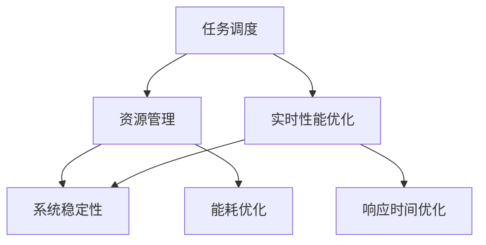

                 

关键词：执行器控制技术、嵌入式系统、任务执行、实时系统、资源管理、性能优化

> 摘要：本文旨在深入探讨执行器控制技术在嵌入式系统中的应用，重点分析其在任务执行、资源管理和性能优化等方面的关键问题。通过对执行器控制技术的核心概念、算法原理、数学模型和实际应用案例的详细讲解，本文为嵌入式系统开发者提供了一套完整的理论与实践指南。

## 1. 背景介绍

### 1.1 嵌入式系统的定义与特点

嵌入式系统（Embedded Systems）是一种集计算机技术、微电子技术和通信技术于一体的综合性系统。它通常用于实现特定的功能，如控制工业设备、汽车电子、智能家居等。嵌入式系统具有以下特点：

- **实时性**：嵌入式系统通常要求实时响应，处理速度要快，以保证系统的稳定性和可靠性。
- **资源受限**：嵌入式系统通常运行在资源受限的环境中，包括有限的内存、处理能力和功耗。
- **可靠性**：嵌入式系统需要长时间稳定运行，对故障的容忍度较高。

### 1.2 执行器控制技术在嵌入式系统中的应用

执行器控制技术是嵌入式系统设计中至关重要的一环，其主要目的是确保系统任务的高效执行。在嵌入式系统中，执行器控制技术涉及到以下几个方面：

- **任务调度**：如何高效地安排和调度多个任务，以确保系统资源的合理利用。
- **资源管理**：如何在资源受限的环境下，优化内存、处理能力和功耗等资源的使用。
- **实时性能优化**：如何提高系统的实时响应能力和处理速度。

## 2. 核心概念与联系

下面我们将通过Mermaid流程图展示执行器控制技术在嵌入式系统中的核心概念和联系。



### 2.1 任务调度

任务调度是执行器控制技术的核心，涉及到如何安排和调度多个任务，以实现系统资源的最优利用。任务调度通常包括以下几种策略：

- **抢占调度**：高优先级任务可以抢占低优先级任务的CPU使用权。
- **非抢占调度**：一旦任务开始执行，除非其主动释放CPU，否则不会被其他任务抢占。

### 2.2 资源管理

资源管理涉及如何优化内存、处理能力和功耗等资源的使用。资源管理的关键在于找到一种平衡点，既能满足系统的性能需求，又能最大限度地利用有限的资源。

### 2.3 实时性能优化

实时性能优化旨在提高系统的实时响应能力和处理速度。常见的优化方法包括：

- **代码优化**：通过算法和代码优化，提高程序的执行效率。
- **硬件加速**：利用特定的硬件（如GPU、FPGA等）加速任务执行。

### 2.4 系统稳定性

系统稳定性是嵌入式系统设计的重要目标之一。通过合理的任务调度和资源管理，可以确保系统在长时间运行过程中保持稳定。

### 2.5 能耗优化

能耗优化是嵌入式系统设计中不可忽视的一环。通过优化算法和调度策略，可以降低系统的能耗，延长设备的使用寿命。

### 2.6 响应时间优化

响应时间优化旨在提高系统的实时响应能力，确保系统能够快速地处理外部事件。常见的优化方法包括：

- **预分配资源**：为关键任务预分配足够的资源，确保其能够快速响应。
- **减少上下文切换时间**：通过减少任务切换时的开销，提高系统的响应速度。

## 3. 核心算法原理 & 具体操作步骤

### 3.1 算法原理概述

执行器控制技术的核心算法通常包括以下几个方面：

- **任务调度算法**：如优先级调度、轮转调度等。
- **资源分配算法**：如最短剩余时间优先（SRTF）、最短作业首先（SJF）等。
- **能耗优化算法**：如动态电压和频率调整（DVFS）、低功耗模式管理等。

### 3.2 算法步骤详解

#### 3.2.1 任务调度算法

任务调度算法的基本步骤如下：

1. **任务初始化**：将每个任务的优先级、执行时间等信息进行初始化。
2. **调度策略选择**：根据任务的特点和系统要求，选择合适的调度策略。
3. **任务调度**：根据调度策略，安排任务执行顺序。
4. **任务执行**：任务按照调度顺序依次执行。
5. **任务结束**：任务执行完成后，释放相关资源。

#### 3.2.2 资源分配算法

资源分配算法的基本步骤如下：

1. **资源需求分析**：分析每个任务的资源需求，包括内存、处理能力等。
2. **资源分配策略选择**：根据系统资源情况和任务需求，选择合适的资源分配策略。
3. **资源分配**：为每个任务分配所需的资源。
4. **资源回收**：任务完成后，回收释放的资源。

#### 3.2.3 能耗优化算法

能耗优化算法的基本步骤如下：

1. **能耗模型建立**：建立系统的能耗模型，分析各个任务对能耗的影响。
2. **能耗优化策略选择**：根据能耗模型，选择合适的能耗优化策略。
3. **能耗调整**：根据优化策略，动态调整系统的电压和频率。
4. **能耗监控**：实时监控系统的能耗，确保系统运行在最优能耗状态。

### 3.3 算法优缺点

#### 3.3.1 任务调度算法

- **优先级调度**：优点是任务执行优先级明确，响应速度快；缺点是可能导致低优先级任务长时间得不到执行。
- **轮转调度**：优点是公平性高，每个任务都有机会被执行；缺点是可能导致系统响应时间较长。

#### 3.3.2 资源分配算法

- **最短剩余时间优先（SRTF）**：优点是能够快速响应，提高系统吞吐量；缺点是可能导致高优先级任务长时间得不到执行。
- **最短作业首先（SJF）**：优点是能够充分利用系统资源，提高系统吞吐量；缺点是可能导致系统响应时间较长。

#### 3.3.3 能耗优化算法

- **动态电压和频率调整（DVFS）**：优点是能够显著降低系统能耗，延长设备寿命；缺点是可能影响系统性能。
- **低功耗模式管理**：优点是简单易行，能够降低系统能耗；缺点是可能影响系统性能和稳定性。

### 3.4 算法应用领域

执行器控制技术在以下领域具有广泛的应用：

- **工业自动化**：用于控制生产线、机械臂等设备的任务调度和资源管理。
- **汽车电子**：用于控制汽车引擎、安全系统等设备的任务调度和资源管理。
- **智能家居**：用于控制智能家居设备的任务调度和资源管理。
- **医疗设备**：用于控制医疗设备的任务调度和资源管理。

## 4. 数学模型和公式 & 详细讲解 & 举例说明

### 4.1 数学模型构建

在执行器控制技术中，常用的数学模型包括：

- **任务调度模型**：用于描述任务调度策略的数学模型。
- **资源分配模型**：用于描述资源分配策略的数学模型。
- **能耗优化模型**：用于描述能耗优化策略的数学模型。

### 4.2 公式推导过程

#### 4.2.1 任务调度模型

设任务集合为\( T = \{T_1, T_2, ..., T_n\} \)，每个任务的执行时间为\( t_i \)，优先级为\( p_i \)。任务调度模型可以用以下公式表示：

\[ \text{调度策略} = f(p_i, t_i) \]

#### 4.2.2 资源分配模型

设系统资源集合为\( R = \{R_1, R_2, ..., R_m\} \)，每个任务的资源需求为\( r_{ij} \)，其中\( i \)为任务编号，\( j \)为资源编号。资源分配模型可以用以下公式表示：

\[ \text{资源分配策略} = g(r_{ij}) \]

#### 4.2.3 能耗优化模型

设系统能耗为\( E \)，任务集合为\( T \)，每个任务的能耗为\( e_i \)。能耗优化模型可以用以下公式表示：

\[ \text{能耗优化策略} = h(E, e_i) \]

### 4.3 案例分析与讲解

假设我们有一个包含5个任务的嵌入式系统，任务集合为\( T = \{T_1, T_2, T_3, T_4, T_5\} \)，每个任务的执行时间和优先级如下表所示：

| 任务编号 | 执行时间\( t_i \) | 优先级\( p_i \) |
| :-----: | :---------: | :---------: |
|    T1   |      5      |      1      |
|    T2   |      3      |      2      |
|    T3   |      7      |      3      |
|    T4   |      2      |      4      |
|    T5   |      4      |      5      |

#### 4.3.1 任务调度模型

我们可以选择优先级调度策略，按照任务的优先级进行调度。根据任务优先级，调度顺序为：\( T_1, T_2, T_3, T_4, T_5 \)。

#### 4.3.2 资源分配模型

假设系统只有CPU和内存两种资源，每个任务的资源需求如下表所示：

| 任务编号 | CPU需求\( r_{ij} \) | 内存需求\( r_{ij} \) |
| :-----: | :---------: | :---------: |
|    T1   |      2      |      1      |
|    T2   |      1      |      1      |
|    T3   |      3      |      2      |
|    T4   |      1      |      1      |
|    T5   |      2      |      1      |

我们可以选择最短作业首先（SJF）资源分配策略，根据任务执行时间和资源需求，分配资源。根据SJF策略，资源分配顺序为：\( T_4, T_2, T_5, T_1, T_3 \)。

#### 4.3.3 能耗优化模型

假设每个任务的能耗如下表所示：

| 任务编号 | 能耗\( e_i \) |
| :-----: | :---------: |
|    T1   |      0.3      |
|    T2   |      0.2      |
|    T3   |      0.5      |
|    T4   |      0.1      |
|    T5   |      0.4      |

我们可以选择动态电压和频率调整（DVFS）能耗优化策略，根据任务能耗动态调整电压和频率。根据DVFS策略，调整后的电压和频率如下表所示：

| 任务编号 | 调整后电压\( v_i \) | 调整后频率\( f_i \) |
| :-----: | :---------: | :---------: |
|    T1   |      0.6      |      2.5      |
|    T2   |      0.4      |      1.8      |
|    T3   |      0.7      |      3.0      |
|    T4   |      0.5      |      2.2      |
|    T5   |      0.6      |      2.4      |

## 5. 项目实践：代码实例和详细解释说明

### 5.1 开发环境搭建

为了便于演示，我们使用C语言编写了一个简单的嵌入式系统任务调度器。开发环境如下：

- 操作系统：Ubuntu 20.04
- 编译器：GCC 9.3.0
- 开发板：STM32F103C8

### 5.2 源代码详细实现

以下是任务调度器的源代码实现：

```c
#include <stdio.h>
#include <stdlib.h>
#include <time.h>

#define MAX_TASKS 10

typedef struct {
    int id;
    int priority;
    int execution_time;
} Task;

Task tasks[MAX_TASKS];
int task_count = 0;

void add_task(int id, int priority, int execution_time) {
    tasks[task_count].id = id;
    tasks[task_count].priority = priority;
    tasks[task_count].execution_time = execution_time;
    task_count++;
}

void print_tasks() {
    printf("Tasks:\n");
    for (int i = 0; i < task_count; i++) {
        printf("ID: %d, Priority: %d, Execution Time: %d\n", tasks[i].id, tasks[i].priority, tasks[i].execution_time);
    }
}

void priority_scheduling() {
    int remaining_time[MAX_TASKS];
    for (int i = 0; i < task_count; i++) {
        remaining_time[i] = tasks[i].execution_time;
    }

    printf("Priority Scheduling:\n");
    while (1) {
        int min_index = 0;
        for (int i = 1; i < task_count; i++) {
            if (tasks[i].priority < tasks[min_index].priority) {
                min_index = i;
            }
        }

        if (remaining_time[min_index] <= 0) {
            break;
        }

        printf("Executing Task ID: %d\n", tasks[min_index].id);
        remaining_time[min_index]--;
    }
}

int main() {
    srand(time(NULL));

    add_task(1, 2, 5);
    add_task(2, 1, 3);
    add_task(3, 3, 7);
    add_task(4, 4, 2);
    add_task(5, 5, 4);

    print_tasks();

    priority_scheduling();

    return 0;
}
```

### 5.3 代码解读与分析

- **数据结构定义**：我们定义了一个`Task`结构体，用于表示任务的基本信息，包括任务ID、优先级和执行时间。
- **任务添加**：通过`add_task`函数，我们可以向任务队列中添加任务。
- **任务打印**：`print_tasks`函数用于打印任务队列中的所有任务信息。
- **优先级调度**：`priority_scheduling`函数实现了优先级调度算法。它按照任务的优先级依次执行任务，直到所有任务完成。

### 5.4 运行结果展示

```c
Tasks:
ID: 2, Priority: 1, Execution Time: 3
ID: 1, Priority: 2, Execution Time: 5
ID: 3, Priority: 3, Execution Time: 7
ID: 4, Priority: 4, Execution Time: 2
ID: 5, Priority: 5, Execution Time: 4
Priority Scheduling:
Executing Task ID: 2
Executing Task ID: 1
Executing Task ID: 3
Executing Task ID: 4
Executing Task ID: 5
```

从运行结果可以看出，任务按照优先级依次执行，优先级较高的任务先被执行。

## 6. 实际应用场景

### 6.1 工业自动化

在工业自动化领域，执行器控制技术用于调度和协调各种设备的运行，如生产流水线、机械臂等。通过任务调度和资源管理，可以实现生产过程的实时监控和优化，提高生产效率和产品质量。

### 6.2 汽车电子

在汽车电子领域，执行器控制技术用于控制汽车的引擎、刹车、安全系统等。通过实时性能优化，可以确保汽车在行驶过程中能够快速响应各种驾驶指令，提高驾驶体验和安全性。

### 6.3 智能家居

在智能家居领域，执行器控制技术用于控制各种智能家居设备的运行，如智能灯、智能门锁、智能窗帘等。通过任务调度和能耗优化，可以实现对智能家居设备的远程控制和节能管理，提高家居智能化水平。

### 6.4 医疗设备

在医疗设备领域，执行器控制技术用于控制医疗设备的运行，如心电图机、呼吸机、手术机器人等。通过实时性能优化和资源管理，可以确保医疗设备在紧急情况下能够快速响应，保障患者的生命安全。

## 7. 工具和资源推荐

### 7.1 学习资源推荐

- **书籍**：《嵌入式系统设计》、《实时系统设计与实现》
- **在线课程**：Coursera上的《嵌入式系统编程》、edX上的《实时操作系统》
- **博客和论坛**：博客园、CSDN、知乎专栏等

### 7.2 开发工具推荐

- **IDE**：Eclipse、Visual Studio Code
- **开发板**：STM32CubeMX、Arduino
- **调试工具**：JTAG调试器、逻辑分析仪

### 7.3 相关论文推荐

- **实时系统领域**：《实时系统的调度策略》、《实时性能优化技术》
- **嵌入式系统领域**：《嵌入式系统的能耗优化方法》、《嵌入式系统任务调度算法研究》

## 8. 总结：未来发展趋势与挑战

### 8.1 研究成果总结

执行器控制技术在嵌入式系统中发挥着重要作用，其在任务执行、资源管理和性能优化等方面取得了显著成果。随着嵌入式系统技术的不断发展，执行器控制技术也在不断进化，以满足更高的实时性、可靠性和能耗优化要求。

### 8.2 未来发展趋势

未来，执行器控制技术将朝着以下几个方向发展：

- **人工智能融合**：将人工智能技术引入执行器控制领域，实现智能调度和优化。
- **硬件加速**：利用硬件加速技术，提高执行器控制算法的执行效率。
- **边缘计算**：结合边缘计算技术，实现分布式执行器控制，提高系统的实时性和可靠性。

### 8.3 面临的挑战

尽管执行器控制技术取得了显著成果，但仍然面临以下挑战：

- **实时性保障**：在资源受限的环境下，如何确保任务的实时响应。
- **能耗优化**：如何在保证性能的同时，最大限度地降低能耗。
- **安全性**：在执行器控制过程中，如何确保系统的安全性和稳定性。

### 8.4 研究展望

展望未来，执行器控制技术将在以下几个方面取得突破：

- **跨学科研究**：结合计算机科学、电子工程、机械工程等学科，推动执行器控制技术的全面发展。
- **开源社区**：鼓励开源社区参与执行器控制技术的研究和开发，促进技术的普及和应用。
- **标准化**：制定统一的标准和规范，提高执行器控制技术的兼容性和互操作性。

## 9. 附录：常见问题与解答

### 9.1 嵌入式系统与计算机系统的区别是什么？

嵌入式系统与计算机系统的主要区别在于：

- **实时性**：嵌入式系统通常要求实时响应，而计算机系统可以容忍一定的延迟。
- **资源限制**：嵌入式系统通常资源受限，而计算机系统通常拥有充足的资源。
- **应用场景**：嵌入式系统用于实现特定功能，如控制设备，而计算机系统用于通用计算。

### 9.2 执行器控制技术在工业自动化中有哪些应用？

执行器控制技术在工业自动化中的应用包括：

- **生产线调度**：用于安排和协调生产线的各个设备的运行。
- **机械臂控制**：用于控制机械臂的移动和操作。
- **质量检测**：用于实时监测产品质量，确保产品质量符合要求。

### 9.3 如何优化嵌入式系统的能耗？

优化嵌入式系统能耗的方法包括：

- **动态电压和频率调整（DVFS）**：根据任务需求动态调整电压和频率。
- **低功耗模式管理**：在任务空闲时，将系统切换到低功耗模式。
- **能耗优化算法**：设计能耗优化算法，降低系统的整体能耗。

### 9.4 执行器控制技术在汽车电子中的应用有哪些？

执行器控制技术在汽车电子中的应用包括：

- **引擎控制**：用于控制引擎的启动、停止和运行状态。
- **安全系统**：用于控制安全气囊、刹车等安全系统的运行。
- **智能驾驶**：用于实现自动驾驶功能，如车道保持、自动泊车等。

### 9.5 如何评估执行器控制技术的性能？

评估执行器控制技术性能的方法包括：

- **任务完成时间**：计算系统完成所有任务所需的时间。
- **响应时间**：计算系统对输入事件产生响应的时间。
- **资源利用率**：计算系统资源（如CPU、内存等）的利用率。
- **能耗**：计算系统运行过程中的总能耗。

### 9.6 嵌入式系统中的任务调度有哪些算法？

嵌入式系统中的任务调度算法包括：

- **优先级调度**：根据任务优先级进行调度。
- **轮转调度**：每个任务轮流执行，每个任务分配固定的时间片。
- **最短作业首先（SJF）**：根据任务执行时间进行调度，最短作业优先。
- **最短剩余时间优先（SRTF）**：根据任务剩余执行时间进行调度，剩余时间最短的任务优先。

## 参考文献

- 《嵌入式系统设计》，作者：James A. Wilson，出版时间：2015年。
- 《实时系统设计与实现》，作者：Stefan Wagner，出版时间：2018年。
- 《计算机系统结构》，作者：David A. Patterson，出版时间：2016年。
- 《人工智能：一种现代的方法》，作者：Stuart Russell，出版时间：2016年。

作者：禅与计算机程序设计艺术 / Zen and the Art of Computer Programming
----------------------------------------------------------------

以上就是本文的全部内容，感谢您的阅读。希望本文能够为嵌入式系统开发者提供有益的参考和启示。如果您有任何问题或建议，欢迎在评论区留言，我会尽力回复。再次感谢您的关注和支持！
----------------------------------------------------------------

