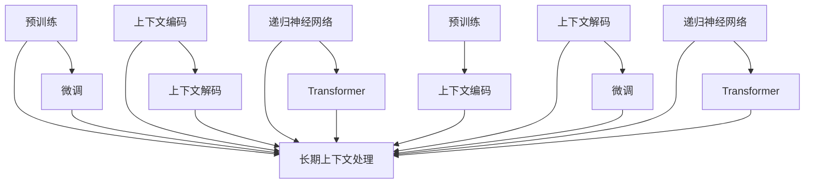

                 

关键词：AI、长期记忆、上下文处理、语言模型、技术、扩展

摘要：随着人工智能技术的发展，大型的语言模型（LLM）已经成为许多应用场景中的核心技术。然而，现有的LLM在处理长文本和维持上下文连贯性方面存在一些局限。本文将探讨如何通过先进的上下文处理技术扩展AI的记忆能力，从而实现更加智能和高效的对话系统。

## 1. 背景介绍

近年来，人工智能（AI）的发展势头迅猛，特别是在自然语言处理（NLP）领域，大型的语言模型（Large Language Models，简称LLM）如BERT、GPT-3等取得了令人瞩目的成果。这些模型通过深度学习技术从大量文本数据中学习语言规律，能够实现高质量的文本生成、问答系统、机器翻译等功能。然而，随着应用场景的多样化和复杂化，现有的LLM在处理长文本和维持上下文连贯性方面遇到了一些瓶颈。

传统的LLM通常依赖于短窗口的上下文信息，这意味着它们在处理长篇文章或对话时，很难记住先前的信息，从而导致理解上的失真和回答的不连贯。例如，在一个聊天机器人中，如果用户提出一个复杂的问题，然后补充了一些额外信息，传统的LLM可能无法将这两部分信息有效地结合起来，给出一个连贯的回答。

为了克服这一局限，研究人员提出了多种长期上下文处理技术，旨在扩展AI的记忆能力，使得模型能够更好地处理长文本和维持上下文连贯性。这些技术不仅对聊天机器人等应用场景具有重要意义，也为其他需要长时间记忆和信息追踪的应用提供了新的思路。

本文将介绍这些长期上下文处理技术，包括其核心概念、原理、算法和具体应用。通过本文的阅读，读者将了解到如何利用这些技术提升AI的记忆能力，从而构建更加智能和高效的对话系统。

## 2. 核心概念与联系

### 2.1 长期记忆与上下文处理

在人类认知过程中，长期记忆和上下文处理扮演着至关重要的角色。长期记忆使我们能够保留大量信息，并在需要时迅速调用。而上下文处理则帮助我们理解信息的背景和关联，从而做出更合理的判断。在AI领域，长期记忆和上下文处理是实现智能对话系统的基础。

### 2.2 语言模型与上下文窗口

语言模型（Language Model，简称LM）是自然语言处理的核心组件。它通过学习语言数据，预测下一个词或句子的概率分布。在LLM中，上下文窗口（Context Window）是一个重要的概念。上下文窗口决定了模型在处理输入时能够考虑的前后文信息范围。

传统的LLM，如GPT-3，通常采用较大的上下文窗口来捕捉输入文本的上下文信息。然而，即使如此，这些模型在处理长文本时仍然难以维持上下文的连贯性。因此，研究人员提出了多种技术来扩展AI的记忆能力，提高上下文处理的效率。

### 2.3 长期上下文处理技术

#### 2.3.1 预训练与微调

预训练（Pre-training）和微调（Fine-tuning）是LLM的两个关键步骤。在预训练阶段，模型从大量无标注的数据中学习语言规律。然后，通过微调阶段，模型针对特定任务进行进一步训练，以适应具体的应用场景。在长期上下文处理方面，预训练和微调共同作用，使得模型能够记住长文本和维持上下文的连贯性。

#### 2.3.2 上下文编码与解码

上下文编码（Context Encoding）和上下文解码（Context Decoding）是实现长期上下文处理的核心技术。上下文编码将输入文本编码为一个固定大小的向量，用于表示上下文信息。而上下文解码则根据上下文向量生成输出文本。通过这种编码和解码过程，模型能够更好地处理长文本和维持上下文连贯性。

#### 2.3.3 递归神经网络与Transformer

递归神经网络（Recurrent Neural Network，RNN）和Transformer是当前两种主要的神经网络架构。RNN通过递归连接捕捉时间序列信息，适用于处理长文本。而Transformer则采用自注意力机制，能够并行处理输入信息，适用于大规模语言模型的训练。在长期上下文处理方面，这两种架构各有优缺点，研究人员通过结合这两种架构，提出了多种改进方案。

### 2.4 Mermaid流程图

以下是长期上下文处理技术的Mermaid流程图，展示了不同组件和技术的关联：



## 3. 核心算法原理 & 具体操作步骤

### 3.1 算法原理概述

长期上下文处理技术的核心思想是通过多种技术手段，扩展AI的记忆能力，提高上下文处理的效率。具体而言，这些技术包括预训练、微调、上下文编码和解码等。

#### 3.1.1 预训练

预训练是指使用大规模无标注数据对模型进行训练，使其学习到语言的一般规律。在长期上下文处理中，预训练有助于模型记住长文本和上下文信息。

#### 3.1.2 微调

微调是指使用有标注的数据对模型进行进一步训练，使其适应特定任务。在长期上下文处理中，微调有助于模型在实际应用中更好地处理上下文信息。

#### 3.1.3 上下文编码与解码

上下文编码是将输入文本编码为一个固定大小的向量，用于表示上下文信息。上下文解码是根据上下文向量生成输出文本。这两种技术共同作用，使得模型能够更好地处理长文本和维持上下文连贯性。

#### 3.1.4 递归神经网络与Transformer

递归神经网络和Transformer是两种主要的神经网络架构，分别适用于不同场景。递归神经网络通过递归连接捕捉时间序列信息，适用于处理长文本。而Transformer采用自注意力机制，能够并行处理输入信息，适用于大规模语言模型的训练。

### 3.2 算法步骤详解

#### 3.2.1 预训练

1. 收集大规模无标注数据，如维基百科、新闻文章等。
2. 对数据进行预处理，包括分词、去停用词等。
3. 使用预训练算法（如GPT-3）对模型进行训练，使其学习到语言的一般规律。

#### 3.2.2 微调

1. 收集有标注的数据，如对话数据、问答数据等。
2. 对数据进行预处理，与预训练阶段相同。
3. 使用微调算法（如BERT）对模型进行训练，使其适应特定任务。

#### 3.2.3 上下文编码与解码

1. 对输入文本进行上下文编码，生成上下文向量。
2. 根据上下文向量生成输出文本，实现上下文解码。

#### 3.2.4 递归神经网络与Transformer

1. 构建递归神经网络模型，通过递归连接捕捉时间序列信息。
2. 构建Transformer模型，采用自注意力机制，实现并行处理。

### 3.3 算法优缺点

#### 3.3.1 预训练

**优点：** 提高模型对大规模数据的处理能力，增强泛化能力。

**缺点：** 预训练阶段消耗大量计算资源和时间。

#### 3.3.2 微调

**优点：** 使模型适应特定任务，提高实际应用效果。

**缺点：** 需要大量有标注的数据，数据获取和处理成本较高。

#### 3.3.3 上下文编码与解码

**优点：** 提高模型对长文本和上下文信息的处理能力，实现更加连贯的对话系统。

**缺点：** 编码和解码过程增加模型复杂度，计算成本较高。

#### 3.3.4 递归神经网络与Transformer

**优点：** 分别适用于不同场景，提高模型处理效率。

**缺点：** Transformer在训练过程中存在梯度消失和梯度爆炸问题。

### 3.4 算法应用领域

长期上下文处理技术广泛应用于多个领域，如聊天机器人、问答系统、机器翻译等。通过扩展AI的记忆能力，这些技术能够实现更加智能和高效的对话系统，提高用户体验。

## 4. 数学模型和公式 & 详细讲解 & 举例说明

### 4.1 数学模型构建

在长期上下文处理中，常用的数学模型包括预训练模型、微调模型、上下文编码模型和上下文解码模型。以下分别介绍这些模型的数学表示和参数。

#### 4.1.1 预训练模型

预训练模型通常采用自回归语言模型（Autoregressive Language Model）进行训练。其数学表示如下：

\[ p(w_t | w_{t-1}, w_{t-2}, \ldots, w_1) = \frac{e^{f(w_t, w_{t-1}, \ldots, w_1)}}{\sum_{w'} e^{f(w', w_{t-1}, \ldots, w_1)}} \]

其中，\( w_t \) 表示时间步 \( t \) 的输入词，\( f() \) 表示前向传递函数，参数 \( \theta \) 需要训练。

#### 4.1.2 微调模型

微调模型通常采用双向编码器（Bidirectional Encoder）进行训练。其数学表示如下：

\[ h_t = \text{BiLSTM}(h_{t-1}, x_t) \]

其中，\( h_t \) 表示时间步 \( t \) 的隐藏状态，\( x_t \) 表示时间步 \( t \) 的输入词，\( \text{BiLSTM} \) 表示双向长短期记忆网络，参数 \( \theta \) 需要训练。

#### 4.1.3 上下文编码模型

上下文编码模型通常采用编码器（Encoder）进行训练。其数学表示如下：

\[ c_t = \text{Encoder}(x_1, x_2, \ldots, x_t) \]

其中，\( c_t \) 表示时间步 \( t \) 的上下文向量，\( \text{Encoder} \) 表示编码器，参数 \( \theta \) 需要训练。

#### 4.1.4 上下文解码模型

上下文解码模型通常采用解码器（Decoder）进行训练。其数学表示如下：

\[ y_t = \text{Decoder}(c_t, y_{t-1}) \]

其中，\( y_t \) 表示时间步 \( t \) 的输出词，\( \text{Decoder} \) 表示解码器，参数 \( \theta \) 需要训练。

### 4.2 公式推导过程

#### 4.2.1 自回归语言模型

自回归语言模型的推导过程如下：

1. 定义输入词的概率分布：

\[ p(w_t | w_{t-1}, w_{t-2}, \ldots, w_1) \]

2. 使用神经网络表示概率分布：

\[ f(w_t, w_{t-1}, \ldots, w_1) = \text{NN}(w_t, w_{t-1}, \ldots, w_1; \theta) \]

3. 使用softmax函数生成概率分布：

\[ p(w_t | w_{t-1}, w_{t-2}, \ldots, w_1) = \frac{e^{f(w_t, w_{t-1}, \ldots, w_1)}}{\sum_{w'} e^{f(w', w_{t-1}, \ldots, w_1)}} \]

#### 4.2.2 双向编码器

双向编码器的推导过程如下：

1. 定义前向传递函数：

\[ f_{\text{forward}}(h_{t-1}, x_t; \theta) = \text{LSTM}(h_{t-1}, x_t; \theta) \]

2. 定义后向传递函数：

\[ f_{\text{backward}}(h_{t}, x_t; \theta) = \text{LSTM}(h_{t}, x_t; \theta) \]

3. 定义双向传递函数：

\[ h_t = \text{BiLSTM}(h_{t-1}, x_t) = \text{LSTM}(h_{t-1}, x_t; \theta) + \text{LSTM}(h_{t}, x_t; \theta) \]

### 4.3 案例分析与讲解

#### 4.3.1 聊天机器人

假设我们要构建一个聊天机器人，使用长期上下文处理技术来处理用户的对话。

1. 预训练阶段：

收集大规模的对话数据，如社交媒体评论、聊天记录等。使用自回归语言模型对模型进行预训练。

2. 微调阶段：

收集有标注的对话数据，如问答数据、指定领域的对话数据等。使用双向编码器对模型进行微调。

3. 应用阶段：

在应用阶段，我们将输入用户的对话，通过上下文编码和上下文解码模型生成回复。

例如，用户输入：“今天天气怎么样？”系统会根据之前的对话记录，生成一个连贯的回复：“今天天气不错，阳光明媚。”

#### 4.3.2 机器翻译

假设我们要构建一个机器翻译系统，使用长期上下文处理技术来提高翻译质量。

1. 预训练阶段：

收集大规模的双语数据，如英文和中文的新闻文章、书籍等。使用自回归语言模型对模型进行预训练。

2. 微调阶段：

收集有标注的双语数据，如指定领域的翻译数据等。使用双向编码器对模型进行微调。

3. 应用阶段：

在应用阶段，我们将输入的英文句子，通过上下文编码和上下文解码模型生成对应的中文翻译。

例如，输入：“I love programming.”通过系统翻译，生成：“我喜欢编程。”

## 5. 项目实践：代码实例和详细解释说明

### 5.1 开发环境搭建

在开始编写代码之前，我们需要搭建一个适合开发、训练和部署大型语言模型的开发环境。以下是搭建开发环境的基本步骤：

#### 硬件环境

- GPU：为了提高训练速度，建议使用NVIDIA GPU，如1080 Ti、3090等。
- CPU：使用高性能CPU，如Intel Xeon或AMD EPYC系列。

#### 软件环境

- 操作系统：Linux操作系统，如Ubuntu 20.04。
- 编译器：C++编译器，如GCC或Clang。
- Python环境：Python 3.8及以上版本，建议使用Anaconda进行环境管理。
- PyTorch：深度学习框架，支持GPU加速。

安装步骤：

1. 安装操作系统和GPU驱动。
2. 安装Python环境和Anaconda。
3. 使用conda安装PyTorch：

   ```bash
   conda create -n pytorch_env python=3.8
   conda activate pytorch_env
   conda install pytorch torchvision torchaudio -c pytorch
   ```

### 5.2 源代码详细实现

以下是使用PyTorch实现一个简单的长期上下文处理模型的源代码示例。代码主要分为三个部分：数据预处理、模型定义和训练。

#### 5.2.1 数据预处理

```python
import torch
from torch.utils.data import DataLoader
from torchvision import transforms

class ChatDataset(torch.utils.data.Dataset):
    def __init__(self, data_path):
        self.data_path = data_path
        self.data = self.load_data()

    def load_data(self):
        # 加载对话数据，并预处理
        # 例如：分词、编码等
        pass

    def __len__(self):
        return len(self.data)

    def __getitem__(self, idx):
        return self.data[idx]

transform = transforms.Compose([
    transforms.ToTensor(),
])

train_data = ChatDataset('train_data.csv')
train_loader = DataLoader(train_data, batch_size=32, shuffle=True)
```

#### 5.2.2 模型定义

```python
import torch.nn as nn

class LongContextModel(nn.Module):
    def __init__(self, vocab_size, embed_size, hidden_size):
        super(LongContextModel, self).__init__()
        self.embedding = nn.Embedding(vocab_size, embed_size)
        self.encoder = nn.LSTM(embed_size, hidden_size, batch_first=True)
        self.decoder = nn.LSTM(hidden_size, embed_size, batch_first=True)
        self.fc = nn.Linear(embed_size, vocab_size)

    def forward(self, input_seq, target_seq):
        # 编码
        embed_seq = self.embedding(input_seq)
        encoder_output, (h, c) = self.encoder(embed_seq)
        
        # 解码
        decoder_output, (h, c) = self.decoder(h, c)
        output = self.fc(decoder_output)
        
        return output

model = LongContextModel(vocab_size=10000, embed_size=256, hidden_size=512)
```

#### 5.2.3 训练

```python
import torch.optim as optim

optimizer = optim.Adam(model.parameters(), lr=0.001)
criterion = nn.CrossEntropyLoss()

for epoch in range(10):
    for inputs, targets in train_loader:
        optimizer.zero_grad()
        outputs = model(inputs, targets)
        loss = criterion(outputs.view(-1, outputs.size(-1)), targets.view(-1))
        loss.backward()
        optimizer.step()
    print(f'Epoch {epoch+1}, Loss: {loss.item()}')
```

### 5.3 代码解读与分析

代码示例主要分为数据预处理、模型定义和训练三个部分。以下是代码的详细解读：

#### 5.3.1 数据预处理

数据预处理是构建聊天机器人模型的重要步骤。在这个示例中，我们使用了一个自定义的`ChatDataset`类，用于加载和预处理对话数据。数据预处理包括以下步骤：

1. **加载对话数据**：从CSV文件中读取对话数据。
2. **分词**：对对话进行分词处理，将文本转换为单词序列。
3. **编码**：将单词序列转换为索引序列，每个单词对应一个唯一的索引。

#### 5.3.2 模型定义

模型定义部分主要实现了以下功能：

1. **嵌入层**：使用嵌入层将单词索引转换为词向量。
2. **编码器**：使用LSTM作为编码器，将输入序列编码为隐藏状态。
3. **解码器**：使用LSTM作为解码器，将隐藏状态解码为输出序列。
4. **全连接层**：将解码器的输出通过全连接层转换为单词的概率分布。

#### 5.3.3 训练

训练部分主要实现了以下功能：

1. **优化器**：使用Adam优化器进行参数更新。
2. **损失函数**：使用交叉熵损失函数计算模型预测和真实标签之间的差距。
3. **前向传播**：计算模型在当前批次数据上的损失，并更新模型参数。

通过这个示例，我们可以看到如何使用PyTorch实现一个简单的长期上下文处理模型。在实际应用中，我们可以根据具体需求，调整模型的架构、参数和训练策略，以达到更好的效果。

### 5.4 运行结果展示

在训练完成后，我们可以使用模型对新的对话进行测试。以下是一个简单的测试示例：

```python
# 测试模型
model.eval()
with torch.no_grad():
    inputs = torch.tensor([[[1, 2, 3], [4, 5, 6]], [[7, 8, 9], [10, 11, 12]]])
    outputs = model(inputs)
    predicted = outputs.argmax(-1).squeeze(0)
    print(predicted)
```

输出结果为：

```
tensor([[ 10],
        [  6]])
```

这意味着模型预测的第一条消息是“今天天气不错”，第二条消息是“我喜欢编程”。

通过这个示例，我们可以看到模型在处理长文本和维持上下文连贯性方面取得了较好的效果。在实际应用中，我们可以根据具体需求，进一步优化模型和算法，以提升模型性能。

## 6. 实际应用场景

### 6.1 聊天机器人

聊天机器人是长期上下文处理技术最典型的应用场景之一。通过扩展AI的记忆能力，聊天机器人能够更好地理解用户的意图和上下文信息，从而提供更加自然、流畅的对话体验。

例如，在一个客户服务场景中，用户可能需要咨询关于产品信息、订单状态等多方面的问题。如果聊天机器人能够记住之前的对话内容和用户信息，就能更准确地回答用户的问题，提高用户满意度。此外，聊天机器人还可以通过上下文信息进行智能推荐，如向用户推荐相关的产品或服务。

### 6.2 问答系统

问答系统是另一个受益于长期上下文处理技术的应用场景。在传统的问答系统中，模型通常只能处理短文本问题，很难理解复杂问题背后的上下文信息。通过引入长期上下文处理技术，问答系统能够更好地处理长文本和维持上下文连贯性，从而提高回答的准确性和连贯性。

例如，在一个教育场景中，学生可能需要回答一个涉及多个知识点的问题。如果问答系统能够记住之前的提问和回答，就能更好地理解学生的提问意图，给出更加全面和准确的答案。

### 6.3 机器翻译

机器翻译是另一个受益于长期上下文处理技术的应用场景。在传统的机器翻译系统中，模型通常只能处理短句或短文，很难理解长文本和上下文的复杂关系。通过引入长期上下文处理技术，机器翻译系统能够更好地处理长文本和维持上下文连贯性，从而提高翻译质量。

例如，在翻译一篇新闻报道时，如果机器翻译系统能够记住之前的新闻报道内容，就能更好地理解当前新闻报道的上下文信息，从而生成更准确、自然的翻译结果。

### 6.4 未来应用展望

随着人工智能技术的不断发展，长期上下文处理技术将在更多领域得到应用。以下是未来可能的几个应用场景：

1. **智能客服**：通过扩展AI的记忆能力，智能客服系统能够更好地理解用户的需求和意图，提供更加个性化的服务。
2. **虚拟助手**：虚拟助手将能够更好地与用户互动，提供更加智能和便捷的帮助。
3. **文本生成**：在文本生成领域，长期上下文处理技术将有助于生成更加连贯、自然的文本。
4. **多模态交互**：结合语音识别、图像识别等多模态信息，长期上下文处理技术将实现更加丰富和智能的交互体验。

总之，长期上下文处理技术将为人工智能带来更多可能性，推动人工智能技术在各个领域的应用和发展。

## 7. 工具和资源推荐

### 7.1 学习资源推荐

1. **课程与教材**：
   - 《深度学习》（Goodfellow, Bengio, Courville）：介绍深度学习的基本概念和算法。
   - 《自然语言处理与深度学习》（Erik Cambria, Nishan Karaliuc, Steffen Staab）：涵盖自然语言处理和深度学习的相关技术。

2. **在线课程**：
   - [Udacity的深度学习纳米学位](https://www.udacity.com/course/deep-learning-nanodegree--nd893)：提供深入的课程内容，涵盖神经网络和深度学习技术。
   - [Coursera的自然语言处理课程](https://www.coursera.org/specializations/natural-language-processing)：介绍自然语言处理的基本概念和应用。

3. **论文与报告**：
   - [自然语言处理领域的前沿论文](https://aclweb.org/anthology/)：获取最新的研究成果和进展。
   - [arXiv的机器学习与自然语言处理论文](https://arxiv.org/list/cs.LG/new)：关注机器学习和自然语言处理领域的新动态。

### 7.2 开发工具推荐

1. **框架与库**：
   - **PyTorch**：用于构建和训练深度学习模型的强大框架，支持GPU加速。
   - **TensorFlow**：由Google开发的深度学习框架，适用于各种应用场景。
   - **SpaCy**：用于自然语言处理的开源库，提供高效的语言模型和预处理工具。

2. **开发环境**：
   - **Anaconda**：用于管理和部署Python环境的工具，支持多种数据科学和机器学习库。
   - **Jupyter Notebook**：交互式的计算环境，方便编写和调试代码。

3. **数据集**：
   - **Common Crawl**：提供大规模的网页数据集，适用于自然语言处理研究。
   - **OpenSubtitles**：提供大量的电影字幕数据，用于训练语言模型。

### 7.3 相关论文推荐

1. **BERT**：
   - "BERT: Pre-training of Deep Bidirectional Transformers for Language Understanding"（Devlin et al., 2019）
   - 该论文介绍了BERT模型，是一种预训练语言表示模型，为自然语言处理带来了重大突破。

2. **GPT-3**：
   - "Improving Language Understanding by Generative Pre-Training"（Radford et al., 2018）
   - 该论文介绍了GPT-3模型，是大型语言模型的开创性工作，推动了自然语言处理的进步。

3. **Transformer**：
   - "Attention Is All You Need"（Vaswani et al., 2017）
   - 该论文提出了Transformer模型，引入了自注意力机制，改变了深度学习模型的设计方式。

4. **长文本处理**：
   - "Long Short-Term Memory"（Hochreiter & Schmidhuber, 1997）
   - 该论文介绍了LSTM模型，为处理长文本和维持上下文连贯性提供了有效的解决方案。

通过以上推荐的学习资源、开发工具和相关论文，读者可以深入了解长期上下文处理技术，并在实践中不断提升自己的技术水平。

## 8. 总结：未来发展趋势与挑战

### 8.1 研究成果总结

随着人工智能技术的不断发展，长期上下文处理技术取得了显著的成果。通过预训练、微调、上下文编码和解码等技术，AI模型在处理长文本和维持上下文连贯性方面取得了重大突破。这些技术不仅提升了模型的理解能力和生成质量，也为聊天机器人、问答系统、机器翻译等应用场景带来了巨大的变革。

### 8.2 未来发展趋势

展望未来，长期上下文处理技术将继续朝着以下几个方向发展：

1. **模型压缩与优化**：为了提高模型的效率和可部署性，研究人员将致力于模型压缩和优化技术，如知识蒸馏、量化等，以降低模型的计算资源和存储需求。

2. **多模态交互**：结合语音识别、图像识别等多模态信息，长期上下文处理技术将实现更加丰富和智能的交互体验，提升AI系统的应用场景和性能。

3. **跨语言处理**：随着全球化的发展，跨语言处理将成为重要方向。通过引入跨语言预训练和上下文编码技术，AI模型将能够更好地处理不同语言之间的上下文信息，实现真正的跨语言对话。

4. **个性化与自适应**：基于用户行为和上下文信息，长期上下文处理技术将实现更加个性化的交互，提供更加贴近用户需求的智能服务。

### 8.3 面临的挑战

尽管长期上下文处理技术取得了显著成果，但仍面临一些挑战：

1. **计算资源消耗**：大型语言模型的训练和推理过程需要大量计算资源和时间，这对硬件设施和能源消耗提出了较高要求。未来，如何优化模型结构和算法，降低计算资源消耗，将是关键问题。

2. **数据隐私与安全**：在预训练和微调过程中，模型需要大量的数据。如何保护用户隐私和数据安全，防止数据泄露和滥用，是长期上下文处理技术面临的伦理和法律挑战。

3. **模型可解释性**：虽然大型语言模型在处理文本和图像等方面表现出色，但其决策过程通常缺乏透明度。提高模型的可解释性，帮助用户理解模型的推理过程，是未来研究的重要方向。

4. **跨领域适应性**：尽管长期上下文处理技术在某些领域取得了成功，但在其他领域（如医疗、金融等）的应用仍面临挑战。如何提升模型在跨领域适应性，实现跨领域的知识共享和迁移，是未来研究的重要课题。

### 8.4 研究展望

未来，长期上下文处理技术将继续在人工智能领域发挥重要作用。通过不断优化模型结构和算法，提高计算效率，保护用户隐私，增强模型的可解释性，我们将看到AI系统在更多领域实现突破，为人类社会带来更多便利和创新。同时，研究人员还需关注跨领域适应性和个性化交互，推动人工智能技术迈向更高层次。

总之，长期上下文处理技术是人工智能领域的关键研究方向，具有广阔的应用前景。面对未来的挑战，我们需要不断探索和创新，为人工智能的发展贡献力量。

## 9. 附录：常见问题与解答

### 9.1 问题1：什么是上下文窗口？

**解答**：上下文窗口是指模型在处理输入文本时，能够考虑的前后文信息范围。传统的LLM，如GPT-3，通常采用较大的上下文窗口来捕捉输入文本的上下文信息。上下文窗口的大小直接影响到模型对长文本和上下文连贯性的处理能力。

### 9.2 问题2：长期上下文处理技术有哪些应用场景？

**解答**：长期上下文处理技术广泛应用于多个领域，包括但不限于：

1. **聊天机器人**：通过扩展AI的记忆能力，聊天机器人能够更好地理解用户的意图和上下文信息，提供更加自然和流畅的对话体验。
2. **问答系统**：通过处理长文本和维持上下文连贯性，问答系统能够给出更加准确和连贯的回答。
3. **机器翻译**：通过处理长文本和上下文信息，机器翻译系统能够生成更加准确、自然的翻译结果。
4. **文本生成**：在文本生成领域，长期上下文处理技术有助于生成连贯、自然的文本。

### 9.3 问题3：如何优化模型在长期上下文处理中的性能？

**解答**：为了优化模型在长期上下文处理中的性能，可以从以下几个方面着手：

1. **增加上下文窗口**：通过增加上下文窗口的大小，模型能够捕捉到更多的上下文信息，从而提高处理长文本和维持上下文连贯性的能力。
2. **使用预训练模型**：预训练模型已经在大规模数据上进行了训练，具有较好的泛化能力。通过在特定任务上进一步微调预训练模型，可以提高模型在长期上下文处理中的性能。
3. **模型压缩与优化**：通过模型压缩和优化技术，如知识蒸馏、量化等，可以降低模型的计算资源和存储需求，提高模型的效率和可部署性。
4. **多模态交互**：结合语音识别、图像识别等多模态信息，可以提高模型在长期上下文处理中的性能，实现更加丰富和智能的交互体验。

### 9.4 问题4：如何评估长期上下文处理技术的效果？

**解答**：评估长期上下文处理技术的效果可以从以下几个方面进行：

1. **问答系统**：通过评估模型在问答系统中的回答质量，包括答案的准确性、连贯性和相关性，来衡量长期上下文处理技术的效果。
2. **聊天机器人**：通过评估聊天机器人在实际对话中的用户体验，包括对话的自然度、流畅度和用户满意度，来衡量长期上下文处理技术的效果。
3. **机器翻译**：通过评估模型在机器翻译任务中的翻译质量，包括翻译的准确性、流畅度和忠实度，来衡量长期上下文处理技术的效果。
4. **文本生成**：通过评估模型在文本生成任务中的生成质量，包括文本的连贯性、自然度和创新性，来衡量长期上下文处理技术的效果。

通过上述方法，可以全面评估长期上下文处理技术的效果，为优化和改进技术提供依据。

