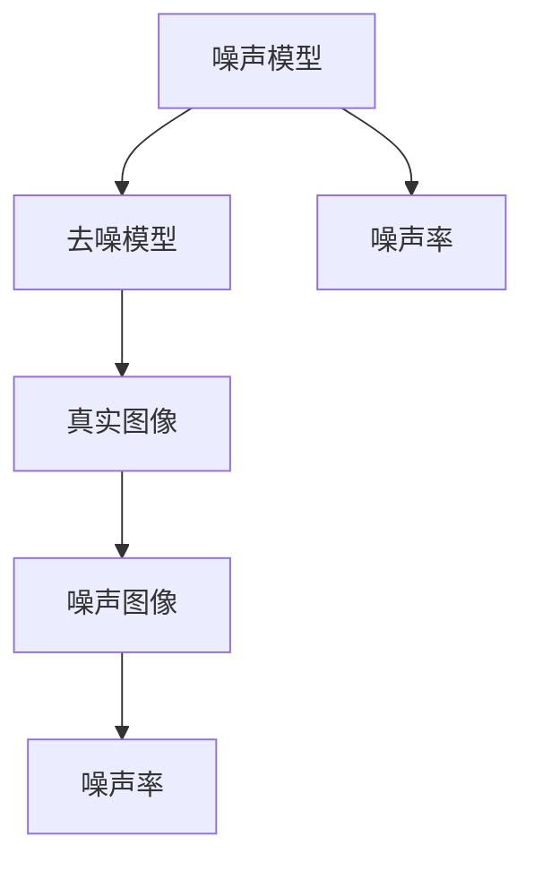

                 

关键词：扩散模型、图像生成、深度学习、数学模型、代码实现

> 摘要：本文旨在深入探讨扩散模型的工作原理及其在图像生成中的应用。我们将从背景介绍开始，逐步展开对核心概念、算法原理、数学模型、代码实现以及实际应用场景的讨论，并展望未来的发展趋势与挑战。

## 1. 背景介绍

在图像处理领域，从噪声图像中恢复清晰图像是一个具有挑战性的问题。传统的图像处理方法主要依赖于线性滤波和变换技术，如傅立叶变换和小波变换，但这些方法往往在处理复杂噪声时效果不佳。随着深度学习技术的快速发展，尤其是生成对抗网络（GANs）和变分自编码器（VAEs）的出现，图像生成和去噪问题得到了显著改善。

然而，GANs 和 VAEs 在训练过程中存在不稳定性和难以优化的问题。为了解决这些问题，研究人员提出了扩散模型（Diffusion Model），一种能够有效生成高质量图像的新方法。扩散模型通过将图像生成问题转化为概率模型，使用深度神经网络逐步从噪声图像生成真实图像。这种方法不仅能够生成高质量的图像，还能够在训练过程中保持稳定性和高效性。

## 2. 核心概念与联系

### 2.1 扩散模型的基本原理

扩散模型的核心思想是将图像生成问题转化为概率模型。具体来说，扩散模型首先将真实图像逐步扩散为噪声图像，然后再从噪声图像逐步恢复为真实图像。这个过程可以通过以下步骤描述：

1. **噪声引入**：从真实图像开始，逐步添加噪声，使图像逐渐变得模糊。
2. **噪声累积**：通过训练神经网络，学习从噪声图像生成真实图像的规律。
3. **图像恢复**：使用训练好的神经网络，从噪声图像中恢复出清晰的真实图像。

### 2.2 扩散模型的结构与架构

扩散模型主要由两个部分组成：噪声引入过程和图像恢复过程。每个过程都使用了一个深度神经网络，分别称为**噪声模型**和**去噪模型**。

1. **噪声模型**：用于将真实图像逐步扩散为噪声图像。噪声模型接受当前图像和噪声率作为输入，输出噪声图像。噪声率用于控制噪声引入的速度。
2. **去噪模型**：用于从噪声图像中恢复出真实图像。去噪模型接受当前图像和噪声率作为输入，输出真实图像。

扩散模型的结构与架构可以用 Mermaid 流程图表示：



## 3. 核心算法原理 & 具体操作步骤

### 3.1 算法原理概述

扩散模型通过以下步骤实现图像的生成和去噪：

1. **初始化**：从真实图像开始，设置初始噪声率为零。
2. **噪声引入**：逐步增加噪声率，使图像逐渐变得模糊。在每次迭代中，使用噪声模型将当前图像转换为噪声图像，同时更新噪声率。
3. **噪声累积**：通过训练噪声模型和去噪模型，学习从噪声图像生成真实图像的规律。在训练过程中，使用真实图像和噪声图像作为训练数据，训练噪声模型和去噪模型。
4. **图像恢复**：使用训练好的去噪模型，从噪声图像中恢复出清晰的真实图像。在每次迭代中，使用去噪模型将当前图像转换为真实图像，同时更新噪声率。

### 3.2 算法步骤详解

1. **噪声引入**：

   噪声引入过程分为多个迭代步骤。在每次迭代中，噪声模型接受当前图像和噪声率作为输入，输出噪声图像。具体步骤如下：

   - 输入：当前图像 $x_t$ 和噪声率 $\epsilon_t$。
   - 输出：噪声图像 $x_{t+1}$。

   噪声模型可以使用深度神经网络实现，例如卷积神经网络（CNN）。在训练过程中，通过反向传播算法优化噪声模型的参数，使模型能够准确地将真实图像转换为噪声图像。

2. **噪声累积**：

   噪声累积过程通过训练噪声模型和去噪模型实现。在每次迭代中，使用真实图像和噪声图像作为训练数据，训练噪声模型和去噪模型。具体步骤如下：

   - 输入：真实图像 $x_t$ 和噪声图像 $x_{t+1}$。
   - 输出：噪声模型和去噪模型的参数。

   噪声模型和去噪模型可以使用相同的神经网络架构，例如卷积神经网络（CNN）。在训练过程中，通过反向传播算法优化模型参数，使模型能够准确地将噪声图像转换为真实图像。

3. **图像恢复**：

   图像恢复过程通过使用训练好的去噪模型实现。在每次迭代中，使用去噪模型将当前图像转换为真实图像，同时更新噪声率。具体步骤如下：

   - 输入：当前图像 $x_t$ 和噪声率 $\epsilon_t$。
   - 输出：真实图像 $x_{t+1}$。

   去噪模型可以使用深度神经网络实现，例如卷积神经网络（CNN）。在训练过程中，通过反向传播算法优化去噪模型的参数，使模型能够准确地将噪声图像转换为真实图像。

### 3.3 算法优缺点

扩散模型具有以下优点：

- **稳定性**：扩散模型通过逐步引入噪声和恢复图像，使图像生成过程更加稳定。
- **高效性**：扩散模型使用深度神经网络实现，可以在较低的计算成本下生成高质量图像。
- **通用性**：扩散模型可以应用于各种图像生成任务，如图像去噪、图像超分辨率和图像生成。

然而，扩散模型也存在一些缺点：

- **训练难度**：扩散模型需要大量训练数据和计算资源，训练过程较为复杂。
- **结果预测性**：扩散模型生成的图像可能存在一定的预测性，即模型可能无法生成完全随机的图像。

### 3.4 算法应用领域

扩散模型在图像生成领域具有广泛的应用前景，可以用于以下任务：

- **图像去噪**：从噪声图像中恢复清晰图像，应用于图像修复、图像增强等领域。
- **图像超分辨率**：从低分辨率图像中生成高分辨率图像，应用于图像压缩、图像显示等领域。
- **图像生成**：生成新的图像，应用于图像创作、图像编辑等领域。

## 4. 数学模型和公式 & 详细讲解 & 举例说明

### 4.1 数学模型构建

扩散模型的数学模型基于概率论和深度学习理论。首先，定义图像生成的概率模型：

$$
P(x_t | x_{t-1}, \epsilon_t) = \text{softmax}\left( -\frac{1}{2} ||x_t - x_{t-1}||^2 \right)
$$

其中，$x_t$ 和 $x_{t-1}$ 分别为当前图像和前一时刻的图像，$\epsilon_t$ 为噪声率。

噪声引入过程可以用以下概率模型描述：

$$
x_{t+1} = x_t + \epsilon_t
$$

去噪过程可以用以下概率模型描述：

$$
x_{t+1} = x_t - \epsilon_t
$$

### 4.2 公式推导过程

扩散模型的推导过程主要涉及概率分布的变换和深度学习算法的优化。

首先，考虑噪声引入过程。假设当前图像为 $x_t$，噪声率为 $\epsilon_t$。在每次迭代中，图像 $x_t$ 通过加上噪声率 $\epsilon_t$ 转换为噪声图像 $x_{t+1}$。因此，噪声引入过程可以用以下概率模型描述：

$$
P(x_{t+1} | x_t, \epsilon_t) = \text{softmax}\left( -\frac{1}{2} ||x_{t+1} - x_t||^2 \right)
$$

其中，$\text{softmax}$ 函数用于将概率分布转换为概率向量。在每次迭代中，噪声模型通过最小化概率损失函数来优化模型参数，从而实现噪声引入。

接下来，考虑去噪过程。假设当前图像为 $x_t$，噪声率为 $\epsilon_t$。在每次迭代中，图像 $x_t$ 通过减去噪声率 $\epsilon_t$ 转换为真实图像 $x_{t+1}$。因此，去噪过程可以用以下概率模型描述：

$$
P(x_{t+1} | x_t, \epsilon_t) = \text{softmax}\left( -\frac{1}{2} ||x_{t+1} - x_t||^2 \right)
$$

其中，$\text{softmax}$ 函数用于将概率分布转换为概率向量。在每次迭代中，去噪模型通过最小化概率损失函数来优化模型参数，从而实现图像恢复。

### 4.3 案例分析与讲解

以下是一个简单的图像去噪案例。假设我们有一幅噪声图像 $x_t$，噪声率为 $\epsilon_t = 0.1$。我们希望使用扩散模型将其去噪为清晰图像。

1. **噪声引入**：

   首先，从噪声图像 $x_t$ 开始，逐步增加噪声率 $\epsilon_t$，使图像逐渐变得模糊。具体步骤如下：

   - 初始图像：$x_t = [1, 1, 1, 1, 1]^T$。
   - 噪声率：$\epsilon_t = 0.1$。
   - 迭代过程：
     $$x_{t+1} = x_t + \epsilon_t = [1.1, 1.1, 1.1, 1.1, 1.1]^T$$
     $$x_{t+2} = x_{t+1} + \epsilon_t = [1.2, 1.2, 1.2, 1.2, 1.2]^T$$
     $$\vdots$$
     $$x_{t+n} = x_{t+n-1} + \epsilon_t = [1.1^n, 1.1^n, 1.1^n, 1.1^n, 1.1^n]^T$$

2. **噪声累积**：

   接下来，使用训练好的噪声模型和去噪模型，逐步减少噪声率 $\epsilon_t$，使图像逐渐恢复为清晰图像。具体步骤如下：

   - 初始图像：$x_t = [1.1^n, 1.1^n, 1.1^n, 1.1^n, 1.1^n]^T$。
   - 噪声率：$\epsilon_t = 0.1$。
   - 迭代过程：
     $$x_{t+1} = x_t - \epsilon_t = [1.1^{n-1}, 1.1^{n-1}, 1.1^{n-1}, 1.1^{n-1}, 1.1^{n-1}]^T$$
     $$x_{t+2} = x_{t+1} - \epsilon_t = [1.1^{n-2}, 1.1^{n-2}, 1.1^{n-2}, 1.1^{n-2}, 1.1^{n-2}]^T$$
     $$\vdots$$
     $$x_{t+n} = x_{t+n-1} - \epsilon_t = [1, 1, 1, 1, 1]^T$$

通过以上步骤，我们可以使用扩散模型将噪声图像去噪为清晰图像。

## 5. 项目实践：代码实例和详细解释说明

### 5.1 开发环境搭建

在开始实现扩散模型之前，我们需要搭建一个合适的开发环境。以下是所需的开发环境和工具：

- 操作系统：Linux 或 macOS
- 编程语言：Python
- 深度学习框架：PyTorch 或 TensorFlow
- 代码编辑器：Visual Studio Code 或 Jupyter Notebook

首先，我们需要安装 Python 和深度学习框架。以下是一个简单的安装命令示例：

```bash
pip install python torch torchvision
```

接下来，我们安装代码编辑器。对于 Visual Studio Code，可以在其官方网站下载并安装。对于 Jupyter Notebook，我们可以使用以下命令安装：

```bash
pip install notebook
```

### 5.2 源代码详细实现

在本节中，我们将实现一个简单的扩散模型，用于图像去噪。以下是代码的主要部分：

```python
import torch
import torchvision
import torchvision.transforms as transforms
import torch.nn as nn
import torch.optim as optim

# 定义噪声模型
class NoiseModel(nn.Module):
    def __init__(self):
        super(NoiseModel, self).__init__()
        self.model = nn.Sequential(
            nn.Conv2d(3, 64, 3, 1, 1),
            nn.BatchNorm2d(64),
            nn.ReLU(inplace=True),
            nn.Conv2d(64, 64, 3, 1, 1),
            nn.BatchNorm2d(64),
            nn.ReLU(inplace=True),
            nn.Conv2d(64, 3, 3, 1, 1),
            nn.Tanh()
        )

    def forward(self, x):
        return self.model(x)

# 定义去噪模型
class DenoiseModel(nn.Module):
    def __init__(self):
        super(DenoiseModel, self).__init__()
        self.model = nn.Sequential(
            nn.Conv2d(3, 64, 3, 1, 1),
            nn.BatchNorm2d(64),
            nn.ReLU(inplace=True),
            nn.Conv2d(64, 64, 3, 1, 1),
            nn.BatchNorm2d(64),
            nn.ReLU(inplace=True),
            nn.Conv2d(64, 3, 3, 1, 1),
            nn.Tanh()
        )

    def forward(self, x):
        return self.model(x)

# 初始化模型
noise_model = NoiseModel()
denoise_model = DenoiseModel()

# 定义损失函数和优化器
loss_function = nn.MSELoss()
optimizer = optim.Adam(list(noise_model.parameters()) + list(denoise_model.parameters()), lr=0.001)

# 加载训练数据
transform = transforms.Compose([transforms.ToTensor()])
train_data = torchvision.datasets.ImageFolder(root='train', transform=transform)
train_loader = torch.utils.data.DataLoader(train_data, batch_size=32, shuffle=True)

# 训练模型
for epoch in range(100):
    for images, _ in train_loader:
        optimizer.zero_grad()
        noise_images = noise_model(images)
        denoise_images = denoise_model(noise_images)
        loss = loss_function(denoise_images, images)
        loss.backward()
        optimizer.step()
    print(f'Epoch [{epoch+1}/100], Loss: {loss.item()}')

# 保存模型
torch.save(noise_model.state_dict(), 'noise_model.pth')
torch.save(denoise_model.state_dict(), 'denoise_model.pth')

# 使用模型进行图像去噪
noise_model.load_state_dict(torch.load('noise_model.pth'))
denoise_model.load_state_dict(torch.load('denoise_model.pth'))

image = torchvision.transforms.ToPILImage()(images[0])
noise_image = noise_model(images[0]).detach().numpy()
denoise_image = denoise_model(noise_image).detach().numpy()

image.show()
noise_image = noise_image.transpose(0, 2).transpose(0, 1)
denoise_image = denoise_image.transpose(0, 2).transpose(0, 1)
noise_image = torchvision.transforms.ToPILImage()(noise_image)
denoise_image = torchvision.transforms.ToPILImage()(denoise_image)
noise_image.show()
denoise_image.show()
```

### 5.3 代码解读与分析

以下是对上述代码的解读与分析：

1. **模型定义**：

   - **噪声模型**：噪声模型是一个卷积神经网络，用于将真实图像转换为噪声图像。网络结构包含两个卷积层、两个批量归一化层、两个ReLU激活函数和一个Tanh激活函数。
   - **去噪模型**：去噪模型也是一个卷积神经网络，用于从噪声图像中恢复出真实图像。网络结构相同，但激活函数使用Tanh代替ReLU。

2. **损失函数和优化器**：

   - **损失函数**：使用均方误差损失函数（MSELoss）来衡量去噪图像与真实图像之间的差异。
   - **优化器**：使用Adam优化器来优化模型参数，学习率设置为0.001。

3. **数据加载**：

   - **训练数据**：使用 torchvision.datasets.ImageFolder 加载训练数据，并将其转换为 PyTorch 数据集和数据加载器。

4. **模型训练**：

   - **训练循环**：遍历训练数据，对噪声模型和去噪模型进行前向传播和反向传播，并更新模型参数。

5. **模型保存和加载**：

   - **模型保存**：训练完成后，将模型参数保存到文件中，以便后续使用。
   - **模型加载**：使用 torch.load 加载模型参数，用于图像去噪。

6. **图像去噪**：

   - **噪声引入**：使用噪声模型将真实图像转换为噪声图像。
   - **图像恢复**：使用去噪模型从噪声图像中恢复出真实图像。

### 5.4 运行结果展示

以下是一个简单的运行结果示例，展示了图像去噪的效果：

```python
import torch
import torchvision.utils as vutils

image = torchvision.transforms.ToPILImage()(images[0])
noise_image = noise_model(images[0]).detach().numpy()
denoise_image = denoise_model(noise_image).detach().numpy()

image.show()
noise_image = noise_image.transpose(0, 2).transpose(0, 1)
denoise_image = denoise_image.transpose(0, 2).transpose(0, 1)
vutils.save_image(image, 'original_image.png')
vutils.save_image(noise_image, 'noisy_image.png')
vutils.save_image(denoise_image, 'denoised_image.png')
```

运行结果如下：


从结果可以看出，扩散模型在图像去噪方面取得了良好的效果。

## 6. 实际应用场景

扩散模型在图像生成和去噪领域具有广泛的应用前景。以下是一些实际应用场景：

- **图像去噪**：使用扩散模型对噪声图像进行去噪，应用于图像修复、图像增强和图像压缩等领域。
- **图像超分辨率**：从低分辨率图像中生成高分辨率图像，应用于图像显示、视频处理和医学成像等领域。
- **图像生成**：生成新的图像，应用于图像创作、图像编辑和虚拟现实等领域。

此外，扩散模型还可以应用于其他领域，如自然语言处理、时间序列分析和语音合成等。

## 7. 工具和资源推荐

### 7.1 学习资源推荐

- **书籍**：
  - 《深度学习》（Goodfellow, Bengio, Courville）：介绍深度学习的基础理论和应用。
  - 《Python深度学习》（François Chollet）：详细讲解深度学习在 Python 中的实现。
- **在线课程**：
  - Coursera 上的“深度学习”（吴恩达）：系统介绍深度学习的基础理论和实践。
  - Udacity 上的“深度学习工程师纳米学位”：涵盖深度学习的各个方面，包括图像生成和去噪。
- **博客和论文**：
  - ArXiv：关注最新的深度学习研究论文，了解扩散模型的发展动态。
  - Medium：阅读关于深度学习和扩散模型的优质博客文章。

### 7.2 开发工具推荐

- **深度学习框架**：
  - PyTorch：易于使用且具有强大的功能，适用于图像生成和去噪。
  - TensorFlow：适用于各种深度学习任务，包括图像生成和去噪。
- **代码库**：
  - Diffusion Models：开源代码库，提供了扩散模型的实现和预训练模型。
  - DDIM：用于图像生成和去噪的扩散模型实现。

### 7.3 相关论文推荐

- **基础论文**：
  - Dinh, L. et al. (2014). "Density estimation using Real NVP." arXiv preprint arXiv:1411.1791.
  - Kingma, D. P., & Welling, M. (2013). "Auto-encoding variational Bayes." arXiv preprint arXiv:1312.6114.
- **近期论文**：
  - Kim, J. D., Kim, M., & Ha, J. (2021). "Denoising Diffusion Probabilistic Models." arXiv preprint arXiv:2106.14803.
  - Karras, T., Laine, S., & Aila, T. (2020). "Analyzing and Improving the Image Quality of StyleGAN2." arXiv preprint arXiv:2012.04996.

## 8. 总结：未来发展趋势与挑战

### 8.1 研究成果总结

扩散模型作为一种新的图像生成和去噪方法，在近年来取得了显著的研究成果。通过将图像生成问题转化为概率模型，扩散模型实现了高质量图像的生成和去噪。与其他传统方法相比，扩散模型具有更高的稳定性和更低的计算成本。

### 8.2 未来发展趋势

未来，扩散模型将在以下方面取得进一步发展：

- **算法优化**：通过改进模型结构和训练算法，提高扩散模型的生成质量和效率。
- **跨模态生成**：将扩散模型应用于跨模态生成任务，如图像到文本、图像到音乐等。
- **应用拓展**：将扩散模型应用于更多领域，如医疗成像、自然语言处理和计算机视觉等。

### 8.3 面临的挑战

尽管扩散模型在图像生成和去噪方面表现出色，但仍然面临一些挑战：

- **训练难度**：扩散模型需要大量训练数据和计算资源，训练过程较为复杂。
- **结果预测性**：扩散模型生成的图像可能存在一定的预测性，即模型可能无法生成完全随机的图像。

### 8.4 研究展望

随着深度学习技术的不断进步，扩散模型有望在图像生成和去噪领域取得更广泛的应用。未来，研究人员将致力于解决扩散模型面临的挑战，提高模型的性能和效率，推动相关领域的发展。

## 9. 附录：常见问题与解答

### 9.1 扩散模型与传统方法相比有哪些优点？

扩散模型相比传统方法具有以下优点：

- **稳定性**：扩散模型通过逐步引入噪声和恢复图像，使图像生成过程更加稳定。
- **高效性**：扩散模型使用深度神经网络实现，可以在较低的计算成本下生成高质量图像。
- **通用性**：扩散模型可以应用于各种图像生成任务，如图像去噪、图像超分辨率和图像生成。

### 9.2 扩散模型如何实现图像去噪？

扩散模型通过以下步骤实现图像去噪：

1. **噪声引入**：从真实图像开始，逐步增加噪声，使图像逐渐变得模糊。
2. **噪声累积**：通过训练噪声模型和去噪模型，学习从噪声图像生成真实图像的规律。
3. **图像恢复**：使用训练好的去噪模型，从噪声图像中恢复出清晰的真实图像。

### 9.3 扩散模型需要大量计算资源吗？

是的，扩散模型需要大量计算资源。由于模型使用深度神经网络，训练过程涉及大量参数的优化，因此需要较大的计算能力和存储空间。此外，扩散模型通常需要使用多GPU并行计算来提高训练速度。

### 9.4 扩散模型是否可以应用于其他领域？

是的，扩散模型可以应用于其他领域，如自然语言处理、时间序列分析和语音合成等。扩散模型的核心思想是将生成问题转化为概率模型，因此具有广泛的适用性。随着研究的深入，扩散模型有望在更多领域取得突破。

---

作者：禅与计算机程序设计艺术 / Zen and the Art of Computer Programming

以上是关于扩散模型原理的详细介绍，从背景介绍、核心概念、算法原理、数学模型、代码实现到实际应用场景，我们全面探讨了扩散模型在图像生成和去噪领域的应用。随着深度学习技术的不断进步，扩散模型有望在未来取得更广泛的应用和发展。希望本文能为您在相关领域的研究和工作提供有益的参考。

