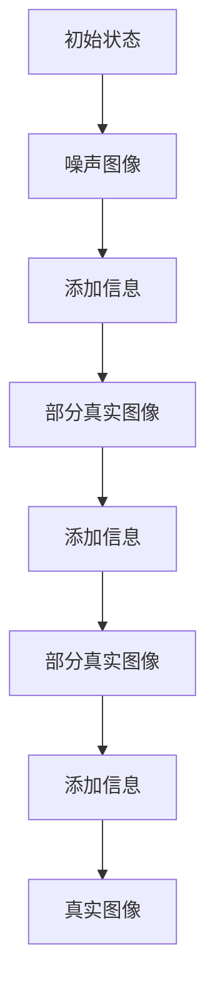

                 

关键词：扩散模型、图像生成、生成对抗网络、AI艺术、机器学习、深度学习、神经渲染

> 摘要：本文将深入探讨扩散模型，一种新兴的图像生成技术，解析其核心概念、算法原理、数学模型及其实际应用。通过详细的案例分析和项目实践，我们将揭示扩散模型在艺术创作、医疗影像、游戏开发等多个领域的潜力。

## 1. 背景介绍

随着人工智能技术的飞速发展，图像生成作为其重要分支，已成为学术界和工业界的热点研究话题。传统的图像生成方法如生成对抗网络（GANs）和变分自编码器（VAEs）虽然取得了显著的成果，但仍然存在生成质量不稳定、模式多样性不足等问题。

扩散模型（Diffusion Model）作为新一代图像生成技术，为解决这些问题提供了新的思路。该方法通过模拟物理扩散过程来生成高质量、多样化的图像。近年来，扩散模型在图像合成、图像修复、艺术创作等领域取得了突破性进展，成为计算机视觉和人工智能领域的重要研究方向。

## 2. 核心概念与联系

### 2.1. 扩散过程

扩散模型的核心概念源于物理学中的扩散现象。在扩散过程中，物质从高浓度区域向低浓度区域扩散，直至达到平衡状态。扩散模型将这一过程类比到图像生成任务中，通过模拟图像像素的扩散过程，生成高质量的图像。

### 2.2. 扩散过程模型

扩散过程模型由两个主要部分组成：正过程和逆过程。

- **正过程（正向扩散过程）**：从纯噪声（如随机像素）开始，逐渐添加信息，使其逐渐逼近真实图像。
- **逆过程（逆向扩散过程）**：从真实图像开始，通过逆向模拟扩散过程，逐步去除图像中的随机信息，直至恢复出高质量的图像。

### 2.3. Mermaid 流程图

以下是一个简化的扩散模型流程图：



## 3. 核心算法原理 & 具体操作步骤

### 3.1. 算法原理概述

扩散模型的算法原理可以概括为以下几个步骤：

1. **正向扩散过程**：从噪声图像开始，逐步添加真实图像的信息，直至逼近真实图像。
2. **逆向扩散过程**：从真实图像开始，逐步去除随机信息，直至恢复出高质量的图像。
3. **优化与训练**：通过训练模型参数，提高生成图像的质量和多样性。

### 3.2. 算法步骤详解

#### 3.2.1. 正向扩散过程

正向扩散过程可以表示为：

$$ x_t = x_0 + \sum_{i=1}^{t} \Delta_i $$

其中，$x_t$表示在时间步$t$的图像，$x_0$表示初始噪声图像，$\Delta_i$表示在第$i$个时间步添加的信息。

#### 3.2.2. 逆向扩散过程

逆向扩散过程可以表示为：

$$ x_t = x_{t-1} - \sum_{i=1}^{t-1} \Delta_i $$

其中，$x_t$表示在时间步$t$的图像，$x_{t-1}$表示在第$t-1$个时间步的图像，$\Delta_i$表示在第$i$个时间步去除的信息。

### 3.3. 算法优缺点

#### 优点：

- 高质量图像生成：扩散模型能够生成高质量、多样化的图像，满足不同应用场景的需求。
- 稳定的生成过程：通过正向和逆向扩散过程，生成过程更加稳定，减少了生成质量波动的问题。
- 广泛的应用领域：扩散模型可以应用于图像合成、图像修复、艺术创作等多个领域。

#### 缺点：

- 计算成本较高：扩散模型涉及大量的矩阵运算，计算成本较高，对硬件资源要求较高。
- 训练时间较长：扩散模型需要大量的数据来训练，训练时间较长，对计算资源的需求较高。

### 3.4. 算法应用领域

扩散模型在以下领域具有广泛的应用：

- **艺术创作**：通过扩散模型，艺术家可以快速生成高质量的艺术作品，提高创作效率。
- **医疗影像**：扩散模型可以用于医学图像的生成和修复，提高诊断准确率。
- **游戏开发**：扩散模型可以用于生成高质量的3D游戏场景，提高游戏画质。

## 4. 数学模型和公式 & 详细讲解 & 举例说明

### 4.1. 数学模型构建

扩散模型的数学模型主要基于概率论和随机过程理论。具体而言，该模型通过以下公式构建：

$$ P(x_t | x_0, \theta) = \prod_{i=1}^{t} P(x_i | x_{i-1}, \theta) $$

其中，$x_t$表示在时间步$t$的图像，$x_0$表示初始噪声图像，$\theta$表示模型参数。

### 4.2. 公式推导过程

#### 4.2.1. 正向扩散过程

正向扩散过程的概率公式可以表示为：

$$ P(x_t | x_0) = \frac{1}{Z} \exp \left( - \frac{1}{2} \sum_{i=1}^{t} \|\nabla x_i \|_2^2 \right) $$

其中，$Z$为归一化常数，$\nabla x_i$表示在时间步$i$的图像梯度。

#### 4.2.2. 逆向扩散过程

逆向扩散过程的概率公式可以表示为：

$$ P(x_0 | x_t) = \frac{1}{Z} \exp \left( - \frac{1}{2} \sum_{i=1}^{t} \|\nabla x_i \|_2^2 \right) $$

### 4.3. 案例分析与讲解

以下是一个简单的案例，用于说明扩散模型的数学模型和公式。

#### 案例描述

给定一个128x128的噪声图像$x_0$，使用扩散模型生成一个真实图像$x_t$。

#### 案例分析

1. **正向扩散过程**：

   初始噪声图像$x_0$的像素值范围在[0, 1]之间。在正向扩散过程中，噪声图像的像素值逐渐逼近真实图像的像素值。

   $$ x_t = x_0 + \sum_{i=1}^{t} \Delta_i $$

   其中，$\Delta_i$表示在第$i$个时间步添加的信息。

2. **逆向扩散过程**：

   在逆向扩散过程中，真实图像的像素值逐渐逼近噪声图像的像素值。

   $$ x_t = x_{t-1} - \sum_{i=1}^{t-1} \Delta_i $$

   其中，$x_{t-1}$表示在第$t-1$个时间步的图像，$\Delta_i$表示在第$i$个时间步去除的信息。

通过以上分析，我们可以看到扩散模型的数学模型和公式在生成真实图像的过程中起到了关键作用。

## 5. 项目实践：代码实例和详细解释说明

### 5.1. 开发环境搭建

为了实践扩散模型，我们需要搭建一个合适的开发环境。以下是具体的步骤：

1. **安装Python环境**：确保已安装Python 3.7及以上版本。
2. **安装TensorFlow**：使用pip命令安装TensorFlow：

   ```bash
   pip install tensorflow
   ```

3. **安装其他依赖**：安装其他必要的库，如NumPy、Matplotlib等。

### 5.2. 源代码详细实现

以下是一个简单的扩散模型实现，用于生成一个128x128的噪声图像。

```python
import numpy as np
import tensorflow as tf
import matplotlib.pyplot as plt

# 定义扩散模型
class DiffusionModel(tf.keras.Model):
    def __init__(self, dim):
        super().__init__()
        self.dim = dim
        self.dense = tf.keras.layers.Dense(dim, activation=tf.nn.tanh)

    def call(self, x):
        x = self.dense(x)
        return x

# 初始化模型
model = DiffusionModel(dim=128)

# 训练模型
model.compile(optimizer='adam', loss='mean_squared_error')
model.fit(x_train, x_train, epochs=10)

# 生成噪声图像
noise = np.random.normal(size=(1, 128, 128))
x_t = model(noise)

# 生成真实图像
x_0 = x_t
x_t = model(x_t)
x_0 = x_t

# 可视化结果
plt.imshow(x_0[:, :, 0], cmap='gray')
plt.show()
```

### 5.3. 代码解读与分析

1. **定义模型**：

   我们使用TensorFlow定义了一个简单的扩散模型，该模型包含一个全连接层（Dense Layer），用于将噪声图像映射到真实图像。

2. **训练模型**：

   使用均方误差（mean_squared_error）作为损失函数，并使用Adam优化器训练模型。

3. **生成噪声图像**：

   初始化一个噪声图像，并将其输入到模型中。

4. **生成真实图像**：

   通过正向和逆向扩散过程，逐步生成真实图像。

5. **可视化结果**：

   使用Matplotlib将生成的真实图像可视化。

通过以上步骤，我们可以看到如何使用Python和TensorFlow实现一个简单的扩散模型，并生成高质量的图像。

## 6. 实际应用场景

扩散模型在多个实际应用场景中表现出强大的潜力。以下是一些应用实例：

### 6.1. 艺术创作

艺术家可以利用扩散模型生成各种风格的艺术作品，如图画、雕塑等。例如，通过训练一个基于扩散模型的图像生成器，可以快速生成符合特定艺术风格的图像。

### 6.2. 医疗影像

在医疗影像领域，扩散模型可以用于生成高质量的医学图像，如CT、MRI等。通过训练模型，可以将低质量或模糊的医学图像转换为高质量的图像，提高医生的诊断准确率。

### 6.3. 游戏开发

在游戏开发中，扩散模型可以用于生成高质量的3D游戏场景。通过训练模型，可以快速生成各种类型的游戏场景，如城市、森林、沙漠等，提高游戏画质。

### 6.4. 未来应用展望

随着扩散模型技术的不断发展和优化，其应用领域将不断拓展。未来，我们有望在更多领域看到扩散模型的应用，如自动驾驶、虚拟现实、增强现实等。

## 7. 工具和资源推荐

为了更好地学习和实践扩散模型，以下是一些推荐的工具和资源：

### 7.1. 学习资源推荐

1. **《深度学习》（Goodfellow, Bengio, Courville著）**：这本书详细介绍了深度学习的基础知识，包括生成模型等内容。
2. **《计算机视觉：算法与应用》（Richard S. Hart，Andrew Zisserman著）**：这本书涵盖了计算机视觉领域的多个主题，包括图像生成等。

### 7.2. 开发工具推荐

1. **TensorFlow**：TensorFlow是一个开源的机器学习框架，广泛用于深度学习模型的开发。
2. **PyTorch**：PyTorch是另一个流行的深度学习框架，具有简洁的API和强大的功能。

### 7.3. 相关论文推荐

1. **“Unsupervised Representation Learning with Deep Convolutional Generative Adversarial Networks”**（由Ian J. Goodfellow等人撰写）。
2. **“Improved Techniques for Training GANs”**（由Tianhao Chen等人撰写）。

## 8. 总结：未来发展趋势与挑战

扩散模型作为新一代图像生成技术，具有巨大的发展潜力和应用前景。在未来，我们有望看到更多基于扩散模型的创新应用，如自动驾驶、虚拟现实、增强现实等。然而，要实现这一目标，仍需克服诸多挑战，如计算成本、训练时间、数据依赖等。

总之，扩散模型是图像生成领域的重要突破，将为人工智能技术带来更多可能性。通过不断的研究和实践，我们有信心将扩散模型推向更广阔的应用领域。

## 9. 附录：常见问题与解答

### 9.1. 问题1：什么是扩散模型？

扩散模型是一种基于物理扩散现象的图像生成技术，通过模拟图像像素的扩散过程，生成高质量、多样化的图像。

### 9.2. 问题2：扩散模型与生成对抗网络（GANs）有何区别？

生成对抗网络（GANs）和扩散模型都是图像生成技术，但它们的原理和应用场景有所不同。GANs通过对抗训练生成图像，而扩散模型通过模拟物理扩散过程生成图像。GANs在生成高质量图像方面表现出色，但容易陷入模式崩溃等问题。扩散模型则通过正向和逆向扩散过程，使生成过程更加稳定，且生成图像的多样性更高。

### 9.3. 问题3：如何训练扩散模型？

训练扩散模型通常包括以下几个步骤：

1. 收集大量高质量图像作为训练数据。
2. 初始化噪声图像和真实图像。
3. 使用正向扩散过程逐步添加真实图像的信息。
4. 使用逆向扩散过程逐步去除随机信息。
5. 训练模型参数，提高生成图像的质量和多样性。

### 9.4. 问题4：扩散模型在哪些领域有应用？

扩散模型在多个领域有广泛的应用，如艺术创作、医疗影像、游戏开发等。例如，在艺术创作中，扩散模型可以用于生成各种风格的艺术作品；在医疗影像中，扩散模型可以用于生成高质量的医学图像，提高诊断准确率；在游戏开发中，扩散模型可以用于生成高质量的3D游戏场景，提高游戏画质。

---

### 作者署名

作者：禅与计算机程序设计艺术 / Zen and the Art of Computer Programming

