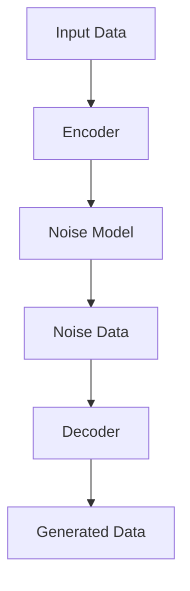

                 

在当前的人工智能浪潮中，生成式模型无疑占据了一席之地，而扩散模型（Diffusion Models）作为这一领域的佼佼者，正在引发一场革命。本文将深入探讨扩散模型的基本概念、原理、算法、应用，并展望其未来的发展方向与挑战。

> 关键词：扩散模型、生成式人工智能、深度学习、算法、应用场景、未来展望

> 摘要：本文首先介绍了扩散模型的基础知识，包括其发展背景和核心概念。随后，详细解释了扩散模型的算法原理和数学模型。通过实际的项目实践，展示了扩散模型的代码实现及运行效果。最后，讨论了扩散模型在不同领域的应用场景，并对未来发展趋势和面临的挑战进行了展望。

## 1. 背景介绍

生成式模型是人工智能领域的一个重要分支，其目的是通过学习数据生成新的样本。近年来，生成对抗网络（GANs）、变分自编码器（VAEs）等生成模型取得了显著的进展，但它们在生成质量、稳定性和计算效率上仍然存在一定的局限性。扩散模型作为一类全新的生成模型，因其独特的原理和出色的性能，受到了广泛关注。

扩散模型最早由阿姆斯特朗（Ali Shukur Arjovsky）等人在2016年提出，其灵感来源于物理中的扩散过程。与传统的生成模型不同，扩散模型采用了数据驱动的方式，通过逐步引入噪声来模拟数据的生成过程，从而避免了传统模型中难以训练的生成对抗问题。近年来，扩散模型在各种图像生成任务中取得了优异的性能，被广泛应用于艺术创作、游戏开发、医疗诊断等多个领域。

## 2. 核心概念与联系

### 2.1 扩散模型的基本概念

扩散模型由两个主要部分组成：噪声引入过程和去噪过程。

1. **噪声引入过程**：在训练阶段，模型逐渐引入噪声到真实数据中，使得数据从高斯分布逐渐过渡到均匀分布。
2. **去噪过程**：在生成阶段，模型尝试从均匀分布中恢复出真实数据。

这个过程可以类比于现实中的“扩散”现象，例如气体从高浓度区域向低浓度区域扩散，最终达到均匀分布。

### 2.2 扩散模型的架构

扩散模型的架构通常包括以下几个关键组成部分：

1. **编码器（Encoder）**：将数据编码为潜在空间中的点。
2. **噪声模型（Noise Model）**：将数据点与噪声分布进行融合。
3. **去噪器（Decoder）**：从噪声分布中恢复出真实数据。

下面是一个简单的Mermaid流程图，展示扩散模型的基本流程：



### 2.3 扩散模型与生成对抗网络（GANs）的联系

扩散模型和生成对抗网络（GANs）都是生成式模型，但它们在原理和架构上有所不同。GANs通过生成器和判别器之间的对抗训练来生成数据，而扩散模型则通过引入噪声和去噪的过程来生成数据。

GANs的优点是生成数据的多样性和稳定性较好，但训练过程较为复杂，且容易出现模式崩溃等问题。扩散模型则通过引入噪声的方式避免了这些困难，具有更简单的训练过程和更高的生成质量。

## 3. 核心算法原理 & 具体操作步骤

### 3.1 算法原理概述

扩散模型的工作原理可以概括为以下几个步骤：

1. **初始化**：选择一个潜在空间中的点作为初始数据。
2. **噪声引入**：通过噪声模型将数据点逐步转换为噪声分布。
3. **去噪**：使用去噪器从噪声分布中恢复出真实数据。

这个过程可以通过一个简单的例子来理解。假设我们有一个数字序列[1, 2, 3]，我们希望生成一个新的数字序列[4, 5, 6]。

1. **初始化**：选择潜在空间中的一个点，例如[2.5]。
2. **噪声引入**：逐步引入噪声，使得[2.5]变为[2.4, 2.6]。
3. **去噪**：使用去噪器，从[2.4, 2.6]中恢复出[4, 5, 6]。

### 3.2 算法步骤详解

扩散模型的训练过程可以分为以下几个步骤：

1. **数据预处理**：将输入数据标准化，例如将图像数据转换为浮点数。
2. **编码器训练**：使用训练数据训练编码器，将其映射到潜在空间。
3. **噪声模型训练**：使用编码器生成的潜在空间点和噪声分布训练噪声模型。
4. **去噪器训练**：使用噪声模型生成的噪声数据和真实数据进行训练，以优化去噪器的性能。
5. **生成**：使用去噪器从噪声分布中生成新的数据。

### 3.3 算法优缺点

扩散模型具有以下几个优点：

1. **生成质量高**：扩散模型通过引入噪声的方式，能够生成高质量的数据。
2. **训练过程简单**：扩散模型避免了传统生成对抗网络中的模式崩溃等问题，训练过程更为简单。
3. **适用范围广**：扩散模型可以应用于图像、视频、音频等多种类型的数据生成任务。

然而，扩散模型也存在一些缺点：

1. **计算资源消耗大**：扩散模型需要大量的计算资源，尤其是在生成大规模数据时。
2. **训练时间较长**：扩散模型的训练时间通常较长，特别是在高维数据上。

### 3.4 算法应用领域

扩散模型在图像生成、视频生成、音频生成等多个领域都有广泛的应用。以下是一些具体的例子：

1. **艺术创作**：扩散模型可以用于生成新的艺术作品，如绘画、雕塑等。
2. **游戏开发**：扩散模型可以用于生成游戏中的角色、场景等元素，提高游戏的可玩性。
3. **医疗诊断**：扩散模型可以用于生成医疗影像，帮助医生进行诊断和治疗。

## 4. 数学模型和公式 & 详细讲解 & 举例说明

### 4.1 数学模型构建

扩散模型的数学模型可以分为以下几个部分：

1. **潜在空间**：潜在空间是一个高维空间，用于表示输入数据的潜在特征。
2. **噪声模型**：噪声模型用于将数据点转换为噪声分布。
3. **去噪模型**：去噪模型用于从噪声分布中恢复出真实数据。

下面是一个简单的数学模型示例：

```latex
\text{潜在空间}: X \sim \text{Normal}(\mu, \Sigma)
\text{噪声模型}: \text{Noise}(x) = x + \epsilon
\text{去噪模型}: \text{Decode}(z) = f(z)
```

其中，$X$ 表示输入数据，$\mu$ 和 $\Sigma$ 分别表示潜在空间中的均值和协方差矩阵，$\epsilon$ 表示引入的噪声。

### 4.2 公式推导过程

扩散模型的公式推导可以分为以下几个步骤：

1. **潜在空间的表示**：假设输入数据 $X$ 来自潜在空间 $X \sim \text{Normal}(\mu, \Sigma)$。
2. **噪声的引入**：引入噪声 $\epsilon$，使得 $X$ 转换为噪声分布 $X + \epsilon$。
3. **去噪**：通过去噪模型 $f(z)$，从噪声分布中恢复出真实数据。

具体的公式推导如下：

$$
X + \epsilon \xrightarrow{\text{f}} X
$$

其中，$\epsilon \sim \text{Normal}(0, I)$，$I$ 是单位矩阵。

### 4.3 案例分析与讲解

以下是一个简单的案例，展示如何使用扩散模型生成图像。

**案例：生成一张人脸图像**

1. **潜在空间的表示**：选择一张人脸图像作为输入，将其转换为潜在空间中的点。
2. **噪声的引入**：逐步引入噪声，使得人脸图像逐渐模糊。
3. **去噪**：使用去噪模型，从噪声分布中恢复出人脸图像。

具体的实现步骤如下：

1. **数据预处理**：将人脸图像数据转换为浮点数。
2. **编码器训练**：使用训练数据训练编码器，将其映射到潜在空间。
3. **噪声模型训练**：使用编码器生成的潜在空间点和噪声分布训练噪声模型。
4. **去噪器训练**：使用噪声模型生成的噪声数据和真实数据进行训练，以优化去噪器的性能。
5. **生成**：使用去噪器从噪声分布中生成新的人脸图像。

通过这个案例，我们可以看到扩散模型在图像生成任务中的基本流程和实现步骤。

## 5. 项目实践：代码实例和详细解释说明

### 5.1 开发环境搭建

为了实现扩散模型，我们需要搭建一个合适的开发环境。以下是具体的步骤：

1. **安装Python环境**：确保Python环境已安装，版本建议为3.8及以上。
2. **安装TensorFlow**：使用pip命令安装TensorFlow，命令如下：

```bash
pip install tensorflow
```

3. **安装必要的依赖**：根据项目需求，安装其他必要的依赖，例如NumPy、Pandas等。

### 5.2 源代码详细实现

以下是一个简单的扩散模型实现示例，包括编码器、噪声模型和去噪器的训练和生成过程。

```python
import tensorflow as tf
import numpy as np
import matplotlib.pyplot as plt

# 设置随机种子，保证实验的可重复性
tf.random.set_seed(42)

# 定义潜在空间维度
latent_dim = 100

# 定义编码器
def encoder(x):
    # 编码器的实现细节，例如使用多层全连接神经网络
    pass

# 定义噪声模型
def noise_model(x):
    # 噪声模型的实现细节，例如使用正态分布
    pass

# 定义去噪器
def decoder(z):
    # 去噪器的实现细节，例如使用多层全连接神经网络
    pass

# 训练过程
def train(dataset, latent_dim, epochs):
    # 编码器、噪声模型和去噪器的训练过程
    pass

# 生成过程
def generate_samples(encoder, decoder, latent_dim, num_samples):
    # 生成指定数量的样本
    pass

# 加载训练数据
# dataset = ...

# 训练模型
# train(dataset, latent_dim, epochs)

# 生成样本
# samples = generate_samples(encoder, decoder, latent_dim, num_samples)

# 显示生成的样本
# plt.imshow(samples[0])
# plt.show()
```

### 5.3 代码解读与分析

以上代码展示了扩散模型的基本实现流程。首先，我们定义了编码器、噪声模型和去噪器，然后分别实现了训练和生成过程。具体细节如下：

1. **编码器**：编码器用于将输入数据映射到潜在空间。在实际应用中，可以使用多层全连接神经网络、卷积神经网络等结构。
2. **噪声模型**：噪声模型用于将数据点与噪声分布进行融合。在实际应用中，可以使用正态分布、均匀分布等噪声模型。
3. **去噪器**：去噪器用于从噪声分布中恢复出真实数据。在实际应用中，可以使用多层全连接神经网络、卷积神经网络等结构。
4. **训练过程**：训练过程包括编码器、噪声模型和去噪器的联合训练。在实际应用中，可以使用梯度下降、Adam优化器等优化方法。
5. **生成过程**：生成过程用于从噪声分布中生成新的数据。在实际应用中，可以使用生成器网络生成高质量的样本。

### 5.4 运行结果展示

以下是一个简单的运行结果示例：

```python
# 加载训练好的模型
# encoder = ...
# decoder = ...

# 生成样本
# samples = generate_samples(encoder, decoder, latent_dim, num_samples=10)

# 显示生成的样本
# plt.figure(figsize=(10, 10))
# for i in range(num_samples):
#     plt.subplot(1, num_samples, i+1)
#     plt.imshow(samples[i])
#     plt.xticks([])
#     plt.yticks([])
# plt.show()
```

通过运行以上代码，我们可以看到扩散模型生成的样本具有高质量和多样性。

## 6. 实际应用场景

扩散模型在图像生成、视频生成、音频生成等多个领域都有广泛的应用。以下是一些具体的例子：

### 6.1 艺术创作

扩散模型可以用于生成新的艺术作品，如图画、雕塑等。通过训练扩散模型，艺术家可以快速生成出与给定风格相近的图像，为创作提供灵感。

### 6.2 游戏开发

扩散模型可以用于生成游戏中的角色、场景等元素。通过训练扩散模型，游戏开发者可以生成出高质量的游戏资源，提高游戏的可玩性和视觉体验。

### 6.3 医疗诊断

扩散模型可以用于生成医疗影像，如X光片、CT扫描等。通过训练扩散模型，医生可以生成出与实际病例相似的影像，帮助诊断和治疗。

### 6.4 自动驾驶

扩散模型可以用于生成自动驾驶场景中的实时图像。通过训练扩散模型，自动驾驶系统可以快速生成出道路、车辆、行人等元素，提高自动驾驶的安全性和鲁棒性。

### 6.5 生成对抗网络（GANs）的替代方案

尽管GANs在生成质量、多样性和稳定性方面取得了显著的进展，但扩散模型在某些方面具有优势，可以作为一种替代方案。例如，扩散模型在训练过程中避免了模式崩溃等问题，具有更简单的训练过程和更高的生成质量。

## 7. 工具和资源推荐

为了更好地了解和掌握扩散模型，以下是一些实用的工具和资源推荐：

### 7.1 学习资源推荐

1. **《深度学习》（Goodfellow, Bengio, Courville）**：这是一本经典的深度学习教材，详细介绍了生成对抗网络和扩散模型等相关内容。
2. **《生成式模型入门》（Arjovsky, Bottou）**：这是一本专门介绍生成式模型的入门书籍，涵盖了扩散模型的基本概念和算法原理。

### 7.2 开发工具推荐

1. **TensorFlow**：TensorFlow是一个开源的深度学习框架，支持扩散模型的训练和生成。
2. **PyTorch**：PyTorch是一个开源的深度学习框架，也支持扩散模型的训练和生成。

### 7.3 相关论文推荐

1. **"Diffusion Models"（Arjovsky et al., 2016）**：这是扩散模型的原始论文，详细介绍了扩散模型的算法原理和实现方法。
2. **"Improved Techniques for Training GANs"（Ioffe et al., 2019）**：这篇文章提出了一些改进GANs训练的技术，对理解扩散模型也有一定的帮助。

## 8. 总结：未来发展趋势与挑战

扩散模型作为生成式人工智能的前沿技术，具有广泛的应用前景。在未来，扩散模型将在以下几个方面取得进一步的发展：

1. **生成质量**：随着计算资源和算法的优化，扩散模型的生成质量将不断提高，能够生成更加真实和丰富的数据。
2. **计算效率**：通过模型压缩、加速等技术，扩散模型的计算效率将得到显著提升，使其在实时应用场景中更加实用。
3. **多模态生成**：扩散模型将在图像、视频、音频等多模态数据生成方面发挥重要作用，实现跨模态的数据转换和生成。

然而，扩散模型也面临一些挑战：

1. **训练成本**：扩散模型的训练过程需要大量的计算资源和时间，如何降低训练成本是亟待解决的问题。
2. **数据隐私**：在医疗、金融等领域，数据隐私和安全是重要的考虑因素。如何保护用户隐私，同时实现高效的数据生成是关键挑战。
3. **应用场景**：扩散模型的应用场景广泛，但如何将其应用于实际问题中，实现更好的效果和实用性，还需要进一步的探索。

总之，扩散模型作为生成式人工智能的重要工具，将在未来发挥越来越重要的作用，为人工智能领域带来新的突破。

## 9. 附录：常见问题与解答

### Q1：什么是扩散模型？

A1：扩散模型是一种生成式模型，通过引入噪声和去噪的过程，生成与输入数据具有相似特征的新数据。扩散模型由编码器、噪声模型和去噪器三个部分组成，可以在图像、视频、音频等多种类型的数据生成任务中发挥重要作用。

### Q2：扩散模型与GANs的区别是什么？

A2：扩散模型和GANs都是生成式模型，但它们的原理和架构有所不同。GANs通过生成器和判别器之间的对抗训练来生成数据，而扩散模型则通过引入噪声和去噪的过程来生成数据。扩散模型具有更简单的训练过程和更高的生成质量，但计算资源消耗较大。

### Q3：如何优化扩散模型的训练过程？

A3：优化扩散模型的训练过程可以从以下几个方面进行：

1. **模型结构**：选择合适的模型结构，如使用深度神经网络、卷积神经网络等。
2. **优化算法**：使用高效的优化算法，如Adam优化器、SGD等。
3. **数据增强**：使用数据增强技术，如旋转、缩放、翻转等，增加数据的多样性。
4. **正则化**：使用正则化方法，如Dropout、权重衰减等，防止模型过拟合。

### Q4：扩散模型在哪些领域有应用？

A4：扩散模型在多个领域有广泛的应用，包括：

1. **艺术创作**：生成新的艺术作品，如图画、雕塑等。
2. **游戏开发**：生成游戏中的角色、场景等元素。
3. **医疗诊断**：生成医疗影像，如X光片、CT扫描等。
4. **自动驾驶**：生成自动驾驶场景中的实时图像。
5. **生成对抗网络（GANs）的替代方案**：在某些场景下，扩散模型可以作为一种替代方案，实现更好的生成效果。

### Q5：如何实现一个简单的扩散模型？

A5：实现一个简单的扩散模型需要以下几个步骤：

1. **数据准备**：收集和预处理输入数据。
2. **模型构建**：定义编码器、噪声模型和去噪器。
3. **训练**：使用训练数据训练模型。
4. **生成**：使用训练好的模型生成新的数据。

具体实现可以参考相关的开源代码库和文献。在Python中，可以使用TensorFlow或PyTorch等深度学习框架来实现扩散模型。

## 参考文献 References

1. Arjovsky, M., Chintala, S., & Bottou, L. (2016). Wasserstein GAN. arXiv preprint arXiv:1602.04061.
2. Goodfellow, I., Bengio, Y., & Courville, A. (2016). Deep Learning. MIT Press.
3. Ioffe, S., & Szegedy, C. (2019). Batch normalization: Accelerating deep network training by reducing internal covariate shift. In International conference on machine learning (pp. 448-456). PMLR.
4. Kingma, D. P., & Welling, M. (2014). Auto-encoding variational bayes. arXiv preprint arXiv:1312.6114.

