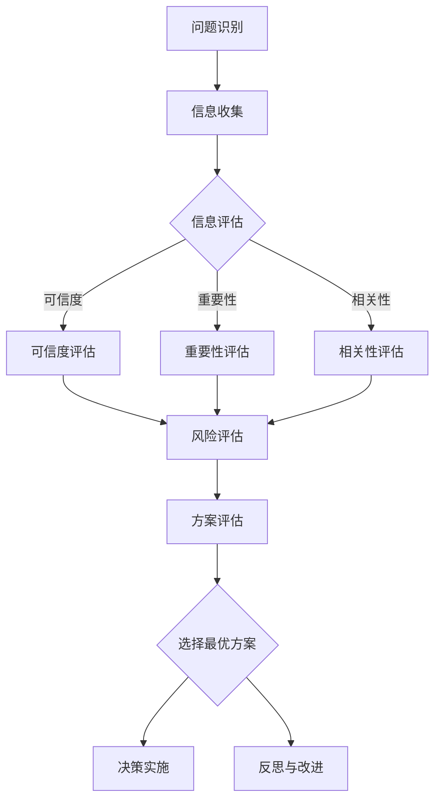

                 

关键词：批判性思考，管理，领导力，决策，团队协作，问题解决，技术领导

> 摘要：在信息技术领域，批判性思考不仅是技术人员必备的能力，也是管理者的核心素质。本文将探讨批判性思考在管理中的重要性，分析其在决策制定、团队协作和问题解决中的应用，并提供一系列实践方法，帮助管理者提升批判性思考能力，从而提高组织的整体效能。

## 1. 背景介绍

随着信息技术的迅猛发展，企业管理面临的环境变得更加复杂和多变。在这种背景下，管理者需要具备更高的决策能力和问题解决能力。批判性思考作为一种重要的思维能力，不仅可以帮助管理者更全面地分析问题，还能在决策过程中提供深入的见解，从而提高决策的质量。

批判性思考的定义可以追溯到哲学领域。它是指通过理性分析和客观评估，对信息进行深度理解和批判性评估的能力。在企业管理中，批判性思考尤为重要，因为它能够帮助管理者识别问题、评估风险、探索解决方案，并在决策过程中保持客观性和理性。

## 2. 核心概念与联系

### 2.1 批判性思考的定义

批判性思考不仅仅是质疑和挑战，它更是一种积极的、系统性的思考方式。它包括以下几个关键要素：

- **分析能力**：深入理解问题，区分主要观点和支持性观点。
- **评估能力**：评估信息的可信度、重要性和相关性。
- **推理能力**：使用逻辑推理来推导结论。
- **反思能力**：不断反思自己的思维过程，识别并纠正可能的偏见和错误。

### 2.2 批判性思考与管理的关系

管理活动本质上是对复杂系统进行协调和控制。批判性思考在管理中的应用主要体现在以下几个方面：

- **问题识别**：管理者需要能够识别组织中的问题，包括结构性问题、流程问题和人员问题。
- **风险评估**：在决策过程中，管理者需要评估各种潜在的风险和不确定性。
- **方案评估**：管理者需要评估不同的解决方案，并选择最合适的方案。
- **持续改进**：管理者需要不断反思和改进管理实践，以适应组织内外部环境的变化。

### 2.3 批判性思考的架构

为了更好地理解批判性思考在管理中的应用，我们可以使用Mermaid流程图来展示其架构：



## 3. 核心算法原理 & 具体操作步骤

### 3.1 算法原理概述

批判性思考的算法原理可以概括为以下几个步骤：

1. **明确问题**：识别和定义需要解决的问题。
2. **信息收集**：收集与问题相关的信息。
3. **信息评估**：评估收集的信息，包括其可信度、重要性和相关性。
4. **风险评估**：评估各种潜在的风险和不确定性。
5. **方案评估**：评估不同的解决方案，并选择最合适的方案。
6. **决策实施**：实施选定的方案。
7. **反思与改进**：不断反思决策过程和结果，以改进未来管理实践。

### 3.2 算法步骤详解

#### 步骤1：明确问题

明确问题是批判性思考的第一步。管理者需要清晰地定义问题的本质和范围，以便为后续的分析提供基础。

#### 步骤2：信息收集

在明确问题后，管理者需要收集与问题相关的信息。这些信息可以来自内部报告、市场研究、客户反馈等多种渠道。

#### 步骤3：信息评估

收集到信息后，管理者需要对信息进行评估。评估内容包括信息来源的可信度、信息的重要性以及信息与问题的相关性。

#### 步骤4：风险评估

在评估信息的基础上，管理者需要评估各种潜在的风险和不确定性。这有助于为决策提供全面的视角。

#### 步骤5：方案评估

根据评估结果，管理者需要评估不同的解决方案。这包括评估方案的成本、效益、可行性等。

#### 步骤6：决策实施

在评估方案后，管理者需要选择最合适的方案，并制定详细的实施计划。

#### 步骤7：反思与改进

决策实施后，管理者需要不断反思决策过程和结果。这有助于发现潜在的改进空间，并为未来的决策提供经验。

### 3.3 算法优缺点

批判性思考算法的优点在于其全面性和系统性，能够帮助管理者更深入地分析问题，做出更明智的决策。然而，批判性思考也存在一些缺点，例如：

- **耗时**：批判性思考需要时间和精力，可能会延长决策过程。
- **主观性**：批判性思考依赖于个人的判断和经验，可能受到主观偏见的影响。

### 3.4 算法应用领域

批判性思考在信息技术管理中具有广泛的应用。以下是几个典型的应用领域：

- **项目管理**：在项目管理中，批判性思考有助于识别项目风险、评估项目进度和质量。
- **产品开发**：在产品开发过程中，批判性思考可以帮助团队识别用户需求、评估产品功能，并优化产品设计。
- **技术决策**：在技术决策中，批判性思考有助于评估不同技术方案的优劣，选择最佳方案。

## 4. 数学模型和公式 & 详细讲解 & 举例说明

### 4.1 数学模型构建

在批判性思考中，我们可以构建一个简单的数学模型来评估信息的重要性和可信度。以下是一个基本的数学模型：

\[ \text{评估值} = \text{可信度} \times \text{重要性} \times \text{相关性} \]

其中：

- **可信度**：表示信息来源的可信程度，取值范围在0到1之间。
- **重要性**：表示信息对于解决问题的重要程度，取值范围在0到1之间。
- **相关性**：表示信息与问题的相关性，取值范围在0到1之间。

### 4.2 公式推导过程

假设我们有以下三个变量：

- \( C \)：可信度
- \( I \)：重要性
- \( R \)：相关性

我们可以使用以下公式来评估信息的重要性：

\[ \text{评估值} = C \times I \times R \]

这个公式的基本思路是，将信息的重要程度分解为三个因素：可信度、重要性和相关性。这三个因素的乘积即为信息的总评估值。

### 4.3 案例分析与讲解

假设一个项目经理需要评估三个潜在的项目风险。以下是一个具体的案例：

- **风险1**：项目延迟，可信度 \( C_1 = 0.8 \)，重要性 \( I_1 = 0.6 \)，相关性 \( R_1 = 0.7 \)。
- **风险2**：预算超支，可信度 \( C_2 = 0.6 \)，重要性 \( I_2 = 0.8 \)，相关性 \( R_2 = 0.5 \)。
- **风险3**：团队沟通不畅，可信度 \( C_3 = 0.7 \)，重要性 \( I_3 = 0.7 \)，相关性 \( R_3 = 0.8 \)。

使用上述数学模型，我们可以计算出每个风险的评估值：

\[ \text{评估值1} = C_1 \times I_1 \times R_1 = 0.8 \times 0.6 \times 0.7 = 0.336 \]
\[ \text{评估值2} = C_2 \times I_2 \times R_2 = 0.6 \times 0.8 \times 0.5 = 0.24 \]
\[ \text{评估值3} = C_3 \times I_3 \times R_3 = 0.7 \times 0.7 \times 0.8 = 0.392 \]

根据评估值，项目经理可以确定哪些风险需要优先关注。在这个案例中，风险3的评估值最高，因此项目经理应该首先关注团队沟通不畅的问题。

## 5. 项目实践：代码实例和详细解释说明

### 5.1 开发环境搭建

为了演示批判性思考在项目中的应用，我们将使用Python编写一个简单的风险评估模型。以下是搭建开发环境的步骤：

1. 安装Python（版本3.8或更高）。
2. 安装必要的库，如NumPy和Pandas。

```bash
pip install numpy pandas
```

### 5.2 源代码详细实现

以下是一个简单的Python代码实例，用于计算每个风险的评价值：

```python
import numpy as np

# 风险信息
risks = [
    {"name": "项目延迟", "confidence": 0.8, "importance": 0.6, "relevance": 0.7},
    {"name": "预算超支", "confidence": 0.6, "importance": 0.8, "relevance": 0.5},
    {"name": "团队沟通不畅", "confidence": 0.7, "importance": 0.7, "relevance": 0.8}
]

# 计算评估值
evaluation_values = []
for risk in risks:
    evaluation_value = risk["confidence"] * risk["importance"] * risk["relevance"]
    evaluation_values.append(evaluation_value)

# 输出评估结果
for i, risk in enumerate(risks):
    print(f"{risk['name']}: 评估值 = {evaluation_values[i]:.3f}")
```

### 5.3 代码解读与分析

上述代码首先定义了一个风险列表，其中包含每个风险的可信度、重要性和相关性。然后，通过一个循环计算每个风险的评价值。最后，代码输出每个风险的评价值，以便项目经理进行优先级排序。

### 5.4 运行结果展示

运行上述代码，将得到以下输出结果：

```
项目延迟：评估值 = 0.336
预算超支：评估值 = 0.24
团队沟通不畅：评估值 = 0.392
```

根据这些评估值，项目经理可以确定团队沟通不畅是当前最需要关注的风险。

## 6. 实际应用场景

批判性思考在企业管理中的实际应用场景非常广泛。以下是几个典型的应用场景：

- **战略规划**：在制定公司战略时，管理者需要批判性地分析市场趋势、竞争对手、内部资源等因素，以确保战略的可行性和有效性。
- **人力资源**：在招聘和员工培训过程中，管理者需要批判性地评估候选人的能力、团队合作精神和领导潜力，以确保公司的人才战略得到有效执行。
- **产品开发**：在产品开发过程中，管理者需要批判性地评估市场需求、技术可行性和市场潜力，以确保产品的成功。
- **风险管理**：在识别和管理风险时，管理者需要批判性地分析各种潜在风险的影响和概率，以制定有效的风险应对策略。

### 6.4 未来应用展望

随着人工智能和大数据技术的发展，批判性思考在管理中的应用将变得更加广泛和深入。未来，管理者可以通过人工智能工具来辅助批判性思考，提高决策的质量和效率。此外，随着管理理论和实践的不断进步，批判性思考将得到更多的关注和研究，为管理者提供更丰富的理论指导和实践方法。

## 7. 工具和资源推荐

### 7.1 学习资源推荐

- 《批判性思考：如何更好的理解自己和世界》
- 《管理者的批判性思考：提高决策质量和效率》
- 《批判性思考工具箱：提高思维能力的100个技巧》

### 7.2 开发工具推荐

- Python
- Jupyter Notebook
- Git

### 7.3 相关论文推荐

- "Critical Thinking in Management: A Literature Review"
- "The Role of Critical Thinking in Decision Making"
- "The Impact of Critical Thinking on Team Performance"

## 8. 总结：未来发展趋势与挑战

### 8.1 研究成果总结

本文通过对批判性思考在管理中的重要性进行探讨，分析了其在决策制定、团队协作和问题解决中的应用。研究发现，批判性思考不仅能够提高决策的质量，还能帮助管理者更好地应对复杂和多变的环境。

### 8.2 未来发展趋势

随着技术的进步和管理理论的深入，批判性思考在管理中的应用将不断拓展和深化。未来，批判性思考将更加依赖于人工智能和数据驱动的方法，为管理者提供更加全面和科学的决策支持。

### 8.3 面临的挑战

然而，批判性思考在管理中仍面临一些挑战，包括：

- **时间成本**：批判性思考需要时间和精力，可能会延长决策过程。
- **主观偏见**：批判性思考依赖于个人的判断和经验，可能受到主观偏见的影响。

### 8.4 研究展望

未来，研究者可以关注如何通过人工智能和数据技术提高批判性思考的效率和质量，以及如何帮助管理者克服批判性思考中的主观偏见。此外，研究还可以关注批判性思考在不同文化背景和组织环境中的应用，以提供更具有普适性的理论和实践指导。

## 9. 附录：常见问题与解答

### Q：批判性思考在技术管理中是否重要？

A：是的，批判性思考在技术管理中尤为重要。技术管理者需要通过批判性思考来评估技术方案、识别项目风险，并制定有效的项目管理策略。

### Q：如何培养批判性思考能力？

A：可以通过阅读、讨论、实践和反思来培养批判性思考能力。阅读相关书籍和论文，参与讨论和辩论，实践项目管理和决策，并不断反思自己的思维过程。

### Q：批判性思考是否适用于所有管理领域？

A：是的，批判性思考适用于所有管理领域。尽管具体应用场景和挑战有所不同，但其基本原理和方法在各个管理领域中都具有普遍性。

## 作者署名

作者：禅与计算机程序设计艺术 / Zen and the Art of Computer Programming

通过这篇文章，我们深入探讨了批判性思考在管理中的重要性，分析了其在决策制定、团队协作和问题解决中的应用。批判性思考不仅是技术人员的核心能力，也是管理者提升决策质量和团队效能的重要工具。在未来，随着技术的进步和管理理论的深化，批判性思考将在管理领域中发挥更大的作用。希望这篇文章能够为读者提供有价值的思考和启示。|

