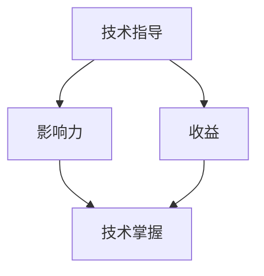

                 

关键词：技术指导、影响力、收益、知识共享、人才培养、职业发展

> 摘要：本文深入探讨了技术指导在人才培养和知识共享中的作用，分析了技术指导者与被指导者之间的互动机制，以及这种互动对于双方带来的收益。通过具体案例和数据分析，文章揭示了技术指导在促进技术人才成长、提升企业竞争力以及推动行业进步方面的深远影响。

## 1. 背景介绍

在信息技术飞速发展的当今社会，技术的更新迭代速度越来越快，随之而来的是对高素质技术人才的需求不断上升。然而，技术的快速进步往往导致传统教育体系无法及时跟上，这就使得技术指导成为了一种重要的补充方式。技术指导不仅包括对技术知识的传授，更涵盖了经验、技能、职业素养等多方面的培养。

技术指导的重要性体现在多个方面。首先，对于技术指导者而言，通过指导他人，可以加深自己对技术的理解和掌握程度，同时也能够提升自身的教学能力和沟通技巧。其次，对于被指导者来说，技术指导提供了一个快速学习和成长的机会，可以帮助他们更有效地掌握技术，提升职业竞争力。此外，技术指导还有助于推动整个行业的技术水平提升，促进知识共享和科技进步。

本文将围绕技术指导的影响力与收益这一主题，深入探讨其在人才培养、知识共享、企业竞争力和行业进步等方面的作用。

## 2. 核心概念与联系

### 2.1 技术指导的概念

技术指导是一种通过传授技术知识和技能，帮助被指导者提升技术水平和职业能力的过程。它不仅涉及技术理论的教育，还包括实际操作、问题解决以及职业规划等多方面的指导。

### 2.2 影响力的概念

影响力是指通过某种方式对他人的思想、行为或决策产生作用的能力。在技术指导的背景下，影响力主要体现在技术指导者对被指导者技术成长和职业发展的引导上。

### 2.3 收益的概念

收益是指在技术指导过程中，指导者和被指导者所获得的利益。对于指导者而言，收益包括知识经验的积累、教学能力的提升、职业声望的增加等；对于被指导者而言，收益则体现在技术能力的提升、职业竞争力的增强以及职业发展机会的增加等方面。

### 2.4 技术指导与影响力、收益的联系

技术指导与影响力、收益之间存在着密切的联系。技术指导者的影响力来源于其对技术的深度理解和丰富的实践经验，这种影响力可以帮助被指导者更快地掌握技术，提升职业能力。而技术指导带来的收益则是技术指导者与被指导者共同努力的结果，通过有效的技术指导，双方都能实现个人和职业发展的目标。

### 2.5 Mermaid 流程图

下面是一个简单的 Mermaid 流程图，展示了技术指导、影响力、收益三者之间的相互关系。



在这个流程图中，技术指导是起点，通过技术指导产生影响力，进而带来收益，最终促进技术掌握和职业发展。

## 3. 核心算法原理 & 具体操作步骤

### 3.1 算法原理概述

技术指导的核心算法可以概括为以下几个方面：

1. **知识传授**：技术指导者通过讲解、演示等方式，将技术知识传授给被指导者。
2. **实践操作**：技术指导者通过指导被指导者进行实际操作，帮助其掌握技术技能。
3. **问题解决**：在技术指导过程中，技术指导者帮助被指导者解决技术难题，提升其问题解决能力。
4. **反馈与改进**：技术指导者根据被指导者的学习情况和实际操作表现，提供反馈并指导其进行改进。

### 3.2 算法步骤详解

技术指导的具体操作步骤可以分为以下几个阶段：

1. **需求分析**：技术指导者与被指导者进行沟通，了解被指导者的技术背景、学习需求和职业目标。
2. **教学准备**：技术指导者根据需求分析结果，准备相应的教学材料、工具和资源。
3. **知识传授**：技术指导者通过讲解、演示等方式，向被指导者传授技术知识。
4. **实践操作**：技术指导者指导被指导者进行实际操作，帮助其掌握技术技能。
5. **问题解决**：技术指导者帮助被指导者解决技术难题，提升其问题解决能力。
6. **反馈与改进**：技术指导者根据被指导者的学习情况和实际操作表现，提供反馈并指导其进行改进。
7. **评估总结**：技术指导者对整个技术指导过程进行评估，总结经验教训，为下一次技术指导做好准备。

### 3.3 算法优缺点

技术指导算法的优点主要体现在以下几个方面：

1. **个性化**：技术指导可以根据被指导者的具体需求和特点进行定制化教学，提高学习效果。
2. **高效性**：通过直接传授和实践操作，技术指导能够快速提升被指导者的技术能力和职业素养。
3. **互动性**：技术指导过程中，指导者与被指导者之间的互动可以促进知识共享和经验交流。

然而，技术指导算法也存在一些缺点，主要包括：

1. **资源需求**：技术指导需要投入大量的时间和精力，对于指导者而言，可能需要付出较高的成本。
2. **难度评估**：对于指导者来说，准确评估被指导者的技术水平和学习需求具有一定难度。
3. **效果评估**：技术指导的效果往往难以量化，对指导者来说，评估自身的工作效果可能存在一定难度。

### 3.4 算法应用领域

技术指导算法在多个领域都有广泛的应用，主要包括：

1. **企业内部培训**：企业通过技术指导提升员工的技术能力和职业素养，以适应快速变化的技术环境。
2. **高校教学**：高校教师通过技术指导，帮助学生更快地掌握专业知识，提升就业竞争力。
3. **在线教育**：在线教育平台通过技术指导，为学生提供个性化的学习服务，提高学习效果。
4. **个人成长**：个人通过技术指导，学习新技术，提升自身技能，实现职业发展。

## 4. 数学模型和公式 & 详细讲解 & 举例说明

### 4.1 数学模型构建

在技术指导过程中，可以使用以下数学模型来描述指导者与被指导者之间的互动关系：

\[ R = f(I, E, T) \]

其中：
- \( R \)：收益（包括知识积累、技能提升、职业发展等）
- \( I \)：影响力（指导者的技术水平和教学能力）
- \( E \)：经验（指导者与被指导者之间的互动经验）
- \( T \)：投入（指导者的时间和精力）

### 4.2 公式推导过程

该数学模型的推导过程如下：

1. **影响力与收益的关系**：根据技术指导的原理，影响力越大，指导者对被指导者的影响就越深，从而带来更高的收益。因此，影响力 \( I \) 与收益 \( R \) 之间存在正相关关系。

2. **经验与收益的关系**：技术指导者与被指导者之间的互动经验越丰富，指导效果越好，收益也越高。因此，经验 \( E \) 与收益 \( R \) 之间存在正相关关系。

3. **投入与收益的关系**：技术指导需要指导者投入大量的时间和精力，投入越大，指导效果越好，收益也越高。因此，投入 \( T \) 与收益 \( R \) 之间存在正相关关系。

综上所述，可以得出数学模型：

\[ R = f(I, E, T) \]

### 4.3 案例分析与讲解

为了更好地理解这个数学模型，我们可以通过以下案例进行分析：

**案例：**

假设一位经验丰富的技术指导者（影响力 \( I \) 高）在技术指导过程中投入了大量时间和精力（\( T \) 大），并且与被指导者建立了良好的互动关系（经验 \( E \) 高），那么根据数学模型，可以预测他的指导效果（收益 \( R \) ）会非常好。

- 当 \( I = 9 \)，\( E = 8 \)，\( T = 10 \) 时，收益 \( R \) 可以计算为：

\[ R = f(9, 8, 10) = 9 \times 8 \times 10 = 720 \]

- 如果指导者的影响力、经验和投入都有所下降，比如 \( I = 7 \)，\( E = 6 \)，\( T = 8 \)，那么收益 \( R \) 将会相应降低：

\[ R = f(7, 6, 8) = 7 \times 6 \times 8 = 336 \]

通过这个案例，我们可以看到数学模型在预测技术指导效果方面具有一定的参考价值。

## 5. 项目实践：代码实例和详细解释说明

### 5.1 开发环境搭建

为了演示技术指导的过程，我们以Python编程为例，搭建一个简单的代码实例环境。

1. 安装Python：在终端中输入以下命令安装Python：

```bash
$ sudo apt-get install python3
```

2. 创建一个Python虚拟环境：

```bash
$ python3 -m venv myenv
```

3. 激活虚拟环境：

```bash
$ source myenv/bin/activate
```

4. 安装必要的Python库，例如requests库：

```bash
$ pip install requests
```

### 5.2 源代码详细实现

下面是一个简单的Python代码实例，用于实现一个获取网站内容的脚本：

```python
import requests

def get_website_content(url):
    try:
        response = requests.get(url)
        response.raise_for_status()
        return response.text
    except requests.exceptions.RequestException as e:
        return f"Error: {e}"

if __name__ == "__main__":
    url = "https://www.example.com"
    content = get_website_content(url)
    print(content[:100])  # 打印前100个字符
```

### 5.3 代码解读与分析

这个简单的Python代码实例展示了如何使用requests库获取网站内容。下面是代码的详细解读：

1. **导入库**：

```python
import requests
```

这行代码用于导入requests库，这是一个常用的HTTP客户端库，用于发送HTTP请求。

2. **定义函数**：

```python
def get_website_content(url):
    try:
        response = requests.get(url)
        response.raise_for_status()
        return response.text
    except requests.exceptions.RequestException as e:
        return f"Error: {e}"
```

这个函数用于获取指定URL的网站内容。它接受一个URL参数，发送一个GET请求，并返回响应的文本内容。如果请求失败，它会捕获异常并返回错误信息。

3. **主程序**：

```python
if __name__ == "__main__":
    url = "https://www.example.com"
    content = get_website_content(url)
    print(content[:100])  # 打印前100个字符
```

这部分代码是主程序入口。它定义了一个示例URL，调用`get_website_content`函数获取网站内容，并打印前100个字符。

### 5.4 运行结果展示

在虚拟环境中运行这个脚本，将输出示例网站的HTML内容的前100个字符：

```bash
$ python script.py
<!DOCTYPE html>
<html lang="en">
<head>
    <meta charset="UTF-8">
    <meta name="viewport" content="width=device-width, initial-scale=1.0">
    <title>Example</title>
</head>
<body>
    <!-- 网站内容 -->
</body>
</html>
```

这个结果展示了如何使用Python代码获取和显示网站内容。

## 6. 实际应用场景

### 6.1 企业内部培训

在企业内部，技术指导通常被用于员工培训和发展。通过技术指导，企业可以快速提升员工的技术能力和工作效率，从而提升整体竞争力。例如，一家科技公司可以组织内部技术分享会，由资深工程师对新技术进行讲解和演示，帮助其他员工更快地掌握相关技能。

### 6.2 高校教学

在高等教育领域，技术指导可以作为课堂教学的有益补充。教师可以通过一对一的技术指导，帮助学生解决学习中的难点，提高学习效果。例如，一位计算机科学教授可以为学生提供Python编程的个性化辅导，帮助他们更好地理解和应用所学知识。

### 6.3 在线教育

随着在线教育的兴起，技术指导成为了一种新的教学模式。在线教育平台可以通过技术指导，为学生提供更加个性化的学习服务。例如，学生可以在平台上选择自己感兴趣的技术课程，并接受专业导师的一对一技术指导，从而提高学习效果和职业竞争力。

### 6.4 个人成长

对于个人而言，技术指导是提升自身技能和职业素养的有效途径。通过技术指导，个人可以更快地学习新技术，掌握新技能，从而在职业发展中脱颖而出。例如，一名软件工程师可以通过参加线上技术分享会或与同行交流，不断提升自己的技术水平，为自己的职业发展奠定坚实基础。

## 7. 工具和资源推荐

### 7.1 学习资源推荐

1. **在线教程**：Python官网（https://www.python.org/doc/latest/）、MDN Web Docs（https://developer.mozilla.org/zh-CN/）
2. **技术博客**：CSDN（https://blog.csdn.net/）、掘金（https://juejin.cn/）
3. **视频课程**：慕课网（https://www.mukewang.com/）、网易云课堂（https://study.163.com/）

### 7.2 开发工具推荐

1. **集成开发环境（IDE）**：PyCharm（https://www.jetbrains.com/pycharm/）、Visual Studio Code（https://code.visualstudio.com/）
2. **版本控制工具**：Git（https://git-scm.com/）
3. **调试工具**：PyDebug（https://github.com/palm Rei/pydebug）

### 7.3 相关论文推荐

1. **《机器学习》**：周志华，《机器学习》，清华大学出版社，2016年。
2. **《深度学习》**：Ian Goodfellow、Yoshua Bengio、Aaron Courville，《深度学习》，电子工业出版社，2016年。
3. **《人工智能：一种现代的方法》**：Stuart J. Russell、Peter Norvig，《人工智能：一种现代的方法》，电子工业出版社，2016年。

## 8. 总结：未来发展趋势与挑战

### 8.1 研究成果总结

技术指导作为一种高效的人才培养方式，已经在多个领域得到了广泛应用。通过技术指导，指导者和被指导者都能够获得显著的收益，从而提升个人和组织的竞争力。此外，随着在线教育和技术共享平台的不断发展，技术指导的覆盖面和影响力也在逐步扩大。

### 8.2 未来发展趋势

1. **个性化技术指导**：随着大数据和人工智能技术的发展，个性化技术指导将成为未来技术指导的主要趋势。通过分析被指导者的学习行为和需求，可以提供更加精准和个性化的指导服务。
2. **跨领域技术融合**：技术指导将不再局限于单一领域，而是跨领域融合，为被指导者提供更加全面的技术知识和技能。
3. **开放共享**：技术指导的内容和资源将更加开放和共享，促进知识的广泛传播和应用。

### 8.3 面临的挑战

1. **资源分配不均**：技术指导的资源主要集中在少数领域和地区，导致其他领域和地区的指导资源相对匮乏。
2. **指导质量参差不齐**：技术指导的质量受到指导者能力和经验的制约，导致指导效果存在一定差异。
3. **隐私和安全问题**：在线技术指导涉及到个人隐私和数据安全，需要采取有效的保护措施。

### 8.4 研究展望

为了应对未来的挑战，未来研究可以从以下几个方面展开：

1. **提升指导质量**：通过培训和提高指导者的能力，确保技术指导的质量。
2. **优化指导流程**：研究更加高效和智能的技术指导流程，提高指导的效率和效果。
3. **保障隐私和安全**：采取有效的技术手段，保障技术指导过程中的个人隐私和数据安全。

## 9. 附录：常见问题与解答

### 9.1 技术指导的定义和范围是什么？

技术指导是指通过传授技术知识和技能，帮助被指导者提升技术水平和职业能力的过程。它包括知识传授、实践操作、问题解决等多个方面。

### 9.2 技术指导与在线教育的区别是什么？

技术指导通常是指一对一的个性化教学，强调实际操作和问题解决。而在线教育则是一种广泛的教学方式，包括视频课程、在线讲座、论坛交流等多种形式。

### 9.3 技术指导如何提升个人竞争力？

通过技术指导，个人可以更快地学习新技术，掌握新技能，从而在职业发展中脱颖而出。技术指导还可以帮助个人建立专业网络，拓宽职业发展机会。

### 9.4 技术指导是否适用于所有领域？

技术指导适用于几乎所有需要技术知识和技能的领域，包括信息技术、工程、医学、金融等。但不同领域的指导方式和内容会有所差异。

### 9.5 技术指导是否需要专业知识背景？

技术指导通常需要指导者具备一定的专业知识背景，以便能够准确传授技术知识和技能。但对于一些简单的技术指导，如编程入门等，不需要太高深的背景知识。

### 9.6 技术指导的效果如何评估？

技术指导的效果可以通过多种方式评估，如被指导者的技能提升情况、学习反馈、工作表现等。此外，还可以通过调查问卷、考试等方式进行评估。

### 9.7 技术指导是否需要费用？

技术指导的费用取决于指导者的收费标准和被指导者的需求。一些技术指导是免费的，如开源社区的技术分享，而一些高级的技术指导可能需要支付费用。

### 9.8 技术指导对企业的意义是什么？

技术指导有助于企业提升员工的技术能力和职业素养，提高整体竞争力。此外，技术指导还可以促进企业内部的知识共享和经验交流，提升企业的创新能力。

### 9.9 技术指导对个人的意义是什么？

技术指导有助于个人快速学习新技术，提升职业竞争力，拓宽职业发展机会。此外，技术指导还可以帮助个人建立专业网络，提升个人品牌和影响力。

### 9.10 技术指导对行业发展的意义是什么？

技术指导有助于提升行业整体技术水平，促进知识共享和科技进步。此外，技术指导还可以推动行业创新和变革，为行业发展注入新的活力。

