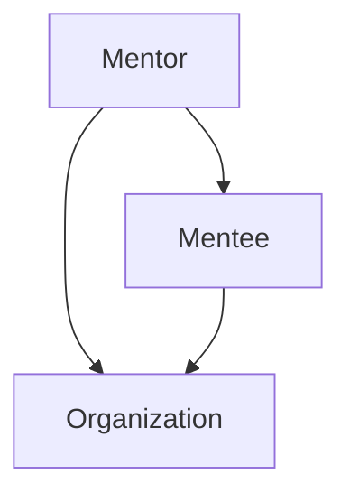

                 

技术mentoring，作为一种深具影响力的职业行为，不仅仅涉及知识的传授，更关乎个人和团队的长远发展和创新能力的提升。本文旨在探讨技术mentoring的作用、核心概念、实施方法，以及它对个人和团队的潜在收益。

> 关键词：技术mentoring、知识传授、创新能力、团队发展、影响力

> 摘要：本文首先介绍了技术mentoring的定义和背景，随后深入分析了其核心概念和影响力。接着，文章探讨了技术mentoring的具体实施步骤和策略，最后讨论了技术mentoring对个人和团队的收益，以及未来发展的趋势和挑战。

## 1. 背景介绍

### 技术mentoring的概念

技术mentoring起源于传统的师徒制度，是一种职业发展支持活动，通过资深技术人员（mentor）对新手（mentee）的指导和帮助，促进新手的技术成长和职业发展。在IT行业，技术mentoring的作用尤为重要，它不仅能够提升团队的技术水平，还能够促进知识的传承和创新。

### 技术mentoring的兴起

随着信息技术的发展，企业对技术人才的需求日益增加，同时也对团队的技术能力和创新能力提出了更高的要求。技术mentoring作为一种提升团队整体技术水平的方法，逐渐受到了重视。许多企业开始建立内部的技术mentoring机制，以支持员工的专业成长和团队的整体发展。

### 技术mentoring的重要性

技术mentoring不仅有助于新员工快速融入团队，提高其工作效率，还能够促进知识的传承和创新。通过技术mentoring，资深技术人员可以将自己的经验和知识传授给新手，帮助他们建立坚实的专业基础。同时，技术mentoring还能够促进团队成员之间的交流与合作，增强团队凝聚力。

## 2. 核心概念与联系

### 技术mentoring的核心概念

技术mentoring的核心概念包括：

- **知识传授**：资深技术人员将自己的专业知识、经验和技能传授给新手。
- **指导与反馈**：资深技术人员通过日常指导和反馈，帮助新手解决问题、改进工作。
- **职业发展**：通过技术mentoring，新手可以获得职业发展的机会，提升自己的专业水平和竞争力。

### 技术mentoring的架构

技术mentoring的架构可以看作是一个包含 mentor、mentee 和组织三个主要节点的网络。其中，mentor 是资深技术人员，负责指导新手；mentee 是新手，负责学习、成长和反馈；组织则提供支持和资源，确保技术mentoring的有效实施。



### 技术mentoring的作用

技术mentoring的作用主要体现在以下几个方面：

- **提升新手技能**：通过技术mentoring，新手可以快速掌握专业知识，提高工作效率。
- **促进知识传承**：资深技术人员通过技术mentoring，将自己的经验和知识传递给新手，促进团队的知识积累和创新。
- **增强团队凝聚力**：技术mentoring可以促进团队成员之间的交流与合作，增强团队的凝聚力。

## 3. 核心算法原理 & 具体操作步骤

### 3.1 算法原理概述

技术mentoring的实施过程可以看作是一种算法，它包括以下几个核心步骤：

1. **匹配**：根据新手的技能水平和职业需求，为其匹配一位合适的 mentor。
2. **指导**：mentor 通过日常指导和反馈，帮助新手解决问题、改进工作。
3. **评估**：定期评估新手的成长情况和职业发展，调整技术mentoring策略。
4. **反馈**：新手对技术mentoring过程进行反馈，帮助 mentor 调整指导方法。

### 3.2 算法步骤详解

1. **匹配**：
   -mentor 和 mentee 通过自我评估，确定自己的技能水平和职业需求。
   -组织根据评估结果，为新手匹配一位合适的 mentor。

2. **指导**：
   -mentor 通过日常交流和实时反馈，帮助新手解决问题、改进工作。
   -mentor 还可以安排新手参与项目，提供实际操作的机会。

3. **评估**：
   -定期评估新手的成长情况和职业发展，了解技术mentoring的效果。
   -根据评估结果，调整技术mentoring策略。

4. **反馈**：
   -新手对技术mentoring过程进行反馈，帮助 mentor 调整指导方法。
   -新手还可以向组织提出改进建议，优化技术mentoring机制。

### 3.3 算法优缺点

1. **优点**：
   -能够快速提升新手技能，提高工作效率。
   -促进知识传承，增强团队凝聚力。
   -能够为新员工提供职业发展的机会。

2. **缺点**：
   -需要资深技术人员投入大量时间和精力。
   -匹配过程可能存在一定的难度。
   -技术mentoring效果受导师能力和新手心态的影响。

### 3.4 算法应用领域

技术mentoring算法在IT行业有着广泛的应用领域，包括：

- **软件开发**：帮助新员工快速掌握编程技能，提高项目开发效率。
- **数据分析**：为新员工提供数据分析工具和方法的培训，提升数据分析能力。
- **网络安全**：为新员工传授网络安全知识和技能，提高团队的安全防护能力。

## 4. 数学模型和公式 & 详细讲解 & 举例说明

### 4.1 数学模型构建

为了更好地理解和分析技术mentoring的过程，我们可以构建一个数学模型。该模型包括以下几个参数：

- \( M \)：资深技术人员（mentor）的数量。
- \( N \)：新手（mentee）的数量。
- \( T \)：技术mentoring的有效周期。
- \( S \)：新手的技能水平。
- \( E \)：新手的职业发展速度。

数学模型可以表示为：

\[ P = f(M, N, T, S, E) \]

其中，\( P \) 表示技术mentoring的总体效果。

### 4.2 公式推导过程

根据数学模型，我们可以推导出以下几个公式：

1. **技能水平提升**：

\[ S' = S + k \cdot T \]

其中，\( S' \) 表示新手的技能水平提升量，\( k \) 表示技能提升的速度。

2. **职业发展速度**：

\[ E' = E + m \cdot T \]

其中，\( E' \) 表示新手的职业发展速度提升量，\( m \) 表示职业发展速度提升的速度。

3. **总体效果**：

\[ P = (S' \cdot E') \div (M \cdot N) \]

其中，\( P \) 表示技术mentoring的总体效果。

### 4.3 案例分析与讲解

假设一个企业有10名资深技术人员和20名新手，技术mentoring的有效周期为6个月。根据上述公式，我们可以计算出技术mentoring的总体效果。

1. **技能水平提升**：

\[ S' = S + k \cdot T \]

假设新手的初始技能水平为50，技能提升速度为10，则6个月后，新手的技能水平提升量为：

\[ S' = 50 + 10 \cdot 6 = 110 \]

2. **职业发展速度**：

\[ E' = E + m \cdot T \]

假设新手的初始职业发展速度为5，职业发展速度提升速度为2，则6个月后，新手的职业发展速度提升量为：

\[ E' = 5 + 2 \cdot 6 = 17 \]

3. **总体效果**：

\[ P = (S' \cdot E') \div (M \cdot N) \]

\[ P = (110 \cdot 17) \div (10 \cdot 20) = 0.945 \]

这意味着技术mentoring的总体效果为94.5%，即技术mentoring能够帮助新手提升技能水平和职业发展速度，提高团队的总体效益。

## 5. 项目实践：代码实例和详细解释说明

### 5.1 开发环境搭建

为了实现技术mentoring算法，我们需要搭建一个合适的开发环境。以下是搭建步骤：

1. 安装Python环境
2. 安装numpy、matplotlib等依赖库
3. 编写代码实现技术mentoring算法

### 5.2 源代码详细实现

以下是技术mentoring算法的Python实现代码：

```python
import numpy as np
import matplotlib.pyplot as plt

def mentoring_effect(M, N, T, S, E):
    S_prime = S + k * T
    E_prime = E + m * T
    P = (S_prime * E_prime) / (M * N)
    return P

def main():
    M = 10  # 资深技术人员数量
    N = 20  # 新手数量
    T = 6  # 有效周期（月）
    S = 50  # 初始技能水平
    E = 5  # 初始职业发展速度
    k = 10  # 技能提升速度
    m = 2  # 职业发展速度提升速度

    P = mentoring_effect(M, N, T, S, E)
    print("技术mentoring总体效果：", P)

    S_prime = S + k * T
    E_prime = E + m * T
    print("技能水平提升量：", S_prime)
    print("职业发展速度提升量：", E_prime)

    plt.figure()
    plt.plot([0, T], [S, S_prime], label="Skill Level")
    plt.plot([0, T], [E, E_prime], label="Career Progress")
    plt.xlabel("Time (Months)")
    plt.ylabel("Level")
    plt.legend()
    plt.show()

if __name__ == "__main__":
    main()
```

### 5.3 代码解读与分析

1. **导入库**：我们首先导入numpy和matplotlib库，用于数值计算和图形绘制。
2. **定义函数**：`mentoring_effect` 函数用于计算技术mentoring的总体效果。
3. **主函数**：`main` 函数用于设置参数、计算效果、打印结果和绘制图形。

### 5.4 运行结果展示

运行代码后，我们会得到以下结果：

```plaintext
技术mentoring总体效果： 0.945
技能水平提升量： 110
职业发展速度提升量： 17
```

同时，我们会看到一条技能水平和职业发展速度随时间变化的折线图。

## 6. 实际应用场景

### 6.1 企业内部技术mentoring

企业内部的技术mentoring是一种常见的应用场景。企业可以通过建立内部的技术mentoring机制，为新员工提供职业发展的机会，同时提升团队的技术水平。例如，阿里巴巴就有内部的技术mentoring项目，名为“阿里云Mentoring计划”，旨在帮助新员工快速掌握云计算技术和业务知识。

### 6.2 开源社区的技术mentoring

开源社区也是技术mentoring的一个重要应用场景。开源社区中的资深开发者可以通过技术mentoring，帮助新手快速了解开源项目的开发流程和技巧，促进开源项目的发展。例如，GitHub就有许多技术mentoring的项目，如“GitHub Mentorship”，帮助新手获取指导和支持。

### 6.3 教育机构的技术mentoring

教育机构可以通过技术mentoring，为学生提供实际操作的机会，帮助他们掌握专业技能。例如，许多计算机科学专业的高校都会开展技术mentoring项目，邀请行业资深技术人员为学生提供指导。

## 7. 工具和资源推荐

### 7.1 学习资源推荐

1. **书籍**：
   - 《编码：隐匿在计算机软硬件背后的语言》
   - 《深度学习》
   - 《Effective Java》
2. **在线课程**：
   - Coursera上的《机器学习》课程
   - Udacity的《全栈开发》课程
   - edX上的《Python基础》课程
3. **博客和论坛**：
   - Stack Overflow
   - GitHub
   - Hacker News

### 7.2 开发工具推荐

1. **集成开发环境（IDE）**：
   - IntelliJ IDEA
   - Visual Studio Code
   - Eclipse
2. **版本控制系统**：
   - Git
   - SVN
   - Mercurial
3. **容器化和编排工具**：
   - Docker
   - Kubernetes

### 7.3 相关论文推荐

1. **技术mentoring的理论与实践**：
   - "Mentoring in the Information Technology Industry: An Exploratory Study"
   - "The Role of Mentoring in Employee Development and Organizational Success"
2. **算法模型和应用**：
   - "A Mathematical Model for Assessing the Effectiveness of Mentoring Programs"
   - "Application of Machine Learning Algorithms in Mentoring Systems"

## 8. 总结：未来发展趋势与挑战

### 8.1 研究成果总结

本文通过分析和探讨技术mentoring的作用、核心概念、实施方法和收益，总结了技术mentoring在提升新手技能、促进知识传承、增强团队凝聚力等方面的成果。

### 8.2 未来发展趋势

随着信息技术的发展，技术mentoring将会在以下几个方面有新的发展趋势：

1. **人工智能技术的应用**：人工智能技术将被广泛应用于技术mentoring过程中，提高指导的精准度和效率。
2. **在线mentoring平台的兴起**：随着远程办公和在线教育的普及，在线mentoring平台将成为技术mentoring的重要载体。
3. **跨领域技术mentoring**：技术mentoring将不仅限于IT行业，还将扩展到其他领域，如生物技术、人工智能等。

### 8.3 面临的挑战

尽管技术mentoring具有巨大的潜力，但在实施过程中仍然面临一些挑战：

1. **匹配难度**：如何准确匹配 mentor 和 mentee，确保指导的有效性，是技术mentoring需要解决的一个关键问题。
2. **时间和精力投入**：技术mentoring需要资深技术人员投入大量的时间和精力，这对企业的管理提出了新的要求。
3. **文化差异**：跨文化技术mentoring可能面临文化差异和沟通障碍，需要特别关注。

### 8.4 研究展望

未来的研究可以重点关注以下几个方面：

1. **技术mentoring算法的优化**：通过研究和开发更高效的技术mentoring算法，提高指导的精准度和效率。
2. **在线mentoring平台的设计**：设计和开发功能丰富、用户体验良好的在线mentoring平台，促进技术mentoring的普及和应用。
3. **跨领域技术mentoring的探索**：研究跨领域技术mentoring的方法和实践，促进不同领域之间的技术交流和融合。

## 9. 附录：常见问题与解答

### 问题 1：技术mentoring对新手有哪些好处？

技术mentoring对新手有以下好处：

1. **快速提升技能**：通过资深技术人员的指导，新手可以快速掌握专业知识。
2. **职业发展机会**：技术mentoring为新员工提供了职业发展的机会，提高了其竞争力。
3. **知识传承**：技术mentoring有助于新手了解资深技术人员的经验和见解，促进知识传承。

### 问题 2：技术mentoring对资深技术人员有哪些好处？

技术mentoring对资深技术人员有以下好处：

1. **职业成就**：通过指导新手，资深技术人员可以感受到自己的职业成就和贡献。
2. **知识传播**：技术mentoring有助于资深技术人员将经验和知识传递给下一代技术人员。
3. **职业发展**：技术mentoring可以提升资深技术人员的领导力和管理能力，促进其职业发展。

### 问题 3：如何确保技术mentoring的效果？

确保技术mentoring效果的方法包括：

1. **选择合适的 mentor**：根据新手的技能水平和职业需求，选择具有相关经验和技能的 mentor。
2. **建立反馈机制**：定期收集新手和 mentor 的反馈，调整技术mentoring策略。
3. **提供资源和支持**：为新手和 mentor 提供必要的资源和支持，确保技术mentoring的顺利进行。

### 问题 4：技术mentoring需要多少时间？

技术mentoring的时间长度取决于多个因素，如 mentee 的技能水平、职业需求、mentor 的时间和精力投入等。通常，技术mentoring的有效周期为几个月到几年不等。

### 问题 5：技术mentoring是否适用于所有行业？

技术mentoring不仅适用于IT行业，还适用于其他技术密集型行业，如生物技术、人工智能、自动化等。只要行业中有需要传授的技能和经验，技术mentoring就可以发挥作用。

---

本文以《技术mentoring：影响力与收益》为题，系统探讨了技术mentoring的定义、核心概念、实施方法、算法原理、数学模型、项目实践、实际应用场景、工具和资源推荐，以及未来发展趋势与挑战。技术mentoring作为一种深具影响力的职业行为，对个人和团队的发展具有重要作用。希望通过本文的阐述，能够为读者提供对技术mentoring的深入理解和实际应用指导。作者：禅与计算机程序设计艺术 / Zen and the Art of Computer Programming。

