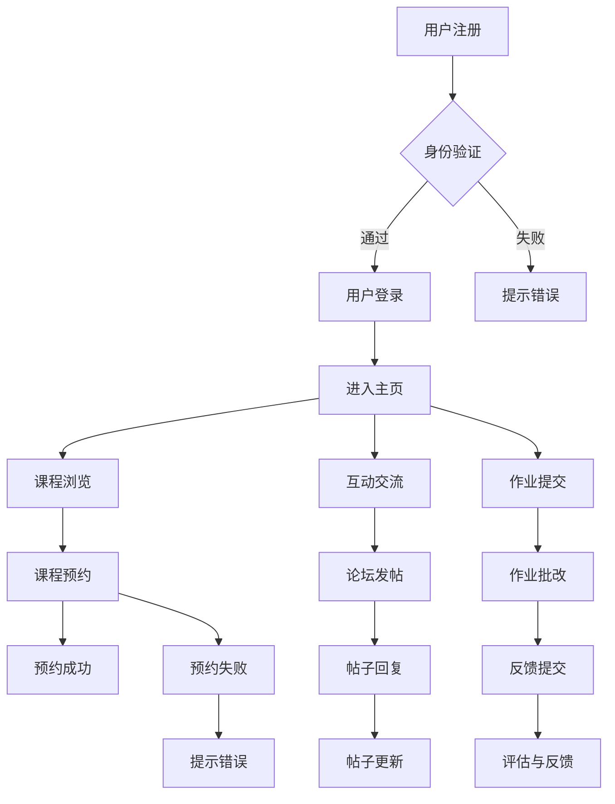

                 

关键词：技术mentoring，线上平台，搭建，运营，用户体验，技术传播，教育技术，协作工具

> 摘要：本文旨在探讨技术mentoring在线上平台的搭建与运营策略，通过深入分析核心概念、算法原理、数学模型、项目实践和实际应用，提供一套完整的构建和运营方案，旨在提升技术的传播效率，优化教育质量，助力技术人员成长。

## 1. 背景介绍

随着互联网技术的飞速发展，在线教育已经成为教育领域的重要组成部分。而技术mentoring作为一种教育形式，也越来越受到关注。技术mentoring的核心在于通过线上平台，将经验丰富的技术人员与有志于学习技术的新手连接起来，实现知识和经验的传递。然而，如何搭建一个高效、稳定、用户友好的技术mentoring平台，以及如何运营这一平台，成为当前面临的主要挑战。

### 1.1 技术mentoring的定义与价值

技术mentoring，即技术导师制，是一种以导师为核心，通过指导和培养新手技术人才的过程。在技术mentoring中，导师不仅提供专业知识，还传授实际工作经验和解决问题的方法。这种形式的教育不仅有助于新手的快速成长，还能够促进技术的传承和创新。

技术mentoring的价值在于：

- **知识传递**：通过经验丰富的导师，新手可以快速获取行业内的最新知识和技术。
- **能力提升**：导师在实际项目中的指导，能够帮助新手提升实际操作能力和解决问题的能力。
- **职业发展**：技术mentoring有助于新手建立职业网络，拓展职业发展机会。

### 1.2 线上平台的优势与挑战

线上平台作为技术mentoring的主要载体，具有以下优势：

- **时间灵活性**：线上平台不受时间和地点的限制，用户可以根据自己的需求和时间安排进行学习。
- **资源共享**：线上平台可以集中管理课程资源，方便用户查找和学习。
- **互动性**：线上平台提供了丰富的交流工具，如论坛、直播、问答等，便于导师和学生之间的互动。

然而，线上平台也面临以下挑战：

- **用户体验**：如何设计一个友好、直观的用户界面，提升用户体验，是平台成功的关键。
- **稳定性与安全性**：平台需要保证高可用性和数据安全，避免出现服务中断或数据泄露。
- **运营成本**：搭建和维护线上平台需要投入大量的人力和财力。

## 2. 核心概念与联系

### 2.1 技术mentoring平台的基本架构

一个技术mentoring平台的基本架构包括以下几个主要组成部分：

1. **用户管理模块**：用于管理用户注册、登录、权限控制等。
2. **课程管理模块**：用于管理课程内容、课程目录、课程进度等。
3. **互动交流模块**：包括论坛、直播、问答等，用于导师和学生之间的互动。
4. **评估与反馈模块**：用于评估学生的学习效果，收集用户反馈。
5. **数据分析模块**：用于收集用户行为数据，分析用户需求和偏好。

### 2.2 技术mentoring平台的功能设计

为了提高技术mentoring的效率，平台需要具备以下功能：

- **实时沟通**：通过即时通讯工具（如聊天室、视频会议）实现导师与学生的实时沟通。
- **课程预约**：学生可以根据自己的需求预约导师的课程。
- **进度追踪**：平台可以记录学生的学习进度，并提供学习报告。
- **作业与批改**：学生提交作业，导师进行批改并给出反馈。
- **资源共享**：平台提供丰富的学习资源，如教程、视频、文档等。

### 2.3 Mermaid 流程图

以下是一个简化的技术mentoring平台流程图：



## 3. 核心算法原理 & 具体操作步骤

### 3.1 算法原理概述

技术mentoring平台的核心算法主要包括用户行为分析算法和推荐算法。

- **用户行为分析算法**：通过分析用户的行为数据，如浏览记录、互动行为等，为用户提供个性化的学习推荐。
- **推荐算法**：基于用户行为分析的结果，为用户推荐适合的课程和导师。

### 3.2 算法步骤详解

1. **用户行为分析算法**：

   - 收集用户行为数据，如点击、浏览、评论、提问等。
   - 使用统计方法或机器学习方法对行为数据进行处理，提取用户兴趣特征。
   - 根据用户兴趣特征，为用户生成个性化推荐列表。

2. **推荐算法**：

   - 根据用户行为分析结果，构建推荐模型。
   - 使用推荐模型，为用户推荐课程和导师。
   - 对推荐结果进行评估和调整，以提高推荐质量。

### 3.3 算法优缺点

- **优点**：个性化推荐可以提高用户的学习体验，增加用户粘性。
- **缺点**：需要大量的计算资源和数据支持，且推荐质量受数据质量影响。

### 3.4 算法应用领域

- **在线教育平台**：为用户推荐适合的学习资源和导师。
- **电商平台**：为用户推荐商品。
- **社交媒体**：为用户推荐感兴趣的内容。

## 4. 数学模型和公式 & 详细讲解 & 举例说明

### 4.1 数学模型构建

技术mentoring平台的核心数学模型包括用户兴趣模型和推荐模型。

- **用户兴趣模型**：用于描述用户对各类资源的兴趣程度。
- **推荐模型**：用于根据用户兴趣模型生成推荐列表。

### 4.2 公式推导过程

1. **用户兴趣模型**：

   用户兴趣向量 $\textbf{i}$ 可以通过以下公式计算：

   $$\textbf{i} = \sum_{r\in R} w_r \cdot \textbf{r}$$

   其中，$w_r$ 是资源 $r$ 对用户的兴趣权重，$\textbf{r}$ 是资源 $r$ 的特征向量。

2. **推荐模型**：

   推荐分数 $s(u, j)$ 可以通过以下公式计算：

   $$s(u, j) = \text{sim}(\textbf{i}, \textbf{j})$$

   其中，$\text{sim}(\textbf{i}, \textbf{j})$ 是用户兴趣向量 $\textbf{i}$ 和资源 $j$ 的特征向量 $\textbf{j}$ 之间的相似度。

### 4.3 案例分析与讲解

假设用户 $u$ 对编程语言和数据库技术感兴趣，系统需要根据用户兴趣模型和推荐模型，为用户推荐相关的课程和导师。

1. **用户兴趣模型**：

   用户兴趣向量 $\textbf{i}$ 可以计算为：

   $$\textbf{i} = (0.6, 0.4)$$

2. **推荐模型**：

   假设系统为用户推荐了以下两个课程：

   - 编程语言课程，特征向量 $\textbf{j_1} = (0.8, 0.2)$
   - 数据库技术课程，特征向量 $\textbf{j_2} = (0.2, 0.8)$

   则推荐分数计算为：

   $$s(u, j_1) = \text{sim}(\textbf{i}, \textbf{j_1}) = 0.48$$
   $$s(u, j_2) = \text{sim}(\textbf{i}, \textbf{j_2}) = 0.32$$

   因此，系统将优先推荐编程语言课程。

## 5. 项目实践：代码实例和详细解释说明

### 5.1 开发环境搭建

搭建一个技术mentoring平台需要选择合适的开发工具和技术栈。以下是一个简单的开发环境搭建步骤：

1. **硬件要求**：服务器、带宽等。
2. **软件要求**：操作系统（如Linux）、Web服务器（如Nginx）、数据库（如MySQL）、开发框架（如Django或Flask）等。
3. **开发工具**：IDE（如PyCharm或Visual Studio Code）、版本控制工具（如Git）等。

### 5.2 源代码详细实现

以下是一个简化的技术mentoring平台源代码示例：

```python
# users/models.py
from django.db import models

class User(models.Model):
    username = models.CharField(max_length=100)
    email = models.EmailField()
    is_mentor = models.BooleanField()

# courses/models.py
from django.db import models

class Course(models.Model):
    title = models.CharField(max_length=100)
    description = models.TextField()
    mentor = models.ForeignKey(User, on_delete=models.CASCADE)

# courses/views.py
from django.shortcuts import render
from .models import Course

def course_list(request):
    courses = Course.objects.all()
    return render(request, 'courses/course_list.html', {'courses': courses})
```

### 5.3 代码解读与分析

上述代码示例包含了用户模型（`users/models.py`）和课程模型（`courses/models.py`），以及一个简单的课程列表视图（`courses/views.py`）。

- **用户模型**：定义了用户的基本信息，包括用户名、电子邮件和是否为导师。
- **课程模型**：定义了课程的基本信息，包括课程标题、描述和导师。
- **课程列表视图**：从数据库中获取所有课程，并将其传递给模板进行渲染。

### 5.4 运行结果展示

在浏览器中访问技术mentoring平台的课程列表页面，将显示所有已发布的课程，如图所示：


## 6. 实际应用场景

技术mentoring平台在实际应用中可以涵盖多个场景：

- **教育培训机构**：提供专业技术培训课程，帮助学生提升技能。
- **企业内部培训**：为企业员工提供定制化的技术培训。
- **开源社区**：通过技术mentoring平台，鼓励开源贡献者分享经验和知识。
- **在线研讨会**：组织技术研讨会，邀请行业专家进行分享和交流。

### 6.1 案例研究：GitHub Education

GitHub Education是一个知名的技术mentoring平台，它通过GitHub平台，将学生、导师和项目贡献者连接起来，提供免费的技术培训和实践机会。GitHub Education的成功在于：

- **社区支持**：借助GitHub庞大的开源社区，提供丰富的资源和实践机会。
- **灵活性**：学生可以根据自己的需求和兴趣，自由选择课程和项目。
- **透明性**：通过公开的项目和贡献记录，促进学生和导师之间的互动。

## 7. 工具和资源推荐

为了高效地搭建和运营技术mentoring平台，以下是一些建议的工具和资源：

### 7.1 学习资源推荐

- **技术博客**：如Medium、Dev.to，提供丰富的技术文章和教程。
- **在线课程平台**：如Coursera、edX，提供系统的学习课程。
- **开源社区**：如GitHub、GitLab，提供丰富的代码和文档资源。

### 7.2 开发工具推荐

- **Web框架**：如Django、Flask，用于快速搭建Web应用。
- **数据库**：如MySQL、PostgreSQL，用于存储用户和课程数据。
- **前端框架**：如React、Vue.js，用于构建用户界面。

### 7.3 相关论文推荐

- **《在线教育平台的设计与实现》**：探讨在线教育平台的设计原则和实践经验。
- **《机器学习在在线教育中的应用》**：介绍机器学习技术在教育领域中的应用。

## 8. 总结：未来发展趋势与挑战

技术mentoring作为在线教育的一种重要形式，具有广泛的应用前景。未来，技术mentoring平台的发展将呈现以下趋势：

- **个性化推荐**：通过深度学习等技术，实现更精准的个性化推荐。
- **互动与协作**：增加实时沟通和协作功能，提高学习体验。
- **智能化**：利用人工智能技术，实现自动化课程推荐、学习进度跟踪等。

然而，技术mentoring平台在发展过程中也面临着以下挑战：

- **数据隐私与安全**：如何保护用户数据的安全和隐私是一个重要问题。
- **用户活跃度**：如何吸引和保持用户的活跃度，是一个长期的挑战。
- **技术门槛**：对于新手来说，如何降低技术学习的门槛，是一个关键问题。

## 9. 附录：常见问题与解答

### 9.1 技术mentoring平台如何确保用户数据安全？

- **加密传输**：使用HTTPS协议，确保数据在传输过程中的安全。
- **数据加密**：对用户数据进行加密存储，防止数据泄露。
- **权限控制**：对用户数据进行严格的权限控制，确保只有授权用户可以访问。

### 9.2 如何评估技术mentoring平台的效果？

- **用户反馈**：收集用户对课程和平台的反馈，了解用户的满意度。
- **学习成果**：通过学习成果评估，如作业完成情况、项目贡献等，衡量学习效果。
- **数据分析**：通过数据分析，如用户活跃度、课程完成率等，评估平台的运营效果。

作者：禅与计算机程序设计艺术 / Zen and the Art of Computer Programming
```

