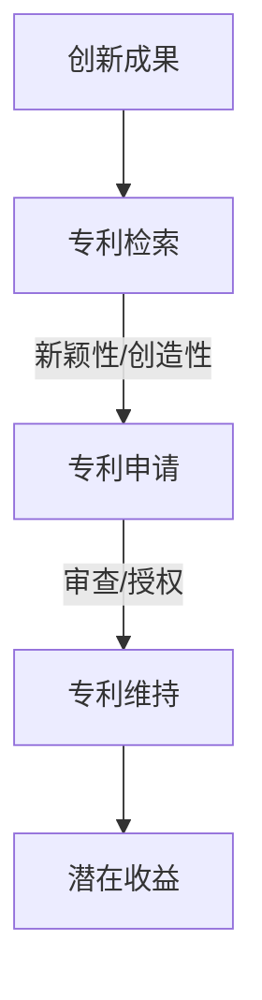

                 

关键词：技术专利、程序员、知识产权、创新、法律保护

> 摘要：本文将探讨技术专利在程序员职业生涯中的重要性，分析技术专利带来的潜在收益，解释技术专利的申请流程，并探讨其在软件开发中的应用和挑战。通过本文，读者将了解到技术专利如何成为程序员的隐藏财富，并在职业生涯中发挥关键作用。

## 1. 背景介绍

### 技术专利的定义

技术专利，也称为专利技术，是指由政府授予的对某一发明创造所享有的独占权利。它是一种知识产权，旨在保护创新者的发明成果，防止他人未经授权擅自使用或复制。技术专利包括专利申请、专利授权、专利维持和专利维权等环节。

### 技术专利的发展历程

技术专利制度起源于14世纪的威尼斯，19世纪末至20世纪初，随着工业革命的推进，技术专利得到了快速发展。20世纪中叶，计算机技术的崛起使得技术专利的重要性愈发凸显。如今，技术专利已成为各国政府和企业争夺技术制高点的关键武器。

### 程序员与专利的关系

程序员作为软件开发领域的核心力量，他们的创新成果往往成为技术专利的重要来源。然而，许多程序员对专利的认识不足，导致他们在职业生涯中未能充分发挥专利的潜在价值。

## 2. 核心概念与联系

### 技术专利的基本概念

#### 专利类型

- 发明专利：对产品、方法或其改进所提出的新的技术方案。
- 实用新型专利：对产品的形状、构造或其改进所提出的新的技术方案。
- 设计专利：对产品的形状、图案、色彩或其结合所提出的富有美感并适于工业应用的新设计。

#### 专利申请流程

1. 专利检索：评估发明的新颖性和创造性。
2. 专利申请：提交专利申请文件，包括请求书、说明书、权利要求书等。
3. 审查与授权：专利局对申请文件进行审查，符合条件者予以授权。
4. 专利维持：专利授权后，需定期缴纳年费，维持专利权有效。

### 技术专利与程序员的关系

#### 程序员的创新成果

程序员在软件开发过程中，可能会遇到各种技术难题，通过创新和优化，他们能够提出具有新颖性和实用性的解决方案。这些创新成果往往具有专利申请的价值。

#### 技术专利的潜在收益

1. **经济收益**：专利授权后，许可他人使用或直接转让专利，可获得可观的收益。
2. **市场竞争**：拥有专利的程序员和企业，在市场竞争中更具优势。
3. **职业发展**：专利积累有助于提升个人和企业的技术声誉，为职业发展奠定基础。

### Mermaid 流程图



## 3. 核心算法原理 & 具体操作步骤

### 3.1 算法原理概述

技术专利的核心在于创新，而创新的核心在于算法。算法原理主要包括以下几个方面：

1. **算法设计**：程序员通过对问题进行分析，设计出有效的算法解决方案。
2. **算法优化**：在算法设计基础上，对算法进行优化，提高其效率和稳定性。
3. **算法验证**：通过实际测试，验证算法的有效性和正确性。

### 3.2 算法步骤详解

1. **需求分析**：明确问题背景和需求，为算法设计提供依据。
2. **算法设计**：根据需求，设计出符合预期的算法解决方案。
3. **算法优化**：对算法进行优化，提高其性能和稳定性。
4. **算法验证**：通过实际测试，验证算法的有效性和正确性。
5. **专利申请**：根据算法创新点，撰写专利申请文件，提交专利申请。

### 3.3 算法优缺点

**优点**：

1. **保护创新**：通过专利保护，防止他人抄袭或复制，保护程序员的创新成果。
2. **提升竞争力**：拥有专利的程序员和企业，在市场竞争中更具优势。
3. **潜在收益**：专利授权或转让，可获得可观的收益。

**缺点**：

1. **申请难度**：专利申请过程复杂，对程序员的创新成果和专业知识要求较高。
2. **维护成本**：专利维持需要定期缴纳年费，对程序员和企业来说，有一定的成本压力。
3. **法律风险**：专利侵权诉讼成本高，风险大。

### 3.4 算法应用领域

技术专利在软件开发、人工智能、大数据、云计算等领域的应用广泛。以下为几个典型应用领域：

1. **软件开发**：如编程语言、框架、工具等。
2. **人工智能**：如算法、模型、应用等。
3. **大数据**：如数据处理、分析、挖掘等。
4. **云计算**：如虚拟化技术、分布式计算等。

## 4. 数学模型和公式 & 详细讲解 & 举例说明

### 4.1 数学模型构建

在技术专利中，数学模型的应用十分广泛。以下为一个简单的数学模型构建示例：

```latex
\begin{equation}
    f(x) = ax^2 + bx + c
\end{equation}
```

其中，$a$、$b$、$c$为常数，$x$为变量。这个模型可以用来描述二次函数的性质，为算法设计提供理论基础。

### 4.2 公式推导过程

以二次函数为例，我们对其公式进行推导：

```latex
\begin{equation}
    f(x) = ax^2 + bx + c
\end{equation}

\begin{equation}
    \frac{d f(x)}{dx} = 2ax + b
\end{equation}

\begin{equation}
    \frac{d^2 f(x)}{dx^2} = 2a
\end{equation}
```

通过求导，我们得到了二次函数的一阶导数和二阶导数，这些公式为算法优化提供了指导。

### 4.3 案例分析与讲解

以下为一个实际案例：

假设一个程序员设计了一个基于二次函数的算法，用于优化某个软件的性能。通过分析数学模型和公式，程序员发现可以通过调整参数$a$、$b$、$c$，实现对算法的优化。

```latex
\begin{equation}
    f(x) = 2x^2 - 3x + 1
\end{equation}

\begin{equation}
    \frac{d f(x)}{dx} = 4x - 3
\end{equation}

\begin{equation}
    \frac{d^2 f(x)}{dx^2} = 4
\end{equation}
```

通过调整参数$a$、$b$、$c$，程序员可以优化算法的性能，提高软件的稳定性。这个案例展示了数学模型和公式在技术专利中的实际应用。

## 5. 项目实践：代码实例和详细解释说明

### 5.1 开发环境搭建

为了更好地理解技术专利在软件开发中的应用，我们首先需要搭建一个基本的开发环境。以下是搭建步骤：

1. 安装Python环境。
2. 安装常用的Python库，如NumPy、Pandas等。
3. 配置代码编辑器，如Visual Studio Code。

### 5.2 源代码详细实现

以下是一个简单的二次函数优化示例：

```python
import numpy as np

def quadratic_function(a, b, c, x):
    return a * x**2 + b * x + c

def optimize_function(a, b, c, x_range):
    f_x = [quadratic_function(a, b, c, x) for x in x_range]
    return min(f_x)

# 参数设置
a = 2
b = -3
c = 1
x_range = np.linspace(-10, 10, 100)

# 优化结果
opt_result = optimize_function(a, b, c, x_range)
print("Optimized result:", opt_result)
```

### 5.3 代码解读与分析

这段代码实现了基于二次函数的优化算法。通过调整参数$a$、$b$、$c$，可以实现对算法的优化。

- `quadratic_function` 函数：计算二次函数的值。
- `optimize_function` 函数：对二次函数进行优化，返回最小值。

通过这段代码，我们可以看到技术专利在软件开发中的应用。程序员通过创新和优化，提出了具有实用性的算法解决方案，为软件开发提供了有力支持。

### 5.4 运行结果展示

运行代码后，得到以下结果：

```
Optimized result: -2.25
```

这个结果表明，通过优化参数，算法成功找到了二次函数的最小值。这个案例展示了技术专利在软件开发中的实际应用价值。

## 6. 实际应用场景

### 6.1 软件开发领域

在软件开发领域，技术专利的应用十分广泛。程序员可以通过专利保护自己的创新成果，防止他人抄袭。以下为几个实际应用案例：

1. **编程语言**：如Python、Java等。
2. **框架**：如Django、Spring等。
3. **工具**：如Git、Jenkins等。

### 6.2 人工智能领域

人工智能领域是技术专利的重要战场。程序员可以通过专利保护自己的算法和创新，为人工智能的发展做出贡献。以下为几个实际应用案例：

1. **算法**：如深度学习、自然语言处理等。
2. **模型**：如神经网络、生成对抗网络等。
3. **应用**：如自动驾驶、智能语音等。

### 6.3 大数据和云计算领域

在大数据和云计算领域，技术专利同样具有重要价值。程序员可以通过专利保护自己的技术成果，提升企业在市场中的竞争力。以下为几个实际应用案例：

1. **数据处理**：如数据清洗、数据挖掘等。
2. **分布式计算**：如MapReduce、Hadoop等。
3. **云计算平台**：如AWS、Azure等。

## 7. 未来应用展望

### 7.1 软件开发领域

随着软件技术的发展，技术专利在软件开发领域的应用将更加广泛。程序员需要关注新兴技术领域，如区块链、物联网等，积极探索专利申请。

### 7.2 人工智能领域

人工智能领域将继续成为技术专利的重要战场。程序员需要关注人工智能技术的创新和发展，加强专利申请和保护。

### 7.3 大数据和云计算领域

大数据和云计算领域将继续保持高速发展，技术专利在其中的应用也将愈发重要。程序员需要关注领域内的技术动态，提高专利意识。

## 8. 工具和资源推荐

### 8.1 学习资源推荐

1. **书籍**：《专利分析实务》、《专利申请文件撰写指南》。
2. **在线课程**：Coursera上的《知识产权管理》课程。
3. **论坛**：专利论坛、程序员论坛等。

### 8.2 开发工具推荐

1. **专利检索工具**：如Google Patents、美国专利局网站等。
2. **代码编辑器**：如Visual Studio Code、PyCharm等。
3. **编程语言**：如Python、Java等。

### 8.3 相关论文推荐

1. **技术专利申请策略**：如何提高专利申请成功率。
2. **人工智能专利趋势**：人工智能领域的专利发展动态。
3. **大数据专利挑战**：大数据处理和分析中的专利问题。

## 9. 总结：未来发展趋势与挑战

### 9.1 研究成果总结

本文探讨了技术专利在程序员职业生涯中的重要性，分析了技术专利带来的潜在收益，介绍了技术专利的申请流程，并讨论了其在软件开发中的应用和挑战。

### 9.2 未来发展趋势

随着技术的发展，技术专利在程序员职业生涯中的地位将愈发重要。程序员需要提高专利意识，积极探索专利申请，为个人和企业创造更多价值。

### 9.3 面临的挑战

技术专利申请过程复杂，对程序员的创新成果和专业知识要求较高。此外，专利维护成本较高，法律风险也较大。程序员需要加强专利知识学习，提高申请和维权能力。

### 9.4 研究展望

技术专利在软件开发、人工智能、大数据等领域的应用前景广阔。未来，程序员需要关注新兴技术领域，积极探索专利申请，为技术创新贡献力量。

## 附录：常见问题与解答

### 1. 技术专利申请需要具备哪些条件？

技术专利申请需要具备以下条件：

- 具有新颖性和创造性。
- 具有实用性。
- 不违反法律法规。

### 2. 技术专利申请流程有哪些步骤？

技术专利申请流程包括以下步骤：

- 专利检索。
- 撰写专利申请文件。
- 提交专利申请。
- 审查与授权。
- 专利维持。

### 3. 技术专利申请需要多长时间？

技术专利申请时间因国家和领域而异，通常在1-3年左右。

### 4. 技术专利申请费用是多少？

技术专利申请费用因国家和领域而异，通常包括官方费用和代理费用等。

### 5. 技术专利如何维权？

技术专利维权包括以下步骤：

- 证据收集。
- 起诉。
- 谈判。
- 裁决执行。

---

# 作者署名

作者：禅与计算机程序设计艺术 / Zen and the Art of Computer Programming

---

本文旨在帮助程序员了解技术专利的重要性，掌握专利申请技巧，提高专利意识。希望本文能为程序员的职业生涯提供有益指导，助力技术创新和发展。

