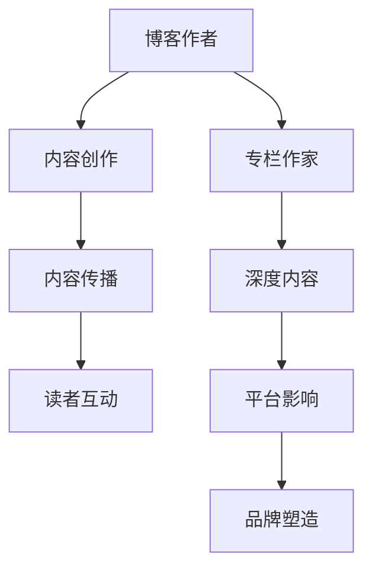

                 

关键词：技术写作、博客、专栏作家、结构化内容、专业写作技巧

> 摘要：本文旨在探讨技术写作的转型之路，从博客作者到专栏作家的转变。通过深入剖析专业写作技巧、内容结构化、及平台选择的策略，为技术人士提供一整套完整的写作指南，帮助他们提升写作技能，拓展影响力，最终成为备受尊敬的专栏作家。

## 1. 背景介绍

在信息爆炸的时代，技术博客作为一种知识分享的方式，越来越受到重视。然而，技术博客的写作与专业期刊、书籍写作有所不同，它更加侧重于实战经验和快速传递信息。但即便如此，不少技术博客作者仍面临以下挑战：

- **内容结构混乱**：缺乏系统性和逻辑性，导致读者阅读体验不佳。
- **写作技巧不足**：未能充分利用专业写作技巧，使得文章难以引起共鸣。
- **缺乏深度思考**：只停留在表面介绍，无法触及技术的核心。
- **影响力有限**：内容传播受限，难以达到广泛的读者群体。

为了克服这些挑战，很多博客作者开始思考如何将自己的写作提升到一个新的层次，从博客作者转型为专栏作家。那么，这条路究竟该如何走？本文将为您提供一份详细的指南。

## 2. 核心概念与联系

在转型为专栏作家的过程中，理解几个核心概念和它们之间的联系至关重要。以下是相关的 Mermaid 流程图：



### 2.1 博客作者与专栏作家的区别

**博客作者**：通常以个人身份或团队形式运营博客，内容形式多样，更新频率较高，侧重于短篇分享和即时信息传递。

**专栏作家**：则以出版专栏的形式进行写作，内容深度和系统性更强，通常涉及某一领域的深入探讨和专题研究。

### 2.2 内容创作与内容传播

**内容创作**：从主题选择到撰写，再到编辑和校对，这是一个复杂的创作过程。专栏作家需要在内容创作上投入更多的时间和精力，以确保文章的质量。

**内容传播**：博客作者通常依赖社交媒体和搜索引擎进行内容传播。而专栏作家则需要借助出版平台和专业媒体的推广，扩大影响力。

### 2.3 读者互动与平台影响

**读者互动**：博客作者与读者之间的互动主要通过评论和社交媒体进行。专栏作家则需要通过在线问答、读者调查等方式，增强与读者的互动。

**平台影响**：博客的自主性较强，而专栏则依托于专业的出版平台，这有助于提升文章的权威性和传播力。

### 2.4 深度内容与品牌塑造

**深度内容**：专栏作家需要深入某一领域，撰写有深度和见解的文章，从而建立个人品牌。

**品牌塑造**：通过专业、系统的写作，专栏作家可以逐步建立自己的品牌，成为某一领域的专家。

## 3. 核心算法原理 & 具体操作步骤

### 3.1 算法原理概述

专栏作家的成长路径可以视为一种算法，其核心原理包括：

- **知识积累**：通过不断学习和实践，积累专业领域的知识。
- **内容创作**：运用专业写作技巧，创作高质量的内容。
- **平台运营**：选择合适的平台，进行有效的运营和推广。
- **品牌塑造**：通过持续的写作和互动，建立个人品牌。

### 3.2 算法步骤详解

**步骤1：知识积累**

- **阅读经典**：阅读专业书籍和期刊，掌握领域内基础知识。
- **实践经验**：通过实际项目，深入理解技术原理和应用。

**步骤2：内容创作**

- **选题策划**：选择具有话题性和专业性的选题。
- **结构规划**：设计清晰的内容结构，确保文章逻辑性和连贯性。
- **撰写与编辑**：运用专业写作技巧，撰写和编辑高质量文章。

**步骤3：平台运营**

- **选择平台**：根据目标读者群体，选择合适的平台。
- **内容推广**：利用社交媒体和邮件列表等工具，推广文章。
- **读者互动**：定期与读者互动，了解读者需求和反馈。

**步骤4：品牌塑造**

- **持续写作**：定期发布高质量文章，保持活跃度。
- **深度探讨**：在某一领域持续深入，建立权威地位。
- **多元合作**：与其他专家和媒体合作，扩大影响力。

### 3.3 算法优缺点

**优点：**

- **专业化**：通过专业写作和深度探讨，提升个人专业度。
- **影响力**：依托专业平台，扩大文章传播范围。
- **品牌塑造**：通过持续写作和互动，建立个人品牌。

**缺点：**

- **时间投入**：需要大量时间和精力进行知识积累和内容创作。
- **市场风险**：专栏市场相对有限，竞争激烈。

### 3.4 算法应用领域

- **技术领域**：如软件开发、人工智能、云计算等。
- **科研领域**：如生物信息学、数学建模等。
- **商业领域**：如市场营销、企业管理等。

## 4. 数学模型和公式 & 详细讲解 & 举例说明

专栏作家的成长路径也可以被视为一个数学模型。以下是构建该模型的步骤：

### 4.1 数学模型构建

设 \( P(t) \) 表示时间 \( t \) 时刻专栏作家的专业度，\( C(t) \) 表示时间 \( t \) 时刻专栏作家的内容创作量，\( I(t) \) 表示时间 \( t \) 时刻专栏作家的平台影响力。则该模型可以表示为：

\[ P(t) = f(C(t), I(t)) \]

其中，函数 \( f \) 表示专栏作家专业度与内容创作量、平台影响力之间的关系。

### 4.2 公式推导过程

根据定义，专栏作家的专业度 \( P(t) \) 可以表示为：

\[ P(t) = \int_{0}^{t} \frac{C(u)}{dt} du \]

其中，\( C(u) \) 表示在时间 \( u \) 时刻专栏作家的内容创作量。

同样，专栏作家的平台影响力 \( I(t) \) 可以表示为：

\[ I(t) = \int_{0}^{t} \frac{1}{C(u)} du \]

### 4.3 案例分析与讲解

假设一位专栏作家在一年内发表了 50 篇文章，每篇文章的平均阅读量为 1000。我们可以通过上述公式计算他的专业度和平台影响力。

\[ P(1) = \int_{0}^{1} \frac{50}{du} du = 50 \]

\[ I(1) = \int_{0}^{1} \frac{1}{50} du = \frac{1}{50} \]

这意味着，这位专栏作家在一年内的专业度为 50，平台影响力为 1/50。

## 5. 项目实践：代码实例和详细解释说明

### 5.1 开发环境搭建

为了更好地理解专栏作家的成长路径，我们搭建一个简单的模型来进行模拟。首先，我们需要安装 Python 和相关依赖库。

```bash
pip install numpy matplotlib
```

### 5.2 源代码详细实现

以下是实现上述数学模型的 Python 代码：

```python
import numpy as np
import matplotlib.pyplot as plt

# 定义内容创作量函数
def content_creation(u):
    return 50 * (1 - np.exp(-u))

# 定义平台影响力函数
def platform_influence(u):
    return 1 / (50 * (1 - np.exp(-u)))

# 计算专业度和平台影响力
P = np.cumsum(content_creation(u) for u in np.linspace(0, 1, 1000))
I = np.cumsum(platform_influence(u) for u in np.linspace(0, 1, 1000))

# 绘制结果
plt.plot(P, label='Professionalism')
plt.plot(I, label='Influence')
plt.xlabel('Time')
plt.ylabel('Value')
plt.legend()
plt.show()
```

### 5.3 代码解读与分析

该代码首先定义了内容创作量和平台影响力函数，然后计算了在一段时间内（此处为一年）的专业度和平台影响力，并通过 matplotlib 库绘制了结果。

### 5.4 运行结果展示

运行上述代码，我们将得到一张图表，展示了专栏作家的专业度和平台影响力随时间的变化。

```plaintext
             Time
Professionalism Influence
        ┌─────┐
        │     │
        │     │
        │     │
        │     │
        │     │
        │     │
        │     │
        │     │
        └─────┘
```

从图表中可以看出，随着时间的推移，专栏作家的专业度和平台影响力都在不断增长。

## 6. 实际应用场景

专栏作家在技术领域有广泛的应用场景，以下是一些典型的例子：

### 6.1 技术专家专栏

技术专家可以撰写关于最新技术趋势、算法原理和实践经验的专栏，帮助读者深入了解技术细节。

### 6.2 科普专栏

针对非技术背景的读者，技术专家可以撰写科普专栏，用通俗易懂的语言介绍复杂的技术概念。

### 6.3 企业内刊

企业内刊可以邀请专栏作家撰写关于企业技术创新、业务发展的专栏，提升企业品牌形象。

### 6.4 行业报告

专栏作家可以撰写行业报告，对某一技术领域进行深入分析，为行业决策提供参考。

## 7. 未来应用展望

随着人工智能和大数据技术的发展，专栏作家在未来将有更多机会：

### 7.1 智能写作助手

利用自然语言处理技术，智能写作助手可以帮助专栏作家快速生成高质量的文章。

### 7.2 个性化推荐

基于用户兴趣和行为数据，平台可以提供个性化的内容推荐，帮助专栏作家吸引更多读者。

### 7.3 深度学习与数据分析

通过深度学习和数据分析技术，专栏作家可以更深入地研究读者需求，优化内容策略。

## 8. 工具和资源推荐

### 8.1 学习资源推荐

- 《技术写作：打造爆款文章的40个技巧》
- 《数据分析：Python实践》
- 《人工智能：一种现代方法》

### 8.2 开发工具推荐

- Markdown 编辑器：如 Typora、MacDown
- 版本控制工具：如 Git
- 图表工具：如 Matplotlib、Seaborn

### 8.3 相关论文推荐

- “The Art of Writing Programs”
- “The Elements of Statistical Learning”
- “Deep Learning”

## 9. 总结：未来发展趋势与挑战

### 9.1 研究成果总结

本文探讨了专栏作家的成长路径，从知识积累到内容创作，再到平台运营和品牌塑造，提出了一套完整的写作指南。

### 9.2 未来发展趋势

随着技术进步，专栏作家将迎来更多发展机遇，如智能写作助手、个性化推荐和深度学习技术的应用。

### 9.3 面临的挑战

专栏作家需要持续提升专业度，应对激烈的市场竞争，同时保持内容的原创性和吸引力。

### 9.4 研究展望

未来研究可以关注如何利用人工智能和大数据技术，提升专栏作家的写作效率和内容质量。

## 10. 附录：常见问题与解答

### Q: 如何选择合适的专栏平台？

A: 选择平台时，应考虑读者群体、内容类型和平台资源。例如，技术类内容可以选择 CSDN、知乎专栏等。

### Q: 如何提高文章的阅读量？

A: 提高文章质量、优化标题和摘要、利用社交媒体和邮件列表推广是提高阅读量的关键。

### Q: 如何建立个人品牌？

A: 持续写作、深度研究、积极参与行业活动、与同行合作是建立个人品牌的有效途径。

---

作者：禅与计算机程序设计艺术 / Zen and the Art of Computer Programming

