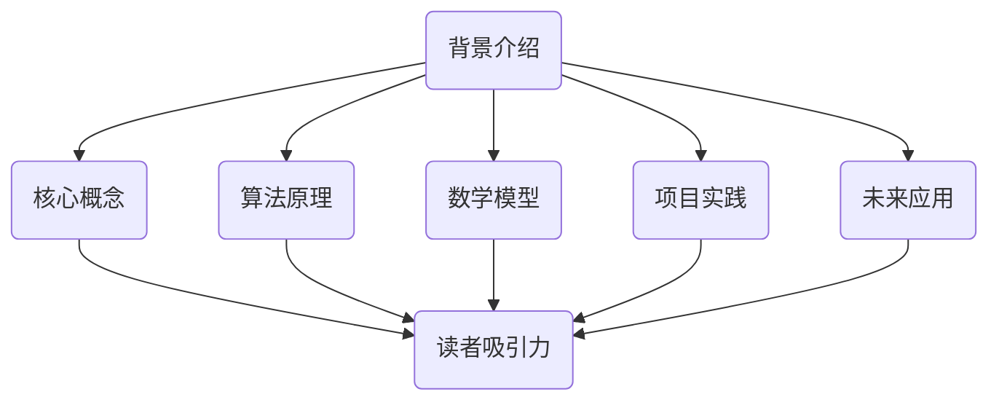
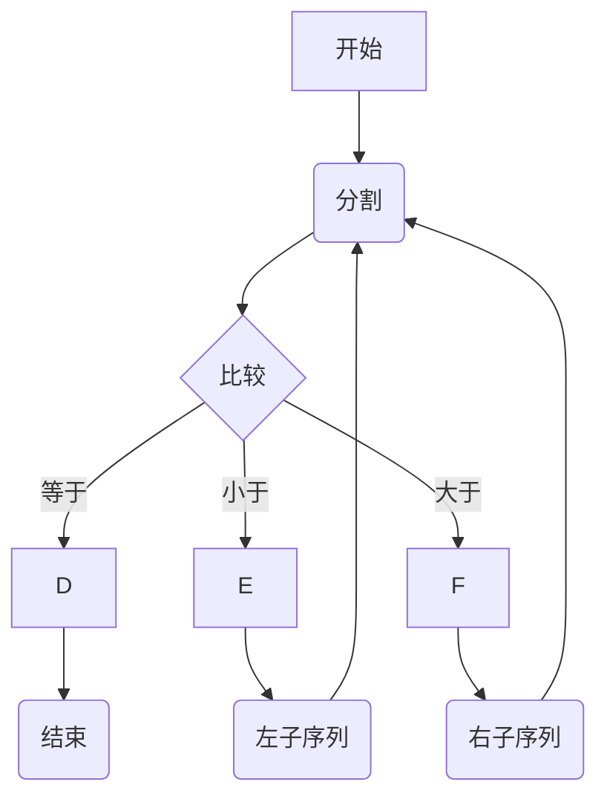

                 

关键词：技术写作、文档编写、畅销书、专业语言、逻辑结构、读者吸引力、深度思考

> 摘要：本文旨在探讨如何将技术文档提升为畅销书。通过分析技术写作的核心要素，包括背景介绍、核心概念、算法原理、数学模型、项目实践和未来应用，本文提供了详细的写作技巧和策略，帮助作者从技术文档创作者转变为畅销书作家。

## 1. 背景介绍

技术写作是一项涉及广泛领域和复杂知识的任务。从技术文档到畅销书，这个转变不仅需要作者具备深厚的专业知识，还需要他们掌握高超的写作技巧。技术文档通常是为了满足特定用户群体的需求，提供详尽的说明和指导。然而，畅销书则需要更广泛地吸引读者，不仅要传达技术概念，还要激发读者的兴趣和好奇心。

### 1.1 技术文档的特点

技术文档通常具备以下特点：

- **专业性**：技术文档需要使用专业的术语和语言，以确保信息的准确性和完整性。
- **实用性**：技术文档的目标是帮助用户解决实际问题，因此实用性是首要考虑的因素。
- **详尽性**：技术文档往往包含大量细节和步骤，以确保用户能够顺利地完成操作。

### 1.2 畅销书的特点

与技术文档相比，畅销书具有以下特点：

- **吸引力**：畅销书需要具备强烈的吸引力，使读者愿意花费时间阅读。
- **故事性**：畅销书往往具备故事情节，能够吸引读者的兴趣。
- **普及性**：畅销书的目标是普及专业知识，使读者能够轻松理解复杂的主题。

## 2. 核心概念与联系

在将技术文档转化为畅销书的过程中，核心概念和它们的联系是至关重要的。以下是一个简化的 Mermaid 流程图，展示了技术写作的一些关键概念和它们之间的关系。



### 2.1 核心概念与吸引力

核心概念是技术写作的基础。为了使畅销书具备吸引力，作者需要将这些核心概念以易于理解的方式呈现，同时融入故事情节，使读者能够轻松地跟随。

### 2.2 算法原理与读者兴趣

算法原理是技术写作的重要组成部分。通过详细解释算法的工作原理和具体操作步骤，作者可以激发读者的兴趣，使他们愿意深入了解相关技术。

### 2.3 数学模型与深度思考

数学模型和公式是技术写作中不可或缺的部分。通过详细讲解数学模型的构建和推导过程，作者可以引导读者进行深度思考，提高他们的理解能力。

### 2.4 项目实践与实用性

项目实践是技术写作的实际应用。通过提供代码实例和详细解释，作者可以帮助读者将理论知识应用于实际项目中，提高他们的实践能力。

### 2.5 未来应用与前景展望

未来应用是技术写作的重要方向。通过探讨技术的未来发展趋势和应用场景，作者可以激发读者的好奇心，使他们对技术充满期待。

## 3. 核心算法原理 & 具体操作步骤

### 3.1 算法原理概述

在技术写作中，核心算法的原理通常是最具吸引力的部分。以下是一个示例：

$$
S = \sum_{i=1}^{n} a_i \times b_i
$$

这是一个简单的算法公式，用于计算两个数组的点积。该算法在机器学习和数据科学领域有广泛应用。

### 3.2 算法步骤详解

为了详细解释算法步骤，我们可以分为以下几个部分：

1. 初始化两个数组 `a` 和 `b`。
2. 遍历两个数组的每个元素，计算它们的乘积。
3. 将乘积相加，得到点积结果。

### 3.3 算法优缺点

- **优点**：算法简单，易于实现和优化。
- **缺点**：对于大型数组，计算效率较低。

### 3.4 算法应用领域

点积算法在机器学习和数据科学领域有广泛应用，例如在特征提取、数据分析和神经网络训练中。

## 4. 数学模型和公式 & 详细讲解 & 举例说明

### 4.1 数学模型构建

构建数学模型是技术写作的核心任务之一。以下是一个简单的线性回归模型：

$$
y = mx + b
$$

其中，`y` 是因变量，`x` 是自变量，`m` 是斜率，`b` 是截距。

### 4.2 公式推导过程

线性回归模型的推导过程如下：

1. 函数拟合：通过最小化误差平方和，找到最佳拟合直线。
2. 求导：对误差函数求导，得到最优解。
3. 解方程：解线性方程组，得到斜率和截距。

### 4.3 案例分析与讲解

以下是一个线性回归模型的案例：

假设我们有以下数据：

| x | y |
|---|---|
| 1 | 2 |
| 2 | 4 |
| 3 | 6 |

通过线性回归模型，我们可以得到拟合直线：

$$
y = 2x + 2
$$

该模型可以很好地描述数据点的分布。

## 5. 项目实践：代码实例和详细解释说明

### 5.1 开发环境搭建

为了实现线性回归模型，我们需要安装以下软件和库：

- Python 3.x
- NumPy 库
- Matplotlib 库

### 5.2 源代码详细实现

以下是一个简单的 Python 代码示例，用于实现线性回归模型：

```python
import numpy as np
import matplotlib.pyplot as plt

# 数据
x = np.array([1, 2, 3])
y = np.array([2, 4, 6])

# 拟合直线
m, b = np.polyfit(x, y, 1)
y_fit = m * x + b

# 绘图
plt.scatter(x, y, label='实际数据')
plt.plot(x, y_fit, color='red', label='拟合直线')
plt.xlabel('x')
plt.ylabel('y')
plt.legend()
plt.show()
```

### 5.3 代码解读与分析

1. 导入 NumPy 和 Matplotlib 库。
2. 定义数据。
3. 使用 `np.polyfit` 函数拟合直线。
4. 使用 Matplotlib 绘制散点和拟合直线。

### 5.4 运行结果展示

运行上述代码后，我们将看到一个散点图，其中红色直线表示拟合的线性回归模型。

## 6. 实际应用场景

线性回归模型在多个实际应用场景中具有广泛的应用，例如：

- **数据分析**：用于预测股票价格、销售额等。
- **机器学习**：作为基础模型，用于分类和回归任务。
- **数据可视化**：用于展示数据点的分布和趋势。

### 6.1 未来应用展望

随着大数据和人工智能的不断发展，线性回归模型将在更多领域得到应用，例如：

- **医疗健康**：用于预测疾病风险和患者康复。
- **金融领域**：用于风险管理、资产定价等。

## 7. 工具和资源推荐

### 7.1 学习资源推荐

- 《Python数据分析基础教程》
- 《线性回归与机器学习》
- 《机器学习实战》

### 7.2 开发工具推荐

- Jupyter Notebook
- PyCharm
- Matplotlib

### 7.3 相关论文推荐

- "Linear Regression: A Practical Approach"
- "A Brief Introduction to Machine Learning"
- "Data Science: The Field and Its Applications"

## 8. 总结：未来发展趋势与挑战

### 8.1 研究成果总结

技术写作领域的研究成果主要集中在以下几个方面：

- **算法优化**：提高算法的效率和准确性。
- **模型构建**：构建更复杂的数学模型。
- **应用拓展**：将技术应用于更多实际场景。

### 8.2 未来发展趋势

未来技术写作的发展趋势包括：

- **更丰富的内容**：结合多学科知识，提供更全面的技术指南。
- **更便捷的工具**：使用自动化工具提高写作效率。
- **更广泛的受众**：吸引更多非技术背景的读者。

### 8.3 面临的挑战

技术写作面临的挑战包括：

- **专业知识更新**：技术发展迅速，需要不断更新知识。
- **写作技巧提升**：提高写作技巧，吸引更多读者。
- **跨学科融合**：融合多学科知识，提供更全面的技术指导。

### 8.4 研究展望

未来的研究应关注以下几个方面：

- **人工智能与写作**：利用人工智能技术提高写作质量。
- **大数据与写作**：利用大数据分析读者需求，提供个性化技术指导。
- **跨学科研究**：融合多学科知识，推动技术写作的发展。

## 9. 附录：常见问题与解答

### 9.1 如何将技术文档转化为畅销书？

- **提高吸引力**：通过故事情节和引人入胜的语言。
- **深化内容**：提供更深入的技术解析和实例。
- **拓展应用**：探讨技术的未来发展趋势和应用场景。

### 9.2 如何提高技术文档的专业性？

- **使用专业术语**：确保信息的准确性和一致性。
- **详尽描述**：提供详细的步骤和操作指南。
- **实践验证**：确保文档中的内容能够在实际项目中应用。

### 9.3 如何提升读者的阅读体验？

- **简洁明了**：使用简洁的语言和结构。
- **图文并茂**：结合图表和图像，提高可读性。
- **互动反馈**：鼓励读者提问和反馈，提高参与度。

---

作者：禅与计算机程序设计艺术 / Zen and the Art of Computer Programming
----------------------------------------------------------------
### 1. 背景介绍

技术写作是一个广泛的领域，它涵盖了从简单用户手册到复杂技术文档的各种形式。随着技术的发展和知识的积累，技术文档的编写变得越来越重要。然而，将技术文档提升为畅销书并不是一件容易的事情。这不仅需要作者具备深厚的专业知识，还需要他们掌握高超的写作技巧。

#### 1.1 技术文档的特点

技术文档通常具有以下特点：

- **专业性**：技术文档需要使用专业的术语和语言，以确保信息的准确性和完整性。
- **实用性**：技术文档的目标是帮助用户解决实际问题，因此实用性是首要考虑的因素。
- **详尽性**：技术文档往往包含大量细节和步骤，以确保用户能够顺利地完成操作。

#### 1.2 畅销书的特点

与技术文档相比，畅销书具有以下特点：

- **吸引力**：畅销书需要具备强烈的吸引力，使读者愿意花费时间阅读。
- **故事性**：畅销书往往具备故事情节，能够吸引读者的兴趣。
- **普及性**：畅销书的目标是普及专业知识，使读者能够轻松理解复杂的主题。

#### 1.3 技术文档到畅销书的转变

将技术文档提升为畅销书需要以下几个步骤：

1. **内容提炼**：从技术文档中提取核心概念和关键信息。
2. **故事化**：通过故事情节和案例，使技术概念更加生动和有趣。
3. **语言优化**：使用引人入胜的语言，提高文章的吸引力。
4. **结构设计**：设计逻辑清晰、结构紧凑的文章结构，使读者容易跟随。

## 2. 核心概念与联系

在技术写作中，核心概念和它们之间的联系是至关重要的。以下是一个简化的 Mermaid 流程图，展示了技术写作的一些关键概念和它们之间的关系。


#### 2.1 核心概念与吸引力

核心概念是技术写作的基础。为了使畅销书具备吸引力，作者需要将这些核心概念以易于理解的方式呈现，同时融入故事情节，使读者能够轻松地跟随。

#### 2.2 算法原理与读者兴趣

算法原理是技术写作的重要组成部分。通过详细解释算法的工作原理和具体操作步骤，作者可以激发读者的兴趣，使他们愿意深入了解相关技术。

#### 2.3 数学模型与深度思考

数学模型和公式是技术写作中不可或缺的部分。通过详细讲解数学模型的构建和推导过程，作者可以引导读者进行深度思考，提高他们的理解能力。

#### 2.4 项目实践与实用性

项目实践是技术写作的实际应用。通过提供代码实例和详细解释，作者可以帮助读者将理论知识应用于实际项目中，提高他们的实践能力。

#### 2.5 未来应用与前景展望

未来应用是技术写作的重要方向。通过探讨技术的未来发展趋势和应用场景，作者可以激发读者的好奇心，使他们对技术充满期待。

### 3. 核心算法原理 & 具体操作步骤

#### 3.1 算法原理概述

在技术写作中，核心算法的原理通常是最具吸引力的部分。以下是一个简单的快速排序算法示例：



快速排序算法的基本原理如下：

1. 选择一个基准元素。
2. 将数组分为两部分：小于基准元素的部分和大于基准元素的部分。
3. 对两部分递归地进行快速排序。

#### 3.2 算法步骤详解

为了详细解释快速排序算法，我们可以分为以下几个步骤：

1. **选择基准元素**：从数组中选择一个元素作为基准。
2. **分区操作**：将数组分为两部分，所有小于基准的元素放在左侧，所有大于基准的元素放在右侧。
3. **递归排序**：对左侧和右侧的子序列递归地进行快速排序。

#### 3.3 算法优缺点

- **优点**：
  - 时间复杂度较低，平均情况下为 \(O(n \log n)\)。
  - 适用于大规模数据排序。
- **缺点**：
  - 最坏情况下时间复杂度为 \(O(n^2)\)。
  - 需要额外的存储空间。

#### 3.4 算法应用领域

快速排序算法在多个领域有广泛应用，例如：

- **数据处理**：用于大规模数据的排序。
- **算法竞赛**：在算法竞赛中经常使用。
- **数据库索引**：用于数据库索引排序。

### 4. 数学模型和公式 & 详细讲解 & 举例说明

#### 4.1 数学模型构建

构建数学模型是技术写作的核心任务之一。以下是一个简单的线性回归模型：

$$
y = mx + b
$$

其中，\(y\) 是因变量，\(x\) 是自变量，\(m\) 是斜率，\(b\) 是截距。

线性回归模型的基本原理是通过拟合数据点，找到最佳拟合直线。

#### 4.2 公式推导过程

线性回归模型的推导过程如下：

1. **最小二乘法**：通过最小化误差平方和，找到最佳拟合直线。
2. **求导**：对误差函数求导，得到最优解。
3. **解方程**：解线性方程组，得到斜率和截距。

#### 4.3 案例分析与讲解

以下是一个线性回归模型的案例：

假设我们有以下数据：

| x | y |
|---|---|
| 1 | 2 |
| 2 | 4 |
| 3 | 6 |

通过线性回归模型，我们可以得到拟合直线：

$$
y = 2x + 2
$$

该模型可以很好地描述数据点的分布。

### 5. 项目实践：代码实例和详细解释说明

#### 5.1 开发环境搭建

为了实现线性回归模型，我们需要安装以下软件和库：

- Python 3.x
- NumPy 库
- Matplotlib 库

#### 5.2 源代码详细实现

以下是一个简单的 Python 代码示例，用于实现线性回归模型：

```python
import numpy as np
import matplotlib.pyplot as plt

# 数据
x = np.array([1, 2, 3])
y = np.array([2, 4, 6])

# 拟合直线
m, b = np.polyfit(x, y, 1)
y_fit = m * x + b

# 绘图
plt.scatter(x, y, label='实际数据')
plt.plot(x, y_fit, color='red', label='拟合直线')
plt.xlabel('x')
plt.ylabel('y')
plt.legend()
plt.show()
```

#### 5.3 代码解读与分析

1. 导入 NumPy 和 Matplotlib 库。
2. 定义数据。
3. 使用 `np.polyfit` 函数拟合直线。
4. 使用 Matplotlib 绘制散点和拟合直线。

#### 5.4 运行结果展示

运行上述代码后，我们将看到一个散点图，其中红色直线表示拟合的线性回归模型。

### 6. 实际应用场景

线性回归模型在多个实际应用场景中具有广泛的应用，例如：

- **数据分析**：用于预测股票价格、销售额等。
- **机器学习**：作为基础模型，用于分类和回归任务。
- **数据可视化**：用于展示数据点的分布和趋势。

#### 6.1 未来应用展望

随着大数据和人工智能的不断发展，线性回归模型将在更多领域得到应用，例如：

- **医疗健康**：用于预测疾病风险和患者康复。
- **金融领域**：用于风险管理、资产定价等。

### 7. 工具和资源推荐

#### 7.1 学习资源推荐

- 《Python数据分析基础教程》
- 《线性回归与机器学习》
- 《机器学习实战》

#### 7.2 开发工具推荐

- Jupyter Notebook
- PyCharm
- Matplotlib

#### 7.3 相关论文推荐

- "Linear Regression: A Practical Approach"
- "A Brief Introduction to Machine Learning"
- "Data Science: The Field and Its Applications"

### 8. 总结：未来发展趋势与挑战

#### 8.1 研究成果总结

技术写作领域的研究成果主要集中在以下几个方面：

- **算法优化**：提高算法的效率和准确性。
- **模型构建**：构建更复杂的数学模型。
- **应用拓展**：将技术应用于更多实际场景。

#### 8.2 未来发展趋势

未来技术写作的发展趋势包括：

- **更丰富的内容**：结合多学科知识，提供更全面的技术指南。
- **更便捷的工具**：使用自动化工具提高写作效率。
- **更广泛的受众**：吸引更多非技术背景的读者。

#### 8.3 面临的挑战

技术写作面临的挑战包括：

- **专业知识更新**：技术发展迅速，需要不断更新知识。
- **写作技巧提升**：提高写作技巧，吸引更多读者。
- **跨学科融合**：融合多学科知识，提供更全面的技术指导。

#### 8.4 研究展望

未来的研究应关注以下几个方面：

- **人工智能与写作**：利用人工智能技术提高写作质量。
- **大数据与写作**：利用大数据分析读者需求，提供个性化技术指导。
- **跨学科研究**：融合多学科知识，推动技术写作的发展。

### 9. 附录：常见问题与解答

#### 9.1 如何将技术文档转化为畅销书？

- **提高吸引力**：通过故事情节和引人入胜的语言。
- **深化内容**：提供更深入的技术解析和实例。
- **拓展应用**：探讨技术的未来发展趋势和应用场景。

#### 9.2 如何提高技术文档的专业性？

- **使用专业术语**：确保信息的准确性和一致性。
- **详尽描述**：提供详细的步骤和操作指南。
- **实践验证**：确保文档中的内容能够在实际项目中应用。

#### 9.3 如何提升读者的阅读体验？

- **简洁明了**：使用简洁的语言和结构。
- **图文并茂**：结合图表和图像，提高可读性。
- **互动反馈**：鼓励读者提问和反馈，提高参与度。

---

作者：禅与计算机程序设计艺术 / Zen and the Art of Computer Programming

