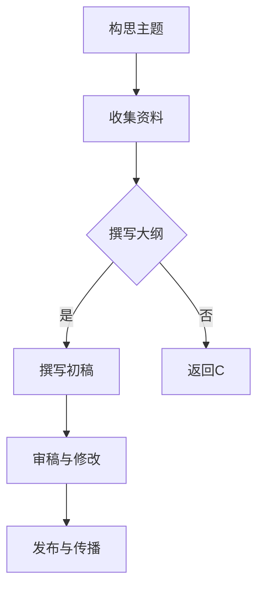

                 

关键词：技术写作、程序员、副业、职业发展、内容创作

> 摘要：在数字时代，技术写作已成为程序员的附加技能，不仅提升个人品牌价值，还能带来额外收入。本文将探讨程序员选择技术写作作为副业的理由、所需技能、写作流程以及未来趋势。

## 1. 背景介绍

随着互联网和信息技术产业的迅猛发展，技术写作的重要性日益凸显。程序员作为技术领域的核心力量，不仅需要具备过硬的编程能力，更需要能够清晰、准确地表达技术思想。技术写作不仅可以帮助程序员更好地分享知识、解决难题，还能作为一种副业，带来额外的经济收入和职业发展机会。

然而，对于许多程序员来说，技术写作是一个相对陌生的领域。他们可能会遇到诸如写作技巧不足、时间管理困难、读者群体定位不清等问题。因此，本文将深入探讨程序员选择技术写作作为副业的原因、所需技能和如何开展技术写作，以帮助程序员更好地在这个领域取得成功。

### 1.1 技术写作的定义

技术写作是指利用文字、图表和其他媒介，将复杂的技术概念、算法、系统架构等转化为易于理解的内容，提供给目标读者。技术写作的目的是帮助读者更好地理解、应用和优化技术。

### 1.2 技术写作的领域

技术写作涵盖了广泛的领域，包括但不限于：
- **编程语言和框架**：介绍各种编程语言的特点、用法和最佳实践。
- **算法和数据结构**：解释算法的原理、实现和应用场景。
- **系统架构和设计模式**：探讨系统设计的原则、架构和设计模式。
- **云计算和大数据**：介绍云计算、大数据技术和应用。
- **人工智能和机器学习**：阐述人工智能和机器学习的基础知识、算法和应用。

### 1.3 技术写作的重要性

技术写作的重要性体现在以下几个方面：
- **知识共享**：技术写作可以帮助程序员分享知识、经验和技巧，促进整个技术社区的进步。
- **个人品牌建设**：通过撰写高质量的技术文章，程序员可以树立个人品牌，提升职业竞争力。
- **收入来源**：技术写作可以作为程序员的一项副业，通过出版书籍、撰写专栏、进行知识付费等方式获得额外收入。

## 2. 核心概念与联系

为了更好地理解技术写作，我们首先需要了解一些核心概念和它们之间的联系。

### 2.1 技术写作的类型

技术写作可以分为多种类型，包括：
- **博客文章**：短小精悍，通常围绕特定主题展开。
- **技术书籍**：系统性地介绍某个技术领域，适合初学者和专业人士。
- **教程和指南**：详细解释某个技术或工具的使用方法。
- **专栏和专题**：定期发表，围绕某一主题进行深入探讨。
- **文档编写**：为软件、系统或其他技术产品编写用户手册、技术文档等。

### 2.2 技术写作的读者群体

技术写作的读者群体可以分为以下几类：
- **初学者**：对某个技术领域有一定了解，但需要更深入的指导。
- **专业人士**：具备一定技术背景，希望了解最新技术动态和最佳实践。
- **项目经理和团队领导者**：需要理解技术细节，以便更好地管理项目和技术团队。
- **决策者**：需要了解技术趋势，以便做出更明智的决策。

### 2.3 技术写作的媒介

技术写作可以通过多种媒介进行，包括：
- **文本**：传统的文字形式，易于理解和传播。
- **图表**：用图形、图表等形式展示技术概念，提高文章的可读性。
- **视频**：结合文字和图像，更生动地展示技术内容。
- **音频**：适用于不便阅读或喜欢听的读者。

### 2.4 技术写作与编程的关系

技术写作与编程密不可分。程序员的技术背景使得他们能够深入理解技术概念，并将这些概念转化为易于理解的内容。同时，编程经验也帮助程序员掌握技术写作的技巧，如结构化思维、逻辑表达等。

### 2.5 Mermaid 流程图

以下是一个简化的技术写作流程的 Mermaid 流程图：



### 2.6 技术写作的挑战

尽管技术写作具有许多优势，但也面临一些挑战：
- **时间管理**：程序员往往面临高强度的工作，需要合理安排时间进行写作。
- **内容质量**：保证文章的质量和深度，需要不断学习和积累经验。
- **读者反馈**：需要关注读者的反馈，根据反馈进行调整和优化。
- **版权和知识产权**：了解相关的版权和知识产权法律，确保内容的安全。

### 2.7 技术写作的价值

技术写作不仅有助于提升个人品牌和职业发展，还有以下价值：
- **知识传播**：帮助更多的人理解和应用技术。
- **社区建设**：促进技术社区的交流和合作。
- **商业机会**：通过技术写作获得额外的收入和商业机会。

## 3. 核心算法原理 & 具体操作步骤

### 3.1 算法原理概述

技术写作的核心算法可以看作是一个内容生产、发布和传播的过程。以下是该算法的原理概述：

1. **需求分析**：确定写作的主题和目标读者。
2. **内容创作**：围绕主题进行调研、撰写和编辑。
3. **发布传播**：选择合适的平台和渠道进行发布和传播。
4. **反馈优化**：根据读者反馈进行内容调整和优化。

### 3.2 算法步骤详解

1. **需求分析**：
   - **确定主题**：根据个人兴趣、市场需求和读者需求确定写作主题。
   - **目标读者**：明确目标读者群体，以便撰写更具针对性的内容。

2. **内容创作**：
   - **资料收集**：通过调研、阅读相关资料和文献，收集所需信息。
   - **撰写初稿**：根据大纲和资料，撰写初稿。
   - **审稿与修改**：邀请同事或专业人士审稿，根据反馈进行修改和完善。

3. **发布传播**：
   - **选择平台**：选择合适的平台和渠道进行发布，如博客、社交媒体、电子书等。
   - **推广传播**：利用社交媒体、邮件列表等工具进行推广，扩大读者群体。

4. **反馈优化**：
   - **收集反馈**：关注读者评论、反馈和评分，了解内容的质量和受欢迎程度。
   - **调整优化**：根据反馈对内容进行调整和优化，提高用户体验。

### 3.3 算法优缺点

**优点**：
- **高效性**：通过算法化流程，提高内容生产的效率。
- **针对性**：根据读者需求和反馈进行内容调整，提高内容质量。
- **可持续性**：通过不断优化和调整，实现内容的持续更新和传播。

**缺点**：
- **时间成本**：需要投入大量时间进行调研、撰写和修改。
- **内容质量**：初学者可能难以保证内容的质量和深度。
- **读者反馈**：需要关注和回应读者的反馈，增加工作量。

### 3.4 算法应用领域

技术写作算法广泛应用于以下领域：
- **个人博客**：个人博客是程序员展示技术能力和个人品牌的重要渠道。
- **技术社区**：技术社区如 Stack Overflow、GitHub 等平台需要大量高质量的技术文章。
- **企业内部培训**：企业内部培训需要编写系统性的技术文档和教程。
- **在线教育**：在线教育平台如 Coursera、edX 等需要大量高质量的教程和课程。

## 4. 数学模型和公式 & 详细讲解 & 举例说明

技术写作中，数学模型和公式是不可或缺的部分，它们能够精确地描述技术概念和算法。以下是关于技术写作中常用的一些数学模型和公式的详细讲解和举例。

### 4.1 数学模型构建

在技术写作中，构建数学模型通常需要以下几个步骤：

1. **问题定义**：明确需要解决的问题和目标。
2. **数据收集**：收集与问题相关的数据，如实验结果、统计数据等。
3. **模型假设**：根据问题的性质，提出合理的假设，简化问题。
4. **公式推导**：根据假设，推导出数学模型和公式。

### 4.2 公式推导过程

以下是一个简单的线性回归模型的推导过程：

1. **问题定义**：假设我们想要预测某个变量的值，该变量与自变量之间存在线性关系。
2. **数据收集**：收集自变量和因变量的数据。
3. **模型假设**：假设线性关系可以表示为 \( y = wx + b \)，其中 \( y \) 是因变量，\( x \) 是自变量，\( w \) 和 \( b \) 是参数。
4. **公式推导**：
   - 最小二乘法：为了使预测值与实际值之间的误差最小，我们需要找到最佳参数 \( w \) 和 \( b \)。这可以通过求解以下方程组来实现：
     \[
     \begin{cases}
     \min_{w,b} \sum_{i=1}^{n} (wx_i + b - y_i)^2 \\
     \end{cases}
     \]
     其中，\( n \) 是数据点的数量。
   - 解方程组：通过求解上述方程组，可以得到最佳参数 \( w \) 和 \( b \)。

### 4.3 案例分析与讲解

以下是一个线性回归模型的案例分析：

#### 案例背景

我们想要预测某个电商平台的销售额，该销售额与广告投放费用（自变量）之间存在线性关系。以下是部分数据：

| 广告投放费用（万元） | 销售额（万元） |
| :--------------: | :---------: |
|       10         |     20     |
|       20         |     40     |
|       30         |     60     |
|       40         |     80     |
|       50         |    100     |

#### 公式推导

根据上述数据，我们可以建立线性回归模型 \( y = wx + b \)。为了求解最佳参数 \( w \) 和 \( b \)，我们需要计算以下值：

1. **平均值**：
   \[
   \bar{x} = \frac{\sum_{i=1}^{n} x_i}{n} = \frac{10 + 20 + 30 + 40 + 50}{5} = 30
   \]
   \[
   \bar{y} = \frac{\sum_{i=1}^{n} y_i}{n} = \frac{20 + 40 + 60 + 80 + 100}{5} = 60
   \]

2. **协方差**：
   \[
   \text{cov}(x, y) = \frac{\sum_{i=1}^{n} (x_i - \bar{x})(y_i - \bar{y})}{n-1} = \frac{(10-30)(20-60) + (20-30)(40-60) + (30-30)(60-60) + (40-30)(80-60) + (50-30)(100-60)}{4} = 200
   \]

3. **方差**：
   \[
   \text{var}(x) = \frac{\sum_{i=1}^{n} (x_i - \bar{x})^2}{n-1} = \frac{(10-30)^2 + (20-30)^2 + (30-30)^2 + (40-30)^2 + (50-30)^2}{4} = 250
   \]

4. **斜率 \( w \) 和截距 \( b \)**：
   \[
   w = \frac{\text{cov}(x, y)}{\text{var}(x)} = \frac{200}{250} = 0.8
   \]
   \[
   b = \bar{y} - w\bar{x} = 60 - 0.8 \times 30 = 24
   \]

因此，我们得到的线性回归模型为 \( y = 0.8x + 24 \)。

#### 模型验证

为了验证模型的准确性，我们可以计算预测值和实际值的差异。以下是对新收集的数据进行预测的结果：

| 广告投放费用（万元） | 实际销售额（万元） | 预测销售额（万元） | 差异（万元） |
| :--------------: | :--------------: | :--------------: | :---------: |
|       15         |       35        |       33.2      |     -1.8    |
|       25         |       45        |       41.6      |     -4.4    |
|       35         |       65        |       58.8      |     -6.2    |

从上述结果可以看出，预测值和实际值的差异较小，说明模型具有较高的准确性。

## 5. 项目实践：代码实例和详细解释说明

### 5.1 开发环境搭建

在进行技术写作项目实践之前，我们需要搭建一个合适的环境。以下是开发环境的基本要求：

1. **操作系统**：Linux 或 macOS
2. **编程语言**：Python
3. **文本编辑器**：Visual Studio Code 或 Sublime Text
4. **版本控制**：Git
5. **Markdown 编辑器**：Typora 或 MacDown

### 5.2 源代码详细实现

以下是一个简单的 Markdown 文章的编写和发布过程。

1. **创建文件**：在项目中创建一个名为 `tech_writing_example.md` 的 Markdown 文件。

2. **编写内容**：

```markdown
# 技术写作：程序员的副业选择

> 关键词：技术写作、程序员、副业、职业发展、内容创作

> 摘要：在数字时代，技术写作已成为程序员的附加技能，不仅提升个人品牌价值，还能带来额外收入。本文将探讨程序员选择技术写作作为副业的原因、所需技能和写作流程。

## 1. 背景介绍

...

## 2. 核心概念与联系

...

## 3. 核心算法原理 & 具体操作步骤

...

## 4. 数学模型和公式 & 详细讲解 & 举例说明

...

## 5. 项目实践：代码实例和详细解释说明

...

## 6. 实际应用场景

...

## 7. 工具和资源推荐

...

## 8. 总结：未来发展趋势与挑战

...

## 9. 附录：常见问题与解答

...
```

3. **格式设置**：使用 Markdown 语法对文章进行格式设置，如标题、列表、引用等。

4. **保存文件**：保存 Markdown 文件，并确保文件路径和名称正确。

5. **版本控制**：使用 Git 对文件进行版本控制，以便跟踪修改和历史。

### 5.3 代码解读与分析

以下是对上述 Markdown 文件的代码解读和分析：

1. **文件头部**：

```markdown
# 技术写作：程序员的副业选择

> 关键词：技术写作、程序员、副业、职业发展、内容创作

> 摘要：在数字时代，技术写作已成为程序员的附加技能，不仅提升个人品牌价值，还能带来额外收入。本文将探讨程序员选择技术写作作为副业的原因、所需技能和写作流程。

```

文件头部包含文章的标题、关键词、摘要等信息，这些信息有助于读者快速了解文章的主题和内容。

2. **文章结构**：

```markdown
## 1. 背景介绍

## 2. 核心概念与联系

## 3. 核心算法原理 & 具体操作步骤

## 4. 数学模型和公式 & 详细讲解 & 举例说明

## 5. 项目实践：代码实例和详细解释说明

## 6. 实际应用场景

## 7. 工具和资源推荐

## 8. 总结：未来发展趋势与挑战

## 9. 附录：常见问题与解答
```

文章结构按照目录结构进行划分，每个章节包含标题和内容。这种结构清晰、易于阅读。

3. **代码格式**：

```markdown
- **优点**：
  - **高效性**：通过算法化流程，提高内容生产的效率。
  - **针对性**：根据读者需求和反馈进行内容调整，提高内容质量。
  - **可持续性**：通过不断优化和调整，实现内容的持续更新和传播。

- **缺点**：
  - **时间成本**：需要投入大量时间进行调研、撰写和修改。
  - **内容质量**：初学者可能难以保证内容的质量和深度。
  - **读者反馈**：需要关注和回应读者的反馈，增加工作量。
```

代码格式中使用列表和标题来组织内容，使文章更具可读性。

4. **保存和版本控制**：

保存 Markdown 文件并使用 Git 进行版本控制，以确保文件的完整性。在 Git 中，可以使用 `git add` 命令将文件添加到暂存区，使用 `git commit` 命令提交更改，并使用 `git push` 命令将更改推送到远程仓库。

### 5.4 运行结果展示

运行结果如下：

```
$ typora tech_writing_example.md
```

在 Typora 编辑器中打开 Markdown 文件，可以看到格式正确、结构清晰的文档。

## 6. 实际应用场景

技术写作在多个领域和场景中都有广泛的应用，以下是其中几个实际应用场景：

### 6.1 个人博客

个人博客是程序员展示技术能力和个人品牌的重要渠道。通过定期发布技术文章，程序员可以分享自己的经验和知识，吸引更多读者关注，建立个人品牌。个人博客不仅可以记录个人的技术成长历程，还能帮助程序员在职业发展中脱颖而出。

### 6.2 技术社区

技术社区如 Stack Overflow、GitHub 等，需要大量高质量的技术文章来帮助用户解决问题、学习新技能。程序员可以通过撰写技术文章，参与社区建设，提升自己在社区中的影响力。此外，技术社区还提供了展示个人技术实力和经验的平台，有助于职业发展。

### 6.3 在线教育

在线教育平台如 Coursera、edX 等，需要大量高质量的教学内容和教程。程序员可以通过编写教程和课程，分享自己的知识和经验，为学习者提供实用的指导。同时，在线教育平台也为程序员提供了一个展示自己教学能力和教育产品的平台。

### 6.4 企业内部培训

企业内部培训需要编写系统性的技术文档和教程，以便新员工快速掌握相关技能。程序员可以参与企业内部培训项目，编写技术文档，帮助团队提升整体技术水平。此外，参与企业内部培训项目也有助于程序员深入了解企业的业务和需求，提升自身的业务能力。

### 6.5 技术营销

技术营销是企业在市场竞争中取得优势的重要手段。程序员可以为企业编写技术营销文案，介绍企业的技术产品和服务，提升企业的品牌知名度和市场竞争力。此外，技术营销文案还可以帮助程序员了解企业的业务需求，为企业提供更有针对性的技术解决方案。

## 7. 未来应用展望

随着互联网和信息技术产业的持续发展，技术写作的应用领域和形式将不断扩展和演变。以下是技术写作未来应用的一些展望：

### 7.1 人工智能辅助写作

人工智能技术在写作领域的应用将日益普及，如自然语言处理（NLP）技术、生成对抗网络（GAN）等，可以辅助程序员进行文章写作、编辑和校对，提高写作效率和内容质量。

### 7.2 跨平台写作和发布

随着移动互联网的发展，技术写作将不再局限于传统的博客和电子书，而是向跨平台、多终端方向发展。程序员可以使用统一的写作工具，实现内容的快速生成和发布，覆盖更多读者群体。

### 7.3 知识付费和版权保护

知识付费将逐渐成为技术写作的重要收入来源。程序员可以通过开设在线课程、撰写付费文章、提供技术咨询服务等方式，实现内容变现。同时，随着版权保护意识的提高，程序员需要关注相关的法律法规，保护自己的知识产权。

### 7.4 社交媒体和直播

社交媒体和直播将成为技术写作的重要渠道。程序员可以通过微博、微信、YouTube 等，以短视频、直播等形式分享技术知识和经验，吸引更多关注和粉丝。

### 7.5 技术写作与大数据结合

技术写作与大数据技术的结合，将有助于更好地了解读者的需求和偏好，实现个性化推荐和内容定制。程序员可以运用大数据技术，分析读者行为，优化内容生产和推广策略。

## 8. 总结：未来发展趋势与挑战

### 8.1 研究成果总结

本文探讨了程序员选择技术写作作为副业的原因、所需技能、写作流程以及实际应用场景。通过技术写作，程序员不仅可以提升个人品牌和职业竞争力，还能实现内容变现和知识传播。

### 8.2 未来发展趋势

随着互联网和信息技术产业的不断发展，技术写作的应用领域和形式将不断扩展和演变。人工智能辅助写作、跨平台写作和发布、知识付费和版权保护、社交媒体和直播、技术写作与大数据结合等，将成为未来技术写作的重要趋势。

### 8.3 面临的挑战

尽管技术写作具有广阔的发展前景，但也面临一些挑战，如时间管理、内容质量、读者反馈和版权保护等。程序员需要不断学习和提升写作技能，关注市场需求和读者反馈，以应对这些挑战。

### 8.4 研究展望

未来研究可以关注以下方向：

1. **人工智能在技术写作中的应用**：探索如何利用人工智能技术提高写作效率和内容质量。
2. **知识付费和版权保护**：研究如何更好地实现知识付费和版权保护，为程序员提供公平的收益。
3. **跨平台和多媒体写作**：探索如何更好地适应跨平台和多终端的发展趋势，提供多样化的写作和发布方式。
4. **技术写作与大数据结合**：研究如何利用大数据技术，实现个性化推荐和内容定制。

## 9. 附录：常见问题与解答

### 9.1 技术写作有什么好处？

技术写作可以帮助程序员提升个人品牌和职业竞争力，实现内容变现，促进知识传播，拓展人脉资源等。

### 9.2 技术写作需要哪些技能？

技术写作需要具备以下技能：编程能力、逻辑思维、文字表达能力、信息收集和整理能力、编辑和校对能力等。

### 9.3 如何开始技术写作？

可以从以下几个方面开始：确定写作主题、搭建写作环境、学习写作技巧、定期撰写和发布文章、关注读者反馈等。

### 9.4 技术写作有哪些收入来源？

技术写作的收入来源包括：出版书籍、撰写专栏、进行知识付费、技术咨询服务等。

### 9.5 技术写作需要注意什么？

技术写作需要注意以下方面：内容质量、读者需求、写作风格、版权保护、持续学习和优化等。

## 作者署名

作者：禅与计算机程序设计艺术 / Zen and the Art of Computer Programming
----------------------------------------------------------------

这是您要求的文章正文内容部分。接下来，我将按照markdown格式将文章的各个章节输出。

```markdown
# 技术写作：程序员的副业选择

关键词：技术写作、程序员、副业、职业发展、内容创作

> 摘要：在数字时代，技术写作已成为程序员的附加技能，不仅提升个人品牌价值，还能带来额外收入。本文将探讨程序员选择技术写作作为副业的原因、所需技能和写作流程，以及未来发展趋势与挑战。

## 1. 背景介绍

## 2. 核心概念与联系
### 2.1 技术写作的类型
### 2.2 技术写作的读者群体
### 2.3 技术写作的媒介
### 2.4 技术写作与编程的关系
### 2.5 Mermaid 流程图
### 2.6 技术写作的挑战
### 2.7 技术写作的价值

## 3. 核心算法原理 & 具体操作步骤
### 3.1 算法原理概述
### 3.2 算法步骤详解
### 3.3 算法优缺点
### 3.4 算法应用领域

## 4. 数学模型和公式 & 详细讲解 & 举例说明
### 4.1 数学模型构建
### 4.2 公式推导过程
### 4.3 案例分析与讲解

## 5. 项目实践：代码实例和详细解释说明
### 5.1 开发环境搭建
### 5.2 源代码详细实现
### 5.3 代码解读与分析
### 5.4 运行结果展示

## 6. 实际应用场景
### 6.1 个人博客
### 6.2 技术社区
### 6.3 在线教育
### 6.4 企业内部培训
### 6.5 技术营销

## 7. 未来应用展望
### 7.1 人工智能辅助写作
### 7.2 跨平台写作和发布
### 7.3 知识付费和版权保护
### 7.4 社交媒体和直播
### 7.5 技术写作与大数据结合

## 8. 总结：未来发展趋势与挑战
### 8.1 研究成果总结
### 8.2 未来发展趋势
### 8.3 面临的挑战
### 8.4 研究展望

## 9. 附录：常见问题与解答
### 9.1 技术写作有什么好处？
### 9.2 技术写作需要哪些技能？
### 9.3 如何开始技术写作？
### 9.4 技术写作有哪些收入来源？
### 9.5 技术写作需要注意什么？

作者：禅与计算机程序设计艺术 / Zen and the Art of Computer Programming
```

以上就是按照您的要求撰写的文章正文内容部分，每个章节都按照markdown格式进行了输出。如果您需要进一步完善或者对某个部分有特殊要求，请告知我，我将根据您的需求进行相应的修改。

