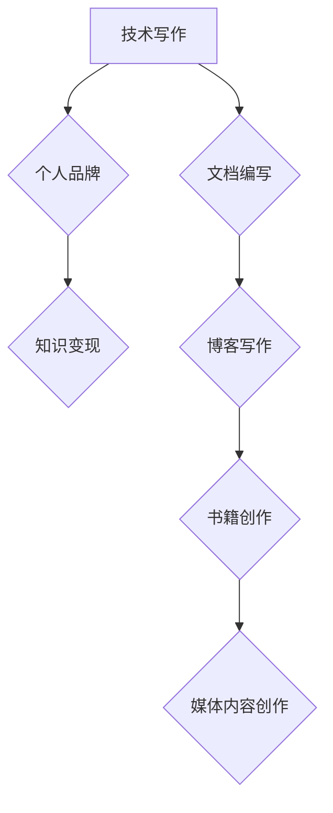

                 

关键词：技术写作，程序员，副业，个人品牌，知识变现

> 摘要：在数字化时代，技术写作已成为程序员不可或缺的一项技能。本文将探讨程序员如何将技术写作作为副业，提高个人品牌影响力，实现知识变现，并分享相关策略与实践经验。

## 1. 背景介绍

技术写作，作为程序员的一项重要技能，正日益受到重视。它不仅能够帮助程序员更好地理解和传达技术知识，还能为他们开辟新的职业路径。在过去的几十年里，随着互联网的普及，技术写作的领域和形式也在不断扩展，从传统的书籍、文章，到博客、电子书、视频教程等。

对于程序员来说，技术写作不仅仅是一种输出技术知识的方式，更是一种提升个人品牌、拓展职业发展空间的有效手段。通过技术写作，程序员可以分享自己的经验和见解，获得同行的认可，甚至实现知识变现。

## 2. 核心概念与联系

### 技术写作的层次

技术写作可以分为以下几个层次：

- **文档编写**：这是最基础的层次，包括编写软件文档、API文档等。
- **博客写作**：程序员通过个人博客或技术社区分享自己的心得和技术见解。
- **书籍创作**：撰写技术书籍，是技术写作的最高层次，也是最具挑战性的层次。
- **媒体内容创作**：包括视频教程、播客等，这些形式更易于吸引受众。

### 技术写作与个人品牌的关系

技术写作不仅是一种技能，更是一种表达方式，它能够帮助程序员建立个人品牌。通过持续的技术写作，程序员可以展示自己的专业能力和知识深度，从而在行业中树立自己的形象。

### 技术写作与知识变现

技术写作是知识变现的重要途径。通过撰写高质量的技术内容，程序员可以在各大平台上获得稿费、广告收入、课程销售等多种形式的收益。

### Mermaid 流程图



## 3. 核心算法原理 & 具体操作步骤

### 3.1 算法原理概述

技术写作的核心在于清晰、准确地传达技术知识。这要求程序员不仅要熟悉所写技术的原理，还要具备良好的表达能力和逻辑思维。

### 3.2 算法步骤详解

1. **选题**：选择一个具有实用性和影响力的技术话题。
2. **研究**：深入研究选题，确保内容的准确性和深度。
3. **构思**：规划文章的结构和内容，确保逻辑清晰。
4. **撰写**：用简洁、准确的语言撰写文章。
5. **审校**：对文章进行多次审校，确保无误。
6. **发布**：选择合适的平台发布文章，进行推广。

### 3.3 算法优缺点

**优点**：

- 提升个人品牌和影响力
- 增加收入来源
- 深化技术理解和应用

**缺点**：

- 需要大量的时间和精力
- 需要良好的表达能力和逻辑思维

### 3.4 算法应用领域

技术写作的应用领域非常广泛，包括但不限于以下方面：

- 软件开发
- 系统运维
- 数据科学
- 人工智能
- 区块链技术

## 4. 数学模型和公式 & 详细讲解 & 举例说明

### 4.1 数学模型构建

技术写作的质量与以下几个因素密切相关：

- **知识深度**：用数学公式表示为 D = f(K, L)，其中 D 表示知识深度，K 表示知识广度，L 表示逻辑能力。

- **表达能力**：用数学公式表示为 E = g(R, T)，其中 E 表示表达能力，R 表示阅读理解能力，T 表示技术术语掌握程度。

### 4.2 公式推导过程

我们假设：

- 知识深度 D 与知识广度 K 成正相关，与逻辑能力 L 成正相关。
- 表达能力 E 与阅读理解能力 R 成正相关，与技术术语掌握程度 T 成正相关。

根据以上假设，我们可以推导出以下公式：

\[ D = K \cdot L \]
\[ E = R \cdot T \]

### 4.3 案例分析与讲解

例如，一位有 5 年开发经验的程序员，其知识广度为 50，逻辑能力为 60，阅读理解能力为 70，技术术语掌握程度为 80。根据上述公式，我们可以计算出：

\[ D = 50 \cdot 60 = 3000 \]
\[ E = 70 \cdot 80 = 5600 \]

这意味着，这位程序员的写作内容深度为 3000，表达能力为 5600。通过持续提升自己的知识广度和逻辑能力，他可以进一步提高技术写作的质量。

## 5. 项目实践：代码实例和详细解释说明

### 5.1 开发环境搭建

在开始技术写作之前，我们需要搭建一个合适的开发环境。这里我们使用 GitHub 作为代码托管平台，Markdown 作为写作工具，Git 作为版本控制工具。

### 5.2 源代码详细实现

以下是一个简单的 Markdown 文章示例：

```markdown
# 标题：技术写作：程序员的副业选择

> 关键词：技术写作，程序员，副业，个人品牌，知识变现

## 1. 背景介绍

...

## 2. 核心概念与联系

...

## 3. 核心算法原理 & 具体操作步骤

...

## 4. 数学模型和公式 & 详细讲解 & 举例说明

...

## 5. 项目实践：代码实例和详细解释说明

...

```

### 5.3 代码解读与分析

上述代码是一个简单的 Markdown 文章结构，包括标题、关键词、章节标题等。通过这种结构化的方式，我们可以清晰地组织文章内容，提高写作效率。

### 5.4 运行结果展示

运行上述代码，我们将得到一篇结构清晰、内容丰富的 Markdown 文章。通过 GitHub，我们可以将文章发布到网络上，与更多人分享。

## 6. 实际应用场景

### 6.1 软件开发文档

在软件开发的各个环节，文档编写都是不可或缺的。通过技术写作，程序员可以更好地记录和传达开发过程中的关键信息。

### 6.2 技术博客

技术博客是程序员分享技术见解和经验的重要平台。通过技术写作，程序员可以展示自己的专业能力，吸引更多的关注。

### 6.3 教程视频

随着视频平台的兴起，越来越多的程序员开始通过教程视频分享自己的技术知识。技术写作可以为这些视频提供高质量的文本内容。

### 6.4 电子书

电子书是一种便于携带和阅读的数字化书籍。通过技术写作，程序员可以创作出高质量的电子书，实现知识变现。

## 7. 工具和资源推荐

### 7.1 学习资源推荐

- 《技术写作：构建你的博客和品牌》
- 《Markdown 入门与实践》
- 《GitHub 入门与实践》

### 7.2 开发工具推荐

- GitHub
- Visual Studio Code
- Typora

### 7.3 相关论文推荐

- "The Art of Writing Computer Programs"
- "A Study of programmer's writing processes"
- "Writing Effective Technical Documents"

## 8. 总结：未来发展趋势与挑战

### 8.1 研究成果总结

技术写作作为程序员的一项重要技能，正逐渐受到重视。通过技术写作，程序员不仅可以提升个人品牌，还可以实现知识变现。未来，技术写作的形式和内容将更加多样，对程序员的写作能力和表达能力也将提出更高的要求。

### 8.2 未来发展趋势

- 技术写作将更加注重内容的质量和深度。
- 技术写作的形式将更加多样化，如视频、音频、电子书等。
- 技术写作将成为程序员职业发展的重要一环。

### 8.3 面临的挑战

- 需要投入大量的时间和精力进行学习和实践。
- 需要不断提升自己的写作能力和逻辑思维。
- 需要应对激烈的市场竞争。

### 8.4 研究展望

未来，技术写作的研究将更加关注如何提高写作效率和质量，以及如何更好地实现知识变现。同时，随着人工智能的发展，技术写作也将迎来新的机遇和挑战。

## 9. 附录：常见问题与解答

### 9.1 如何选择写作主题？

选择写作主题时，可以考虑以下几个方面：

- 自己擅长的技术领域
- 当前热门的技术话题
- 受众感兴趣的话题

### 9.2 如何提高写作质量？

提高写作质量的方法包括：

- 深入研究选题，确保内容的准确性和深度。
- 学习并掌握良好的写作技巧，如结构化写作、简洁明了的表达等。
- 多读多写，不断练习和改进。

### 9.3 如何实现知识变现？

实现知识变现的方法包括：

- 发布高质量的技术内容，吸引更多的关注和粉丝。
- 在各大平台上开设专栏或课程，进行收费。
- 与企业合作，提供技术咨询和培训服务。

---

作者：禅与计算机程序设计艺术 / Zen and the Art of Computer Programming
----------------------------------------------------------------

