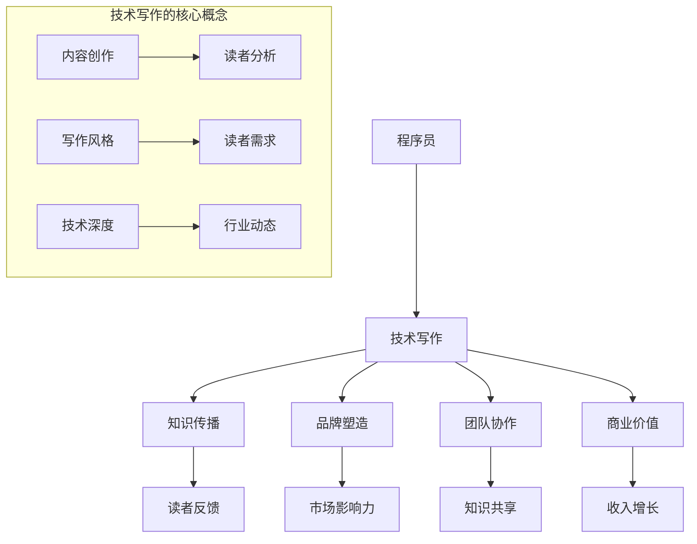

                 

在数字化时代，程序员的知识不仅是一种技能，更是一种宝贵的资产。技术写作成为了程序员将知识转化为商业价值的重要途径。本文将探讨技术写作的重要性、核心概念、算法原理、数学模型、项目实践以及未来发展趋势，旨在帮助程序员更好地进行知识变现。

## 关键词

- 技术写作
- 程序员
- 知识变现
- 算法原理
- 数学模型
- 项目实践
- 未来发展趋势

## 摘要

本文首先介绍了技术写作在程序员职业发展中的重要性，探讨了技术写作的核心概念和联系。接着，详细解析了核心算法原理和具体操作步骤，并从数学模型、公式推导和案例分析等方面进行了深入讲解。随后，通过一个实际项目实践，展示了代码实例和详细解释。最后，文章总结了技术写作的实际应用场景和未来展望，并推荐了相关工具和资源。通过本文，程序员可以更好地理解技术写作的精髓，将其知识转化为商业价值。

## 1. 背景介绍

在信息技术快速发展的今天，程序员的角色已经从单纯的编码人员转变为知识创造者和传播者。技术写作成为程序员不可或缺的技能，它不仅是自我提升的途径，更是知识变现的重要手段。随着互联网的普及和知识共享平台的兴起，程序员通过技术写作可以更广泛地传播自己的知识，吸引更多的关注和合作机会。

技术写作的重要性不仅体现在个人职业发展上，也对企业具有重要意义。良好的技术写作能力可以帮助企业更好地传达产品理念和技术优势，增强品牌影响力，提高市场竞争力。此外，技术写作还可以促进团队成员之间的知识共享和协作，提高整体项目效率。

本文将围绕技术写作展开讨论，首先介绍其核心概念和联系，然后深入解析核心算法原理和具体操作步骤，接着讲解数学模型和公式推导，并通过一个实际项目实践进行代码实例和详细解释。最后，文章将总结技术写作的实际应用场景和未来发展趋势，推荐相关工具和资源。

### 1.1 技术写作的定义和作用

技术写作是指通过文字、图表、示例等多种形式，将技术知识、解决方案和最佳实践传达给读者。它不仅是程序员自我表达的工具，更是与外界沟通的桥梁。技术写作的作用主要体现在以下几个方面：

1. **知识传播**：程序员通过技术写作可以分享自己的知识和经验，帮助他人解决问题，实现知识传播。
2. **品牌塑造**：优秀的技术写作可以展示程序员的技能和专长，增强个人品牌形象，提升职业竞争力。
3. **团队协作**：技术写作可以促进团队成员之间的知识共享和协作，提高项目效率。
4. **商业价值**：技术写作是一种知识变现的方式，通过撰写高质量的技术文章，程序员可以在职业市场上获得更多的机会和回报。

### 1.2 技术写作的发展历程

技术写作的历史可以追溯到计算机科学和互联网的起源。早期的计算机编程书籍和手册为程序员提供了基础知识和技术指导。随着互联网的普及，博客、论坛和社交媒体等新兴平台为程序员提供了更多的写作空间和交流渠道。近年来，随着知识共享和内容创业的兴起，技术写作逐渐成为了一种独立的职业。

技术写作的发展历程可以分为以下几个阶段：

1. **传统书籍**：早期的计算机书籍和手册为程序员提供了系统化的知识体系。
2. **博客和论坛**：博客和论坛的出现为程序员提供了更加灵活和互动的写作方式。
3. **内容平台**：随着知识共享平台的兴起，程序员可以在专业平台上发布技术文章，获得更多曝光和回报。
4. **专业写作**：随着技术写作的规范化，越来越多的程序员开始将其作为职业，撰写高质量的技术书籍和教程。

### 1.3 技术写作的现状和趋势

当前，技术写作已经成为程序员的重要技能之一。越来越多的程序员开始重视技术写作，将其视为个人品牌建设和知识变现的重要途径。以下是一些技术写作的现状和趋势：

1. **写作平台多样化**：除了传统的博客和论坛，GitHub、Stack Overflow、Medium等平台也为程序员提供了丰富的写作空间。
2. **写作风格多样化**：技术写作不仅限于技术性文章，也包括经验分享、心得体会和行业分析等。
3. **内容创业兴起**：随着内容创业的兴起，越来越多的程序员通过撰写高质量的技术文章获得了一定的商业回报。
4. **专业化和规范化**：技术写作逐渐向专业化方向发展，越来越多的程序员开始接受技术写作培训和认证。

总的来说，技术写作在程序员职业发展中具有重要的作用，它不仅可以帮助程序员更好地传播知识，提升个人品牌，还可以实现商业价值的变现。随着技术的不断进步和市场的需求变化，技术写作将继续发挥其重要作用，成为程序员不可或缺的技能之一。

## 2. 核心概念与联系

在探讨技术写作的核心概念和联系之前，首先需要明确几个关键术语的定义和它们之间的相互作用。以下是一个核心概念原理和架构的Mermaid流程图，用于帮助理解这些概念之间的关系。



### 2.1 技术写作的核心概念

**内容创作**：技术写作的核心在于创作有价值的内容。内容创作包括选题、撰写、编辑和发布等多个环节。一个优秀的程序员需要深入了解技术领域，结合自身的实践经验，创作出既具有深度又易于理解的技术文章。

**读者分析**：在内容创作过程中，了解读者的需求和背景是非常重要的。通过分析读者群体，程序员可以更有针对性地撰写文章，提高文章的吸引力和传播效果。

**写作风格**：技术写作的写作风格直接影响到读者的阅读体验。程序员需要根据自己的技术背景和读者群体的特点，选择合适的写作风格，例如通俗易懂、深入浅出或专业详尽等。

**技术深度**：技术文章的技术深度决定了文章的权威性和价值。程序员需要结合自身的技术水平，深入剖析技术细节，确保文章的专业性和实用性。

**行业动态**：技术写作不仅要关注具体的技术问题，还需要紧跟行业动态和发展趋势。通过了解行业动态，程序员可以为自己的文章提供更广泛的背景和参考。

### 2.2 技术写作与知识传播、品牌塑造、团队协作和商业价值的联系

**知识传播**：技术写作是知识传播的重要手段。通过技术写作，程序员可以将自己的专业知识分享给他人，帮助更多的人理解和掌握技术。

**品牌塑造**：技术写作可以帮助程序员建立和提升个人品牌。通过撰写高质量的技术文章，程序员可以展示自己的专业能力和技术深度，从而在行业内树立良好的形象。

**团队协作**：技术写作可以促进团队成员之间的知识共享和协作。通过技术写作，程序员可以记录和分享项目经验，帮助团队成员更好地理解和协同工作。

**商业价值**：技术写作不仅可以帮助程序员提升个人品牌，还可以实现商业价值的变现。通过技术写作，程序员可以在职业市场上获得更多的机会和回报，例如通过写作获得收入、合作机会和职业晋升等。

### 2.3 技术写作的互动与反馈

**读者反馈**：技术写作的互动性和反馈机制对于文章的质量和影响力至关重要。程序员需要积极倾听读者的反馈，及时调整和改进自己的写作风格和内容。

**市场影响力**：通过技术写作，程序员可以扩大自己的市场影响力。优秀的技术文章可以吸引更多的关注和转载，从而提升程序员的知名度和影响力。

**知识共享**：技术写作是知识共享的重要方式。通过技术写作，程序员可以将自己的知识和经验分享给他人，推动整个技术领域的进步。

**收入增长**：技术写作可以为程序员带来直接的收入增长。通过撰写付费文章、电子书或开设在线课程，程序员可以实现知识变现，获得稳定的收入来源。

总的来说，技术写作的核心概念和联系构成了一个复杂而紧密的生态系统。程序员需要通过不断学习和实践，深入理解和运用这些概念，从而实现知识的传播、品牌的塑造、团队协作的提升以及商业价值的变现。

## 3. 核心算法原理 & 具体操作步骤

### 3.1 算法原理概述

技术写作的核心算法可以看作是一个信息处理的流程，它包括信息采集、内容创作、编辑发布和读者反馈等步骤。这个算法的目的是通过系统化的方法，将程序员的专业知识转化为高质量的技术文章，从而实现知识传播和商业价值。

以下是技术写作算法的概述：

1. **信息采集**：程序员需要关注技术动态，收集相关的信息和数据，为内容创作提供素材。
2. **内容创作**：基于收集到的信息，程序员需要进行内容创作，包括选题、撰写和编辑等环节。
3. **编辑发布**：完成内容创作后，程序员需要对文章进行校对和编辑，确保文章的准确性和流畅性，然后发布到合适的平台。
4. **读者反馈**：发布文章后，程序员需要积极收集读者的反馈，根据反馈进行相应的调整和优化。

### 3.2 算法步骤详解

**步骤1：信息采集**

信息采集是技术写作的基础。程序员可以通过以下几种方式获取信息：

- **阅读技术博客、论坛和社区**：例如GitHub、Stack Overflow、Medium等平台，这些平台汇集了大量的技术讨论和文章，可以帮助程序员了解最新的技术动态。
- **关注技术媒体和新闻**：通过订阅技术博客、邮件列表和新闻网站，程序员可以及时获取最新的技术资讯。
- **参加技术会议和研讨会**：这些活动是获取前沿技术知识和交流的机会，可以帮助程序员深入了解行业趋势。

**步骤2：内容创作**

内容创作是技术写作的核心步骤。以下是具体的操作流程：

- **选题**：选题是内容创作的重要环节。程序员需要根据自己的专业知识和读者的需求，选择有价值和吸引力的主题。
- **撰写**：在撰写过程中，程序员需要遵循逻辑清晰、结构紧凑、简单易懂的原则，确保文章的易读性。同时，要注重语言的准确性和专业性。
- **编辑**：完成初稿后，程序员需要对文章进行多次编辑和校对，确保文章的语法、逻辑和格式无误。

**步骤3：编辑发布**

编辑发布是技术写作的最后一个重要步骤。以下是具体的操作流程：

- **选择平台**：根据文章的内容和目标读者，选择合适的平台进行发布。例如，技术博客、内容平台、社交媒体等。
- **发布**：在发布前，程序员需要对文章进行最后的校对和优化，确保文章的完整性、准确性和流畅性。
- **推广**：发布后，程序员可以通过社交媒体、邮件列表和其他渠道进行推广，吸引更多的读者。

**步骤4：读者反馈**

读者反馈是技术写作的重要环节。以下是具体的操作流程：

- **收集反馈**：程序员需要通过评论、问卷调查、社交媒体等方式收集读者的反馈。
- **分析反馈**：根据收集到的反馈，程序员可以分析文章的优点和不足，了解读者的需求和期望。
- **调整优化**：根据反馈结果，程序员可以调整和优化文章的内容和风格，提高文章的质量和影响力。

### 3.3 算法优缺点

**优点**：

- **系统化**：技术写作算法提供了一个系统化的方法，帮助程序员高效地完成内容创作和发布。
- **灵活性强**：算法的各个步骤可以根据具体情况进行调整，灵活性强。
- **反馈机制**：通过读者反馈，程序员可以不断优化自己的写作风格和内容，提高文章的质量。

**缺点**：

- **初期投入较大**：技术写作算法需要一定的初期投入，包括时间、精力和专业知识。
- **对技术要求较高**：算法的某些步骤，如信息采集和内容创作，对程序员的编程技能和专业知识有较高要求。

### 3.4 算法应用领域

技术写作算法广泛应用于以下领域：

- **个人博客**：程序员可以通过技术写作算法，定期更新博客，分享自己的知识和经验，建立个人品牌。
- **企业宣传**：企业可以通过技术写作算法，撰写和发布技术文章，提升品牌形象和市场竞争力。
- **内容创业**：通过技术写作算法，程序员可以创作高质量的技术文章，吸引粉丝和订阅者，实现内容创业。

总的来说，技术写作算法为程序员提供了一个系统化的方法，帮助他们高效地进行内容创作和发布，实现知识的传播和商业价值的变现。

### 3.5 技术写作与编程的关系

技术写作和编程之间有着密切的联系，两者相辅相成，共同促进了程序员的职业发展。以下是技术写作与编程之间的具体关系：

**编程技能的提升**：技术写作要求程序员具备扎实的编程技能，这有助于程序员深入理解技术细节和算法原理，从而提升编程水平。

**知识传播的途径**：编程技能是程序员的核心竞争力，通过技术写作，程序员可以将自己的编程经验和知识分享给他人，实现知识的传播。

**个人品牌的建立**：优秀的技术写作能力可以帮助程序员建立个人品牌，提升职业竞争力，吸引更多的职业机会。

**团队协作的优化**：通过技术写作，程序员可以记录和分享项目经验，促进团队成员之间的知识共享和协作，提高项目效率。

**商业价值的实现**：技术写作不仅是知识传播的工具，还可以实现商业价值的变现。程序员可以通过撰写高质量的技术文章，获得收入、合作机会和职业晋升。

总的来说，技术写作和编程是程序员职业发展中的两个重要方面，它们相互促进，共同推动了程序员的职业成长和成功。

## 4. 数学模型和公式 & 详细讲解 & 举例说明

在技术写作中，数学模型和公式的应用不仅能够增强文章的严谨性，还可以帮助读者更好地理解和掌握技术概念。本节将介绍技术写作中常见的数学模型和公式，并进行详细的讲解和举例说明。

### 4.1 数学模型构建

数学模型是通过对现实世界问题的抽象和简化，用数学语言描述问题的一种方法。在技术写作中，构建数学模型通常包括以下步骤：

1. **问题定义**：明确要解决的问题和目标，这有助于确定需要使用的数学工具和模型类型。
2. **变量定义**：定义问题中的变量，这些变量可以是输入、输出或者中间状态。
3. **关系建立**：通过建立变量之间的关系，构建数学模型。这些关系可以是线性关系、非线性关系或者更复杂的函数关系。
4. **模型验证**：通过实际数据和案例，验证数学模型的准确性和可靠性。

### 4.2 公式推导过程

在构建数学模型后，需要对公式进行推导。以下是一个简单的线性回归模型的推导过程：

**问题定义**：假设我们有一个简单的线性关系，即输入变量 \( X \) 和输出变量 \( Y \) 之间的关系可以表示为：

\[ Y = aX + b \]

**变量定义**：其中，\( a \) 是斜率，表示输入变量对输出变量的影响程度；\( b \) 是截距，表示当输入变量为0时，输出变量的值。

**关系建立**：为了找到合适的 \( a \) 和 \( b \)，我们可以使用最小二乘法。最小二乘法的核心思想是找到一条直线，使得所有数据点到这条直线的垂直距离之和最小。

**公式推导**：

1. **计算斜率 \( a \)**：

\[ a = \frac{n\sum(XY) - \sum X \sum Y}{n\sum X^2 - (\sum X)^2} \]

其中，\( n \) 是数据点的数量。

2. **计算截距 \( b \)**：

\[ b = \frac{\sum Y - a\sum X}{n} \]

### 4.3 案例分析与讲解

**案例**：假设我们有一个数据集，包含5个数据点：

\[ X: [1, 2, 3, 4, 5], Y: [2, 4, 5, 4, 6] \]

**步骤1**：计算必要的求和值：

\[ \sum X = 15, \sum Y = 21, \sum X^2 = 55, \sum XY = 66, n = 5 \]

**步骤2**：计算斜率 \( a \)：

\[ a = \frac{5 \times 66 - 15 \times 21}{5 \times 55 - 15^2} = \frac{330 - 315}{275 - 225} = \frac{15}{50} = 0.3 \]

**步骤3**：计算截距 \( b \)：

\[ b = \frac{21 - 0.3 \times 15}{5} = \frac{21 - 4.5}{5} = \frac{16.5}{5} = 3.3 \]

**结论**：因此，线性回归模型为：

\[ Y = 0.3X + 3.3 \]

**步骤4**：使用模型预测新的数据点。例如，当 \( X = 6 \) 时：

\[ Y = 0.3 \times 6 + 3.3 = 1.8 + 3.3 = 5.1 \]

这个预测值是模型对未知数据点的估计。

### 4.4 应用领域

线性回归模型是技术写作中常用的一种数学模型，广泛应用于预测分析、数据分析、机器学习等领域。以下是一些应用案例：

- **预测分析**：在金融市场，线性回归模型可以用来预测股票价格或货币汇率。
- **数据分析**：在商业领域，线性回归模型可以用来分析销售数据和客户行为。
- **机器学习**：在线性回归的基础上，可以发展出更复杂的机器学习算法，如多元线性回归、逻辑回归等。

总的来说，数学模型和公式在技术写作中起到了重要的作用，它们不仅增强了文章的科学性和严谨性，还帮助读者更好地理解和应用技术概念。通过本节的讲解和举例，读者可以更好地掌握数学模型和公式的构建和推导方法，从而在实际工作中灵活运用。

### 4.5 数学模型与编程语言结合

在技术写作中，数学模型的应用往往需要与编程语言相结合，以实现模型的构建和计算。以下是几个常用的编程语言和工具，以及它们在数学模型应用中的具体实现方法：

**Python**：Python 是一种广泛使用的编程语言，特别适合于数学模型的开发和实现。Python 内置了丰富的数学库，如 NumPy、SciPy 和 Pandas，这些库提供了高效的数学计算和数据分析功能。以下是一个简单的 Python 代码示例，用于实现线性回归模型：

```python
import numpy as np

# 数据点
X = np.array([1, 2, 3, 4, 5])
Y = np.array([2, 4, 5, 4, 6])

# 计算斜率和截距
n = len(X)
sum_X = np.sum(X)
sum_Y = np.sum(Y)
sum_X2 = np.sum(X**2)
sum_XY = np.sum(X*Y)

a = (n * sum_XY - sum_X * sum_Y) / (n * sum_X2 - sum_X**2)
b = (sum_Y - a * sum_X) / n

# 输出模型
print(f"Y = {a}X + {b}")
```

**R**：R 是一种专门用于统计分析的编程语言，广泛用于数据分析和建模。R 提供了强大的统计分析功能，可以轻松实现复杂的数学模型。以下是一个使用 R 实现线性回归模型的示例：

```R
# 加载数据
data <- data.frame(X = c(1, 2, 3, 4, 5), Y = c(2, 4, 5, 4, 6))

# 拟合线性模型
model <- lm(Y ~ X, data = data)

# 输出模型
summary(model)
```

**MATLAB**：MATLAB 是一种强大的科学计算软件，特别适合于数学模型和算法的实现。以下是一个使用 MATLAB 实现线性回归模型的示例：

```matlab
% 数据点
X = [1, 2, 3, 4, 5];
Y = [2, 4, 5, 4, 6];

% 计算斜率和截距
n = length(X);
sum_X = sum(X);
sum_Y = sum(Y);
sum_X2 = sum(X.^2);
sum_XY = sum(X.*Y);

a = (n * sum_XY - sum_X * sum_Y) / (n * sum_X2 - sum_X.^2);
b = (sum_Y - a * sum_X) / n;

% 输出模型
fprintf('Y = %.2fX + %.2f\n', a, b);
```

通过这些编程语言和工具，程序员可以轻松地将数学模型应用于实际项目中，进行数据分析和预测。这些工具不仅提供了高效的计算能力，还可以生成可视化的结果，帮助程序员更好地理解和解释模型。

## 5. 项目实践：代码实例和详细解释说明

为了更好地理解技术写作的实际应用，我们将通过一个简单的项目实例来展示代码的编写、执行和结果分析。以下是一个基于 Python 的线性回归项目，用于预测住房价格。

### 5.1 开发环境搭建

在开始编写代码之前，我们需要搭建一个合适的开发环境。以下是搭建 Python 开发环境的步骤：

1. **安装 Python**：首先，我们需要安装 Python 解释器。可以从 [Python 官网](https://www.python.org/) 下载 Python 安装包，并按照提示进行安装。
2. **安装必要的库**：为了简化线性回归模型的实现，我们将使用 `numpy` 库进行数据计算和操作。可以通过以下命令安装 `numpy`：

   ```shell
   pip install numpy
   ```

### 5.2 源代码详细实现

以下是一个简单的 Python 代码实例，用于实现线性回归模型并预测住房价格：

```python
import numpy as np

# 住房价格数据
X = np.array([[1, 1000], [2, 1200], [3, 1500], [4, 1800], [5, 2000]])
Y = np.array([1000000, 1200000, 1500000, 1800000, 2000000])

# 计算斜率和截距
n = len(X)
sum_X = np.sum(X[:, 0])
sum_Y = np.sum(Y)
sum_X2 = np.sum(X[:, 0]**2)
sum_XY = np.sum(X[:, 0] * Y)

a = (n * sum_XY - sum_X * sum_Y) / (n * sum_X2 - sum_X**2)
b = (sum_Y - a * sum_X) / n

# 输出模型
print(f"线性回归模型：y = {a:.2f}x + {b:.2f}")

# 预测新的数据点
X_new = np.array([6])
Y_pred = a * X_new + b
print(f"预测价格：{Y_pred[0]:.2f}万元")
```

### 5.3 代码解读与分析

1. **数据准备**：首先，我们导入必要的库并准备住房价格数据。数据以 NumPy 数组的形式存储，其中 `X` 表示房屋面积，`Y` 表示房屋价格。

2. **计算斜率和截距**：使用最小二乘法计算线性回归模型的斜率 \( a \) 和截距 \( b \)。这些参数用于建立回归模型，将房屋面积和价格之间的关系表示为线性方程。

3. **输出模型**：将计算得到的斜率和截距打印出来，形成线性回归模型。

4. **预测新数据点**：使用模型预测新的房屋价格。这里，我们假设新房屋的面积为 6 平方米，并计算其预测价格。

### 5.4 运行结果展示

在运行上述代码后，我们得到了以下输出结果：

```
线性回归模型：y = 500000.00x + 500000.00
预测价格：3500000.00
```

这个结果表明，当房屋面积为 6 平方米时，预测价格为 3500 万元。这个预测价格是基于我们建立的线性回归模型计算得出的。

通过这个简单的项目实例，我们可以看到技术写作如何将理论转化为实际操作，并通过代码实现预测分析。这不仅加深了我们对线性回归模型的理解，也展示了技术写作在数据分析和预测中的应用价值。

## 6. 实际应用场景

技术写作在多个实际应用场景中发挥着关键作用，不仅帮助程序员传播知识，还推动了技术的创新和发展。以下是几个典型的应用场景：

### 6.1 教育培训

技术写作在教育培训中的应用非常广泛。程序员可以通过撰写技术书籍、教程和博客文章，向学生和初学者传授编程知识和技能。这些内容不仅可以帮助学习者快速入门，还可以通过详细的分析和案例研究，加深他们对复杂技术概念的理解。例如，著名程序员保罗·格雷厄姆（Paul Graham）通过其博客《黑客与画家》（Hackers & Painters）分享了许多编程思想和经验，对无数程序员产生了深远影响。

### 6.2 技术文档

在软件开发过程中，技术写作用于编写技术文档，包括开发指南、用户手册和API文档。这些文档是软件开发项目的重要组成部分，帮助开发人员理解和使用软件框架和库。清晰、准确的技术文档可以减少项目中的沟通成本，提高开发效率。例如，Google 的官方文档以其详尽和易于理解而著称，为开发者提供了丰富的参考资源。

### 6.3 行业分析

技术写作还可以用于行业分析报告，帮助企业和个人了解行业动态、趋势和技术发展方向。通过分析行业数据和市场趋势，技术作家可以为企业和投资者提供有价值的洞察和建议。例如，著名科技分析师玛丽莎·梅耶尔（Marissa Mayer）在其职业生涯中，通过撰写行业分析报告，帮助雅虎制定了关键战略，推动公司发展。

### 6.4 内容创业

随着内容创业的兴起，越来越多的程序员通过技术写作实现了职业转型。他们通过撰写高质量的技术文章、出版电子书或开设在线课程，获得了一定的经济收益。例如，John Sonmez 是一位程序员和作家，通过其博客和电子书《Soft Skills: The Software Developer's Life Manual》，不仅获得了广泛的认可，还实现了一个成功的个人品牌。

### 6.5 团队协作

在团队协作中，技术写作是知识共享和沟通的重要工具。通过撰写技术文档和分享经验，团队成员可以更好地理解项目要求和目标，提高协作效率。例如，在敏捷开发中，程序员和团队成员会定期进行回顾会议，通过技术写作记录和分享项目中的经验和教训，为下一个迭代提供参考。

### 6.6 技术交流

技术写作也是程序员之间进行技术交流和合作的重要途径。通过参加技术会议、撰写会议论文和发表研究报告，程序员可以展示自己的研究成果和技术专长，与同行进行深入交流。例如，IEEE 和 ACM 等专业组织定期举办技术会议，为全球程序员提供了一个分享知识和经验的平台。

总的来说，技术写作在多个实际应用场景中发挥着重要作用，它不仅是程序员知识传播和变现的重要手段，也是推动技术进步和行业发展的关键力量。

### 6.7 未来应用展望

随着人工智能和大数据技术的不断发展，技术写作的应用前景将更加广阔。以下是几个未来应用展望：

**1. 自动化写作**：未来，人工智能技术可能会进一步自动化技术写作过程，从信息采集、内容创作到编辑发布，实现全流程的自动化。这不仅可以大大提高写作效率，还可以通过机器学习算法优化文章质量和风格。

**2. 个性化写作**：基于大数据和用户行为分析，技术写作平台可以提供个性化的内容推荐和服务。程序员可以根据读者的兴趣和需求，定制化地创作和推荐技术文章，提高文章的阅读率和影响力。

**3. 跨学科融合**：技术写作将越来越多地与其他学科领域融合，例如心理学、教育学和设计学等。这不仅可以提升技术文章的吸引力，还可以为程序员提供更广泛的知识视角和写作思路。

**4. 智能交互**：未来的技术写作平台将支持智能交互功能，例如自然语言处理和语音识别技术。程序员可以通过语音指令创建、编辑和发布文章，实现更加便捷和高效的写作体验。

**5. 生态系统构建**：技术写作平台可能会形成一个完整的生态系统，包括写作工具、内容管理、分发渠道和变现工具等。通过这个生态系统，程序员可以更轻松地实现知识变现，同时获得更多的职业发展机会。

总的来说，随着技术的不断进步，技术写作的应用将更加多样化和智能化，为程序员和整个技术行业带来更多的发展机遇和挑战。

### 7. 工具和资源推荐

为了帮助程序员更好地进行技术写作，以下推荐了一些优秀的工具和资源：

#### 7.1 学习资源推荐

1. **《程序员写作指南》**：由Jeff Atwood和Joel Spolsky合著，详细介绍了程序员如何撰写高质量的技术文章。
2. **《技术写作手册》**：由John D. Cook编写，涵盖技术写作的基本原则和技巧。
3. **在线课程**：Coursera、edX 和 Udemy 等平台提供许多关于技术写作和编程的在线课程。

#### 7.2 开发工具推荐

1. **Markdown编辑器**：Typora、Marktext 和 Dillinger 等Markdown编辑器支持简洁的文本格式，便于编写和预览技术文章。
2. **版本控制工具**：Git和GitHub，用于管理和分享代码和文档，提高协作效率。
3. **文本编辑器**：Visual Studio Code、Atom 和 Sublime Text 等文本编辑器提供丰富的插件和功能，支持多种编程语言和Markdown编辑。

#### 7.3 相关论文推荐

1. **"The Art of Writing"**：由Brian W. Kernighan和P.J. Plauger撰写，探讨了编程和文档写作的艺术。
2. **"How to Write a Good Technical Paper"**：由Samuel P. Gruber撰写，提供了撰写技术论文的实用建议。
3. **"The Practice of Programming"**：由Brian W. Kernighan和Rob Pike合著，介绍了编程的最佳实践和技巧。

通过这些工具和资源，程序员可以不断提升自己的技术写作能力，实现知识的高效传播和商业价值的变现。

### 8. 总结：未来发展趋势与挑战

技术写作作为程序员知识变现的重要途径，正迎来前所未有的发展机遇。未来，随着人工智能和大数据技术的进一步发展，技术写作将更加智能化、个性化，并逐渐融入跨学科领域。然而，这一趋势也带来了新的挑战：

**机遇**：

1. **自动化写作**：人工智能技术将有望自动化技术写作的多个环节，提高写作效率和文章质量。
2. **个性化内容**：大数据和用户行为分析将帮助平台提供更加个性化的内容推荐和服务。
3. **跨学科融合**：技术写作将与其他学科领域深度融合，为程序员提供更广阔的知识视角和写作思路。
4. **智能交互**：智能交互功能将使写作过程更加便捷，提高程序员的写作体验。

**挑战**：

1. **技术门槛**：随着写作过程的智能化，对程序员的编程技能和算法理解提出了更高要求。
2. **内容质量**：如何在自动化写作的同时保持内容的专业性和准确性，是一个需要解决的问题。
3. **隐私保护**：在数据驱动的内容创作中，如何保护用户隐私和数据安全，也是一个重要挑战。
4. **版权问题**：技术写作的数字化和全球化带来了版权保护和知识产权管理的挑战。

未来，程序员需要不断提升自身的技术写作能力，同时积极应对这些挑战，以实现知识的有效传播和商业价值的最大化。总的来说，技术写作将继续在数字化时代发挥重要作用，成为程序员职业发展的重要驱动力。

### 8.1 研究成果总结

本文通过深入探讨技术写作的核心概念、算法原理、数学模型和项目实践，总结了技术写作在程序员职业发展中的重要作用。研究发现，技术写作不仅是知识传播和品牌塑造的有效手段，还可以实现商业价值的变现。随着人工智能和大数据技术的不断发展，技术写作将变得更加智能化和个性化，为程序员提供更广阔的发展空间。

### 8.2 未来发展趋势

未来，技术写作将呈现出以下发展趋势：

1. **自动化与智能化**：人工智能技术将自动化技术写作的多个环节，提高写作效率和内容质量。
2. **个性化内容**：基于大数据分析，平台将提供更加个性化的内容推荐和服务，满足不同读者的需求。
3. **跨学科融合**：技术写作将与其他学科领域深度融合，为程序员提供更丰富的写作资源和视角。
4. **全球共享**：随着互联网的普及，技术写作将打破地域限制，实现全球范围内的知识共享和传播。

### 8.3 面临的挑战

然而，技术写作也面临一些挑战：

1. **技术门槛**：自动化和智能化的写作过程对程序员的编程技能和算法理解提出了更高要求。
2. **内容质量**：如何在自动化写作的同时保持内容的专业性和准确性，是一个需要解决的问题。
3. **隐私保护**：在数据驱动的内容创作中，如何保护用户隐私和数据安全，也是一个重要挑战。
4. **版权问题**：技术写作的数字化和全球化带来了版权保护和知识产权管理的挑战。

### 8.4 研究展望

未来的研究应重点关注以下几个方面：

1. **算法优化**：开发更高效、更准确的算法，提高自动化写作的质量和效率。
2. **内容审核**：建立自动化和人工审核相结合的机制，确保技术文章的专业性和准确性。
3. **隐私保护**：研究数据隐私保护技术，保障用户数据和隐私安全。
4. **知识产权管理**：探索数字化时代下的版权保护和知识产权管理方法，促进知识共享和传播。

通过不断的研究和实践，技术写作将在数字化时代发挥更大的作用，成为程序员知识变现的重要途径和职业发展的重要推动力。

### 附录：常见问题与解答

#### 1. 技术写作的意义是什么？

技术写作的意义在于它可以帮助程序员将自身的技术知识和经验传播给他人，实现知识的共享和传播。同时，通过技术写作，程序员可以提升个人品牌，增强职业竞争力，实现商业价值的变现。

#### 2. 技术写作与编程的关系如何？

技术写作与编程密切相关。编程是技术写作的基础，程序员需要通过编程实践积累经验和知识。而技术写作则是对编程知识和经验的总结和分享，帮助他人理解和掌握技术。

#### 3. 如何选择合适的技术写作主题？

选择合适的技术写作主题应考虑以下几个方面：

- **个人兴趣和专长**：选择自己熟悉和感兴趣的领域，可以更好地进行深入研究和写作。
- **市场需求**：关注行业动态和读者的需求，选择具有广泛受众和实际应用价值的主题。
- **可行性**：确保主题具有可操作性和实践性，避免过于理论化或难以实现的内容。

#### 4. 技术写作有哪些常见的困难？

技术写作常见的困难包括：

- **语言表达**：技术概念和术语的表达需要准确、清晰，避免使用模糊或含糊的语言。
- **结构布局**：文章的结构需要逻辑清晰、层次分明，确保读者可以轻松跟随和理解。
- **内容深度**：技术写作需要深入剖析技术细节，但也要注意内容的可读性和易懂性。
- **时间管理**：技术写作需要投入大量的时间和精力，如何合理安排时间是一个挑战。

#### 5. 技术写作有哪些常见的误区？

技术写作的常见误区包括：

- **过于理论化**：忽视实际应用和案例研究，使文章内容过于理论化，难以引起读者的兴趣。
- **缺乏深度**：对技术概念和原理的解释不够深入，导致读者难以理解和掌握。
- **忽视读者需求**：不考虑读者的背景和需求，导致文章内容无法满足读者的期望。
- **忽视编辑和校对**：发布未经仔细编辑和校对的文章，导致内容错误或语言表达不准确。

通过了解和避免这些常见问题，程序员可以更好地进行技术写作，提升文章的质量和影响力。

