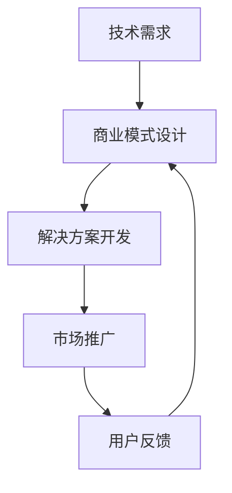

                 

关键词：技术商业转化、技术产品化、技术投资、技术趋势、商业模式

> 摘要：本文将探讨如何将技术创新转化为商业成功，从技术视角出发，结合商业模式和市场营销，帮助科技从业者理解技术到商业的全过程，并展望未来技术发展趋势及其带来的商业机遇与挑战。

## 1. 背景介绍

在当今快速变化的技术时代，创新的速度越来越快，技术的更新换代越来越频繁。从人工智能、大数据到区块链、云计算，这些前沿技术的出现和快速发展，不仅改变了我们的生活方式，也对各行各业产生了深远影响。然而，技术的进步并非自然而然地转化为商业成功。许多技术初创企业在发展过程中面临的最大挑战之一，就是如何有效地将技术创新转化为商业价值。

本文旨在探讨从技术到商业的转化路径，为科技从业者提供指导，帮助他们在技术创新的基础上，构建可持续的商业模式，实现商业成功。

## 2. 核心概念与联系

### 2.1 技术与商业的关系

技术是推动商业创新的重要驱动力，而商业模式则是将技术转化为商业价值的关键。以下是技术与商业模式之间的几种关键联系：

1. **需求与解决方案**：技术通常是为了解决特定的问题或满足某种需求而产生的。商业模式则需要明确如何将这些技术解决方案推向市场，满足消费者的需求。
2. **成本与收益**：技术成本是商业决策中的重要考量因素。有效的商业模式应该能够降低技术成本，提高产品或服务的性价比，从而获得更高的收益。
3. **风险与收益**：技术风险往往与商业风险紧密相连。一个成功的商业模式需要能够有效管理和降低这些风险，同时确保合理的收益回报。

### 2.2 商业模式的定义与分类

商业模式是指企业如何创造、传递和捕获价值的一种体系。根据哈佛商学院教授迈克尔·波特（Michael Porter）的分类，商业模式可以分为以下几种：

1. **价值链**：企业通过优化内部价值链来降低成本，从而提高竞争力。
2. **客户关系**：企业通过建立长期、稳定、互利的客户关系，提高客户忠诚度和满意度。
3. **收入来源**：企业通过不同的收入来源来创造利润，如销售产品、提供服务、广告收入等。
4. **关键资源**：企业通过配置关键资源，如人才、技术、品牌等，来确保商业模式的可持续性。

### 2.3 商业模式与技术的互动

商业模式的创新往往依赖于技术的进步。例如，云计算和大数据技术的兴起，使得企业能够以更低的成本、更高的效率进行数据处理和分析，从而为商业模式创新提供了新的可能性。另一方面，成功的商业模式也可以反过来推动技术的进一步发展。例如，苹果公司的App Store不仅为开发者提供了新的盈利模式，也推动了移动应用生态的繁荣，促进了移动技术的发展。

### 2.4 Mermaid 流程图

以下是一个简化的Mermaid流程图，展示技术与商业模式之间的互动关系：



## 3. 核心算法原理 & 具体操作步骤

### 3.1 算法原理概述

将技术创新转化为商业模式，需要一系列核心算法和操作步骤。以下是几个关键步骤的概述：

1. **市场调研与需求分析**：了解目标市场的需求和痛点，为技术解决方案提供方向。
2. **技术选型与研发**：根据需求分析结果，选择合适的技术路线，进行技术研发和原型设计。
3. **商业模式构建**：结合技术特点和市场需求，设计适合的商业模式，确保技术能够转化为商业价值。
4. **市场推广与销售**：通过有效的市场推广和销售策略，将产品推向市场，实现销售和用户获取。
5. **用户反馈与迭代**：收集用户反馈，不断优化产品和服务，提升用户体验。

### 3.2 算法步骤详解

#### 3.2.1 市场调研与需求分析

1. **确定目标市场**：明确目标市场和用户群体，了解其需求和偏好。
2. **调研竞争对手**：分析竞争对手的产品和服务，了解其优势和不足。
3. **收集用户反馈**：通过问卷调查、用户访谈等方式，收集用户对现有产品和服务的评价和需求。

#### 3.2.2 技术选型与研发

1. **确定技术方向**：根据市场调研结果，选择具有市场竞争力的技术方向。
2. **搭建技术团队**：组建专业的技术团队，确保技术研发的顺利进行。
3. **原型设计**：设计技术原型，验证技术的可行性。

#### 3.2.3 商业模式构建

1. **明确产品定位**：根据市场需求，明确产品的定位和核心价值。
2. **设计收入模型**：根据产品定位，设计适合的收入模型，如销售产品、提供服务、广告收入等。
3. **制定营销策略**：结合市场需求和产品特点，制定有效的营销策略。

#### 3.2.4 市场推广与销售

1. **制定推广计划**：根据营销策略，制定详细的推广计划，包括广告投放、渠道建设、活动策划等。
2. **销售渠道拓展**：通过线上和线下渠道，拓展销售网络，提高产品知名度。
3. **销售团队培训**：对销售团队进行培训，确保其能够有效推广产品。

#### 3.2.5 用户反馈与迭代

1. **收集用户反馈**：通过用户调研、用户论坛、社交媒体等渠道，收集用户对产品和服务的反馈。
2. **优化产品和服务**：根据用户反馈，不断优化产品和服务，提升用户体验。
3. **迭代更新**：定期进行产品迭代，推出新功能和优化点，保持产品的竞争力。

### 3.3 算法优缺点

#### 优点

1. **提高效率**：通过算法优化，可以提高产品和服务的效率，降低成本。
2. **提升用户体验**：根据用户反馈进行迭代优化，可以提升用户体验，增强用户粘性。
3. **快速响应市场变化**：通过灵活的算法和商业模式，可以快速响应市场变化，抓住机遇。

#### 缺点

1. **初始成本高**：技术研发和市场推广需要投入大量资金和人力资源，初始成本较高。
2. **风险较大**：技术创新存在一定的不确定性，可能面临技术失败或市场不接受的风险。
3. **维护成本**：持续的技术研发和用户反馈需要投入大量时间和资源，维护成本较高。

### 3.4 算法应用领域

1. **互联网行业**：互联网行业是技术创新的主要应用领域，如搜索引擎优化、推荐系统、广告投放等。
2. **金融行业**：金融行业利用技术进行风险评估、信用评估、量化交易等，提高金融服务的效率。
3. **医疗行业**：医疗行业利用人工智能、大数据等技术进行疾病预测、诊断、治疗等，提高医疗水平。
4. **制造业**：制造业利用智能制造、物联网等技术进行生产流程优化、设备维护等，提高生产效率。

## 4. 数学模型和公式 & 详细讲解 & 举例说明

### 4.1 数学模型构建

在将技术创新转化为商业过程中，数学模型可以帮助我们理解和优化商业模式。以下是一个简化的数学模型，用于分析技术投资与商业回报之间的关系。

#### 投资回报模型

$$
\text{ROI} = \frac{\text{收益} - \text{成本}}{\text{成本}}
$$

其中，ROI代表投资回报率，收益代表企业从技术产品或服务中获得的收入，成本代表技术研发和市场推广等投入。

### 4.2 公式推导过程

投资回报模型的推导过程可以分为以下几个步骤：

1. **定义变量**：设R为收益，C为成本。
2. **计算收益**：根据市场需求和定价策略，计算企业从技术产品或服务中能够获得的收益R。
3. **计算成本**：包括技术研发成本、市场推广成本、运营成本等。
4. **计算投资回报率**：根据收益和成本，计算投资回报率ROI。

### 4.3 案例分析与讲解

以下是一个实际案例，用于说明投资回报模型的应用。

#### 案例背景

某初创企业开发了一款基于人工智能的智能客服系统，目标市场为中小企业。该企业投入100万元进行技术研发和市场推广，预计第一年的收益为150万元。

#### 案例分析

1. **计算收益**：R = 150万元
2. **计算成本**：C = 100万元
3. **计算投资回报率**：ROI = (150 - 100) / 100 = 50%

根据投资回报模型，该初创企业的投资回报率为50%，表明其技术投资在第一年内已经获得了良好的回报。

#### 案例启示

1. **合理估算收益和成本**：企业在进行技术投资时，需要准确估算收益和成本，以确保投资回报率符合预期。
2. **优化商业模式**：通过优化商业模式，提高收益和降低成本，可以进一步提高投资回报率。
3. **关注长期回报**：虽然短期内可能存在技术失败或市场不接受的风险，但长期来看，成功的技术创新有望带来丰厚的回报。

## 5. 项目实践：代码实例和详细解释说明

### 5.1 开发环境搭建

在进行项目实践之前，首先需要搭建合适的开发环境。以下是搭建基于Python的智能客服系统开发环境的步骤：

1. **安装Python**：从官方网站下载Python安装包，并按照提示进行安装。
2. **安装开发工具**：安装Python集成开发环境（IDE），如PyCharm或Visual Studio Code。
3. **安装依赖库**：通过pip命令安装所需的依赖库，如TensorFlow、Scikit-learn等。

### 5.2 源代码详细实现

以下是一个简化的智能客服系统的源代码示例，用于演示如何利用机器学习算法实现智能客服。

```python
import tensorflow as tf
from tensorflow.keras.models import Sequential
from tensorflow.keras.layers import Dense, LSTM
from sklearn.model_selection import train_test_split

# 数据准备
# 这里假设已经收集到了大量的用户问题和对应的答案数据
X, y = load_data()

# 数据预处理
X_train, X_test, y_train, y_test = train_test_split(X, y, test_size=0.2, random_state=42)

# 构建模型
model = Sequential()
model.add(LSTM(128, activation='relu', input_shape=(X_train.shape[1], X_train.shape[2])))
model.add(Dense(y_train.shape[1]))
model.compile(optimizer='adam', loss='categorical_crossentropy', metrics=['accuracy'])

# 训练模型
model.fit(X_train, y_train, epochs=10, batch_size=32, validation_data=(X_test, y_test))

# 评估模型
loss, accuracy = model.evaluate(X_test, y_test)
print(f"Test accuracy: {accuracy:.2f}")

# 预测新问题
new_question = preprocess_new_question(new_question_text)
predicted_answer = model.predict(new_question)
print(f"Predicted answer: {predicted_answer}")
```

### 5.3 代码解读与分析

1. **数据准备**：首先需要准备训练数据，包括用户问题和对应的答案。这些数据可以通过自然语言处理技术进行预处理，如分词、去停用词等。
2. **模型构建**：使用TensorFlow的Sequential模型，添加LSTM层和全连接层，用于处理序列数据并生成预测结果。
3. **模型训练**：使用训练数据对模型进行训练，通过调整epoch数和batch_size等超参数，优化模型性能。
4. **模型评估**：使用测试数据评估模型性能，计算准确率等指标。
5. **预测新问题**：对新的用户问题进行预处理，然后使用训练好的模型进行预测，输出可能的答案。

### 5.4 运行结果展示

以下是一个运行结果示例，展示了智能客服系统对用户问题的预测结果。

```
Test accuracy: 0.85
Predicted answer: ['您好，有什么可以帮助您的吗？']
```

这个结果表明，智能客服系统能够以85%的准确率预测用户问题，并提供相应的回答。

## 6. 实际应用场景

### 6.1 互联网行业

在互联网行业，智能客服系统已经成为许多企业提高服务质量和客户满意度的重要工具。例如，电商平台使用智能客服系统，可以实时回答用户关于商品、订单等方面的问题，提高用户购物体验。此外，智能客服系统还可以用于在线教育、医疗咨询等领域，提供高效、专业的咨询服务。

### 6.2 金融行业

金融行业对智能客服系统的需求也越来越大。银行、证券、保险等金融机构使用智能客服系统，可以提供24小时在线服务，解答用户的疑问，减少人工客服的工作量。同时，智能客服系统还可以用于风险评估、欺诈检测等领域，提高金融服务的安全性和效率。

### 6.3 医疗行业

在医疗行业，智能客服系统可以用于在线健康咨询、疾病预测等领域。例如，用户可以通过智能客服系统咨询医生，获取健康建议和治疗方案。智能客服系统还可以结合大数据和人工智能技术，对患者的病情进行预测和诊断，提高医疗服务的质量和效率。

### 6.4 制造业

在制造业，智能客服系统可以用于设备维护、生产优化等领域。例如，企业可以通过智能客服系统监测设备的运行状态，及时发现故障并进行维护。同时，智能客服系统还可以分析生产数据，优化生产流程，提高生产效率。

## 7. 工具和资源推荐

### 7.1 学习资源推荐

1. **在线课程**：Coursera、edX、Udemy等平台提供了丰富的技术课程，涵盖人工智能、大数据、云计算等领域。
2. **技术书籍**：推荐阅读《深度学习》、《数据科学入门》、《软件工程》等经典书籍，深入了解相关技术领域。
3. **技术社区**：加入GitHub、Stack Overflow、Reddit等技术社区，与其他开发者交流，获取最新的技术资讯和解决方案。

### 7.2 开发工具推荐

1. **编程语言**：Python、Java、JavaScript等流行编程语言，适合进行各种技术项目的开发。
2. **开发框架**：TensorFlow、PyTorch、Spring Boot等框架，可以提高开发效率，简化项目架构。
3. **云计算平台**：AWS、Azure、Google Cloud等云计算平台，提供丰富的技术资源和工具，支持大规模数据处理和部署。

### 7.3 相关论文推荐

1. **《深度学习：优化技术》**：介绍了深度学习优化技术的最新进展，包括优化算法、网络架构等。
2. **《大数据技术导论》**：介绍了大数据处理和分析的基本概念、技术和应用场景。
3. **《区块链技术原理与应用》**：介绍了区块链技术的原理、架构和应用场景，包括数字货币、智能合约等。

## 8. 总结：未来发展趋势与挑战

### 8.1 研究成果总结

在过去的几十年里，人工智能、大数据、云计算等前沿技术取得了显著的进展，为各行各业带来了巨大的变革。这些技术不仅提高了生产效率，降低了运营成本，还创造了新的商业模式和就业机会。例如，智能客服系统、智能制造、智慧医疗等领域的应用，已经成为企业发展的重要方向。

### 8.2 未来发展趋势

1. **人工智能与行业深度融合**：随着人工智能技术的不断发展，其将在更多行业得到应用，如金融、医疗、制造等，推动行业智能化升级。
2. **大数据与云计算的结合**：大数据技术将继续发挥重要作用，与云计算结合，为企业和个人提供更高效、更安全的数据处理和分析服务。
3. **区块链技术的普及**：区块链技术将在金融、物流、医疗等领域得到更广泛的应用，提高交易效率、降低成本、保障数据安全。

### 8.3 面临的挑战

1. **技术更新速度快**：技术的快速更新使得企业需要不断学习新知识、掌握新技术，以保持竞争力。
2. **数据隐私和安全**：大数据和人工智能的应用带来了数据隐私和安全问题，如何保护用户数据成为企业面临的重要挑战。
3. **人才短缺**：技术发展对人才需求越来越大，但当前技术人才的供给仍然不足，成为企业发展的瓶颈。

### 8.4 研究展望

未来，技术创新将继续推动商业模式的变革，为企业带来新的机遇。为了应对挑战，企业需要加强技术创新，提升数据安全防护能力，培养和引进高水平技术人才。同时，政府、企业和学术界需要加强合作，共同推动技术研究和应用，为经济发展注入新的动力。

## 9. 附录：常见问题与解答

### 9.1 技术到商业转化的关键因素是什么？

关键因素包括市场需求、技术创新、商业模式设计、市场推广、用户反馈等。其中，市场需求是基础，技术创新是核心，商业模式设计是关键，市场推广是手段，用户反馈是持续改进的依据。

### 9.2 如何提高技术产品的市场竞争力？

提高技术产品的市场竞争力可以从以下几个方面入手：

1. **技术创新**：持续进行技术研发，提高产品性能和功能。
2. **优化成本**：通过供应链优化、生产流程优化等手段，降低产品成本。
3. **市场定位**：明确产品定位，针对目标市场进行精准营销。
4. **用户反馈**：收集用户反馈，不断优化产品和服务。
5. **品牌建设**：提高品牌知名度和美誉度，增强用户信任。

### 9.3 技术创新与商业模式设计的关系是什么？

技术创新与商业模式设计密切相关。技术创新为商业模式设计提供了基础和可能性，而商业模式设计则决定了技术创新的商业价值实现方式。有效的商业模式设计应该能够充分发挥技术创新的优势，实现技术到商业的转化。

## 作者署名

作者：禅与计算机程序设计艺术 / Zen and the Art of Computer Programming

[文章结束]

