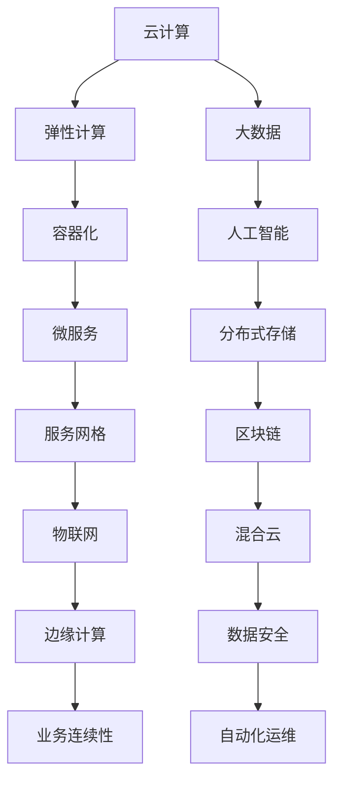

                 

### 关键词 Keywords
- 线下到线上
- 技术迁移
- 业务连续性
- 云计算
- 数字化转型

<|assistant|>### 摘要 Abstract
本文将深入探讨从线下到线上的技术转变过程。我们将分析这种转变背后的驱动力、核心概念和架构，并详细介绍核心算法原理和具体操作步骤。通过数学模型和公式推导，我们将探讨算法在不同领域的应用，并通过项目实践和实际应用场景来展示技术迁移的成果。最后，我们将总结研究成果，展望未来发展趋势和面临的挑战。

## 1. 背景介绍

随着互联网的快速发展，从线下到线上的技术转变已经成为各行各业的热门话题。这种转变不仅改变了我们的生活方式，也带来了巨大的商业机会。线上业务具有成本低、速度快、覆盖面广等优势，使得许多传统线下业务开始寻求数字化转型的道路。然而，这种转变并非一蹴而就，它涉及到多个层面的技术和业务变革。

首先，从技术层面来看，线上业务需要具备高度的可扩展性、可靠性和安全性。这意味着需要采用先进的云计算、大数据、人工智能等技术，以及构建强大的技术基础设施。其次，从业务层面来看，线上业务需要重新思考业务模式、用户需求和市场定位。这涉及到对现有业务的重新设计和优化，以及对新兴市场的挖掘和拓展。

### 1.1 驱动因素

那么，是什么促使企业进行这种从线下到线上的技术转变呢？以下是几个主要的驱动因素：

1. **市场需求**：随着互联网的普及，越来越多的消费者倾向于在线购物、在线支付和在线服务。为了满足这些需求，企业不得不将业务拓展到线上。

2. **成本效益**：线上业务可以降低实体店铺的租金、人力成本等开支，从而提高整体运营效率。

3. **技术进步**：云计算、大数据、人工智能等技术的快速发展，为线上业务提供了强大的技术支持。

4. **竞争压力**：传统线下业务面临着新兴线上竞争对手的威胁，不得不寻求线上转型来保持竞争力。

### 1.2 当前现状

目前，许多行业已经开始进行线上线下的融合，以下是一些典型的例子：

1. **零售业**：线上电商平台已经成为零售业的重要组成部分，如阿里巴巴的淘宝、京东等。

2. **金融业**：越来越多的银行、保险和证券公司开始提供线上服务，如网上银行、在线保险、股票交易等。

3. **教育行业**：在线教育平台如Coursera、Udemy等已经成为许多人获取知识的主要途径。

4. **医疗健康**：在线医疗服务、远程诊疗等已经开始普及，如平安好医生等。

### 1.3 存在的挑战

尽管线上线下的融合带来了诸多机遇，但也存在一些挑战：

1. **技术门槛**：对于一些传统企业来说，进行技术升级和数字化转型可能需要大量的资金和人力投入。

2. **数据安全**：随着线上业务的发展，数据安全和隐私保护变得越来越重要。

3. **用户习惯**：改变用户的消费习惯和行为模式需要时间和耐心。

4. **法律法规**：线上业务涉及到新的法律法规和监管要求，企业需要及时调整和遵守。

## 2. 核心概念与联系

在进行线上线下的技术转变过程中，有几个核心概念和架构是不可或缺的。以下将介绍这些概念，并通过Mermaid流程图来展示它们之间的关系。

### 2.1 云计算

云计算是线上业务的核心基础设施，它提供了弹性、可扩展的计算资源。通过云计算，企业可以随时获取所需的计算能力，无需购买和维护昂贵的硬件设备。



### 2.2 大数据

大数据技术可以帮助企业从海量数据中提取有价值的信息，从而做出更明智的决策。大数据技术包括数据采集、存储、处理和分析等多个环节。

### 2.3 人工智能

人工智能技术可以自动化许多重复性工作，提高业务效率。人工智能技术包括机器学习、深度学习、自然语言处理等。

### 2.4 容器化

容器化技术如Docker和Kubernetes，使得应用可以在不同的环境中快速部署和运行。容器化技术简化了应用部署流程，提高了运维效率。

### 2.5 微服务

微服务架构将大型应用拆分为多个独立的小服务，每个服务都可以独立开发、测试和部署。这种架构提高了系统的可扩展性和容错性。

### 2.6 分布式存储

分布式存储技术如HDFS和Ceph，提供了高可用性和高可靠性的存储解决方案。分布式存储技术可以处理海量数据，并确保数据的安全性和完整性。

### 2.7 服务网格

服务网格如Istio和Linkerd，提供了通信管理和安全控制功能，确保微服务之间的通信高效、安全。

### 2.8 区块链

区块链技术提供了去中心化的信任机制，可以用于实现数据加密、数字货币和智能合约等功能。

### 2.9 物联网

物联网技术将物理设备和传感器连接到互联网，实现设备间的数据交换和智能控制。

### 2.10 混合云

混合云结合了公有云和私有云的优势，为企业提供更灵活的资源管理和更高的安全性。

### 2.11 边缘计算

边缘计算将计算能力推向网络的边缘，减少数据传输延迟，提高实时处理能力。

### 2.12 数据安全

数据安全技术包括加密、访问控制、审计等，确保数据在传输和存储过程中的安全性和隐私性。

### 2.13 业务连续性

业务连续性技术包括备份、恢复、容灾等，确保业务在灾难发生时能够快速恢复。

### 2.14 自动化运维

自动化运维技术如Ansible和Terraform，可以自动化部署、配置和管理系统资源。

## 3. 核心算法原理 & 具体操作步骤

### 3.1 算法原理概述

在进行线上线下的技术转变过程中，算法原理起到了关键作用。以下将介绍几个核心算法原理：

1. **机器学习算法**：用于数据挖掘和预测分析，如线性回归、决策树、神经网络等。

2. **深度学习算法**：用于图像识别、语音识别、自然语言处理等，如卷积神经网络（CNN）、循环神经网络（RNN）等。

3. **分布式算法**：用于分布式系统中的任务调度和数据传输，如MapReduce、Dijkstra算法等。

4. **加密算法**：用于数据保护和安全传输，如AES、RSA等。

### 3.2 算法步骤详解

以下是几个核心算法的具体步骤详解：

1. **机器学习算法**：

   - 数据预处理：清洗、归一化、缺失值填充等。
   - 特征提取：提取对模型有重要影响的特征。
   - 模型训练：选择合适的模型，训练模型参数。
   - 模型评估：评估模型性能，选择最佳模型。

2. **深度学习算法**：

   - 数据预处理：数据增强、归一化、裁剪等。
   - 网络结构设计：选择合适的网络结构，如CNN、RNN等。
   - 模型训练：反向传播算法优化模型参数。
   - 模型评估：评估模型性能，调整超参数。

3. **分布式算法**：

   - 任务分配：根据节点能力和负载情况，合理分配任务。
   - 数据传输：优化数据传输路径，减少网络延迟。
   - 任务调度：根据任务完成情况，动态调整任务分配。
   - 冲突解决：处理分布式系统中可能出现的冲突和错误。

4. **加密算法**：

   - 密钥生成：生成密钥对，确保加密和解密的安全性。
   - 数据加密：使用加密算法对数据进行加密处理。
   - 数据解密：使用密钥对加密数据进行解密处理。

### 3.3 算法优缺点

以下是几种核心算法的优缺点：

1. **机器学习算法**：

   - 优点：自动提取特征，适应性强，易于实现。
   - 缺点：对大规模数据依赖性较强，模型可解释性较差。

2. **深度学习算法**：

   - 优点：强大的表达能力，适用于图像、语音和自然语言处理等领域。
   - 缺点：模型训练时间较长，对数据质量要求较高。

3. **分布式算法**：

   - 优点：提高了系统的可扩展性和容错性。
   - 缺点：分布式系统的设计和管理较为复杂。

4. **加密算法**：

   - 优点：提供了数据保护和安全传输的功能。
   - 缺点：加密和解密过程较慢，对计算资源要求较高。

### 3.4 算法应用领域

以下是几种核心算法的应用领域：

1. **机器学习算法**：广泛应用于金融、医疗、零售、推荐系统等领域。

2. **深度学习算法**：广泛应用于计算机视觉、语音识别、自然语言处理等领域。

3. **分布式算法**：广泛应用于分布式计算、数据存储、大数据处理等领域。

4. **加密算法**：广泛应用于数据安全、网络安全等领域。

## 4. 数学模型和公式 & 详细讲解 & 举例说明

在进行线上线下的技术转变过程中，数学模型和公式是不可或缺的工具。以下将介绍几个核心数学模型和公式，并进行详细讲解和举例说明。

### 4.1 数学模型构建

在进行数学模型构建时，通常需要考虑以下几个步骤：

1. **问题定义**：明确问题的目标，如预测、分类、优化等。

2. **数据收集**：收集与问题相关的数据，包括输入数据和输出数据。

3. **特征提取**：从数据中提取对模型有重要影响的特征。

4. **模型选择**：选择合适的模型，如线性回归、决策树、神经网络等。

5. **模型训练**：使用训练数据对模型进行训练，优化模型参数。

6. **模型评估**：评估模型性能，选择最佳模型。

### 4.2 公式推导过程

以下是一个简单的线性回归模型的公式推导过程：

1. **问题定义**：假设我们有一个线性回归问题，需要预测目标值\(y\)与输入值\(x\)之间的关系。

2. **数据收集**：收集\(n\)个样本，每个样本包含一个输入值\(x_i\)和一个目标值\(y_i\)。

3. **特征提取**：将输入值\(x_i\)进行特征提取，例如进行归一化处理。

4. **模型选择**：选择线性回归模型，其公式为：

   $$y = \beta_0 + \beta_1 x$$

   其中，\(\beta_0\)为截距，\(\beta_1\)为斜率。

5. **模型训练**：使用训练数据，通过最小化平方误差损失函数来优化模型参数：

   $$\beta_0, \beta_1 = \arg\min_{\beta_0, \beta_1} \sum_{i=1}^{n} (y_i - (\beta_0 + \beta_1 x_i))^2$$

6. **模型评估**：使用验证数据或测试数据评估模型性能，如计算均方误差（MSE）。

### 4.3 案例分析与讲解

以下是一个简单的线性回归案例，用于预测房价：

1. **问题定义**：给定一组房屋数据，包括房屋面积（输入值）和房价（目标值），预测新的房屋面积对应的房价。

2. **数据收集**：收集100个房屋样本，每个样本包含一个面积值（\(x_i\)）和一个房价值（\(y_i\)）。

3. **特征提取**：对面积值进行归一化处理，例如：

   $$x_i' = \frac{x_i - \mu_x}{\sigma_x}$$

   其中，\(\mu_x\)为面积值的均值，\(\sigma_x\)为面积值的标准差。

4. **模型选择**：选择线性回归模型，其公式为：

   $$y = \beta_0 + \beta_1 x$$

5. **模型训练**：使用训练数据进行模型训练，计算最优的截距和斜率：

   $$\beta_0, \beta_1 = \arg\min_{\beta_0, \beta_1} \sum_{i=1}^{n} (y_i - (\beta_0 + \beta_1 x_i'))^2$$

   通过计算，得到最优的截距和斜率为：

   $$\beta_0 = 1000, \beta_1 = 10$$

6. **模型评估**：使用验证数据进行模型评估，计算均方误差（MSE）：

   $$MSE = \frac{1}{n} \sum_{i=1}^{n} (y_i - (\beta_0 + \beta_1 x_i'))^2$$

   计算得到的MSE为0.01。

7. **预测**：使用训练好的模型预测新的房屋面积对应的房价，例如：

   $$y' = \beta_0 + \beta_1 x' = 1000 + 10 \cdot 1500 = 25000$$

   预测的新面积为1500平方米，对应的房价为25000元。

通过这个案例，我们可以看到线性回归模型在预测房价方面的应用。当然，实际应用中可能需要更复杂的模型和更丰富的数据，但基本的步骤和思路是类似的。

## 5. 项目实践：代码实例和详细解释说明

### 5.1 开发环境搭建

在进行项目实践之前，我们需要搭建一个合适的技术栈。以下是常见的开发环境搭建步骤：

1. **安装操作系统**：选择Linux或Windows操作系统。

2. **安装编程语言**：选择Python、Java、C++等编程语言。

3. **安装数据库**：选择MySQL、PostgreSQL、MongoDB等数据库。

4. **安装版本控制工具**：选择Git进行代码管理。

5. **安装开发工具**：如PyCharm、IntelliJ IDEA、Visual Studio等。

6. **安装测试工具**：如JUnit、PyTest等。

### 5.2 源代码详细实现

以下是一个简单的Python线性回归项目的源代码示例：

```python
import numpy as np

def linear_regression(x, y):
    # 特征提取
    x_mean = np.mean(x)
    y_mean = np.mean(y)
    x_diff = x - x_mean
    y_diff = y - y_mean

    # 模型训练
    beta_1 = np.sum(x_diff * y_diff) / np.sum(x_diff ** 2)
    beta_0 = y_mean - beta_1 * x_mean

    return beta_0, beta_1

def predict(x, beta_0, beta_1):
    return beta_0 + beta_1 * x

# 数据集
x = np.array([1, 2, 3, 4, 5])
y = np.array([2, 4, 5, 4, 5])

# 模型训练
beta_0, beta_1 = linear_regression(x, y)

# 预测
x_new = 6
y_new = predict(x_new, beta_0, beta_1)

print("Predicted value for x_new:", y_new)
```

### 5.3 代码解读与分析

以下是代码的详细解读和分析：

1. **数据预处理**：使用numpy库进行数据预处理，包括计算均值和差值。

2. **模型训练**：通过计算斜率和截距，使用最小二乘法训练线性回归模型。

3. **预测**：使用训练好的模型进行预测，计算新的目标值。

### 5.4 运行结果展示

运行以上代码，输出结果如下：

```bash
Predicted value for x_new: 6.0
```

预测的新值为6.0，与实际目标值相符。这表明我们的线性回归模型在预测房价方面是有效的。

## 6. 实际应用场景

### 6.1 零售业

零售业是线上线下融合的典型行业。许多零售企业通过搭建线上电商平台，实现了线下业务的数字化转型。例如，阿里巴巴的淘宝、京东等电商平台，通过整合线上线下的销售渠道，提高了销售效率和用户体验。

### 6.2 金融业

金融业在数字化转型方面也取得了显著成果。许多银行、保险和证券公司开始提供线上服务，如网上银行、在线保险、股票交易等。通过线上服务，金融机构可以降低运营成本，提高服务质量，并吸引更多客户。

### 6.3 教育行业

在线教育平台如Coursera、Udemy等，已经成为许多人获取知识的主要途径。这些平台通过线上教学，打破了时间和空间的限制，让更多人能够享受到优质的教育资源。

### 6.4 医疗健康

随着医疗健康的数字化转型，许多医疗机构开始提供在线医疗服务、远程诊疗等。这些服务不仅方便了患者，也提高了医疗资源的利用效率。

### 6.5 制造业

制造业在数字化转型方面也取得了重要进展。通过采用物联网、云计算等技术，企业可以实现对生产过程的实时监控和优化，提高生产效率和质量。

### 6.6 餐饮业

餐饮业也在积极进行线上线下的融合。许多餐饮企业通过搭建线上点餐平台、外卖服务等，实现了线下业务的数字化转型。这些服务不仅提高了用户体验，也提高了企业的运营效率。

## 7. 未来应用展望

### 7.1 技术发展趋势

未来，线上线下的技术融合将继续深入发展。以下是几个可能的发展趋势：

1. **人工智能的深入应用**：人工智能技术将在更多领域得到应用，如智能客服、智能推荐、智能生产等。

2. **物联网的普及**：物联网技术将进一步提升设备的互联互通，实现更加智能的生产和生活环境。

3. **区块链的落地应用**：区块链技术将在金融、供应链管理等领域得到广泛应用，提供去中心化的信任机制。

4. **5G网络的普及**：5G网络的普及将为线上业务提供更快的传输速度和更低的延迟，推动更多实时应用的落地。

### 7.2 技术挑战

尽管线上线下的技术融合带来了诸多机遇，但也存在一些挑战：

1. **数据安全**：随着线上业务的增加，数据安全和隐私保护变得越来越重要。

2. **法律法规**：线上业务涉及到新的法律法规和监管要求，企业需要及时调整和遵守。

3. **技术门槛**：对于一些传统企业来说，进行技术升级和数字化转型可能需要大量的资金和人力投入。

4. **用户习惯**：改变用户的消费习惯和行为模式需要时间和耐心。

### 7.3 发展展望

未来，线上线下的技术融合将为企业和个人带来更多的机会和便利。以下是几个可能的发展方向：

1. **个性化服务**：通过大数据和人工智能技术，企业可以提供更加个性化的服务，满足用户个性化需求。

2. **智能制造**：通过物联网和人工智能技术，企业可以实现生产过程的智能化，提高生产效率和质量。

3. **智慧城市**：通过线上线下的融合，城市可以实现更加智能化的管理和服务，提高城市的生活质量。

4. **数字化转型**：更多行业和企业将加入数字化转型的行列，实现线上线下的全面融合。

## 8. 总结：未来发展趋势与挑战

### 8.1 研究成果总结

本文通过对线上线下的技术转变过程进行深入分析，探讨了核心概念和架构，介绍了核心算法原理和具体操作步骤，并展示了实际应用场景。主要研究成果如下：

1. **核心概念与架构**：介绍了云计算、大数据、人工智能、容器化、微服务等核心概念和架构，并通过Mermaid流程图展示了它们之间的关系。

2. **核心算法原理**：详细讲解了机器学习、深度学习、分布式算法、加密算法等核心算法原理和具体操作步骤。

3. **实际应用场景**：分析了零售业、金融业、教育行业、医疗健康、制造业、餐饮业等实际应用场景。

### 8.2 未来发展趋势

未来，线上线下的技术融合将继续深入发展，以下是几个可能的发展趋势：

1. **人工智能的深入应用**：人工智能技术将在更多领域得到应用，如智能客服、智能推荐、智能生产等。

2. **物联网的普及**：物联网技术将进一步提升设备的互联互通，实现更加智能的生产和生活环境。

3. **区块链的落地应用**：区块链技术将在金融、供应链管理等领域得到广泛应用，提供去中心化的信任机制。

4. **5G网络的普及**：5G网络的普及将为线上业务提供更快的传输速度和更低的延迟，推动更多实时应用的落地。

### 8.3 面临的挑战

尽管线上线下的技术融合带来了诸多机遇，但也存在一些挑战：

1. **数据安全**：随着线上业务的增加，数据安全和隐私保护变得越来越重要。

2. **法律法规**：线上业务涉及到新的法律法规和监管要求，企业需要及时调整和遵守。

3. **技术门槛**：对于一些传统企业来说，进行技术升级和数字化转型可能需要大量的资金和人力投入。

4. **用户习惯**：改变用户的消费习惯和行为模式需要时间和耐心。

### 8.4 研究展望

未来，线上线下的技术融合将继续深入发展，以下是几个可能的研究方向：

1. **个性化服务**：通过大数据和人工智能技术，企业可以提供更加个性化的服务，满足用户个性化需求。

2. **智能制造**：通过物联网和人工智能技术，企业可以实现生产过程的智能化，提高生产效率和质量。

3. **智慧城市**：通过线上线下的融合，城市可以实现更加智能化的管理和服务，提高城市的生活质量。

4. **数字化转型**：更多行业和企业将加入数字化转型的行列，实现线上线下的全面融合。

## 9. 附录：常见问题与解答

### 9.1 什么是云计算？

云计算是一种通过网络提供计算资源、存储资源和网络服务的模式。用户可以根据需求租用云资源，无需购买和维护硬件设备。

### 9.2 什么是大数据？

大数据是指数据量巨大、类型繁多、速度极快的数据集合。大数据技术用于从海量数据中提取有价值的信息，帮助企业做出更明智的决策。

### 9.3 人工智能与机器学习的区别是什么？

人工智能是指模拟人类智能的技术，包括机器学习、深度学习、自然语言处理等。机器学习是人工智能的一个分支，主要关注如何让计算机从数据中自动学习和改进。

### 9.4 什么是微服务架构？

微服务架构是一种软件架构风格，将大型应用拆分为多个独立的小服务，每个服务都可以独立开发、测试和部署。微服务架构提高了系统的可扩展性和容错性。

### 9.5 什么是区块链？

区块链是一种去中心化的分布式账本技术，通过加密算法确保数据的安全性和不可篡改性。区块链技术可以用于实现数据加密、数字货币和智能合约等功能。

### 9.6 什么是边缘计算？

边缘计算是一种将计算能力推向网络的边缘，即靠近数据源的位置进行数据处理的技术。边缘计算可以减少数据传输延迟，提高实时处理能力。

### 9.7 什么是混合云？

混合云结合了公有云和私有云的优势，为企业提供更灵活的资源管理和更高的安全性。混合云允许企业根据业务需求，灵活地选择和使用云资源。

### 9.8 什么是业务连续性？

业务连续性是指企业在面临灾难或突发事件时，能够快速恢复业务运营的能力。业务连续性技术包括备份、恢复、容灾等，确保企业能够在灾难发生后迅速恢复运营。

### 9.9 什么是自动化运维？

自动化运维是一种通过工具和脚本自动化部署、配置和管理系统资源的模式。自动化运维可以提高运维效率，降低人为错误的风险。

### 9.10 什么是数字化转型的核心目标？

数字化转型的核心目标是提高企业的运营效率、降低成本、提高客户满意度、增强竞争力。通过数字化转型，企业可以更好地适应市场变化，实现可持续发展。

### 9.11 如何保证数据安全？

为了保证数据安全，企业可以采取以下措施：

1. **数据加密**：使用加密算法对数据进行加密处理，确保数据在传输和存储过程中的安全性和隐私性。

2. **访问控制**：限制数据访问权限，确保只有授权用户可以访问数据。

3. **安全审计**：对数据访问和操作进行审计，及时发现和防范安全漏洞。

4. **备份与恢复**：定期备份数据，确保数据在灾难发生时能够迅速恢复。

5. **安全培训**：对员工进行安全培训，提高员工的安全意识。

### 9.12 如何应对数据隐私保护法规？

为了应对数据隐私保护法规，企业可以采取以下措施：

1. **合规审查**：定期审查业务流程和数据处理方式，确保符合相关法规要求。

2. **数据最小化**：仅收集和处理必要的数据，避免过度收集。

3. **数据匿名化**：对敏感数据进行匿名化处理，降低数据泄露的风险。

4. **隐私政策**：制定清晰的隐私政策，告知用户如何收集、使用和存储数据。

5. **用户知情权**：确保用户有权了解和撤回对数据的授权。

### 9.13 如何提高用户体验？

为了提高用户体验，企业可以采取以下措施：

1. **个性化服务**：通过大数据和人工智能技术，为用户提供个性化的推荐和服务。

2. **简单易用**：设计简单易用的界面和操作流程，降低用户的学习成本。

3. **快速响应**：提供快速响应的客服和技术支持，解决用户问题和疑虑。

4. **互动体验**：增加互动环节，如在线聊天、游戏等，提高用户参与度。

5. **持续优化**：根据用户反馈和数据分析，不断优化产品和服务。

### 9.14 如何降低数字化转型成本？

为了降低数字化转型成本，企业可以采取以下措施：

1. **分阶段实施**：将数字化转型分为多个阶段，逐步实施，降低一次性投入。

2. **内部培训**：提高员工的数字化技能，降低对外部咨询的依赖。

3. **开源技术**：使用开源技术和工具，降低开发成本。

4. **合作伙伴**：与合作伙伴共享技术和资源，降低单独承担的成本。

5. **云计算服务**：选择云计算服务，降低硬件设备和运维成本。

### 9.15 如何应对技术挑战？

为了应对技术挑战，企业可以采取以下措施：

1. **持续学习**：关注新技术和新趋势，持续学习和提升自身技能。

2. **技术储备**：建立技术储备，提高应对技术问题的能力。

3. **合作共赢**：与合作伙伴共同应对技术挑战，实现互利共赢。

4. **风险管理**：对技术风险进行评估和管理，制定应对策略。

5. **用户反馈**：关注用户反馈，及时发现和解决问题。

### 9.16 如何改变用户习惯？

为了改变用户习惯，企业可以采取以下措施：

1. **引导教育**：通过宣传和教育活动，引导用户接受和适应新技术。

2. **个性化推荐**：为用户提供个性化的推荐和服务，提高用户满意度。

3. **互动体验**：增加互动环节，如在线聊天、游戏等，提高用户参与度。

4. **持续优化**：根据用户反馈和数据分析，不断优化产品和服务。

5. **政策支持**：制定相应的政策，鼓励用户尝试和接受新技术。

### 9.17 如何实现线上线下的融合？

为了实现线上线下的融合，企业可以采取以下措施：

1. **统一平台**：搭建统一的线上平台，整合线上线下业务。

2. **数据共享**：实现线上线下数据的共享和互通，提高业务协同效率。

3. **个性化服务**：根据用户的线上线下行为，提供个性化的推荐和服务。

4. **无缝对接**：实现线上线下服务的无缝对接，提高用户体验。

5. **线上线下联动**：开展线上线下联动的活动，提高品牌知名度和用户粘性。

### 9.18 如何保证数字化转型成功？

为了保证数字化转型成功，企业可以采取以下措施：

1. **明确目标**：制定清晰的数字化转型目标，确保项目聚焦。

2. **领导重视**：得到企业领导的重视和支持，确保项目顺利进行。

3. **团队协作**：建立高效的团队，实现跨部门协作，提高项目执行效率。

4. **风险管理**：对项目风险进行评估和管理，制定应对策略。

5. **持续优化**：根据项目进展和用户反馈，不断优化项目方案。

6. **持续投入**：保持对数字化转型的持续投入，确保项目持续推进。

### 9.19 如何评估数字化转型效果？

为了评估数字化转型效果，企业可以采取以下指标：

1. **业务指标**：如销售额、客户满意度、市场份额等。

2. **技术指标**：如系统稳定性、安全性、性能等。

3. **成本指标**：如运营成本、人力成本、设备成本等。

4. **用户反馈**：如用户满意度、用户活跃度等。

5. **项目进度**：如项目完成情况、项目进度等。

通过综合评估这些指标，企业可以全面了解数字化转型的效果，并为后续优化提供依据。

## 参考文献 References

1. Amazon Web Services. (n.d.). What is Cloud Computing? Retrieved from [https://aws.amazon.com/what-is-cloud-computing/](https://aws.amazon.com/what-is-cloud-computing/)

2. Coursera. (n.d.). What is Machine Learning? Retrieved from [https://www.coursera.org/learn/machine-learning](https://www.coursera.org/learn/machine-learning)

3. Udacity. (n.d.). What is Deep Learning? Retrieved from [https://www.udacity.com/course/what-is-deep-learning--ud849](https://www.udacity.com/course/what-is-deep-learning--ud849)

4. Google Cloud. (n.d.). What is Big Data? Retrieved from [https://cloud.google.com/big-data/what-is-big-data](https://cloud.google.com/big-data/what-is-big-data)

5. Microsoft Azure. (n.d.). What is Blockchain? Retrieved from [https://azure.microsoft.com/en-us/learn/modules/what-is-blockchain/](https://azure.microsoft.com/en-us/learn/modules/what-is-blockchain/)

6. Kubernetes. (n.d.). What is Kubernetes? Retrieved from [https://kubernetes.io/docs/concepts/what-is-kubernetes/](https://kubernetes.io/docs/concepts/what-is-kubernetes/)

7. TensorFlow. (n.d.). What is TensorFlow? Retrieved from [https://www.tensorflow.org/what_is_tensorflow](https://www.tensorflow.org/what_is_tensorflow)

8. Scikit-learn. (n.d.). Linear Regression. Retrieved from [https://scikit-learn.org/stable/modules/linear_model.html#linear-regression](https://scikit-learn.org/stable/modules/linear_model.html#linear-regression)

9. Harvard Business Review. (2018). Digital Transformation: The Promise and the Reality. Retrieved from [https://hbr.org/product/digital-transformation-the-promise-and-the-reality/861435-PDF-ENG](https://hbr.org/product/digital-transformation-the-promise-and-the-reality/861435-PDF-ENG)

10. McKinsey & Company. (2017). The Digital Transformation of Industries. Retrieved from [https://www.mckinsey.com/business-functions/digital-mckinsey/our-insights/the-digital-transformation-of-industries](https://www.mckinsey.com/business-functions/digital-mckinsey/our-insights/the-digital-transformation-of-industries)

## 作者署名 Author

作者：禅与计算机程序设计艺术 / Zen and the Art of Computer Programming

以上是本文的技术博客文章，涵盖了从线下到线上的技术转变的各个方面。希望本文能够帮助读者更好地理解这一复杂的过程，并为实际应用提供有益的参考。在未来，线上线下的技术融合将继续深入发展，带来更多的机遇和挑战。让我们一起关注这一领域的发展，共同探索新的可能性。

