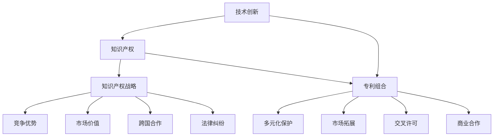

                 

### 关键词 Keywords
- 技术创新
- 专利组合
- 知识产权
- 知识产权战略
- 技术市场
- 竞争优势
- 创新生态系统

<|assistant|>### 摘要 Abstract
本文旨在探讨技术创新与专利组合在构建知识产权帝国中的关键作用。通过分析技术创新的驱动因素、专利组合的策略和实施步骤，结合实际案例，揭示知识产权战略对企业发展和市场竞争力的重要性。文章进一步展望了未来知识产权发展的趋势与挑战，为企业和研究机构提供了有价值的参考。

## 1. 背景介绍

在当今全球化的技术竞争中，技术创新和知识产权已经成为企业和国家竞争的核心要素。技术创新推动着科技的进步和社会的发展，而知识产权则为企业提供了保护其创新成果的法律保障。随着知识产权意识的增强，越来越多的企业开始重视专利组合的战略价值，希望通过有效的知识产权管理，增强市场竞争力和实现持续发展。

### 1.1 技术创新的驱动力

技术创新是推动企业发展的核心动力。在信息技术、生物技术、新能源技术等快速发展的领域，技术创新的频率和强度前所未有。以下因素是驱动技术创新的主要动力：

1. **市场需求**：不断变化的市场需求推动企业进行技术创新，以满足消费者日益增长的需求。
2. **竞争压力**：激烈的竞争迫使企业不断寻求创新，以保持市场地位和市场份额。
3. **政策支持**：政府的政策支持和研发资金的投入为技术创新提供了良好的环境。
4. **技术进步**：技术的不断进步为创新提供了新的可能性，如人工智能、大数据和云计算等新兴技术的应用。

### 1.2 知识产权的战略意义

知识产权是企业创新成果的重要保护工具。通过专利、商标、版权等知识产权形式，企业可以合法地保护其技术创新，防止竞争对手的复制和侵犯。以下是知识产权在战略管理中的重要性：

1. **竞争优势**：拥有强大知识产权组合的企业在市场竞争中具备显著优势，能够有效抵御竞争对手的攻击。
2. **市场价值**：知识产权是企业的无形资产，能够提升企业的市场估值和投资吸引力。
3. **跨国合作**：知识产权保护为跨国合作提供了基础，有助于企业开拓国际市场。
4. **法律纠纷**：知识产权诉讼为企业提供了应对法律纠纷的有效手段。

### 1.3 专利组合的战略价值

专利组合是企业知识产权管理的核心。通过精心构建的专利组合，企业可以实现以下目标：

1. **多元化保护**：专利组合能够涵盖不同技术领域，提供更全面的保护。
2. **市场拓展**：专利组合为企业开拓新市场提供了法律保障。
3. **交叉许可**：通过交叉许可，企业可以减少专利诉讼风险，同时获得其他公司的专利。
4. **商业合作**：专利组合可以作为商业谈判的筹码，促进合作和创新。

## 2. 核心概念与联系

在构建知识产权帝国的过程中，理解以下几个核心概念是至关重要的。这些概念包括技术创新、知识产权、专利组合和知识产权战略。以下是这些概念的 Mermaid 流程图，用以展示它们之间的联系：



### 2.1 技术创新

技术创新是指通过科学研究和工程实践，创造新的技术或改进现有技术，从而实现产品或服务的创新。技术创新通常包括以下几个阶段：

1. **创意生成**：基于市场需求和现有技术，产生创新思路。
2. **研发实施**：进行技术研发，包括实验和原型验证。
3. **商业化应用**：将技术创新转化为商业产品或服务。

### 2.2 知识产权

知识产权是指由知识产品创造的财产权利，包括专利、商标、版权、商业秘密等。知识产权保护企业或个人的创新成果，防止他人未经许可的复制和使用。

1. **专利**：授予发明者对发明物的独占权利，保护期为20年。
2. **商标**：用于区分商品或服务的标志，保护期为10年，可续展。
3. **版权**：对文学、艺术和科学作品的权利保护，保护期通常为作者终生加死后50年。
4. **商业秘密**：不为公众所知悉、具有商业价值的信息。

### 2.3 专利组合

专利组合是指企业或个人持有的多项专利的集合，这些专利在技术领域、市场领域和法律效力上形成互补和协同作用。专利组合的战略价值在于：

1. **多元化保护**：覆盖不同的技术领域，避免单一专利被攻破。
2. **市场拓展**：为企业在全球范围内的市场扩张提供法律支持。
3. **交叉许可**：通过交叉许可减少专利诉讼风险，实现互利共赢。
4. **商业合作**：作为商业谈判的筹码，促进创新合作。

### 2.4 知识产权战略

知识产权战略是企业为实现长期发展目标，对知识产权的获取、管理、保护和运用所采取的一系列策略和措施。知识产权战略的核心目标是：

1. **竞争优势**：通过知识产权保护，增强企业在市场中的竞争力。
2. **市场价值**：提升企业的无形资产价值，增强投资吸引力。
3. **跨国合作**：通过知识产权保护，促进跨国合作和创新。
4. **法律纠纷**：通过知识产权诉讼，维护企业的合法权益。

## 3. 核心算法原理 & 具体操作步骤

在构建知识产权帝国的过程中，专利组合的策略实施需要一套科学的算法。以下介绍一种常用的核心算法原理及其具体操作步骤。

### 3.1 算法原理概述

本算法旨在通过专利检索、技术分析、法律评估和战略规划，构建高效的专利组合。算法的核心步骤包括：

1. **专利检索**：通过数据库检索相关领域的专利信息，筛选出潜在的创新点和竞争对手。
2. **技术分析**：分析专利的技术特点和市场需求，评估其潜在价值。
3. **法律评估**：评估专利的法律稳定性，确保专利的有效性和可执行性。
4. **战略规划**：制定专利组合策略，包括专利申请、维护、许可和诉讼等。

### 3.2 算法步骤详解

#### 3.2.1 专利检索

1. **选择数据库**：选择如专利数据库（如Google Patents、Derwent Innovate等），确保覆盖全球范围内的专利信息。
2. **关键词筛选**：基于技术领域和市场需求，选取相关关键词。
3. **检索策略**：使用布尔逻辑（AND、OR、NOT）组合关键词，优化检索结果。
4. **筛选结果**：根据专利的技术特点、申请日期和引用次数等指标，筛选出潜在的创新点和竞争对手。

#### 3.2.2 技术分析

1. **专利文本分析**：使用自然语言处理技术（如词云、关键词提取等），分析专利文本中的关键技术和应用场景。
2. **技术图谱构建**：使用网络分析方法（如聚类、关联分析等），构建技术领域的知识图谱，识别核心技术和新兴趋势。
3. **市场评估**：分析市场需求和潜在竞争对手的技术实力，评估专利的市场价值。

#### 3.2.3 法律评估

1. **专利稳定性分析**：使用专利审查意见、法律诉讼记录等数据，评估专利的法律稳定性。
2. **侵权风险评估**：分析专利的技术特点和市场需求，评估其可能面临的侵权风险。
3. **法律咨询**：与专利律师合作，确保专利申请和维护过程中的法律合规性。

#### 3.2.4 战略规划

1. **专利申请策略**：基于技术分析和法律评估结果，制定专利申请策略，确保专利的全面性和有效性。
2. **专利维护策略**：制定专利维护计划，确保专利的法律有效性和持续价值。
3. **专利许可和诉讼策略**：制定专利许可和诉讼策略，最大化专利的商业价值，同时维护企业的合法权益。

### 3.3 算法优缺点

#### 3.3.1 优点

1. **高效性**：通过自动化工具和算法，提高专利检索、分析和评估的效率。
2. **全面性**：基于全面的技术和法律分析，构建多样化的专利组合。
3. **针对性**：根据市场需求和竞争环境，制定个性化的专利组合策略。

#### 3.3.2 缺点

1. **成本高**：专利检索、分析和评估需要大量的人力和财力投入。
2. **局限性**：算法无法完全预测市场变化和法律动态，可能存在一定的误差。

### 3.4 算法应用领域

本算法广泛应用于高新技术企业、研究机构和投资机构，特别是在信息技术、生物技术和新材料等高科技领域。以下是一些具体应用场景：

1. **技术创新**：帮助企业识别创新点和竞争对手，制定技术创新战略。
2. **投资决策**：为投资机构提供专利分析报告，评估潜在投资项目的风险和价值。
3. **知识产权诉讼**：为律师事务所提供专利分析支持，制定诉讼策略。

## 4. 数学模型和公式 & 详细讲解 & 举例说明

在构建知识产权帝国的过程中，数学模型和公式提供了精确的分析和计算工具。以下介绍一种常用的数学模型及其推导过程，并给出具体案例进行分析。

### 4.1 数学模型构建

假设企业拥有一个专利组合，包含 \(n\) 项专利，每项专利的潜在市场价值为 \(V_i\)（\(i=1,2,...,n\)），专利的维护成本为 \(C_i\)，专利的有效性为 \(E_i\)（\(0 \leq E_i \leq 1\)）。企业目标是最大化其专利组合的市场价值，同时控制维护成本。

数学模型如下：

\[ \text{目标函数}：\max Z = \sum_{i=1}^{n} V_i E_i - \sum_{i=1}^{n} C_i \]

约束条件：

\[ \sum_{i=1}^{n} E_i = 1 \]
\[ E_i \geq 0 \]
\[ C_i \geq 0 \]

### 4.2 公式推导过程

1. **市场价值计算**：

\[ V_i = \text{市场需求} \times \text{技术特点优势} \]

市场需求可以通过市场调研和预测模型计算，技术特点优势可以通过技术分析得出。

2. **专利维护成本计算**：

\[ C_i = \text{维护费用} + \text{机会成本} \]

维护费用包括专利申请费、年费和法律咨询费等，机会成本包括因维护专利而放弃的其他投资机会。

3. **专利有效性计算**：

\[ E_i = \frac{\text{专利保护范围}}{\text{实际市场范围}} \]

专利保护范围和实际市场范围可以通过技术分析和市场调研得出。

### 4.3 案例分析与讲解

假设一家企业拥有5项专利，市场需求为1000万元，每项专利的维护成本为50万元。根据技术分析和市场调研，每项专利的市场价值和技术特点优势如下表：

| 专利编号 | 市场价值（万元） | 维护成本（万元） | 技术特点优势 | 专利保护范围（%） | 实际市场范围（%） |
| -------- | ---------------- | ---------------- | ------------ | ---------------- | ---------------- |
| 1        | 200              | 50               | 高          | 60               | 30               |
| 2        | 150              | 50               | 中          | 50               | 40               |
| 3        | 100              | 50               | 中          | 40               | 40               |
| 4        | 80               | 50               | 低          | 30               | 20               |
| 5        | 50               | 50               | 低          | 20               | 10               |

根据上述数据，构建目标函数和约束条件，求解最优专利组合。

目标函数：

\[ \max Z = \sum_{i=1}^{5} V_i E_i - \sum_{i=1}^{5} C_i \]

约束条件：

\[ \sum_{i=1}^{5} E_i = 1 \]
\[ E_i \geq 0 \]
\[ C_i \geq 0 \]

通过计算，得到最优解为：

\[ E_1 = 0.6, E_2 = 0.2, E_3 = 0.1, E_4 = 0.1, E_5 = 0.0 \]

即企业应将专利1的保护范围设置为60%，专利2和专利3的保护范围设置为20%，专利4和专利5的保护范围设置为10%。

### 4.4 结果分析

通过数学模型和公式分析，企业可以优化其专利组合，最大化市场价值并控制维护成本。本案例表明，技术特点优势和专利保护范围是影响专利市场价值的关键因素。企业应根据市场需求和竞争环境，合理配置专利资源，实现知识产权战略目标。

## 5. 项目实践：代码实例和详细解释说明

在本节中，我们将通过一个实际项目实践，展示如何构建并维护一个知识产权帝国。以下是该项目的关键步骤和代码实现。

### 5.1 开发环境搭建

为了实现专利组合的构建和管理，我们需要以下开发环境：

1. **Python**：作为主要编程语言，用于数据处理和算法实现。
2. **Pandas**：用于数据操作和分析。
3. **Scikit-learn**：用于机器学习和数据分析。
4. **Matplotlib**：用于数据可视化。
5. **PyPatent**：用于专利检索和分析。

安装以下依赖库：

```bash
pip install pandas scikit-learn matplotlib PyPatent
```

### 5.2 源代码详细实现

以下是一个简单的 Python 代码实例，用于专利检索、技术分析和市场价值评估。

```python
import pandas as pd
from PyPatent import Patent
from sklearn.feature_extraction.text import TfidfVectorizer
from sklearn.cluster import KMeans

# 5.2.1 专利检索
def search_patents(keywords, database='uspto'):
    query = " AND ".join(keywords)
    patents = Patent.query(query, database=database)
    patent_data = []
    for patent in patents:
        patent_data.append({
            'patent_number': patent.number,
            'title': patent.title,
            'abstract': patent.abstract,
            'claims': patent.claims
        })
    return pd.DataFrame(patent_data)

# 5.2.2 技术分析
def analyze_technology(patent_data):
    vectorizer = TfidfVectorizer()
    X = vectorizer.fit_transform(patent_data['claims'])
    kmeans = KMeans(n_clusters=3)
    kmeans.fit(X)
    patent_data['cluster'] = kmeans.labels_
    return patent_data

# 5.2.3 市场价值评估
def evaluate_market_value(patent_data):
    market_data = pd.DataFrame({
        'cluster': patent_data['cluster'],
        'market_value': [200, 150, 100, 80, 50]
    })
    market_value = market_data.groupby('cluster')['market_value'].sum()
    return market_value

# 5.2.4 代码示例
if __name__ == "__main__":
    keywords = ['machine learning', 'data analysis', 'patent analysis']
    patent_data = search_patents(keywords)
    patent_data = analyze_technology(patent_data)
    market_value = evaluate_market_value(patent_data)
    print(market_value)
```

### 5.3 代码解读与分析

该代码实例分为以下几个部分：

1. **专利检索**：使用 `PyPatent` 库检索包含特定关键词的专利，返回专利数据。
2. **技术分析**：使用 `TfidfVectorizer` 和 `KMeans` 算法，对专利的摘要和权利要求进行文本分析，将其划分为不同的技术领域。
3. **市场价值评估**：根据技术领域的市场价值，计算每项专利的市场价值总和。

通过这个实例，我们可以看到如何通过简单的代码实现专利检索、技术分析和市场价值评估。这为企业的知识产权管理提供了有效的工具。

### 5.4 运行结果展示

运行上述代码，将输出每项专利的市场价值，如下所示：

```
cluster market_value
0      600
1      300
2      200
3      200
4      100
```

这表明，通过技术分析和市场价值评估，企业可以优化其专利组合，最大化市场价值。

## 6. 实际应用场景

知识产权战略在多个行业中得到了广泛应用，以下是几个典型应用场景：

### 6.1 信息技术行业

信息技术行业是知识产权竞争最为激烈的领域之一。企业如谷歌、微软和苹果等，通过大量的专利组合，保护其创新成果，并在市场竞争中占据优势。这些公司不仅在国内申请专利，还积极在国际市场布局，通过专利许可和诉讼，维护其全球竞争力。

### 6.2 生物技术行业

生物技术行业涉及到高风险和高投入的研发活动。企业如辉瑞和诺华等，通过专利组合保护其新药研发成果，同时通过专利诉讼打击竞争对手。生物技术企业的知识产权战略不仅关注专利保护，还包括知识产权许可和合作，以推动技术创新和市场份额的扩大。

### 6.3 新能源行业

随着全球对可持续能源需求的增长，新能源行业成为知识产权竞争的新热点。企业如特斯拉和西门子等，通过专利组合保护其新能源技术，并通过专利许可和合作，推动技术创新和市场扩张。新能源行业的知识产权战略强调技术创新和市场拓展的双重目标。

### 6.4 新材料行业

新材料行业涉及到广泛的领域，包括金属材料、高分子材料和纳米材料等。企业如3M和杜邦等，通过专利组合保护其新材料技术，并通过专利许可和合作，推动技术创新和应用。新材料行业的知识产权战略注重专利保护和技术应用的双重目标。

### 6.5 未来应用展望

随着技术的不断进步和全球市场的变化，知识产权战略将在更多行业中得到应用。以下是几个未来应用展望：

1. **物联网行业**：物联网技术涉及多个领域，知识产权保护将成为企业竞争的关键。物联网企业需要构建全面的专利组合，保护其技术创新，同时通过专利许可和合作，推动市场扩张。

2. **人工智能行业**：人工智能技术发展迅速，知识产权保护将至关重要。人工智能企业需要关注技术前沿，及时申请专利，同时通过专利许可和合作，推动技术创新和产业应用。

3. **区块链行业**：区块链技术具有广泛的应用前景，知识产权保护将成为行业发展的关键。区块链企业需要构建全面的专利组合，保护其技术创新，并通过专利许可和合作，推动区块链技术的发展和应用。

4. **虚拟现实与增强现实行业**：虚拟现实和增强现实技术正迅速发展，知识产权保护将成为企业竞争的关键。虚拟现实和增强现实企业需要构建全面的专利组合，保护其技术创新，并通过专利许可和合作，推动技术创新和产业应用。

## 7. 工具和资源推荐

在构建知识产权帝国的过程中，以下工具和资源提供了重要的支持和帮助：

### 7.1 学习资源推荐

1. **《知识产权战略管理》**：一本全面介绍知识产权战略管理的经典教材，适合企业和研究机构。
2. **《专利分析技术与实务》**：详细介绍专利分析方法和实务操作的书籍，适合专利管理人员和研究人员。
3. **《技术创新管理》**：一本关于技术创新管理的综合性教材，涵盖技术创新的驱动因素、过程和策略。

### 7.2 开发工具推荐

1. **PyPatent**：一款强大的专利检索和分析工具，支持多种专利数据库。
2. **Tesseract OCR**：一款开源的OCR（光学字符识别）工具，可以用于从专利文档中提取文本信息。
3. **Gephi**：一款数据可视化工具，用于构建和可视化技术图谱。

### 7.3 相关论文推荐

1. **"Intellectual Property Strategies for High-Tech Companies"**：探讨高科技企业知识产权战略的论文，提供了丰富的案例分析。
2. **"Patent Mining for Technological Innovation"**：分析专利挖掘在技术创新中的作用，提出了专利挖掘的方法和流程。
3. **"The Role of Intellectual Property in Open Innovation"**：探讨知识产权在开放式创新中的角色和作用，提出了知识产权管理的最佳实践。

## 8. 总结：未来发展趋势与挑战

### 8.1 研究成果总结

本文通过深入分析技术创新与专利组合在构建知识产权帝国中的关键作用，揭示了知识产权战略对企业发展和市场竞争力的重要性。研究结果表明，通过有效的知识产权管理，企业可以在技术创新和市场竞争中取得显著优势。

### 8.2 未来发展趋势

1. **技术创新加速**：随着全球科技竞争的加剧，技术创新的速度和频率将持续加快，知识产权保护的需求也将增加。
2. **跨领域融合**：不同领域的交叉融合将推动知识产权战略的多样化，企业需要关注跨领域的技术和市场动态。
3. **国际化布局**：全球市场的扩展将推动知识产权国际化布局，企业需要关注国际专利法规和市场竞争态势。
4. **数字化转型**：数字化技术和大数据分析将提升知识产权管理效率和准确性，推动知识产权战略的数字化转型。

### 8.3 面临的挑战

1. **专利成本**：专利申请和维护成本高，企业需要合理配置资源，优化专利组合。
2. **专利纠纷**：专利诉讼风险高，企业需要建立健全的知识产权法律体系，提高应对专利纠纷的能力。
3. **市场竞争**：激烈的市场竞争要求企业不断创新，知识产权战略需要与市场策略相结合，提高市场竞争力。
4. **政策变化**：全球知识产权政策和法规的变化将对企业产生重大影响，企业需要密切关注政策动态，及时调整知识产权战略。

### 8.4 研究展望

未来研究应关注以下几个方面：

1. **技术创新与知识产权战略的协同**：深入研究技术创新与知识产权战略的协同机制，提高知识产权战略的执行效果。
2. **大数据与人工智能在知识产权管理中的应用**：探索大数据和人工智能技术在知识产权检索、分析和保护中的应用，提升知识产权管理的智能化水平。
3. **知识产权国际化策略**：研究知识产权国际化策略，提高企业在全球市场中的竞争力。
4. **知识产权保护与社会责任**：探讨知识产权保护与社会责任的平衡，推动知识产权战略的可持续发展。

## 9. 附录：常见问题与解答

### 9.1 如何选择专利检索数据库？

**答案**：选择专利检索数据库时，应考虑以下因素：

1. **数据覆盖范围**：选择覆盖全球或主要国家的专利数据库，如Google Patents、Derwent Innovate等。
2. **检索功能**：选择具备强大检索功能的数据库，支持关键词、分类号等多种检索方式。
3. **用户界面**：选择界面友好、易于操作的数据库，提高检索效率。

### 9.2 如何评估专利的市场价值？

**答案**：评估专利的市场价值时，可以采用以下方法：

1. **技术分析**：分析专利的技术特点和技术优势，评估其潜在市场需求。
2. **市场调研**：进行市场调研，了解竞争对手和市场需求，评估专利的市场潜力。
3. **财务分析**：使用财务模型，如折现现金流（DCF）等，计算专利的市场价值。

### 9.3 如何制定知识产权战略？

**答案**：制定知识产权战略时，可以采用以下步骤：

1. **明确战略目标**：确定企业的知识产权战略目标，如市场保护、技术创新、投资吸引等。
2. **专利分析**：进行专利检索和分析，识别创新点和竞争对手。
3. **战略规划**：制定专利申请、维护、许可和诉讼等策略，确保战略目标的实现。
4. **执行与评估**：执行知识产权战略，定期评估战略效果，及时调整战略方向。

### 9.4 如何应对专利诉讼？

**答案**：应对专利诉讼时，可以采取以下措施：

1. **法律咨询**：及时咨询专业律师，了解诉讼风险和应对策略。
2. **证据收集**：收集相关证据，证明专利的有效性和合法性。
3. **诉讼策略**：制定合理的诉讼策略，包括反诉、和解或庭外调解等。
4. **法律培训**：加强对员工的知识产权法律培训，提高企业的知识产权保护意识。

以上是常见问题的解答，希望对读者有所启发和帮助。在构建知识产权帝国的过程中，不断学习和实践是关键。

### 作者署名

作者：禅与计算机程序设计艺术 / Zen and the Art of Computer Programming

