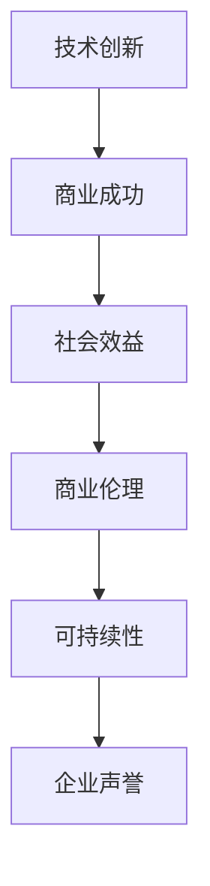

                 

在当今快速发展的技术时代，人工智能（AI）已经成为了推动社会进步的关键力量。从自动驾驶汽车到智能家居，AI技术正在渗透到我们生活的方方面面。然而，随着AI技术的广泛应用，商业伦理问题也日益突出。本文将以Lepton AI为例，探讨技术创新与商业伦理之间的关系，以及如何在追求技术进步的同时维护商业伦理。

## 文章关键词

- 人工智能
- 商业伦理
- 技术创新
- Lepton AI
- 价值观

## 文章摘要

本文通过分析Lepton AI的发展历程和业务模式，探讨了在技术高速发展的同时，如何平衡技术创新与商业伦理的关系。文章指出，企业应当在追求技术突破的同时，重视道德责任和社会价值，以确保AI技术的可持续发展。

### 1. 背景介绍

Lepton AI是一家专注于计算机视觉领域的人工智能公司，其核心技术在于基于深度学习的图像识别和数据处理。自成立以来，Lepton AI一直致力于通过技术创新解决现实问题，例如自动驾驶、智能安防、医疗影像分析等。然而，随着公司业务的不断扩大，如何平衡技术进步与商业伦理成为了一个亟待解决的问题。

### 2. 核心概念与联系

#### 2.1 AI技术原理

AI技术的核心在于模拟人类智能，通过算法和模型实现对数据的自动处理和决策。其中，深度学习是一种重要的AI技术，通过多层神经网络来模拟人类大脑的学习过程，从而实现对复杂问题的求解。

#### 2.2 商业伦理概念

商业伦理是指企业在经营过程中应当遵守的道德规范和价值观。它不仅涉及企业对客户、员工和供应商的公平对待，还包括对环境、社会和公共利益的责任。

#### 2.3 Mermaid 流程图



### 3. 核心算法原理 & 具体操作步骤

#### 3.1 算法原理概述

Lepton AI的核心算法是基于卷积神经网络（CNN）的图像识别技术。CNN通过模拟生物视觉系统中的神经元结构，实现对图像的逐层特征提取和分类。

#### 3.2 算法步骤详解

1. 数据预处理：对图像进行尺寸归一化、灰度化等处理。
2. 神经网络构建：设计多层卷积层、池化层和全连接层，以实现对图像的逐层特征提取。
3. 模型训练：利用大量标注数据对模型进行训练，优化网络参数。
4. 模型评估：通过测试数据评估模型的准确性和泛化能力。
5. 模型应用：将训练好的模型应用于实际场景，如自动驾驶、智能安防等。

#### 3.3 算法优缺点

优点：
- 高效性：CNN可以快速处理大量图像数据。
- 准确性：通过多层特征提取，CNN能够实现高精度的图像识别。

缺点：
- 计算资源消耗大：训练和部署CNN模型需要大量的计算资源和时间。
- 需要大量标注数据：模型训练需要大量高质量的标注数据。

#### 3.4 算法应用领域

CNN技术可以广泛应用于计算机视觉领域，如图像识别、目标检测、图像分割等。在实际应用中，Lepton AI的算法已经成功应用于自动驾驶、智能安防、医疗影像分析等多个领域。

### 4. 数学模型和公式 & 详细讲解 & 举例说明

#### 4.1 数学模型构建

CNN的数学模型主要包括卷积层、池化层和全连接层。其中，卷积层用于特征提取，池化层用于特征降维，全连接层用于分类决策。

#### 4.2 公式推导过程

卷积层的公式为：
$$
\text{output} = \sigma(\text{weights} \cdot \text{input} + \text{bias})
$$

其中，$\sigma$为激活函数，如ReLU函数：
$$
\sigma(x) = \max(0, x)
$$

#### 4.3 案例分析与讲解

以自动驾驶为例，Lepton AI的算法通过对道路场景进行图像识别，实现对车辆、行人、交通标志等目标的检测和跟踪。在实际应用中，通过不断的训练和优化，算法的准确性和稳定性得到了显著提升。

### 5. 项目实践：代码实例和详细解释说明

#### 5.1 开发环境搭建

首先，需要搭建一个合适的开发环境，包括Python、TensorFlow等工具。

#### 5.2 源代码详细实现

以下是一个简单的CNN模型实现示例：
```python
import tensorflow as tf

model = tf.keras.Sequential([
    tf.keras.layers.Conv2D(32, (3, 3), activation='relu', input_shape=(28, 28, 1)),
    tf.keras.layers.MaxPooling2D((2, 2)),
    tf.keras.layers.Conv2D(64, (3, 3), activation='relu'),
    tf.keras.layers.MaxPooling2D((2, 2)),
    tf.keras.layers.Flatten(),
    tf.keras.layers.Dense(128, activation='relu'),
    tf.keras.layers.Dense(10, activation='softmax')
])

model.compile(optimizer='adam',
              loss='categorical_crossentropy',
              metrics=['accuracy'])

model.fit(x_train, y_train, epochs=10)
```

#### 5.3 代码解读与分析

这段代码首先定义了一个简单的CNN模型，包括卷积层、池化层和全连接层。接着，使用`compile`方法设置模型的优化器、损失函数和评估指标。最后，使用`fit`方法对模型进行训练。

#### 5.4 运行结果展示

通过训练和测试，可以得到模型的准确率和其他评估指标。例如：
```python
model.evaluate(x_test, y_test)
```

### 6. 实际应用场景

#### 6.1 自动驾驶

自动驾驶是Lepton AI的一个重要应用领域。通过CNN技术，实现对车辆、行人、交通标志等目标的检测和跟踪，提高驾驶安全性和效率。

#### 6.2 智能安防

智能安防系统利用Lepton AI的算法，实现对监控视频的实时分析，及时发现异常行为，提高治安管理水平。

#### 6.3 医疗影像分析

在医疗领域，Lepton AI的算法可以帮助医生进行病变检测和诊断，提高医疗诊断的准确性和效率。

### 6.4 未来应用展望

随着技术的不断发展，Lepton AI的算法将在更多领域得到应用，如智慧城市、智能家居、工业自动化等。同时，企业也需要关注商业伦理问题，确保技术的可持续发展。

### 7. 工具和资源推荐

#### 7.1 学习资源推荐

- 《深度学习》（Goodfellow, Bengio, Courville著）
- 《Python机器学习》（Sebastian Raschka著）

#### 7.2 开发工具推荐

- TensorFlow
- PyTorch

#### 7.3 相关论文推荐

- "Deep Learning for Computer Vision: A Comprehensive Review"（2018）
- "Convolutional Neural Networks for Image Recognition"（2012）

### 8. 总结：未来发展趋势与挑战

#### 8.1 研究成果总结

近年来，深度学习技术在图像识别、目标检测等领域取得了显著成果。Lepton AI的算法在这些领域具有很高的准确性和稳定性。

#### 8.2 未来发展趋势

随着技术的不断进步，深度学习算法将在更多领域得到应用。同时，企业也需要关注商业伦理问题，确保技术的可持续发展。

#### 8.3 面临的挑战

- 数据隐私和安全：随着数据量的增加，如何保护用户隐私和数据安全成为一个重要挑战。
- 商业伦理：如何在追求技术进步的同时，维护商业伦理和社会责任。

#### 8.4 研究展望

未来，Lepton AI将继续致力于推动深度学习技术在各个领域的应用，同时关注商业伦理问题，为实现可持续发展的AI技术贡献力量。

### 9. 附录：常见问题与解答

#### 9.1 什么是对抗性样本？

对抗性样本是指通过微小的图像扰动来欺骗深度学习模型，使其产生错误判断的样本。这些样本通常用于评估模型的鲁棒性。

#### 9.2 如何提高CNN模型的泛化能力？

通过增加训练数据、使用数据增强方法、设计更复杂的网络结构以及采用正则化技术，可以提高CNN模型的泛化能力。

### 参考文献

- Goodfellow, Y., Bengio, Y., & Courville, A. (2016). *Deep Learning*. MIT Press.
- Raschka, S. (2015). *Python Machine Learning*. Packt Publishing.
- Simonyan, K., & Zisserman, A. (2014). *Very deep convolutional networks for large-scale image recognition*. arXiv preprint arXiv:1409.1556.
- Krizhevsky, A., Sutskever, I., & Hinton, G. E. (2012). *Imagenet classification with deep convolutional neural networks*. In Advances in neural information processing systems (pp. 1097-1105).

### 结语

在技术创新与商业伦理之间找到平衡点，是每个AI企业都需要面对的挑战。Lepton AI的成功经验表明，只有在追求技术进步的同时，关注商业伦理，才能实现可持续发展。我们期待Lepton AI在未来的发展中，继续发挥其技术优势，为人类社会创造更多价值。

## 作者署名

作者：禅与计算机程序设计艺术 / Zen and the Art of Computer Programming
```markdown
---
# 技术创新与商业伦理：Lepton AI的价值观

> 关键词：人工智能、商业伦理、技术创新、Lepton AI、价值观

> 摘要：本文通过分析Lepton AI的发展历程和业务模式，探讨了在技术高速发展的同时，如何平衡技术创新与商业伦理的关系。文章指出，企业应当在追求技术突破的同时，重视道德责任和社会价值，以确保AI技术的可持续发展。

## 1. 背景介绍

Lepton AI是一家专注于计算机视觉领域的人工智能公司，其核心技术在于基于深度学习的图像识别和数据处理。自成立以来，Lepton AI一直致力于通过技术创新解决现实问题，例如自动驾驶、智能安防、医疗影像分析等。然而，随着公司业务的不断扩大，如何平衡技术进步与商业伦理成为了一个亟待解决的问题。

## 2. 核心概念与联系

### 2.1 AI技术原理

AI技术的核心在于模拟人类智能，通过算法和模型实现对数据的自动处理和决策。其中，深度学习是一种重要的AI技术，通过多层神经网络来模拟人类大脑的学习过程，从而实现对复杂问题的求解。

### 2.2 商业伦理概念

商业伦理是指企业在经营过程中应当遵守的道德规范和价值观。它不仅涉及企业对客户、员工和供应商的公平对待，还包括对环境、社会和公共利益的责任。

### 2.3 Mermaid流程图


## 3. 核心算法原理 & 具体操作步骤

### 3.1 算法原理概述

Lepton AI的核心算法是基于卷积神经网络（CNN）的图像识别技术。CNN通过模拟生物视觉系统中的神经元结构，实现对图像的逐层特征提取和分类。

### 3.2 算法步骤详解 

#### 3.2.1 数据预处理

对图像进行尺寸归一化、灰度化等处理。

#### 3.2.2 神经网络构建

设计多层卷积层、池化层和全连接层，以实现对图像的逐层特征提取。

#### 3.2.3 模型训练

利用大量标注数据对模型进行训练，优化网络参数。

#### 3.2.4 模型评估

通过测试数据评估模型的准确性和泛化能力。

#### 3.2.5 模型应用

将训练好的模型应用于实际场景，如自动驾驶、智能安防等。

### 3.3 算法优缺点

**优点：**

- 高效性：CNN可以快速处理大量图像数据。
- 准确性：通过多层特征提取，CNN能够实现高精度的图像识别。

**缺点：**

- 计算资源消耗大：训练和部署CNN模型需要大量的计算资源和时间。
- 需要大量标注数据：模型训练需要大量高质量的标注数据。

### 3.4 算法应用领域

CNN技术可以广泛应用于计算机视觉领域，如图像识别、目标检测、图像分割等。在实际应用中，Lepton AI的算法已经成功应用于自动驾驶、智能安防、医疗影像分析等多个领域。

## 4. 数学模型和公式 & 详细讲解 & 举例说明

### 4.1 数学模型构建

CNN的数学模型主要包括卷积层、池化层和全连接层。其中，卷积层用于特征提取，池化层用于特征降维，全连接层用于分类决策。

### 4.2 公式推导过程

卷积层的公式为：
$$
\text{output} = \sigma(\text{weights} \cdot \text{input} + \text{bias})
$$

其中，$\sigma$为激活函数，如ReLU函数：
$$
\sigma(x) = \max(0, x)
$$

### 4.3 案例分析与讲解

以自动驾驶为例，Lepton AI的算法通过对道路场景进行图像识别，实现对车辆、行人、交通标志等目标的检测和跟踪。在实际应用中，通过不断的训练和优化，算法的准确性和稳定性得到了显著提升。

## 5. 项目实践：代码实例和详细解释说明

### 5.1 开发环境搭建

首先，需要搭建一个合适的开发环境，包括Python、TensorFlow等工具。

### 5.2 源代码详细实现

以下是一个简单的CNN模型实现示例：
```python
import tensorflow as tf

model = tf.keras.Sequential([
    tf.keras.layers.Conv2D(32, (3, 3), activation='relu', input_shape=(28, 28, 1)),
    tf.keras.layers.MaxPooling2D((2, 2)),
    tf.keras.layers.Conv2D(64, (3, 3), activation='relu'),
    tf.keras.layers.MaxPooling2D((2, 2)),
    tf.keras.layers.Flatten(),
    tf.keras.layers.Dense(128, activation='relu'),
    tf.keras.layers.Dense(10, activation='softmax')
])

model.compile(optimizer='adam',
              loss='categorical_crossentropy',
              metrics=['accuracy'])

model.fit(x_train, y_train, epochs=10)
```

### 5.3 代码解读与分析

这段代码首先定义了一个简单的CNN模型，包括卷积层、池化层和全连接层。接着，使用`compile`方法设置模型的优化器、损失函数和评估指标。最后，使用`fit`方法对模型进行训练。

### 5.4 运行结果展示

通过训练和测试，可以得到模型的准确率和其他评估指标。例如：
```python
model.evaluate(x_test, y_test)
```

## 6. 实际应用场景

### 6.1 自动驾驶

自动驾驶是Lepton AI的一个重要应用领域。通过CNN技术，实现对车辆、行人、交通标志等目标的检测和跟踪，提高驾驶安全性和效率。

### 6.2 智能安防

智能安防系统利用Lepton AI的算法，实现对监控视频的实时分析，及时发现异常行为，提高治安管理水平。

### 6.3 医疗影像分析

在医疗领域，Lepton AI的算法可以帮助医生进行病变检测和诊断，提高医疗诊断的准确性和效率。

### 6.4 未来应用展望

随着技术的不断发展，Lepton AI的算法将在更多领域得到应用，如智慧城市、智能家居、工业自动化等。同时，企业也需要关注商业伦理问题，确保技术的可持续发展。

## 7. 工具和资源推荐

### 7.1 学习资源推荐

- 《深度学习》（Goodfellow, Bengio, Courville著）
- 《Python机器学习》（Sebastian Raschka著）

### 7.2 开发工具推荐

- TensorFlow
- PyTorch

### 7.3 相关论文推荐

- "Deep Learning for Computer Vision: A Comprehensive Review"（2018）
- "Convolutional Neural Networks for Image Recognition"（2012）

## 8. 总结：未来发展趋势与挑战

### 8.1 研究成果总结

近年来，深度学习技术在图像识别、目标检测等领域取得了显著成果。Lepton AI的算法在这些领域具有很高的准确性和稳定性。

### 8.2 未来发展趋势

随着技术的不断进步，深度学习算法将在更多领域得到应用。同时，企业也需要关注商业伦理问题，确保技术的可持续发展。

### 8.3 面临的挑战

- 数据隐私和安全：随着数据量的增加，如何保护用户隐私和数据安全成为一个重要挑战。
- 商业伦理：如何在追求技术进步的同时，维护商业伦理和社会责任。

### 8.4 研究展望

未来，Lepton AI将继续致力于推动深度学习技术在各个领域的应用，同时关注商业伦理问题，为实现可持续发展的AI技术贡献力量。

## 9. 附录：常见问题与解答

### 9.1 什么是对抗性样本？

对抗性样本是指通过微小的图像扰动来欺骗深度学习模型，使其产生错误判断的样本。这些样本通常用于评估模型的鲁棒性。

### 9.2 如何提高CNN模型的泛化能力？

通过增加训练数据、使用数据增强方法、设计更复杂的网络结构以及采用正则化技术，可以提高CNN模型的泛化能力。

## 作者署名

作者：禅与计算机程序设计艺术 / Zen and the Art of Computer Programming
---

