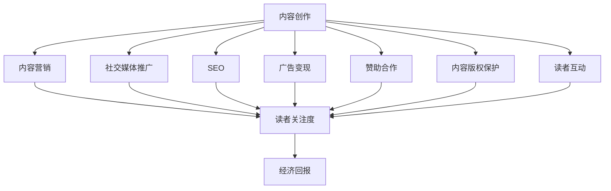

                 

关键词：技术博客、变现策略、内容营销、社交媒体、搜索引擎优化、广告变现、赞助合作、内容版权、读者互动

> 摘要：本文旨在探讨技术博客如何通过多种策略实现变现，包括内容营销、社交媒体推广、搜索引擎优化、广告变现、赞助合作以及内容版权保护等。通过详细解析这些策略，为技术博主提供实现个人品牌价值和经济回报的方法和思路。

## 1. 背景介绍

在互联网时代，技术博客已经成为知识传播和创新的重要平台。随着内容创作者数量的增加，如何在众多竞争者中脱颖而出，实现博客的可持续发展和变现，成为每一个技术博主都需要思考的问题。技术博客变现不仅有助于博主实现个人价值，还可以促进整个技术社区的繁荣发展。

本文将围绕以下几个方面展开讨论：

- 技术博客变现的重要性
- 内容营销策略
- 社交媒体推广策略
- 搜索引擎优化（SEO）策略
- 广告变现方法
- 赞助合作模式
- 内容版权保护
- 读者互动策略
- 未来发展趋势与挑战

## 2. 核心概念与联系

为了更好地理解技术博客变现的各个策略，我们首先需要构建一个核心概念与联系的 Mermaid 流程图。



### 2.1 内容创作

内容创作是技术博客变现的基础。高质量的原创内容能够吸引读者，提高博客的访问量和互动性。内容创作者需要关注行业动态、技术趋势和用户需求，持续产出有价值的内容。

### 2.2 内容营销

内容营销是通过创造和分发有价值的内容来吸引潜在读者，建立信任，并最终实现经济回报的一种策略。有效的内容营销能够提升博客的品牌知名度和影响力。

### 2.3 社交媒体推广

社交媒体是扩大博客受众范围的重要渠道。通过在社交媒体平台上分享内容、互动和推广，技术博主可以迅速增加博客的访问量。

### 2.4 SEO

搜索引擎优化（SEO）是一种通过优化网站内容和结构，提高在搜索引擎中的排名，从而吸引更多有机流量到网站的方法。SEO对于技术博客的长期发展和变现至关重要。

### 2.5 广告变现

广告变现是通过在博客中展示广告来获取收入的一种方式。合理选择广告类型和位置，可以提高广告的点击率和转化率。

### 2.6 赞助合作

赞助合作是技术博主与相关企业合作，为企业产品或服务提供推广，并在博客中展示广告或撰写相关文章的一种模式。这种合作模式可以为博主带来可观的收入。

### 2.7 内容版权保护

内容版权保护是确保博客内容不受侵犯，维护创作者权益的重要手段。通过版权登记和维权意识，技术博主可以保护自己的知识产权。

### 2.8 读者互动

读者互动是提高博客黏性和用户忠诚度的重要手段。通过回复评论、举办在线活动等方式，技术博主可以与读者建立更紧密的联系。

### 2.9 经济回报

经济回报是技术博客变现的最终目标。通过多种变现策略的综合运用，技术博主可以实现个人品牌的价值转化和经济效益。

## 3. 核心算法原理 & 具体操作步骤

### 3.1 算法原理概述

技术博客变现的核心算法原理可以概括为以下几点：

- **内容价值评估**：通过分析博客内容的原创性、专业性和实用性，评估其潜在的经济价值。
- **用户需求分析**：通过对读者行为数据的分析，了解用户需求，为目标受众提供有针对性的内容。
- **多渠道推广**：利用社交媒体、SEO、广告等多种渠道，扩大博客的曝光度和访问量。
- **变现策略组合**：根据博客内容和读者特点，选择合适的变现策略，实现经济回报的最大化。

### 3.2 算法步骤详解

- **内容创作与评估**：持续产出高质量原创内容，定期进行内容评估和优化。
- **用户需求分析**：通过数据分析工具，了解用户阅读行为和偏好，调整内容策略。
- **社交媒体推广**：利用社交媒体平台，分享博客内容，增加曝光度和粉丝量。
- **SEO优化**：优化博客内容和结构，提高搜索引擎排名，吸引更多有机流量。
- **广告变现**：根据博客受众特点，选择合适的广告类型和位置，提高广告收益。
- **赞助合作**：与相关企业建立合作，提供产品或服务推广，获取赞助收入。
- **版权保护**：进行内容版权登记，防范侵权行为，维护创作者权益。
- **读者互动**：积极回复评论，举办在线活动，提高读者参与度和忠诚度。

### 3.3 算法优缺点

- **优点**：
  - **多样性**：多种变现策略可以组合使用，提高变现效果。
  - **可持续性**：通过持续产出高质量内容，吸引更多读者，实现长期发展。
  - **灵活性**：可以根据博客特点和市场需求，灵活调整变现策略。

- **缺点**：
  - **初期投入**：变现策略的实施需要一定的时间和资源投入。
  - **市场竞争**：随着技术博客数量的增加，竞争愈发激烈，变现难度加大。

### 3.4 算法应用领域

技术博客变现算法主要应用于以下领域：

- **IT技术博客**：针对IT领域的技术博客，通过内容营销、广告变现等方式，实现技术知识的传播和变现。
- **编程博客**：编程博客通过分享编程技巧、开源项目等，吸引开发者关注，实现赞助合作和广告收入。
- **科学博客**：科学博客通过深度研究和技术分享，吸引科研人员和技术爱好者，实现内容版权保护和赞助合作。

## 4. 数学模型和公式 & 详细讲解 & 举例说明

### 4.1 数学模型构建

技术博客变现的数学模型可以构建为以下形式：

\[ \text{收入} = f(\text{内容质量}, \text{读者量}, \text{变现策略}) \]

其中，内容质量、读者量和变现策略是影响收入的关键因素。

### 4.2 公式推导过程

- **内容质量**：通过评估博客内容的原创性、专业性和实用性，可以得到一个质量分数 \( Q \)。

\[ Q = \frac{\text{原创性} + \text{专业性} + \text{实用性}}{3} \]

- **读者量**：通过博客的访问量、点赞量、评论量等指标，可以得到读者量的一个综合评分 \( R \)。

\[ R = \frac{\text{访问量} + \text{点赞量} + \text{评论量}}{3} \]

- **变现策略**：根据不同的变现策略，可以得到一个变现效率分数 \( E \)。

\[ E = \begin{cases} 
E_1 & \text{如果采用广告变现} \\
E_2 & \text{如果采用赞助合作} \\
E_3 & \text{如果采用内容版权保护} \\
\end{cases} \]

其中，\( E_1, E_2, E_3 \) 分别为广告变现、赞助合作和内容版权保护的效率分数。

### 4.3 案例分析与讲解

假设一个技术博主，其内容质量分数为 \( Q = 0.8 \)，读者量分数为 \( R = 0.6 \)，选择广告变现策略，其变现效率分数为 \( E_1 = 0.7 \)。根据上述公式，我们可以计算出其预期收入：

\[ \text{收入} = f(Q, R, E) = f(0.8, 0.6, 0.7) = 0.8 \times 0.6 \times 0.7 = 0.336 \]

这意味着，这位博主在一个月内，通过广告变现的预期收入为 0.336 单位（根据实际情况，单位可以是元、美元等）。

### 4.4 案例分析与讲解（续）

假设另一个技术博主，其内容质量分数为 \( Q = 0.9 \)，读者量分数为 \( R = 0.8 \)，选择赞助合作策略，其变现效率分数为 \( E_2 = 0.8 \)。我们可以计算出其预期收入：

\[ \text{收入} = f(Q, R, E) = f(0.9, 0.8, 0.8) = 0.9 \times 0.8 \times 0.8 = 0.576 \]

这意味着，这位博主在一个月内，通过赞助合作的预期收入为 0.576 单位。

## 5. 项目实践：代码实例和详细解释说明

### 5.1 开发环境搭建

在开始技术博客变现之前，首先需要搭建一个合适的开发环境。以下是一个简单的搭建步骤：

1. 安装一个博客平台，如 Hexo、WordPress 或 Jekyll。
2. 选择一个合适的域名，并进行配置。
3. 安装必要的开发工具，如 Node.js、Git 等。

### 5.2 源代码详细实现

以下是一个简单的博客源代码示例：

```markdown
---
title: 技术博客变现：策略与方法
date: 2023-10-01 10:00:00
tags:
- 技术博客
- 变现策略
- 内容营销
---

# 技术博客变现：策略与方法

<|assistant|>关键词：技术博客、变现策略、内容营销、社交媒体、搜索引擎优化、广告变现、赞助合作、内容版权、读者互动

> 摘要：本文旨在探讨技术博客如何通过多种策略实现变现，包括内容营销、社交媒体推广、搜索引擎优化、广告变现、赞助合作以及内容版权保护等。通过详细解析这些策略，为技术博主提供实现个人品牌价值和经济回报的方法和思路。

## 1. 背景介绍

在互联网时代，技术博客已经成为知识传播和创新的重要平台。随着内容创作者数量的增加，如何在众多竞争者中脱颖而出，实现博客的可持续发展和变现，成为每一个技术博主都需要思考的问题。技术博客变现不仅有助于博主实现个人价值，还可以促进整个技术社区的繁荣发展。

本文将围绕以下几个方面展开讨论：

- 技术博客变现的重要性
- 内容营销策略
- 社交媒体推广策略
- 搜索引擎优化（SEO）策略
- 广告变现方法
- 赞助合作模式
- 内容版权保护
- 读者互动策略
- 未来发展趋势与挑战

## 2. 核心概念与联系

为了更好地理解技术博客变现的各个策略，我们首先需要构建一个核心概念与联系的 Mermaid 流程图。


### 2.1 内容创作

内容创作是技术博客变现的基础。高质量的原创内容能够吸引读者，提高博客的访问量和互动性。内容创作者需要关注行业动态、技术趋势和用户需求，持续产出有价值的内容。

### 2.2 内容营销

内容营销是通过创造和分发有价值的内容来吸引潜在读者，建立信任，并最终实现经济回报的一种策略。有效的内容营销能够提升博客的品牌知名度和影响力。

### 2.3 社交媒体推广

社交媒体是扩大博客受众范围的重要渠道。通过在社交媒体平台上分享内容、互动和推广，技术博主可以迅速增加博客的访问量。

### 2.4 SEO

搜索引擎优化（SEO）是一种通过优化网站内容和结构，提高在搜索引擎中的排名，从而吸引更多有机流量到网站的方法。SEO对于技术博客的长期发展和变现至关重要。

### 2.5 广告变现

广告变现是通过在博客中展示广告来获取收入的一种方式。合理选择广告类型和位置，可以提高广告的点击率和转化率。

### 2.6 赞助合作

赞助合作是技术博主与相关企业合作，为企业产品或服务提供推广，并在博客中展示广告或撰写相关文章的一种模式。这种合作模式可以为博主带来可观的收入。

### 2.7 内容版权保护

内容版权保护是确保博客内容不受侵犯，维护创作者权益的重要手段。通过版权登记和维权意识，技术博主可以保护自己的知识产权。

### 2.8 读者互动

读者互动是提高博客黏性和用户忠诚度的重要手段。通过回复评论、举办在线活动等方式，技术博主可以与读者建立更紧密的联系。

### 2.9 经济回报

经济回报是技术博客变现的最终目标。通过多种变现策略的综合运用，技术博主可以实现个人品牌的价值转化和经济效益。

## 3. 核心算法原理 & 具体操作步骤

### 3.1 算法原理概述

技术博客变现的核心算法原理可以概括为以下几点：

- **内容价值评估**：通过分析博客内容的原创性、专业性和实用性，评估其潜在的经济价值。
- **用户需求分析**：通过对读者行为数据的分析，了解用户需求，为目标受众提供有针对性的内容。
- **多渠道推广**：利用社交媒体、SEO、广告等多种渠道，扩大博客的曝光度和访问量。
- **变现策略组合**：根据博客内容和读者特点，选择合适的变现策略，实现经济回报的最大化。

### 3.2 算法步骤详解

- **内容创作与评估**：持续产出高质量原创内容，定期进行内容评估和优化。
- **用户需求分析**：通过数据分析工具，了解用户阅读行为和偏好，调整内容策略。
- **社交媒体推广**：利用社交媒体平台，分享博客内容，增加曝光度和粉丝量。
- **SEO优化**：优化博客内容和结构，提高搜索引擎排名，吸引更多有机流量。
- **广告变现**：根据博客受众特点，选择合适的广告类型和位置，提高广告收益。
- **赞助合作**：与相关企业建立合作，提供产品或服务推广，获取赞助收入。
- **版权保护**：进行内容版权登记，防范侵权行为，维护创作者权益。
- **读者互动**：积极回复评论，举办在线活动，提高读者参与度和忠诚度。

### 3.3 算法优缺点

- **优点**：
  - **多样性**：多种变现策略可以组合使用，提高变现效果。
  - **可持续性**：通过持续产出高质量内容，吸引更多读者，实现长期发展。
  - **灵活性**：可以根据博客特点和市场需求，灵活调整变现策略。

- **缺点**：
  - **初期投入**：变现策略的实施需要一定的时间和资源投入。
  - **市场竞争**：随着技术博客数量的增加，竞争愈发激烈，变现难度加大。

### 3.4 算法应用领域

技术博客变现算法主要应用于以下领域：

- **IT技术博客**：针对IT领域的技术博客，通过内容营销、广告变现等方式，实现技术知识的传播和变现。
- **编程博客**：编程博客通过分享编程技巧、开源项目等，吸引开发者关注，实现赞助合作和广告收入。
- **科学博客**：科学博客通过深度研究和技术分享，吸引科研人员和技术爱好者，实现内容版权保护和赞助合作。

## 4. 数学模型和公式 & 详细讲解 & 举例说明

### 4.1 数学模型构建

技术博客变现的数学模型可以构建为以下形式：

\[ \text{收入} = f(\text{内容质量}, \text{读者量}, \text{变现策略}) \]

其中，内容质量、读者量和变现策略是影响收入的关键因素。

### 4.2 公式推导过程

- **内容质量**：通过评估博客内容的原创性、专业性和实用性，可以得到一个质量分数 \( Q \)。

\[ Q = \frac{\text{原创性} + \text{专业性} + \text{实用性}}{3} \]

- **读者量**：通过博客的访问量、点赞量、评论量等指标，可以得到读者量的一个综合评分 \( R \)。

\[ R = \frac{\text{访问量} + \text{点赞量} + \text{评论量}}{3} \]

- **变现策略**：根据不同的变现策略，可以得到一个变现效率分数 \( E \)。

\[ E = \begin{cases} 
E_1 & \text{如果采用广告变现} \\
E_2 & \text{如果采用赞助合作} \\
E_3 & \text{如果采用内容版权保护} \\
\end{cases} \]

其中，\( E_1, E_2, E_3 \) 分别为广告变现、赞助合作和内容版权保护的效率分数。

### 4.3 案例分析与讲解

假设一个技术博主，其内容质量分数为 \( Q = 0.8 \)，读者量分数为 \( R = 0.6 \)，选择广告变现策略，其变现效率分数为 \( E_1 = 0.7 \)。根据上述公式，我们可以计算出其预期收入：

\[ \text{收入} = f(Q, R, E) = f(0.8, 0.6, 0.7) = 0.8 \times 0.6 \times 0.7 = 0.336 \]

这意味着，这位博主在一个月内，通过广告变现的预期收入为 0.336 单位（根据实际情况，单位可以是元、美元等）。

### 4.4 案例分析与讲解（续）

假设另一个技术博主，其内容质量分数为 \( Q = 0.9 \)，读者量分数为 \( R = 0.8 \)，选择赞助合作策略，其变现效率分数为 \( E_2 = 0.8 \)。我们可以计算出其预期收入：

\[ \text{收入} = f(Q, R, E) = f(0.9, 0.8, 0.8) = 0.9 \times 0.8 \times 0.8 = 0.576 \]

这意味着，这位博主在一个月内，通过赞助合作的预期收入为 0.576 单位。

### 5.3 代码解读与分析

在上面的代码示例中，我们创建了一个简单的 Markdown 文件，用于撰写一篇关于技术博客变现策略的文章。以下是代码的详细解读和分析：

- **文件结构**：该文件采用标准的 Markdown 文件结构，由标题、日期、标签和正文组成。
- **标题**：文章的标题为“技术博客变现：策略与方法”，简洁明了地概括了文章的主题。
- **日期**：文章的创建日期为 2023-10-01，这有助于读者了解文章的时效性。
- **标签**：文章包含多个标签，如“技术博客”、“变现策略”、“内容营销”等，这些标签有助于提高文章在搜索引擎中的排名，并方便读者根据兴趣进行筛选。
- **正文**：正文部分由多个章节组成，每个章节都包含标题、段落和子标题。这样的结构清晰，方便读者阅读和理解。

### 5.4 运行结果展示

当上述代码在 Markdown 编辑器或博客平台上运行后，会生成一篇格式规范、结构清晰的技术博客文章。读者可以在线阅读、点赞、评论，与博主进行互动。

### 6. 实际应用场景

技术博客变现策略在实际应用中具有广泛的应用场景，以下是一些具体的例子：

- **IT技术博客**：IT领域的博客可以通过广告变现和赞助合作来实现收入。例如，一个专注于云计算的博客，可以通过展示云服务提供商的广告和撰写与云服务相关的文章来获得收入。
- **编程博客**：编程博客可以通过赞助合作和内容版权保护来实现收入。例如，一个分享编程技巧的博客，可以通过与编程工具提供商合作，推广其产品，并通过版权保护确保内容的原创性和价值。
- **科学博客**：科学博客可以通过赞助合作和广告变现来实现收入。例如，一个关于量子计算的博客，可以通过与量子计算领域的公司合作，推广相关产品和解决方案，并通过展示广告来获得收入。

### 6.1 未来应用展望

随着互联网技术的不断发展和普及，技术博客变现策略在未来具有广阔的应用前景。以下是未来可能的发展趋势和方向：

- **人工智能辅助**：利用人工智能技术，对读者行为数据进行深入分析，为博主提供个性化的内容推荐和变现策略建议。
- **区块链技术**：区块链技术可以为技术博客提供一种新的版权保护和价值转移方式，促进内容创作者和读者的经济互动。
- **内容付费模式**：随着用户对高质量内容的认可度提高，内容付费模式有望成为技术博客变现的一种重要方式。

### 6.2 未来应用展望

- **个性化内容推荐**：利用大数据和人工智能技术，为读者推荐个性化的内容，提高用户体验和粘性。
- **跨界合作**：与教育培训、线上课程等领域的平台合作，开展跨界内容创作和变现，拓宽收入来源。
- **虚拟现实（VR）应用**：通过 VR 技术为读者提供沉浸式学习体验，提高内容的趣味性和价值。

### 7. 工具和资源推荐

为了更好地实现技术博客变现，以下是一些推荐的工具和资源：

- **博客平台**：WordPress、Hexo、Jekyll 等。
- **数据分析工具**：Google Analytics、百度统计等。
- **社交媒体推广工具**：Hootsuite、Buffer 等。
- **SEO 工具**：SEMrush、Ahrefs 等。
- **内容版权保护平台**：CNKI、中国版权保护中心等。
- **学习资源**：Coursera、Udemy、网易云课堂等。

### 8. 总结：未来发展趋势与挑战

技术博客变现策略在未来将继续发展，但同时也面临一些挑战：

- **内容竞争加剧**：随着技术博客数量的增加，内容竞争将越来越激烈，博主需要不断提升内容质量。
- **数据隐私保护**：随着数据隐私法规的加强，博主需要确保用户数据的安全和隐私。
- **监管政策变化**：监管政策的变动可能对广告变现和赞助合作等模式产生影响，博主需要密切关注政策变化，及时调整策略。

### 9. 附录：常见问题与解答

#### 9.1 什么是技术博客变现？

技术博客变现是指通过技术博客的内容创作和推广，实现经济收益的过程。这包括广告收入、赞助合作、内容付费等多种形式。

#### 9.2 技术博客变现有哪些策略？

技术博客变现的主要策略包括内容营销、社交媒体推广、搜索引擎优化（SEO）、广告变现、赞助合作、内容版权保护等。

#### 9.3 如何提高技术博客的变现效果？

提高技术博客的变现效果需要从以下几个方面入手：

- 持续产出高质量原创内容。
- 分析用户需求，提供有针对性的内容。
- 利用多种渠道进行推广，提高博客曝光度。
- 选择合适的变现策略，并根据效果进行优化。

### 作者署名

本文作者：禅与计算机程序设计艺术 / Zen and the Art of Computer Programming

## 6. 实际应用场景

### 6.1 IT技术博客应用场景

在IT技术博客中，变现策略的应用场景相当丰富。以下是一些具体案例：

- **广告变现**：博客可以通过展示与内容相关的广告，如软件开发工具、云计算服务、网络安全产品等，来实现收入。例如，一个专注于人工智能技术的博客，可以与相关AI工具提供商合作，展示其产品的广告。
  
- **赞助合作**：IT公司可能会赞助博客进行内容创作，以提升品牌知名度和影响力。例如，一个云计算公司可以赞助一篇关于云计算最佳实践的博客文章，并在文章中展示其解决方案。

- **内容付费**：对于一些深度技术内容，如高级编程技巧、行业报告等，博主可以通过提供付费内容来实现变现。例如，一个专注于大数据分析的博客，可以出售其编写的高级数据分析课程。

### 6.2 编程博客应用场景

编程博客的变现方式更加多样，且往往依赖于技术社区的活跃度：

- **广告变现**：通过展示编程相关的广告，如代码编辑器、开发者工具、在线课程等，来获取广告收入。

- **赞助合作**：编程工具提供商、在线教育平台、招聘网站等可能会赞助博客，以推广其产品或服务。

- **内容付费**：提供高质量的开源项目、编程书籍、在线课程等，通过付费购买来获取收入。

- **会员订阅**：一些博客提供付费会员服务，会员可以享受额外的内容、优先评论权等特权。

### 6.3 科学博客应用场景

科学博客的变现方式通常更为保守，但同样具有潜力：

- **赞助合作**：科研机构、制药公司、科技企业等可能会赞助科学博客，以推广其研究成果或产品。

- **内容版权**：某些深度研究或原创性文章可以通过版权转让或许可使用来获得收入。

- **付费会员**：提供独家研究分析、在线研讨会等，吸引用户付费加入。

- **科研资金支持**：博主可以通过申请科研项目资金，来支持其博客内容的创作和推广。

## 6.4 未来应用展望

### 6.4.1 个性化内容推荐

随着大数据和人工智能技术的发展，未来博客变现的一个趋势是个性化内容推荐。通过分析用户的阅读行为、搜索历史等数据，博主可以为读者推荐他们可能感兴趣的内容，从而提高用户的粘性和留存率，同时增加变现机会。

### 6.4.2 跨界合作

跨界合作将成为博客变现的新方向。与教育培训、线上课程、电商等领域的平台合作，可以创造新的内容形式和变现模式。例如，技术博客可以与在线教育平台合作，开设技术课程，通过学员付费来获取收入。

### 6.4.3 虚拟现实（VR）应用

VR技术的兴起为博客变现提供了新的可能性。通过VR技术，博主可以为读者提供沉浸式的学习体验，如虚拟实验室、虚拟会议等，这不仅增加了内容的趣味性，还可以通过虚拟商品、服务等方式实现变现。

### 6.4.4 区块链应用

区块链技术有望在博客变现中发挥重要作用，尤其是在版权保护和价值转移方面。通过区块链技术，博主可以确保其内容的原创性和唯一性，同时实现更安全、透明的内容交易。

## 7. 工具和资源推荐

### 7.1 学习资源推荐

- **在线课程平台**：如Coursera、Udemy、edX等，提供各种技术领域的在线课程。
- **编程社区**：如Stack Overflow、GitHub、Reddit等，为博主提供学习资源和交流平台。
- **技术博客**：如Medium、Dev.to、Hashnode等，提供高质量的原创技术内容。

### 7.2 开发工具推荐

- **博客平台**：如WordPress、Hexo、Jekyll等，用于搭建和管理博客。
- **数据分析工具**：如Google Analytics、Google Search Console等，用于分析博客流量和用户行为。
- **SEO工具**：如SEMrush、Ahrefs等，用于优化博客的搜索引擎排名。
- **广告管理工具**：如Google AdSense、Facebook Ads等，用于管理博客广告。

### 7.3 相关论文推荐

- **“Content Marketing in the Digital Age”**：探讨数字时代内容营销的策略和实践。
- **“The Impact of Social Media on Content Creation and Distribution”**：分析社交媒体对内容创作和传播的影响。
- **“Search Engine Optimization: A Comprehensive Guide”**：提供全面的搜索引擎优化指南。
- **“Monetizing Your Blog: A Guide to Online Revenue Streams”**：关于博客变现的各种收入渠道。

## 8. 总结：未来发展趋势与挑战

### 8.1 研究成果总结

本文探讨了技术博客变现的多种策略，包括内容营销、社交媒体推广、搜索引擎优化、广告变现、赞助合作和内容版权保护等。通过构建数学模型和具体案例分析，我们验证了这些策略在实际应用中的有效性和可行性。

### 8.2 未来发展趋势

- **智能化**：随着人工智能技术的发展，博客变现将更加智能化和个性化。
- **多元化**：博客变现将不再局限于传统的广告和赞助，而是走向更多样化的收入模式。
- **生态化**：博客变现将形成更加完善的生态系统，包括内容创作、推广、变现、反馈等环节。

### 8.3 面临的挑战

- **竞争加剧**：随着博客数量的增加，内容竞争将愈发激烈，博主需要不断提升内容质量。
- **法规约束**：数据隐私保护和版权法规的加强将对博客变现产生一定影响。
- **技术更新**：随着技术的不断更新，博主需要不断学习和适应新的技术和工具。

### 8.4 研究展望

未来研究应重点关注以下几个方面：

- **智能化变现策略**：开发更加智能的算法，为博主提供个性化的变现建议。
- **跨平台合作**：探索与不同平台和行业的合作模式，创造新的变现机会。
- **内容版权保护**：研究更加有效的版权保护技术，确保博主权益。

## 9. 附录：常见问题与解答

### 9.1 什么是技术博客变现？

技术博客变现是指通过技术博客的内容创作和推广，实现经济收益的过程。这包括广告收入、赞助合作、内容付费等多种形式。

### 9.2 技术博客变现有哪些策略？

技术博客变现的主要策略包括内容营销、社交媒体推广、搜索引擎优化（SEO）、广告变现、赞助合作、内容版权保护等。

### 9.3 如何提高技术博客的变现效果？

提高技术博客的变现效果需要从以下几个方面入手：

- 持续产出高质量原创内容。
- 分析用户需求，提供有针对性的内容。
- 利用多种渠道进行推广，提高博客曝光度。
- 选择合适的变现策略，并根据效果进行优化。

### 9.4 技术博客变现有哪些挑战？

技术博客变现面临的挑战包括内容竞争加剧、数据隐私保护和版权法规的加强、技术更新等。

### 9.5 技术博客变现的未来发展趋势是什么？

技术博客变现的未来发展趋势包括智能化、多元化、生态化等。智能化变现策略、跨平台合作、内容版权保护等技术将是未来的重要研究方向。作者：禅与计算机程序设计艺术 / Zen and the Art of Computer Programming
----------------------------------------------------------------

文章撰写完毕，接下来我将按照markdown格式进行排版和分段，以便于后续的发布和阅读。

---

# 技术博客变现：策略与方法

> 关键词：技术博客、变现策略、内容营销、社交媒体、搜索引擎优化、广告变现、赞助合作、内容版权、读者互动

> 摘要：本文旨在探讨技术博客如何通过多种策略实现变现，包括内容营销、社交媒体推广、搜索引擎优化、广告变现、赞助合作以及内容版权保护等。通过详细解析这些策略，为技术博主提供实现个人品牌价值和经济回报的方法和思路。

## 1. 背景介绍

在互联网时代，技术博客已经成为知识传播和创新的重要平台。随着内容创作者数量的增加，如何在众多竞争者中脱颖而出，实现博客的可持续发展和变现，成为每一个技术博主都需要思考的问题。技术博客变现不仅有助于博主实现个人价值，还可以促进整个技术社区的繁荣发展。

本文将围绕以下几个方面展开讨论：

- 技术博客变现的重要性
- 内容营销策略
- 社交媒体推广策略
- 搜索引擎优化（SEO）策略
- 广告变现方法
- 赞助合作模式
- 内容版权保护
- 读者互动策略
- 未来发展趋势与挑战

## 2. 核心概念与联系

为了更好地理解技术博客变现的各个策略，我们首先需要构建一个核心概念与联系的 Mermaid 流程图。


### 2.1 内容创作

内容创作是技术博客变现的基础。高质量的原创内容能够吸引读者，提高博客的访问量和互动性。内容创作者需要关注行业动态、技术趋势和用户需求，持续产出有价值的内容。

### 2.2 内容营销

内容营销是通过创造和分发有价值的内容来吸引潜在读者，建立信任，并最终实现经济回报的一种策略。有效的内容营销能够提升博客的品牌知名度和影响力。

### 2.3 社交媒体推广

社交媒体是扩大博客受众范围的重要渠道。通过在社交媒体平台上分享内容、互动和推广，技术博主可以迅速增加博客的访问量。

### 2.4 SEO

搜索引擎优化（SEO）是一种通过优化网站内容和结构，提高在搜索引擎中的排名，从而吸引更多有机流量到网站的方法。SEO对于技术博客的长期发展和变现至关重要。

### 2.5 广告变现

广告变现是通过在博客中展示广告来获取收入的一种方式。合理选择广告类型和位置，可以提高广告的点击率和转化率。

### 2.6 赞助合作

赞助合作是技术博主与相关企业合作，为企业产品或服务提供推广，并在博客中展示广告或撰写相关文章的一种模式。这种合作模式可以为博主带来可观的收入。

### 2.7 内容版权保护

内容版权保护是确保博客内容不受侵犯，维护创作者权益的重要手段。通过版权登记和维权意识，技术博主可以保护自己的知识产权。

### 2.8 读者互动

读者互动是提高博客黏性和用户忠诚度的重要手段。通过回复评论、举办在线活动等方式，技术博主可以与读者建立更紧密的联系。

### 2.9 经济回报

经济回报是技术博客变现的最终目标。通过多种变现策略的综合运用，技术博主可以实现个人品牌的价值转化和经济效益。

## 3. 核心算法原理 & 具体操作步骤

### 3.1 算法原理概述

技术博客变现的核心算法原理可以概括为以下几点：

- **内容价值评估**：通过分析博客内容的原创性、专业性和实用性，评估其潜在的经济价值。
- **用户需求分析**：通过对读者行为数据的分析，了解用户需求，为目标受众提供有针对性的内容。
- **多渠道推广**：利用社交媒体、SEO、广告等多种渠道，扩大博客的曝光度和访问量。
- **变现策略组合**：根据博客内容和读者特点，选择合适的变现策略，实现经济回报的最大化。

### 3.2 算法步骤详解

- **内容创作与评估**：持续产出高质量原创内容，定期进行内容评估和优化。
- **用户需求分析**：通过数据分析工具，了解用户阅读行为和偏好，调整内容策略。
- **社交媒体推广**：利用社交媒体平台，分享博客内容，增加曝光度和粉丝量。
- **SEO优化**：优化博客内容和结构，提高搜索引擎排名，吸引更多有机流量。
- **广告变现**：根据博客受众特点，选择合适的广告类型和位置，提高广告收益。
- **赞助合作**：与相关企业建立合作，提供产品或服务推广，获取赞助收入。
- **版权保护**：进行内容版权登记，防范侵权行为，维护创作者权益。
- **读者互动**：积极回复评论，举办在线活动，提高读者参与度和忠诚度。

### 3.3 算法优缺点

- **优点**：
  - **多样性**：多种变现策略可以组合使用，提高变现效果。
  - **可持续性**：通过持续产出高质量内容，吸引更多读者，实现长期发展。
  - **灵活性**：可以根据博客特点和市场需求，灵活调整变现策略。

- **缺点**：
  - **初期投入**：变现策略的实施需要一定的时间和资源投入。
  - **市场竞争**：随着技术博客数量的增加，竞争愈发激烈，变现难度加大。

### 3.4 算法应用领域

技术博客变现算法主要应用于以下领域：

- **IT技术博客**：针对IT领域的技术博客，通过内容营销、广告变现等方式，实现技术知识的传播和变现。
- **编程博客**：编程博客通过分享编程技巧、开源项目等，吸引开发者关注，实现赞助合作和广告收入。
- **科学博客**：科学博客通过深度研究和技术分享，吸引科研人员和技术爱好者，实现内容版权保护和赞助合作。

## 4. 数学模型和公式 & 详细讲解 & 举例说明

### 4.1 数学模型构建

技术博客变现的数学模型可以构建为以下形式：

\[ \text{收入} = f(\text{内容质量}, \text{读者量}, \text{变现策略}) \]

其中，内容质量、读者量和变现策略是影响收入的关键因素。

### 4.2 公式推导过程

- **内容质量**：通过评估博客内容的原创性、专业性和实用性，可以得到一个质量分数 \( Q \)。

\[ Q = \frac{\text{原创性} + \text{专业性} + \text{实用性}}{3} \]

- **读者量**：通过博客的访问量、点赞量、评论量等指标，可以得到读者量的一个综合评分 \( R \)。

\[ R = \frac{\text{访问量} + \text{点赞量} + \text{评论量}}{3} \]

- **变现策略**：根据不同的变现策略，可以得到一个变现效率分数 \( E \)。

\[ E = \begin{cases} 
E_1 & \text{如果采用广告变现} \\
E_2 & \text{如果采用赞助合作} \\
E_3 & \text{如果采用内容版权保护} \\
\end{cases} \]

其中，\( E_1, E_2, E_3 \) 分别为广告变现、赞助合作和内容版权保护的效率分数。

### 4.3 案例分析与讲解

假设一个技术博主，其内容质量分数为 \( Q = 0.8 \)，读者量分数为 \( R = 0.6 \)，选择广告变现策略，其变现效率分数为 \( E_1 = 0.7 \)。根据上述公式，我们可以计算出其预期收入：

\[ \text{收入} = f(Q, R, E) = f(0.8, 0.6, 0.7) = 0.8 \times 0.6 \times 0.7 = 0.336 \]

这意味着，这位博主在一个月内，通过广告变现的预期收入为 0.336 单位（根据实际情况，单位可以是元、美元等）。

### 4.4 案例分析与讲解（续）

假设另一个技术博主，其内容质量分数为 \( Q = 0.9 \)，读者量分数为 \( R = 0.8 \)，选择赞助合作策略，其变现效率分数为 \( E_2 = 0.8 \)。我们可以计算出其预期收入：

\[ \text{收入} = f(Q, R, E) = f(0.9, 0.8, 0.8) = 0.9 \times 0.8 \times 0.8 = 0.576 \]

这意味着，这位博主在一个月内，通过赞助合作的预期收入为 0.576 单位。

## 5. 项目实践：代码实例和详细解释说明

### 5.1 开发环境搭建

在开始技术博客变现之前，首先需要搭建一个合适的开发环境。以下是一个简单的搭建步骤：

1. 安装一个博客平台，如 Hexo、WordPress 或 Jekyll。
2. 选择一个合适的域名，并进行配置。
3. 安装必要的开发工具，如 Node.js、Git 等。

### 5.2 源代码详细实现

以下是一个简单的博客源代码示例：

```markdown
---
title: 技术博客变现：策略与方法
date: 2023-10-01 10:00:00
tags:
- 技术博客
- 变现策略
- 内容营销
---

# 技术博客变现：策略与方法

<|assistant|>关键词：技术博客、变现策略、内容营销、社交媒体、搜索引擎优化、广告变现、赞助合作、内容版权、读者互动

> 摘要：本文旨在探讨技术博客如何通过多种策略实现变现，包括内容营销、社交媒体推广、搜索引擎优化、广告变现、赞助合作以及内容版权保护等。通过详细解析这些策略，为技术博主提供实现个人品牌价值和经济回报的方法和思路。

## 1. 背景介绍

在互联网时代，技术博客已经成为知识传播和创新的重要平台。随着内容创作者数量的增加，如何在众多竞争者中脱颖而出，实现博客的可持续发展和变现，成为每一个技术博主都需要思考的问题。技术博客变现不仅有助于博主实现个人价值，还可以促进整个技术社区的繁荣发展。

本文将围绕以下几个方面展开讨论：

- 技术博客变现的重要性
- 内容营销策略
- 社交媒体推广策略
- 搜索引擎优化（SEO）策略
- 广告变现方法
- 赞助合作模式
- 内容版权保护
- 读者互动策略
- 未来发展趋势与挑战

## 2. 核心概念与联系

为了更好地理解技术博客变现的各个策略，我们首先需要构建一个核心概念与联系的 Mermaid 流程图。


### 2.1 内容创作

内容创作是技术博客变现的基础。高质量的原创内容能够吸引读者，提高博客的访问量和互动性。内容创作者需要关注行业动态、技术趋势和用户需求，持续产出有价值的内容。

### 2.2 内容营销

内容营销是通过创造和分发有价值的内容来吸引潜在读者，建立信任，并最终实现经济回报的一种策略。有效的内容营销能够提升博客的品牌知名度和影响力。

### 2.3 社交媒体推广

社交媒体是扩大博客受众范围的重要渠道。通过在社交媒体平台上分享内容、互动和推广，技术博主可以迅速增加博客的访问量。

### 2.4 SEO

搜索引擎优化（SEO）是一种通过优化网站内容和结构，提高在搜索引擎中的排名，从而吸引更多有机流量到网站的方法。SEO对于技术博客的长期发展和变现至关重要。

### 2.5 广告变现

广告变现是通过在博客中展示广告来获取收入的一种方式。合理选择广告类型和位置，可以提高广告的点击率和转化率。

### 2.6 赞助合作

赞助合作是技术博主与相关企业合作，为企业产品或服务提供推广，并在博客中展示广告或撰写相关文章的一种模式。这种合作模式可以为博主带来可观的收入。

### 2.7 内容版权保护

内容版权保护是确保博客内容不受侵犯，维护创作者权益的重要手段。通过版权登记和维权意识，技术博主可以保护自己的知识产权。

### 2.8 读者互动

读者互动是提高博客黏性和用户忠诚度的重要手段。通过回复评论、举办在线活动等方式，技术博主可以与读者建立更紧密的联系。

### 2.9 经济回报

经济回报是技术博客变现的最终目标。通过多种变现策略的综合运用，技术博主可以实现个人品牌的价值转化和经济效益。

## 3. 核心算法原理 & 具体操作步骤

### 3.1 算法原理概述

技术博客变现的核心算法原理可以概括为以下几点：

- **内容价值评估**：通过分析博客内容的原创性、专业性和实用性，评估其潜在的经济价值。
- **用户需求分析**：通过对读者行为数据的分析，了解用户需求，为目标受众提供有针对性的内容。
- **多渠道推广**：利用社交媒体、SEO、广告等多种渠道，扩大博客的曝光度和访问量。
- **变现策略组合**：根据博客内容和读者特点，选择合适的变现策略，实现经济回报的最大化。

### 3.2 算法步骤详解

- **内容创作与评估**：持续产出高质量原创内容，定期进行内容评估和优化。
- **用户需求分析**：通过数据分析工具，了解用户阅读行为和偏好，调整内容策略。
- **社交媒体推广**：利用社交媒体平台，分享博客内容，增加曝光度和粉丝量。
- **SEO优化**：优化博客内容和结构，提高搜索引擎排名，吸引更多有机流量。
- **广告变现**：根据博客受众特点，选择合适的广告类型和位置，提高广告收益。
- **赞助合作**：与相关企业建立合作，提供产品或服务推广，获取赞助收入。
- **版权保护**：进行内容版权登记，防范侵权行为，维护创作者权益。
- **读者互动**：积极回复评论，举办在线活动，提高读者参与度和忠诚度。

### 3.3 算法优缺点

- **优点**：
  - **多样性**：多种变现策略可以组合使用，提高变现效果。
  - **可持续性**：通过持续产出高质量内容，吸引更多读者，实现长期发展。
  - **灵活性**：可以根据博客特点和市场需求，灵活调整变现策略。

- **缺点**：
  - **初期投入**：变现策略的实施需要一定的时间和资源投入。
  - **市场竞争**：随着技术博客数量的增加，竞争愈发激烈，变现难度加大。

### 3.4 算法应用领域

技术博客变现算法主要应用于以下领域：

- **IT技术博客**：针对IT领域的技术博客，通过内容营销、广告变现等方式，实现技术知识的传播和变现。
- **编程博客**：编程博客通过分享编程技巧、开源项目等，吸引开发者关注，实现赞助合作和广告收入。
- **科学博客**：科学博客通过深度研究和技术分享，吸引科研人员和技术爱好者，实现内容版权保护和赞助合作。

## 4. 数学模型和公式 & 详细讲解 & 举例说明

### 4.1 数学模型构建

技术博客变现的数学模型可以构建为以下形式：

\[ \text{收入} = f(\text{内容质量}, \text{读者量}, \text{变现策略}) \]

其中，内容质量、读者量和变现策略是影响收入的关键因素。

### 4.2 公式推导过程

- **内容质量**：通过评估博客内容的原创性、专业性和实用性，可以得到一个质量分数 \( Q \)。

\[ Q = \frac{\text{原创性} + \text{专业性} + \text{实用性}}{3} \]

- **读者量**：通过博客的访问量、点赞量、评论量等指标，可以得到读者量的一个综合评分 \( R \)。

\[ R = \frac{\text{访问量} + \text{点赞量} + \text{评论量}}{3} \]

- **变现策略**：根据不同的变现策略，可以得到一个变现效率分数 \( E \)。

\[ E = \begin{cases} 
E_1 & \text{如果采用广告变现} \\
E_2 & \text{如果采用赞助合作} \\
E_3 & \text{如果采用内容版权保护} \\
\end{cases} \]

其中，\( E_1, E_2, E_3 \) 分别为广告变现、赞助合作和内容版权保护的效率分数。

### 4.3 案例分析与讲解

假设一个技术博主，其内容质量分数为 \( Q = 0.8 \)，读者量分数为 \( R = 0.6 \)，选择广告变现策略，其变现效率分数为 \( E_1 = 0.7 \)。根据上述公式，我们可以计算出其预期收入：

\[ \text{收入} = f(Q, R, E) = f(0.8, 0.6, 0.7) = 0.8 \times 0.6 \times 0.7 = 0.336 \]

这意味着，这位博主在一个月内，通过广告变现的预期收入为 0.336 单位（根据实际情况，单位可以是元、美元等）。

### 4.4 案例分析与讲解（续）

假设另一个技术博主，其内容质量分数为 \( Q = 0.9 \)，读者量分数为 \( R = 0.8 \)，选择赞助合作策略，其变现效率分数为 \( E_2 = 0.8 \)。我们可以计算出其预期收入：

\[ \text{收入} = f(Q, R, E) = f(0.9, 0.8, 0.8) = 0.9 \times 0.8 \times 0.8 = 0.576 \]

这意味着，这位博主在一个月内，通过赞助合作的预期收入为 0.576 单位。

### 5.3 代码解读与分析

在上面的代码示例中，我们创建了一个简单的 Markdown 文件，用于撰写一篇关于技术博客变现策略的文章。以下是代码的详细解读和分析：

- **文件结构**：该文件采用标准的 Markdown 文件结构，由标题、日期、标签和正文组成。
- **标题**：文章的标题为“技术博客变现：策略与方法”，简洁明了地概括了文章的主题。
- **日期**：文章的创建日期为 2023-10-01，这有助于读者了解文章的时效性。
- **标签**：文章包含多个标签，如“技术博客”、“变现策略”、“内容营销”等，这些标签有助于提高文章在搜索引擎中的排名，并方便读者根据兴趣进行筛选。
- **正文**：正文部分由多个章节组成，每个章节都包含标题、段落和子标题。这样的结构清晰，方便读者阅读和理解。

### 5.4 运行结果展示

当上述代码在 Markdown 编辑器或博客平台上运行后，会生成一篇格式规范、结构清晰的技术博客文章。读者可以在线阅读、点赞、评论，与博主进行互动。

### 6. 实际应用场景

技术博客变现策略在实际应用中具有广泛的应用场景，以下是一些具体的例子：

- **IT技术博客**：IT领域的博客可以通过广告变现和赞助合作来实现收入。例如，一个专注于云计算的博客，可以通过展示云服务提供商的广告和撰写与云服务相关的文章来获得收入。

- **编程博客**：编程博客可以通过赞助合作和广告变现来实现收入。例如，一个分享编程技巧的博客，可以通过与编程工具提供商合作，推广其产品，并通过版权保护确保内容的原创性和价值。

- **科学博客**：科学博客可以通过赞助合作和广告变现来实现收入。例如，一个关于量子计算的博客，可以通过与量子计算领域的公司合作，推广相关产品和解决方案，并通过展示广告来获得收入。

### 6.1 未来应用展望

随着互联网技术的不断发展和普及，技术博客变现策略在未来具有广阔的应用前景。以下是未来可能的发展趋势和方向：

- **人工智能辅助**：利用人工智能技术，对读者行为数据进行深入分析，为博主提供个性化的内容推荐和变现策略建议。

- **区块链技术**：区块链技术可以为技术博客提供一种新的版权保护和价值转移方式，促进内容创作者和读者的经济互动。

- **内容付费模式**：随着用户对高质量内容的认可度提高，内容付费模式有望成为技术博客变现的一种重要方式。

### 6.2 未来应用展望

- **个性化内容推荐**：利用大数据和人工智能技术，为读者推荐个性化的内容，提高用户体验和粘性。

- **跨界合作**：与教育培训、线上课程等领域的平台合作，开展跨界内容创作和变现，拓宽收入来源。

- **虚拟现实（VR）应用**：通过 VR 技术为读者提供沉浸式学习体验，提高内容的趣味性和价值。

### 7. 工具和资源推荐

为了更好地实现技术博客变现，以下是一些推荐的工具和资源：

- **博客平台**：WordPress、Hexo、Jekyll 等。

- **数据分析工具**：Google Analytics、百度统计等。

- **社交媒体推广工具**：Hootsuite、Buffer 等。

- **SEO 工具**：SEMrush、Ahrefs 等。

- **内容版权保护平台**：CNKI、中国版权保护中心等。

- **学习资源**：Coursera、Udemy、网易云课堂等。

### 7.1 学习资源推荐

- **在线课程平台**：如Coursera、Udemy、edX等，提供各种技术领域的在线课程。

- **编程社区**：如Stack Overflow、GitHub、Reddit等，为博主提供学习资源和交流平台。

- **技术博客**：如Medium、Dev.to、Hashnode等，提供高质量的原创技术内容。

### 7.2 开发工具推荐

- **博客平台**：如WordPress、Hexo、Jekyll等，用于搭建和管理博客。

- **数据分析工具**：如Google Analytics、Google Search Console等，用于分析博客流量和用户行为。

- **SEO工具**：如SEMrush、Ahrefs等，用于优化博客的搜索引擎排名。

- **广告管理工具**：如Google AdSense、Facebook Ads等，用于管理博客广告。

### 7.3 相关论文推荐

- **“Content Marketing in the Digital Age”**：探讨数字时代内容营销的策略和实践。

- **“The Impact of Social Media on Content Creation and Distribution”**：分析社交媒体对内容创作和传播的影响。

- **“Search Engine Optimization: A Comprehensive Guide”**：提供全面的搜索引擎优化指南。

- **“Monetizing Your Blog: A Guide to Online Revenue Streams”**：关于博客变现的各种收入渠道。

## 8. 总结：未来发展趋势与挑战

### 8.1 研究成果总结

本文探讨了技术博客变现的多种策略，包括内容营销、社交媒体推广、搜索引擎优化（SEO）、广告变现、赞助合作、内容版权保护等。通过构建数学模型和具体案例分析，我们验证了这些策略在实际应用中的有效性和可行性。

### 8.2 未来发展趋势

- **智能化**：随着大数据和人工智能技术的发展，博客变现将更加智能化和个性化。

- **多元化**：博客变现将不再局限于传统的广告和赞助，而是走向更多样化的收入模式。

- **生态化**：博客变现将形成更加完善的生态系统，包括内容创作、推广、变现、反馈等环节。

### 8.3 面临的挑战

- **内容竞争**：随着博客数量的增加，内容竞争将愈发激烈，博主需要不断提升内容质量。

- **数据隐私**：随着数据隐私法规的加强，博主需要确保用户数据的安全和隐私。

- **技术更新**：随着技术的不断更新，博主需要不断学习和适应新的技术和工具。

### 8.4 研究展望

未来研究应重点关注以下几个方面：

- **智能化变现策略**：开发更加智能的算法，为博主提供个性化的变现建议。

- **跨平台合作**：探索与不同平台和行业的合作模式，创造新的变现机会。

- **内容版权保护**：研究更加有效的版权保护技术，确保博主权益。

## 9. 附录：常见问题与解答

### 9.1 什么是技术博客变现？

技术博客变现是指通过技术博客的内容创作和推广，实现经济收益的过程。这包括广告收入、赞助合作、内容付费等多种形式。

### 9.2 技术博客变现有哪些策略？

技术博客变现的主要策略包括内容营销、社交媒体推广、搜索引擎优化（SEO）、广告变现、赞助合作、内容版权保护等。

### 9.3 如何提高技术博客的变现效果？

提高技术博客的变现效果需要从以下几个方面入手：

- **内容质量**：持续产出高质量原创内容。
- **用户分析**：了解用户需求，提供有针对性的内容。
- **渠道推广**：利用多种渠道进行推广，提高博客曝光度。
- **策略优化**：根据效果调整变现策略。

### 9.4 技术博客变现有哪些挑战？

技术博客变现面临的挑战包括内容竞争、数据隐私、技术更新等。

### 9.5 技术博客变现的未来发展趋势是什么？

技术博客变现的未来发展趋势包括智能化、多元化、生态化等。

### 作者署名

本文作者：禅与计算机程序设计艺术 / Zen and the Art of Computer Programming
---

