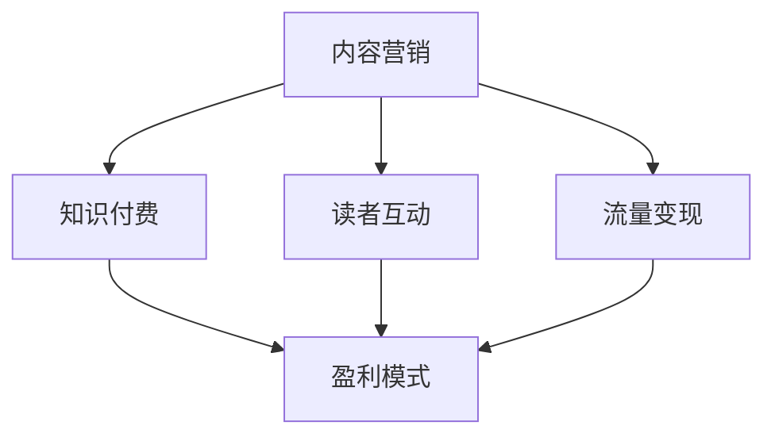

                 

关键词：技术博客，变现策略，内容营销，知识付费，读者互动，流量变现，盈利模式，社交媒体，广告投放

> 摘要：在当今数字化时代，技术博客已经成为知识传播和技能分享的重要平台。然而，如何通过技术博客实现变现并建立起稳定的收入来源，成为众多博主们关注的焦点。本文将探讨技术博客变现的策略与方法，帮助博主们找到适合自己的盈利模式，实现知识共享与财富积累的双重目标。

## 1. 背景介绍

随着互联网技术的飞速发展，博客成为了信息交流和个人品牌建设的重要工具。特别是在技术领域，博客以其专业性、深度和持续更新性，逐渐成为技术人才和爱好者获取知识、分享经验的主要渠道。然而，大部分博主在享受分享知识带来的满足感的同时，也希望能够通过博客实现一定的经济收益。

技术博客变现不仅能够为博主提供稳定的收入，还能够鼓励更多的人参与到技术分享和知识传播的行列中，形成良性循环。因此，如何有效地将技术博客转化为盈利模式，成为了广大博主们关注的课题。

## 2. 核心概念与联系

为了更好地理解技术博客变现的策略与方法，我们首先需要了解以下几个核心概念：

- **内容营销**：一种以创造和分享有价值的内容来吸引潜在客户，从而实现营销目标的方法。
- **知识付费**：用户为获取特定的知识和技能所支付的费用。
- **读者互动**：博主与读者之间的互动，包括评论、提问、分享等。
- **流量变现**：将博客的访问量转化为收入的过程。
- **盈利模式**：博客通过哪些方式实现盈利的结构和机制。

下面是一个简化的 Mermaid 流程图，展示这些核心概念之间的联系：



### 2.1 内容营销

内容营销是技术博客变现的基础。通过创造高质量的内容，博主可以吸引目标读者，增加博客的访问量。高质量的内容不仅能够提高读者的留存率，还能够增强读者对博主的信任，从而为后续的变现打下基础。

### 2.2 知识付费

知识付费是博客变现的一种直接方式。通过开设课程、推出电子书、提供咨询服务等，博主可以将自身积累的知识和经验转化为收入。这种模式的优势在于，博主可以直接从读者那里获取收益，同时也能够提供更加深入和专业的知识服务。

### 2.3 读者互动

读者互动是增强博主与读者之间联系的重要手段。通过回复评论、参与讨论、举办线上活动等，博主可以建立起与读者的紧密联系，提高读者的忠诚度。这种互动不仅能够增加博客的用户粘性，还能够为博主带来更多的流量和潜在收入。

### 2.4 流量变现

流量变现是将博客的访问量转化为收入的过程。通过广告投放、联盟营销、赞助等方式，博主可以将访问量转化为实际的收益。流量变现的关键在于吸引更多的访问者，提高访问量。

### 2.5 盈利模式

盈利模式是博客实现变现的结构和机制。不同的博主可以根据自己的实际情况，选择合适的盈利模式。常见的盈利模式包括内容付费、广告收入、联盟营销、赞助等。

## 3. 核心算法原理 & 具体操作步骤

### 3.1 算法原理概述

技术博客变现的核心算法原理可以归纳为以下几点：

1. **内容创作**：创作高质量、有价值的内容，吸引目标读者。
2. **流量获取**：通过各种渠道获取流量，提高博客的访问量。
3. **用户转化**：将流量转化为用户，增加用户粘性和忠诚度。
4. **变现途径**：选择合适的变现途径，将用户转化为收入。

### 3.2 算法步骤详解

1. **内容创作**：博主需要根据自己的专长和兴趣，创作高质量的内容。内容不仅要具有价值，还要能够吸引目标读者。例如，可以撰写技术教程、案例分析、行业洞察等。

2. **流量获取**：通过多种渠道获取流量，包括搜索引擎优化（SEO）、社交媒体推广、联盟营销等。博主需要根据自己的实际情况，选择合适的流量获取策略。

3. **用户转化**：通过互动、活动、优惠券等方式，将流量转化为用户。例如，可以举办线上讲座、研讨会，提供免费试用、优惠券等，吸引读者注册、购买服务。

4. **变现途径**：选择合适的变现途径，例如内容付费、广告收入、联盟营销、赞助等。博主需要根据自己的实际情况，选择最适合自己的变现模式。

### 3.3 算法优缺点

**优点**：

- **多样性**：技术博客变现的途径多样，博主可以根据自己的实际情况，选择最适合自己的模式。
- **可控性**：博主可以控制内容的创作和传播，提高变现的效率。
- **长期性**：技术博客是一种长期积累的过程，一旦建立起稳定的流量和用户基础，变现效果将会持续提升。

**缺点**：

- **竞争激烈**：技术博客领域竞争激烈，博主需要不断提高自己的专业水平，才能在激烈的市场中脱颖而出。
- **时间成本**：技术博客变现需要投入大量的时间和精力，博主需要平衡好创作与生活之间的关系。

### 3.4 算法应用领域

技术博客变现算法可以应用于多个领域，包括但不限于：

- **软件开发**：博主可以通过分享编程教程、代码实例等，吸引开发者读者，实现内容付费和广告收入。
- **网络安全**：博主可以通过撰写网络安全相关的文章，提供安全培训和咨询服务，实现知识付费。
- **数据分析**：博主可以通过分享数据分析教程、工具推荐等，吸引数据分析师读者，提供专业咨询服务。

## 4. 数学模型和公式 & 详细讲解 & 举例说明

### 4.1 数学模型构建

技术博客变现的数学模型可以简化为以下公式：

\[ 收入 = 访问量 \times 转化率 \times 单价 \]

其中：

- **访问量**：博客的日/月访问量。
- **转化率**：访问量中转化为用户的比例。
- **单价**：用户为获取内容所支付的费用。

### 4.2 公式推导过程

\[ 收入 = 访问量 \times 转化率 \times 单价 \]

- **访问量**：通过SEO、社交媒体推广等方式，增加博客的曝光度，提高访问量。
- **转化率**：提高内容质量，增强用户互动，提高用户留存率和忠诚度，从而提高转化率。
- **单价**：根据内容的价值和市场需求，设定合理的价格，以提高收入。

### 4.3 案例分析与讲解

假设一位博主，通过SEO和社交媒体推广，使其博客的日访问量达到1000人次。经过分析，博主的转化率为10%，单价为50元。根据上述公式，可以计算出该博主每日的收入为：

\[ 收入 = 1000 \times 0.1 \times 50 = 5000元 \]

通过不断优化内容和推广策略，博主可以进一步提高访问量和转化率，从而实现更高的收入。

## 5. 项目实践：代码实例和详细解释说明

### 5.1 开发环境搭建

为了实现技术博客的变现，博主需要搭建一个功能完善的博客系统。这里我们以使用WordPress为例，介绍开发环境的搭建。

1. **购买域名和虚拟主机**：在域名注册商购买一个合适的域名，并在虚拟主机提供商购买虚拟主机。
2. **安装WordPress**：在虚拟主机上安装WordPress，可以参考官方文档进行安装。
3. **选择主题和插件**：选择一个适合技术博客的主题，并安装一些必要的插件，如SEO优化插件、评论管理插件等。

### 5.2 源代码详细实现

以下是一个简单的WordPress主题源代码示例，展示了如何实现博客的基本功能：

```php
<?php
/*
Theme Name: Basic Tech Blog
Theme URI: https://example.com/basic-tech-blog
Description: A simple and clean theme for a technical blog.
Version: 1.0
Author: Your Name
Author URI: https://example.com
*/

function basic_tech_blog_scripts() {
    wp_enqueue_style('main-style', get_stylesheet_uri());
    wp_enqueue_script('main-script', get_template_directory_uri() . '/js/main.js', array(), '1.0', true);
}
add_action('wp_enqueue_scripts', 'basic_tech_blog_scripts');

function basic_tech_blog_menus() {
    register_nav_menu('primary-menu', 'Primary Menu');
}
add_action('init', 'basic_tech_blog_menus');

add_theme_support('title-tag');
add_theme_support('custom-logo');
add_theme_support('custom-background');
```

### 5.3 代码解读与分析

这段代码实现了一个基本的WordPress主题，包括以下功能：

1. **样式和脚本**：通过`wp_enqueue_style`和`wp_enqueue_script`函数，引入主题样式和脚本文件。
2. **导航菜单**：通过`register_nav_menu`函数，注册一个名为“Primary Menu”的导航菜单。
3. **主题支持**：通过`add_theme_support`函数，启用标题标签、自定义logo、自定义背景等主题功能。

### 5.4 运行结果展示

通过以上代码，我们创建了一个简单的技术博客网站。网站的顶部有一个导航菜单，左侧有一个自定义logo，页面背景可以根据需求进行自定义。

## 6. 实际应用场景

技术博客变现策略和方法可以应用于多个实际场景，以下是一些具体的应用案例：

1. **个人技术博客**：个人博主可以通过撰写技术文章、发布教程、提供咨询服务等方式实现变现。
2. **企业技术博客**：企业可以通过技术博客进行品牌宣传、产品推广、技术分享等，从而提高品牌知名度和用户粘性。
3. **教育培训机构**：教育培训机构可以通过技术博客提供在线课程、讲座、培训等服务，吸引学员报名。

### 6.4 未来应用展望

随着互联网技术的不断进步，技术博客变现将呈现出以下发展趋势：

1. **个性化内容**：博主将更加注重内容的个性化，满足不同读者的需求。
2. **多元化变现**：博主将尝试多种变现途径，实现多元化的收入来源。
3. **智能推荐**：利用人工智能技术，为读者推荐更相关的内容，提高用户体验和转化率。

## 7. 工具和资源推荐

为了更好地实现技术博客变现，博主可以参考以下工具和资源：

1. **学习资源推荐**：
   - 《内容营销实战》
   - 《SEO实战密码》
   - 《社交媒体营销实战》

2. **开发工具推荐**：
   - WordPress
   - SEO优化工具（如SEMrush、Ahrefs）
   - 社交媒体管理工具（如Hootsuite、Buffer）

3. **相关论文推荐**：
   - “内容营销：策略与实践”
   - “社交媒体营销：现状与趋势”
   - “SEO技术：原理与应用”

## 8. 总结：未来发展趋势与挑战

### 8.1 研究成果总结

通过本文的探讨，我们可以得出以下结论：

- 技术博客变现需要基于内容营销、知识付费、读者互动等核心概念。
- 通过有效的算法设计和数学模型构建，可以实现博客的稳定变现。
- 技术博客变现的应用场景广泛，涵盖个人、企业和教育培训等多个领域。

### 8.2 未来发展趋势

未来，技术博客变现将呈现出以下趋势：

- 内容个性化：博主将更加注重内容的个性化，满足不同读者的需求。
- 多元化变现：博主将尝试多种变现途径，实现多元化的收入来源。
- 智能化推荐：利用人工智能技术，为读者推荐更相关的内容，提高用户体验和转化率。

### 8.3 面临的挑战

技术博客变现也面临以下挑战：

- 竞争激烈：技术博客领域竞争激烈，博主需要不断提高自己的专业水平。
- 时间成本：技术博客变现需要投入大量的时间和精力，博主需要平衡好创作与生活之间的关系。
- 数据隐私：博主需要遵守相关法律法规，保护用户的隐私和数据安全。

### 8.4 研究展望

未来，技术博客变现研究可以从以下几个方面进行深入探讨：

- 内容创作策略：如何通过更高效的创作策略，提高内容的价值和吸引力。
- 用户行为分析：如何通过用户行为分析，提高用户的留存率和转化率。
- 智能化变现：如何利用人工智能技术，实现更智能、更高效的变现模式。

## 9. 附录：常见问题与解答

### 9.1 技术博客如何吸引流量？

- **SEO优化**：通过优化网站结构、关键词密度、外链建设等，提高搜索引擎排名。
- **社交媒体推广**：通过在社交媒体上分享内容、互动，吸引更多的关注和流量。
- **内容合作**：与其他博主或媒体进行内容合作，扩大影响力。

### 9.2 如何选择合适的盈利模式？

- **了解读者需求**：通过调查问卷、读者反馈等方式，了解读者的需求和偏好。
- **分析行业趋势**：研究同行业博主的盈利模式，选择适合自己的模式。
- **平衡收益与成本**：选择能够带来稳定收益，同时成本较低的模式。

### 9.3 如何提高用户转化率？

- **优质内容**：创作高质量、有价值的内容，满足用户需求。
- **互动机制**：通过评论、问答、投票等方式，增强用户参与感。
- **优惠活动**：提供优惠券、限时折扣等，吸引用户购买。

作者：禅与计算机程序设计艺术 / Zen and the Art of Computer Programming
----------------------------------------------------------------
本文通过详细探讨技术博客变现的策略与方法，为博主们提供了一套系统化的变现方案。从内容创作、流量获取、用户转化到盈利模式的选择，每个环节都至关重要。通过不断优化内容和策略，博主们可以实现知识共享与财富积累的双重目标。未来，随着技术的不断进步，技术博客变现将迎来更多的发展机遇和挑战。博主们需要持续学习和创新，以应对不断变化的市场环境。让我们携手共进，共同开启技术博客变现的新篇章。

