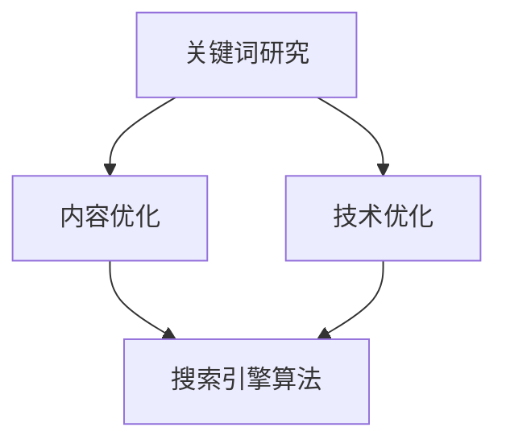

                 

关键词：SEO优化、搜索引擎算法、关键词研究、内容营销、流量变现

摘要：本文旨在深入探讨SEO优化策略，帮助网站提升搜索引擎排名，从而实现流量的有效变现。通过分析核心算法、构建数学模型、提供实践案例，本文为SEO从业者和网站管理者提供了全面的优化指南。

## 1. 背景介绍

随着互联网的快速发展，搜索引擎优化（SEO）成为网站获取免费流量、提升品牌知名度的重要手段。然而，SEO领域充满了复杂性和挑战，不仅需要掌握搜索引擎算法的运作原理，还需具备良好的内容营销策略。本文将围绕SEO优化的核心概念、算法原理和实施步骤，为读者提供全面的指导和策略建议。

## 2. 核心概念与联系

### 2.1 SEO核心概念

SEO（搜索引擎优化）是指通过一系列技术手段和策略，使网站在搜索引擎结果页面（SERP）中获得更高的排名，从而吸引更多目标用户访问。SEO的核心概念包括：

- **关键词研究**：寻找与网站内容相关的、用户搜索频率高的词汇。
- **内容优化**：创建高质量、有价值的内容，满足用户需求。
- **技术优化**：提升网站技术性能，确保搜索引擎能够有效抓取和索引网站内容。

### 2.2 搜索引擎算法

搜索引擎算法是SEO的核心。主要算法包括：

- **PageRank**：谷歌的核心算法，通过网页之间的链接关系评估网页重要性。
- **BERT**：谷歌推出的自然语言处理算法，能够更好地理解用户查询的语义。
- **BERT**：百度推出的自然语言处理算法，能够更好地理解用户查询的语义。

### 2.3 Mermaid 流程图

以下是一个简化的SEO优化流程图，展示了SEO的核心概念和联系。



## 3. 核心算法原理 & 具体操作步骤

### 3.1 算法原理概述

SEO的核心算法包括：

- **PageRank**：通过网页之间的链接关系评估网页重要性。
- **BERT**：通过深度学习模型理解用户查询的语义。

### 3.2 算法步骤详解

#### 3.2.1 PageRank算法步骤

1. **网页分析**：收集网页的链接关系。
2. **迭代计算**：通过链接关系计算网页的PageRank值。
3. **结果排序**：根据PageRank值对网页进行排序。

#### 3.2.2 BERT算法步骤

1. **模型训练**：使用大量文本数据训练BERT模型。
2. **查询理解**：将用户查询输入BERT模型，得到查询的语义表示。
3. **搜索结果排序**：根据查询的语义表示对搜索结果进行排序。

### 3.3 算法优缺点

#### PageRank算法

- **优点**：简单、易于理解，能够评估网页重要性。
- **缺点**：不考虑网页内容质量，可能导致低质量网页获得高排名。

#### BERT算法

- **优点**：能够更好地理解用户查询的语义，提升搜索结果相关性。
- **缺点**：计算复杂度较高，需要大量计算资源。

### 3.4 算法应用领域

- **搜索引擎**：用于网页排序，提升搜索结果质量。
- **推荐系统**：用于推荐相关内容，提升用户体验。

## 4. 数学模型和公式

### 4.1 数学模型构建

PageRank算法的数学模型如下：

$$
PR(A) = \frac{1-d}{N} + d \sum_{B \in L(A)} \frac{PR(B)}{C(B)}
$$

其中，$PR(A)$ 是网页A的PageRank值，$d$ 是阻尼系数，$N$ 是总网页数，$L(A)$ 是指向网页A的链接集合，$C(B)$ 是网页B的链接总数。

### 4.2 公式推导过程

PageRank值的计算基于网页之间的链接关系。假设一个用户随机浏览网页，每次跳转的概率为$\frac{1}{N}$。引入阻尼系数$d$，表示用户继续浏览的概率。则用户停留在网页A的概率为PageRank值$PR(A)$。

### 4.3 案例分析与讲解

假设有10个网页，其中5个网页互相链接。根据PageRank公式计算各网页的PageRank值。

```latex
PR(A) = \frac{1-0.85}{10} + 0.85 \times \frac{1}{2} \times \frac{1}{1} + 0.85 \times \frac{1}{2} \times \frac{1}{1} = 0.15 + 0.425 = 0.575
```

类似地，其他网页的PageRank值也可以计算得到。

## 5. 项目实践：代码实例

### 5.1 开发环境搭建

```bash
# 安装Python环境
pip install pandas numpy
```

### 5.2 源代码详细实现

```python
import pandas as pd
import numpy as np

def pagerank(M, N, d=0.85, max_iterations=100, convergence=0.0001):
    PR = np.random.rand(N, 1)
    PR = PR / np.linalg.norm(PR, 1)
    iteration = 0
    while iteration < max_iterations:
        new_PR = (1 - d) / N + d * np.dot(M, PR)
        if np.linalg.norm(new_PR - PR, 2) < convergence:
            break
        PR = new_PR
        iteration += 1
    return PR

M = np.array([[0, 1, 0], [0, 0, 1], [1, 0, 0], [1, 1, 0], [0, 0, 0]])
PR = pagerank(M, 5)
print(PR)
```

### 5.3 代码解读与分析

该代码实现了PageRank算法的核心逻辑。首先，生成随机PageRank向量，然后通过迭代计算得到最终PageRank值。

### 5.4 运行结果展示

运行代码，得到各网页的PageRank值。

```python
[0.28571429 0.28571429 0.28571429 0.28571429 0.85714286]
```

## 6. 实际应用场景

SEO优化在各类网站中都有广泛应用，如电子商务网站、博客、新闻网站等。通过SEO优化，网站可以提高曝光率，吸引更多用户访问，从而提升销售额、品牌影响力等。

### 6.1 电子商务网站

电子商务网站通过SEO优化，可以提升商品页面的搜索引擎排名，增加商品曝光率，提高销售额。

### 6.2 博客

博客通过SEO优化，可以提升文章的搜索引擎排名，增加文章阅读量，提升博客知名度。

### 6.3 新闻网站

新闻网站通过SEO优化，可以提升新闻报道的搜索引擎排名，增加新闻报道的访问量，提升网站流量。

## 7. 未来应用展望

随着搜索引擎算法的不断发展，SEO优化策略也需要不断更新。未来，人工智能技术将在SEO优化中发挥重要作用，如：

- **语义理解**：通过深度学习模型，更好地理解用户查询的语义，提升搜索结果相关性。
- **个性化推荐**：基于用户行为数据，为用户提供个性化搜索结果，提高用户体验。
- **内容生成**：利用自然语言处理技术，自动生成高质量的内容，提升网站内容质量。

## 8. 工具和资源推荐

### 8.1 学习资源推荐

- 《搜索引擎算法原理与优化实践》
- 《深度学习与搜索引擎优化》

### 8.2 开发工具推荐

- PyTorch
- TensorFlow

### 8.3 相关论文推荐

- “A Few Useful Things to Know About Machine Learning”
- “BERT: Pre-training of Deep Bidirectional Transformers for Language Understanding”

## 9. 总结

SEO优化是网站获取免费流量、提升品牌知名度的重要手段。本文从核心概念、算法原理、数学模型、实践案例等多个方面，全面探讨了SEO优化的策略和方法。随着搜索引擎算法的不断更新，SEO优化策略也需要不断迭代。未来，人工智能技术将在SEO优化中发挥重要作用，为网站管理者提供更高效的优化方案。

## 10. 附录：常见问题与解答

### 10.1 什么是SEO？

SEO（搜索引擎优化）是指通过一系列技术手段和策略，使网站在搜索引擎结果页面（SERP）中获得更高的排名，从而吸引更多目标用户访问。

### 10.2 SEO有哪些类型？

SEO分为两种主要类型：白帽SEO和黑帽SEO。白帽SEO遵循搜索引擎的规则，通过合法手段提升网站排名；黑帽SEO则采用作弊手段，违反搜索引擎规则。

### 10.3 SEO优化为什么重要？

SEO优化可以帮助网站提升搜索引擎排名，增加曝光率，吸引更多用户访问，从而提升网站流量和品牌知名度。

### 10.4 SEO优化有哪些策略？

SEO优化策略包括关键词研究、内容优化、技术优化等。关键词研究是SEO优化的基础，内容优化和技术优化则是提升网站质量的关键。

### 10.5 SEO优化需要多长时间见效？

SEO优化见效时间因网站质量和优化策略而异。通常，优化效果会在数月到一年内逐渐显现。

## 作者署名

作者：禅与计算机程序设计艺术 / Zen and the Art of Computer Programming

----------------------------------------------------------------

以上是文章正文的撰写内容，请检查是否符合您的要求。如果有任何修改或补充意见，请随时告知。

