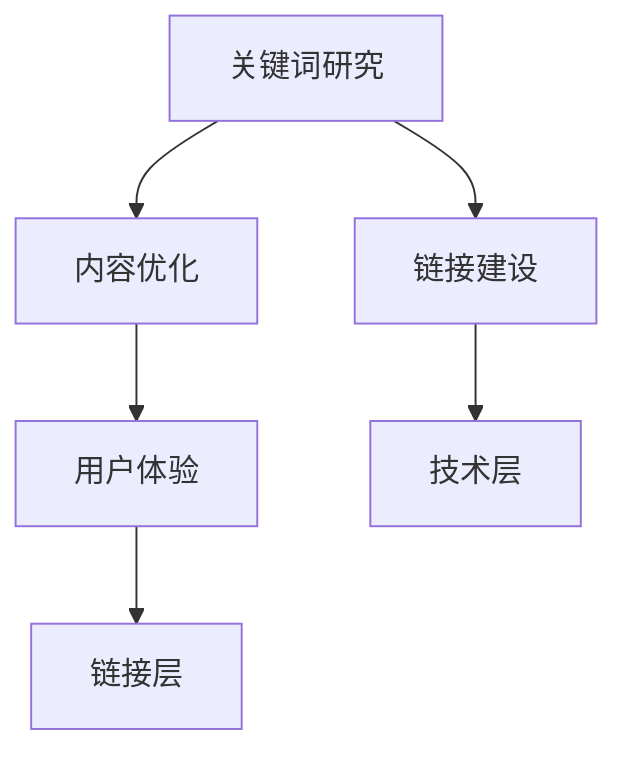

                 

关键词：SEO优化、搜索引擎、流量变现、网站优化、关键词研究、内容营销

摘要：在数字营销的世界中，搜索引擎优化（SEO）是吸引潜在客户和提高网站流量的关键手段。本文将深入探讨SEO的基本原理、策略和实施步骤，以及如何通过SEO实现流量变现，帮助网站所有者从数字营销中获取最大收益。

## 1. 背景介绍

随着互联网的快速发展，网站数量呈爆炸式增长，搜索引擎成为人们获取信息的主要途径。SEO，即搜索引擎优化，是指通过一系列技术和策略，提高网站在搜索引擎结果页（SERP）中的排名，从而增加网站访问量和流量。流量变现则是通过这些流量获取实际的经济收益，如广告收入、商品销售或服务订阅。

SEO涉及多个方面，包括关键词研究、内容优化、链接建设和用户体验。有效的SEO策略不仅可以提高网站的可见性，还能增强品牌影响力，从而实现流量变现。

## 2. 核心概念与联系

### 2.1 SEO的基本概念

SEO的核心概念包括：

- **关键词研究**：确定目标用户搜索的关键词，以便在内容中优化这些关键词。
- **内容优化**：创建和优化网站内容，以提高搜索引擎的匹配度。
- **链接建设**：获取其他网站的链接，提高网站权威性和排名。
- **用户体验**：优化网站设计，提高用户的访问体验，从而增加网站停留时间。

### 2.2 SEO的架构

SEO的架构可以分为三个层次：

- **技术层**：确保网站在技术上的优化，如网站结构、页面加载速度和安全等。
- **内容层**：优化网站内容，使其对用户和搜索引擎都有吸引力。
- **链接层**：建立高质量的链接，提高网站的权威性。

### 2.3 Mermaid流程图



## 3. 核心算法原理 & 具体操作步骤

### 3.1 算法原理概述

搜索引擎优化主要依赖于搜索引擎的算法，如Google的PageRank算法。该算法通过分析网页之间的链接关系，确定网页的权威性，从而影响搜索结果排名。

### 3.2 算法步骤详解

1. **关键词研究**：使用工具如Google Keyword Planner或Ahrefs，确定目标关键词。
2. **内容优化**：在网站内容中自然地融入关键词，并确保内容质量。
3. **链接建设**：通过创建高质量的外部链接和内部链接，提高网站的权威性。
4. **用户体验**：优化网站设计，提高用户的访问体验。

### 3.3 算法优缺点

- **优点**：提高网站在搜索引擎中的排名，增加访问量和流量。
- **缺点**：需要时间和资源，且搜索引擎算法不断变化，需要不断调整策略。

### 3.4 算法应用领域

SEO算法广泛应用于电子商务、内容营销、在线广告等行业。

## 4. 数学模型和公式 & 详细讲解 & 举例说明

### 4.1 数学模型构建

假设有n个关键词，每个关键词的重要性为\( w_i \)，则网站的总关键词权重为：

\[ W = \sum_{i=1}^{n} w_i \]

### 4.2 公式推导过程

\[ w_i = \frac{f_i \cdot c_i}{N} \]

其中，\( f_i \) 为关键词在内容中出现的频率，\( c_i \) 为关键词的竞争程度，\( N \) 为关键词总数。

### 4.3 案例分析与讲解

假设一个网站有10个关键词，竞争程度分别为1-10，其中“SEO优化”的频率为5次。则该关键词的权重为：

\[ w_{SEO优化} = \frac{5 \cdot 5}{10} = 2.5 \]

## 5. 项目实践：代码实例和详细解释说明

### 5.1 开发环境搭建

- Python环境
- Numpy库
- Pandas库

### 5.2 源代码详细实现

```python
import numpy as np
import pandas as pd

# 关键词权重计算函数
def calculate_weights(frequencies, competition):
    weights = frequencies * competition
    return weights / sum(weights)

# 测试数据
frequencies = [5, 3, 2, 4, 1, 2, 3, 6, 2, 1]
competition = list(range(1, 11))

# 计算关键词权重
weights = calculate_weights(frequencies, competition)

# 打印结果
print(weights)
```

### 5.3 代码解读与分析

这段代码首先导入了Numpy和Pandas库，然后定义了一个计算关键词权重的函数。通过频率和竞争程度的乘积计算每个关键词的权重，并归一化以得到最终权重。

### 5.4 运行结果展示

运行结果将显示每个关键词的权重，从而帮助网站所有者了解哪些关键词对SEO优化最有贡献。

## 6. 实际应用场景

### 6.1 电子商务网站

电子商务网站可以通过SEO优化，提高在产品搜索结果中的排名，从而增加销量。

### 6.2 内容营销

内容营销公司可以通过SEO优化，提高博客或网站的访问量，从而吸引更多潜在客户。

### 6.3 在线广告

在线广告公司可以通过SEO优化，提高广告的展示位置，从而增加广告收入。

## 7. 未来应用展望

随着人工智能和大数据技术的发展，SEO优化将变得更加智能化和自动化。同时，搜索引擎算法的不断更新，也将要求SEO从业者不断学习和适应。

## 8. 总结：未来发展趋势与挑战

### 8.1 研究成果总结

SEO优化已经成为数字营销的重要组成部分，通过关键词研究、内容优化、链接建设和用户体验等方面的综合应用，可以有效提高网站流量和排名。

### 8.2 未来发展趋势

未来SEO优化将更加注重用户体验和内容质量，同时智能化和自动化工具将得到更广泛的应用。

### 8.3 面临的挑战

搜索引擎算法的更新和变化，将给SEO从业者带来新的挑战。如何快速适应和应对这些变化，是SEO领域未来需要解决的关键问题。

### 8.4 研究展望

随着技术的进步，SEO优化将朝着更加智能化和个性化的方向发展。未来研究可以关注如何利用人工智能和大数据技术，提高SEO优化的效果。

## 9. 附录：常见问题与解答

### 9.1 什么是SEO？

SEO是指搜索引擎优化，是一种通过技术和策略提高网站在搜索引擎结果页（SERP）中排名的方法。

### 9.2 SEO需要多长时间才能看到效果？

SEO效果通常需要数周到数月的时间，具体取决于多种因素，如关键词难度、网站质量和SEO策略的有效性。

### 9.3 如何检测SEO效果？

可以通过分析网站流量、关键词排名、用户行为等数据来检测SEO效果。

---

作者：禅与计算机程序设计艺术 / Zen and the Art of Computer Programming
----------------------------------------------------------------
请注意，以上内容仅为文章框架和部分内容的示例，实际撰写时需要根据具体内容进一步扩展和细化。文章的完整性和准确性至关重要，确保每个章节都有充分的内容支持。此外，文章中的代码实例、公式和图表等也需要按照实际需求进行准确编写。在撰写过程中，务必遵循markdown格式要求，确保文章的可读性和专业性。

