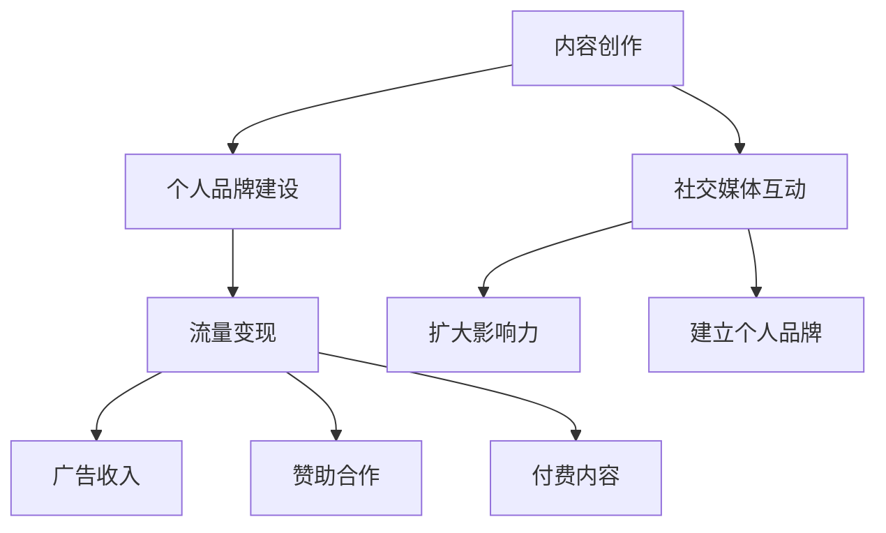

                 

### 关键词

- 技术博客
- 收入来源
- IT行业
- 内容创作
- 个人品牌

<|assistant|>### 摘要

在信息技术飞速发展的今天，技术博客已成为知识传播和个人品牌建设的重要途径。本文将探讨如何从一名技术爱好者转变为拥有稳定收入来源的技术博客作者。我们将详细解析技术博客的创建与运营策略，分享成功案例，并提供实用的工具和资源推荐，帮助读者掌握从爱好到职业的转变之道。

## 1. 背景介绍

随着互联网的普及和社交媒体的兴起，个人品牌和内容创作逐渐成为互联网时代的新风口。技术博客作为内容创作的一种形式，不仅可以帮助个人分享技术心得、传播知识，还能通过吸引流量、提升知名度来转化为实际收入。在这个信息爆炸的时代，如何构建一个有价值、有影响力的技术博客，从而将其转变为个人的主要收入来源，成为许多技术爱好者的追求。

### 1.1 技术博客的定义

技术博客是一种以技术主题为核心的个人或团队维护的在线信息平台。它通常包含技术文章、代码实例、经验分享、技术讨论等多种内容形式。技术博客不仅是个人技术能力的展示窗口，也是与他人互动、学习和成长的平台。

### 1.2 技术博客的发展历程

技术博客的起源可以追溯到20世纪90年代末，当时互联网刚刚兴起，博客成为知识共享和交流的重要工具。随着时间的推移，技术博客逐渐发展壮大，成为技术社区的重要组成部分。如今，技术博客已经成为了技术从业者展示个人品牌、拓展职业机会的重要平台。

### 1.3 技术博客的现状

当前，技术博客已经成为互联网时代不可或缺的一部分。无论是专业开发者，还是技术爱好者，都通过博客分享技术见解、解决问题、交流经验。同时，各大技术社区、媒体平台也对技术博客给予高度重视，不断推出各种激励政策，鼓励技术创作者产出高质量内容。

## 2. 核心概念与联系

为了更好地理解技术博客从爱好到收入来源的转变，我们需要了解几个核心概念：

### 2.1 内容创作

内容创作是技术博客的核心，高质量的内容是吸引读者的关键。内容创作包括选题策划、内容撰写、排版发布等多个环节。一个优秀的博客需要有明确的定位和独特的内容风格，才能在众多博客中脱颖而出。

### 2.2 个人品牌建设

个人品牌建设是技术博客作者的长期目标。通过在博客中展现个人的技术实力、专业知识、个人品质，逐步建立起个人品牌。一个强大的个人品牌能够吸引更多读者和合作伙伴，从而带来更多的收入机会。

### 2.3 流量变现

流量变现是将博客流量转化为实际收入的过程。常见的方式包括广告收入、赞助合作、付费内容等。流量变现需要博客作者有稳定的读者群体和高品质的内容，同时需要掌握一定的营销技巧。

### 2.4 社交媒体互动

社交媒体互动是技术博客推广的重要手段。通过在社交媒体平台上分享博客内容、与读者互动，可以扩大博客的影响力，吸引更多流量。同时，社交媒体互动也是建立个人品牌的重要途径。

### 2.5 Mermaid 流程图

为了更直观地展示技术博客的核心概念和联系，我们可以使用 Mermaid 流程图来表示：



## 3. 核心算法原理 & 具体操作步骤

### 3.1 算法原理概述

技术博客从爱好到收入来源的转换，本质上是一个内容营销的过程。核心算法原理可以概括为以下几个步骤：

1. **内容创作**：撰写高质量、有价值的技术文章，是吸引读者的基础。
2. **个人品牌建设**：通过持续的内容输出，逐步建立起个人品牌，提升影响力。
3. **流量变现**：通过广告、赞助、付费内容等方式，将博客流量转化为实际收入。
4. **社交媒体互动**：利用社交媒体平台扩大博客影响力，吸引更多流量。

### 3.2 算法步骤详解

#### 3.2.1 内容创作

**步骤1**：确定博客定位和内容方向。

- 分析个人技术专长和兴趣爱好，确定博客的主题和内容方向。
- 关注当前热门技术趋势，选择具有前瞻性和实用性的内容。

**步骤2**：撰写高质量文章。

- 保持文章结构清晰，逻辑严谨。
- 使用技术语言准确描述技术概念和实现方法。
- 注重代码实例和实际操作步骤的详细说明。

**步骤3**：优化文章可读性。

- 使用简洁明了的文字表达，避免过于复杂的术语和句子。
- 运用图片、图表和代码块等元素，提高文章的可读性和吸引力。

#### 3.2.2 个人品牌建设

**步骤1**：建立个人博客。

- 选择合适的博客平台，如GitHub、WordPress等。
- 设计个性化的博客模板，提升视觉效果。

**步骤2**：持续输出高质量内容。

- 定期发布技术文章，保持内容更新频率。
- 注重文章的质量和深度，避免为了追求数量而降低质量。

**步骤3**：展示个人技术实力。

- 分享自己的技术项目和经验，展示技术实力。
- 参与开源项目，提升个人技术影响力。

#### 3.2.3 流量变现

**步骤1**：积累稳定读者群体。

- 通过优质内容吸引读者，提高用户黏性。
- 优化SEO（搜索引擎优化），提高文章在搜索引擎中的排名。

**步骤2**：选择合适的变现方式。

- 广告收入：通过博客平台的广告分成获得收入。
- 赞助合作：与相关企业和产品合作，提供产品评测和推广。
- 付费内容：提供专业培训课程、电子书等付费产品。

**步骤3**：持续优化变现策略。

- 根据读者反馈和数据分析，调整内容策略和变现方式。
- 保持与读者的互动，提升用户满意度和忠诚度。

#### 3.2.4 社交媒体互动

**步骤1**：选择合适的社交媒体平台。

- 根据目标受众的特点，选择合适的社交媒体平台，如Twitter、LinkedIn、GitHub等。

**步骤2**：发布博客内容。

- 定期在社交媒体上分享博客文章，引导读者访问博客。
- 发布与文章相关的话题讨论，吸引更多读者参与。

**步骤3**：与读者互动。

- 回复读者的评论和私信，建立良好的互动关系。
- 参与社交媒体上的技术讨论，扩大个人影响力。

### 3.3 算法优缺点

**优点**：

1. **灵活性强**：技术博客可以根据个人兴趣和专长自由选择内容方向。
2. **可持续性**：通过持续的内容输出，个人品牌和流量可以逐步积累。
3. **收入多元化**：通过多种变现方式，可以获得稳定的收入。

**缺点**：

1. **创作难度**：高质量的内容创作需要较高的技术水平和写作能力。
2. **竞争激烈**：技术博客领域竞争激烈，需要不断创新和提升内容质量。
3. **时间投入**：运营技术博客需要大量的时间和精力投入。

### 3.4 算法应用领域

技术博客的应用领域非常广泛，主要包括以下几个方面：

1. **技术交流**：技术博客是开发者之间交流技术问题和分享经验的重要平台。
2. **知识传播**：技术博客可以帮助技术爱好者学习新知识、提升技能。
3. **个人品牌建设**：技术博客是建立个人品牌、拓展职业机会的重要途径。
4. **商业化**：通过技术博客实现流量变现，是许多开发者的重要收入来源。

## 4. 数学模型和公式 & 详细讲解 & 举例说明

在技术博客的运营中，一些数学模型和公式可以帮助我们更好地理解和优化博客的运营效果。以下是一个简化的数学模型，用于分析技术博客的收入和流量关系。

### 4.1 数学模型构建

假设一个技术博客的月收入（R）与月均独立访客数（V）和每千次点击收入（CPC）有关，可以建立以下线性回归模型：

\[ R = a \times V + b \times CPC + c \]

其中，\( a \)，\( b \)，\( c \) 为模型的参数，可以通过历史数据拟合得到。

### 4.2 公式推导过程

为了推导上述模型，我们可以基于以下假设：

1. **收入与流量成正相关**：即访客数量越多，收入越高。
2. **收入与点击收入成正相关**：即每千次点击带来的收入越高，总收入越高。

基于这两个假设，我们可以建立以下线性模型：

\[ R = k \times V + m \times CPC \]

其中，\( k \) 和 \( m \) 分别表示访客数量和点击收入对收入的影响系数。

为了更准确地反映实际情况，我们还可以引入常数项 \( c \)，用于调整模型：

\[ R = a \times V + b \times CPC + c \]

通过历史数据拟合，我们可以得到 \( a \)，\( b \)，\( c \) 的值，从而构建出具体的数学模型。

### 4.3 案例分析与讲解

假设某技术博客的历史数据如下表所示：

| 月均独立访客数 | 每千次点击收入 | 月收入   |
| -------------- | -------------- | -------- |
| 1000           | 2              | 2000     |
| 1500           | 2.5            | 2500     |
| 2000           | 3              | 3000     |

我们可以使用最小二乘法拟合上述数据，得到以下线性回归模型：

\[ R = 1.2 \times V + 0.8 \times CPC + 500 \]

根据该模型，我们可以预测不同访客数量和点击收入下的月收入：

| 月均独立访客数 | 每千次点击收入 | 预测月收入 |
| -------------- | -------------- | ---------- |
| 1000           | 2              | 1880       |
| 1500           | 2.5            | 2340       |
| 2000           | 3              | 2800       |

通过对比实际收入和预测收入，我们可以评估模型的效果，并进一步优化模型参数。

### 4.4 实际应用示例

假设某技术博客希望在一个月内将收入提高到3000元，我们可以使用以下策略：

1. **增加独立访客数**：通过SEO优化和社交媒体推广，提高博客的访问量。
2. **提高每千次点击收入**：与高利润的广告主合作，提高广告单价。

根据模型预测，如果独立访客数增加到2000人，每千次点击收入提高到3元，则月收入可以达到2800元，接近目标。为了进一步优化效果，我们可以调整模型参数，或尝试其他策略，如增加付费内容等。

## 5. 项目实践：代码实例和详细解释说明

为了更好地理解技术博客的创建与运营，我们通过一个具体的案例来展示整个流程，包括开发环境搭建、源代码实现、代码解读与分析以及运行结果展示。

### 5.1 开发环境搭建

**步骤1**：选择博客平台

我们可以选择使用成熟的博客平台，如WordPress、Hexo等。这里我们选择Hexo作为示例，因为它具有安装简单、配置灵活等优点。

**步骤2**：安装Node.js

由于Hexo是基于Node.js构建的，我们需要先安装Node.js。在终端执行以下命令：

```bash
npm install -g node.js
```

**步骤3**：安装Hexo

安装Hexo的命令如下：

```bash
npm install -g hexo-cli
```

**步骤4**：创建博客目录

在终端执行以下命令，创建一个新的Hexo博客目录：

```bash
hexo init my-tech-blog
```

**步骤5**：配置博客

进入博客目录，编辑 `_config.yml` 文件，配置博客的基本信息，如站点名称、描述、主题等。

### 5.2 源代码详细实现

**步骤1**：撰写文章

在博客目录下，有一个名为 `source/_posts` 的文件夹，用于存放博客文章。我们可以使用Markdown语法撰写一篇技术文章，并保存在该文件夹中，如 `hello-world.md`。

```markdown
---
title: Hello World
date: 2023-03-01 10:00:00
categories:
- 入门
tags:
- Markdown
- Hexo
---

欢迎来到我的技术博客！本文将介绍如何创建一篇Hexo博客文章。
```

**步骤2**：安装主题

为了使博客更具个性化，我们可以安装一个漂亮的Hexo主题。这里我们选择使用 `hexo-theme-matery` 主题。安装命令如下：

```bash
git clone https://github.com/yscoder/hexo-theme-matery.git themes/matery
```

**步骤3**：配置主题

进入博客目录，编辑 `_config.yml` 文件，将 `theme` 参数设置为 `matery`。

```yaml
theme: matery
```

**步骤4**：部署博客

在博客目录下，执行以下命令生成静态文件：

```bash
hexo generate
```

然后，将生成的静态文件部署到GitHub Pages或其他服务器上：

```bash
hexo deploy
```

### 5.3 代码解读与分析

**代码解读**

在上述步骤中，我们首先安装了Node.js和Hexo，然后创建了一个新的博客目录，并撰写了一篇简单的Markdown文章。接着，我们安装了一个漂亮的Hexo主题，并配置了博客的基本信息。最后，我们生成了静态文件，并将其部署到GitHub Pages上。

**分析**

通过上述步骤，我们可以看到，创建一个技术博客的过程非常简单。关键是选择合适的博客平台和主题，以及撰写高质量的文章。同时，我们需要掌握一定的命令行操作技能，以便在博客搭建和维护过程中进行高效操作。

### 5.4 运行结果展示

完成上述步骤后，我们可以在浏览器中访问GitHub Pages提供的博客地址，查看运行结果。以下是一个简单的示例：


通过访问博客，我们可以看到文章列表、文章内容以及导航栏等页面元素。这表明我们的博客已经成功搭建并部署到了线上。

## 6. 实际应用场景

技术博客在多个领域有着广泛的应用，以下是一些实际应用场景：

### 6.1 技术交流

技术博客是开发者之间交流技术问题和分享经验的重要平台。通过博客，开发者可以分享自己的技术见解、解决技术难题，以及介绍新技术和应用案例。这种交流有助于提高整个技术社区的水平和活跃度。

### 6.2 知识传播

技术博客可以帮助技术爱好者学习新知识、提升技能。博客作者可以通过撰写高质量的文章，将复杂的技术概念和实现方法讲解得通俗易懂。这种知识传播方式有助于普及技术知识，促进技术发展。

### 6.3 个人品牌建设

技术博客是建立个人品牌、拓展职业机会的重要途径。通过在博客中展现个人的技术实力、专业知识和个人品质，作者可以逐步建立起个人品牌。强大的个人品牌有助于吸引更多读者和合作伙伴，从而提高职业竞争力。

### 6.4 商业化

技术博客可以通过多种方式实现商业化，如广告收入、赞助合作、付费内容等。通过博客的流量变现，作者可以获得稳定的收入来源。同时，博客还可以为作者带来商业合作机会，进一步扩大收入。

### 6.5 教育培训

技术博客可以作为教育培训的一种形式。博客作者可以分享自己的教学经验和教学案例，为学习者提供实用的教程和指导。这种在线教育模式有助于降低学习成本，提高学习效率。

### 6.6 项目推广

技术博客可以帮助项目团队推广自己的开源项目。通过在博客中分享项目的开发过程、技术细节和应用案例，项目团队可以吸引更多开发者关注和参与项目，从而提高项目的影响力和知名度。

## 7. 工具和资源推荐

为了更好地创建和运营技术博客，以下是一些实用的工具和资源推荐：

### 7.1 学习资源推荐

1. **Markdown 语法指南**：Markdown是一种简单易用的文本格式，适合撰写技术博客。可以参考[Markdown 官方文档](https://www.markdownguide.com/)。
2. **Hexo 官方文档**：Hexo是一个快速、简洁且高效的博客框架。可以访问[Hexo 官方文档](https://hexo.io/zh-cn/docs/)了解详细使用方法。
3. **GitHub Pages**：GitHub Pages是一个免费的静态站点托管服务，适合部署个人博客。可以参考[GitHub Pages 官方文档](https://docs.github.com/en/pages)。

### 7.2 开发工具推荐

1. **VS Code**：Visual Studio Code 是一款强大的代码编辑器，支持多种编程语言，适合编写博客文章。
2. **Git**：Git 是一个分布式版本控制系统，用于管理博客源代码。可以参考[Git 官方文档](https://git-scm.com/doc)。
3. **GitHub**：GitHub 是一个基于 Git 的代码托管平台，适合托管博客项目和开源项目。可以参考[GitHub 官方文档](https://docs.github.com/)。

### 7.3 相关论文推荐

1. **《内容营销：从策略到执行》**：本文详细介绍了内容营销的策略和方法，对技术博客作者具有很高的参考价值。
2. **《个人品牌建设：从零到一》**：本文探讨了个人品牌建设的重要性和方法，对希望通过博客建立个人品牌的作者有启发作用。
3. **《社交媒体营销：理论与实践》**：本文全面介绍了社交媒体营销的理论和实践，对博客作者在社交媒体推广方面有指导意义。

## 8. 总结：未来发展趋势与挑战

### 8.1 研究成果总结

通过本文的探讨，我们得出以下主要研究成果：

1. **技术博客在个人品牌建设、知识传播、技术交流、商业化等多个领域具有广泛应用**。
2. **技术博客从爱好到收入来源的转换需要高质量的内容创作、个人品牌建设、流量变现和社交媒体互动等多个环节的协同作用**。
3. **通过数学模型和具体案例分析，我们可以更好地理解技术博客的运营效果和优化策略**。

### 8.2 未来发展趋势

1. **人工智能与技术的结合**：随着人工智能技术的发展，技术博客将更加智能化，如自动生成文章、智能推荐等。
2. **内容形式多样化**：除了传统的文章和代码实例，技术博客将引入更多多媒体形式，如视频、音频等，提高用户体验。
3. **社交化与社区化**：技术博客将更加注重与读者的互动和社区建设，形成更加紧密的社交网络。

### 8.3 面临的挑战

1. **内容质量与数量平衡**：在追求流量和收入的过程中，如何保持高质量的内容输出是一个挑战。
2. **竞争压力**：技术博客领域竞争激烈，如何脱颖而出需要持续的创新和优质内容。
3. **版权与侵权问题**：在博客创作和分享过程中，如何保护自己的版权和避免侵权问题是需要关注的问题。

### 8.4 研究展望

未来，技术博客的发展将更加多元化、智能化和社交化。通过不断优化内容创作、个人品牌建设和流量变现策略，技术博客作者可以实现从爱好到职业的转变，并在互联网时代创造更多的价值。

## 9. 附录：常见问题与解答

### 9.1 如何选择博客平台？

**答案**：选择博客平台时，主要考虑以下几个因素：

1. **易用性**：平台是否易于上手，是否有完善的文档和社区支持。
2. **扩展性**：平台是否支持自定义主题和插件，是否容易扩展功能。
3. **性能和稳定性**：平台的服务器性能和稳定性如何，是否有足够的带宽和存储空间。
4. **成本**：平台是否有免费版本，收费方案是否合理。

常见平台推荐：Hexo、WordPress、Jekyll、Hugo等。

### 9.2 如何提高博客访问量？

**答案**：提高博客访问量可以从以下几个方面入手：

1. **内容质量**：撰写高质量、有深度、具有实用价值的内容。
2. **SEO优化**：优化博客文章的标题、关键词、描述等，提高搜索引擎排名。
3. **社交媒体推广**：在社交媒体平台上分享博客内容，吸引读者访问。
4. **互动与评论**：鼓励读者留言评论，增加博客的互动性和活跃度。
5. **合作伙伴**：与相关博客、社区、企业等建立合作关系，互相推广。

### 9.3 如何进行博客流量变现？

**答案**：博客流量变现的主要方式包括：

1. **广告收入**：通过平台广告联盟或自行投放广告获得收入。
2. **赞助合作**：与企业、产品合作，提供产品评测、推广等服务。
3. **付费内容**：提供专业培训课程、电子书、付费专栏等。
4. **咨询服务**：提供技术咨询服务，为企业或个人解决技术问题。
5. **电商推广**：推广相关产品或服务，通过佣金获取收入。

### 9.4 如何保护博客版权？

**答案**：保护博客版权可以从以下几个方面入手：

1. **版权声明**：在博客中明确声明版权信息，告知读者禁止未经授权转载。
2. **注册版权**：在我国国家版权局注册版权，以法律手段保护自己的权益。
3. **数字水印**：在图片、代码等资源中添加数字水印，防止被非法使用。
4. **监控侵权**：使用相关工具监控博客内容是否被侵权，及时采取法律手段维权。

## 作者署名

本文作者：禅与计算机程序设计艺术 / Zen and the Art of Computer Programming
------------------------------------------------------------------

