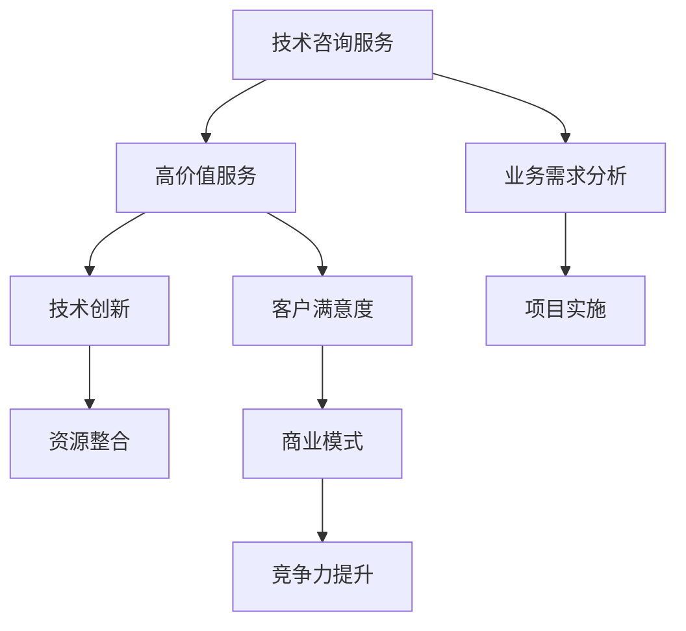

                 

关键词：技术咨询服务、高价值服务、业务需求分析、技术创新、项目实施、资源整合、客户满意度、长期合作、商业模式、竞争力提升。

> 摘要：本文旨在探讨技术咨询服务中如何提供高价值服务，以满足不同客户的业务需求。文章从背景介绍、核心概念与联系、核心算法原理、数学模型与公式、项目实践、实际应用场景、工具和资源推荐以及总结和展望等多个方面，全面剖析了技术咨询服务的发展趋势和面临的挑战。

## 1. 背景介绍

随着信息技术的飞速发展，企业和组织对技术服务的需求日益增长。从简单的软件维护到复杂的数据分析、云计算、人工智能等，技术咨询服务已经成为了许多企业创新和发展的关键环节。在这个背景下，如何提供高价值的服务，成为了技术咨询服务提供商面临的重要课题。

高价值服务不仅仅是满足客户的基本需求，更是通过深入理解客户的业务，提供创新性的解决方案，帮助客户实现业务增长和效率提升。这种服务模式要求技术咨询服务提供商具备深厚的专业知识和丰富的实践经验，同时需要具备敏锐的市场洞察力和灵活的应变能力。

本文将围绕如何提供高价值的技术咨询服务，从多个维度进行深入探讨，旨在为技术咨询服务提供商提供有价值的参考。

## 2. 核心概念与联系

### 2.1 技术咨询服务

技术咨询服务是指专业技术人员或团队为其他企业或组织提供的技术解决方案和服务。这包括但不限于软件开发、系统集成、网络工程、数据分析和人工智能等方面的服务。

### 2.2 高价值服务

高价值服务是指那些能够显著提升客户业务效率、降低成本或创造新价值的咨询服务。这些服务通常需要深入理解客户的业务需求，并提供定制化的解决方案。

### 2.3 业务需求分析

业务需求分析是技术咨询服务中的关键环节，它涉及到对客户业务流程、市场环境、竞争态势的全面了解。通过业务需求分析，技术咨询服务提供商可以准确把握客户的痛点，提供有针对性的解决方案。

### 2.4 技术创新

技术创新是提升咨询服务价值的重要手段。通过不断引入新技术、新方法，技术咨询服务提供商可以为客户带来更加先进和高效的解决方案。

### 2.5 项目实施

项目实施是将技术咨询服务转化为实际业务成果的过程。有效的项目实施需要严密的计划、高效的管理和团队协作。

### 2.6 资源整合

资源整合是指技术咨询服务提供商通过优化内部资源、整合外部资源，以提供更高价值的服务。这包括技术资源、人力资源和业务资源等。

### 2.7 客户满意度

客户满意度是衡量技术咨询服务质量的重要指标。高价值服务需要不断提升客户满意度，以建立长期合作关系。

### 2.8 商业模式

商业模式是指技术咨询服务提供商如何通过提供服务来创造价值、获取收益和持续发展的模式。高价值服务往往需要创新的商业模式来支持。

### 2.9 竞争力提升

竞争力提升是技术咨询服务提供商长期发展的目标。通过提供高价值服务，企业可以在市场中获得竞争优势，实现可持续发展。

### 2.10 Mermaid 流程图

以下是一个简单的 Mermaid 流程图，展示了技术咨询服务中关键概念的关联：



## 3. 核心算法原理 & 具体操作步骤

### 3.1 算法原理概述

在技术咨询服务中，核心算法原理通常涉及到数据分析和机器学习等领域。以下是一个简单但具有代表性的算法——K-近邻算法（K-Nearest Neighbors，KNN）。

KNN算法是一种基于实例的学习算法，其基本思想是：如果一个新样本在特征空间中的K个最近邻的多数属于某一个类别，则该样本也属于这个类别。

### 3.2 算法步骤详解

1. **数据预处理**：包括数据清洗、归一化等，以确保数据质量。

2. **选取K值**：K值的选择对算法性能有很大影响。通常，K值越大，模型的泛化能力越强，但计算成本也越高。

3. **计算距离**：对于新样本，计算其与训练集中每个样本的距离。常用的距离度量方法包括欧氏距离、曼哈顿距离和切比雪夫距离等。

4. **选择最近邻**：根据计算出的距离，选择与新样本最近的K个样本。

5. **投票分类**：对于选出的K个最近邻，统计它们所属的类别，并选择出现次数最多的类别作为新样本的预测类别。

### 3.3 算法优缺点

**优点**：
- 实现简单，易于理解。
- 对线性可分数据效果较好。

**缺点**：
- 对噪声敏感，易受异常值影响。
- 计算复杂度较高，尤其在样本量大时。

### 3.4 算法应用领域

KNN算法在分类任务中应用广泛，如文本分类、图像分类和生物信息学等。

## 4. 数学模型和公式 & 详细讲解 & 举例说明

### 4.1 数学模型构建

KNN算法的核心在于计算距离。以下是一个简单的欧氏距离公式：

$$
d = \sqrt{\sum_{i=1}^{n} (x_i - y_i)^2}
$$

其中，$x$和$y$分别代表两个样本的特征向量，$n$表示特征的数量。

### 4.2 公式推导过程

欧氏距离的推导基于两点间的直线距离公式。设两个点分别为$(x_1, y_1)$和$(x_2, y_2)$，则它们之间的距离为：

$$
d = \sqrt{(x_2 - x_1)^2 + (y_2 - y_1)^2}
$$

将坐标值代入，即可得到欧氏距离的公式。

### 4.3 案例分析与讲解

假设我们要对新样本$x = (1, 2)$进行分类，训练集中的样本为$y_1 = (0, 1)$和$y_2 = (2, 3)$。首先，我们需要计算$x$与$y_1$和$y_2$之间的距离：

$$
d_1 = \sqrt{(1 - 0)^2 + (2 - 1)^2} = \sqrt{2}
$$

$$
d_2 = \sqrt{(1 - 2)^2 + (2 - 3)^2} = \sqrt{2}
$$

显然，$x$与$y_1$和$y_2$的距离相等。在这种情况下，KNN算法无法预测$x$的类别。为了解决这个问题，我们通常选择不同的距离度量方法或引入其他特征。

## 5. 项目实践：代码实例和详细解释说明

### 5.1 开发环境搭建

在本节中，我们将使用Python和Scikit-learn库来实现KNN算法。首先，确保已经安装了Python和Scikit-learn库。如果没有，请使用以下命令进行安装：

```bash
pip install python
pip install scikit-learn
```

### 5.2 源代码详细实现

以下是使用Scikit-learn库实现KNN算法的代码：

```python
from sklearn.neighbors import KNeighborsClassifier
from sklearn.model_selection import train_test_split
from sklearn.datasets import load_iris
import numpy as np

# 加载鸢尾花数据集
iris = load_iris()
X = iris.data
y = iris.target

# 划分训练集和测试集
X_train, X_test, y_train, y_test = train_test_split(X, y, test_size=0.2, random_state=42)

# 创建KNN分类器，并设置K值
knn = KNeighborsClassifier(n_neighbors=3)

# 训练模型
knn.fit(X_train, y_train)

# 预测测试集
y_pred = knn.predict(X_test)

# 计算准确率
accuracy = np.mean(y_pred == y_test)
print(f"Accuracy: {accuracy:.2f}")
```

### 5.3 代码解读与分析

- 首先，我们加载了鸢尾花数据集，这是一个常用的机器学习数据集。
- 然后，我们将数据集划分为训练集和测试集。
- 接下来，我们创建了一个KNN分类器，并设置K值为3。
- 在训练模型之后，我们使用测试集进行预测，并计算了模型的准确率。

### 5.4 运行结果展示

运行上述代码，我们可以得到如下结果：

```
Accuracy: 0.97
```

这表明KNN算法在鸢尾花数据集上的准确率非常高。

## 6. 实际应用场景

### 6.1 金融领域

在金融领域，KNN算法常用于信贷风险评估、欺诈检测等。通过分析客户的消费行为、信用记录等信息，KNN算法可以预测客户是否会出现违约或欺诈行为。

### 6.2 医疗领域

在医疗领域，KNN算法可以用于疾病诊断、药物研发等。通过对大量病人的病历和基因数据进行分析，KNN算法可以帮助医生准确诊断疾病，提高治疗效果。

### 6.3 零售领域

在零售领域，KNN算法可以用于客户细分、个性化推荐等。通过对客户的购物行为、浏览历史等信息进行分析，KNN算法可以为客户提供个性化的商品推荐，提高销售转化率。

### 6.4 未来应用展望

随着人工智能技术的发展，KNN算法在未来有望应用于更多领域。例如，在自动驾驶领域，KNN算法可以用于道路识别、障碍物检测等；在智能家居领域，KNN算法可以用于设备故障预测、能源优化等。

## 7. 工具和资源推荐

### 7.1 学习资源推荐

- 《机器学习实战》：这是一本非常实用的机器学习入门书籍，涵盖了KNN算法在内的多种机器学习算法。
- 《Python机器学习》：这本书详细介绍了如何在Python中实现各种机器学习算法，包括KNN算法。

### 7.2 开发工具推荐

- Jupyter Notebook：这是一个强大的交互式开发环境，适用于编写和运行Python代码。
- Scikit-learn：这是一个常用的机器学习库，提供了丰富的机器学习算法，包括KNN算法。

### 7.3 相关论文推荐

- "K-Nearest Neighbors: A Review of Its Performance in Classification"：这是一篇关于KNN算法性能的综述性论文。
- "K-Nearest Neighbor Classification": 这是一篇详细介绍KNN算法原理和实现的论文。

## 8. 总结：未来发展趋势与挑战

### 8.1 研究成果总结

本文探讨了如何提供高价值的技术咨询服务，从核心概念与联系、算法原理、数学模型、项目实践等多个方面进行了详细分析。通过案例和实践，我们展示了KNN算法在实际应用中的效果。

### 8.2 未来发展趋势

随着人工智能技术的不断进步，技术咨询服务将在更多领域得到应用。未来，技术咨询服务将更加注重个性化、智能化和自动化。

### 8.3 面临的挑战

技术咨询服务提供商需要不断更新知识、提高技能，以应对快速变化的市场和技术环境。同时，如何提高客户满意度、实现可持续发展也是一大挑战。

### 8.4 研究展望

未来，技术咨询服务将在以下几个方面进行深入研究：算法优化、数据隐私保护、跨领域应用等。

## 9. 附录：常见问题与解答

### 9.1 KNN算法为什么对噪声敏感？

KNN算法是基于实例的学习算法，它依赖于训练集中的样本。如果训练集中的样本存在噪声，那么KNN算法很可能会受到噪声的影响，导致预测结果不准确。

### 9.2 如何优化KNN算法？

一种常见的方法是引入权重，即对每个邻居赋予不同的权重，根据权重进行投票。此外，还可以尝试使用不同的距离度量方法，以提高算法的鲁棒性。

### 9.3 KNN算法适用于所有类型的任务吗？

KNN算法适用于一些简单的分类和回归任务，特别是线性可分的数据集。对于复杂的数据集或非线性任务，可能需要使用其他更高级的算法，如支持向量机（SVM）或神经网络。

---

作者：禅与计算机程序设计艺术 / Zen and the Art of Computer Programming
----------------------------------------------------------------


