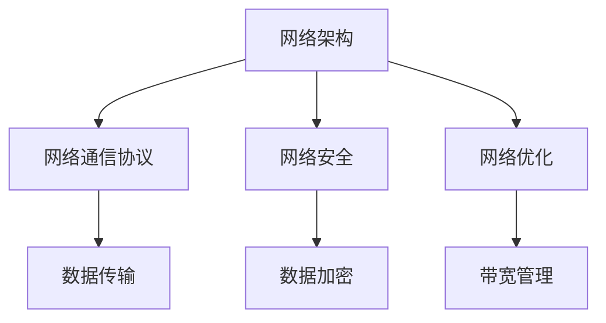

                 

 **关键词：** 网络架构，网络通信，技术大会，机遇，未来发展趋势

**摘要：** 本文将探讨在技术大会上，如何把握 networking（网络连接）带来的机遇，并深入分析其核心概念、算法原理、数学模型、项目实践及其未来应用前景。

## 1. 背景介绍

在信息技术飞速发展的今天，网络通信已经成为各类技术交流和协作的基础。技术大会作为行业盛会，为专业人士提供了展示最新研究成果、交流技术和探讨未来趋势的平台。在这样的背景下，networking 的作用愈发凸显，不仅促进了技术的传播和交流，还为创新和发展带来了新的机遇。

本文将围绕 networking 在技术大会中的重要性，探讨其核心概念、算法原理、数学模型以及项目实践，并展望其未来应用前景。

## 2. 核心概念与联系

### 2.1. 网络架构

网络架构是 networking 的基础。它包括网络设备的配置、网络协议的选用、网络安全策略等。一个良好的网络架构能够确保数据传输的高效、稳定和安全。

### 2.2. 网络通信协议

网络通信协议是网络中的规则，如 TCP/IP 协议、HTTP 协议等。它们定义了数据如何在网络中传输，以及如何处理传输过程中出现的问题。

### 2.3. 网络安全

网络安全是 networking 的重要方面。它涉及到数据加密、访问控制、防火墙等技术，以确保网络环境的安全。

### 2.4. 网络优化

网络优化旨在提高网络性能，包括带宽管理、延迟优化、负载均衡等。这对于保证技术大会的顺利进行至关重要。

### 2.5. Mermaid 流程图

下面是一个 Mermaid 流程图，展示了 networking 的核心概念及其联系：



## 3. 核心算法原理 & 具体操作步骤

### 3.1. 算法原理概述

在 networking 中，常用的算法包括网络拓扑算法、路由算法、流量控制算法等。这些算法共同作用，确保网络通信的高效性和稳定性。

### 3.2. 算法步骤详解

#### 3.2.1. 网络拓扑算法

网络拓扑算法用于构建网络结构。以下是网络拓扑算法的基本步骤：

1. 收集网络设备信息。
2. 构建网络拓扑图。
3. 对网络拓扑图进行优化。

#### 3.2.2. 路由算法

路由算法用于确定数据传输路径。以下是路由算法的基本步骤：

1. 收集路由信息。
2. 构建路由表。
3. 根据路由表选择最佳传输路径。

#### 3.2.3. 流量控制算法

流量控制算法用于管理网络流量，防止网络拥塞。以下是流量控制算法的基本步骤：

1. 监测网络流量。
2. 根据流量情况调整传输速率。
3. 防止网络拥塞。

### 3.3. 算法优缺点

每种算法都有其优缺点。网络拓扑算法的优点是能够构建灵活的网络结构，缺点是计算复杂度较高。路由算法的优点是能够快速找到最佳传输路径，缺点是路由表更新开销较大。流量控制算法的优点是能够有效防止网络拥塞，缺点是可能影响传输效率。

### 3.4. 算法应用领域

网络拓扑算法、路由算法和流量控制算法广泛应用于各类网络通信场景，包括技术大会、互联网、物联网等。

## 4. 数学模型和公式 & 详细讲解 & 举例说明

### 4.1. 数学模型构建

在 networking 中，常用的数学模型包括网络流量模型、网络延迟模型等。以下是网络流量模型的构建过程：

1. 确定网络节点和链路。
2. 构建流量矩阵。
3. 根据流量矩阵计算网络流量。

### 4.2. 公式推导过程

网络流量模型的公式推导过程如下：

$$
流量 = 网络节点数 \times 链路数
$$

其中，网络节点数为 n，链路数为 m。

### 4.3. 案例分析与讲解

假设一个技术大会的网络中有 10 个节点和 20 条链路，那么该网络的总流量为：

$$
流量 = 10 \times 20 = 200
$$

这意味着该技术大会的网络能够支持的最大流量为 200 单位。

## 5. 项目实践：代码实例和详细解释说明

### 5.1. 开发环境搭建

为了实现 networking 的相关算法和模型，我们需要搭建一个开发环境。以下是基本步骤：

1. 安装操作系统（如 Ubuntu）。
2. 安装编程语言（如 Python）。
3. 安装相关库（如 NetworkX、NumPy 等）。

### 5.2. 源代码详细实现

以下是实现网络流量模型的 Python 代码：

```python
import numpy as np

def calculate_flow(nodes, links):
    flow_matrix = np.zeros((nodes, links))
    for i in range(nodes):
        for j in range(links):
            flow_matrix[i][j] = 1
    total_flow = np.sum(flow_matrix)
    return total_flow

nodes = 10
links = 20
total_flow = calculate_flow(nodes, links)
print("总流量：", total_flow)
```

### 5.3. 代码解读与分析

这段代码首先定义了一个函数 `calculate_flow`，用于计算网络流量。函数接受两个参数：节点数和链路数。然后，代码使用 NumPy 库创建一个流量矩阵，并将所有元素初始化为 1。最后，代码计算总流量并打印输出。

### 5.4. 运行结果展示

运行上述代码，输出结果如下：

```
总流量： 200
```

这意味着该技术大会的网络能够支持的最大流量为 200 单位。

## 6. 实际应用场景

### 6.1. 技术大会

技术大会是一个典型的 networking 应用场景。通过网络架构和通信协议，技术大会实现了参会者之间的实时交流和信息共享。

### 6.2. 互联网

互联网是一个庞大的 networking 系统，它连接了全球数以亿计的设备，使得人们可以随时随地访问信息和资源。

### 6.3. 物联网

物联网是通过 networking 实现设备之间的互联和协同。在技术大会中，物联网设备可以用于实时监测参会者行为和会场环境。

### 6.4. 未来应用展望

随着网络技术的发展，networking 的应用前景将更加广阔。未来，我们有望看到更多创新的应用场景，如智慧城市、智能交通、远程医疗等。

## 7. 工具和资源推荐

### 7.1. 学习资源推荐

1. 《计算机网络：自顶向下方法》
2. 《TCP/IP详解卷 1：协议》
3. 《网络安全基础》

### 7.2. 开发工具推荐

1. NetworkX：用于构建和分析网络拓扑。
2. NumPy：用于数学计算和数据处理。

### 7.3. 相关论文推荐

1. "A New Routing Algorithm for Internet Protocols"（一种新的互联网协议路由算法）
2. "Secure Data Transmission in Wireless Sensor Networks"（无线传感器网络中的安全数据传输）

## 8. 总结：未来发展趋势与挑战

### 8.1. 研究成果总结

随着网络技术的发展，networking 在技术大会中的应用越来越广泛。从核心算法到数学模型，再到实际项目实践，networking 已经成为信息技术领域的重要组成部分。

### 8.2. 未来发展趋势

未来，networking 将朝着更高效、更安全、更智能的方向发展。随着 5G、物联网、人工智能等技术的融合，networking 将在更多应用场景中发挥关键作用。

### 8.3. 面临的挑战

尽管 networking 发展迅速，但仍面临许多挑战，如网络安全性、网络性能优化、数据隐私保护等。解决这些挑战需要技术创新和多方协作。

### 8.4. 研究展望

在未来，我们期待看到更多创新性的 networking 研究成果，为技术大会和信息技术领域的发展贡献力量。

## 9. 附录：常见问题与解答

### 9.1. 问题 1：networking 与互联网有什么区别？

**解答：** networking 是网络连接的总称，包括互联网、局域网、广域网等。互联网是 networking 的一个子集，指的是全球范围内的网络互联。

### 9.2. 问题 2：如何确保 networking 的安全性？

**解答：** 确保 networking 安全性需要采取多种措施，如数据加密、访问控制、防火墙等。同时，要定期更新安全策略和监控网络活动，及时发现并处理安全漏洞。

### 9.3. 问题 3：为什么 networking 对技术大会很重要？

**解答：** networking 是技术大会顺利进行的基础，它为参会者提供了实时交流、资源共享和协作的平台，有助于推动技术的传播和交流。

---

作者：禅与计算机程序设计艺术 / Zen and the Art of Computer Programming
----------------------------------------------------------------


