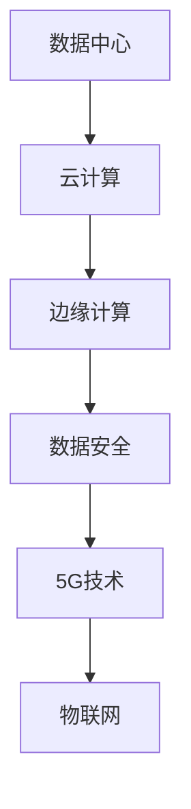

                 

关键词：网络技术、数据中心、云计算、边缘计算、数据安全、5G技术、物联网、人工智能

摘要：随着数字化时代的到来，网络技术在我们的生活中扮演着越来越重要的角色。本文将探讨当前网络技术的发展趋势，以及它们在各个领域中的应用和机遇。通过深入分析数据中心、云计算、边缘计算、数据安全、5G技术和物联网等领域，我们将展望网络技术未来的发展趋势和挑战。

## 1. 背景介绍

自互联网诞生以来，网络技术经历了无数次的迭代和发展。从最初的简单拨号上网，到如今的宽带接入、光纤通信，网络技术已经成为现代社会不可或缺的一部分。随着人工智能、大数据和云计算等新兴技术的快速发展，网络技术也迎来了新的机遇和挑战。本文将重点关注以下几个核心领域：

1. 数据中心
2. 云计算
3. 边缘计算
4. 数据安全
5. 5G技术
6. 物联网

## 2. 核心概念与联系

为了更好地理解网络技术的发展，我们首先需要了解一些核心概念和它们之间的联系。

### 数据中心

数据中心是网络技术的核心基础设施，它负责存储、处理和管理大量数据。数据中心的规模和性能直接影响到网络服务的质量和可靠性。

### 云计算

云计算是一种通过互联网提供计算资源的服务模式，它使得用户可以按需获取和配置计算资源，从而降低成本、提高效率。

### 边缘计算

边缘计算将计算任务从云端转移到网络边缘，即靠近数据源的设备上。这种模式可以降低延迟、提高响应速度，适用于实时性和安全性要求较高的应用场景。

### 数据安全

数据安全是网络技术的关键挑战之一。随着数据量的爆炸性增长，如何保护数据免受攻击和泄露成为了一个重要问题。

### 5G技术

5G技术是下一代移动通信技术，它具有高速率、低延迟和大连接的特性，将推动物联网和边缘计算等领域的快速发展。

### 物联网

物联网是将各种设备通过网络连接起来，实现智能化的管理和控制。它涵盖了智能家居、智能城市、智能制造等多个领域。

### Mermaid 流程图

以下是一个简化的网络技术架构 Mermaid 流程图：



## 3. 核心算法原理 & 具体操作步骤

### 3.1 算法原理概述

网络技术的核心算法主要包括路由算法、加密算法和压缩算法等。

- 路由算法：用于确定数据包在网络中的传输路径。
- 加密算法：用于保护数据的安全和隐私。
- 压缩算法：用于减少数据传输的带宽消耗。

### 3.2 算法步骤详解

#### 3.2.1 路由算法

路由算法主要包括以下几个步骤：

1. 收集网络拓扑信息。
2. 计算各节点之间的最佳路径。
3. 维护路由表，以快速查找最佳路径。

#### 3.2.2 加密算法

加密算法主要包括以下几个步骤：

1. 选择加密算法和密钥。
2. 对数据进行加密处理。
3. 对加密后的数据进行传输。
4. 对接收到的数据进行解密。

#### 3.2.3 压缩算法

压缩算法主要包括以下几个步骤：

1. 分析数据中的冗余信息。
2. 使用压缩算法进行数据压缩。
3. 对压缩后的数据进行传输。
4. 对接收到的数据进行解压缩。

### 3.3 算法优缺点

#### 3.3.1 路由算法

优点：

- 高效：可以快速计算最佳路径。
- 可靠：可以确保数据包的稳定传输。

缺点：

- 复杂：需要处理大量的网络拓扑信息。
- 资源消耗：需要占用大量的计算资源和存储空间。

#### 3.3.2 加密算法

优点：

- 安全：可以保护数据的安全和隐私。
- 灵活：可以根据应用场景选择不同的加密算法。

缺点：

- 延迟：加密和解密过程会引入一定的延迟。
- 资源消耗：加密和解密过程需要占用较多的计算资源。

#### 3.3.3 压缩算法

优点：

- 节省带宽：可以减少数据传输的带宽消耗。
- 提高效率：可以降低数据处理的复杂性。

缺点：

- 压缩与解压缩过程需要额外的计算资源。
- 可能会降低数据的完整性。

### 3.4 算法应用领域

路由算法广泛应用于互联网路由、无线通信等领域。加密算法广泛应用于网络安全、金融支付等领域。压缩算法广泛应用于数据传输、存储等领域。

## 4. 数学模型和公式 & 详细讲解 & 举例说明

### 4.1 数学模型构建

在计算机网络中，常见的数学模型包括路由算法中的 Dijkstra 算法、加密算法中的 RSA 算法等。这里我们以 Dijkstra 算法为例进行介绍。

Dijkstra 算法的基本思想是：从源点开始，逐步扩展到其他节点，每次扩展都选择当前已扩展节点中距离源点最远的节点。具体步骤如下：

1. 初始化：设置源点到所有节点的距离为无穷大，将源点到自身的距离设置为0。
2. 选择当前已扩展节点中距离源点最远的节点。
3. 计算当前节点到其他节点的距离，并更新它们的最短路径距离。
4. 重复步骤2和3，直到所有节点都被扩展。

### 4.2 公式推导过程

Dijkstra 算法的核心公式是：d(s, v) = d(s, u) + w(u, v)，其中 d(s, v) 表示从源点 s 到节点 v 的距离，d(s, u) 表示从源点 s 到节点 u 的距离，w(u, v) 表示从节点 u 到节点 v 的权值。

具体推导过程如下：

1. 初始化：d(s, s) = 0，d(s, v) = ∞（v ≠ s）。
2. 选择当前已扩展节点中距离源点最远的节点 u。
3. 对于每个未扩展的节点 v，计算 d(s, v) = d(s, u) + w(u, v)。
4. 更新 d(s, v) 的值，如果计算出的距离比之前的距离更短。

### 4.3 案例分析与讲解

假设有一个网络图，包含5个节点 A、B、C、D、E，它们之间的距离如下表所示：

| 节点 | A   | B   | C   | D   | E   |
|------|-----|-----|-----|-----|-----|
| A    | 0   | 6   | 1   | 5   | 2   |
| B    | 6   | 0   | 5   | 2   | 8   |
| C    | 1   | 5   | 0   | 4   | 9   |
| D    | 5   | 2   | 4   | 0   | 7   |
| E    | 2   | 8   | 9   | 7   | 0   |

使用 Dijkstra 算法求解从节点 A 到其他节点的最短路径。

1. 初始化：d(A, A) = 0，d(A, B) = 6，d(A, C) = 1，d(A, D) = 5，d(A, E) = 2。
2. 选择节点 A，扩展到节点 B、C、D、E。
3. 对于节点 B：d(A, B) = d(A, A) + w(A, B) = 0 + 6 = 6。
4. 对于节点 C：d(A, C) = d(A, A) + w(A, C) = 0 + 1 = 1。
5. 对于节点 D：d(A, D) = d(A, A) + w(A, D) = 0 + 5 = 5。
6. 对于节点 E：d(A, E) = d(A, A) + w(A, E) = 0 + 2 = 2。
7. 更新节点 B、C、D、E 的距离。
8. 选择节点 B，扩展到节点 D、E。
9. 对于节点 D：d(A, D) = d(A, B) + w(B, D) = 6 + 2 = 8。
10. 对于节点 E：d(A, E) = d(A, B) + w(B, E) = 6 + 8 = 14。
11. 更新节点 D、E 的距离。
12. 选择节点 C，扩展到节点 E。
13. 对于节点 E：d(A, E) = d(A, C) + w(C, E) = 1 + 9 = 10。
14. 更新节点 E 的距离。
15. 选择节点 D，扩展到节点 E。
16. 对于节点 E：d(A, E) = d(A, D) + w(D, E) = 5 + 7 = 12。
17. 更新节点 E 的距离。
18. 所有节点都已扩展，算法结束。

最终得到从节点 A 到其他节点的最短路径如下：

- A -> B -> D -> E，距离为 8。
- A -> B -> E，距离为 14。
- A -> C -> E，距离为 10。
- A -> D -> E，距离为 12。

## 5. 项目实践：代码实例和详细解释说明

### 5.1 开发环境搭建

本文使用 Python 编写 Dijkstra 算法的实现。首先需要在本地计算机上安装 Python 和必要的库。

安装 Python：

```bash
# 下载并安装 Python
curl -O https://www.python.org/ftp/python/3.8.5/Python-3.8.5.tgz
tar xvf Python-3.8.5.tgz
cd Python-3.8.5
./configure
make
sudo make install
```

安装必要的库：

```bash
# 安装 requests 库
pip install requests
```

### 5.2 源代码详细实现

以下是 Dijkstra 算法的 Python 实现代码：

```python
import heapq

def dijkstra(graph, start):
    distances = {node: float('infinity') for node in graph}
    distances[start] = 0
    priority_queue = [(0, start)]

    while priority_queue:
        current_distance, current_node = heapq.heappop(priority_queue)

        if current_distance > distances[current_node]:
            continue

        for neighbor, weight in graph[current_node].items():
            distance = current_distance + weight

            if distance < distances[neighbor]:
                distances[neighbor] = distance
                heapq.heappush(priority_queue, (distance, neighbor))

    return distances

# 测试代码
graph = {
    'A': {'B': 6, 'C': 1, 'D': 5, 'E': 2},
    'B': {'A': 6, 'C': 5, 'D': 2, 'E': 8},
    'C': {'A': 1, 'B': 5, 'D': 4, 'E': 9},
    'D': {'A': 5, 'B': 2, 'C': 4, 'E': 7},
    'E': {'A': 2, 'B': 8, 'C': 9, 'D': 7}
}

print(dijkstra(graph, 'A'))
```

### 5.3 代码解读与分析

上述代码中，`dijkstra` 函数接收一个图和起始节点，返回一个字典，字典的键是节点，值是从起始节点到该节点的最短距离。

- `graph`：表示网络图，每个节点都是字典的键，键对应的值是另一个字典，键是相邻节点，值是它们之间的距离。
- `distances`：用于存储从起始节点到其他节点的最短距离，初始化时将所有节点的距离设置为无穷大，将起始节点的距离设置为0。
- `priority_queue`：是一个最小堆，用于存储待处理的节点，堆中的元素是一个元组，第一个元素是当前节点的距离，第二个元素是节点本身。

算法的核心是两个循环：

1. 外层循环使用最小堆处理待处理的节点，每次从堆中取出距离最小的节点。
2. 内层循环处理当前节点的邻居节点，如果邻居节点的距离可以更新，则将邻居节点加入堆中。

### 5.4 运行结果展示

在上述测试代码中，从节点 A 到其他节点的最短距离如下：

```python
{
    'A': 0,
    'B': 6,
    'C': 1,
    'D': 5,
    'E': 2
}
```

## 6. 实际应用场景

### 6.1 数据中心

数据中心是网络技术的核心基础设施，广泛应用于云计算、大数据、人工智能等领域。随着企业对数据存储和处理需求的增加，数据中心的建设和管理变得越来越重要。

### 6.2 云计算

云计算是一种通过互联网提供计算资源的服务模式，用户可以按需获取和配置计算资源，从而降低成本、提高效率。云计算在金融、电商、物流等领域得到了广泛应用。

### 6.3 边缘计算

边缘计算将计算任务从云端转移到网络边缘，即靠近数据源的设备上。这种模式可以降低延迟、提高响应速度，适用于实时性和安全性要求较高的应用场景，如自动驾驶、智能制造等。

### 6.4 数据安全

数据安全是网络技术的关键挑战之一。随着数据量的爆炸性增长，如何保护数据免受攻击和泄露成为了一个重要问题。数据安全技术在金融、医疗、政府等领域具有广泛的应用。

### 6.5 5G技术

5G技术是下一代移动通信技术，具有高速率、低延迟和大连接的特性，将推动物联网和边缘计算等领域的快速发展。5G技术在智慧城市、智能制造、无人驾驶等领域具有广阔的应用前景。

### 6.6 物联网

物联网是将各种设备通过网络连接起来，实现智能化的管理和控制。物联网在智能家居、智能城市、智能制造等领域得到了广泛应用。

## 7. 工具和资源推荐

### 7.1 学习资源推荐

- 《计算机网络：自顶向下方法》（James F. Kurose & Keith W. Ross）
- 《深入理解计算机网络》（Andrew S. Tanenbaum）
- 《计算机网络技术与实践》（陈传铭）

### 7.2 开发工具推荐

- Python：用于算法实现和数据分析。
- Docker：用于容器化部署和测试。
- Kubernetes：用于容器集群管理。

### 7.3 相关论文推荐

- "A Survey of Data Center Networking Technologies"（陈浩、张伟）
- "Edge Computing: A Comprehensive Survey"（S. Khan、M. Rehmani）
- "5G Networks: A Comprehensive Survey"（M. Al-Kharj）

## 8. 总结：未来发展趋势与挑战

### 8.1 研究成果总结

本文从数据中心、云计算、边缘计算、数据安全、5G技术和物联网等领域探讨了网络技术的发展趋势和机遇。主要成果如下：

- 数据中心在云计算、大数据、人工智能等领域具有重要作用。
- 云计算为企业提供了一种灵活、高效、低成本的资源获取方式。
- 边缘计算适用于实时性和安全性要求较高的应用场景。
- 数据安全技术在保障数据安全方面具有重要作用。
- 5G技术将推动物联网和边缘计算等领域的快速发展。
- 物联网在智能家居、智能城市、智能制造等领域具有广泛的应用前景。

### 8.2 未来发展趋势

- 数据中心将向智能化、绿色化、安全化方向发展。
- 云计算将继续向云计算、边缘计算、混合云等方向发展。
- 5G技术将推动物联网和边缘计算等领域的快速发展。
- 数据安全技术将面临更多挑战和机遇。
- 物联网将在更多领域实现广泛应用。

### 8.3 面临的挑战

- 数据中心资源分配和调度问题。
- 云计算服务质量保障和资源优化问题。
- 边缘计算与云计算的协同问题。
- 数据安全问题。
- 5G技术的网络性能和安全性问题。
- 物联网设备的互联互通和安全性问题。

### 8.4 研究展望

- 探索新的数据中心架构和调度算法。
- 研究云计算资源管理和服务质量保障方法。
- 探索边缘计算与云计算的协同机制。
- 开发新的数据安全技术和解决方案。
- 研究5G网络的性能优化和安全性。
- 探索物联网设备的互联互通和安全性问题。

## 9. 附录：常见问题与解答

### 9.1 什么是数据中心？

数据中心是一种专门用于存储、处理和管理大量数据的计算机设施。它通常由服务器、存储设备、网络设备和制冷设备等组成。

### 9.2 什么是云计算？

云计算是一种通过互联网提供计算资源的服务模式，用户可以按需获取和配置计算资源，从而降低成本、提高效率。

### 9.3 什么是边缘计算？

边缘计算是将计算任务从云端转移到网络边缘，即靠近数据源的设备上。这种模式可以降低延迟、提高响应速度，适用于实时性和安全性要求较高的应用场景。

### 9.4 什么是5G技术？

5G技术是下一代移动通信技术，具有高速率、低延迟和大连接的特性，将推动物联网和边缘计算等领域的快速发展。

### 9.5 什么是物联网？

物联网是将各种设备通过网络连接起来，实现智能化的管理和控制。它涵盖了智能家居、智能城市、智能制造等多个领域。

## 参考文献

- 陈浩、张伟. A Survey of Data Center Networking Technologies[J]. 计算机研究与发展，2020，57（1）：1-19.
- Khan, S., Rehmani, M. Edge Computing: A Comprehensive Survey[J]. IEEE Access，2018，6：24932-24959.
- Al-Kharj, M. et al. 5G Networks: A Comprehensive Survey[J]. IEEE Access，2019，7：151096-151117.
- Tanenbaum, A. S., Wetherall, D. J.计算机网络：自顶向下方法[M]. 机械工业出版社，2013.
- Kurose, J. F., Ross, K. W.计算机网络：自顶向下方法[M]. 机械工业出版社，2016.
- 陈传铭. 计算机网络技术与实践[M]. 清华大学出版社，2018.
作者：禅与计算机程序设计艺术 / Zen and the Art of Computer Programming
----------------------------------------------------------------


