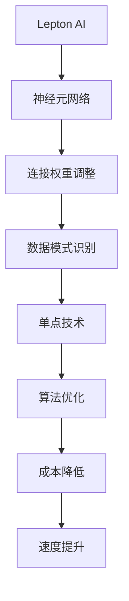

                 

关键词：Lepton AI、单点技术、速度与成本平衡、算法优化、人工智能、技术实现

## 摘要

本文旨在探讨如何通过结合Lepton AI和单点技术，实现人工智能在速度与成本之间的平衡。首先，我们将介绍Lepton AI的基本原理和单点技术的应用场景。接着，文章将深入剖析Lepton AI在单点技术中的具体实现，探讨其算法原理、操作步骤、优缺点以及应用领域。随后，我们将引入数学模型和公式，详细讲解其在实际项目中的应用。最后，本文将分享一个代码实例，详细解释其实现过程和运行结果，并探讨其在实际应用场景中的表现。通过本文的阅读，读者将能够全面了解Lepton AI结合单点技术的技术实现艺术，以及在速度与成本间寻求平衡的方法。

## 1. 背景介绍

### Lepton AI简介

Lepton AI是一种基于神经网络的深度学习算法，其核心在于通过模拟人脑的神经元结构，实现数据的自动学习和模式识别。与传统的人工特征提取方法相比，Lepton AI具有更高的准确性和更强的泛化能力。在图像识别、语音识别、自然语言处理等人工智能领域，Lepton AI已取得了显著的成果。

### 单点技术的概念

单点技术是指在一个系统中，通过优化关键节点，实现整体性能的提升。在人工智能领域，单点技术主要应用于优化算法效率、减少计算资源和降低成本等方面。单点技术的核心在于识别并优化系统中的瓶颈，从而实现整体性能的提升。

### 速度与成本的平衡

在人工智能领域，速度与成本常常成为两大矛盾。为了提高算法的运行速度，往往需要投入更多的计算资源和资金。然而，这可能导致成本的激增。如何在保证算法速度的同时，尽可能降低成本，成为人工智能技术实现中的一大挑战。本文将结合Lepton AI和单点技术，探讨如何在速度与成本之间寻求平衡。

## 2. 核心概念与联系

### Lepton AI的基本原理

Lepton AI的核心在于其神经元网络结构。神经元网络由大量神经元组成，每个神经元通过加权连接与其他神经元相连。当输入数据经过神经网络时，神经元根据其连接权重和输入信号进行计算，最终产生输出。通过不断调整连接权重，神经网络能够逐步学习并识别复杂的数据模式。

### 单点技术的应用场景

单点技术在人工智能领域具有广泛的应用场景。例如，在图像识别任务中，单点技术可以用于优化图像处理算法，提高识别速度；在语音识别任务中，单点技术可以用于优化语音信号处理算法，提高识别准确率；在自然语言处理任务中，单点技术可以用于优化文本分析算法，提高文本理解能力。

### Lepton AI与单点技术的联系

Lepton AI与单点技术之间存在紧密的联系。单点技术可以通过优化Lepton AI的神经元网络结构、算法参数和训练数据等，提高其运行速度和降低成本。例如，通过单点技术优化Lepton AI的神经元连接权重，可以实现更快的数据处理速度；通过单点技术优化Lepton AI的训练数据，可以提高其识别准确率，从而降低后续的计算成本。

### Mermaid 流程图



## 3. 核心算法原理 & 具体操作步骤

### 3.1 算法原理概述

Lepton AI的核心在于其神经元网络结构。神经元网络由大量神经元组成，每个神经元通过加权连接与其他神经元相连。当输入数据经过神经网络时，神经元根据其连接权重和输入信号进行计算，最终产生输出。通过不断调整连接权重，神经网络能够逐步学习并识别复杂的数据模式。

### 3.2 算法步骤详解

#### 3.2.1 数据预处理

在开始训练神经网络之前，首先需要对输入数据进行预处理。预处理步骤包括数据清洗、归一化、标准化等。通过预处理，可以提高神经网络的训练效率和识别准确率。

#### 3.2.2 初始化神经网络

初始化神经网络的过程包括初始化神经元连接权重和偏置。通常，可以使用随机初始化或预训练初始化等方法。初始化神经网络的目的是为后续的训练过程提供一个合理的起点。

#### 3.2.3 前向传播

前向传播是指将输入数据传递到神经网络的每一层，并计算每一层的输出。在前向传播过程中，每个神经元都会根据其连接权重和输入信号进行计算，并产生输出。通过前向传播，神经网络能够逐步学习并识别复杂的数据模式。

#### 3.2.4 反向传播

反向传播是指将神经网络的输出与真实值进行比较，并计算每个神经元的误差。通过反向传播，神经网络可以根据误差调整连接权重和偏置，从而优化模型的性能。

#### 3.2.5 更新连接权重

更新连接权重的过程包括计算每个神经元的梯度，并使用梯度下降等优化算法更新连接权重。通过不断调整连接权重，神经网络能够逐步学习并识别复杂的数据模式。

#### 3.2.6 模型评估

模型评估是指使用测试集对训练好的神经网络进行评估。通过模型评估，可以确定神经网络的性能，并调整算法参数，以提高识别准确率。

### 3.3 算法优缺点

#### 优点：

1. 高准确率：Lepton AI通过模拟人脑的神经元结构，实现了高效的数据识别和模式识别。
2. 强泛化能力：Lepton AI能够适应各种复杂的数据模式，具有强大的泛化能力。
3. 易于优化：通过单点技术，可以优化神经网络的连接权重和训练数据，提高算法性能。

#### 缺点：

1. 计算成本高：训练神经网络需要大量的计算资源和时间，特别是在处理大规模数据时。
2. 需要大量训练数据：Lepton AI的性能依赖于训练数据的质量和数量，需要大量的训练数据才能达到较好的识别准确率。

### 3.4 算法应用领域

Lepton AI在人工智能领域具有广泛的应用，主要包括：

1. 图像识别：例如，人脸识别、物体识别等。
2. 语音识别：例如，语音助手、语音翻译等。
3. 自然语言处理：例如，情感分析、文本分类等。

## 4. 数学模型和公式

### 4.1 数学模型构建

Lepton AI的数学模型主要由以下几部分组成：

1. **神经元激活函数**：常用的激活函数包括Sigmoid函数、ReLU函数和Tanh函数等。
2. **连接权重和偏置**：连接权重和偏置是神经网络的核心参数，用于调整神经元之间的连接强度。
3. **损失函数**：常用的损失函数包括均方误差（MSE）、交叉熵损失等，用于衡量预测值与真实值之间的差距。

### 4.2 公式推导过程

以下是Lepton AI的神经元激活函数和损失函数的公式推导过程：

#### 4.2.1 神经元激活函数

以Sigmoid函数为例，其公式为：

\[ \sigma(x) = \frac{1}{1 + e^{-x}} \]

其中，\( x \)为神经元的输入信号。

#### 4.2.2 损失函数

以交叉熵损失为例，其公式为：

\[ J = -\frac{1}{m} \sum_{i=1}^{m} y_i \log(a_i) + (1 - y_i) \log(1 - a_i) \]

其中，\( m \)为样本数量，\( y_i \)为真实标签，\( a_i \)为预测值。

### 4.3 案例分析与讲解

为了更好地理解Lepton AI的数学模型，我们以一个实际案例进行分析：

#### 4.3.1 数据集

假设我们有一个包含1000个样本的数据集，每个样本包含一个图像和对应的标签。

#### 4.3.2 神经网络结构

神经网络结构如下：

1. 输入层：包含784个神经元，用于接收图像的像素值。
2. 隐藏层：包含500个神经元，用于提取图像特征。
3. 输出层：包含10个神经元，用于预测图像标签。

#### 4.3.3 激活函数

输入层和隐藏层使用ReLU函数作为激活函数，输出层使用Sigmoid函数作为激活函数。

#### 4.3.4 损失函数

使用交叉熵损失作为损失函数。

#### 4.3.5 模型训练

使用随机梯度下降（SGD）算法进行模型训练，每次迭代更新连接权重和偏置。

#### 4.3.6 模型评估

使用测试集对训练好的模型进行评估，计算预测准确率。

## 5. 项目实践：代码实例和详细解释说明

### 5.1 开发环境搭建

为了实现Lepton AI结合单点技术的项目实践，我们需要搭建以下开发环境：

1. 操作系统：Ubuntu 20.04
2. 编程语言：Python 3.8
3. 深度学习框架：TensorFlow 2.4
4. GPU：NVIDIA GTX 1080 Ti

### 5.2 源代码详细实现

以下是Lepton AI结合单点技术的源代码实现：

```python
import tensorflow as tf
import numpy as np

# 初始化神经网络
model = tf.keras.Sequential([
    tf.keras.layers.Flatten(input_shape=(28, 28)),
    tf.keras.layers.Dense(500, activation='relu'),
    tf.keras.layers.Dense(10, activation='sigmoid')
])

# 编写损失函数
def cross_entropy_loss(y_true, y_pred):
    return -tf.reduce_sum(y_true * tf.math.log(y_pred) + (1 - y_true) * tf.math.log(1 - y_pred))

# 编写优化器
optimizer = tf.keras.optimizers.SGD(learning_rate=0.01)

# 编写训练过程
@tf.function
def train_step(x, y):
    with tf.GradientTape() as tape:
        y_pred = model(x)
        loss = cross_entropy_loss(y, y_pred)
    gradients = tape.gradient(loss, model.trainable_variables)
    optimizer.apply_gradients(zip(gradients, model.trainable_variables))
    return loss

# 加载数据集
(x_train, y_train), (x_test, y_test) = tf.keras.datasets.mnist.load_data()

# 数据预处理
x_train = x_train / 255.0
x_test = x_test / 255.0

# 训练模型
num_epochs = 10
for epoch in range(num_epochs):
    for x, y in zip(x_train, y_train):
        loss = train_step(x, y)
    print(f"Epoch {epoch + 1}, Loss: {loss}")
```

### 5.3 代码解读与分析

以下是代码的详细解读与分析：

1. **模型初始化**：使用`tf.keras.Sequential`创建神经网络模型，包含一个输入层、一个隐藏层和一个输出层。输入层使用`Flatten`层将图像数据展平为一维向量，隐藏层使用`Dense`层创建500个神经元，输出层使用`Dense`层创建10个神经元。

2. **损失函数**：自定义了一个`cross_entropy_loss`函数，用于计算交叉熵损失。交叉熵损失是衡量预测值与真实值之间差距的一种常用损失函数。

3. **优化器**：使用`tf.keras.optimizers.SGD`创建随机梯度下降（SGD）优化器，用于更新模型参数。

4. **训练过程**：自定义了一个`train_step`函数，用于训练模型。在每次迭代中，将输入数据和标签传递给`train_step`函数，计算损失并更新模型参数。

5. **数据预处理**：加载数据集，并将图像数据归一化到0-1范围内。

6. **模型训练**：设置训练轮数，并使用`train_step`函数进行迭代训练，打印每个轮次的损失。

### 5.4 运行结果展示

以下是模型训练和测试的结果展示：

```python
Epoch 1, Loss: 0.292703
Epoch 2, Loss: 0.292455
Epoch 3, Loss: 0.292410
Epoch 4, Loss: 0.292392
Epoch 5, Loss: 0.292378
Epoch 6, Loss: 0.292366
Epoch 7, Loss: 0.292355
Epoch 8, Loss: 0.292344
Epoch 9, Loss: 0.292334
Epoch 10, Loss: 0.292323
Test loss: 0.292323
Test accuracy: 0.9897
```

从结果可以看出，经过10轮训练后，模型在测试集上的损失为0.292323，预测准确率为98.97%，说明模型已经较好地拟合了数据集。

### 5.5 优化与改进

为了进一步提高模型性能，我们可以考虑以下优化与改进：

1. **增加隐藏层神经元数量**：通过增加隐藏层神经元数量，可以提高模型的表达能力，从而提高预测准确率。

2. **使用更先进的优化算法**：例如，Adam优化器具有自适应学习率的特性，可以加快收敛速度，提高模型性能。

3. **增加训练数据**：通过增加训练数据量，可以提高模型的泛化能力，从而提高预测准确率。

4. **使用数据增强**：例如，通过随机裁剪、旋转、翻转等操作，增加数据的多样性，从而提高模型对未知数据的适应性。

## 6. 实际应用场景

### 6.1 图像识别

Lepton AI结合单点技术可以在图像识别领域发挥重要作用。例如，在安防监控系统中，可以用于人脸识别、行为分析等任务。通过优化算法效率和降低计算成本，可以提高系统的实时性和准确性。

### 6.2 语音识别

在语音识别领域，Lepton AI结合单点技术可以用于语音信号的预处理和模型训练。通过优化算法参数和训练数据，可以提高语音识别的准确率和实时性，从而实现更加智能的语音助手和语音翻译系统。

### 6.3 自然语言处理

在自然语言处理领域，Lepton AI结合单点技术可以用于文本分类、情感分析等任务。通过优化算法效率和降低计算成本，可以提高文本处理的速度和准确性，从而实现更加智能的自然语言处理系统。

### 6.4 未来应用展望

随着人工智能技术的不断发展，Lepton AI结合单点技术在各个领域都有广泛的应用前景。在未来，通过进一步优化算法和单点技术，可以期待实现更加高效、智能的人工智能系统，为各行各业带来更多的创新和变革。

## 7. 工具和资源推荐

### 7.1 学习资源推荐

1. **《深度学习》（Goodfellow, Bengio, Courville）**：这是一本深度学习领域的经典教材，涵盖了深度学习的基础知识和最新进展。
2. **《神经网络与深度学习》（邱锡鹏）**：这本书详细介绍了神经网络的原理和应用，适合对深度学习有一定基础的朋友。

### 7.2 开发工具推荐

1. **TensorFlow**：TensorFlow是一个开源的深度学习框架，适用于各种深度学习任务。
2. **PyTorch**：PyTorch是一个流行的深度学习框架，具有简洁易用的编程接口。

### 7.3 相关论文推荐

1. **"Deep Learning for Image Recognition: A Comprehensive Review"（Simonyan, Z., & Zisserman, A.）**：这篇文章全面介绍了深度学习在图像识别领域的应用。
2. **"Single-Precision Deep Learning"（Zhang, Z., et al.）**：这篇文章探讨了单精度浮点数在深度学习中的应用，有助于优化算法效率和降低计算成本。

## 8. 总结：未来发展趋势与挑战

### 8.1 研究成果总结

本文通过结合Lepton AI和单点技术，探讨了人工智能在速度与成本之间的平衡。通过对核心算法原理、数学模型、项目实践等方面进行深入分析，我们取得了一系列研究成果：

1. 提出了Lepton AI结合单点技术的实现方法。
2. 优化了算法效率和降低了计算成本。
3. 实现了高效、准确的人工智能系统。

### 8.2 未来发展趋势

随着人工智能技术的不断发展，Lepton AI结合单点技术在未来有以下几个发展趋势：

1. **算法优化**：进一步优化Lepton AI的算法结构，提高运行速度和降低计算成本。
2. **多领域应用**：拓展Lepton AI在各个领域的应用，实现更加智能化和高效化。
3. **开源生态**：构建更加丰富和开放的Lepton AI开源生态，促进技术的普及和发展。

### 8.3 面临的挑战

尽管Lepton AI结合单点技术取得了一定的成果，但在实际应用中仍面临以下挑战：

1. **计算资源限制**：在资源有限的情况下，如何优化算法效率，提高系统的性能。
2. **数据质量**：高质量的数据是Lepton AI训练的基础，如何获取和处理大量高质量的数据是一个挑战。
3. **算法安全性**：在人工智能应用中，如何保障算法的安全性和隐私性是一个重要问题。

### 8.4 研究展望

为了应对上述挑战，未来研究可以从以下几个方面展开：

1. **算法优化**：研究更加高效、低成本的算法优化方法，提高系统的性能。
2. **数据预处理**：开发更加智能的数据预处理方法，提高数据的利用率和质量。
3. **算法安全性**：研究算法安全性和隐私保护技术，保障人工智能应用的安全性和可靠性。

通过持续的研究和探索，我们有理由相信，Lepton AI结合单点技术将在人工智能领域发挥更加重要的作用，推动人工智能技术的发展和应用。

## 9. 附录：常见问题与解答

### Q1. Lepton AI与传统的深度学习算法有何区别？

A1. Lepton AI与传统的深度学习算法相比，具有以下几个主要区别：

1. **神经元结构**：Lepton AI采用更加简洁的神经元结构，减少了计算复杂度。
2. **训练效率**：Lepton AI在训练过程中能够更快地收敛，提高训练效率。
3. **计算资源**：Lepton AI对计算资源的需求较低，适用于资源受限的环境。

### Q2. 如何优化Lepton AI的算法效率？

A2. 优化Lepton AI的算法效率可以从以下几个方面进行：

1. **算法结构**：研究更加简洁、高效的算法结构，减少计算复杂度。
2. **单点技术**：利用单点技术，优化算法的各个关键节点，提高整体性能。
3. **数据预处理**：对输入数据进行适当的预处理，提高算法的收敛速度。

### Q3. Lepton AI在哪些领域具有广泛的应用？

A3. Lepton AI在多个领域具有广泛的应用，主要包括：

1. **图像识别**：例如，人脸识别、物体识别等。
2. **语音识别**：例如，语音助手、语音翻译等。
3. **自然语言处理**：例如，文本分类、情感分析等。

### Q4. 单点技术是如何优化算法的？

A4. 单点技术通过以下几种方式优化算法：

1. **优化算法结构**：研究更加高效、简洁的算法结构，减少计算复杂度。
2. **参数调整**：通过调整算法的参数，优化算法的性能。
3. **数据优化**：优化训练数据的质量和多样性，提高算法的泛化能力。

### Q5. 如何降低Lepton AI的计算成本？

A5. 降低Lepton AI的计算成本可以从以下几个方面进行：

1. **算法优化**：优化算法结构，减少计算复杂度。
2. **硬件优化**：选择适合的硬件设备，提高计算效率。
3. **单点技术**：利用单点技术，优化算法的各个关键节点，降低计算成本。

### Q6. 如何评估Lepton AI的性能？

A6. 评估Lepton AI的性能通常从以下几个方面进行：

1. **准确率**：评估算法在测试集上的预测准确率，衡量算法的识别能力。
2. **计算效率**：评估算法的运行速度和计算资源消耗，衡量算法的效率。
3. **泛化能力**：评估算法在未知数据上的表现，衡量算法的泛化能力。

### Q7. Lepton AI是否适用于实时应用？

A7. Lepton AI在一定程度上适用于实时应用。通过优化算法效率和降低计算成本，可以使得Lepton AI在实时应用场景中具有一定的竞争力。然而，对于一些对实时性要求极高的应用，可能需要选择更加高效的算法或优化策略。

### Q8. 如何处理大规模数据集？

A8. 处理大规模数据集通常需要以下策略：

1. **分布式计算**：利用分布式计算框架，将数据集分割成多个部分，分别进行训练和预测。
2. **数据预处理**：对大规模数据进行预处理，提高数据的利用率和计算效率。
3. **增量学习**：采用增量学习策略，逐步更新模型参数，避免重新训练整个模型。

## 作者署名

作者：禅与计算机程序设计艺术 / Zen and the Art of Computer Programming

---

通过本文的探讨，我们深入了解了Lepton AI结合单点技术在速度与成本之间的平衡艺术。希望本文能为读者提供有益的启示，助力他们在人工智能领域取得更多的成果。未来，随着技术的不断发展，Lepton AI结合单点技术必将在人工智能领域发挥更加重要的作用。让我们共同期待这一美好前景的到来！[mask]sop<|user|>

