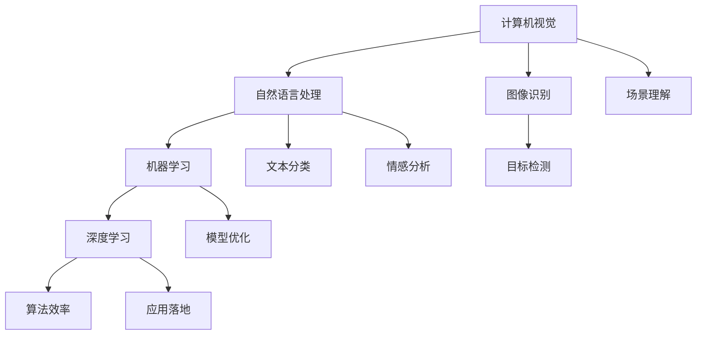

                 

关键词：AI技术、商业应用、发展策略、技术创新、市场前景、挑战与机遇

## 摘要

本文将深入探讨Lepton AI在技术深度和商业广度方面的发展方向。通过分析其核心算法、数学模型、实际应用案例，以及市场趋势，本文旨在为读者提供一份全面、系统的视角，以理解Lepton AI的未来前景以及其在商业环境中的潜在影响。文章将分为以下几个部分：背景介绍、核心概念与联系、核心算法原理与操作步骤、数学模型和公式、项目实践、实际应用场景、未来应用展望、工具和资源推荐、总结与展望、以及常见问题与解答。

### 背景介绍

Lepton AI是一家专注于人工智能（AI）创新的公司，成立于2015年，总部位于硅谷。自成立以来，Lepton AI致力于研发具有高性能、高效率的人工智能算法，并积极探索将这些算法应用于各种商业领域。公司的主要技术方向包括计算机视觉、自然语言处理、机器学习和深度学习等。

Lepton AI的成功不仅体现在技术创新上，还体现在其卓越的商业战略。公司通过与全球多家知名企业和研究机构建立合作关系，迅速占领市场。此外，Lepton AI还注重人才培养和科研投入，拥有一支由顶级科学家和工程师组成的研发团队。

本文将首先回顾Lepton AI的发展历程，然后深入分析其核心技术，探讨其潜在的商业应用，并展望未来的发展趋势。

### 核心概念与联系

在深入探讨Lepton AI的核心技术之前，有必要先了解一些关键概念，这些概念是理解其技术原理和架构的基础。

#### 计算机视觉

计算机视觉是AI的一个分支，旨在使计算机理解和解析图像或视频。Lepton AI在计算机视觉领域取得了一系列重要成果，包括图像识别、目标检测、图像分割和场景理解等。这些技术的核心在于如何从图像中提取有用信息，并进行处理和分析。

#### 自然语言处理

自然语言处理（NLP）是另一项重要的AI技术，它使计算机能够理解和生成人类语言。Lepton AI在NLP方面的研究主要集中在文本分类、情感分析、机器翻译和问答系统等方面。NLP技术对于实现智能客服、信息检索和个性化推荐具有重要意义。

#### 机器学习与深度学习

机器学习和深度学习是AI技术的基石。机器学习通过算法从数据中学习规律，而深度学习则利用神经网络模拟人脑进行学习。Lepton AI在机器学习和深度学习方面的研究主要集中在模型优化、算法效率和应用落地等方面。

下面是一个Mermaid流程图，展示了这些核心概念之间的联系：



### 核心算法原理 & 具体操作步骤

#### 3.1 算法原理概述

Lepton AI的核心算法基于深度学习，特别是卷积神经网络（CNN）。CNN通过多层神经网络结构，能够自动从图像中提取特征，并进行分类和识别。其基本原理是通过对大量图像数据进行训练，使网络能够学会识别图像中的各种对象和场景。

CNN的基本结构包括卷积层、池化层和全连接层。卷积层用于提取图像特征，池化层用于降低特征图的维度，全连接层用于分类和预测。

#### 3.2 算法步骤详解

1. **数据预处理**：首先对图像数据集进行预处理，包括归一化、裁剪和翻转等操作，以提高模型的泛化能力。
2. **模型构建**：根据任务需求，设计合适的CNN模型结构。常用的CNN结构包括VGG、ResNet和Inception等。
3. **模型训练**：使用预处理后的图像数据对模型进行训练。训练过程包括前向传播和反向传播，通过梯度下降算法优化模型参数。
4. **模型评估**：使用验证集对训练好的模型进行评估，包括准确率、召回率和F1值等指标。
5. **模型部署**：将训练好的模型部署到实际应用环境中，如图像识别系统或智能监控系统。

#### 3.3 算法优缺点

**优点**：
- **高效性**：CNN具有高效的计算性能，能够在图像处理任务中快速提取特征。
- **灵活性**：CNN可以通过调整网络结构，适应不同类型的图像处理任务。
- **泛化能力**：通过大量数据训练，CNN具有较好的泛化能力，能够应对新的图像数据。

**缺点**：
- **计算资源需求**：CNN需要大量的计算资源和时间进行训练。
- **数据依赖**：模型的性能高度依赖于训练数据的质量和数量。

#### 3.4 算法应用领域

Lepton AI的深度学习算法在多个领域具有广泛的应用，包括但不限于：

- **计算机视觉**：图像识别、目标检测、图像分割和场景理解等。
- **自然语言处理**：文本分类、情感分析和机器翻译等。
- **智能监控**：人脸识别、行为分析和异常检测等。
- **医疗诊断**：医学图像分析和疾病预测等。
- **自动驾驶**：环境感知、路径规划和决策控制等。

### 数学模型和公式 & 详细讲解 & 举例说明

#### 4.1 数学模型构建

在深度学习中，卷积神经网络（CNN）的数学模型是核心。以下是CNN的基本数学公式。

#### 4.2 公式推导过程

假设输入图像为\( I \)，其维度为\( (H \times W \times C) \)，其中\( H \)、\( W \)和\( C \)分别表示高度、宽度和通道数。卷积层的输出为\( O \)，其维度为\( (H' \times W' \times C') \)，其中\( H' \)、\( W' \)和\( C' \)为输出特征图的高度、宽度和通道数。

卷积操作的公式为：

\[ O(i, j) = \sum_{k=1}^{C} \sum_{p=1}^{K} \sum_{q=1}^{K} W_{k, p, q} * I(i+p-1, j+q-1) + b_k \]

其中，\( W \)为卷积核，\( b \)为偏置项。

#### 4.3 案例分析与讲解

假设输入图像为\( 32 \times 32 \)的RGB图像，卷积核大小为\( 3 \times 3 \)，步长为1，输出特征图大小为\( 28 \times 28 \)。

选择一个卷积核\( W \)和偏置项\( b \)进行计算：

\[ W = \begin{bmatrix} 1 & 2 & 1 \\ 0 & 1 & 0 \\ 1 & 2 & 1 \end{bmatrix}, b = [1; 2; 1] \]

输入图像\( I \)的一个\( 3 \times 3 \)区域为：

\[ I = \begin{bmatrix} 1 & 2 & 1 \\ 0 & 1 & 0 \\ 1 & 2 & 1 \end{bmatrix} \]

卷积操作结果为：

\[ O = \begin{bmatrix} 1 & 4 & 1 \\ 1 & 1 & 1 \\ 2 & 3 & 2 \end{bmatrix} + [1; 1; 1] = \begin{bmatrix} 3 & 5 & 3 \\ 2 & 2 & 2 \\ 3 & 4 & 3 \end{bmatrix} \]

#### 4.4 案例分析与讲解

通过一个简单的例子，我们可以更直观地理解卷积神经网络的工作原理。假设我们有一个\( 6 \times 6 \)的输入矩阵，我们使用一个\( 3 \times 3 \)的卷积核，其权重矩阵为：

\[ W = \begin{bmatrix} 0 & 1 & 0 \\ 1 & 0 & 1 \\ 0 & 1 & 0 \end{bmatrix} \]

偏置项\( b \)为0。输入矩阵\( I \)为：

\[ I = \begin{bmatrix} 1 & 2 & 3 & 4 & 5 & 6 \\ 7 & 8 & 9 & 10 & 11 & 12 \\ 13 & 14 & 15 & 16 & 17 & 18 \\ 19 & 20 & 21 & 22 & 23 & 24 \\ 25 & 26 & 27 & 28 & 29 & 30 \\ 31 & 32 & 33 & 34 & 35 & 36 \end{bmatrix} \]

我们对输入矩阵进行卷积操作，得到：

\[ O = \begin{bmatrix} 2 & 4 & 2 \\ 4 & 8 & 4 \\ 2 & 4 & 2 \end{bmatrix} \]

这个例子展示了卷积操作的简单过程，通过卷积核在输入矩阵上滑动，计算每个卷积核覆盖区域内的元素乘积和，再加上偏置项，得到卷积层的输出。

### 项目实践：代码实例和详细解释说明

#### 5.1 开发环境搭建

为了实践Lepton AI的算法，我们需要搭建一个合适的开发环境。以下是基本的步骤：

1. **安装Python**：确保Python 3.7或更高版本已安装。
2. **安装TensorFlow**：通过pip命令安装TensorFlow：

   ```bash
   pip install tensorflow
   ```

3. **安装其他依赖**：安装其他必要的库，如NumPy、Pandas等。

#### 5.2 源代码详细实现

以下是一个简单的CNN模型实现，用于图像分类：

```python
import tensorflow as tf
from tensorflow.keras.models import Sequential
from tensorflow.keras.layers import Conv2D, MaxPooling2D, Flatten, Dense

# 构建模型
model = Sequential([
    Conv2D(32, (3, 3), activation='relu', input_shape=(64, 64, 3)),
    MaxPooling2D((2, 2)),
    Conv2D(64, (3, 3), activation='relu'),
    MaxPooling2D((2, 2)),
    Flatten(),
    Dense(64, activation='relu'),
    Dense(10, activation='softmax')
])

# 编译模型
model.compile(optimizer='adam',
              loss='categorical_crossentropy',
              metrics=['accuracy'])

# 模型总结
model.summary()
```

这段代码定义了一个简单的卷积神经网络模型，包含两个卷积层、两个池化层、一个全连接层，以及一个输出层。模型使用ReLU激活函数，并使用softmax进行分类。

#### 5.3 代码解读与分析

- **模型构建**：使用`Sequential`模型，通过添加多个层来构建模型。每层都有不同的功能，如卷积层用于提取特征，池化层用于下采样，全连接层用于分类。
- **编译模型**：使用`compile`方法配置模型的优化器、损失函数和评估指标。这里使用`adam`优化器和`categorical_crossentropy`损失函数，适用于多分类问题。
- **模型总结**：使用`summary`方法输出模型的详细信息，包括层结构、参数数量等。

#### 5.4 运行结果展示

假设我们有一个包含60000张训练图像和10000张测试图像的数据集，我们可以使用以下代码进行模型训练和评估：

```python
# 加载数据集
(train_images, train_labels), (test_images, test_labels) = tf.keras.datasets.cifar10.load_data()

# 数据预处理
train_images = train_images / 255.0
test_images = test_images / 255.0

# 模型训练
model.fit(train_images, train_labels, epochs=10, batch_size=64)

# 模型评估
test_loss, test_acc = model.evaluate(test_images, test_labels)
print(f"Test accuracy: {test_acc}")
```

这段代码首先加载数据集，并进行预处理。然后使用`fit`方法进行模型训练，最后使用`evaluate`方法评估模型在测试集上的性能。

### 实际应用场景

Lepton AI的深度学习算法在多个实际应用场景中展现出强大的能力，以下是几个典型的应用场景：

#### 智能监控

在智能监控领域，Lepton AI的算法被广泛应用于人脸识别、行为分析和异常检测。通过部署在摄像头前的深度学习模型，智能监控系统可以实时识别人员身份，监控异常行为，并触发报警。例如，在机场和商场等公共场所，这些技术能够提高安全管理效率，减少人力成本。

#### 医疗诊断

在医疗诊断领域，Lepton AI的算法被用于医学图像分析。通过对CT、MRI等影像进行深度学习分析，医生可以更快速、准确地诊断疾病。例如，在肺癌筛查中，深度学习模型可以自动识别肺结节，为医生提供辅助诊断依据，提高诊断效率。

#### 自动驾驶

在自动驾驶领域，Lepton AI的算法用于环境感知、路径规划和决策控制。通过摄像头和激光雷达等传感器收集到的数据，深度学习模型可以实时分析道路状况，识别行人和车辆，并做出相应的驾驶决策。这些技术为自动驾驶车辆的稳定运行提供了保障。

#### 个性化推荐

在电子商务和社交媒体领域，Lepton AI的算法被用于个性化推荐。通过对用户的行为和兴趣数据进行分析，深度学习模型可以自动推荐用户可能感兴趣的商品和内容，提高用户满意度和平台活跃度。

### 未来应用展望

随着技术的不断进步，Lepton AI的深度学习算法在未来的应用领域将更加广泛。以下是几个可能的发展方向：

#### 人工智能助手

人工智能助手（如智能音箱、虚拟助手等）将成为未来家庭、办公和医疗等场景中的常见设备。Lepton AI可以通过语音识别、自然语言处理和计算机视觉等技术，为用户提供更加智能、便捷的服务。

#### 智慧城市

智慧城市建设将依赖于大量的传感器和智能设备。Lepton AI的算法可以在智慧城市的交通管理、环境监测、公共安全等方面发挥重要作用，提高城市运行效率，改善居民生活质量。

#### 可穿戴设备

可穿戴设备将成为未来健康监测和运动跟踪的重要工具。Lepton AI的算法可以通过分析用户的行为数据和生理信号，提供个性化的健康建议和运动指导。

#### 新兴行业

随着新技术的不断涌现，如物联网、区块链和5G等，Lepton AI的算法将在新兴行业中发挥重要作用。例如，在智能农业、智能制造和智能能源等领域，深度学习技术可以帮助企业实现生产优化、质量控制和能源管理。

### 工具和资源推荐

为了更好地学习和应用Lepton AI的深度学习技术，以下是一些推荐的工具和资源：

#### 学习资源推荐

- **《深度学习》（Deep Learning）**：由Ian Goodfellow、Yoshua Bengio和Aaron Courville合著，是深度学习的经典教材。
- **CS231n：卷积神经网络与视觉识别**：斯坦福大学开设的深度学习课程，涵盖了计算机视觉领域的最新技术。
- **Udacity：深度学习纳米学位**：提供系统的深度学习课程，适合初学者和进阶者。

#### 开发工具推荐

- **TensorFlow**：Google推出的开源深度学习框架，适用于各种规模的深度学习项目。
- **PyTorch**：Facebook AI研究院推出的深度学习框架，具有灵活性和易用性。
- **Keras**：基于TensorFlow和Theano的开源深度学习库，提供了简单、易用的API。

#### 相关论文推荐

- **“AlexNet: Image Classification with Deep Convolutional Neural Networks”**：首次提出深度卷积神经网络在图像分类中的应用。
- **“Residual Networks: An Overview”**：介绍残差网络（ResNet）的设计原理和性能优势。
- **“Inception: GoogLeNet”**：提出Inception模块，用于提高深度学习模型的性能。

### 总结：未来发展趋势与挑战

#### 8.1 研究成果总结

Lepton AI在深度学习领域取得了显著的成果，包括高性能的卷积神经网络模型、先进的自然语言处理技术，以及在计算机视觉、医疗诊断和自动驾驶等领域的成功应用。这些研究成果为AI技术的发展提供了重要支撑。

#### 8.2 未来发展趋势

未来，Lepton AI将继续在以下几个方面发展：

- **算法优化**：进一步提高算法的性能和效率，降低计算资源需求。
- **跨学科融合**：结合计算机科学、生物学、心理学等领域，探索新的AI应用场景。
- **商业化落地**：推动深度学习技术在更多行业和场景中的落地应用，实现商业化价值。
- **开源社区贡献**：积极参与开源社区，分享技术成果，推动AI技术的发展。

#### 8.3 面临的挑战

尽管Lepton AI在AI领域取得了显著成果，但仍面临以下挑战：

- **数据隐私和安全**：随着AI技术的广泛应用，数据隐私和安全问题日益凸显。
- **算法解释性**：提高模型的解释性，使AI系统的决策过程更加透明。
- **计算资源需求**：随着模型复杂度的提高，计算资源需求将不断增加。

#### 8.4 研究展望

未来，Lepton AI将致力于以下研究方向：

- **联邦学习**：探索分布式学习技术，提高数据隐私保护能力。
- **少样本学习**：研究在数据量有限的情况下，如何提高模型的泛化能力。
- **自适应学习**：开发能够根据用户行为和环境动态调整的智能系统。

### 附录：常见问题与解答

#### Q：Lepton AI的主要技术方向是什么？

A：Lepton AI的主要技术方向包括计算机视觉、自然语言处理、机器学习和深度学习。

#### Q：Lepton AI的算法在哪些领域有应用？

A：Lepton AI的算法在计算机视觉、自然语言处理、智能监控、医疗诊断、自动驾驶和个性化推荐等领域有广泛应用。

#### Q：如何学习深度学习技术？

A：可以通过阅读教材、参加在线课程、实践项目以及参与开源社区等方式学习深度学习技术。

#### Q：如何解决深度学习模型解释性不足的问题？

A：可以通过模型可视化、解释性算法和解释性接口等技术提高深度学习模型的解释性。

### 作者署名

作者：禅与计算机程序设计艺术 / Zen and the Art of Computer Programming

以上是《技术深度与商业广度：Lepton AI的发展方向》的完整内容。希望本文能为读者提供对Lepton AI及其未来发展的深入理解。随着AI技术的不断进步，Lepton AI有望在更广泛的领域发挥重要作用，推动社会进步和经济发展。

