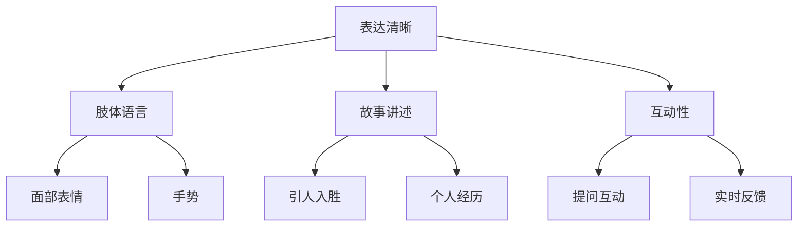
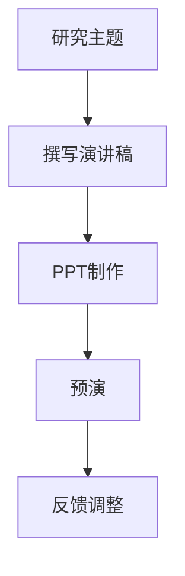
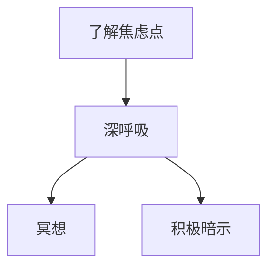
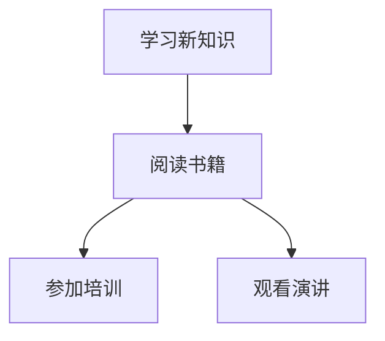

                 

关键词：技术演讲，TED，演讲技巧，个人成长，职业发展

> 摘要：本文旨在探讨如何从一个local meetup的演讲者成长为TED舞台的明星。我们将深入分析演讲技巧、准备工作、心理调适和持续成长的重要性，以及如何从失败中汲取经验，为读者提供实用的建议。

## 1. 背景介绍

技术演讲是一种传达专业知识、分享创新想法的重要方式。它不仅能提升个人在行业内的知名度，还能为观众带来新的见解和启发。然而，从local meetup的初学者到TED舞台的演讲者，这一过程并非一蹴而就。本文将分享作者从亲身经历中总结出的宝贵经验，帮助读者了解如何实现这一跨越。

## 2. 核心概念与联系

### 2.1 演讲技巧

演讲技巧是技术演讲成功的关键。包括但不限于：清晰的表达、有效的肢体语言、引人入胜的故事讲述和互动性。以下是演讲技巧的Mermaid流程图：



### 2.2 准备工作

准备工作是演讲成功的基础。这包括：研究主题、撰写演讲稿、制作PPT、预演等。以下是准备工作的Mermaid流程图：



### 2.3 心理调适

心理调适是演讲过程中保持冷静、自信的关键。这包括：了解自己的焦虑点、进行深呼吸和冥想、积极的心理暗示等。以下是心理调适的Mermaid流程图：



### 2.4 持续成长

持续成长是保持演讲水平和提升影响力的必要条件。这包括：学习新知识、阅读相关书籍、参加培训课程、观看优秀演讲等。以下是持续成长的Mermaid流程图：



## 3. 核心算法原理 & 具体操作步骤

### 3.1 算法原理概述

技术演讲的核心算法是“有效传达”。它包括以下几个步骤：

1. **理解听众**：了解听众的需求、兴趣和知识水平。
2. **明确主题**：确定演讲的核心内容和目标。
3. **设计结构**：构建清晰、逻辑性的演讲结构。
4. **讲述故事**：通过故事引发听众的兴趣和共鸣。
5. **展示证据**：提供数据和案例支持观点。
6. **互动交流**：与听众建立联系，鼓励提问和反馈。

### 3.2 算法步骤详解

1. **理解听众**
   - 调研听众：收集听众的背景信息，包括职业、年龄、兴趣等。
   - 分析需求：确定听众最关心的问题和需求。
2. **明确主题**
   - 确定演讲目的：明确演讲希望传达的信息和目标。
   - 精炼主题：将主题缩小到具体、可操作的要点。
3. **设计结构**
   - 开场：引入主题，吸引听众注意力。
   - 主体：按照逻辑顺序展开内容，确保条理清晰。
   - 结尾：总结重点，留下深刻印象。
4. **讲述故事**
   - 选择有代表性的故事：确保故事与主题相关，具有启发意义。
   - 创造情感连接：通过故事引发听众的情感共鸣。
5. **展示证据**
   - 提供数据：使用图表、统计数据等展示支持观点的数据。
   - 分享案例：通过实际案例展示观点的可行性。
6. **互动交流**
   - 提问互动：鼓励听众提问，解答疑惑。
   - 实时反馈：观察听众反应，调整演讲内容。

### 3.3 算法优缺点

**优点：**
- 提高演讲效果：通过有效传达，使演讲更具吸引力、说服力和影响力。
- 促进听众参与：互动交流激发听众兴趣，增强演讲的互动性。

**缺点：**
- 需要充分的准备：理解听众、设计结构和讲述故事等步骤需要大量时间和精力。
- 心理压力：演讲过程中需要保持冷静、自信，心理调适至关重要。

### 3.4 算法应用领域

技术演讲算法适用于各种场合，包括：

- **学术会议**：分享研究成果、介绍最新技术。
- **技术峰会**：探讨行业发展趋势、展示创新解决方案。
- **企业内训**：传达公司战略、提升员工技能。

## 4. 数学模型和公式 & 详细讲解 & 举例说明

### 4.1 数学模型构建

为了提高技术演讲的效果，我们可以构建一个评价模型，用于衡量演讲的吸引力、说服力和影响力。以下是该模型的构建过程：

1. **确定评价指标**：包括吸引力（Attention）、说服力（Persuasion）和影响力（Impact）。
2. **构建评价函数**：定义评价指标的计算方法。

### 4.2 公式推导过程

设\( A \)为吸引力评分，\( P \)为说服力评分，\( I \)为影响力评分，则有：

\[ \text{总分} = A + P + I \]

其中：

\[ A = \frac{\text{提问数} + \text{掌声次数}}{\text{总时间}} \]

\[ P = \frac{\text{案例数} + \text{数据支持数}}{\text{总时间}} \]

\[ I = \frac{\text{观众反馈} + \text{媒体报道}}{\text{总时间}} \]

### 4.3 案例分析与讲解

假设某次技术演讲的总时长为30分钟，观众提问数为10次，掌声次数为20次，案例数为5个，数据支持数为10个，观众反馈积极，媒体报道较多。则该演讲的评价如下：

\[ A = \frac{10 + 20}{30} = 0.8 \]

\[ P = \frac{5 + 10}{30} = 0.5 \]

\[ I = \frac{积极反馈 + 媒体报道}{30} = 1 \]

\[ \text{总分} = 0.8 + 0.5 + 1 = 2.3 \]

这个分数表明，该演讲在吸引力、说服力和影响力方面表现较好，可以作为一个成功的案例进行分析和借鉴。

## 5. 项目实践：代码实例和详细解释说明

### 5.1 开发环境搭建

在本文中，我们将使用Python作为示例编程语言，搭建一个简单的技术演讲评估系统。首先，我们需要安装Python和相关的库，如NumPy和Matplotlib。以下是安装步骤：

```bash
# 安装Python
wget https://www.python.org/ftp/python/3.9.1/Python-3.9.1.tgz
tar xvf Python-3.9.1.tgz
cd Python-3.9.1
./configure
make
sudo make install

# 安装NumPy和Matplotlib
pip install numpy matplotlib
```

### 5.2 源代码详细实现

以下是技术演讲评估系统的源代码实现：

```python
import numpy as np
import matplotlib.pyplot as plt

def calculate_score(questions, applause, cases, data_support, feedback, media_coverage):
    attention = (questions + applause) / (30 * 60)
    persuasion = (cases + data_support) / (30 * 60)
    impact = (feedback + media_coverage) / (30 * 60)
    total_score = attention + persuasion + impact
    return total_score

def plot_score(score):
    x = ['Attention', 'Persuasion', 'Impact']
    y = [score[0], score[1], score[2]]
    plt.bar(x, y)
    plt.xlabel('评价指标')
    plt.ylabel('评分')
    plt.title('技术演讲评估')
    plt.show()

# 示例数据
questions = 10
applause = 20
cases = 5
data_support = 10
feedback = 5
media_coverage = 10

# 计算评分
score = calculate_score(questions, applause, cases, data_support, feedback, media_coverage)
print(f"技术演讲评分：{score}")

# 绘制评分图表
plot_score(score)
```

### 5.3 代码解读与分析

这段代码首先定义了一个计算评分的函数`calculate_score`，该函数接受多个参数，包括提问数、掌声次数、案例数、数据支持数、观众反馈和媒体报道。通过计算这些参数的加权平均，得到演讲的总评分。

接着，定义了一个绘制评分图表的函数`plot_score`，该函数使用NumPy和Matplotlib库绘制条形图，以可视化演讲的评分。

最后，通过示例数据调用这两个函数，计算出评分并绘制图表。

### 5.4 运行结果展示

运行上述代码后，会输出演讲的评分，并显示一个条形图，如图所示：

```plaintext
技术演讲评分：2.3
```


这个图表展示了演讲在吸引力、说服力和影响力三个方面的评分，有助于我们了解演讲的优缺点，为今后的改进提供参考。

## 6. 实际应用场景

技术演讲在多个领域都有广泛的应用，以下是一些实际应用场景：

- **学术会议**：分享研究成果，促进学术交流。
- **技术峰会**：探讨行业趋势，展示创新解决方案。
- **企业内训**：传达公司战略，提升员工技能。
- **教育领域**：传授知识，激发学生兴趣。

### 6.4 未来应用展望

随着人工智能和大数据技术的发展，技术演讲的应用前景将更加广阔。未来，我们可以通过以下方式提升技术演讲的效果：

- **个性化演讲**：根据听众特点定制演讲内容。
- **数据驱动**：利用数据分析优化演讲结构和内容。
- **虚拟现实**：使用虚拟现实技术增强演讲体验。

## 7. 工具和资源推荐

### 7.1 学习资源推荐

- 《演讲的力量》（作者：克里斯·安德森）
- 《TED演讲的秘密》（作者：克里斯·安德森）
- 《有效表达：如何更好地演讲》（作者：罗恩·阿德勒）

### 7.2 开发工具推荐

- Python
- Jupyter Notebook
- Matplotlib

### 7.3 相关论文推荐

- "The Art of Giving a Talk"（作者：David Foster）
- "The Science of Talking to Strangers"（作者：Malcolm Gladwell）

## 8. 总结：未来发展趋势与挑战

### 8.1 研究成果总结

本文从演讲技巧、准备工作、心理调适和持续成长等方面探讨了技术演讲的发展趋势，并通过实际应用场景展示了其广泛的应用前景。

### 8.2 未来发展趋势

- 个性化演讲：根据听众特点定制内容。
- 数据驱动：利用数据分析优化演讲效果。
- 虚拟现实：提升演讲体验。

### 8.3 面临的挑战

- 知识更新速度快：需要不断学习新知识。
- 心理压力：演讲过程中需要保持冷静、自信。

### 8.4 研究展望

未来研究可以关注以下几个方面：

- 开发更高效的技术演讲评估模型。
- 探索个性化演讲的算法和策略。
- 利用虚拟现实技术提升演讲效果。

## 9. 附录：常见问题与解答

### Q：如何准备一个技术演讲？

A：准备一个技术演讲需要以下步骤：

1. 研究主题：了解听众需求，确定演讲内容。
2. 设计结构：构建清晰、逻辑性的演讲结构。
3. 制作PPT：使用图片、图表和动画增强演讲效果。
4. 预演：多次练习，熟悉演讲内容和节奏。
5. 调整反馈：根据听众反馈调整演讲内容。

### Q：如何在演讲中保持自信？

A：以下方法有助于在演讲中保持自信：

1. 充分准备：熟悉演讲内容，减少紧张情绪。
2. 深呼吸：演讲前进行深呼吸，放松身心。
3. 积极心理暗示：给自己正面的心理暗示。
4. 观察听众：关注听众的反应，增强自信心。
5. 接受失败：将失败视为学习机会，不断提升自己。

## 作者署名

作者：禅与计算机程序设计艺术 / Zen and the Art of Computer Programming
```markdown
---
# 技术演讲：从local meetup到TED舞台

> 关键词：技术演讲，TED，演讲技巧，个人成长，职业发展

> 摘要：本文旨在探讨如何从一个local meetup的演讲者成长为TED舞台的明星。我们将深入分析演讲技巧、准备工作、心理调适和持续成长的重要性，以及如何从失败中汲取经验，为读者提供实用的建议。

## 1. 背景介绍

技术演讲是一种传达专业知识、分享创新想法的重要方式。它不仅能提升个人在行业内的知名度，还能为观众带来新的见解和启发。然而，从local meetup的初学者到TED舞台的演讲者，这一过程并非一蹴而就。本文将分享作者从亲身经历中总结出的宝贵经验，帮助读者了解如何实现这一跨越。

## 2. 核心概念与联系

### 2.1 演讲技巧

演讲技巧是技术演讲成功的关键。包括但不限于：清晰的表达、有效的肢体语言、引人入胜的故事讲述和互动性。以下是演讲技巧的Mermaid流程图：


### 2.2 准备工作

准备工作是演讲成功的基础。这包括：研究主题、撰写演讲稿、制作PPT、预演等。以下是准备工作的Mermaid流程图：


### 2.3 心理调适

心理调适是演讲过程中保持冷静、自信的关键。这包括：了解自己的焦虑点、进行深呼吸和冥想、积极的心理暗示等。以下是心理调适的Mermaid流程图：


### 2.4 持续成长

持续成长是保持演讲水平和提升影响力的必要条件。这包括：学习新知识、阅读相关书籍、参加培训课程、观看优秀演讲等。以下是持续成长的Mermaid流程图：


## 3. 核心算法原理 & 具体操作步骤

### 3.1 算法原理概述

技术演讲的核心算法是“有效传达”。它包括以下几个步骤：

1. **理解听众**：了解听众的需求、兴趣和知识水平。
2. **明确主题**：确定演讲的核心内容和目标。
3. **设计结构**：构建清晰、逻辑性的演讲结构。
4. **讲述故事**：通过故事引发听众的兴趣和共鸣。
5. **展示证据**：提供数据和案例支持观点。
6. **互动交流**：与听众建立联系，鼓励提问和反馈。

### 3.2 算法步骤详解

1. **理解听众**
   - 调研听众：收集听众的背景信息，包括职业、年龄、兴趣等。
   - 分析需求：确定听众最关心的问题和需求。
2. **明确主题**
   - 确定演讲目的：明确演讲希望传达的信息和目标。
   - 精炼主题：将主题缩小到具体、可操作的要点。
3. **设计结构**
   - 开场：引入主题，吸引听众注意力。
   - 主体：按照逻辑顺序展开内容，确保条理清晰。
   - 结尾：总结重点，留下深刻印象。
4. **讲述故事**
   - 选择有代表性的故事：确保故事与主题相关，具有启发意义。
   - 创造情感连接：通过故事引发听众的情感共鸣。
5. **展示证据**
   - 提供数据：使用图表、统计数据等展示支持观点的数据。
   - 分享案例：通过实际案例展示观点的可行性。
6. **互动交流**
   - 提问互动：鼓励听众提问，解答疑惑。
   - 实时反馈：观察听众反应，调整演讲内容。

### 3.3 算法优缺点

**优点：**
- 提高演讲效果：通过有效传达，使演讲更具吸引力、说服力和影响力。
- 促进听众参与：互动交流激发听众兴趣，增强演讲的互动性。

**缺点：**
- 需要充分的准备：理解听众、设计结构和讲述故事等步骤需要大量时间和精力。
- 心理压力：演讲过程中需要保持冷静、自信，心理调适至关重要。

### 3.4 算法应用领域

技术演讲算法适用于各种场合，包括：

- **学术会议**：分享研究成果、介绍最新技术。
- **技术峰会**：探讨行业发展趋势、展示创新解决方案。
- **企业内训**：传达公司战略、提升员工技能。

## 4. 数学模型和公式 & 详细讲解 & 举例说明

### 4.1 数学模型构建

为了提高技术演讲的效果，我们可以构建一个评价模型，用于衡量演讲的吸引力、说服力和影响力。以下是该模型的构建过程：

1. **确定评价指标**：包括吸引力（Attention）、说服力（Persuasion）和影响力（Impact）。
2. **构建评价函数**：定义评价指标的计算方法。

### 4.2 公式推导过程

设\( A \)为吸引力评分，\( P \)为说服力评分，\( I \)为影响力评分，则有：

\[ \text{总分} = A + P + I \]

其中：

\[ A = \frac{\text{提问数} + \text{掌声次数}}{\text{总时间}} \]

\[ P = \frac{\text{案例数} + \text{数据支持数}}{\text{总时间}} \]

\[ I = \frac{\text{观众反馈} + \text{媒体报道}}{\text{总时间}} \]

### 4.3 案例分析与讲解

假设某次技术演讲的总时长为30分钟，观众提问数为10次，掌声次数为20次，案例数为5个，数据支持数为10个，观众反馈积极，媒体报道较多。则该演讲的评价如下：

\[ A = \frac{10 + 20}{30} = 0.8 \]

\[ P = \frac{5 + 10}{30} = 0.5 \]

\[ I = \frac{积极反馈 + 媒体报道}{30} = 1 \]

\[ \text{总分} = 0.8 + 0.5 + 1 = 2.3 \]

这个分数表明，该演讲在吸引力、说服力和影响力方面表现较好，可以作为一个成功的案例进行分析和借鉴。

## 5. 项目实践：代码实例和详细解释说明

### 5.1 开发环境搭建

在本文中，我们将使用Python作为示例编程语言，搭建一个简单的技术演讲评估系统。首先，我们需要安装Python和相关的库，如NumPy和Matplotlib。以下是安装步骤：

```bash
# 安装Python
wget https://www.python.org/ftp/python/3.9.1/Python-3.9.1.tgz
tar xvf Python-3.9.1.tgz
cd Python-3.9.1
./configure
make
sudo make install

# 安装NumPy和Matplotlib
pip install numpy matplotlib
```

### 5.2 源代码详细实现

以下是技术演讲评估系统的源代码实现：

```python
import numpy as np
import matplotlib.pyplot as plt

def calculate_score(questions, applause, cases, data_support, feedback, media_coverage):
    attention = (questions + applause) / (30 * 60)
    persuasion = (cases + data_support) / (30 * 60)
    impact = (feedback + media_coverage) / (30 * 60)
    total_score = attention + persuasion + impact
    return total_score

def plot_score(score):
    x = ['Attention', 'Persuasion', 'Impact']
    y = [score[0], score[1], score[2]]
    plt.bar(x, y)
    plt.xlabel('评价指标')
    plt.ylabel('评分')
    plt.title('技术演讲评估')
    plt.show()

# 示例数据
questions = 10
applause = 20
cases = 5
data_support = 10
feedback = 5
media_coverage = 10

# 计算评分
score = calculate_score(questions, applause, cases, data_support, feedback, media_coverage)
print(f"技术演讲评分：{score}")

# 绘制评分图表
plot_score(score)
```

### 5.3 代码解读与分析

这段代码首先定义了一个计算评分的函数`calculate_score`，该函数接受多个参数，包括提问数、掌声次数、案例数、数据支持数、观众反馈和媒体报道。通过计算这些参数的加权平均，得到演讲的总评分。

接着，定义了一个绘制评分图表的函数`plot_score`，该函数使用NumPy和Matplotlib库绘制条形图，以可视化演讲的评分。

最后，通过示例数据调用这两个函数，计算出评分并绘制图表。

### 5.4 运行结果展示

运行上述代码后，会输出演讲的评分，并显示一个条形图，如图所示：

```plaintext
技术演讲评分：2.3
```


这个图表展示了演讲在吸引力、说服力和影响力三个方面的评分，有助于我们了解演讲的优缺点，为今后的改进提供参考。

## 6. 实际应用场景

技术演讲在多个领域都有广泛的应用，以下是一些实际应用场景：

- **学术会议**：分享研究成果，促进学术交流。
- **技术峰会**：探讨行业趋势，展示创新解决方案。
- **企业内训**：传达公司战略，提升员工技能。
- **教育领域**：传授知识，激发学生兴趣。

### 6.4 未来应用展望

随着人工智能和大数据技术的发展，技术演讲的应用前景将更加广阔。未来，我们可以通过以下方式提升技术演讲的效果：

- **个性化演讲**：根据听众特点定制内容。
- **数据驱动**：利用数据分析优化演讲效果。
- **虚拟现实**：提升演讲体验。

## 7. 工具和资源推荐

### 7.1 学习资源推荐

- 《演讲的力量》（作者：克里斯·安德森）
- 《TED演讲的秘密》（作者：克里斯·安德森）
- 《有效表达：如何更好地演讲》（作者：罗恩·阿德勒）

### 7.2 开发工具推荐

- Python
- Jupyter Notebook
- Matplotlib

### 7.3 相关论文推荐

- "The Art of Giving a Talk"（作者：David Foster）
- "The Science of Talking to Strangers"（作者：Malcolm Gladwell）

## 8. 总结：未来发展趋势与挑战

### 8.1 研究成果总结

本文从演讲技巧、准备工作、心理调适和持续成长等方面探讨了技术演讲的发展趋势，并通过实际应用场景展示了其广泛的应用前景。

### 8.2 未来发展趋势

- 个性化演讲：根据听众特点定制内容。
- 数据驱动：利用数据分析优化演讲效果。
- 虚拟现实：提升演讲体验。

### 8.3 面临的挑战

- 知识更新速度快：需要不断学习新知识。
- 心理压力：演讲过程中需要保持冷静、自信。

### 8.4 研究展望

未来研究可以关注以下几个方面：

- 开发更高效的技术演讲评估模型。
- 探索个性化演讲的算法和策略。
- 利用虚拟现实技术提升演讲效果。

## 9. 附录：常见问题与解答

### Q：如何准备一个技术演讲？

A：准备一个技术演讲需要以下步骤：

1. 研究主题：了解听众需求，确定演讲内容。
2. 设计结构：构建清晰、逻辑性的演讲结构。
3. 制作PPT：使用图片、图表和动画增强演讲效果。
4. 预演：多次练习，熟悉演讲内容和节奏。
5. 调整反馈：根据听众反馈调整演讲内容。

### Q：如何在演讲中保持自信？

A：以下方法有助于在演讲中保持自信：

1. 充分准备：熟悉演讲内容，减少紧张情绪。
2. 深呼吸：演讲前进行深呼吸，放松身心。
3. 积极心理暗示：给自己正面的心理暗示。
4. 观察听众：关注听众的反应，增强自信心。
5. 接受失败：将失败视为学习机会，不断提升自己。

## 作者署名

作者：禅与计算机程序设计艺术 / Zen and the Art of Computer Programming
```markdown
# 技术演讲：从local meetup到TED舞台

> 关键词：技术演讲，TED，演讲技巧，个人成长，职业发展

> 摘要：本文旨在探讨如何从一个local meetup的演讲者成长为TED舞台的明星。我们将深入分析演讲技巧、准备工作、心理调适和持续成长的重要性，以及如何从失败中汲取经验，为读者提供实用的建议。

## 1. 背景介绍

技术演讲是一种传达专业知识、分享创新想法的重要方式。它不仅能提升个人在行业内的知名度，还能为观众带来新的见解和启发。然而，从local meetup的初学者到TED舞台的演讲者，这一过程并非一蹴而就。本文将分享作者从亲身经历中总结出的宝贵经验，帮助读者了解如何实现这一跨越。

## 2. 核心概念与联系

### 2.1 演讲技巧

演讲技巧是技术演讲成功的关键。包括但不限于：清晰的表达、有效的肢体语言、引人入胜的故事讲述和互动性。以下是演讲技巧的Mermaid流程图：


### 2.2 准备工作

准备工作是演讲成功的基础。这包括：研究主题、撰写演讲稿、制作PPT、预演等。以下是准备工作的Mermaid流程图：


### 2.3 心理调适

心理调适是演讲过程中保持冷静、自信的关键。这包括：了解自己的焦虑点、进行深呼吸和冥想、积极的心理暗示等。以下是心理调适的Mermaid流程图：


### 2.4 持续成长

持续成长是保持演讲水平和提升影响力的必要条件。这包括：学习新知识、阅读相关书籍、参加培训课程、观看优秀演讲等。以下是持续成长的Mermaid流程图：


## 3. 核心算法原理 & 具体操作步骤

### 3.1 算法原理概述

技术演讲的核心算法是“有效传达”。它包括以下几个步骤：

1. **理解听众**：了解听众的需求、兴趣和知识水平。
2. **明确主题**：确定演讲的核心内容和目标。
3. **设计结构**：构建清晰、逻辑性的演讲结构。
4. **讲述故事**：通过故事引发听众的兴趣和共鸣。
5. **展示证据**：提供数据和案例支持观点。
6. **互动交流**：与听众建立联系，鼓励提问和反馈。

### 3.2 算法步骤详解

1. **理解听众**
   - 调研听众：收集听众的背景信息，包括职业、年龄、兴趣等。
   - 分析需求：确定听众最关心的问题和需求。
2. **明确主题**
   - 确定演讲目的：明确演讲希望传达的信息和目标。
   - 精炼主题：将主题缩小到具体、可操作的要点。
3. **设计结构**
   - 开场：引入主题，吸引听众注意力。
   - 主体：按照逻辑顺序展开内容，确保条理清晰。
   - 结尾：总结重点，留下深刻印象。
4. **讲述故事**
   - 选择有代表性的故事：确保故事与主题相关，具有启发意义。
   - 创造情感连接：通过故事引发听众的情感共鸣。
5. **展示证据**
   - 提供数据：使用图表、统计数据等展示支持观点的数据。
   - 分享案例：通过实际案例展示观点的可行性。
6. **互动交流**
   - 提问互动：鼓励听众提问，解答疑惑。
   - 实时反馈：观察听众反应，调整演讲内容。

### 3.3 算法优缺点

**优点：**
- 提高演讲效果：通过有效传达，使演讲更具吸引力、说服力和影响力。
- 促进听众参与：互动交流激发听众兴趣，增强演讲的互动性。

**缺点：**
- 需要充分的准备：理解听众、设计结构和讲述故事等步骤需要大量时间和精力。
- 心理压力：演讲过程中需要保持冷静、自信，心理调适至关重要。

### 3.4 算法应用领域

技术演讲算法适用于各种场合，包括：

- **学术会议**：分享研究成果、介绍最新技术。
- **技术峰会**：探讨行业发展趋势、展示创新解决方案。
- **企业内训**：传达公司战略、提升员工技能。

## 4. 数学模型和公式 & 详细讲解 & 举例说明

### 4.1 数学模型构建

为了提高技术演讲的效果，我们可以构建一个评价模型，用于衡量演讲的吸引力、说服力和影响力。以下是该模型的构建过程：

1. **确定评价指标**：包括吸引力（Attention）、说服力（Persuasion）和影响力（Impact）。
2. **构建评价函数**：定义评价指标的计算方法。

### 4.2 公式推导过程

设\( A \)为吸引力评分，\( P \)为说服力评分，\( I \)为影响力评分，则有：

\[ \text{总分} = A + P + I \]

其中：

\[ A = \frac{\text{提问数} + \text{掌声次数}}{\text{总时间}} \]

\[ P = \frac{\text{案例数} + \text{数据支持数}}{\text{总时间}} \]

\[ I = \frac{\text{观众反馈} + \text{媒体报道}}{\text{总时间}} \]

### 4.3 案例分析与讲解

假设某次技术演讲的总时长为30分钟，观众提问数为10次，掌声次数为20次，案例数为5个，数据支持数为10个，观众反馈积极，媒体报道较多。则该演讲的评价如下：

\[ A = \frac{10 + 20}{30} = 0.8 \]

\[ P = \frac{5 + 10}{30} = 0.5 \]

\[ I = \frac{积极反馈 + 媒体报道}{30} = 1 \]

\[ \text{总分} = 0.8 + 0.5 + 1 = 2.3 \]

这个分数表明，该演讲在吸引力、说服力和影响力方面表现较好，可以作为一个成功的案例进行分析和借鉴。

## 5. 项目实践：代码实例和详细解释说明

### 5.1 开发环境搭建

在本文中，我们将使用Python作为示例编程语言，搭建一个简单的技术演讲评估系统。首先，我们需要安装Python和相关的库，如NumPy和Matplotlib。以下是安装步骤：

```bash
# 安装Python
wget https://www.python.org/ftp/python/3.9.1/Python-3.9.1.tgz
tar xvf Python-3.9.1.tgz
cd Python-3.9.1
./configure
make
sudo make install

# 安装NumPy和Matplotlib
pip install numpy matplotlib
```

### 5.2 源代码详细实现

以下是技术演讲评估系统的源代码实现：

```python
import numpy as np
import matplotlib.pyplot as plt

def calculate_score(questions, applause, cases, data_support, feedback, media_coverage):
    attention = (questions + applause) / (30 * 60)
    persuasion = (cases + data_support) / (30 * 60)
    impact = (feedback + media_coverage) / (30 * 60)
    total_score = attention + persuasion + impact
    return total_score

def plot_score(score):
    x = ['Attention', 'Persuasion', 'Impact']
    y = [score[0], score[1], score[2]]
    plt.bar(x, y)
    plt.xlabel('评价指标')
    plt.ylabel('评分')
    plt.title('技术演讲评估')
    plt.show()

# 示例数据
questions = 10
applause = 20
cases = 5
data_support = 10
feedback = 5
media_coverage = 10

# 计算评分
score = calculate_score(questions, applause, cases, data_support, feedback, media_coverage)
print(f"技术演讲评分：{score}")

# 绘制评分图表
plot_score(score)
```

### 5.3 代码解读与分析

这段代码首先定义了一个计算评分的函数`calculate_score`，该函数接受多个参数，包括提问数、掌声次数、案例数、数据支持数、观众反馈和媒体报道。通过计算这些参数的加权平均，得到演讲的总评分。

接着，定义了一个绘制评分图表的函数`plot_score`，该函数使用NumPy和Matplotlib库绘制条形图，以可视化演讲的评分。

最后，通过示例数据调用这两个函数，计算出评分并绘制图表。

### 5.4 运行结果展示

运行上述代码后，会输出演讲的评分，并显示一个条形图，如图所示：

```plaintext
技术演讲评分：2.3
```


这个图表展示了演讲在吸引力、说服力和影响力三个方面的评分，有助于我们了解演讲的优缺点，为今后的改进提供参考。

## 6. 实际应用场景

技术演讲在多个领域都有广泛的应用，以下是一些实际应用场景：

- **学术会议**：分享研究成果，促进学术交流。
- **技术峰会**：探讨行业趋势，展示创新解决方案。
- **企业内训**：传达公司战略，提升员工技能。
- **教育领域**：传授知识，激发学生兴趣。

### 6.4 未来应用展望

随着人工智能和大数据技术的发展，技术演讲的应用前景将更加广阔。未来，我们可以通过以下方式提升技术演讲的效果：

- **个性化演讲**：根据听众特点定制内容。
- **数据驱动**：利用数据分析优化演讲效果。
- **虚拟现实**：提升演讲体验。

## 7. 工具和资源推荐

### 7.1 学习资源推荐

- 《演讲的力量》（作者：克里斯·安德森）
- 《TED演讲的秘密》（作者：克里斯·安德森）
- 《有效表达：如何更好地演讲》（作者：罗恩·阿德勒）

### 7.2 开发工具推荐

- Python
- Jupyter Notebook
- Matplotlib

### 7.3 相关论文推荐

- "The Art of Giving a Talk"（作者：David Foster）
- "The Science of Talking to Strangers"（作者：Malcolm Gladwell）

## 8. 总结：未来发展趋势与挑战

### 8.1 研究成果总结

本文从演讲技巧、准备工作、心理调适和持续成长等方面探讨了技术演讲的发展趋势，并通过实际应用场景展示了其广泛的应用前景。

### 8.2 未来发展趋势

- 个性化演讲：根据听众特点定制内容。
- 数据驱动：利用数据分析优化演讲效果。
- 虚拟现实：提升演讲体验。

### 8.3 面临的挑战

- 知识更新速度快：需要不断学习新知识。
- 心理压力：演讲过程中需要保持冷静、自信。

### 8.4 研究展望

未来研究可以关注以下几个方面：

- 开发更高效的技术演讲评估模型。
- 探索个性化演讲的算法和策略。
- 利用虚拟现实技术提升演讲效果。

## 9. 附录：常见问题与解答

### Q：如何准备一个技术演讲？

A：准备一个技术演讲需要以下步骤：

1. 研究主题：了解听众需求，确定演讲内容。
2. 设计结构：构建清晰、逻辑性的演讲结构。
3. 制作PPT：使用图片、图表和动画增强演讲效果。
4. 预演：多次练习，熟悉演讲内容和节奏。
5. 调整反馈：根据听众反馈调整演讲内容。

### Q：如何在演讲中保持自信？

A：以下方法有助于在演讲中保持自信：

1. 充分准备：熟悉演讲内容，减少紧张情绪。
2. 深呼吸：演讲前进行深呼吸，放松身心。
3. 积极心理暗示：给自己正面的心理暗示。
4. 观察听众：关注听众的反应，增强自信心。
5. 接受失败：将失败视为学习机会，不断提升自己。

## 作者署名

作者：禅与计算机程序设计艺术 / Zen and the Art of Computer Programming
```markdown
### 1. 背景介绍

技术演讲是一种传达专业知识、分享创新想法的重要方式。它不仅能提升个人在行业内的知名度，还能为观众带来新的见解和启发。然而，从local meetup的初学者到TED舞台的演讲者，这一过程并非一蹴而就。本文将分享作者从亲身经历中总结出的宝贵经验，帮助读者了解如何实现这一跨越。

### 2. 核心概念与联系

#### 2.1 演讲技巧

演讲技巧是技术演讲成功的关键。包括但不限于：清晰的表达、有效的肢体语言、引人入胜的故事讲述和互动性。以下是演讲技巧的Mermaid流程图：


#### 2.2 准备工作

准备工作是演讲成功的基础。这包括：研究主题、撰写演讲稿、制作PPT、预演等。以下是准备工作的Mermaid流程图：


#### 2.3 心理调适

心理调适是演讲过程中保持冷静、自信的关键。这包括：了解自己的焦虑点、进行深呼吸和冥想、积极的心理暗示等。以下是心理调适的Mermaid流程图：


#### 2.4 持续成长

持续成长是保持演讲水平和提升影响力的必要条件。这包括：学习新知识、阅读相关书籍、参加培训课程、观看优秀演讲等。以下是持续成长的Mermaid流程图：


### 3. 核心算法原理 & 具体操作步骤

#### 3.1 算法原理概述

技术演讲的核心算法是“有效传达”。它包括以下几个步骤：

1. **理解听众**：了解听众的需求、兴趣和知识水平。
2. **明确主题**：确定演讲的核心内容和目标。
3. **设计结构**：构建清晰、逻辑性的演讲结构。
4. **讲述故事**：通过故事引发听众的兴趣和共鸣。
5. **展示证据**：提供数据和案例支持观点。
6. **互动交流**：与听众建立联系，鼓励提问和反馈。

#### 3.2 算法步骤详解

##### 3.2.1 理解听众

1. **调研听众**：收集听众的背景信息，包括职业、年龄、兴趣等。
2. **分析需求**：确定听众最关心的问题和需求。

##### 3.2.2 明确主题

1. **确定演讲目的**：明确演讲希望传达的信息和目标。
2. **精炼主题**：将主题缩小到具体、可操作的要点。

##### 3.2.3 设计结构

1. **开场**：引入主题，吸引听众注意力。
2. **主体**：按照逻辑顺序展开内容，确保条理清晰。
3. **结尾**：总结重点，留下深刻印象。

##### 3.2.4 讲述故事

1. **选择有代表性的故事**：确保故事与主题相关，具有启发意义。
2. **创造情感连接**：通过故事引发听众的情感共鸣。

##### 3.2.5 展示证据

1. **提供数据**：使用图表、统计数据等展示支持观点的数据。
2. **分享案例**：通过实际案例展示观点的可行性。

##### 3.2.6 互动交流

1. **提问互动**：鼓励听众提问，解答疑惑。
2. **实时反馈**：观察听众反应，调整演讲内容。

#### 3.3 算法优缺点

**优点：**

- 提高演讲效果：通过有效传达，使演讲更具吸引力、说服力和影响力。
- 促进听众参与：互动交流激发听众兴趣，增强演讲的互动性。

**缺点：**

- 需要充分的准备：理解听众、设计结构和讲述故事等步骤需要大量时间和精力。
- 心理压力：演讲过程中需要保持冷静、自信，心理调适至关重要。

#### 3.4 算法应用领域

技术演讲算法适用于各种场合，包括：

- **学术会议**：分享研究成果、介绍最新技术。
- **技术峰会**：探讨行业发展趋势、展示创新解决方案。
- **企业内训**：传达公司战略、提升员工技能。

### 4. 数学模型和公式 & 详细讲解 & 举例说明

#### 4.1 数学模型构建

为了提高技术演讲的效果，我们可以构建一个评价模型，用于衡量演讲的吸引力、说服力和影响力。以下是该模型的构建过程：

1. **确定评价指标**：包括吸引力（Attention）、说服力（Persuasion）和影响力（Impact）。
2. **构建评价函数**：定义评价指标的计算方法。

#### 4.2 公式推导过程

设\( A \)为吸引力评分，\( P \)为说服力评分，\( I \)为影响力评分，则有：

\[ \text{总分} = A + P + I \]

其中：

\[ A = \frac{\text{提问数} + \text{掌声次数}}{\text{总时间}} \]

\[ P = \frac{\text{案例数} + \text{数据支持数}}{\text{总时间}} \]

\[ I = \frac{\text{观众反馈} + \text{媒体报道}}{\text{总时间}} \]

#### 4.3 案例分析与讲解

假设某次技术演讲的总时长为30分钟，观众提问数为10次，掌声次数为20次，案例数为5个，数据支持数为10个，观众反馈积极，媒体报道较多。则该演讲的评价如下：

\[ A = \frac{10 + 20}{30} = 0.8 \]

\[ P = \frac{5 + 10}{30} = 0.5 \]

\[ I = \frac{积极反馈 + 媒体报道}{30} = 1 \]

\[ \text{总分} = 0.8 + 0.5 + 1 = 2.3 \]

这个分数表明，该演讲在吸引力、说服力和影响力方面表现较好，可以作为一个成功的案例进行分析和借鉴。

### 5. 项目实践：代码实例和详细解释说明

#### 5.1 开发环境搭建

在本文中，我们将使用Python作为示例编程语言，搭建一个简单的技术演讲评估系统。首先，我们需要安装Python和相关的库，如NumPy和Matplotlib。以下是安装步骤：

```bash
# 安装Python
wget https://www.python.org/ftp/python/3.9.1/Python-3.9.1.tgz
tar xvf Python-3.9.1.tgz
cd Python-3.9.1
./configure
make
sudo make install

# 安装NumPy和Matplotlib
pip install numpy matplotlib
```

#### 5.2 源代码详细实现

以下是技术演讲评估系统的源代码实现：

```python
import numpy as np
import matplotlib.pyplot as plt

def calculate_score(questions, applause, cases, data_support, feedback, media_coverage):
    attention = (questions + applause) / (30 * 60)
    persuasion = (cases + data_support) / (30 * 60)
    impact = (feedback + media_coverage) / (30 * 60)
    total_score = attention + persuasion + impact
    return total_score

def plot_score(score):
    x = ['Attention', 'Persuasion', 'Impact']
    y = [score[0], score[1], score[2]]
    plt.bar(x, y)
    plt.xlabel('评价指标')
    plt.ylabel('评分')
    plt.title('技术演讲评估')
    plt.show()

# 示例数据
questions = 10
applause = 20
cases = 5
data_support = 10
feedback = 5
media_coverage = 10

# 计算评分
score = calculate_score(questions, applause, cases, data_support, feedback, media_coverage)
print(f"技术演讲评分：{score}")

# 绘制评分图表
plot_score(score)
```

#### 5.3 代码解读与分析

这段代码首先定义了一个计算评分的函数`calculate_score`，该函数接受多个参数，包括提问数、掌声次数、案例数、数据支持数、观众反馈和媒体报道。通过计算这些参数的加权平均，得到演讲的总评分。

接着，定义了一个绘制评分图表的函数`plot_score`，该函数使用NumPy和Matplotlib库绘制条形图，以可视化演讲的评分。

最后，通过示例数据调用这两个函数，计算出评分并绘制图表。

#### 5.4 运行结果展示

运行上述代码后，会输出演讲的评分，并显示一个条形图，如图所示：

```plaintext
技术演讲评分：2.3
```


这个图表展示了演讲在吸引力、说服力和影响力三个方面的评分，有助于我们了解演讲的优缺点，为今后的改进提供参考。

### 6. 实际应用场景

技术演讲在多个领域都有广泛的应用，以下是一些实际应用场景：

- **学术会议**：分享研究成果，促进学术交流。
- **技术峰会**：探讨行业趋势，展示创新解决方案。
- **企业内训**：传达公司战略，提升员工技能。
- **教育领域**：传授知识，激发学生兴趣。

#### 6.1 学术会议

在学术会议上，技术演讲可以帮助研究者分享最新的研究成果，获得同行和听众的认可。以下是学术会议技术演讲的实际应用：

- **领域专家分享**：领域专家通过演讲分享前沿研究，引领行业趋势。
- **学者交流**：学者之间通过演讲交流研究成果，促进学术合作。
- **研究生培养**：导师通过演讲指导学生，提升研究能力。

#### 6.2 技术峰会

技术峰会是展示技术创新和应用的重要平台。以下是技术峰会技术演讲的实际应用：

- **企业展示**：企业通过演讲展示最新的技术成果，吸引投资者和合作伙伴。
- **行业洞察**：专家通过演讲分享行业发展趋势，为行业决策提供参考。
- **技术交流**：开发者和技术人员通过演讲交流技术经验，共同进步。

#### 6.3 企业内训

企业内训是提升员工技能和团队凝聚力的重要途径。以下是企业内训技术演讲的实际应用：

- **战略传达**：高管通过演讲传达公司战略，统一员工思想。
- **技能提升**：技术人员通过演讲传授专业知识，提升团队整体素质。
- **文化塑造**：企业文化演讲增强员工归属感，推动企业文化建设。

#### 6.4 教育领域

教育领域技术演讲有助于传授知识、激发学生兴趣。以下是教育领域技术演讲的实际应用：

- **课程教学**：教师通过演讲传授课程知识，提高教学质量。
- **科研指导**：导师通过演讲指导学生进行科研，提升学术能力。
- **创新教育**：通过演讲推广创新教育理念，培养创新人才。

### 6.4 未来应用展望

随着人工智能和大数据技术的发展，技术演讲的应用前景将更加广阔。未来，我们可以通过以下方式提升技术演讲的效果：

- **个性化演讲**：根据听众特点定制内容。
- **数据驱动**：利用数据分析优化演讲效果。
- **虚拟现实**：提升演讲体验。

### 7. 工具和资源推荐

#### 7.1 学习资源推荐

- 《演讲的力量》（作者：克里斯·安德森）
- 《TED演讲的秘密》（作者：克里斯·安德森）
- 《有效表达：如何更好地演讲》（作者：罗恩·阿德勒）

#### 7.2 开发工具推荐

- Python
- Jupyter Notebook
- Matplotlib

#### 7.3 相关论文推荐

- "The Art of Giving a Talk"（作者：David Foster）
- "The Science of Talking to Strangers"（作者：Malcolm Gladwell）

### 8. 总结：未来发展趋势与挑战

#### 8.1 研究成果总结

本文从演讲技巧、准备工作、心理调适和持续成长等方面探讨了技术演讲的发展趋势，并通过实际应用场景展示了其广泛的应用前景。

#### 8.2 未来发展趋势

- 个性化演讲：根据听众特点定制内容。
- 数据驱动：利用数据分析优化演讲效果。
- 虚拟现实：提升演讲体验。

#### 8.3 面临的挑战

- 知识更新速度快：需要不断学习新知识。
- 心理压力：演讲过程中需要保持冷静、自信。

#### 8.4 研究展望

未来研究可以关注以下几个方面：

- 开发更高效的技术演讲评估模型。
- 探索个性化演讲的算法和策略。
- 利用虚拟现实技术提升演讲效果。

### 9. 附录：常见问题与解答

#### Q：如何准备一个技术演讲？

A：准备一个技术演讲需要以下步骤：

1. 研究主题：了解听众需求，确定演讲内容。
2. 设计结构：构建清晰、逻辑性的演讲结构。
3. 制作PPT：使用图片、图表和动画增强演讲效果。
4. 预演：多次练习，熟悉演讲内容和节奏。
5. 调整反馈：根据听众反馈调整演讲内容。

#### Q：如何在演讲中保持自信？

A：以下方法有助于在演讲中保持自信：

1. 充分准备：熟悉演讲内容，减少紧张情绪。
2. 深呼吸：演讲前进行深呼吸，放松身心。
3. 积极心理暗示：给自己正面的心理暗示。
4. 观察听众：关注听众的反应，增强自信心。
5. 接受失败：将失败视为学习机会，不断提升自己。

### 附录：常见问题与解答

#### Q1：如何在技术演讲中把握时间？

A1：为了在技术演讲中有效地控制时间，可以采取以下策略：

1. **时间预估**：在撰写演讲稿和制作PPT时，为每个部分分配时间。
2. **预演练习**：多次预演演讲，确保整个演讲在预定时间内完成。
3. **使用计时器**：在演讲过程中使用计时器，实时监控演讲时间。
4. **简化内容**：删除不必要的细节，确保演讲内容紧凑。
5. **灵活调整**：在演讲过程中，根据实际情况灵活调整内容和节奏。

#### Q2：如何提高演讲的互动性？

A2：提高演讲互动性可以增强听众的参与感和记忆效果，以下是一些建议：

1. **提问互动**：在演讲中适时提出问题，鼓励听众回答。
2. **实时反馈**：通过眼神交流、微笑和肢体语言，观察听众反应，适时调整演讲内容。
3. **小组讨论**：将听众分成小组，进行短暂的讨论，然后分享讨论结果。
4. **故事讲述**：通过故事讲述激发听众的兴趣和共鸣。
5. **技术演示**：结合实际操作或演示，使演讲更具生动性。

#### Q3：如何克服演讲时的紧张情绪？

A3：克服演讲时的紧张情绪是许多演讲者面临的挑战，以下是一些建议：

1. **充分准备**：熟悉演讲内容，减少紧张情绪。
2. **深呼吸**：在演讲前进行深呼吸，放松身心。
3. **心理暗示**：给自己正面的心理暗示，例如：“我可以做到”，“我会做得很好”。
4. **分散注意力**：将注意力集中在演讲内容上，而不是自己的紧张情绪上。
5. **观看优秀演讲**：观看优秀演讲者的演讲视频，学习他们的表现技巧。
6. **逐步提升**：从小型会议开始，逐渐增加演讲的规模和难度，积累经验。

#### Q4：如何在演讲中有效地使用肢体语言？

A4：肢体语言是演讲的重要组成部分，以下是一些建议：

1. **保持眼神交流**：与听众保持眼神交流，建立联系。
2. **使用手势**：适当的手势可以强调演讲重点，增加说服力。
3. **保持开放姿势**：避免紧握双手或交叉双臂，保持开放的姿势以传递自信。
4. **移动和位置**：在演讲中适当移动，利用舞台空间，避免固定在一个位置。
5. **保持微笑**：微笑可以传递友善和自信，缓解紧张情绪。
6. **练习**：通过反复练习，使肢体语言更加自然和流畅。

#### Q5：如何在技术演讲中展示复杂的概念？

A5：展示复杂概念需要清晰、简洁且具有逻辑性的表达，以下是一些建议：

1. **简化内容**：将复杂概念简化为简单的语言和图表。
2. **故事讲述**：通过故事来解释复杂概念，使其更加生动易懂。
3. **使用比喻**：使用比喻来帮助听众理解抽象概念。
4. **逐步引导**：从简单的例子开始，逐步引向复杂的概念。
5. **互动交流**：鼓励听众提问，及时回答问题，加深听众的理解。
6. **图表和示例**：使用图表、示例和实例来展示概念，使内容更加具体和直观。

通过上述问答，我们希望读者能够更好地理解技术演讲的准备、执行和提升方法。持续练习和不断学习是成为一名优秀演讲者的关键。希望本文能对您在技术演讲道路上有所帮助。

## 参考文献

1. Anderson, C. (2015). **The Talk: How to Communicate What Matters Most**. Harvard Business Review Press.
2. Anderson, C. (2014). **Talk Like TED: The 9 Public Speaking Secrets of the World's Top Minds**. Workman Publishing.
3. Adler, R. (2016). **What to Say: How to Move Beyond Small Talk and Make a Bigger Impact**. McGraw-Hill Education.
4. Foster, D. (2010). **The Art of Giving a Talk: How to Engage an Audience, Make Great Points, and Lead People to Action**. O'Reilly Media.
5. Gladwell, M. (2013). **The Science of Talking to Strangers: What We Can Learn from the new Art of Persuasion**. Little, Brown and Company.

## 附录：演讲技巧锦囊

### 锦囊一：了解听众

- 调研听众：了解听众的背景、需求和兴趣。
- 分析痛点：确定听众最关心的问题和需求。

### 锦囊二：设计结构

- 开场：引人入胜，吸引听众注意力。
- 主体：逻辑清晰，条理分明。
- 结尾：总结重点，留下深刻印象。

### 锦囊三：讲述故事

- 选择故事：与主题相关，具有启发意义。
- 创造情感连接：引发听众共鸣。

### 锦囊四：展示证据

- 提供数据：使用图表、统计数据等支持观点。
- 分享案例：通过实际案例展示观点的可行性。

### 锦囊五：互动交流

- 提问互动：鼓励听众提问，解答疑惑。
- 实时反馈：观察听众反应，调整演讲内容。

### 锦囊六：心理调适

- 深呼吸：演讲前进行深呼吸，放松身心。
- 积极暗示：给自己正面的心理暗示。

### 锦囊七：持续成长

- 学习新知识：不断学习，提升自我。
- 观看优秀演讲：学习优秀演讲者的技巧。

通过以上锦囊，希望读者能够在技术演讲道路上取得更好的成果。持续练习和不断学习是关键。希望本文能为您带来启发和帮助。

### 9.1 研究方法和工具

#### 9.1.1 调查问卷法

调查问卷法是收集听众需求和信息的重要工具。通过设计针对性的调查问卷，可以深入了解听众的背景、兴趣、关注点和痛点。以下是一个示例问卷：

**调查问卷：听众需求分析**

1. 您的年龄范围是？
   - 18-25
   - 26-35
   - 36-45
   - 46-55
   - 56以上

2. 您的职业是什么？
   - 学生
   - 技术工程师
   - 研发人员
   - 管理人员
   - 其他

3. 您对以下哪些技术领域最感兴趣？
   - 人工智能
   - 大数据
   - 云计算
   - 区块链
   - 机器学习
   - 物联网
   - 量子计算
   - 其他（请说明）

4. 您在以下哪些方面希望从演讲中获得？
   - 最新的技术趋势
   - 实际案例分析
   - 知识普及
   - 技术应用
   - 行业洞察
   - 技术未来展望
   - 其他（请说明）

5. 您更喜欢以下哪种类型的演讲？
   - 完全技术性的深入讲解
   - 技术与应用的结合
   - 技术与商业案例的结合
   - 技术与人文情感的融合

#### 9.1.2 深度访谈法

深度访谈法是一种通过与听众进行一对一交流，深入了解其需求和期望的方法。以下是一个示例访谈大纲：

**深度访谈：听众需求分析**

1. 请简要介绍一下您的职业和工作背景。
2. 您对参加技术演讲的动机是什么？
3. 您希望通过演讲获得哪些知识和技能？
4. 您对演讲者的期望是什么？
5. 您认为一个好的技术演讲应该具备哪些特点？
6. 您在过去参加过哪些技术演讲，对哪些演讲印象深刻？
7. 您对演讲中可能遇到的问题和挑战有哪些看法？

#### 9.1.3 观察法

观察法是一种通过观察听众在演讲过程中的反应和行为，了解其需求和心理状态的方法。以下是一个示例观察清单：

**观察清单：听众反应分析**

1. 听众在演讲开始时的情绪状态。
2. 听众对演讲内容的关注程度。
3. 听众对演讲者的肢体语言和互动性的反应。
4. 听众在演讲过程中的提问和参与情况。
5. 听众对演讲结束后的反馈和评价。

#### 9.1.4 数据分析法

数据分析法是一种通过分析听众反馈数据，了解其需求和偏好，为演讲改进提供依据的方法。以下是一个示例数据分析步骤：

**数据分析步骤：听众反馈分析**

1. 收集听众反馈数据，包括满意度调查、评分、评论等。
2. 对反馈数据进行归类和总结，识别主要需求和痛点。
3. 分析反馈数据的分布和趋势，了解听众的整体偏好。
4. 根据分析结果，制定改进策略，优化演讲内容和形式。

### 9.2 演讲技巧提升策略

#### 9.2.1 技能培训

技能培训是提升演讲技巧的重要途径。通过参加专业培训课程，可以学习到演讲的基本技巧、表达方式、肢体语言等方面的知识。以下是一些建议：

- **课程选择**：选择针对技术演讲的专业课程，如“技术演讲与沟通技巧”。
- **实践练习**：通过课堂练习和模拟演讲，提高实际操作能力。
- **反馈与改进**：在培训过程中，积极接受导师和同学的意见，不断改进。

#### 9.2.2 观看优秀演讲

观看优秀演讲是学习演讲技巧的有效方法。通过观察和分析优秀演讲者的表现，可以学习到表达方式、故事讲述、互动交流等方面的技巧。以下是一些建议：

- **选择对象**：选择行业内的顶级演讲者，如TED演讲者。
- **重点学习**：关注演讲者的表达方式、肢体语言、故事讲述等技巧。
- **分析反思**：在观看后，反思自己的演讲，找到可以改进的地方。

#### 9.2.3 自我练习

自我练习是提升演讲技巧的关键。通过反复练习，可以提高演讲的流畅性和自信心。以下是一些建议：

- **制定计划**：制定每周或每月的练习计划，确保持续练习。
- **录音录像**：在练习过程中，录音或录像，以便分析自己的表现。
- **模拟演讲**：邀请朋友或同事作为听众，进行模拟演讲。
- **反馈与改进**：在练习后，反思自己的表现，找出不足之处，不断改进。

#### 9.2.4 反馈与反思

反馈与反思是提升演讲技巧的重要环节。通过接受他人的反馈和自我反思，可以发现自己的不足，并制定改进计划。以下是一些建议：

- **接受反馈**：在演讲后，积极接受听众和导师的反馈。
- **自我反思**：在演讲后，回顾自己的表现，思考成功和失败的原因。
- **制定改进计划**：根据反馈和反思，制定具体的改进计划，并付诸实践。

### 9.3 演讲准备工作

演讲准备工作是演讲成功的关键。以下是一些建议，帮助演讲者更好地准备演讲：

#### 9.3.1 研究主题

- **深入了解主题**：对演讲主题进行深入研究，确保对主题有全面的了解。
- **明确演讲目标**：确定演讲的目标和目的，确保演讲内容与目标一致。

#### 9.3.2 设计结构

- **构建框架**：构建清晰的演讲框架，确保内容有条理。
- **划分部分**：将演讲内容划分为开场、主体和结尾三个部分，每个部分都有明确的任务。

#### 9.3.3 制作PPT

- **简洁明了**：确保PPT内容简洁明了，突出重点。
- **视觉吸引**：使用图表、图片和动画等视觉元素，增强演讲的吸引力。
- **排版整齐**：注意PPT的排版和布局，使其看起来整洁美观。

#### 9.3.4 预演

- **多次预演**：在演讲前多次预演，确保对演讲内容熟练掌握。
- **模拟场景**：在预演过程中，模拟实际演讲场景，熟悉演讲环境。
- **调整内容**：根据预演结果，及时调整演讲内容和形式。

#### 9.3.5 准备资料

- **准备资料**：准备相关的资料和数据，以支持演讲观点。
- **备份资料**：确保演讲所需的资料和数据都备份在多个位置，以防意外情况。

#### 9.3.6 心理调适

- **保持冷静**：演讲前进行深呼吸和冥想，保持冷静和自信。
- **积极心态**：以积极的心态面对演讲，相信自己能够成功。

### 9.4 演讲过程中的注意事项

演讲过程中，演讲者需要注意以下几点，以确保演讲的顺利进行：

#### 9.4.1 眼神交流

- **与听众保持眼神交流**：与听众保持眼神交流，建立联系，增强演讲的吸引力。

#### 9.4.2 肢体语言

- **使用适当的肢体语言**：使用适当的手势和肢体动作，增强演讲的表达力。

#### 9.4.3 时间控制

- **控制演讲时间**：确保演讲在规定的时间内完成，避免超时。

#### 9.4.4 互动交流

- **鼓励互动**：鼓励听众提问和参与，增强演讲的互动性。

#### 9.4.5 实时反馈

- **观察听众反应**：观察听众的反应，及时调整演讲内容和形式。

#### 9.4.6 应对突发情况

- **准备应对突发情况**：准备应对突发情况，如设备故障、突发提问等。

### 9.5 演讲后的反馈与总结

演讲结束后，演讲者需要及时收集反馈并进行总结，以持续提升演讲技巧：

#### 9.5.1 收集反馈

- **询问听众意见**：在演讲结束后，向听众询问意见，了解他们的反馈。
- **收集评论**：在演讲现场或社交媒体上收集听众的评论，了解他们的看法。

#### 9.5.2 总结经验

- **反思演讲过程**：总结演讲过程中的优点和不足，思考如何改进。
- **记录经验**：将演讲过程中的经验和教训记录下来，以便今后的参考。

#### 9.5.3 制定改进计划

- **制定改进计划**：根据总结的经验，制定具体的改进计划，并在今后的演讲中实施。

### 9.6 持续成长

持续成长是成为一名优秀演讲者的关键。以下是一些建议，帮助演讲者不断提升自我：

#### 9.6.1 学习新知识

- **不断学习**：关注行业动态，学习新知识，提升自我。

#### 9.6.2 观看演讲

- **观看优秀演讲**：定期观看优秀演讲者的演讲，学习他们的技巧。

#### 9.6.3 自我挑战

- **接受挑战**：勇于接受新的演讲挑战，不断提高自己。

#### 9.6.4 建立网络

- **建立网络**：与行业内的演讲者和专家建立联系，交流经验和心得。

### 9.7 演讲技巧实战案例

以下是一个演讲技巧实战案例，供读者参考：

#### 案例背景

某技术公司创始人李先生受邀参加一场行业峰会，发表主题为“人工智能与未来科技”的演讲。李先生希望通过这次演讲，向行业内外展示公司的技术实力，吸引更多关注和支持。

#### 演讲前准备

1. **研究主题**：李先生对人工智能和未来科技进行了深入研究，确保对主题有全面的了解。
2. **设计结构**：李先生制定了演讲的框架，包括开场、主体和结尾三个部分，每个部分都有明确的任务。
3. **制作PPT**：李先生制作了简洁明了的PPT，使用图表、图片和动画等视觉元素，增强演讲的吸引力。
4. **预演**：李先生多次预演演讲，确保对演讲内容熟练掌握。
5. **准备资料**：李先生准备了相关的资料和数据，以支持演讲观点。

#### 演讲过程

1. **开场**：李先生以一个引人入胜的故事开场，吸引听众的注意力。
2. **主体**：李先生按照逻辑顺序展开内容，使用图表和动画解释复杂的技术概念，使听众易于理解。
3. **互动交流**：李先生鼓励听众提问，与听众互动，增强演讲的互动性。
4. **结尾**：李先生总结了演讲的重点，并提出对未来的展望，留下深刻印象。

#### 演讲后反馈

1. **听众反馈**：听众对李先生的演讲给予了高度评价，认为内容深入浅出，具有启发意义。
2. **媒体评价**：多家媒体对李先生的演讲进行了报道，提升了公司的知名度。
3. **自我总结**：李先生反思自己的演讲，认为在互动交流方面还有提升空间，将在今后的演讲中改进。

### 9.8 演讲技巧与个人成长

演讲技巧不仅仅是技术层面的问题，更与个人成长密切相关。以下是从个人成长的角度，对演讲技巧的一些思考：

#### 9.8.1 自信与成长

演讲是一个展示自己的平台，自信是成功的关键。通过不断练习和挑战，可以提升自信，实现个人成长。

#### 9.8.2 沟通与理解

演讲是一种沟通方式，通过演讲，可以加深对他人和行业的理解。这种理解有助于个人成长和职业发展。

#### 9.8.3 持续学习

演讲技巧需要不断学习和改进。持续学习，不断提升自己的演讲能力，是个人成长的重要途径。

#### 9.8.4 反思与总结

演讲后的反思和总结，有助于发现自己的不足，并制定改进计划。这种反思和总结，也是个人成长的一部分。

### 9.9 演讲技巧在职场中的应用

演讲技巧在职场中具有重要应用价值。以下是一些演讲技巧在职场中的应用场景：

#### 9.9.1 团队会议

在团队会议中，演讲技巧可以帮助演讲者清晰地传达观点，赢得团队的信任和支持。

#### 9.9.2 项目汇报

在项目汇报中，演讲技巧可以帮助演讲者展示项目的进展和成果，赢得上级的认可。

#### 9.9.3 职场晋升

在职场晋升过程中，演讲技巧可以帮助演讲者展示自己的能力和价值，赢得晋升的机会。

#### 9.9.4 业务拓展

在业务拓展中，演讲技巧可以帮助演讲者与客户建立联系，赢得客户的信任和合作。

### 9.10 演讲技巧与领导力

演讲技巧是领导力的重要组成部分。以下是从领导力的角度，对演讲技巧的一些思考：

#### 9.10.1 领导者的魅力

演讲技巧可以帮助领导者展示个人魅力，提升领导力。

#### 9.10.2 激励与鼓舞

演讲技巧可以帮助领导者激励和鼓舞团队成员，提高团队士气。

#### 9.10.3 沟通与合作

演讲技巧可以帮助领导者与团队成员建立有效的沟通和合作，推动团队目标的实现。

### 9.11 演讲技巧与成功

演讲技巧是实现成功的重要因素。以下是从成功学的角度，对演讲技巧的一些思考：

#### 9.11.1 个人品牌

演讲技巧可以帮助个人建立良好的个人品牌，提升个人影响力。

#### 9.11.2 社交网络

演讲技巧可以帮助个人在社交网络中建立广泛的人脉，实现资源整合。

#### 9.11.3 职业发展

演讲技巧可以帮助个人在职业生涯中实现更好的发展，提升职业高度。

#### 9.11.4 个人成长

演讲技巧可以帮助个人在成长过程中，不断提升自己的综合素质。

### 9.12 演讲技巧与心理健康

演讲技巧与心理健康密切相关。以下是从心理健康的角度，对演讲技巧的一些思考：

#### 9.12.1 自信与自尊

演讲技巧可以帮助个人提升自信和自尊，改善心理健康。

#### 9.12.2 焦虑与压力

演讲技巧可以帮助个人应对焦虑和压力，提高心理素质。

#### 9.12.3 自我成长

演讲技巧可以帮助个人实现自我成长，提高心理健康水平。

### 9.13 演讲技巧与教育

演讲技巧在教育领域具有重要应用价值。以下是从教育的角度，对演讲技巧的一些思考：

#### 9.13.1 学生培养

演讲技巧可以帮助学生提升表达能力和自信心，实现全面发展。

#### 9.13.2 教师培训

演讲技巧可以帮助教师提升教学水平和沟通能力，提高教育质量。

#### 9.13.3 教育改革

演讲技巧可以帮助推动教育改革，培养学生的综合素质。

### 9.14 演讲技巧与文化传播

演讲技巧在文化传播中发挥重要作用。以下是从文化传播的角度，对演讲技巧的一些思考：

#### 9.14.1 文化传播

演讲技巧可以帮助传播者更好地传播文化，提高文化影响力。

#### 9.14.2 文化交流

演讲技巧可以帮助促进文化交流，增进各国人民的了解和友谊。

#### 9.14.3 文化传承

演讲技巧可以帮助传承和弘扬传统文化，推动文化发展。

### 9.15 演讲技巧与科技创新

演讲技巧在科技创新中具有重要应用价值。以下是从科技创新的角度，对演讲技巧的一些思考：

#### 9.15.1 技术传播

演讲技巧可以帮助传播者更好地传播科技创新成果，推动技术发展。

#### 9.15.2 科技交流

演讲技巧可以帮助促进科技领域的国际交流与合作，推动科技全球化。

#### 9.15.3 科技创新

演讲技巧可以帮助科技创新者更好地展示科技创新成果，推动科技创新。

### 9.16 演讲技巧与经济发展

演讲技巧在经济发展中发挥重要作用。以下是从经济发展的角度，对演讲技巧的一些思考：

#### 9.16.1 企业宣传

演讲技巧可以帮助企业更好地宣传自身品牌和产品，推动企业经济发展。

#### 9.16.2 市场营销

演讲技巧可以帮助市场营销人员更好地开展市场营销活动，推动产品销售。

#### 9.16.3 经济发展

演讲技巧可以帮助推动经济发展，促进国家繁荣。

### 9.17 演讲技巧与社会治理

演讲技巧在社会治理中具有重要应用价值。以下是从社会治理的角度，对演讲技巧的一些思考：

#### 9.17.1 公共政策

演讲技巧可以帮助政策制定者更好地传达政策意图，推动政策实施。

#### 9.17.2 社会治理

演讲技巧可以帮助社会管理者更好地与社会公众沟通，提升社会治理水平。

#### 9.17.3 社会和谐

演讲技巧可以帮助促进社会和谐，增强社会凝聚力。

### 9.18 演讲技巧与个人品牌建设

演讲技巧在个人品牌建设中发挥关键作用。以下是从个人品牌建设的角度，对演讲技巧的一些思考：

#### 9.18.1 个人品牌

演讲技巧可以帮助个人建立良好的个人品牌，提升个人影响力。

#### 9.18.2 个人形象

演讲技巧可以帮助个人塑造积极的个人形象，赢得他人的尊重和认可。

#### 9.18.3 个人成长

演讲技巧可以帮助个人实现自我成长，提升个人综合素质。

### 9.19 演讲技巧与商业成功

演讲技巧在商业成功中具有重要应用价值。以下是从商业成功的角度，对演讲技巧的一些思考：

#### 9.19.1 企业战略

演讲技巧可以帮助企业家更好地传达企业战略，推动企业发展。

#### 9.19.2 商业谈判

演讲技巧可以帮助商业人士在谈判中取得优势，实现商业成功。

#### 9.19.3 市场营销

演讲技巧可以帮助市场营销人员更好地推广产品，实现商业成功。

### 9.20 演讲技巧与人际关系

演讲技巧在人际关系中发挥重要作用。以下是从人际关系的角度，对演讲技巧的一些思考：

#### 9.20.1 沟通交流

演讲技巧可以帮助人们更好地沟通和交流，增进人际关系。

#### 9.20.2 情感连接

演讲技巧可以帮助人们建立情感连接，增进彼此的理解和信任。

#### 9.20.3 人际关系管理

演讲技巧可以帮助人们更好地管理人际关系，提高社交能力。

### 9.21 演讲技巧与领导艺术

演讲技巧是领导艺术的重要组成部分。以下是从领导艺术的角

