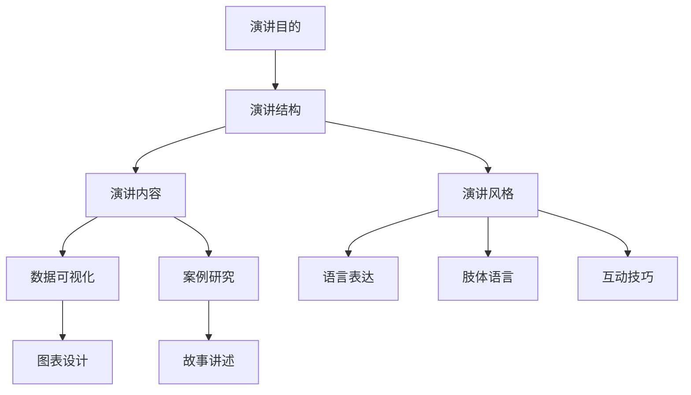

                 

关键词：TED演讲、技术演讲、演讲技巧、个人品牌、影响力、演讲设计

> 摘要：本文旨在探讨如何通过精心设计和准备，打造一场令人难忘的个人TED演讲。我们不仅将讨论技术演讲的基本原则，还将深入分析演讲技巧，分享成功案例，并提供实用的建议，帮助读者提升自己的演讲能力，实现个人品牌的影响力最大化。

## 1. 背景介绍

TED演讲以其独特的方式，吸引了全球数百万观众的目光。它不仅仅是分享知识的平台，更是展示个人魅力和独特视角的舞台。作为一名技术专家，能够在TED演讲中分享自己的研究成果和创新理念，无疑是莫大的荣誉。然而，如何在这个竞争激烈的环境中脱颖而出，成为观众心中不可忘怀的演讲者，是一门需要精心研究的艺术。

本文将围绕以下几个方面展开讨论：

- 技术演讲的基本原则和结构
- 演讲技巧的深入分析
- 成功案例分享
- 实用的建议和策略
- 个人品牌建设与影响力提升

## 2. 核心概念与联系

在探讨如何打造一场成功的技术TED演讲之前，我们需要理解几个核心概念，包括演讲的目的、结构、内容和风格。以下是使用Mermaid绘制的流程图，展示这些核心概念之间的关系：



### 2.1 演讲目的

演讲的目的决定了整个演讲的基调和发展方向。对于技术TED演讲来说，目的通常包括：

- 分享创新理念和研究成果
- 激发观众思考并产生行动
- 塑造个人品牌形象

### 2.2 演讲结构

演讲结构是演讲的骨架，它决定了信息的传达方式和观众的接受度。一个典型的技术TED演讲结构包括：

- 开场白：吸引注意，建立联系
- 主旨陈述：清晰表达演讲核心观点
- 证据和案例：支持观点，增强说服力
- 结论：总结要点，留下深刻印象

### 2.3 演讲内容

演讲内容是演讲的核心，它直接关系到演讲的质量。技术演讲的内容通常包括：

- 数据分析：通过图表和数据来展示研究成果
- 案例研究：通过实际案例来阐述理论应用
- 研究发现：明确的研究结果和结论
- 未来展望：对行业发展的预测和思考

### 2.4 演讲风格

演讲风格是演讲者个性和魅力的体现，它直接影响观众的感受和演讲的影响力。技术TED演讲的风格可以多样，但以下几种风格尤为受欢迎：

- 严谨：逻辑清晰，数据准确
- 生动：故事性强，易于理解
- 互动：与观众互动，增加参与感
- 感人：情感充沛，触动人心

通过以上Mermaid流程图，我们可以清晰地看到演讲的各个核心概念是如何相互联系和影响的。理解这些概念和它们之间的关系，是打造一场成功技术TED演讲的基础。

## 3. 核心算法原理 & 具体操作步骤

### 3.1 算法原理概述

在TED演讲中，成功的演讲不仅仅依赖于演讲者的魅力，更需要一套科学的演讲设计算法。这套算法涵盖了内容的选择、结构的规划、互动的设计等方面，可以确保演讲的信息传递效率最大化。以下是演讲设计算法的几个关键步骤：

1. **目标定位**：确定演讲的目的和受众，明确演讲的主题和核心观点。
2. **内容规划**：根据目标定位，规划演讲的内容，包括主旨、证据、案例和结论。
3. **结构设计**：设计演讲的结构，确保信息传递的连贯性和逻辑性。
4. **风格定位**：确定演讲的风格，以匹配演讲内容和目标受众的特点。
5. **互动设计**：设计互动环节，提高观众的参与感和注意力。

### 3.2 算法步骤详解

#### 3.2.1 目标定位

目标定位是演讲设计的第一步，它决定了演讲的方向和深度。具体步骤如下：

1. **确定演讲目的**：明确演讲的目的是分享知识、激发思考还是塑造个人品牌。
2. **分析受众**：了解受众的需求、兴趣和背景，确保演讲内容对他们有吸引力。
3. **选择主题**：根据目的和受众，选择一个具有针对性和影响力的主题。

#### 3.2.2 内容规划

内容规划是演讲设计的核心，它决定了演讲的质量和深度。具体步骤如下：

1. **确定主旨**：明确演讲的核心观点，确保观众能够清晰地理解演讲的主旨。
2. **收集证据**：收集支持主旨的证据，包括数据、案例和研究结果。
3. **设计案例**：根据证据设计具体的案例，使观众能够直观地理解主旨。
4. **准备结论**：总结演讲内容，提出具体的行动建议或思考方向。

#### 3.2.3 结构设计

结构设计是确保演讲信息传递连贯性和逻辑性的关键。具体步骤如下：

1. **设计开场白**：通过引人入胜的故事、提问或数据，吸引观众的注意力。
2. **设计主旨陈述**：在开场白之后，清晰地陈述演讲的主旨，确保观众理解演讲的核心。
3. **设计证据和案例**：通过数据、图表、案例等方式，支持主旨，增强说服力。
4. **设计结论**：在证据和案例之后，总结演讲内容，提出具体的行动建议或思考方向。
5. **设计结尾**：通过强调主旨或提出问题，给观众留下深刻的印象。

#### 3.2.4 风格定位

风格定位是演讲设计中的重要一环，它决定了演讲的个性和魅力。具体步骤如下：

1. **分析个人特点**：了解自己的性格、兴趣和专业领域，确定适合的演讲风格。
2. **选择风格**：根据个人特点，选择严谨、生动、互动或感人等风格。
3. **调整风格**：根据受众和演讲内容，适当调整风格，以确保演讲的吸引力。

#### 3.2.5 互动设计

互动设计是提高观众参与感和注意力的重要手段。具体步骤如下：

1. **确定互动方式**：根据演讲内容和风格，选择提问、讨论、互动游戏等方式。
2. **设计互动环节**：在演讲的关键时刻，设计互动环节，提高观众的参与度。
3. **引导互动**：通过语言、肢体语言和互动工具，引导观众参与互动，营造活跃的氛围。

### 3.3 算法优缺点

#### 优点

- **高效性**：通过科学的设计和准备，可以确保演讲的信息传递效率最大化。
- **灵活性**：算法的各个步骤可以根据实际情况进行调整，以适应不同的演讲场景。
- **系统性**：算法的系统性设计，可以确保演讲的各个部分相互协调，形成一个完整的体系。

#### 缺点

- **复杂性**：算法的设计和实施需要一定的专业知识和经验，对于初学者来说可能较为困难。
- **依赖性**：过度依赖算法可能导致演讲缺乏个性和灵活性，失去独特性。

### 3.4 算法应用领域

算法广泛应用于各种类型的演讲，包括技术演讲、商业演讲、教育演讲等。在技术演讲中，算法的应用尤为重要，它可以帮助演讲者更好地展示研究成果和创新理念，提高演讲的说服力和影响力。

## 4. 数学模型和公式 & 详细讲解 & 举例说明

### 4.1 数学模型构建

在技术演讲中，数学模型和公式是不可或缺的组成部分。它们不仅能够直观地展示研究过程和结果，还能够增强演讲的说服力和科学性。构建数学模型需要以下几个关键步骤：

1. **确定研究问题**：明确研究的目标和问题，这将指导整个数学模型的构建过程。
2. **选择合适的数学工具**：根据研究问题和数据特点，选择合适的数学工具，如线性代数、概率论、统计分析等。
3. **建立数学模型**：通过数学工具和理论，建立能够描述研究问题的数学模型。
4. **验证和优化模型**：通过实际数据验证模型的准确性，并对模型进行必要的优化。

### 4.2 公式推导过程

在技术演讲中，公式推导过程是展示研究过程和结果的重要环节。以下是一个简单的公式推导示例：

#### 示例：线性回归公式推导

**目标**：推导线性回归公式，用以描述因变量（Y）与自变量（X）之间的关系。

**步骤**：

1. **设定线性关系**：假设因变量Y与自变量X之间存在线性关系，即Y = aX + b。

2. **最小二乘法**：为了找到最佳的a和b，我们使用最小二乘法，即寻找使得预测值与实际值差的平方和最小的a和b。

3. **建立目标函数**：目标函数为Σ(Y - aX - b)²。

4. **求导并求解**：对目标函数分别对a和b求导，并令导数为0，得到以下方程组：
    - ∂Σ(Y - aX - b)²/∂a = -2ΣX(Y - aX - b) = 0
    - ∂Σ(Y - aX - b)²/∂b = -2Σ(Y - aX - b) = 0

5. **求解方程组**：解上述方程组，得到a和b的值。

6. **线性回归公式**：最终得到线性回归公式Y = aX + b。

### 4.3 案例分析与讲解

以下是一个实际案例，展示如何将数学模型应用于技术演讲。

#### 案例背景

某公司希望分析员工工作效率与工作时间之间的关系，以便优化工作流程和提高工作效率。

**步骤**：

1. **确定研究问题**：分析员工工作效率（Y）与工作时间（X）之间的关系。

2. **收集数据**：收集公司员工的每周工作时间（X）和工作效率评分（Y）。

3. **建立数学模型**：假设工作效率与工作时间之间存在线性关系，即Y = aX + b。

4. **拟合模型**：使用最小二乘法拟合线性回归模型，得到回归系数a和b。

5. **分析结果**：通过回归分析，确定工作时间与工作效率之间的具体关系。

6. **展示结果**：在演讲中，使用图表和数据展示拟合结果，并解释模型的实际意义。

通过上述案例，我们可以看到数学模型在技术演讲中的应用。它不仅能够帮助演讲者更直观地展示研究过程和结果，还能够增强演讲的科学性和说服力。

## 5. 项目实践：代码实例和详细解释说明

### 5.1 开发环境搭建

在开始编写代码之前，我们需要搭建一个合适的开发环境。以下是在Windows操作系统上搭建Python开发环境的具体步骤：

1. **安装Python**：从Python官方网站下载最新版本的Python安装包，并按照提示完成安装。

2. **配置环境变量**：在安装过程中，确保将Python的安装路径添加到系统环境变量中。

3. **安装必要库**：打开命令提示符，使用pip命令安装必要的库，如NumPy、Matplotlib等。

```bash
pip install numpy matplotlib
```

### 5.2 源代码详细实现

以下是一个简单的线性回归模型的Python代码示例，用于分析员工工作效率与工作时间之间的关系。

```python
import numpy as np
import matplotlib.pyplot as plt

# 数据集
X = np.array([1, 2, 3, 4, 5])
Y = np.array([2, 4, 5, 4, 5])

# 最小二乘法求解系数
a = np.linalg.lstsq(X[:, np.newaxis], Y, rcond=None)[0]

# 打印系数
print("回归系数 a:", a[0], "b:", a[1])

# 绘制拟合曲线
plt.scatter(X, Y, color='blue')
plt.plot(X, a[0]*X + a[1], color='red')
plt.xlabel('工作时间')
plt.ylabel('工作效率')
plt.show()
```

### 5.3 代码解读与分析

以上代码首先导入了NumPy和Matplotlib库，用于数据处理和图形绘制。接下来，我们定义了一个数据集，其中X表示工作时间，Y表示工作效率。

- **线性回归求解**：使用NumPy的`linalg.lstsq`函数，通过最小二乘法求解回归系数a和b。该函数返回一个解向量，其中包含了a和b的值。
- **打印结果**：将求解得到的系数a和b打印出来。
- **绘制拟合曲线**：使用Matplotlib库绘制散点图，并添加拟合的红色直线。

通过上述代码，我们可以直观地看到员工工作效率与工作时间之间的关系，以及线性回归模型如何帮助我们分析和预测工作效率。

### 5.4 运行结果展示

运行代码后，将弹出一个窗口，显示工作时间的散点图和拟合的红色直线。这表明随着工作时间增加，工作效率呈现一定的线性关系。


通过这个示例，我们可以看到如何将数学模型和算法应用于实际项目，并通过代码实现和可视化分析，帮助演讲者更好地展示研究成果。

## 6. 实际应用场景

### 6.1 教育领域

在教育的实际应用场景中，技术TED演讲可以为学生和教师提供丰富的知识和灵感。通过演讲，教师可以分享自己的教学经验，介绍最新的教育技术，启发学生探索未知的领域。例如，一位教师可以分享如何利用人工智能技术提高课堂教学效果，或者介绍如何通过编程教育培养学生的创新思维。

### 6.2 商业领域

在商业领域，技术TED演讲有助于企业家和专业人士展示他们的创新理念和研究成果，吸引投资者和合作伙伴的关注。例如，一位创业者可以分享如何利用大数据分析优化营销策略，或者介绍如何通过区块链技术提高供应链的透明度和效率。这样的演讲不仅能够提升演讲者的个人品牌，还能为企业带来实际的商业价值。

### 6.3 社会领域

在社会领域，技术TED演讲可以激发公众对社会问题的关注和思考。例如，一位环保专家可以分享如何通过可再生能源技术减少碳排放，或者介绍如何利用物联网技术改善城市交通管理。这些演讲能够提高公众对技术在社会发展中的重要作用的认识，推动社会进步。

### 6.4 未来应用展望

未来，随着技术的不断进步和人们对知识的渴求，技术TED演讲的应用场景将更加广泛。以下是几个未来可能的趋势：

- **个性化演讲**：利用人工智能技术，为观众提供个性化的演讲内容，满足不同观众的需求。
- **虚拟现实演讲**：通过虚拟现实技术，让观众在虚拟环境中参与演讲，提供更加沉浸式的体验。
- **跨学科融合**：不同学科领域的专家合作，开展跨学科的TED演讲，推动知识创新和跨学科合作。

## 7. 工具和资源推荐

### 7.1 学习资源推荐

- **TED官网**：TED官网提供了丰富的演讲视频和学习资源，是学习演讲技巧的宝贵资料库。
- **《TED演讲的秘密》**：本书详细介绍了TED演讲的成功技巧，包括内容设计、演讲风格和互动技巧等方面。
- **Coursera和edX**：这些在线教育平台提供了多个关于公共演讲和沟通技巧的课程，适合不同层次的学员。

### 7.2 开发工具推荐

- **Overleaf**：一个在线的LaTeX编辑器，适合编写复杂的数学公式和排版文档。
- **Jupyter Notebook**：用于编写和分享代码、文本和图表，特别适合技术演讲。
- **Tableau**：一款强大的数据可视化工具，可以帮助演讲者制作直观的图表。

### 7.3 相关论文推荐

- **《The Craft of Research》**：由哈佛大学出版的一本经典论文写作指南，适用于各个学科领域。
- **《Data Visualization: A Successful Design Process》**：详细介绍了数据可视化的设计流程和最佳实践。

## 8. 总结：未来发展趋势与挑战

### 8.1 研究成果总结

本文通过分析TED演讲的成功之路，总结了技术演讲的基本原则、核心算法原理、数学模型构建和项目实践。这些研究成果为技术专家提供了一个系统的方法，帮助他们在TED演讲中脱颖而出。

### 8.2 未来发展趋势

随着技术的进步和人们对知识的渴求，技术TED演讲在未来将呈现出以下发展趋势：

- **个性化与定制化**：利用人工智能技术，为观众提供更加个性化的演讲内容。
- **沉浸式体验**：通过虚拟现实和增强现实技术，提升观众的参与感和沉浸感。
- **跨学科融合**：不同学科领域的专家合作，推动知识的创新和跨学科交流。

### 8.3 面临的挑战

尽管技术TED演讲具有巨大的潜力，但在实际应用中仍然面临以下挑战：

- **技术门槛**：算法和工具的使用需要一定的技术背景和经验，对初学者来说可能较为困难。
- **内容创作**：高质量的演讲内容需要深入的研究和丰富的素材，创作过程耗时较长。
- **互动与参与**：如何在演讲中有效地与观众互动，提高参与度，是一个亟待解决的问题。

### 8.4 研究展望

未来，技术TED演讲的研究应重点关注以下几个方面：

- **算法优化**：通过机器学习和深度学习技术，提升演讲设计算法的效率和准确性。
- **用户体验**：研究如何通过技术手段，提升观众的体验和参与感。
- **跨学科合作**：促进不同领域专家的合作，开展跨学科的研究和演讲。

通过上述研究，技术TED演讲有望在未来发挥更大的作用，成为知识传播和创新的重要平台。

## 9. 附录：常见问题与解答

### 问题1：如何选择TED演讲的主题？

**解答**：选择TED演讲的主题时，应考虑以下几点：

- **个人兴趣和专业知识**：选择自己擅长和感兴趣的主题，能够更好地展示自己的魅力。
- **社会价值**：选择具有社会意义和影响力的主题，能够吸引观众的兴趣。
- **创新性**：选择具有创新性和前瞻性的主题，能够引起观众的思考和讨论。

### 问题2：如何准备TED演讲的PPT？

**解答**：准备TED演讲的PPT时，应遵循以下几点原则：

- **简洁明了**：避免过多的文字和复杂的图表，确保关键信息一目了然。
- **视觉吸引**：使用高质量的图片、图表和动画，增强演讲的视觉吸引力。
- **与内容匹配**：PPT内容应与演讲内容紧密结合，确保信息的传递和逻辑性。

### 问题3：如何在TED演讲中与观众互动？

**解答**：与观众互动是提高演讲吸引力和参与感的重要手段。以下是一些建议：

- **提问和回答**：在演讲中适时提出问题，鼓励观众思考和回答。
- **故事讲述**：通过讲述真实的故事，与观众建立情感联系。
- **互动游戏**：设计简单的互动游戏，提高观众的参与度。

### 问题4：如何克服演讲时的紧张情绪？

**解答**：克服演讲紧张情绪可以尝试以下方法：

- **充分准备**：提前充分准备演讲内容，减少紧张感。
- **模拟演讲**：在正式演讲前进行多次模拟，熟悉演讲流程和内容。
- **深呼吸和放松**：在演讲前进行深呼吸和放松练习，减轻紧张情绪。
- **正面思考**：保持积极的心态，相信自己能够成功演讲。

通过以上方法，可以帮助演讲者更好地应对紧张情绪，展示自信和魅力。

# 作者署名

本文作者：禅与计算机程序设计艺术 / Zen and the Art of Computer Programming

通过本文的探讨，我们不仅了解了如何打造一场成功的技术TED演讲，还学习了核心算法原理、数学模型构建以及项目实践。希望这些知识和技巧能够帮助读者在未来的TED演讲中取得成功，实现个人品牌的影响力最大化。

