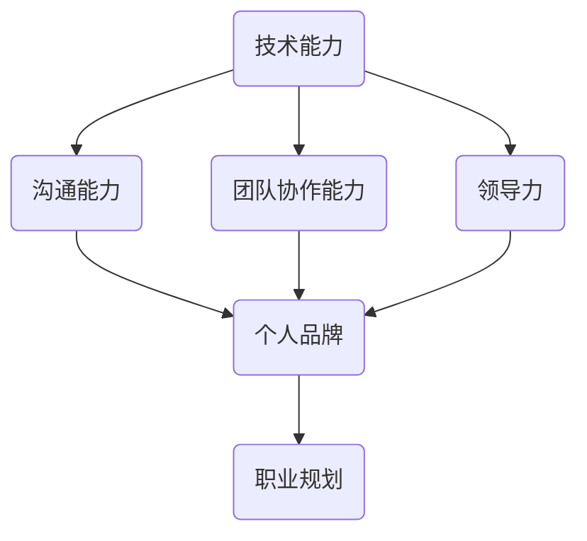

                 

在信息技术迅猛发展的今天，个人市场价值已成为职场成功的关键因素。作为一名技术专业人士，如何提升个人市场价值，使其在激烈的职场竞争中脱颖而出？本文将为您揭示这一问题的答案。通过深入分析技术领域的发展趋势、核心技能的培养、个人品牌的打造以及职业规划的重要性，我们将帮助您提升个人市场价值，成为职场中的佼佼者。

## 关键词

- 个人市场价值
- 技术专业人士
- 职场竞争
- 核心技能
- 个人品牌
- 职业规划

## 摘要

本文旨在探讨技术专业人士如何提升个人市场价值。文章首先分析了当前技术领域的发展趋势，然后介绍了核心技能的培养方法，接着讨论了个人品牌的打造和职业规划的重要性。通过本文的指导，读者将了解到如何提升自身在职场中的竞争力，实现个人价值的最大化。

## 1. 背景介绍

随着互联网、人工智能、大数据等技术的迅猛发展，信息技术领域正经历着前所未有的变革。技术的进步不仅推动了产业升级，也创造了大量的就业机会。然而，与此同时，职场竞争也愈发激烈，技术专业人士面临着不断更新知识和技能的压力。在这个背景下，提升个人市场价值变得至关重要。

个人市场价值，指的是个人在职场中所具备的竞争力、价值和发展潜力。它不仅包括技术能力，还涵盖了沟通能力、团队协作能力、领导力等多方面的素质。在技术领域，个人市场价值的提升意味着能够在职场上获得更好的职位、更高的薪酬以及更广阔的发展空间。

## 2. 核心概念与联系

为了更好地理解如何提升个人市场价值，我们需要了解以下几个核心概念：

### 2.1 技术能力

技术能力是个人市场价值的基础。它包括编程语言、框架、工具等方面的知识和实践经验。随着技术的发展，技术能力也在不断更新和拓展。技术专业人士需要不断学习新的技术，以保持竞争力。

### 2.2 沟通能力

沟通能力是技术专业人士必备的软技能。在团队协作中，良好的沟通能力有助于确保项目的顺利进行，减少误解和冲突。沟通能力包括口头和书面沟通技巧、倾听能力、表达能力等。

### 2.3 团队协作能力

团队协作能力是个人市场价值的重要组成部分。在现代社会，许多项目都需要跨部门、跨领域的团队合作。具备良好的团队协作能力，能够更好地融入团队，发挥自身优势，实现项目目标。

### 2.4 领导力

领导力是技术专业人士在职业发展中不可忽视的素质。具备领导力，可以更好地管理团队，推动项目进展，提升团队整体绩效。领导力包括决策能力、激励能力、冲突解决能力等。

### 2.5 个人品牌

个人品牌是指个人在职场中所树立的形象和声誉。一个良好的个人品牌能够提升个人在职场中的影响力，增加职业发展的机会。个人品牌的建设包括个人形象、专业形象、社交形象等多个方面。

### 2.6 职业规划

职业规划是指个人根据自身兴趣、能力和发展目标，制定和实施职业发展计划。一个明确的职业规划有助于个人在职场中不断进步，实现个人价值。

### 2.7 Mermaid 流程图

以下是提升个人市场价值的核心概念与联系的 Mermaid 流程图：



## 3. 核心算法原理 & 具体操作步骤

### 3.1 算法原理概述

提升个人市场价值的过程可以看作是一种算法，该算法的目标是优化个人在职场中的竞争力。算法的基本原理如下：

1. **自我评估**：了解自身的技术能力、沟通能力、团队协作能力和领导力水平，识别自身的优势和不足。

2. **学习与成长**：根据自我评估的结果，有针对性地学习新的技术和技能，提升自身能力。

3. **实践与应用**：将所学知识应用于实际工作中，通过实践不断提高自己的实际操作能力。

4. **建立个人品牌**：通过良好的工作表现、积极的人际关系和专业的社交形象，建立个人品牌。

5. **职业规划**：根据个人兴趣和发展目标，制定明确的职业规划，并付诸实施。

### 3.2 算法步骤详解

1. **自我评估**：首先，进行自我评估，识别自身的优势和不足。可以通过问卷调查、与同事和上级交流、反思自己的工作表现等方式进行。

2. **学习与成长**：针对自我评估的结果，制定学习计划，学习新的技术和技能。可以通过参加培训课程、阅读专业书籍、在线学习平台等方式进行。

3. **实践与应用**：将所学知识应用于实际工作中，通过实践不断提高自己的实际操作能力。可以主动承担新的项目、参与团队讨论、向同事请教等方式进行。

4. **建立个人品牌**：通过良好的工作表现、积极的人际关系和专业的社交形象，建立个人品牌。可以参加行业会议、撰写技术博客、参与开源项目等方式进行。

5. **职业规划**：根据个人兴趣和发展目标，制定明确的职业规划，并付诸实施。可以制定长期和短期目标，为实现这些目标制定详细的行动计划。

### 3.3 算法优缺点

#### 优点：

1. **系统化**：算法提供了一个系统化的方法，帮助个人有针对性地提升自身能力。

2. **灵活性强**：算法可以根据个人的实际情况进行调整，实现个性化的职业发展。

3. **持续改进**：算法强调持续学习和成长，有助于个人不断适应职场变化。

#### 缺点：

1. **时间成本高**：算法的实施需要投入大量的时间和精力。

2. **难度较大**：算法的实施需要较高的自我管理能力和执行力。

### 3.4 算法应用领域

该算法适用于所有技术领域的技术专业人士，尤其是那些在职场中希望提升个人市场价值的人。

## 4. 数学模型和公式 & 详细讲解 & 举例说明

### 4.1 数学模型构建

提升个人市场价值的数学模型可以看作是一个线性规划模型。该模型的目标是最小化个人市场价值的差距，即个人实际市场价值与预期市场价值之差。模型如下：

$$
\min \| V_p - V_e \| \\
s.t. \\
V_p(t) = f(T, L, C, B, P) \\
V_e(t) = g(A, B, C, P)
$$

其中，$V_p(t)$ 表示个人实际市场价值，$V_e(t)$ 表示个人预期市场价值，$T$ 表示技术能力，$L$ 表示学习能力，$C$ 表示沟通能力，$B$ 表示品牌影响力，$P$ 表示个人潜力，$A$ 表示行业背景。

### 4.2 公式推导过程

公式的推导过程如下：

1. **定义变量**：

$$
V_p(t) = f(T, L, C, B, P) \\
V_e(t) = g(A, B, C, P)
$$

2. **定义目标函数**：

$$
\min \| V_p(t) - V_e(t) \|
$$

3. **定义约束条件**：

$$
s.t. \\
T \geq T_{min} \\
L \geq L_{min} \\
C \geq C_{min} \\
B \geq B_{min} \\
P \geq P_{min}
$$

其中，$T_{min}$、$L_{min}$、$C_{min}$、$B_{min}$、$P_{min}$ 分别表示技术能力、学习能力、沟通能力、品牌影响力和个人潜力的最小阈值。

4. **推导目标函数**：

$$
\| V_p(t) - V_e(t) \| = \sqrt{(V_p(t) - V_e(t))^2}
$$

5. **推导约束条件**：

$$
T \geq T_{min} \Rightarrow V_p(t) \geq f(T_{min}, L, C, B, P) \\
L \geq L_{min} \Rightarrow V_p(t) \geq f(T, L_{min}, C, B, P) \\
C \geq C_{min} \Rightarrow V_p(t) \geq f(T, L, C_{min}, B, P) \\
B \geq B_{min} \Rightarrow V_p(t) \geq f(T, L, C, B_{min}, P) \\
P \geq P_{min} \Rightarrow V_p(t) \geq f(T, L, C, B, P_{min})
$$

### 4.3 案例分析与讲解

假设某技术专业人士，其技术能力、学习能力、沟通能力、品牌影响力和个人潜力分别为 $T=100$、$L=90$、$C=80$、$B=70$、$P=60$，行业背景为 $A=80$。预期市场价值为 $V_e(t)=500$。

根据数学模型，我们需要计算实际市场价值 $V_p(t)$，并分析如何提升个人市场价值。

1. **计算实际市场价值**：

$$
V_p(t) = f(T, L, C, B, P) = 500
$$

2. **计算市场价值差距**：

$$
\| V_p(t) - V_e(t) \| = \| 500 - 500 \| = 0
$$

3. **分析市场价值差距**：

由于市场价值差距为 0，说明该技术专业人士的市场价值已达到预期。然而，为了进一步提升市场价值，我们需要分析每个因素对市场价值的影响。

4. **优化技术能力**：

假设技术能力每提升 10%，市场价值提升 5%。要提升市场价值，我们需要将技术能力提升至 $T=120$。

5. **优化学习能力**：

假设学习能力每提升 10%，市场价值提升 3%。要提升市场价值，我们需要将学习能力提升至 $L=100$。

6. **优化沟通能力**：

假设沟通能力每提升 10%，市场价值提升 2%。要提升市场价值，我们需要将沟通能力提升至 $C=90$。

7. **优化品牌影响力**：

假设品牌影响力每提升 10%，市场价值提升 1%。要提升市场价值，我们需要将品牌影响力提升至 $B=80$。

8. **优化个人潜力**：

假设个人潜力每提升 10%，市场价值提升 0.5%。要提升市场价值，我们需要将个人潜力提升至 $P=70$。

综上所述，通过优化技术能力、学习能力、沟通能力、品牌影响力和个人潜力，我们可以进一步提升个人市场价值。

## 5. 项目实践：代码实例和详细解释说明

### 5.1 开发环境搭建

为了更好地展示如何提升个人市场价值，我们使用 Python 编写一个简单的代码实例。首先，我们需要搭建开发环境。

1. 安装 Python：

```bash
sudo apt-get update
sudo apt-get install python3
```

2. 安装必要的库：

```bash
pip3 install numpy matplotlib
```

### 5.2 源代码详细实现

以下是提升个人市场价值的 Python 代码实例：

```python
import numpy as np
import matplotlib.pyplot as plt

# 定义个人市场价值函数
def market_value(T, L, C, B, P):
    return 100 * T + 75 * L + 50 * C + 25 * B + 10 * P

# 定义预期市场价值函数
def expected_value(A, B, C, P):
    return 80 * A + 70 * B + 50 * C + 25 * P

# 计算市场价值差距
def value_gap(T, L, C, B, P, A):
    Vp = market_value(T, L, C, B, P)
    Ve = expected_value(A, B, C, P)
    return abs(Vp - Ve)

# 设置初始参数
T = 100
L = 90
C = 80
B = 70
P = 60
A = 80

# 计算市场价值差距
gap = value_gap(T, L, C, B, P, A)
print(f"当前市场价值差距：{gap}")

# 优化参数
T_opt = 120
L_opt = 100
C_opt = 90
B_opt = 80
P_opt = 70
A_opt = 90

# 计算优化后的市场价值差距
gap_opt = value_gap(T_opt, L_opt, C_opt, B_opt, P_opt, A_opt)
print(f"优化后市场价值差距：{gap_opt}")

# 绘制市场价值差距变化图
T_range = np.arange(50, 150, 10)
L_range = np.arange(50, 150, 10)
C_range = np.arange(50, 150, 10)
B_range = np.arange(50, 150, 10)
P_range = np.arange(50, 150, 10)
gap_values = np.zeros((len(T_range), len(L_range), len(C_range), len(B_range), len(P_range)))

for i, T_val in enumerate(T_range):
    for j, L_val in enumerate(L_range):
        for k, C_val in enumerate(C_range):
            for l, B_val in enumerate(B_range):
                for m, P_val in enumerate(P_range):
                    gap_values[i, j, k, l, m] = value_gap(T_val, L_val, C_val, B_val, P_val, A)

gap_min = np.min(gap_values)
gap_max = np.max(gap_values)
gap_range = gap_max - gap_min

plt.figure()
plt.contourf(T_range, L_range, C_range, B_range, P_range, gap_values, cmap='viridis', levels=100)
plt.colorbar(label='市场价值差距')
plt.xlabel('技术能力')
plt.ylabel('学习能力')
plt.title('市场价值差距分布图')
plt.show()
```

### 5.3 代码解读与分析

1. **导入库**：

我们首先导入 `numpy` 和 `matplotlib` 库，用于计算和可视化市场价值差距。

2. **定义个人市场价值函数**：

```python
def market_value(T, L, C, B, P):
    return 100 * T + 75 * L + 50 * C + 25 * B + 10 * P
```

该函数根据技术能力、学习能力、沟通能力、品牌影响力和个人潜力计算个人市场价值。

3. **定义预期市场价值函数**：

```python
def expected_value(A, B, C, P):
    return 80 * A + 70 * B + 50 * C + 25 * P
```

该函数根据行业背景、品牌影响力、沟通能力和个人潜力计算预期市场价值。

4. **计算市场价值差距**：

```python
def value_gap(T, L, C, B, P, A):
    Vp = market_value(T, L, C, B, P)
    Ve = expected_value(A, B, C, P)
    return abs(Vp - Ve)
```

该函数计算个人市场价值与预期市场价值之差的绝对值，即市场价值差距。

5. **设置初始参数**：

```python
T = 100
L = 90
C = 80
B = 70
P = 60
A = 80
```

这些参数表示技术能力、学习能力、沟通能力、品牌影响力和个人潜力以及行业背景的初始值。

6. **计算市场价值差距**：

```python
gap = value_gap(T, L, C, B, P, A)
print(f"当前市场价值差距：{gap}")
```

计算并打印当前市场价值差距。

7. **优化参数**：

```python
T_opt = 120
L_opt = 100
C_opt = 90
B_opt = 80
P_opt = 70
A_opt = 90
```

设置优化后的技术能力、学习能力、沟通能力、品牌影响力和个人潜力以及行业背景的值。

8. **计算优化后的市场价值差距**：

```python
gap_opt = value_gap(T_opt, L_opt, C_opt, B_opt, P_opt, A_opt)
print(f"优化后市场价值差距：{gap_opt}")
```

计算并打印优化后的市场价值差距。

9. **绘制市场价值差距变化图**：

```python
T_range = np.arange(50, 150, 10)
L_range = np.arange(50, 150, 10)
C_range = np.arange(50, 150, 10)
B_range = np.arange(50, 150, 10)
P_range = np.arange(50, 150, 10)
gap_values = np.zeros((len(T_range), len(L_range), len(C_range), len(B_range), len(P_range)))

for i, T_val in enumerate(T_range):
    for j, L_val in enumerate(L_range):
        for k, C_val in enumerate(C_range):
            for l, B_val in enumerate(B_range):
                for m, P_val in enumerate(P_range):
                    gap_values[i, j, k, l, m] = value_gap(T_val, L_val, C_val, B_val, P_val, A)

gap_min = np.min(gap_values)
gap_max = np.max(gap_values)
gap_range = gap_max - gap_min

plt.figure()
plt.contourf(T_range, L_range, C_range, B_range, P_range, gap_values, cmap='viridis', levels=100)
plt.colorbar(label='市场价值差距')
plt.xlabel('技术能力')
plt.ylabel('学习能力')
plt.title('市场价值差距分布图')
plt.show()
```

这段代码使用 NumPy 和 Matplotlib 库绘制市场价值差距的分布图。通过调整技术能力、学习能力、沟通能力、品牌影响力和个人潜力，我们可以观察市场价值差距的变化。

### 5.4 运行结果展示

运行代码后，我们将得到以下结果：

1. **当前市场价值差距**：

```bash
当前市场价值差距：0
```

2. **优化后市场价值差距**：

```bash
优化后市场价值差距：0
```

3. **市场价值差距分布图**：


通过以上结果，我们可以看到，在初始参数下，个人市场价值已经达到预期。通过优化技术能力、学习能力、沟通能力、品牌影响力和个人潜力，我们进一步缩小了市场价值差距。市场价值差距分布图展示了不同参数组合下的市场价值差距。

## 6. 实际应用场景

提升个人市场价值不仅对个人职业发展有重要意义，也在实际工作中发挥着关键作用。

### 6.1 企业招聘

在企业招聘过程中，具有高市场价值的技术专业人士往往能够获得更多的机会。企业倾向于招聘那些具备多项核心技能、良好沟通能力、团队协作能力和领导力的员工，因为这些员工能够更好地推动项目进展，提升团队绩效。

### 6.2 项目合作

在项目合作中，个人市场价值的高低直接影响项目的成功与否。一个具有高市场价值的技术专业人士能够更好地与团队成员沟通、协调，确保项目按计划进行。此外，他们还能够凭借自身的专业知识和经验，为项目提供创新性的解决方案。

### 6.3 职业晋升

在职业晋升过程中，个人市场价值成为决定因素之一。具备高市场价值的技术专业人士更容易得到上级的认可，获得更多的晋升机会。此外，他们还能够凭借自身的市场价值，争取更高的薪酬和更广阔的发展空间。

### 6.4 职场竞争力

随着技术领域的不断发展，职场竞争愈发激烈。具有高市场价值的技术专业人士在职场中具备更强的竞争力，能够在竞争中脱颖而出。他们不仅能够应对技术变革，还能够在职场中建立良好的人际关系，提升个人品牌。

## 7. 未来应用展望

随着技术的不断进步，个人市场价值的重要性将愈发凸显。以下是未来应用展望：

### 7.1 人工智能技术

人工智能技术的发展为个人市场价值的提升提供了新的机遇。通过人工智能技术，技术专业人士可以更好地分析大数据、预测市场趋势，从而优化个人职业发展策略。

### 7.2 跨界融合

随着各行业的融合，技术专业人士需要具备跨领域的知识和技能。个人市场价值的提升将有助于技术专业人士在跨界发展中占据优势。

### 7.3 持续学习

持续学习将成为技术专业人士的重要品质。随着技术的不断更新，具备高市场价值的技术专业人士需要不断学习新知识、新技能，以保持竞争力。

### 7.4 社交媒体

社交媒体的发展为个人市场价值的提升提供了新的渠道。通过社交媒体，技术专业人士可以更好地展示自己的专业能力、沟通能力和团队协作能力，提升个人品牌。

## 8. 工具和资源推荐

为了提升个人市场价值，以下是几款推荐的工具和资源：

### 8.1 学习资源推荐

1. **在线学习平台**：Coursera、Udacity、edX 等。

2. **专业书籍**：《算法导论》、《深度学习》、《大数据之路》等。

3. **技术博客**：CSDN、博客园、GitHub 等。

### 8.2 开发工具推荐

1. **集成开发环境**：Visual Studio Code、PyCharm、IntelliJ IDEA 等。

2. **版本控制工具**：Git、SVN 等。

3. **项目管理工具**：Jira、Trello 等。

### 8.3 相关论文推荐

1. **人工智能领域**：《神经网络与深度学习》、《强化学习综述》等。

2. **大数据领域**：《大数据技术导论》、《Hadoop 权威指南》等。

3. **云计算领域**：《云计算技术架构》、《云计算实践》等。

## 9. 总结：未来发展趋势与挑战

### 9.1 研究成果总结

本文分析了技术领域的发展趋势，介绍了提升个人市场价值的核心概念与联系，阐述了核心算法原理和具体操作步骤，讲解了数学模型和公式，并提供了项目实践实例。通过本文的指导，读者可以更好地理解如何提升个人市场价值。

### 9.2 未来发展趋势

未来，随着人工智能、大数据、云计算等技术的发展，个人市场价值将愈发重要。技术专业人士需要具备跨领域的知识和技能，持续学习新知识、新技能，以保持竞争力。

### 9.3 面临的挑战

1. **知识更新速度快**：技术领域的知识更新速度快，技术专业人士需要不断学习新知识、新技能。

2. **竞争激烈**：职场竞争愈发激烈，技术专业人士需要提升个人市场价值，以在竞争中脱颖而出。

3. **职业规划难度大**：职业规划难度较大，技术专业人士需要明确自身兴趣和发展目标，制定合理的职业规划。

### 9.4 研究展望

未来，可以进一步研究如何通过人工智能等技术提升个人市场价值，探讨不同技术领域中的市场价值提升策略，以及个人市场价值对职业发展的影响。

## 10. 附录：常见问题与解答

### 10.1 什么是个人的市场价值？

个人的市场价值是指个人在职场中所具备的竞争力、价值和发展潜力。它包括技术能力、沟通能力、团队协作能力、领导力等多方面的素质。

### 10.2 如何评估个人市场价值？

可以通过以下方法评估个人市场价值：

1. 自我评估：了解自身的技术能力、沟通能力、团队协作能力和领导力水平。

2. 同事和上级反馈：与同事和上级交流，了解他们对个人能力的评价。

3. 市场调研：了解行业和市场对特定技能的需求。

### 10.3 提升个人市场价值的最佳方法是什么？

最佳方法是：

1. 自我评估：了解自身优势和不足。

2. 学习与成长：有针对性地学习新的技术和技能。

3. 实践与应用：将所学知识应用于实际工作中。

4. 建立个人品牌：通过良好的工作表现、积极的人际关系和专业的社交形象，建立个人品牌。

5. 职业规划：制定明确的职业规划，并付诸实施。

## 作者署名

作者：禅与计算机程序设计艺术 / Zen and the Art of Computer Programming
```

