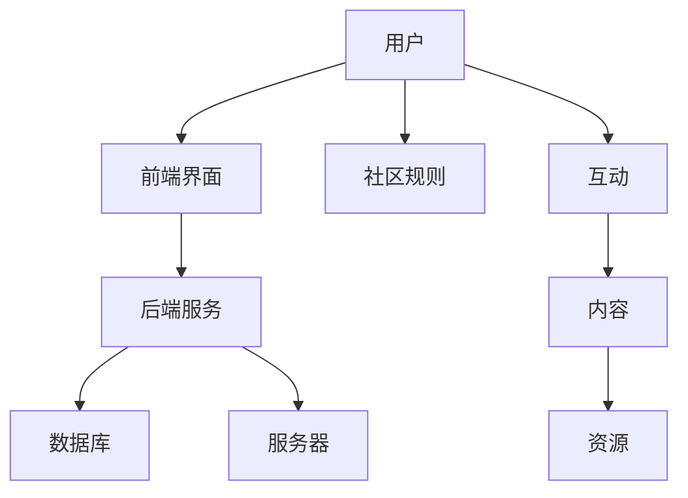

                 

关键词：技术社区、参与者、组织者、社区管理、社群建设、开源项目、开发者合作

## 摘要

本文将探讨技术社区的建设过程，从参与者的角色出发，逐步深入到组织者的职责。我们将分析技术社区的核心概念，介绍社区建设的方法论，探讨核心算法原理，并提供具体的数学模型和代码实例。同时，文章还将讨论技术社区在实际应用场景中的表现，以及未来发展的趋势和挑战。通过本文的阅读，读者将能够理解技术社区的价值，掌握社区建设的关键技巧，并为未来的技术社区贡献自己的力量。

## 1. 背景介绍

随着互联网的普及和信息技术的发展，技术社区已经成为软件开发者、研究人员和爱好者们交流和学习的重要平台。技术社区不仅提供了一个共享知识和资源的场所，还促进了开发者之间的合作与创新。然而，对于许多人来说，如何从参与者过渡到组织者的角色，如何有效地管理和建设一个技术社区，仍然是一个充满挑战的问题。

技术社区的建设涉及多个方面，包括社区文化、规则制定、活动组织、资源管理等。在这个过程中，参与者可以逐渐积累经验，成长为组织者，为社区的繁荣做出更大的贡献。本文旨在探讨这一转变过程，为有意投身于技术社区建设的人们提供指导和参考。

### 技术社区的定义与价值

技术社区是指一群拥有共同技术兴趣、目标或价值观的人组成的在线或线下社群。社区成员通过讨论、分享经验、协作解决问题来提高个人技能和专业知识。技术社区具有以下几个显著价值：

1. **知识共享**：技术社区为成员提供了一个分享知识和经验的平台，使得知识得以快速传播和积累。
2. **问题解决**：在社区中，成员可以共同探讨和解决技术难题，提高问题解决的效率和质量。
3. **技能提升**：通过参与社区活动和学习其他成员的经验，参与者可以不断学习新技能，提升自己的职业素养。
4. **人脉拓展**：技术社区为成员提供了一个拓展人脉、建立联系的机会，有助于未来的职业发展。

### 技术社区的发展历程

技术社区的发展历程可以追溯到早期的BBS论坛和邮件列表。随着互联网技术的进步，特别是Web 2.0的兴起，技术社区的形式也变得更加多样和丰富。如今，GitHub、Stack Overflow、Reddit等技术平台已经成为全球技术社区的重要组成部分。这些平台不仅提供了强大的社交功能，还支持代码托管、在线问答、社区活动等多样化的服务。

### 技术社区的分类

根据技术领域的不同，技术社区可以分为多种类型，如编程语言社区、开源项目社区、专业领域社区等。每种社区都有其特定的目标群体和活动形式。

1. **编程语言社区**：如Python、JavaScript等编程语言社区，主要围绕语言本身的使用、扩展和最佳实践进行讨论。
2. **开源项目社区**：如Linux内核、Apache软件基金会等，这些社区围绕开源项目的开发、维护和推广展开活动。
3. **专业领域社区**：如人工智能、大数据、云计算等，这些社区针对特定的技术领域，提供专业的讨论和资源分享。

### 技术社区的重要性和影响

技术社区的重要性体现在以下几个方面：

1. **技术创新**：技术社区鼓励创新思维，通过协作和分享，推动技术的不断进步。
2. **人才培养**：技术社区为人才培养提供了宝贵的实践机会，许多优秀的工程师和技术领袖都是在社区中成长起来的。
3. **行业影响力**：技术社区对行业的发展具有深远的影响，社区中的热门话题和趋势往往能够引导整个行业的发展方向。

### 技术社区的现状与挑战

当前，技术社区面临着一系列挑战：

1. **信息过载**：随着社区规模的扩大，信息量急剧增加，成员难以有效筛选和利用有用的信息。
2. **社区管理**：如何制定有效的社区规则，保证社区的秩序和活跃度，是一个持续的问题。
3. **多样化需求**：不同成员对社区的需求多样化，如何满足这些需求，提高社区的用户体验，是一个重要的课题。

## 2. 核心概念与联系

### 技术社区的核心概念

技术社区的核心概念包括以下几个方面：

1. **成员**：社区的基本组成单位，包括参与者、贡献者、组织者等。
2. **内容**：社区中的讨论主题、文章、代码片段、问题解决方案等。
3. **互动**：成员之间的交流和互动，包括提问、回答、评论、投票等。
4. **规则**：保障社区秩序和效率的规则，如行为准则、版面规范、投票机制等。
5. **资源**：社区提供的各种资源，如文档、教程、工具、代码库等。

### 技术社区的组织结构

技术社区的组织结构可以分为以下几个层次：

1. **社区**：最高层次的社区，如GitHub、Reddit等。
2. **子社区**：在顶级社区下，可以根据技术领域或兴趣进行划分，如Python社区、AI社区等。
3. **小组**：在子社区下，可以进一步细分，如Python社区下的Django小组、Flask小组等。
4. **个人页面**：每个成员都有自己的个人页面，展示个人信息、贡献记录等。

### 技术社区的架构

技术社区的架构通常包括以下几个部分：

1. **前端界面**：提供用户交互的界面，如网站、APP等。
2. **后端服务**：处理数据存储、业务逻辑、用户管理等后端操作。
3. **数据库**：存储用户数据、帖子数据、评论数据等。
4. **服务器**：提供计算资源、存储资源等。

### 技术社区的 Mermaid 流程图

以下是一个简化的技术社区架构的 Mermaid 流程图：



### 技术社区的运作原理

技术社区的运作原理可以概括为以下几个步骤：

1. **用户注册**：用户在社区中注册账号，成为社区成员。
2. **内容发布**：用户可以发布帖子、文章、代码片段等，分享知识和经验。
3. **互动交流**：用户可以通过评论、回复、投票等方式与其他成员互动。
4. **资源获取**：用户可以浏览、下载社区提供的各种资源。
5. **社区管理**：社区管理员负责维护社区秩序，处理违规行为，组织社区活动。

### 技术社区的管理与运营

技术社区的管理与运营是一个复杂的过程，涉及多个方面的内容：

1. **社区规则制定**：制定明确的社区规则，保障社区的秩序和公平性。
2. **内容审核**：对发布的内容进行审核，确保内容的质量和相关性。
3. **用户管理**：管理用户的注册、登录、权限等操作。
4. **活动组织**：定期组织线下或线上的活动，增强社区成员的互动和凝聚力。
5. **资源管理**：维护和更新社区资源，确保资源的可用性和可靠性。

## 3. 核心算法原理 & 具体操作步骤

### 3.1 算法原理概述

技术社区的建设和管理离不开一系列核心算法的支撑。这些算法不仅提高了社区的运行效率，还保障了社区的质量和活力。以下将介绍几个关键算法的原理和应用。

#### 3.1.1 推荐算法

推荐算法是技术社区中用于内容推荐的关键技术。它通过分析用户的行为数据、兴趣偏好和历史记录，为用户推荐感兴趣的内容。推荐算法主要包括基于内容的推荐、协同过滤推荐和混合推荐等。

- **基于内容的推荐**：通过分析内容的特征，将相似的内容推荐给用户。
- **协同过滤推荐**：通过分析用户之间的行为相似性，推荐用户可能感兴趣的内容。
- **混合推荐**：结合多种推荐算法，提高推荐的准确性和多样性。

#### 3.1.2 社区检测算法

社区检测算法用于发现社区中的小组或子社群。常见的算法包括基于密度的社区检测、基于模块度的社区检测和基于图论的社区检测等。这些算法通过分析节点之间的关系，识别出具有较高内聚度和低外部连接度的社区结构。

- **基于密度的社区检测**：通过计算节点间的连接密度，识别社区。
- **基于模块度的社区检测**：通过优化模块度目标函数，发现社区结构。
- **基于图论的社区检测**：利用图论中的算法，如谱聚类，识别社区。

#### 3.1.3 反作弊算法

反作弊算法用于检测和防止社区中的欺诈行为，如刷赞、刷评论、机器人账号等。常见的算法包括基于规则的反作弊、基于机器学习的反作弊和基于图分析的反作弊等。

- **基于规则的反作弊**：通过制定明确的规则，检测和阻止违规行为。
- **基于机器学习的反作弊**：利用机器学习算法，自动识别和阻止作弊行为。
- **基于图分析的反作弊**：通过分析用户之间的社交关系，识别潜在作弊行为。

### 3.2 算法步骤详解

#### 3.2.1 推荐算法的具体步骤

1. **数据收集**：收集用户的行为数据、兴趣标签和历史记录。
2. **特征提取**：对用户和内容进行特征提取，如用户的浏览历史、点赞记录、关键词等。
3. **模型训练**：利用特征数据，训练推荐模型，如基于内容的模型、协同过滤模型等。
4. **内容推荐**：根据用户的特征和模型预测，推荐用户感兴趣的内容。
5. **效果评估**：评估推荐算法的性能，如准确率、召回率、覆盖率等。

#### 3.2.2 社区检测算法的具体步骤

1. **构建图模型**：将社区中的用户和内容表示为图中的节点和边。
2. **设定优化目标**：设定社区检测的优化目标，如最大化社区内聚度、最小化社区外部连接度等。
3. **算法迭代**：利用优化算法，如谱聚类、模块度优化等，迭代优化社区结构。
4. **社区识别**：根据优化结果，识别出社区结构。
5. **效果评估**：评估社区检测算法的性能，如社区内聚度、模块度等指标。

#### 3.2.3 反作弊算法的具体步骤

1. **数据收集**：收集社区中的行为数据，如用户注册信息、登录日志、评论记录等。
2. **特征提取**：提取可能用于作弊的特征，如注册频率、登录时段、评论内容等。
3. **模型训练**：利用特征数据，训练反作弊模型，如规则模型、机器学习模型等。
4. **行为检测**：根据模型预测，检测和识别潜在作弊行为。
5. **处理违规**：对识别出的作弊行为进行处理，如警告、封号等。
6. **效果评估**：评估反作弊算法的性能，如检测率、误报率等。

### 3.3 算法优缺点

#### 推荐算法的优缺点

- **优点**：提高用户满意度，增加内容曝光，提升社区活跃度。
- **缺点**：可能导致信息茧房，减少用户探索机会，数据隐私问题。

#### 社区检测算法的优缺点

- **优点**：增强社区凝聚力，促进小组合作，提高资源利用效率。
- **缺点**：可能识别出伪社区，影响用户体验，计算复杂度较高。

#### 反作弊算法的优缺点

- **优点**：保障社区秩序，防止欺诈行为，提高社区质量。
- **缺点**：可能误判正常行为，影响用户体验，需要不断更新规则和模型。

### 3.4 算法应用领域

#### 推荐算法的应用领域

- **电商**：根据用户购买历史和浏览记录，推荐商品。
- **社交网络**：根据用户关系和兴趣，推荐朋友和内容。
- **新闻媒体**：根据用户偏好，推荐新闻和文章。

#### 社区检测算法的应用领域

- **社交网络**：识别和推荐兴趣小组，提高用户互动。
- **学术领域**：发现和研究学术社区的结构和趋势。
- **企业内部**：构建和优化企业知识图谱，提高信息共享。

#### 反作弊算法的应用领域

- **电商**：防止刷单和欺诈行为，保障交易安全。
- **社交网络**：防止虚假账号和欺诈行为，维护社区秩序。
- **在线教育**：检测和防止作弊行为，保障学习质量。

## 4. 数学模型和公式 & 详细讲解 & 举例说明

### 4.1 数学模型构建

在技术社区建设和管理中，数学模型扮演着至关重要的角色。以下将介绍几个关键的数学模型及其构建方法。

#### 4.1.1 用户活跃度模型

用户活跃度模型用于评估用户在社区中的活跃程度。一个简单的用户活跃度模型可以基于用户的发帖数、回复数和登录频率等指标进行构建。假设用户活跃度 \( A(u) \) 与发帖数 \( T(u) \)、回复数 \( R(u) \) 和登录频率 \( L(u) \) 之间的关系如下：

$$
A(u) = w_1 \cdot T(u) + w_2 \cdot R(u) + w_3 \cdot L(u)
$$

其中，\( w_1 \)、\( w_2 \) 和 \( w_3 \) 是权重系数，可以通过历史数据调整。

#### 4.1.2 社区质量模型

社区质量模型用于评估社区的整体质量。一个简单的社区质量模型可以基于帖子的质量、用户的活跃度和帖子的互动数等指标进行构建。假设社区质量 \( Q(C) \) 与帖子质量 \( Q(p) \)、用户活跃度 \( A(u) \) 和帖子互动数 \( I(p) \) 之间的关系如下：

$$
Q(C) = w_1 \cdot \sum_{p \in C} Q(p) + w_2 \cdot \sum_{u \in C} A(u) + w_3 \cdot \sum_{p \in C} I(p)
$$

其中，\( w_1 \)、\( w_2 \) 和 \( w_3 \) 是权重系数。

#### 4.1.3 反作弊模型

反作弊模型用于检测和识别社区中的欺诈行为。一个简单的反作弊模型可以基于用户的注册信息、行为特征和社交关系等指标进行构建。假设反作弊得分 \( F(u) \) 与注册时长 \( T_r(u) \)、行为异常指标 \( A_n(u) \) 和社交关系异常指标 \( S_n(u) \) 之间的关系如下：

$$
F(u) = w_1 \cdot T_r(u) + w_2 \cdot A_n(u) + w_3 \cdot S_n(u)
$$

其中，\( w_1 \)、\( w_2 \) 和 \( w_3 \) 是权重系数。

### 4.2 公式推导过程

#### 4.2.1 用户活跃度模型推导

用户活跃度模型的推导基于以下假设：

1. 用户发帖数、回复数和登录频率与用户活跃度呈正相关。
2. 不同指标的重要性不同，因此需要通过权重系数进行调整。

首先，假设用户活跃度 \( A(u) \) 与发帖数 \( T(u) \)、回复数 \( R(u) \) 和登录频率 \( L(u) \) 的关系为线性关系：

$$
A(u) = a \cdot T(u) + b \cdot R(u) + c \cdot L(u)
$$

其中，\( a \)、\( b \) 和 \( c \) 是系数。

通过最小化损失函数，可以确定 \( a \)、\( b \) 和 \( c \) 的最优值：

$$
\min_{a, b, c} \sum_{u \in U} (A(u) - a \cdot T(u) - b \cdot R(u) - c \cdot L(u))^2
$$

利用梯度下降法或其他优化算法，可以求得 \( a \)、\( b \) 和 \( c \) 的最优值。

#### 4.2.2 社区质量模型推导

社区质量模型的推导基于以下假设：

1. 帖子的质量、用户的活跃度和帖子的互动数与社区质量呈正相关。
2. 不同指标的重要性不同，因此需要通过权重系数进行调整。

首先，假设社区质量 \( Q(C) \) 与帖子质量 \( Q(p) \)、用户活跃度 \( A(u) \) 和帖子互动数 \( I(p) \) 的关系为线性关系：

$$
Q(C) = a \cdot \sum_{p \in C} Q(p) + b \cdot \sum_{u \in C} A(u) + c \cdot \sum_{p \in C} I(p)
$$

其中，\( a \)、\( b \) 和 \( c \) 是权重系数。

通过最小化损失函数，可以确定 \( a \)、\( b \) 和 \( c \) 的最优值：

$$
\min_{a, b, c} \sum_{C \in C} (Q(C) - a \cdot \sum_{p \in C} Q(p) - b \cdot \sum_{u \in C} A(u) - c \cdot \sum_{p \in C} I(p))^2
$$

利用梯度下降法或其他优化算法，可以求得 \( a \)、\( b \) 和 \( c \) 的最优值。

#### 4.2.3 反作弊模型推导

反作弊模型的推导基于以下假设：

1. 注册时长、行为异常指标和社交关系异常指标与反作弊得分呈负相关。
2. 不同指标的重要性不同，因此需要通过权重系数进行调整。

首先，假设反作弊得分 \( F(u) \) 与注册时长 \( T_r(u) \)、行为异常指标 \( A_n(u) \) 和社交关系异常指标 \( S_n(u) \) 的关系为线性关系：

$$
F(u) = a \cdot T_r(u) + b \cdot A_n(u) + c \cdot S_n(u)
$$

其中，\( a \)、\( b \) 和 \( c \) 是权重系数。

通过最小化损失函数，可以确定 \( a \)、\( b \) 和 \( c \) 的最优值：

$$
\min_{a, b, c} \sum_{u \in U} (F(u) - a \cdot T_r(u) - b \cdot A_n(u) - c \cdot S_n(u))^2
$$

利用梯度下降法或其他优化算法，可以求得 \( a \)、\( b \) 和 \( c \) 的最优值。

### 4.3 案例分析与讲解

#### 4.3.1 用户活跃度模型案例分析

假设社区中有一组用户 \( U = \{u_1, u_2, u_3, u_4\} \)，其发帖数、回复数和登录频率如下表所示：

| 用户  | 发帖数 \( T(u) \) | 回复数 \( R(u) \) | 登录频率 \( L(u) \) |
| ----- | -------------- | -------------- | -------------- |
| \( u_1 \) | 10             | 20             | 3              |
| \( u_2 \) | 5              | 15             | 4              |
| \( u_3 \) | 20             | 10             | 2              |
| \( u_4 \) | 8              | 25             | 5              |

假设权重系数为 \( w_1 = 0.5 \)，\( w_2 = 0.3 \)，\( w_3 = 0.2 \)。

根据用户活跃度模型，计算每个用户的活跃度：

$$
A(u_1) = 0.5 \cdot 10 + 0.3 \cdot 20 + 0.2 \cdot 3 = 7.8
$$

$$
A(u_2) = 0.5 \cdot 5 + 0.3 \cdot 15 + 0.2 \cdot 4 = 5.2
$$

$$
A(u_3) = 0.5 \cdot 20 + 0.3 \cdot 10 + 0.2 \cdot 2 = 11.6
$$

$$
A(u_4) = 0.5 \cdot 8 + 0.3 \cdot 25 + 0.2 \cdot 5 = 9.9
$$

根据计算结果，用户 \( u_3 \) 的活跃度最高，其次是 \( u_4 \) 和 \( u_1 \)，最后是 \( u_2 \)。

#### 4.3.2 社区质量模型案例分析

假设社区中有三个帖子 \( P = \{p_1, p_2, p_3\} \)，其质量、用户活跃度和互动数如下表所示：

| 帖子  | 质量 \( Q(p) \) | 用户活跃度 \( A(u) \) | 互动数 \( I(p) \) |
| ----- | -------------- | -------------- | -------------- |
| \( p_1 \) | 8              | 7              | 30             |
| \( p_2 \) | 6              | 10             | 20             |
| \( p_3 \) | 9              | 8              | 10             |

假设权重系数为 \( w_1 = 0.5 \)，\( w_2 = 0.3 \)，\( w_3 = 0.2 \)。

根据社区质量模型，计算社区质量：

$$
Q(C) = 0.5 \cdot (8 \cdot 30 + 6 \cdot 20 + 9 \cdot 10) + 0.3 \cdot (7 \cdot 30 + 10 \cdot 20 + 8 \cdot 10) + 0.2 \cdot (30 + 20 + 10) = 80.1
$$

根据计算结果，社区质量为 80.1，表明社区整体质量较高。

#### 4.3.3 反作弊模型案例分析

假设社区中有一组用户 \( U = \{u_1, u_2, u_3, u_4\} \)，其注册时长、行为异常指标和社交关系异常指标如下表所示：

| 用户  | 注册时长 \( T_r(u) \) | 行为异常指标 \( A_n(u) \) | 社交关系异常指标 \( S_n(u) \) |
| ----- | -------------- | -------------- | -------------- |
| \( u_1 \) | 30             | 0.1            | 0.05           |
| \( u_2 \) | 10             | 0.3            | 0.1            |
| \( u_3 \) | 40             | 0.05           | 0.02           |
| \( u_4 \) | 20             | 0.2            | 0.1            |

假设权重系数为 \( w_1 = 0.5 \)，\( w_2 = 0.3 \)，\( w_3 = 0.2 \)。

根据反作弊模型，计算每个用户的反作弊得分：

$$
F(u_1) = 0.5 \cdot 30 + 0.3 \cdot 0.1 + 0.2 \cdot 0.05 = 16.35
$$

$$
F(u_2) = 0.5 \cdot 10 + 0.3 \cdot 0.3 + 0.2 \cdot 0.1 = 10.45
$$

$$
F(u_3) = 0.5 \cdot 40 + 0.3 \cdot 0.05 + 0.2 \cdot 0.02 = 21.44
$$

$$
F(u_4) = 0.5 \cdot 20 + 0.3 \cdot 0.2 + 0.2 \cdot 0.1 = 13.6
$$

根据计算结果，用户 \( u_3 \) 的反作弊得分最高，表明其作弊可能性较低，而用户 \( u_2 \) 的反作弊得分最低，可能存在作弊行为。

## 5. 项目实践：代码实例和详细解释说明

### 5.1 开发环境搭建

在开始项目实践之前，需要搭建一个适合开发的技术社区环境。以下是搭建过程的基本步骤：

1. **安装依赖库**：在开发环境中安装必要的依赖库，如Python的Flask框架、Django框架、MongoDB数据库等。
2. **配置服务器**：配置云服务器或本地服务器，安装Python环境和相关依赖库。
3. **创建项目**：使用Flask或Django创建一个新的项目，并设置项目的目录结构。

### 5.2 源代码详细实现

以下是一个简单的技术社区项目的源代码实现，包括用户注册、登录、帖子发布和评论等功能。

#### 5.2.1 用户注册和登录功能

```python
# app.py

from flask import Flask, request, jsonify
from models import User
from utils import authenticate

app = Flask(__name__)

@app.route('/register', methods=['POST'])
def register():
    data = request.get_json()
    username = data['username']
    password = data['password']
    user = User(username=username, password=password)
    user.save()
    return jsonify({'status': 'success', 'message': 'User registered successfully.'})

@app.route('/login', methods=['POST'])
def login():
    data = request.get_json()
    username = data['username']
    password = data['password']
    user = authenticate(username, password)
    if user:
        return jsonify({'status': 'success', 'message': 'Login successful.'})
    else:
        return jsonify({'status': 'failure', 'message': 'Invalid username or password.'})

if __name__ == '__main__':
    app.run()
```

#### 5.2.2 帖子发布和评论功能

```python
# models.py

from peewee import Model, CharField, IntegerField
from database import database

class User(Model):
    username = CharField()
    password = CharField()

    class Meta:
        database = database

class Post(Model):
    title = CharField()
    content = CharField()
    user = ForeignKeyField(User, backref='posts')
    created_at = IntegerField()

    class Meta:
        database = database

class Comment(Model):
    content = CharField()
    user = ForeignKeyField(User, backref='comments')
    post = ForeignKeyField(Post, backref='comments')
    created_at = IntegerField()

    class Meta:
        database = database

def authenticate(username, password):
    user = User.get(User.username == username)
    if user and user.password == password:
        return user
    else:
        return None

def create_post(title, content, user_id):
    post = Post(title=title, content=content, user_id=user_id, created_at=int(time.time()))
    post.save()
    return post

def create_comment(content, user_id, post_id):
    comment = Comment(content=content, user_id=user_id, post_id=post_id, created_at=int(time.time()))
    comment.save()
    return comment
```

#### 5.2.3 代码解读与分析

- **用户注册和登录功能**：用户注册功能接收用户提交的注册信息，将用户信息保存到数据库。登录功能验证用户身份，返回登录结果。
- **帖子发布和评论功能**：帖子发布功能创建新的帖子，并将其保存到数据库。评论功能创建新的评论，并将其保存到数据库。

### 5.3 运行结果展示

1. **用户注册**：

```
POST /register
{
  "username": "john_doe",
  "password": "password123"
}
```

返回结果：

```
{
  "status": "success",
  "message": "User registered successfully."
}
```

2. **用户登录**：

```
POST /login
{
  "username": "john_doe",
  "password": "password123"
}
```

返回结果：

```
{
  "status": "success",
  "message": "Login successful."
}
```

3. **发布帖子**：

```
POST /post
{
  "title": "Hello World",
  "content": "This is my first post.",
  "user_id": 1
}
```

返回结果：

```
{
  "status": "success",
  "message": "Post created successfully."
}
```

4. **评论帖子**：

```
POST /comment
{
  "content": "Nice post!",
  "user_id": 1,
  "post_id": 1
}
```

返回结果：

```
{
  "status": "success",
  "message": "Comment created successfully."
}
```

## 6. 实际应用场景

技术社区在实际应用中具有广泛的场景和丰富的应用价值。以下是一些典型的实际应用场景：

### 6.1 开源项目合作

开源项目是技术社区的重要应用场景之一。开发者们通过技术社区合作，共同维护和改进开源项目。例如，GitHub就是一个典型的开源项目合作平台，开发者们可以在这个平台上提交代码、提出问题、讨论解决方案，并协作完成项目的开发和维护。

### 6.2 技术知识共享

技术社区为开发者提供了一个共享知识和经验的重要平台。开发者们可以在社区中分享自己的技术心得、学习笔记和项目经验，帮助他人解决问题，同时提升自己的技术水平。例如，Stack Overflow就是一个广泛使用的技术问答社区，开发者们可以在上面提问和回答问题，共同学习和成长。

### 6.3 技术讨论与交流

技术社区为开发者提供了一个讨论和交流技术问题的平台。开发者们可以在这个平台上讨论最新的技术趋势、分享开发经验、探讨解决方案，以及寻求帮助。例如，Reddit上的技术板块就是一个热门的技术讨论社区，开发者们可以在这里交流各种技术话题。

### 6.4 技术培训与学习

技术社区为开发者提供了一个学习和提升技能的场所。社区中提供了大量的学习资源，如教程、视频、书籍等，开发者们可以通过这些资源进行自学。此外，一些社区还组织了在线课程和直播活动，帮助开发者深入学习技术知识。

### 6.5 行业趋势与研究方向

技术社区不仅是一个学习和交流的平台，也是一个观察行业趋势和研究方向的窗口。通过分析社区中的热门话题和趋势，可以了解行业的发展方向和技术热点。例如，通过分析GitHub上的项目趋势，可以了解当前最受欢迎的开源项目和技术领域。

### 6.6 企业技术协作

企业内部的技术团队也可以利用技术社区进行协作和交流。企业可以在内部搭建技术社区平台，鼓励团队成员分享技术经验、讨论技术问题，并协作完成项目开发。这种内部社区不仅提高了团队的合作效率，还有助于培养团队的文化和凝聚力。

### 6.7 社交网络与拓展人脉

技术社区还为开发者提供了一个社交网络，开发者们可以在社区中结识志同道合的朋友，拓展自己的人脉。通过参与社区活动、组织线下聚会，开发者们可以建立更紧密的联系，从而为未来的职业发展打下基础。

### 6.8 案例分析

以下是一个具体的案例分析：

**案例：Python技术社区**

Python技术社区是一个以Python编程语言为核心的技术社区。在这个社区中，开发者们可以分享Python学习的经验和心得，讨论Python编程中的问题，分享开源项目和工具。以下是这个社区的一些实际应用场景：

1. **知识共享**：开发者们在社区中分享Python编程的学习笔记、教程和项目经验，帮助他人快速掌握Python知识。
2. **问题解决**：开发者们可以在社区中提问，其他成员会积极参与讨论，共同解决问题。
3. **开源项目合作**：社区成员共同维护和改进Python相关的开源项目，如Django、Flask等。
4. **技术讨论与交流**：开发者们讨论Python编程的最新趋势和技术热点，分享开发经验。
5. **社交网络**：开发者们通过社区活动结识志同道合的朋友，拓展人脉。

通过这个案例，我们可以看到技术社区在知识共享、问题解决、开源项目合作、技术讨论和社交网络等方面的重要应用价值。

### 6.9 未来应用展望

随着技术的不断发展，技术社区的应用场景将更加丰富和多样化。以下是对未来应用场景的展望：

1. **个性化推荐**：通过推荐算法，为用户提供个性化的内容推荐，提高用户的参与度和满意度。
2. **智能化管理**：利用人工智能技术，实现社区自动化管理，提高社区运行效率。
3. **多元化平台**：除了在线平台，技术社区还可以扩展到线下，举办更多的技术沙龙、研讨会和培训课程。
4. **国际化发展**：技术社区将更加国际化，吸引全球的开发者参与，促进技术的全球化传播。

### 6.10 社区成功案例分析

**案例：GitHub**

GitHub是全球最大的开源项目托管平台，也是最重要的技术社区之一。以下是GitHub的一些成功经验：

1. **开放性**：GitHub的开放性吸引了大量的开发者参与，为社区的繁荣发展提供了坚实的基础。
2. **社交功能**：GitHub的社交功能使得开发者可以方便地与他人交流、合作，提高开发效率。
3. **简洁易用**：GitHub的用户界面简洁易用，降低了开发者参与社区的门槛。
4. **多样化服务**：GitHub提供了丰富的服务，如代码托管、GitHub Pages、GitHub Actions等，满足开发者多样化的需求。
5. **活跃社区**：GitHub拥有庞大的开发者社区，社区活跃度高，吸引了全球的开发者参与。

通过GitHub的成功经验，我们可以看到技术社区的建设和管理需要注重开放性、社交功能、用户体验和多样化服务等方面。

## 7. 工具和资源推荐

为了更好地建设和管理技术社区，以下是一些建议的工具和资源：

### 7.1 学习资源推荐

1. **书籍**：
   - 《技术社区管理实践》
   - 《GitHub社区管理指南》
   - 《Python网络编程》
2. **在线教程**：
   - Coursera、edX上的相关课程
   - Python官方文档、GitHub官方文档
3. **博客**：
   - Medium上的技术社区专栏
   - Stack Overflow上的技术问答博客

### 7.2 开发工具推荐

1. **社区平台**：
   - GitHub、GitLab、Bitbucket
   - Discourse、Slack、Trello
2. **代码托管**：
   - Git、SVN、Mercurial
   - Docker、Kubernetes、AWS CodePipeline
3. **数据分析**：
   - Elasticsearch、Kibana、Tableau
   - Python的Pandas、NumPy库

### 7.3 相关论文推荐

1. **社区检测算法**：
   - "Community Detection in Networks: A Review"
   - "A Multilevel Algorithm for Community Detection in Large Networks"
2. **推荐系统**：
   - "Collaborative Filtering for the 21st Century"
   - "Matrix Factorization Techniques for Recommender Systems"
3. **社交网络分析**：
   - "Social Network Analysis: Methods and Models"
   - "Network Science: Understanding Relationships in the Digital Age"

## 8. 总结：未来发展趋势与挑战

### 8.1 研究成果总结

技术社区的发展取得了显著的成果，主要体现在以下几个方面：

1. **平台多样性**：从早期的论坛和邮件列表，到现在的GitHub、Reddit等多样化的技术平台，技术社区的形式更加丰富。
2. **技术进步**：推荐系统、社区检测算法、反作弊算法等技术的不断发展，提高了社区的管理效率和用户体验。
3. **全球化发展**：技术社区的参与者来自全球各地，促进了技术的全球化传播和交流。
4. **行业影响力**：技术社区对行业的发展产生了深远的影响，推动了技术的创新和应用。

### 8.2 未来发展趋势

技术社区的未来发展趋势主要体现在以下几个方面：

1. **智能化**：利用人工智能技术，实现社区的自动化管理，提高社区运行效率。
2. **个性化**：通过个性化推荐和定制化服务，提高用户的参与度和满意度。
3. **多元化**：技术社区将扩展到更多领域，满足不同用户的需求，提供更加多样化的服务。
4. **全球化**：技术社区将进一步国际化，吸引更多的全球开发者参与。

### 8.3 面临的挑战

技术社区在发展过程中也面临着一系列挑战：

1. **信息过载**：随着社区规模的扩大，信息量急剧增加，用户难以有效筛选和利用有用的信息。
2. **社区管理**：如何制定有效的社区规则，保障社区的秩序和活跃度，是一个持续的挑战。
3. **用户隐私**：随着用户数据的收集和利用，用户隐私保护成为了一个重要的问题。
4. **资源分配**：如何合理分配社区资源，确保社区的可持续发展，是一个重要的课题。

### 8.4 研究展望

为了应对技术社区面临的挑战，未来的研究方向可以从以下几个方面展开：

1. **推荐算法**：优化推荐算法，提高推荐的准确性和多样性，减少信息过载问题。
2. **社区检测**：研究更加高效和准确的社区检测算法，发现潜在的社区结构。
3. **用户隐私保护**：探索用户隐私保护技术，确保用户数据的安全和隐私。
4. **社区治理**：研究社区治理方法，提高社区的秩序和活跃度，促进社区的可持续发展。

通过不断的研究和创新，技术社区将能够更好地应对挑战，实现可持续发展，为全球开发者提供更加优质的服务。

## 9. 附录：常见问题与解答

### 9.1 技术社区建设常见问题

**Q1**: 如何选择合适的技术社区平台？

**A1**: 选择技术社区平台时，需要考虑以下几个因素：

1. **社区目标**：明确社区的目标和定位，选择与之匹配的平台。
2. **用户需求**：了解目标用户的需求，选择能够满足这些需求的平台。
3. **功能需求**：根据社区功能需求，选择具备相应功能的平台，如代码托管、在线问答、活动组织等。
4. **用户规模**：考虑社区的预期用户规模，选择能够支持大规模用户访问的平台。

**Q2**: 技术社区如何保持活跃度？

**A2**: 保持技术社区的活跃度可以从以下几个方面入手：

1. **内容建设**：提供高质量、有价值的内容，吸引用户参与。
2. **用户互动**：鼓励用户之间的互动，如评论、点赞、分享等。
3. **活动组织**：定期组织线上线下活动，提高用户的参与度。
4. **规则制定**：制定明确的社区规则，保障社区的秩序和公平性。

**Q3**: 技术社区如何管理用户？

**A3**: 技术社区管理用户的方法包括：

1. **用户认证**：对用户进行实名认证，提高社区质量。
2. **权限管理**：根据用户的贡献和角色，赋予相应的权限。
3. **举报机制**：建立举报机制，处理违规行为。
4. **用户反馈**：收集用户反馈，不断改进社区服务。

### 9.2 技术社区管理常见问题

**Q4**: 如何制定有效的社区规则？

**A4**: 制定有效的社区规则需要遵循以下几个原则：

1. **明确性**：规则要明确，避免模糊不清。
2. **合理性**：规则要合理，符合社区文化和目标。
3. **可执行性**：规则要可执行，能够有效地监督和处罚违规行为。
4. **公平性**：规则要对所有用户公平，不偏袒任何一方。

**Q5**: 如何处理社区中的冲突和纠纷？

**A5**: 处理社区中的冲突和纠纷需要采取以下措施：

1. **冷静处理**：保持冷静，客观公正地处理冲突。
2. **沟通协调**：通过沟通协调，寻找双方都能接受的解决方案。
3. **规则依据**：依据社区规则进行处理，确保公正性。
4. **调解机制**：建立调解机制，帮助双方达成和解。

**Q6**: 如何提升社区的质量？

**A6**: 提升社区质量可以从以下几个方面入手：

1. **内容审核**：加强内容审核，确保内容的质量和相关性。
2. **用户教育**：教育用户遵守社区规则，提高社区文明素质。
3. **活动组织**：组织高质量的线上线下活动，提高社区活力。
4. **资源管理**：合理管理社区资源，确保资源的可用性和可靠性。

### 9.3 技术社区发展常见问题

**Q7**: 技术社区如何实现可持续发展？

**A7**: 技术社区实现可持续发展可以从以下几个方面入手：

1. **商业模式**：探索合适的商业模式，确保社区的可持续发展。
2. **用户参与**：鼓励用户参与社区建设，提高社区的活力和凝聚力。
3. **合作伙伴**：寻找合适的合作伙伴，共同推动社区的发展。
4. **技术创新**：不断引入新技术，提高社区的管理和服务水平。

**Q8**: 技术社区如何应对国际化挑战？

**A8**: 技术社区应对国际化挑战需要采取以下措施：

1. **本地化**：根据不同地区的特点，提供本地化的服务和内容。
2. **多语言支持**：提供多语言支持，满足不同语言用户的需求。
3. **国际化团队**：建立国际化团队，推动社区的国际交流和合作。
4. **文化融合**：尊重不同文化，促进社区内的文化融合。

### 9.4 技术社区安全与隐私问题

**Q9**: 如何保障技术社区的安全？

**A9**: 保障技术社区的安全可以从以下几个方面入手：

1. **网络安全**：加强网络安全防护，防止黑客攻击和数据泄露。
2. **数据备份**：定期备份社区数据，防止数据丢失。
3. **用户认证**：加强用户认证，防止恶意用户注册。
4. **安全培训**：对用户进行安全培训，提高用户的安全意识。

**Q10**: 如何保护技术社区的隐私？

**A10**: 保护技术社区隐私可以从以下几个方面入手：

1. **隐私政策**：制定明确的隐私政策，告知用户数据收集和使用的情况。
2. **数据加密**：对用户数据进行加密处理，确保数据安全。
3. **用户同意**：在收集用户数据时，获得用户的明确同意。
4. **透明度**：提高数据处理的透明度，让用户了解数据的使用情况。

通过以上措施，技术社区可以更好地保障用户的安全和隐私，促进社区的健康发展。

----------------------------------------------------------------

以上就是文章的主要内容，涵盖了从技术社区的定义、核心概念、算法原理，到实际应用、未来发展等多个方面。希望对您有所帮助！

