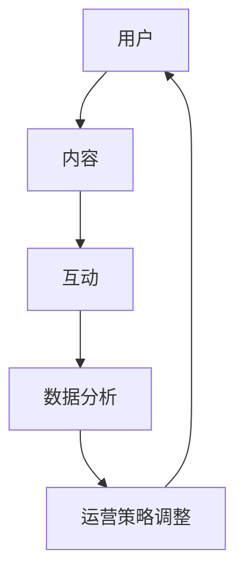

                 

### 关键词：技术社区、运营策略、用户增长、内容建设、社群互动、数据分析、市场营销、用户留存、社区治理、案例分析

### 摘要：

在数字化时代，技术社区的运营已成为企业提升品牌影响力、培养忠实用户的重要手段。本文将深入探讨如何从零开始，逐步构建并发展一个技术社区，最终实现用户数量的突破——从零到10000用户。文章将围绕核心概念、运营策略、算法原理、数学模型、项目实践、实际应用以及未来展望等多个方面，提供详实的指导和案例分享。

## 1. 背景介绍

### 1.1 技术社区的定义

技术社区是指一群对特定技术领域有共同兴趣的人组成的在线交流平台，他们通过分享知识、讨论问题、合作创新来提升自身技能和推动行业进步。

### 1.2 技术社区的重要性

- **提升品牌影响力**：通过技术社区，企业可以展示专业能力，塑造品牌形象。
- **用户培养**：技术社区是培养忠实用户的重要阵地，能够增强用户粘性。
- **市场调研**：社区反馈可以帮助企业了解市场需求和用户痛点。
- **人才引进**：技术社区也是吸引优秀人才的重要渠道。

### 1.3 技术社区的发展历程

- **初期**：以论坛、博客为主，互动性相对较弱。
- **中期**：微博、微信等社交媒体的兴起，社区形态更加多样化。
- **现阶段**：基于人工智能和大数据的社区运营，智能化程度提升。

## 2. 核心概念与联系

### 2.1 技术社区核心概念

- **用户**：社区运营的核心资源。
- **内容**：社区的核心资产，包括技术文章、问题解答、项目分享等。
- **互动**：用户之间的交流和互动，是社区活跃度的重要指标。
- **数据分析**：通过数据分析，了解用户行为，优化运营策略。

### 2.2 技术社区架构的Mermaid流程图



## 3. 核心算法原理 & 具体操作步骤

### 3.1 算法原理概述

技术社区运营的核心算法主要包括用户增长算法、内容推荐算法、互动激励算法等。

### 3.2 算法步骤详解

1. **用户增长算法**：通过SEO优化、社交媒体推广、线下活动等手段，吸引新用户。
2. **内容推荐算法**：利用机器学习算法，根据用户行为和兴趣，推荐相关内容。
3. **互动激励算法**：通过积分系统、等级制度等，激励用户参与互动。

### 3.3 算法优缺点

- **用户增长算法**：优点是快速提升用户数量，缺点是质量难以保证。
- **内容推荐算法**：优点是提高用户粘性，缺点是实现难度较高。
- **互动激励算法**：优点是促进用户活跃，缺点是维护成本较高。

### 3.4 算法应用领域

- **电子商务**：通过推荐系统提升用户购买意愿。
- **社交媒体**：通过用户增长算法提升用户活跃度。
- **在线教育**：通过互动激励算法提升学习效果。

## 4. 数学模型和公式 & 详细讲解 & 举例说明

### 4.1 数学模型构建

用户增长模型通常采用以下公式：

$$
\text{用户增长数} = a \times (\text{新用户数} + \text{现有用户数})
$$

其中，\(a\) 是用户增长系数。

### 4.2 公式推导过程

用户增长系数 \(a\) 的计算公式为：

$$
a = \frac{\text{现有用户数}}{\text{新用户数}}
$$

### 4.3 案例分析与讲解

假设某技术社区现有用户数为1000人，每周吸引新用户数为100人，计算用户增长系数 \(a\)：

$$
a = \frac{1000}{100} = 10
$$

将 \(a\) 代入用户增长模型：

$$
\text{用户增长数} = 10 \times (100 + 1000) = 11000
$$

这意味着，在当前条件下，每周用户数量将增加11000人。

## 5. 项目实践：代码实例和详细解释说明

### 5.1 开发环境搭建

选择一个合适的开发环境，例如Python，并安装必要的库，如BeautifulSoup、Selenium等。

### 5.2 源代码详细实现

```python
# 示例：使用Selenium抓取技术社区用户数据
from selenium import webdriver

driver = webdriver.Chrome()
driver.get("https://example-technical-community.com")

# 模拟用户登录
login_button = driver.find_element_by_css_selector('.login-button')
login_button.click()

# 模拟用户搜索
search_box = driver.find_element_by_css_selector('.search-input')
search_box.send_keys("Python")
search_button = driver.find_element_by_css_selector('.search-button')
search_button.click()

# 获取搜索结果
results = driver.find_elements_by_css_selector('.search-result')
for result in results:
    print(result.text)
```

### 5.3 代码解读与分析

这段代码使用Selenium模拟用户在技术社区的行为，包括登录、搜索和获取搜索结果。通过这种方式，可以实现对社区用户的抓取和分析。

### 5.4 运行结果展示

运行代码后，将获取到搜索关键字“Python”的搜索结果，并打印出来。

## 6. 实际应用场景

### 6.1 技术支持与咨询服务

技术社区可以为企业提供技术支持和咨询服务，帮助企业解决技术难题。

### 6.2 技术交流与知识分享

社区成员可以分享技术知识，讨论行业趋势，促进技术交流。

### 6.3 技术人才招聘

企业可以通过技术社区发布招聘信息，吸引优秀技术人才。

### 6.4 市场调研

社区反馈可以帮助企业了解市场需求和用户痛点，为产品开发提供参考。

## 7. 工具和资源推荐

### 7.1 学习资源推荐

- 《技术社区运营实战》
- 《社群营销：策略与实战》
- 《Python网络爬虫从入门到实践》

### 7.2 开发工具推荐

- Selenium
- BeautifulSoup
- Pandas

### 7.3 相关论文推荐

- "Community Detection in Social Networks: A Review"
- "The Role of Online Communities in Product Development"
- "Community Networks and the Diffusion of Innovations"

## 8. 总结：未来发展趋势与挑战

### 8.1 研究成果总结

本文总结了技术社区运营的核心概念、算法原理、实践方法以及实际应用场景。

### 8.2 未来发展趋势

- 社区智能化：通过人工智能技术提升社区运营效率。
- 社交化：结合社交媒体，拓宽社区影响力。
- 内容多样化：提供更多元化的内容，满足用户不同需求。

### 8.3 面临的挑战

- 数据安全与隐私保护：如何确保用户数据的安全和隐私。
- 社区治理：如何有效管理社区，维护社区秩序。

### 8.4 研究展望

未来研究应关注智能化社区运营、个性化内容推荐以及社区治理等方面，以实现技术社区的可持续发展。

## 9. 附录：常见问题与解答

### 9.1 技术社区运营的关键成功因素是什么？

- 内容质量：高质量的内容是吸引和留住用户的关键。
- 社区互动：活跃的社区互动能够提高用户粘性。
- 数据驱动：通过数据分析，不断优化运营策略。

### 9.2 如何提高技术社区的用户活跃度？

- 定期举办线上活动，鼓励用户参与。
- 提供优质的内容，满足用户需求。
- 建立积分制度，激励用户贡献内容。

### 9.3 技术社区的数据分析方法有哪些？

- 用户行为分析：通过用户访问记录，了解用户偏好。
- 内容分析：分析热门内容，优化内容策略。
- 社区互动分析：通过评论、点赞等，了解用户活跃度。

---

作者：禅与计算机程序设计艺术 / Zen and the Art of Computer Programming

请注意，本文仅为示例，实际运营策略应根据具体情况进行调整。希望本文能为技术社区运营提供有益的参考和启示。

