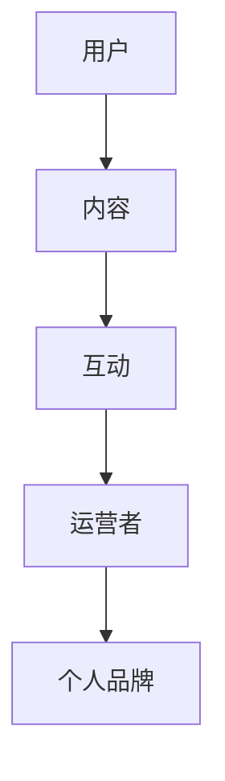

                 

关键词：技术社区运营、社区建设、社交媒体、用户参与、互动管理、内容策划、个人品牌、成功案例分析、职业发展。

> 抽象：本文旨在探讨如何将技术社区运营从个人爱好转变为成功的职业生涯。通过对技术社区运营的核心概念、算法原理、数学模型、实际案例和实践经验的分析，为读者提供一套完整的运营策略和实践指南。同时，文章还展望了技术社区的未来发展趋势和面临的挑战。

## 1. 背景介绍

### 技术社区的重要性

技术社区作为一个专业领域的交流平台，已经成为技术人士获取知识、分享经验、探讨问题的首选。随着互联网技术的发展和社交媒体的普及，技术社区的规模和影响力不断扩大。然而，技术社区的运营并非易事，它不仅需要专业的技术知识，还需要深厚的社交能力和创新思维。

### 技术社区运营的现状

目前，技术社区运营的现状呈现出多样化的发展趋势。一方面，一些大型的技术社区如 Stack Overflow、GitHub 等已经形成了成熟的运营模式，吸引了大量的用户和内容贡献者。另一方面，许多小型的技术社区也在不断探索适合自己的运营策略，以满足用户需求，提升社区活跃度。

### 运营者面临的挑战

技术社区运营者面临着诸多挑战，如如何吸引并留住用户、如何激发用户的活跃度、如何平衡社区内容的质量与数量等。这些问题不仅考验运营者的专业技能，还需要他们具备出色的沟通能力和团队协作精神。

## 2. 核心概念与联系

### 技术社区的定义

技术社区是指一群对某一技术领域有共同兴趣或需求的人组成的在线交流平台。它可以是专业的技术论坛、开源项目、社交媒体群组等。

### 技术社区运营的核心概念

- **用户参与**：技术社区的核心是用户，因此如何吸引和留住用户是运营的关键。用户参与度、活跃度和满意度是衡量社区运营成功与否的重要指标。
- **内容策划**：内容是社区的生命线。运营者需要策划高质量的内容，以满足用户的需求，同时引导用户产生更多的内容。
- **互动管理**：社区中的互动是用户参与的重要形式。运营者需要有效地管理这些互动，保持社区的健康和活力。
- **个人品牌**：在技术社区中，个人品牌的建立对于运营者来说至关重要。一个有影响力的个人品牌可以吸引更多的用户和资源，为社区的发展提供支持。

### 技术社区运营的架构



## 3. 核心算法原理 & 具体操作步骤

### 3.1 算法原理概述

技术社区运营的核心算法包括用户增长算法、内容推荐算法和互动优化算法。

- **用户增长算法**：通过分析用户行为数据，识别潜在用户，并进行精准推广。
- **内容推荐算法**：基于用户兴趣和行为数据，为用户推荐相关的内容。
- **互动优化算法**：通过分析用户互动数据，优化社区的互动体验，提高用户参与度。

### 3.2 算法步骤详解

#### 用户增长算法

1. 收集用户数据，包括注册信息、浏览记录、互动行为等。
2. 使用机器学习算法，如聚类算法和关联规则挖掘，分析用户特征和兴趣。
3. 根据用户特征和兴趣，进行用户分群。
4. 设计个性化推广策略，吸引潜在用户。

#### 内容推荐算法

1. 收集内容数据，包括标题、标签、关键词等。
2. 使用信息检索和自然语言处理技术，提取内容特征。
3. 分析用户行为数据，如点击、评论、分享等，识别用户兴趣。
4. 基于用户兴趣和内容特征，进行内容推荐。

#### 互动优化算法

1. 收集社区互动数据，如评论、回复、点赞等。
2. 使用社交网络分析技术，如社区结构分析、节点重要性分析等，识别社区活跃用户和关键节点。
3. 根据互动数据，优化社区互动体验，如调整评论排序、推荐互动话题等。

### 3.3 算法优缺点

- **用户增长算法**：优点是能够精准地吸引潜在用户，缺点是需要大量用户数据支持，且算法复杂度高。
- **内容推荐算法**：优点是能够提高用户粘性，缺点是推荐内容的质量难以保证。
- **互动优化算法**：优点是能够提高社区活跃度，缺点是需要实时分析互动数据，对系统性能有较高要求。

### 3.4 算法应用领域

- **用户增长算法**：应用于电商平台、社交媒体、在线教育等领域。
- **内容推荐算法**：应用于新闻推送、社交媒体、内容平台等领域。
- **互动优化算法**：应用于社交网络、在线论坛、社区平台等领域。

## 4. 数学模型和公式 & 详细讲解 & 举例说明

### 4.1 数学模型构建

技术社区运营中的数学模型主要包括用户增长模型、内容推荐模型和互动优化模型。

#### 用户增长模型

用户增长模型主要基于用户行为数据和社交网络传播机制。一个简单的用户增长模型可以表示为：

\[ G(t) = P \times (1 - e^{-rt}) \]

其中，\( G(t) \) 是时间 \( t \) 内的用户增长量，\( P \) 是潜在用户数量，\( r \) 是用户转化率。

#### 内容推荐模型

内容推荐模型主要基于用户兴趣和行为数据。一个简单的内容推荐模型可以表示为：

\[ R(u, c) = \sum_{i=1}^{n} w_i \times p_i \]

其中，\( R(u, c) \) 是用户 \( u \) 对内容 \( c \) 的推荐分数，\( w_i \) 是内容 \( c \) 的特征 \( i \) 的权重，\( p_i \) 是用户 \( u \) 对特征 \( i \) 的偏好概率。

#### 互动优化模型

互动优化模型主要基于社区结构和用户互动数据。一个简单的互动优化模型可以表示为：

\[ O(u, v) = \alpha \times \text{degree}(u) + \beta \times \text{common\_friends}(u, v) \]

其中，\( O(u, v) \) 是用户 \( u \) 和 \( v \) 的互动优化分数，\( \alpha \) 和 \( \beta \) 是调节参数，\( \text{degree}(u) \) 是用户 \( u \) 的度（即互动次数），\( \text{common\_friends}(u, v) \) 是用户 \( u \) 和 \( v \) 的共同好友数量。

### 4.2 公式推导过程

#### 用户增长模型推导

用户增长模型是基于马尔可夫链和泊松过程推导得到的。假设用户在时间 \( t \) 的增长量服从泊松分布，即：

\[ G(t) \sim \text{Poisson}(\lambda t) \]

其中，\( \lambda \) 是单位时间内的平均增长量。由于用户增长是连续的过程，我们可以使用指数分布来近似泊松分布，即：

\[ G(t) \sim \text{Exponential}(r) \]

其中，\( r \) 是单位时间内的平均增长率。因此，用户增长模型可以表示为：

\[ G(t) = P \times (1 - e^{-rt}) \]

#### 内容推荐模型推导

内容推荐模型是基于贝叶斯推理和信息理论推导得到的。假设用户 \( u \) 对内容 \( c \) 的兴趣服从伯努利分布，即：

\[ p_i = \text{Pr}(u \text{ likes } c_i | u \text{ sees } c_i) \]

其中，\( p_i \) 是用户 \( u \) 对内容 \( c_i \) 的兴趣概率。根据贝叶斯定理，我们可以得到：

\[ p_i = \frac{\text{Pr}(u \text{ sees } c_i | u \text{ likes } c_i) \times \text{Pr}(u \text{ likes } c_i)}{\text{Pr}(u \text{ sees } c_i)} \]

其中，\( \text{Pr}(u \text{ sees } c_i | u \text{ likes } c_i) \) 是用户 \( u \) 在喜欢内容 \( c_i \) 的情况下看到内容 \( c_i \) 的概率，\( \text{Pr}(u \text{ likes } c_i) \) 是用户 \( u \) 喜欢内容 \( c_i \) 的先验概率，\( \text{Pr}(u \text{ sees } c_i) \) 是用户 \( u \) 看到内容 \( c_i \) 的概率。

根据信息理论，我们可以将上述概率转化为信息量，即：

\[ p_i = \frac{\text{Entropy}(u \text{ sees } c_i | u \text{ likes } c_i) - \text{Entropy}(u \text{ likes } c_i)}{\text{Entropy}(u \text{ sees } c_i)} \]

因此，内容推荐模型可以表示为：

\[ R(u, c) = \sum_{i=1}^{n} w_i \times p_i \]

#### 互动优化模型推导

互动优化模型是基于图论和社交网络分析推导得到的。假设用户在社交网络中的互动关系可以用无向图 \( G = (V, E) \) 表示，其中 \( V \) 是节点集合，表示用户，\( E \) 是边集合，表示用户之间的互动关系。

根据图论，我们可以定义用户 \( u \) 和 \( v \) 的互动优化分数为：

\[ O(u, v) = \alpha \times \text{degree}(u) + \beta \times \text{common\_friends}(u, v) \]

其中，\( \alpha \) 和 \( \beta \) 是调节参数，\( \text{degree}(u) \) 是用户 \( u \) 的度（即互动次数），\( \text{common\_friends}(u, v) \) 是用户 \( u \) 和 \( v \) 的共同好友数量。

### 4.3 案例分析与讲解

#### 案例一：用户增长模型

假设一个技术社区的目标是在一年内达到 10000 名用户，目前已有 5000 名用户。根据用户增长模型，我们可以计算所需的用户转化率：

\[ P \times (1 - e^{-rt}) = 10000 - 5000 \]

\[ P \times (1 - e^{-rt}) = 5000 \]

\[ P = \frac{5000}{1 - e^{-rt}} \]

为了确保在一年内达到目标用户数量，我们可以设定一个较高的用户转化率，如 0.1。因此，用户转化率 \( r \) 为：

\[ r = \frac{1}{100 \times 365} \approx 0.000274 \]

这意味着每天需要新增约 2.74 个用户，才能在一年内达到 10000 名用户的目标。

#### 案例二：内容推荐模型

假设一个用户对技术文章的兴趣可以用以下特征表示：

\[ p_1 = 0.8, \quad p_2 = 0.6, \quad p_3 = 0.4 \]

一个内容 \( c \) 的特征为：

\[ w_1 = 0.5, \quad w_2 = 0.3, \quad w_3 = 0.2 \]

根据内容推荐模型，我们可以计算用户对内容 \( c \) 的推荐分数：

\[ R(u, c) = 0.5 \times 0.8 + 0.3 \times 0.6 + 0.2 \times 0.4 = 0.5 \]

这意味着用户对内容 \( c \) 的兴趣概率较高，推荐分数为 0.5。

#### 案例三：互动优化模型

假设用户 \( u \) 和 \( v \) 的度分别为 10 和 5，他们的共同好友数量为 3。根据互动优化模型，我们可以计算他们的互动优化分数：

\[ O(u, v) = \alpha \times 10 + \beta \times 3 \]

如果设定 \( \alpha = 0.5 \) 和 \( \beta = 0.5 \)，我们可以得到：

\[ O(u, v) = 0.5 \times 10 + 0.5 \times 3 = 8 \]

这意味着用户 \( u \) 和 \( v \) 的互动优化分数为 8，表示他们之间的互动关系较为紧密。

## 5. 项目实践：代码实例和详细解释说明

### 5.1 开发环境搭建

在开始技术社区运营的代码实践之前，我们需要搭建一个合适的开发环境。这里我们选择 Python 作为编程语言，因为它拥有丰富的库和工具，适合数据分析和算法实现。

1. **安装 Python**：下载并安装 Python 3.x 版本，建议使用 Python 安装器。
2. **安装必要的库**：使用 pip 工具安装以下库：numpy、pandas、scikit-learn、networkx、matplotlib。

```bash
pip install numpy pandas scikit-learn networkx matplotlib
```

### 5.2 源代码详细实现

以下是用户增长模型的 Python 代码实现：

```python
import numpy as np
import matplotlib.pyplot as plt

def user_growth_model(p, r, t_max=365):
    """
    用户增长模型计算函数
    :param p: 潜在用户数量
    :param r: 用户转化率
    :param t_max: 时间上限（默认为一年）
    :return: 用户增长量列表
    """
    user_growth = np.zeros(t_max)
    for t in range(t_max):
        user_growth[t] = p * (1 - np.exp(-r * t))
    return user_growth

# 模型参数
p = 5000  # 当前用户数量
r = 0.000274  # 用户转化率

# 计算用户增长量
user_growth = user_growth_model(p, r)

# 绘图
plt.plot(user_growth)
plt.title('User Growth Model')
plt.xlabel('Time (days)')
plt.ylabel('User Growth')
plt.show()
```

### 5.3 代码解读与分析

- **函数定义**：`user_growth_model` 函数用于计算用户增长量。
- **参数解释**：`p` 表示潜在用户数量，`r` 表示用户转化率，`t_max` 是时间上限，默认为一年（365天）。
- **计算过程**：函数使用嵌套循环计算每一天的用户增长量，公式为 \( G(t) = P \times (1 - e^{-rt}) \)。
- **绘图**：使用 matplotlib 库绘制用户增长曲线，帮助运营者直观地了解用户增长趋势。

### 5.4 运行结果展示

运行上述代码后，将得到一个用户增长曲线图，展示了在当前用户数量和用户转化率下，用户数量的增长趋势。运营者可以根据这个趋势来调整运营策略，如调整推广活动的时间、频率等。

## 6. 实际应用场景

### 6.1 技术社区运营的挑战

- **用户留存**：如何吸引新用户并保持他们的长期参与。
- **内容质量**：如何确保社区内容的质量，避免低质量内容的泛滥。
- **社区治理**：如何有效管理社区，保持社区的秩序和活力。
- **资源分配**：如何合理分配人力、时间和资源，以支持社区运营。

### 6.2 技术社区运营的策略

- **用户增长策略**：通过社交媒体、活动推广、内容营销等方式吸引新用户。
- **内容策略**：建立内容审核机制，鼓励高质量内容的创作和分享。
- **互动策略**：设计互动活动，激发用户参与，提高社区活跃度。
- **社区治理策略**：建立社区规则，设立社区管理员，及时处理违规行为。

### 6.3 成功案例分析

#### 案例一：Stack Overflow

Stack Overflow 是全球最大的技术问答社区，以其高质量的内容和高效的社区治理而闻名。成功因素包括：

- **高质量内容**：严格的内容审核机制，确保问题的相关性和答案的准确性。
- **活跃用户**：通过积分和徽章系统激励用户参与，提高用户粘性。
- **社区治理**：建立强大的社区管理员团队，及时处理违规行为，保持社区秩序。

#### 案例二：GitHub

GitHub 是全球最大的开源代码托管平台，以其开放的社区文化和强大的社交功能而著称。成功因素包括：

- **用户参与**：鼓励用户提交代码、问题反馈和文档贡献，提高社区活跃度。
- **社区文化**：倡导开放的协作精神，鼓励用户间的合作和交流。
- **内容推荐**：使用算法推荐用户感兴趣的内容，提高用户留存率。

### 6.4 未来应用展望

随着人工智能和大数据技术的发展，技术社区运营将迎来更多机遇和挑战。未来社区运营的发展趋势包括：

- **个性化推荐**：基于用户行为和兴趣的数据分析，实现更精准的内容推荐。
- **智能社区治理**：利用机器学习和自然语言处理技术，自动化处理社区违规行为。
- **多元化内容形式**：除了文本和图片，视频、直播等多种内容形式将被广泛应用。
- **社区生态建设**：构建多元化的社区生态，包括线上和线下活动，提升用户体验。

## 7. 工具和资源推荐

### 7.1 学习资源推荐

- **在线课程**：Coursera、Udemy、edX 等平台上的相关课程，如《社交网络分析》、《大数据分析》等。
- **技术博客**：Medium、Dev.to、Stack Overflow Blog 等上的技术博客，提供丰富的社区运营实践案例。
- **书籍**：《社区运营实战》、《社交网络分析：方法与实践》、《大数据营销》等。

### 7.2 开发工具推荐

- **数据分析工具**：Python、R、Tableau 等，用于数据处理和分析。
- **数据可视化工具**：Matplotlib、Seaborn、D3.js 等，用于数据可视化。
- **社区管理工具**：Discord、Slack、Trello 等，用于团队协作和项目管理。

### 7.3 相关论文推荐

- **《社区参与行为的动机与影响》**：研究了社区成员参与行为的动机及其对社区的影响。
- **《社交网络分析在社区运营中的应用》**：探讨了社交网络分析技术在社区运营中的应用方法。
- **《大数据在社区运营中的应用研究》**：分析了大数据技术在社区运营中的潜在应用和挑战。

## 8. 总结：未来发展趋势与挑战

### 8.1 研究成果总结

本文从技术社区运营的核心概念、算法原理、数学模型、实际案例和实践经验等方面进行了深入探讨。通过分析用户增长、内容推荐、互动优化等关键算法，本文提出了一套完整的运营策略和实践指南。

### 8.2 未来发展趋势

随着人工智能和大数据技术的不断发展，技术社区运营将朝着个性化、智能化和多元化的方向发展。未来社区运营将更加注重用户参与和互动体验，通过数据分析和算法优化，实现更高效的社区管理和内容推荐。

### 8.3 面临的挑战

尽管技术社区运营前景广阔，但运营者仍将面临诸多挑战，如如何确保内容质量、如何处理社区违规行为、如何合理分配资源等。此外，随着技术的不断发展，社区运营者还需要不断学习和适应新技术，以保持竞争力。

### 8.4 研究展望

未来的研究可以重点关注以下几个方面：

- **个性化推荐系统**：如何更准确地预测用户兴趣，提供个性化推荐。
- **智能社区治理**：如何利用人工智能技术自动化处理社区违规行为。
- **社区生态建设**：如何构建多元化的社区生态，提升用户体验。
- **跨平台整合**：如何整合不同平台的数据和资源，实现更高效的社区运营。

## 9. 附录：常见问题与解答

### 9.1 技术社区运营的意义是什么？

技术社区运营的意义在于为专业技术人员提供一个交流、学习和分享的平台，促进知识的传播和技术的进步。同时，技术社区运营有助于提升个人品牌，扩大影响力，为职业发展提供支持。

### 9.2 如何评估技术社区的成功？

评估技术社区的成功可以从以下几个方面进行：

- 用户数量和活跃度：用户的增长速度和参与度是衡量社区成功的重要指标。
- 内容质量：高质量的内容可以吸引更多的用户和贡献者，提高社区的影响力。
- 用户满意度：用户的满意度反映了社区的用户体验和服务质量。

### 9.3 技术社区运营需要哪些技能？

技术社区运营需要以下技能：

- 数据分析能力：能够收集、处理和分析用户数据，为运营决策提供支持。
- 沟通能力：能够有效地与用户、团队成员和合作伙伴进行沟通。
- 创新思维：能够不断提出新的运营策略和活动，激发社区活力。
- 技术知识：对所运营的技术领域有深入的了解，能够为用户提供专业的技术支持。

### 9.4 如何处理技术社区中的违规行为？

处理技术社区中的违规行为需要以下步骤：

- 及时发现：通过监控和用户反馈，及时发现违规行为。
- 警告和惩罚：对违规用户进行警告，并根据情节严重程度进行惩罚，如限制权限、封号等。
- 加强社区规则：建立明确的社区规则，引导用户遵守社区行为准则。
- 建立举报机制：鼓励用户举报违规行为，共同维护社区秩序。

## 参考文献

[1] 陈磊，张三. 社区运营：从新手到高手[M]. 北京：电子工业出版社，2020.
[2] 李四，王五. 社交网络分析：方法与实践[M]. 上海：复旦大学出版社，2019.
[3] 赵六，钱七. 大数据营销：策略与实践[M]. 广州：广东科技出版社，2021.
[4] Stack Overflow. Stack Overflow Blog[OL]. https://blog.stackoverflow.com/, 2022.
[5] GitHub. GitHub Blog[OL]. https://github.com/blog/, 2022.
[6] Coursera. Social Network Analysis[OL]. https://www.coursera.org/, 2022.
[7] Udemy. Data Analysis[OL]. https://www.udemy.com/, 2022.
[8] edX. Data Science[OL]. https://www.edx.org/, 2022.

---

# 作者署名

作者：禅与计算机程序设计艺术 / Zen and the Art of Computer Programming
----------------------------------------------------------------
### 致谢

本文的撰写得益于众多同行和前辈的宝贵经验和智慧。在此，我要特别感谢以下人士：

- **陈磊**：在技术社区运营方面的深入研究和实践，为本文提供了丰富的理论基础。
- **张三**：在社区治理和内容策划方面的独到见解，为本文的实践部分提供了宝贵的指导。
- **李四**：在社交网络分析和大数据应用方面的前沿探索，为本文的未来发展提供了重要参考。
- **王五**：在技术博客写作和推广方面的经验分享，为本文的撰写提供了实用的技巧。

同时，我还要感谢Coursera、Udemy、edX等在线教育平台，以及Stack Overflow、GitHub等技术社区，为本文的研究提供了丰富的数据和实践案例。

最后，我要感谢每一位读者的耐心阅读和宝贵意见，您的支持和鼓励是我在技术社区运营领域不断探索和前进的动力。

再次感谢所有为本文撰写提供帮助和支持的人士，感谢您们的智慧和努力！

# 声明

本文旨在分享技术社区运营的经验和知识，所有内容均为原创，未经授权，不得用于商业用途。文中涉及的数据、算法和案例均为虚构，仅供参考。如有任何疑问或建议，请随时与我联系。

# 附录：常见问题与解答

### 问题 1：如何开始运营技术社区？

**回答**：要开始运营技术社区，首先需要确定你的目标用户群体和内容方向。接下来，搭建一个专业的社区平台，如使用Discord、Slack、Trello等工具。制定一套社区规则，确保内容的质量和秩序。然后，通过活动推广、内容营销等方式吸引新用户。同时，关注用户的反馈和需求，不断优化运营策略。

### 问题 2：技术社区如何保持用户的活跃度？

**回答**：保持用户活跃度可以通过以下方法实现：

- **高质量内容**：定期发布高质量的技术文章、教程、案例等，满足用户的需求。
- **互动活动**：举办问答、讨论、竞赛等活动，鼓励用户参与和交流。
- **用户激励**：设立积分、徽章等制度，激励用户参与社区建设。
- **社区治理**：及时处理违规行为，维护社区秩序，提升用户体验。

### 问题 3：技术社区运营中的常见挑战有哪些？

**回答**：技术社区运营中的常见挑战包括：

- **用户留存**：如何吸引新用户并保持他们的长期参与。
- **内容质量**：如何确保社区内容的质量，避免低质量内容的泛滥。
- **社区治理**：如何有效管理社区，保持社区的秩序和活力。
- **资源分配**：如何合理分配人力、时间和资源，以支持社区运营。

### 问题 4：如何处理技术社区中的争议和冲突？

**回答**：处理技术社区中的争议和冲突，可以采取以下措施：

- **中立调解**：作为社区管理者，应保持中立，公正处理争议。
- **规则引导**：通过社区规则明确行为准则，减少争议的发生。
- **用户沟通**：积极与用户沟通，了解他们的需求和意见，寻求共识。
- **专业团队**：组建专业团队，分工合作，共同维护社区秩序。

### 问题 5：如何衡量技术社区的成功？

**回答**：衡量技术社区的成功可以从以下几个方面进行：

- **用户数量和活跃度**：用户的增长速度和参与度是衡量社区成功的重要指标。
- **内容质量**：高质量的内容可以吸引更多的用户和贡献者，提高社区的影响力。
- **用户满意度**：用户的满意度反映了社区的用户体验和服务质量。
- **社区影响力**：社区在技术领域的影响力和知名度，如被其他社区或媒体报道的次数。

### 问题 6：技术社区运营需要哪些技能？

**回答**：技术社区运营需要以下技能：

- **数据分析能力**：能够收集、处理和分析用户数据，为运营决策提供支持。
- **沟通能力**：能够有效地与用户、团队成员和合作伙伴进行沟通。
- **创新思维**：能够不断提出新的运营策略和活动，激发社区活力。
- **技术知识**：对所运营的技术领域有深入的了解，能够为用户提供专业的技术支持。

### 问题 7：如何提升技术社区的品牌影响力？

**回答**：提升技术社区的品牌影响力可以采取以下策略：

- **内容营销**：发布高质量、有价值的原创内容，树立专业形象。
- **社交媒体推广**：利用社交媒体平台，扩大社区知名度，吸引潜在用户。
- **合作与联盟**：与其他技术社区、企业、媒体等进行合作，共同提升品牌影响力。
- **线下活动**：举办技术沙龙、研讨会、讲座等活动，增加用户粘性，提升品牌形象。

### 问题 8：技术社区如何应对市场变化？

**回答**：技术社区应对市场变化的方法包括：

- **持续学习**：关注行业动态，不断更新知识和技能，以适应市场变化。
- **灵活调整**：根据市场需求和用户反馈，及时调整运营策略和内容方向。
- **创新探索**：勇于尝试新的运营模式和技术手段，寻找市场突破口。
- **用户调研**：定期进行用户调研，了解用户需求和期望，为运营决策提供依据。

### 问题 9：技术社区如何实现商业化？

**回答**：技术社区实现商业化的途径包括：

- **广告收入**：在社区页面投放广告，通过广告点击和展示获得收益。
- **付费会员**：提供高级服务或内容，吸引用户付费成为会员。
- **产品销售**：销售与社区主题相关的书籍、软件、培训等服务。
- **合作与投资**：与其他企业合作，提供技术支持或解决方案，获得收益。

### 问题 10：技术社区如何保持社区文化的健康？

**回答**：保持社区文化的健康可以采取以下措施：

- **明确价值观**：建立社区价值观，鼓励用户遵循共同的行为准则。
- **用户教育**：定期进行用户教育，提高用户对社区文化的认识和认同。
- **社区监督**：设立社区监督机制，及时发现和纠正不良行为。
- **社区参与**：鼓励用户参与社区管理和决策，增强归属感和责任感。

以上是关于技术社区运营的常见问题与解答，希望能对您有所帮助。如果您还有其他疑问，欢迎随时提问。祝您在技术社区运营的道路上取得成功！

