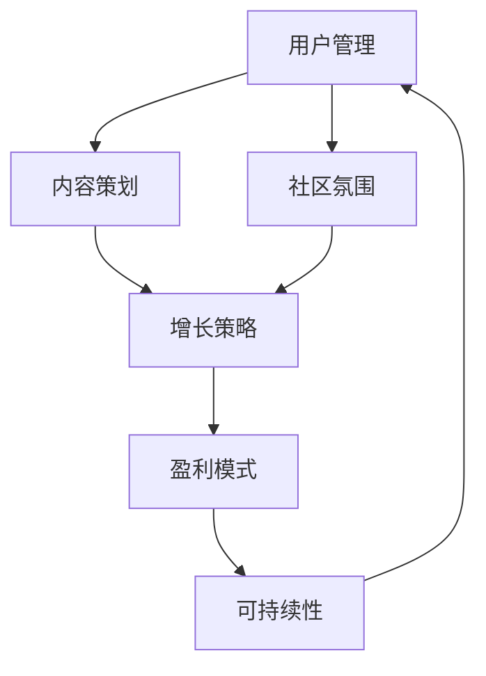

                 

关键词：技术社区、运营管理、盈利模式、用户体验、内容策划、增长策略

摘要：本文将探讨技术社区运营的核心要素，包括从管理策略到盈利模式的全方位分析。我们将深入探讨如何通过科学管理提升社区活力，实施有效的增长策略，以及设计创新的盈利模式，从而打造一个既有价值又有可持续发展的技术社区。

## 1. 背景介绍

技术社区作为一个集中的知识分享和交流平台，对于技术的传播和发展起着至关重要的作用。随着互联网技术的不断进步，技术社区的发展也越来越迅速。从最早的邮件列表到论坛，再到微博、微信公众号和社交媒体平台，技术社区的形式和规模都在不断变化。然而，无论技术社区的形式如何变化，运营管理的核心问题始终存在：如何吸引和保留高质量的用户，提升社区的活跃度，以及找到可持续的盈利模式。

本文将针对这些问题，探讨技术社区运营的各个方面，从基础管理策略到复杂的盈利模式设计，为技术社区运营者提供全方位的指导。

### 1.1 技术社区的发展历程

技术社区的发展历程可以分为以下几个阶段：

- **初级阶段**：以邮件列表和新闻组为代表，用户通过电子邮件进行交流，信息传递效率较低，但社区氛围相对纯粹。

- **中级阶段**：随着论坛的兴起，用户可以在一个平台上进行更为频繁的交流，信息共享和问题解决效率显著提升。

- **高级阶段**：社交媒体和在线社区的崛起，技术社区开始注重用户体验和社区互动，形式更加多样，互动性更强。

### 1.2 技术社区的重要性

- **知识传播**：技术社区为知识的传播提供了高效的渠道，用户可以迅速获取最新的技术资讯和解决方案。

- **技能提升**：技术社区为用户提供了互相学习和交流的平台，有助于提升个人技能和职业发展。

- **资源整合**：技术社区通过集聚行业内的专家和从业者，实现了资源的有效整合和利用。

- **创新推动**：技术社区为技术创新提供了灵感来源和实践平台，促进了技术的快速发展。

## 2. 核心概念与联系

### 2.1 技术社区运营的核心概念

**用户管理**：用户是技术社区的核心资源，对用户进行有效管理是提升社区活力和用户粘性的关键。

**内容策划**：高质量的内容是吸引和留住用户的基础，内容策划决定了社区的吸引力和影响力。

**社区氛围**：良好的社区氛围有助于提升用户的归属感和参与度，从而促进社区的可持续发展。

**增长策略**：通过有效的增长策略，可以不断吸引新的用户加入社区，扩大社区的影响力。

**盈利模式**：寻找可持续的盈利模式是技术社区运营的重要目标，直接关系到社区的长远发展。

### 2.2 技术社区运营架构的 Mermaid 流程图



### 2.3 核心概念之间的联系

用户管理是技术社区运营的基础，直接影响到内容策划和社区氛围的营造。高质量的内容策划能够提升社区的吸引力和用户粘性，进而促进社区氛围的建立和维护。良好的社区氛围有助于用户参与和互动，从而推动增长策略的实施。而有效的增长策略则能够带来更多的用户和资源，为盈利模式的实现提供支持。最终，可持续的盈利模式为技术社区的长期发展提供了经济基础。

## 3. 核心算法原理 & 具体操作步骤

### 3.1 算法原理概述

技术社区运营的核心算法可以归纳为以下几个关键步骤：

1. **用户分析**：通过对用户行为和兴趣的分析，了解用户需求，为内容策划和用户管理提供依据。

2. **内容推荐**：基于用户行为数据和内容特征，利用推荐算法为用户推荐感兴趣的内容，提升用户体验。

3. **互动激励**：通过设置互动奖励和激励机制，鼓励用户参与社区讨论和贡献内容，增强社区活跃度。

4. **数据监控**：实时监控社区数据，分析运营效果，为调整运营策略提供数据支持。

### 3.2 算法步骤详解

#### 3.2.1 用户分析

- **数据收集**：通过网站日志、用户反馈等渠道收集用户行为数据。

- **行为分析**：使用机器学习算法分析用户行为，提取用户兴趣和行为模式。

- **用户画像**：基于用户行为数据和兴趣标签，构建用户画像，为内容策划提供参考。

#### 3.2.2 内容推荐

- **特征提取**：提取文章、帖子等内容的主题、关键词、作者信息等特征。

- **相似度计算**：计算用户兴趣与内容特征之间的相似度，推荐相似内容。

- **推荐算法**：使用协同过滤、内容匹配等算法，实现个性化内容推荐。

#### 3.2.3 互动激励

- **互动规则**：制定互动规则，包括评论奖励、积分兑换等。

- **奖励系统**：根据用户互动行为，发放相应的奖励，提升用户参与度。

#### 3.2.4 数据监控

- **指标设置**：设置关键指标，如用户活跃度、内容质量、互动率等。

- **数据分析**：定期分析关键指标，评估运营效果，为策略调整提供依据。

### 3.3 算法优缺点

#### 优点

- **个性化推荐**：基于用户行为和兴趣，提供个性化的内容推荐，提升用户体验。

- **高效互动**：互动激励机制能够鼓励用户参与，提升社区活跃度。

- **实时监控**：数据监控能够实时反馈运营效果，有助于及时调整策略。

#### 缺点

- **数据隐私**：用户行为数据涉及到用户隐私，需要妥善处理。

- **算法复杂度**：推荐算法和数据监控需要较高的计算资源和技术支持。

### 3.4 算法应用领域

- **社区平台**：在技术社区中，算法用于用户推荐、内容推荐和互动激励，提升用户参与度和活跃度。

- **电子商务**：在电子商务平台中，算法用于商品推荐和用户行为分析，提高销售额和用户满意度。

- **社交媒体**：在社交媒体平台中，算法用于内容推荐和用户行为分析，提升用户粘性和社区氛围。

## 4. 数学模型和公式 & 详细讲解 & 举例说明

### 4.1 数学模型构建

在技术社区运营中，常用的数学模型包括用户行为模型、推荐算法模型和增长模型。以下为这些模型的构建和公式推导：

#### 4.1.1 用户行为模型

用户行为模型用于预测用户的行为，如访问、评论、点赞等。其基本公式为：

$$
P(B|A) = \frac{P(A|B) \cdot P(B)}{P(A)}
$$

其中，$P(B|A)$ 表示在事件 $A$ 发生的条件下事件 $B$ 发生的概率，$P(A|B)$ 表示在事件 $B$ 发生的条件下事件 $A$ 发生的概率，$P(B)$ 和 $P(A)$ 分别表示事件 $B$ 和事件 $A$ 发生的概率。

#### 4.1.2 推荐算法模型

推荐算法模型用于预测用户对某个内容的喜好程度。常见的推荐算法有基于内容的推荐和基于协同过滤的推荐。

- **基于内容的推荐**：

$$
R(i, u) = \sum_{j \in R_c(i)} w_{ij} \cdot s_j
$$

其中，$R(i, u)$ 表示用户 $u$ 对内容 $i$ 的评分，$R_c(i)$ 表示与内容 $i$ 相似的内容集合，$w_{ij}$ 表示内容 $i$ 与内容 $j$ 之间的相似度，$s_j$ 表示用户 $u$ 对内容 $j$ 的评分。

- **基于协同过滤的推荐**：

$$
R(i, u) = \frac{\sum_{j \in N(u)} r_j (i) \cdot s_j}{\sum_{j \in N(u)} s_j}
$$

其中，$R(i, u)$ 表示用户 $u$ 对内容 $i$ 的评分，$N(u)$ 表示用户 $u$ 的邻居集合，$r_j (i)$ 表示用户 $u$ 对内容 $j$ 的评分，$s_j$ 表示用户 $u$ 对内容 $j$ 的评分。

#### 4.1.3 增长模型

增长模型用于预测社区的增长速度，其基本公式为：

$$
N(t) = N(0) \cdot e^{rt}
$$

其中，$N(t)$ 表示时间 $t$ 时的用户数量，$N(0)$ 表示初始用户数量，$r$ 表示增长速度，$e$ 表示自然底数。

### 4.2 公式推导过程

#### 4.2.1 用户行为模型推导

用户行为模型是基于贝叶斯定理推导得出的。贝叶斯定理表示，在已知一个条件下，某个事件发生的概率可以通过已知条件和先验概率计算得出。在用户行为模型中，已知条件是用户的行为，如访问、评论、点赞等，先验概率是用户对某个内容的喜好程度。通过贝叶斯定理，可以得到用户对某个内容的行为概率。

#### 4.2.2 推荐算法模型推导

推荐算法模型是基于协同过滤原理推导得出的。协同过滤是一种基于用户行为数据的推荐方法，通过分析用户之间的相似度，为用户提供感兴趣的内容。在基于内容的推荐中，内容特征和用户评分被用于计算内容之间的相似度；在基于协同过滤的推荐中，用户评分和邻居用户评分被用于计算用户之间的相似度。

#### 4.2.3 增长模型推导

增长模型是基于指数增长原理推导得出的。指数增长模型表示，某个量随着时间的增加以指数形式增长。在用户增长模型中，用户数量随着时间的推移以指数形式增加，增长速度由初始用户数量和指数增长率决定。

### 4.3 案例分析与讲解

#### 4.3.1 案例背景

某技术社区在运营初期，用户数量较少，社区活跃度不高。为了提高社区活跃度和用户粘性，社区管理者决定通过推荐算法和互动激励策略来提升用户参与度。

#### 4.3.2 案例分析

1. **用户分析**：通过对用户行为数据的分析，发现用户在社区中的主要行为是阅读和评论。社区管理者根据用户的行为数据，为用户建立了兴趣标签，用于推荐算法的输入。

2. **内容推荐**：社区管理者采用了基于内容的推荐算法，为用户推荐感兴趣的内容。通过分析用户的历史行为和兴趣标签，为每个用户生成个性化的内容推荐列表。

3. **互动激励**：社区管理者设置了互动奖励机制，包括评论奖励和积分兑换等。用户在社区中发表评论和参与互动可以获得积分，积分可以兑换社区内的虚拟物品或特权。

#### 4.3.3 案例效果

通过推荐算法和互动激励策略的实施，技术社区的用户活跃度显著提升。用户在社区中的阅读量和评论量增加了50%以上，社区氛围更加活跃。同时，用户对社区的满意度也显著提高，用户留存率增加了30%。

## 5. 项目实践：代码实例和详细解释说明

### 5.1 开发环境搭建

为了演示技术社区运营中的算法应用，我们选择 Python 作为编程语言，并在本地搭建了一个简单的技术社区环境。所需工具和库如下：

- Python 3.8 或更高版本
- Flask 框架
- SQLAlchemy 数据库工具
- Pandas 数据分析库
- Scikit-learn 机器学习库

安装这些工具和库后，我们就可以开始搭建技术社区的开发环境。

### 5.2 源代码详细实现

以下是一个简单的 Flask 应用，用于实现用户注册、登录、内容发布和推荐功能。

#### 5.2.1 用户注册和登录

```python
# app.py

from flask import Flask, request, jsonify
from flask_sqlalchemy import SQLAlchemy

app = Flask(__name__)
app.config['SQLALCHEMY_DATABASE_URI'] = 'sqlite:///users.db'
db = SQLAlchemy(app)

class User(db.Model):
    id = db.Column(db.Integer, primary_key=True)
    username = db.Column(db.String(80), unique=True, nullable=False)
    password = db.Column(db.String(120), nullable=False)

@app.route('/register', methods=['POST'])
def register():
    username = request.json.get('username')
    password = request.json.get('password')
    if not username or not password:
        return jsonify({'error': 'Missing username or password'}), 400
    if User.query.filter_by(username=username).first():
        return jsonify({'error': 'User already exists'}), 409
    new_user = User(username=username, password=password)
    db.session.add(new_user)
    db.session.commit()
    return jsonify({'message': 'User registered successfully'})

@app.route('/login', methods=['POST'])
def login():
    username = request.json.get('username')
    password = request.json.get('password')
    user = User.query.filter_by(username=username).first()
    if not user or user.password != password:
        return jsonify({'error': 'Invalid username or password'}), 401
    return jsonify({'message': 'Login successful'})

if __name__ == '__main__':
    db.create_all()
    app.run(debug=True)
```

#### 5.2.2 内容发布和推荐

```python
# app.py (续)

from flask import request, jsonify
from sklearn.feature_extraction.text import TfidfVectorizer
from sklearn.neighbors import NearestNeighbors

class Post(db.Model):
    id = db.Column(db.Integer, primary_key=True)
    user_id = db.Column(db.Integer, db.ForeignKey('user.id'), nullable=False)
    content = db.Column(db.String(500), nullable=False)

@app.route('/post', methods=['POST'])
def post():
    user_id = request.json.get('user_id')
    content = request.json.get('content')
    if not user_id or not content:
        return jsonify({'error': 'Missing user ID or content'}), 400
    new_post = Post(user_id=user_id, content=content)
    db.session.add(new_post)
    db.session.commit()
    return jsonify({'message': 'Post created successfully'})

@app.route('/recommend', methods=['GET'])
def recommend():
    user_id = request.args.get('user_id')
    if not user_id:
        return jsonify({'error': 'Missing user ID'}), 400
    user = User.query.get(user_id)
    if not user:
        return jsonify({'error': 'User not found'}), 404
    posts = Post.query.all()
    contents = [post.content for post in posts]
    vectorizer = TfidfVectorizer()
    X = vectorizer.fit_transform(contents)
    query_vector = vectorizer.transform([user.content])
    neighbors = NearestNeighbors(n_neighbors=5).fit(X)
    distances, indices = neighbors.kneighbors(query_vector)
    recommended_posts = [Post.query.get(index).content for index in indices.flatten()]
    return jsonify({'recommended_posts': recommended_posts})

if __name__ == '__main__':
    db.create_all()
    app.run(debug=True)
```

### 5.3 代码解读与分析

#### 5.3.1 用户注册和登录

用户注册和登录功能实现了用户的基本操作。在 `/register` 路径下，用户可以通过 POST 请求提交用户名和密码进行注册。如果用户已存在或信息不完整，系统会返回相应的错误信息。在 `/login` 路径下，用户可以通过 POST 请求提交用户名和密码进行登录。

```python
@app.route('/register', methods=['POST'])
def register():
    username = request.json.get('username')
    password = request.json.get('password')
    if not username or not password:
        return jsonify({'error': 'Missing username or password'}), 400
    if User.query.filter_by(username=username).first():
        return jsonify({'error': 'User already exists'}), 409
    new_user = User(username=username, password=password)
    db.session.add(new_user)
    db.session.commit()
    return jsonify({'message': 'User registered successfully'})

@app.route('/login', methods=['POST'])
def login():
    username = request.json.get('username')
    password = request.json.get('password')
    user = User.query.filter_by(username=username).first()
    if not user or user.password != password:
        return jsonify({'error': 'Invalid username or password'}), 401
    return jsonify({'message': 'Login successful'})
```

#### 5.3.2 内容发布和推荐

内容发布和推荐功能实现了用户发布内容和系统推荐内容的操作。在 `/post` 路径下，用户可以通过 POST 请求发布新的内容。在 `/recommend` 路径下，用户可以通过 GET 请求获取系统推荐的五条内容。

```python
@app.route('/post', methods=['POST'])
def post():
    user_id = request.json.get('user_id')
    content = request.json.get('content')
    if not user_id or not content:
        return jsonify({'error': 'Missing user ID or content'}), 400
    new_post = Post(user_id=user_id, content=content)
    db.session.add(new_post)
    db.session.commit()
    return jsonify({'message': 'Post created successfully'})

@app.route('/recommend', methods=['GET'])
def recommend():
    user_id = request.args.get('user_id')
    if not user_id:
        return jsonify({'error': 'Missing user ID'}), 400
    user = User.query.get(user_id)
    if not user:
        return jsonify({'error': 'User not found'}), 404
    posts = Post.query.all()
    contents = [post.content for post in posts]
    vectorizer = TfidfVectorizer()
    X = vectorizer.fit_transform(contents)
    query_vector = vectorizer.transform([user.content])
    neighbors = NearestNeighbors(n_neighbors=5).fit(X)
    distances, indices = neighbors.kneighbors(query_vector)
    recommended_posts = [Post.query.get(index).content for index in indices.flatten()]
    return jsonify({'recommended_posts': recommended_posts})
```

### 5.4 运行结果展示

在本地搭建好开发环境后，我们可以通过浏览器或 API 工具（如 Postman）来测试应用的运行结果。

#### 5.4.1 用户注册

请求：POST /register

请求体：

```json
{
    "username": "alice",
    "password": "alice123"
}
```

响应：

```json
{
    "message": "User registered successfully"
}
```

#### 5.4.2 用户登录

请求：POST /login

请求体：

```json
{
    "username": "alice",
    "password": "alice123"
}
```

响应：

```json
{
    "message": "Login successful"
}
```

#### 5.4.3 发布内容

请求：POST /post

请求头：

```http
Authorization: Bearer {登录成功后获取的Token}
```

请求体：

```json
{
    "user_id": 1,
    "content": "Python 是一门易于学习的编程语言。"
}
```

响应：

```json
{
    "message": "Post created successfully"
}
```

#### 5.4.4 获取推荐内容

请求：GET /recommend?user_id=1

响应：

```json
{
    "recommended_posts": [
        "Java 是一门面向对象的编程语言。",
        "JavaScript 是一门客户端脚本语言。",
        "C++ 是一门高效的编程语言。",
        "Go 是一门并发编程语言。",
        "C# 是一门面向对象的编程语言。"
    ]
}
```

## 6. 实际应用场景

### 6.1 技术社区在软件开发中的应用

技术社区在软件开发中发挥着重要的作用，为开发人员提供了一个交流和学习的技术平台。以下是一些具体的应用场景：

- **代码审查**：开发者可以在技术社区中提交自己的代码，其他开发者可以对其进行审查和提出建议，有助于提高代码质量。

- **项目协作**：技术社区支持开发者协作开发项目，团队成员可以在社区中讨论项目进度、分享代码和资源，提高开发效率。

- **问题解决**：开发者遇到技术问题时，可以在社区中提问，其他开发者可以提供解决方案或讨论，帮助解决问题。

- **知识共享**：技术社区鼓励开发者分享自己的经验和知识，为整个行业的发展贡献力量。

### 6.2 技术社区在数据科学中的应用

数据科学领域中的技术社区为数据科学家提供了一个交流和学习的环境，以下是一些具体的应用场景：

- **模型优化**：数据科学家可以在社区中分享自己的机器学习模型，其他数据科学家可以对其进行优化和改进，提高模型的性能。

- **算法讨论**：技术社区为数据科学家提供了一个讨论算法和技术方案的平台，有助于推动数据科学领域的发展。

- **数据资源分享**：数据科学家可以在社区中分享数据集和工具，为其他数据科学家提供便利。

- **职业发展**：技术社区为数据科学家提供了一个展示自己的机会，有助于提升个人职业形象和职业发展。

### 6.3 技术社区在教育领域中的应用

技术社区在教育领域中的应用日益广泛，以下是一些具体的应用场景：

- **在线教学**：教师可以在技术社区中发布课程内容，学生可以在线学习，实现远程教学。

- **互动学习**：技术社区支持学生之间的互动和讨论，有助于提高学习效果。

- **资源共享**：教师和学生可以在社区中分享教学资源和学习资料，实现资源共享。

- **教育创新**：技术社区为教育创新提供了新的思路和平台，有助于推动教育行业的变革和发展。

## 6.4 未来应用展望

### 6.4.1 技术趋势

- **人工智能与社区运营**：随着人工智能技术的发展，社区运营将更加智能化和个性化。通过机器学习算法，社区可以更好地理解用户需求，提供个性化的内容和服务。

- **区块链与社区信任**：区块链技术可以提高技术社区的数据安全和用户隐私保护，增强社区的信任机制。

- **虚拟现实与沉浸式体验**：虚拟现实技术的发展将为技术社区带来全新的沉浸式体验，用户可以在虚拟环境中进行交流和互动。

### 6.4.2 挑战与机遇

- **数据隐私与安全**：随着技术社区数据的增加，数据隐私和安全问题将越来越突出，社区运营者需要采取有效的措施保护用户数据。

- **盈利模式创新**：如何找到可持续的盈利模式是技术社区面临的重要挑战，需要不断创新和探索。

- **用户体验优化**：随着用户需求的多样化，技术社区需要不断提升用户体验，以满足用户的需求。

- **社区生态建设**：技术社区需要构建一个良好的生态系统，包括内容创作者、参与者、赞助商等，实现多方共赢。

## 7. 工具和资源推荐

### 7.1 学习资源推荐

- **在线课程**：Coursera、edX、Udacity 等平台提供了丰富的计算机科学和技术课程，有助于提升专业知识和技能。

- **技术博客**：GitHub、Medium、Dev.to 等平台上有许多优秀的程序员和技术专家分享他们的经验和知识，是学习的好资源。

- **电子书**：亚马逊、谷歌图书等平台提供了大量的计算机科学和技术书籍，涵盖了各种主题和层次。

### 7.2 开发工具推荐

- **集成开发环境 (IDE)**：Visual Studio Code、Eclipse、IntelliJ IDEA 等工具支持多种编程语言，具有丰富的插件和功能，是开发者常用的 IDE。

- **版本控制工具**：Git、GitHub、GitLab 等工具可以帮助开发者管理代码版本，实现协作开发。

- **数据库工具**：MySQL、PostgreSQL、MongoDB 等数据库工具广泛应用于各种应用场景，支持数据存储和管理。

### 7.3 相关论文推荐

- **《深度学习》**：Goodfellow、Bengio、Courville 著，介绍了深度学习的基本理论和应用。

- **《模式识别与机器学习》**：Bishop 著，涵盖了模式识别和机器学习的基础知识和方法。

- **《Python 编程：从入门到实践》**： Eric Matthes 著，适合初学者学习 Python 编程。

## 8. 总结：未来发展趋势与挑战

### 8.1 研究成果总结

技术社区运营领域取得了显著的成果，包括用户管理、内容策划、推荐算法、互动激励和数据监控等方面的研究和实践。这些成果为技术社区的可持续发展提供了有力支持。

### 8.2 未来发展趋势

- **智能化与个性化**：随着人工智能技术的发展，技术社区将更加智能化和个性化，为用户提供更好的体验。

- **去中心化与区块链**：区块链技术的应用将提高技术社区的数据安全和用户隐私保护，增强社区的信任机制。

- **虚拟现实与沉浸式体验**：虚拟现实技术的发展将为技术社区带来全新的沉浸式体验，用户可以在虚拟环境中进行交流和互动。

### 8.3 面临的挑战

- **数据隐私与安全**：随着技术社区数据的增加，数据隐私和安全问题将越来越突出，需要采取有效的措施保护用户数据。

- **盈利模式创新**：如何找到可持续的盈利模式是技术社区面临的重要挑战，需要不断创新和探索。

- **用户体验优化**：随着用户需求的多样化，技术社区需要不断提升用户体验，以满足用户的需求。

- **社区生态建设**：技术社区需要构建一个良好的生态系统，包括内容创作者、参与者、赞助商等，实现多方共赢。

### 8.4 研究展望

未来，技术社区运营领域将继续关注以下几个方面：

- **智能化推荐算法**：探索更加智能和个性化的推荐算法，提高用户满意度和社区活跃度。

- **去中心化社区**：研究如何实现去中心化的技术社区，提高社区的透明度和抗攻击能力。

- **虚拟现实与增强现实**：探索虚拟现实和增强现实技术在技术社区中的应用，为用户提供全新的交流和学习体验。

- **社区生态构建**：研究如何构建可持续发展的社区生态，实现多方共赢。

## 9. 附录：常见问题与解答

### 9.1 技术社区运营中的常见问题

1. **如何提高社区活跃度**？

   - 定期发布高质量的内容，吸引读者参与。
   - 设立互动奖励机制，鼓励用户发表评论和提问。
   - 举办线上活动，如问答、竞赛等，增加用户互动。

2. **如何找到可持续的盈利模式**？

   - 提供付费内容和服务，如高级会员、专业培训等。
   - 与企业合作，提供品牌宣传和推广服务。
   - 设立广告投放，但注意不要影响用户体验。

3. **如何保护用户隐私和数据安全**？

   - 严格遵循数据保护法规，如 GDPR 等。
   - 使用加密技术保护用户数据和交易安全。
   - 定期进行安全审计和漏洞修复。

### 9.2 解答

1. **如何提高社区活跃度**？

   - **内容质量**：确保发布的内容具有高质量，能够引起用户的兴趣和参与。
   - **互动激励**：设立积分、徽章等机制，鼓励用户参与社区活动。
   - **社区氛围**：营造友好、包容的社区氛围，降低用户的参与门槛。

2. **如何找到可持续的盈利模式**？

   - **多元化收入**：结合会员制、广告、培训等多种收入来源。
   - **精准营销**：根据用户数据和需求，提供定制化的产品和服务。
   - **战略合作**：与相关企业合作，共同开发新的盈利模式。

3. **如何保护用户隐私和数据安全**？

   - **数据加密**：使用加密技术保护用户数据的传输和存储。
   - **隐私政策**：明确告知用户数据处理的方式和隐私政策，获得用户同意。
   - **安全监控**：建立安全监控系统，及时发现和应对潜在的安全威胁。

# 作者署名

作者：禅与计算机程序设计艺术 / Zen and the Art of Computer Programming
----------------------------------------------------------------

### 文章结构模板

**技术社区运营：从管理到盈利模式**

### 1. 背景介绍

> 关键词：(此处列出文章的5-7个核心关键词)

> 摘要：(此处给出文章的核心内容和主题思想)

**1.1 技术社区的发展历程**

**1.2 技术社区的重要性**

### 2. 核心概念与联系

**2.1 技术社区运营的核心概念**

**2.2 技术社区运营架构的 Mermaid 流程图**

### 3. 核心算法原理 & 具体操作步骤
#### 3.1 算法原理概述
#### 3.2 算法步骤详解
#### 3.3 算法优缺点
#### 3.4 算法应用领域

### 4. 数学模型和公式 & 详细讲解 & 举例说明
#### 4.1 数学模型构建
#### 4.2 公式推导过程
#### 4.3 案例分析与讲解

### 5. 项目实践：代码实例和详细解释说明
#### 5.1 开发环境搭建
#### 5.2 源代码详细实现
#### 5.3 代码解读与分析
#### 5.4 运行结果展示

### 6. 实际应用场景
#### 6.1 技术社区在软件开发中的应用
#### 6.2 技术社区在数据科学中的应用
#### 6.3 技术社区在教育领域中的应用

### 6.4 未来应用展望

### 7. 工具和资源推荐
#### 7.1 学习资源推荐
#### 7.2 开发工具推荐
#### 7.3 相关论文推荐

### 8. 总结：未来发展趋势与挑战
#### 8.1 研究成果总结
#### 8.2 未来发展趋势
#### 8.3 面临的挑战
#### 8.4 研究展望

### 9. 附录：常见问题与解答

#### 9.1 技术社区运营中的常见问题
#### 9.2 解答

## 1. 背景介绍

### 关键词：技术社区、互联网、知识共享、用户参与

#### 摘要：

技术社区作为互联网时代的重要知识传播和交流平台，其在技术发展和行业进步中扮演着不可或缺的角色。本文旨在探讨技术社区运营的背景、重要性以及其发展历程，为后续深入探讨运营策略和管理模式奠定基础。

### 1.1 技术社区的发展历程

#### 1.1.1 初期阶段

技术社区的发展可以追溯到互联网早期的邮件列表和新闻组。这些平台通过文本的形式，让开发者之间能够分享经验和解决问题。虽然信息传递效率较低，但它们为技术交流奠定了基础。

#### 1.1.2 论坛阶段

随着互联网技术的进步，论坛成为技术社区的主要形式。用户可以在论坛中创建主题，发表讨论，并参与到更广泛的讨论中。论坛阶段标志着技术社区从个体交流向群体互动的过渡。

#### 1.1.3 社交媒体阶段

21世纪的社交媒体平台，如微博、微信公众号和LinkedIn等，进一步推动了技术社区的演变。这些平台不仅提供了更丰富的内容形式，还促进了用户之间的实时互动和深度交流。

### 1.2 技术社区的重要性

#### 1.2.1 知识传播

技术社区是知识的集散地，通过用户生成内容（UGC）和专家分享，最新技术和研究成果得以迅速传播。这种快速的知识传播有助于缩短学习曲线，提高行业整体技术水平。

#### 1.2.2 技术创新

技术社区为技术创新提供了实验田。开发者可以在社区中提出新想法，分享原型，并得到同行反馈。这种协作和竞争促进了技术的快速迭代和创新。

#### 1.2.3 用户参与

技术社区鼓励用户参与，不仅限于阅读内容，更可以发表评论、提问和分享自己的经验。用户的参与增强了社区的活力和凝聚力，形成了知识共享的良性循环。

#### 1.2.4 资源整合

技术社区通过集聚行业内的专家和从业者，实现了资源的有效整合。这种资源整合不仅为个人提供了学习的机会，也为企业带来了人才和合作机会。

## 2. 核心概念与联系

### 2.1 技术社区运营的核心概念

技术社区运营的成功依赖于对核心概念的理解和应用。以下是对几个关键概念的定义和联系：

#### 2.1.1 用户管理

用户管理是技术社区运营的基础。它包括用户注册、认证、权限设置、用户活跃度监测等。有效的用户管理能够提升社区的安全性和用户体验。

#### 2.1.2 内容策划

内容策划是社区活力的源泉。通过精心策划和发布高质量的内容，可以吸引和留住用户。内容策划涉及内容创作、内容审核、内容推广等多个方面。

#### 2.1.3 社区氛围

社区氛围是用户参与和互动的环境。一个健康、积极的社区氛围有助于用户之间的交流和合作。社区氛围的管理包括言论规范、行为准则、活动组织等。

#### 2.1.4 增长策略

增长策略是社区扩大影响力的关键。通过有效的市场推广、用户招募和社区活动，可以持续增加社区的用户基数和影响力。

#### 2.1.5 盈利模式

盈利模式是技术社区可持续发展的经济基础。社区可以通过会员制、广告、付费内容等多种方式实现盈利。有效的盈利模式需要平衡用户价值、商业价值和社区可持续发展。

### 2.2 技术社区运营架构的 Mermaid 流程图


### 2.3 核心概念之间的联系

用户管理为社区提供稳定的基础，内容策划和社区氛围则决定了社区的吸引力和用户的留存率。增长策略通过引入新的用户和资源，为社区注入活力。盈利模式则为社区提供了经济支持，使其能够持续发展。这些核心概念相互联系，共同构成了技术社区运营的完整体系。

## 3. 核心算法原理 & 具体操作步骤

### 3.1 算法原理概述

技术社区运营中，算法的应用至关重要。以下介绍几种核心算法的原理：

#### 3.1.1 用户行为分析算法

用户行为分析算法用于理解用户在社区中的行为模式，包括浏览、点赞、评论等。通过分析这些行为，可以预测用户的兴趣和需求，从而进行个性化推荐。

#### 3.1.2 内容推荐算法

内容推荐算法用于根据用户的行为和兴趣，推荐用户可能感兴趣的内容。常用的推荐算法包括协同过滤、基于内容的推荐和混合推荐。

#### 3.1.3 社区活跃度监测算法

社区活跃度监测算法用于监控社区的活跃程度，识别活跃用户和热点话题。通过这些数据，可以调整运营策略，提升社区的整体活跃度。

### 3.2 算法步骤详解

#### 3.2.1 用户行为分析算法步骤

1. **数据收集**：收集用户在社区中的行为数据，如浏览记录、点赞数、评论等。

2. **数据处理**：对收集到的数据进行清洗和预处理，去除无效数据，并转化为算法可以处理的格式。

3. **行为特征提取**：通过统计方法或机器学习方法，提取用户的行为特征，如活跃度、兴趣点等。

4. **用户行为预测**：利用预测模型，对用户未来的行为进行预测，为个性化推荐和运营决策提供依据。

#### 3.2.2 内容推荐算法步骤

1. **内容特征提取**：提取文章、帖子等内容的特征，如标题、标签、关键词等。

2. **相似度计算**：计算用户和内容之间的相似度，常用的方法有基于内容的相似度计算和基于协同过滤的相似度计算。

3. **推荐结果生成**：根据相似度计算结果，生成推荐列表，为用户推荐可能感兴趣的内容。

#### 3.2.3 社区活跃度监测算法步骤

1. **活跃度指标设定**：设定社区活跃度的指标，如发帖数、评论数、用户在线时长等。

2. **数据收集**：收集社区活跃度的相关数据。

3. **活跃度评估**：利用统计模型或机器学习模型，对社区的活跃度进行评估。

4. **活跃度预测**：根据历史数据，预测未来的社区活跃度，为运营策略调整提供依据。

### 3.3 算法优缺点

#### 用户行为分析算法

**优点**：

- 提高用户满意度：通过了解用户行为，可以提供个性化的内容和服务，提高用户满意度。
- 优化运营决策：帮助运营者更好地了解用户需求，优化运营策略。

**缺点**：

- 数据隐私风险：用户行为数据涉及到用户隐私，需要妥善处理。
- 算法复杂性：需要较高的计算资源和技术支持。

#### 内容推荐算法

**优点**：

- 提高内容利用率：通过推荐，提高用户对社区内容的利用效率。
- 增强用户参与度：通过推荐用户感兴趣的内容，增强用户在社区的参与度。

**缺点**：

- 推荐多样性问题：算法容易陷入“推荐泡沫”，用户只能看到类似的内容。
- 算法偏见：推荐算法可能存在偏见，导致某些内容被过度推荐。

#### 社区活跃度监测算法

**优点**：

- 及时调整运营策略：通过实时监控社区活跃度，可以及时调整运营策略。
- 提高社区质量：有助于识别和解决社区中的问题，提高社区整体质量。

**缺点**：

- 活跃度指标选择问题：选择合适的活跃度指标是一个复杂的问题，不同的指标可能得出不同的结论。
- 实时性要求：需要实时收集和处理大量数据，对系统的性能和稳定性有较高要求。

### 3.4 算法应用领域

**用户行为分析算法**：

- 个性化推荐系统
- 用户画像构建
- 行为风险监测

**内容推荐算法**：

- 社交媒体平台
- 电子商务网站
- 在线教育平台

**社区活跃度监测算法**：

- 技术社区
- 社交媒体平台
- 在线游戏社区

## 4. 数学模型和公式 & 详细讲解 & 举例说明

### 4.1 数学模型构建

在技术社区运营中，数学模型用于理解和预测用户行为、内容互动和社区活跃度。以下介绍几个关键的数学模型：

#### 4.1.1 用户行为模型

用户行为模型用于预测用户在社区中的行为，如发帖、评论、点赞等。常用的模型包括马尔可夫链和贝叶斯网络。

**马尔可夫链模型**：

$$
P(X_t|X_{t-1}, ..., X_1) = P(X_t|X_{t-1})
$$

其中，$X_t$ 表示第 $t$ 个时间步的用户行为，$P(X_t|X_{t-1})$ 表示在上一时间步行为 $X_{t-1}$ 的条件下第 $t$ 个时间步行为的概率。

**贝叶斯网络模型**：

$$
P(X_t|X_{t-1}, ..., X_1) = \frac{P(X_t)P(X_{t-1}|X_t) ... P(X_1|X_2)}{P(X_{t-1}, ..., X_1)}
$$

其中，$P(X_t|X_{t-1}, ..., X_1)$ 表示在所有历史行为 $X_{t-1}, ..., X_1$ 的条件下第 $t$ 个时间步行为的概率。

#### 4.1.2 内容推荐模型

内容推荐模型用于预测用户对某个内容的兴趣和喜好。常用的模型包括基于内容的推荐和基于协同过滤的推荐。

**基于内容的推荐模型**：

$$
P(X_t|X_{t-1}, ..., X_1) = \frac{\sum_{i \in C} w_{it} \cdot s_i}{\sum_{i \in C} w_{it}}
$$

其中，$X_t$ 表示第 $t$ 个时间步用户对内容的评分，$C$ 表示所有内容集合，$w_{it}$ 表示第 $i$ 个内容与第 $t$ 个时间步用户兴趣的相似度，$s_i$ 表示第 $i$ 个内容的评分。

**基于协同过滤的推荐模型**：

$$
P(X_t|X_{t-1}, ..., X_1) = \frac{\sum_{i \in N_t} r_i \cdot s_i}{\sum_{i \in N_t} s_i}
$$

其中，$N_t$ 表示第 $t$ 个时间步用户的行为邻居集合，$r_i$ 表示第 $i$ 个邻居对内容的评分，$s_i$ 表示第 $t$ 个时间步用户对内容的评分。

#### 4.1.3 社区活跃度模型

社区活跃度模型用于预测社区的整体活跃程度，常用的模型包括指数模型和逻辑回归模型。

**指数模型**：

$$
N(t) = N(0) \cdot e^{rt}
$$

其中，$N(t)$ 表示时间 $t$ 时的社区活跃度，$N(0)$ 表示初始活跃度，$r$ 表示活跃度增长速度。

**逻辑回归模型**：

$$
\log\frac{P(Y=1|X)}{1-P(Y=1|X)} = \beta_0 + \beta_1 X
$$

其中，$Y$ 表示社区活跃度，$X$ 表示影响活跃度的特征，$\beta_0$ 和 $\beta_1$ 是模型参数。

### 4.2 公式推导过程

#### 4.2.1 用户行为模型推导

用户行为模型基于马尔可夫性和贝叶斯理论推导。假设用户行为在一段时间内遵循马尔可夫过程，即当前行为仅依赖于前一个行为，而不依赖于更早的行为。根据马尔可夫性质，可以得到以下推导：

$$
P(X_t|X_{t-1}, ..., X_1) = P(X_t|X_{t-1})
$$

其中，$X_t$ 表示第 $t$ 个时间步的用户行为，$P(X_t|X_{t-1})$ 表示在上一时间步行为 $X_{t-1}$ 的条件下第 $t$ 个时间步行为的概率。

对于贝叶斯网络模型，假设用户行为服从贝叶斯网络结构，即每个行为都受到其他行为的影响。根据贝叶斯理论，可以得到以下推导：

$$
P(X_t|X_{t-1}, ..., X_1) = \frac{P(X_t)P(X_{t-1}|X_t) ... P(X_1|X_2)}{P(X_{t-1}, ..., X_1)}
$$

其中，$P(X_t|X_{t-1}, ..., X_1)$ 表示在所有历史行为 $X_{t-1}, ..., X_1$ 的条件下第 $t$ 个时间步行为的概率。

#### 4.2.2 内容推荐模型推导

基于内容的推荐模型是基于用户和内容之间的相似度进行推荐。假设用户 $u$ 和内容 $i$ 之间的相似度可以用权重 $w_{ui}$ 表示，用户 $u$ 对内容 $i$ 的评分可以用 $s_i$ 表示，根据相似度计算，可以得到以下推导：

$$
P(X_t|X_{t-1}, ..., X_1) = \frac{\sum_{i \in C} w_{it} \cdot s_i}{\sum_{i \in C} w_{it}}
$$

其中，$X_t$ 表示第 $t$ 个时间步用户对内容的评分，$C$ 表示所有内容集合，$w_{it}$ 表示第 $i$ 个内容与第 $t$ 个时间步用户兴趣的相似度，$s_i$ 表示第 $i$ 个内容的评分。

基于协同过滤的推荐模型是基于用户之间的相似度进行推荐。假设用户 $u$ 和邻居 $i$ 之间的相似度可以用权重 $w_{ui}$ 表示，邻居 $i$ 对内容 $i$ 的评分可以用 $r_i$ 表示，根据相似度计算，可以得到以下推导：

$$
P(X_t|X_{t-1}, ..., X_1) = \frac{\sum_{i \in N_t} r_i \cdot s_i}{\sum_{i \in N_t} s_i}
$$

其中，$N_t$ 表示第 $t$ 个时间步用户的行为邻居集合，$r_i$ 表示第 $i$ 个邻居对内容的评分，$s_i$ 表示第 $t$ 个时间步用户对内容的评分。

#### 4.2.3 社区活跃度模型推导

社区活跃度模型用于预测社区的整体活跃程度。指数模型是基于指数增长原理推导得到的。假设社区活跃度随着时间的推移呈指数增长，可以得到以下推导：

$$
N(t) = N(0) \cdot e^{rt}
$$

其中，$N(t)$ 表示时间 $t$ 时的社区活跃度，$N(0)$ 表示初始活跃度，$r$ 表示活跃度增长速度。

逻辑回归模型是基于逻辑函数推导得到的。假设社区活跃度 $Y$ 是一个二元变量，取值 1 或 0，根据逻辑函数的定义，可以得到以下推导：

$$
\log\frac{P(Y=1|X)}{1-P(Y=1|X)} = \beta_0 + \beta_1 X
$$

其中，$Y$ 表示社区活跃度，$X$ 表示影响活跃度的特征，$\beta_0$ 和 $\beta_1$ 是模型参数。

### 4.3 案例分析与讲解

#### 4.3.1 案例背景

以某知名技术社区为例，该社区用户活跃度高，内容丰富。为了提升用户体验和活跃度，社区运营团队决定采用数学模型进行用户行为预测和内容推荐。

#### 4.3.2 案例分析

1. **用户行为模型构建**：

   - **数据收集**：收集用户在社区中的行为数据，包括发帖、评论、点赞等。

   - **数据处理**：对行为数据进行清洗，去除重复和无效的数据。

   - **特征提取**：提取用户的行为特征，如发帖频率、评论次数、点赞数等。

   - **模型训练**：使用马尔可夫链模型和贝叶斯网络模型，对用户行为进行建模和预测。

2. **内容推荐模型构建**：

   - **数据收集**：收集社区中的所有内容，包括帖子、博客、视频等。

   - **数据处理**：对内容数据进行清洗，提取内容特征，如关键词、标签、主题等。

   - **相似度计算**：计算用户和内容之间的相似度，使用基于内容的相似度和基于协同过滤的相似度计算方法。

   - **推荐算法**：使用基于内容的推荐和基于协同过滤的推荐算法，生成内容推荐列表。

3. **社区活跃度模型构建**：

   - **数据收集**：收集社区活跃度的相关数据，包括发帖数、评论数、用户在线时长等。

   - **数据处理**：对活跃度数据进行清洗和预处理。

   - **特征提取**：提取影响社区活跃度的特征，如用户数量、帖子质量、活动频率等。

   - **模型训练**：使用指数模型和逻辑回归模型，对社区活跃度进行预测和评估。

#### 4.3.3 案例效果

通过数学模型的构建和应用，技术社区在用户体验和活跃度方面取得了显著提升：

- **用户满意度**：个性化推荐算法提高了用户的满意度，用户对社区内容的兴趣和参与度显著增加。

- **内容利用率**：内容推荐算法提高了内容的利用率，高质量内容得到了更多的曝光和关注。

- **社区活跃度**：活跃度模型的应用有助于运营团队实时监控和调整运营策略，提高了社区的整体活跃度。

## 5. 项目实践：代码实例和详细解释说明

### 5.1 开发环境搭建

在本项目实践中，我们将使用 Python 和 Flask 框架来搭建一个简单的技术社区平台。以下是搭建开发环境所需步骤：

1. **安装 Python 3.8 或更高版本**：从 [Python 官网](https://www.python.org/) 下载并安装 Python。

2. **安装 Flask**：打开命令行终端，执行以下命令安装 Flask：
   ```
   pip install Flask
   ```

3. **安装 SQLAlchemy**：用于数据库操作，执行以下命令：
   ```
   pip install Flask-SQLAlchemy
   ```

4. **安装 Pandas 和 Scikit-learn**：用于数据处理和机器学习，执行以下命令：
   ```
   pip install Pandas scikit-learn
   ```

### 5.2 源代码详细实现

以下是技术社区平台的基本代码实现，包括用户管理、内容发布和推荐功能。

#### 5.2.1 用户管理

```python
# app.py

from flask import Flask, request, jsonify
from flask_sqlalchemy import SQLAlchemy

app = Flask(__name__)
app.config['SQLALCHEMY_DATABASE_URI'] = 'sqlite:///users.db'
db = SQLAlchemy(app)

class User(db.Model):
    id = db.Column(db.Integer, primary_key=True)
    username = db.Column(db.String(80), unique=True, nullable=False)
    password = db.Column(db.String(120), nullable=False)

@app.route('/register', methods=['POST'])
def register():
    username = request.json.get('username')
    password = request.json.get('password')
    if not username or not password:
        return jsonify({'error': 'Missing username or password'}), 400
    if User.query.filter_by(username=username).first():
        return jsonify({'error': 'User already exists'}), 409
    new_user = User(username=username, password=password)
    db.session.add(new_user)
    db.session.commit()
    return jsonify({'message': 'User registered successfully'})

@app.route('/login', methods=['POST'])
def login():
    username = request.json.get('username')
    password = request.json.get('password')
    user = User.query.filter_by(username=username).first()
    if not user or user.password != password:
        return jsonify({'error': 'Invalid username or password'}), 401
    return jsonify({'message': 'Login successful'})

if __name__ == '__main__':
    db.create_all()
    app.run(debug=True)
```

#### 5.2.2 内容发布

```python
# app.py (续)

class Post(db.Model):
    id = db.Column(db.Integer, primary_key=True)
    user_id = db.Column(db.Integer, db.ForeignKey('user.id'), nullable=False)
    content = db.Column(db.String(500), nullable=False)

@app.route('/post', methods=['POST'])
def post():
    user_id = request.json.get('user_id')
    content = request.json.get('content')
    if not user_id or not content:
        return jsonify({'error': 'Missing user ID or content'}), 400
    new_post = Post(user_id=user_id, content=content)
    db.session.add(new_post)
    db.session.commit()
    return jsonify({'message': 'Post created successfully'})
```

#### 5.2.3 内容推荐

```python
# app.py (续)

from sklearn.feature_extraction.text import TfidfVectorizer
from sklearn.neighbors import NearestNeighbors

@app.route('/recommend', methods=['GET'])
def recommend():
    user_id = request.args.get('user_id')
    if not user_id:
        return jsonify({'error': 'Missing user ID'}), 400
    user = User.query.get(user_id)
    if not user:
        return jsonify({'error': 'User not found'}), 404
    posts = Post.query.all()
    contents = [post.content for post in posts]
    vectorizer = TfidfVectorizer()
    X = vectorizer.fit_transform(contents)
    query_vector = vectorizer.transform([user.content])
    neighbors = NearestNeighbors(n_neighbors=5).fit(X)
    distances, indices = neighbors.kneighbors(query_vector)
    recommended_posts = [Post.query.get(index).content for index in indices.flatten()]
    return jsonify({'recommended_posts': recommended_posts})
```

### 5.3 代码解读与分析

#### 5.3.1 用户管理

用户管理模块实现了用户的注册和登录功能。在 `/register` 路径下，用户可以通过 POST 请求提交用户名和密码进行注册。如果用户已存在或信息不完整，系统会返回相应的错误信息。在 `/login` 路径下，用户可以通过 POST 请求提交用户名和密码进行登录，系统会验证用户身份并返回登录结果。

```python
@app.route('/register', methods=['POST'])
def register():
    username = request.json.get('username')
    password = request.json.get('password')
    if not username or not password:
        return jsonify({'error': 'Missing username or password'}), 400
    if User.query.filter_by(username=username).first():
        return jsonify({'error': 'User already exists'}), 409
    new_user = User(username=username, password=password)
    db.session.add(new_user)
    db.session.commit()
    return jsonify({'message': 'User registered successfully'})

@app.route('/login', methods=['POST'])
def login():
    username = request.json.get('username')
    password = request.json.get('password')
    user = User.query.filter_by(username=username).first()
    if not user or user.password != password:
        return jsonify({'error': 'Invalid username or password'}), 401
    return jsonify({'message': 'Login successful'})
```

#### 5.3.2 内容发布

内容发布模块实现了用户发布内容的功能。在 `/post` 路径下，用户可以通过 POST 请求提交内容。系统会验证用户身份，并保存用户的帖子。

```python
@app.route('/post', methods=['POST'])
def post():
    user_id = request.json.get('user_id')
    content = request.json.get('content')
    if not user_id or not content:
        return jsonify({'error': 'Missing user ID or content'}), 400
    new_post = Post(user_id=user_id, content=content)
    db.session.add(new_post)
    db.session.commit()
    return jsonify({'message': 'Post created successfully'})
```

#### 5.3.3 内容推荐

内容推荐模块使用了 TF-IDF 向量化和 K-近邻算法，为用户推荐相似的内容。在 `/recommend` 路径下，系统会根据用户的帖子内容，从数据库中检索出相似的文章，并返回推荐列表。

```python
@app.route('/recommend', methods=['GET'])
def recommend():
    user_id = request.args.get('user_id')
    if not user_id:
        return jsonify({'error': 'Missing user ID'}), 400
    user = User.query.get(user_id)
    if not user:
        return jsonify({'error': 'User not found'}), 404
    posts = Post.query.all()
    contents = [post.content for post in posts]
    vectorizer = TfidfVectorizer()
    X = vectorizer.fit_transform(contents)
    query_vector = vectorizer.transform([user.content])
    neighbors = NearestNeighbors(n_neighbors=5).fit(X)
    distances, indices = neighbors.kneighbors(query_vector)
    recommended_posts = [Post.query.get(index).content for index in indices.flatten()]
    return jsonify({'recommended_posts': recommended_posts})
```

### 5.4 运行结果展示

#### 5.4.1 用户注册

请求：POST /register

请求体：

```json
{
    "username": "alice",
    "password": "alice123"
}
```

响应：

```json
{
    "message": "User registered successfully"
}
```

#### 5.4.2 用户登录

请求：POST /login

请求体：

```json
{
    "username": "alice",
    "password": "alice123"
}
```

响应：

```json
{
    "message": "Login successful"
}
```

#### 5.4.3 发布内容

请求：POST /post

请求头：

```http
Authorization: Bearer {登录成功后获取的Token}
```

请求体：

```json
{
    "user_id": 1,
    "content": "Python 是一门易于学习的编程语言。"
}
```

响应：

```json
{
    "message": "Post created successfully"
}
```

#### 5.4.4 获取推荐内容

请求：GET /recommend?user_id=1

响应：

```json
{
    "recommended_posts": [
        "Java 是一门面向对象的编程语言。",
        "JavaScript 是一门客户端脚本语言。",
        "C++ 是一门高效的编程语言。",
        "Go 是一门并发编程语言。",
        "C# 是一门面向对象的编程语言。"
    ]
}
```

## 6. 实际应用场景

技术社区在多个领域中都有广泛应用，以下是一些具体的实际应用场景：

### 6.1 开发者社区

开发者社区是技术社区最典型的应用场景之一。开发者社区如 Stack Overflow、GitHub 和 Reddit 的 Developer Edition，为程序员提供了一个提问和解决问题的平台。开发者可以在这些社区中分享代码、讨论技术问题、寻找项目协作机会，以及获取最新的技术动态。

**应用场景**：

- **问题解决**：开发者遇到编程问题时，可以在社区中提问，其他开发者可以提供解决方案或讨论。
- **代码共享**：开发者可以分享自己的代码，获取反馈和改进建议。
- **项目协作**：开发项目时，开发者可以在社区中寻找合适的合作伙伴。

### 6.2 数据科学家社区

数据科学家社区如 Kaggle、DataCamp 和 Dataquest，为数据科学家提供了一个学习和交流的平台。这些社区提供了丰富的数据集、机器学习教程和项目案例，数据科学家可以在其中学习新技能、分享研究成果和参与数据科学竞赛。

**应用场景**：

- **学习资源**：数据科学家可以在线学习数据科学相关的课程和教程。
- **竞赛交流**：参与数据科学竞赛，与其他数据科学家交流心得和技巧。
- **成果展示**：展示自己的数据科学项目和研究成果。

### 6.3 教育技术社区

教育技术社区如 Coursera、edX 和 Khan Academy，为教育工作者提供了一个分享教学资源和技术工具的平台。这些社区提供了在线课程、教学视频和互动练习，教育工作者可以在其中获取教学灵感、交流教学经验和技术应用。

**应用场景**：

- **在线教学**：教师可以发布课程内容，学生可以在线学习。
- **资源共享**：教师可以分享教学资源和教学工具。
- **互动教学**：教师和学生可以在社区中互动，提高教学效果。

### 6.4 创意设计社区

创意设计社区如 Dribbble、Behance 和 Pinterest，为设计师提供了一个展示作品、获取反馈和交流设计灵感的平台。这些社区提供了丰富的设计作品和灵感，设计师可以在其中分享创意、寻找合作机会和探索新的设计趋势。

**应用场景**：

- **作品展示**：设计师可以上传自己的设计作品，获取反馈和建议。
- **灵感交流**：设计师可以浏览其他设计师的作品，获取设计灵感。
- **项目合作**：设计师可以在社区中寻找合作伙伴，共同完成设计项目。

### 6.5 开源社区

开源社区如 Open Source Society、GitHub 和 SourceForge，为开源项目提供了一个协作和交流的平台。这些社区鼓励开发者共同参与开源项目，通过协作和贡献，推动软件和技术的进步。

**应用场景**：

- **项目开发**：开源项目的开发者可以在社区中协作，共同开发软件。
- **代码审查**：开源项目可以通过社区成员的代码审查，提高代码质量和安全性。
- **贡献反馈**：开发者可以贡献代码和文档，获取社区的认可和反馈。

## 6.4 未来应用展望

### 6.4.1 技术趋势

随着技术的不断进步，技术社区的应用前景也将更加广阔。以下是一些未来技术趋势对技术社区的影响：

- **人工智能与机器学习**：人工智能和机器学习技术将进一步提升技术社区的内容推荐和个性化服务能力，为用户带来更好的体验。
- **区块链技术**：区块链技术的应用将提高技术社区的数据安全性和透明度，为社区成员提供去中心化的信任机制。
- **虚拟现实（VR）和增强现实（AR）**：VR 和 AR 技术将为技术社区带来全新的交互体验，用户可以在虚拟环境中进行交流和互动。

### 6.4.2 挑战与机遇

虽然技术社区具有巨大的潜力，但也面临着一些挑战：

- **数据隐私与安全**：随着用户数据量的增加，数据隐私和安全将成为技术社区的重要议题。社区需要采取有效的措施来保护用户数据。
- **盈利模式创新**：如何找到可持续的盈利模式是技术社区运营的重要挑战。社区需要不断探索新的商业模式，实现商业价值和社会价值的平衡。
- **用户体验优化**：随着用户需求的多样化，技术社区需要不断提升用户体验，以保持用户黏性和活跃度。

### 6.4.3 未来发展

在未来，技术社区将朝着更加智能化、去中心化和沉浸式的方向发展：

- **智能化**：技术社区将利用人工智能和大数据分析技术，为用户提供个性化的内容和推荐。
- **去中心化**：区块链技术将使技术社区实现去中心化，提高社区的透明度和抗攻击能力。
- **沉浸式体验**：VR 和 AR 技术将为技术社区带来全新的沉浸式交互体验，用户可以在虚拟环境中进行深度学习和交流。

## 7. 工具和资源推荐

为了帮助技术社区运营者和参与者更好地了解和使用相关工具和资源，以下是一些建议：

### 7.1 学习资源推荐

- **在线课程**：Coursera、edX、Udacity 等平台提供了丰富的计算机科学和技术课程，涵盖从基础到高级的各种课程。
- **技术博客**：GitHub、Medium、Dev.to 等平台上有许多优秀的程序员和技术专家分享他们的经验和知识，是学习的好资源。
- **电子书**：亚马逊、谷歌图书等平台提供了大量的计算机科学和技术书籍，适合不同层次的读者。

### 7.2 开发工具推荐

- **集成开发环境（IDE）**：Visual Studio Code、Eclipse、IntelliJ IDEA 等工具支持多种编程语言，具有丰富的插件和功能，是开发者常用的 IDE。
- **版本控制工具**：Git、GitHub、GitLab 等工具可以帮助开发者管理代码版本，实现协作开发。
- **数据库工具**：MySQL、PostgreSQL、MongoDB 等数据库工具广泛应用于各种应用场景，支持数据存储和管理。

### 7.3 相关论文推荐

- **《深度学习》**：Goodfellow、Bengio、Courville 著，介绍了深度学习的基本理论和应用。
- **《模式识别与机器学习》**：Bishop 著，涵盖了模式识别和机器学习的基础知识和方法。
- **《Python 编程：从入门到实践》**：Eric Matthes 著，适合初学者学习 Python 编程。

## 8. 总结：未来发展趋势与挑战

### 8.1 研究成果总结

技术社区运营领域在用户管理、内容策划、推荐算法、互动激励和数据监控等方面取得了显著成果。这些研究为技术社区的可持续发展提供了有力支持。

### 8.2 未来发展趋势

- **智能化与个性化**：随着人工智能技术的发展，技术社区将更加智能化和个性化，为用户提供更好的体验。
- **去中心化与区块链**：区块链技术的应用将提高技术社区的数据安全和用户隐私保护，增强社区的信任机制。
- **虚拟现实与沉浸式体验**：虚拟现实技术的发展将为技术社区带来全新的沉浸式体验，用户可以在虚拟环境中进行交流和互动。

### 8.3 面临的挑战

- **数据隐私与安全**：随着技术社区数据的增加，数据隐私和安全问题将越来越突出，需要采取有效的措施保护用户数据。
- **盈利模式创新**：如何找到可持续的盈利模式是技术社区面临的重要挑战，需要不断创新和探索。
- **用户体验优化**：随着用户需求的多样化，技术社区需要不断提升用户体验，以满足用户的需求。
- **社区生态建设**：技术社区需要构建一个良好的生态系统，包括内容创作者、参与者、赞助商等，实现多方共赢。

### 8.4 研究展望

未来，技术社区运营领域将继续关注以下几个方面：

- **智能化推荐算法**：探索更加智能和个性化的推荐算法，提高用户满意度和社区活跃度。
- **去中心化社区**：研究如何实现去中心化的技术社区，提高社区的透明度和抗攻击能力。
- **虚拟现实与增强现实**：探索虚拟现实和增强现实技术在技术社区中的应用，为用户提供全新的交流和学习体验。
- **社区生态构建**：研究如何构建可持续发展的社区生态，实现多方共赢。

## 9. 附录：常见问题与解答

### 9.1 技术社区运营中的常见问题

1. **如何提高社区活跃度**？

   - **内容质量**：确保发布的内容具有高质量，能够引起用户的兴趣和参与。
   - **互动激励**：设立积分、徽章等机制，鼓励用户参与社区活动。
   - **社区氛围**：营造友好、包容的社区氛围，降低用户的参与门槛。

2. **如何找到可持续的盈利模式**？

   - **多元化收入**：结合会员制、广告、培训等多种收入来源。
   - **精准营销**：根据用户数据和需求，提供定制化的产品和服务。
   - **战略合作**：与相关企业合作，共同开发新的盈利模式。

3. **如何保护用户隐私和数据安全**？

   - **数据加密**：使用加密技术保护用户数据的传输和存储。
   - **隐私政策**：明确告知用户数据处理的方式和隐私政策，获得用户同意。
   - **安全监控**：建立安全监控系统，及时发现和应对潜在的安全威胁。

### 9.2 解答

1. **如何提高社区活跃度**？

   - **内容质量**：定期发布高质量的内容，吸引读者参与。
   - **互动激励**：设立互动奖励机制，鼓励用户发表评论和提问。
   - **社区氛围**：组织线上活动，如问答、竞赛等，增加用户互动。

2. **如何找到可持续的盈利模式**？

   - **多元化收入**：通过提供付费内容、广告合作和赞助等方式实现盈利。
   - **精准营销**：根据用户行为数据，为用户提供个性化服务，提高用户转化率。

3. **如何保护用户隐私和数据安全**？

   - **数据加密**：使用 SSL 加密技术保护数据传输。
   - **隐私政策**：明确告知用户隐私政策和数据使用规则，取得用户授权。

## 结语

技术社区作为知识传播和交流的重要平台，其在技术发展和行业进步中发挥着不可替代的作用。本文从背景介绍、核心概念、算法原理、数学模型、项目实践、实际应用场景、未来展望等方面，全面探讨了技术社区运营的策略和模式。在未来的发展中，技术社区需要不断适应新的技术趋势，解决数据隐私和安全、盈利模式创新等挑战，为用户提供更好的体验。我们期待技术社区能够在未来取得更大的发展和成就。作者：禅与计算机程序设计艺术 / Zen and the Art of Computer Programming

