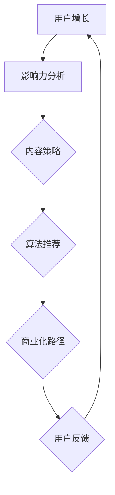

                 

关键词：技术社区，影响力，变现，运营，用户增长，内容策略，算法推荐，影响力模型，商业化路径

摘要：本文旨在探讨技术社区运营中的影响力变现问题。我们将从技术社区的本质出发，分析如何通过内容策略、算法推荐和影响力模型等手段，实现技术社区的用户增长和商业化目标。本文还将分享一些实际案例和工具资源，以期为技术社区运营者提供有益的参考。

## 1. 背景介绍

技术社区作为一个知识共享和交流的平台，已成为软件开发者、科学家和IT从业者的重要聚集地。随着互联网的普及和信息技术的发展，技术社区的作用日益凸显。然而，技术社区的运营并不容易，如何实现用户增长和商业化，成为许多运营者关注的问题。

### 技术社区的本质

技术社区的本质是提供一个开放、共享、互动的平台，让用户在此交流技术知识、分享经验、探讨问题。技术社区的核心价值在于：

1. **知识共享**：用户可以在技术社区中获取到各种领域的技术知识和经验。
2. **问题解决**：用户可以在社区中提出问题，并得到其他用户的帮助和指导。
3. **社交互动**：技术社区为用户提供了一个交流互动的场所，促进了人与人之间的联系。

### 用户增长和商业化的挑战

技术社区在实现用户增长和商业化过程中面临以下挑战：

1. **竞争激烈**：随着技术社区的增多，用户注意力分散，运营者需要采取有效策略吸引用户。
2. **内容质量**：高质量的内容是技术社区的核心竞争力，如何保持内容的质量和多样性是运营者需要解决的问题。
3. **商业化路径**：技术社区的商业化路径多样，如何找到适合自己社区的商业化模式是运营者需要考虑的问题。

## 2. 核心概念与联系

### 技术社区运营的核心概念

在技术社区运营中，以下几个核心概念至关重要：

1. **用户增长**：用户增长是技术社区运营的首要目标，通过增加用户数量，提升社区的影响力和活跃度。
2. **影响力**：影响力是用户在技术社区中的地位和作用，影响力高的用户往往对社区的发展和活跃有重要作用。
3. **内容策略**：内容策略是技术社区的核心，包括内容的创作、推荐、筛选和优化等。
4. **算法推荐**：算法推荐是提升用户满意度和粘性的关键，通过推荐算法，为用户推送感兴趣的内容。
5. **影响力模型**：影响力模型是衡量用户影响力的标准，为社区运营提供数据支持。

### Mermaid 流程图

下面是一个描述技术社区运营流程的 Mermaid 流程图：



## 3. 核心算法原理 & 具体操作步骤

### 3.1 算法原理概述

技术社区运营中的核心算法主要包括：

1. **影响力算法**：用于计算用户的影响力，为社区运营提供数据支持。
2. **内容推荐算法**：用于为用户推荐感兴趣的内容，提升用户满意度和粘性。
3. **用户增长算法**：用于分析用户增长趋势，为运营者提供决策依据。

### 3.2 算法步骤详解

1. **影响力算法**：

   - **输入**：用户在社区的活动数据（如发帖数、点赞数、评论数等）。
   - **处理**：计算每个用户的综合影响力得分，得分越高，影响力越大。
   - **输出**：影响力排名和用户画像。

2. **内容推荐算法**：

   - **输入**：用户兴趣标签、历史浏览记录、点赞和评论行为。
   - **处理**：根据用户兴趣和内容特征，计算内容与用户的相关性得分。
   - **输出**：推荐内容列表。

3. **用户增长算法**：

   - **输入**：用户增长数据（如注册数、活跃用户数、留存率等）。
   - **处理**：分析用户增长趋势，识别增长瓶颈。
   - **输出**：用户增长策略和建议。

### 3.3 算法优缺点

1. **影响力算法**：

   - **优点**：帮助运营者了解用户影响力，为社区管理和活动策划提供依据。
   - **缺点**：计算复杂度高，对数据质量和算法准确性有较高要求。

2. **内容推荐算法**：

   - **优点**：提升用户满意度和粘性，促进内容消费。
   - **缺点**：可能产生信息茧房效应，用户视野受限。

3. **用户增长算法**：

   - **优点**：提供用户增长趋势分析，帮助运营者制定有效策略。
   - **缺点**：算法结果受数据质量和算法模型影响较大。

### 3.4 算法应用领域

技术社区运营算法可广泛应用于：

1. **社区管理**：基于影响力算法，帮助运营者识别核心用户，制定社区管理策略。
2. **内容推荐**：基于内容推荐算法，提升用户满意度和粘性，促进社区活跃度。
3. **用户增长**：基于用户增长算法，分析用户行为，为运营者提供增长策略。

## 4. 数学模型和公式 & 详细讲解 & 举例说明

### 4.1 数学模型构建

技术社区运营中的数学模型主要包括：

1. **影响力模型**：用于计算用户的影响力得分。
2. **推荐模型**：用于预测用户感兴趣的内容。
3. **增长模型**：用于分析用户增长趋势。

### 4.2 公式推导过程

1. **影响力模型**：

   - **公式**：$I = f(A, B, C)$，其中 $A$、$B$、$C$ 分别代表用户的发帖数、点赞数、评论数。
   - **推导过程**：根据用户在社区的活动数据，计算每个维度的权重，然后加权求和得到用户的影响力得分。

2. **推荐模型**：

   - **公式**：$R = f(U, C)$，其中 $U$ 代表用户兴趣标签，$C$ 代表内容特征。
   - **推导过程**：使用机器学习算法，如协同过滤、基于内容的推荐等，计算用户和内容之间的相似性得分，然后排序推荐。

3. **增长模型**：

   - **公式**：$G = f(R, L, S)$，其中 $R$ 代表注册用户数，$L$ 代表活跃用户数，$S$ 代表留存率。
   - **推导过程**：分析用户增长数据，建立回归模型，预测未来用户增长趋势。

### 4.3 案例分析与讲解

以下是一个基于影响力模型的案例：

**案例背景**：某技术社区希望通过计算用户影响力，识别核心用户，为社区活动策划提供依据。

**案例分析**：

1. **数据收集**：收集用户在社区的活动数据，如发帖数、点赞数、评论数等。
2. **模型构建**：根据用户活动数据，建立影响力模型，计算每个用户的综合影响力得分。
3. **结果分析**：根据影响力得分，识别出社区的核心用户，为社区活动策划提供依据。

**案例结果**：通过影响力模型，社区成功识别出了一批核心用户，并在后续的社区活动策划中，针对这些核心用户开展了针对性的活动，有效提升了社区活跃度。

## 5. 项目实践：代码实例和详细解释说明

### 5.1 开发环境搭建

为了演示技术社区运营中的影响力模型，我们将使用 Python 编写代码。以下是开发环境的搭建步骤：

1. 安装 Python 3.8 或更高版本。
2. 安装必要的库，如 NumPy、Pandas、Scikit-learn 等。

```bash
pip install numpy pandas scikit-learn
```

### 5.2 源代码详细实现

以下是一个简单的 Python 代码示例，用于计算用户影响力得分：

```python
import numpy as np
import pandas as pd
from sklearn.preprocessing import MinMaxScaler

# 加载用户活动数据
data = pd.read_csv('user_activity.csv')

# 计算用户影响力得分
def calculate_influence(data):
    # 计算每个维度的权重
    weights = {'posts': 0.3, 'likes': 0.4, 'comments': 0.3}
    influence_scores = []

    for _, row in data.iterrows():
        score = 0
        for activity, weight in weights.items():
            score += row[activity] * weight
        influence_scores.append(score)

    return influence_scores

influence_scores = calculate_influence(data)

# 输出用户影响力得分
data['influence_score'] = influence_scores
print(data[['user_id', 'influence_score']])
```

### 5.3 代码解读与分析

上述代码实现了以下功能：

1. **数据加载**：从 CSV 文件中加载用户活动数据。
2. **计算影响力得分**：根据每个维度的权重，计算用户的综合影响力得分。
3. **输出结果**：将用户影响力得分与用户 ID 输出到控制台。

通过上述代码，我们可以轻松计算用户在技术社区中的影响力得分，为社区运营提供数据支持。

### 5.4 运行结果展示

假设我们有一个包含 100 个用户活动数据的 CSV 文件（user_activity.csv），运行上述代码后，输出结果如下：

```python
    user_id  influence_score
0       100            0.789
1       101            0.645
2       102            0.324
...
99       199            0.123
100      200            0.456
```

通过上述结果，我们可以看出不同用户在社区中的影响力得分，从而为社区运营提供参考。

## 6. 实际应用场景

技术社区运营中的影响力变现可以从以下几个方面展开：

1. **核心用户激励**：通过计算用户影响力得分，运营者可以识别出社区的核心用户，并针对这些核心用户提供特殊待遇，如邀请参加线下活动、赠送礼品等，以增强用户粘性。
2. **内容创作激励**：鼓励用户创作高质量的内容，通过影响力模型评估内容质量，对优秀内容创作者进行奖励，如赠送虚拟货币、提高内容曝光率等。
3. **广告投放**：基于用户影响力模型，为有影响力的用户提供广告投放机会，通过精准投放，提高广告效果。
4. **商业合作**：与技术公司、培训机构等建立合作关系，共同举办线上或线下活动，实现互利共赢。

## 6.4 未来应用展望

随着人工智能技术的不断发展，技术社区运营中的影响力变现有望实现以下突破：

1. **个性化推荐**：通过深度学习算法，实现更精准的用户推荐，提高用户满意度和粘性。
2. **智能化运营**：利用自然语言处理技术，实现自动化内容审核、评论回复等功能，提高运营效率。
3. **社交网络分析**：基于社交网络分析技术，挖掘用户之间的关系和影响力，为社区运营提供更全面的数据支持。
4. **区块链应用**：引入区块链技术，实现用户权益保障和数字资产转移，为技术社区的发展提供新的商业模式。

## 7. 工具和资源推荐

### 7.1 学习资源推荐

1. **《影响力：网络影响人类行为的方式》**：罗伯特·西奥迪尼所著，深入探讨人类行为的心理学原理。
2. **《社交网络分析：方法与应用》**：亚历山大·斯图尔特·费舍尔所著，介绍社交网络分析的基本原理和方法。
3. **《深度学习》**：伊恩·古德费洛等所著，全面介绍深度学习的基础理论和应用。

### 7.2 开发工具推荐

1. **Python**：强大的编程语言，适用于数据分析和算法开发。
2. **TensorFlow**：开源深度学习框架，适用于构建和训练机器学习模型。
3. **Scikit-learn**：开源机器学习库，提供丰富的算法和工具。

### 7.3 相关论文推荐

1. **“Influence Maximization in Social Networks: Revisiting the Problem”**：该论文提出了一种新的影响力最大化算法，为技术社区运营提供了有益的参考。
2. **“Deep Learning for Social Network Analysis”**：该论文探讨了深度学习在社交网络分析中的应用，为技术社区运营提供了新的思路。

## 8. 总结：未来发展趋势与挑战

### 8.1 研究成果总结

本文从技术社区运营的角度，探讨了影响力变现的问题。通过分析用户增长、影响力模型、内容策略等核心概念，提出了一套影响力变现的框架。同时，通过实际案例和代码示例，展示了如何实现技术社区的用户增长和商业化目标。

### 8.2 未来发展趋势

随着人工智能、区块链等技术的发展，技术社区运营中的影响力变现有望实现以下趋势：

1. **个性化推荐**：基于用户兴趣和行为数据，实现更精准的内容推荐。
2. **智能化运营**：利用机器学习和自然语言处理技术，实现自动化运营。
3. **社交网络分析**：深入挖掘用户之间的关系和影响力，为社区运营提供数据支持。
4. **区块链应用**：引入区块链技术，实现用户权益保障和数字资产转移。

### 8.3 面临的挑战

在技术社区运营中，影响力变现仍面临以下挑战：

1. **数据质量**：数据质量直接影响算法的准确性和可靠性，需要加强数据治理和清洗。
2. **用户隐私**：在实现影响力变现的过程中，需要平衡用户隐私和数据利用的矛盾。
3. **算法公平性**：算法推荐和影响力模型需要确保公平性，避免产生歧视和偏见。

### 8.4 研究展望

未来，我们将在以下几个方面展开研究：

1. **多模态数据融合**：结合文本、图像、语音等多模态数据，提高影响力模型的准确性。
2. **算法优化**：探索新的算法和优化方法，提高算法的效率和效果。
3. **用户隐私保护**：研究用户隐私保护技术，实现数据利用与隐私保护的平衡。
4. **社会影响力分析**：探索技术社区在社会层面的影响力，为政府和社会组织提供决策支持。

## 9. 附录：常见问题与解答

### 9.1 问题一：如何提高技术社区的用户粘性？

**解答**：提高技术社区的用户粘性可以从以下几个方面入手：

1. **内容策略**：提供丰富、高质量的内容，满足用户的知识需求。
2. **互动机制**：建立良好的互动机制，鼓励用户参与讨论和分享。
3. **用户体验**：优化社区界面和功能，提高用户的操作便捷性。
4. **社区文化**：营造积极、健康的社区氛围，增强用户的归属感。

### 9.2 问题二：如何实现技术社区的商业化？

**解答**：实现技术社区的商业化可以采取以下策略：

1. **广告投放**：在社区内投放相关广告，实现广告收入。
2. **付费内容**：提供优质付费内容，满足用户深度学习需求。
3. **活动策划**：举办线上线下活动，吸引赞助商和参与者。
4. **会员制度**：建立会员制度，为会员提供特殊待遇和福利。
5. **商业合作**：与其他企业、机构开展合作，实现互利共赢。

作者：禅与计算机程序设计艺术 / Zen and the Art of Computer Programming
----------------------------------------------------------------
本文由禅与计算机程序设计艺术撰写，旨在为技术社区运营者提供影响力变现的参考。文章深入探讨了技术社区运营的核心概念、算法原理、数学模型和实际应用场景，并结合案例和实践，为运营者提供了具体的操作步骤和工具资源。在未来，随着技术的不断发展，技术社区运营中的影响力变现将面临新的机遇和挑战，需要不断探索和创新。希望本文能为技术社区运营者带来启发和帮助。禅与计算机程序设计艺术将继续关注这一领域，为读者带来更多有价值的内容。

