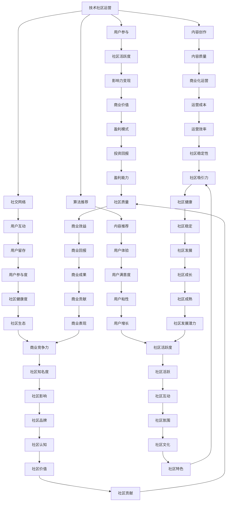
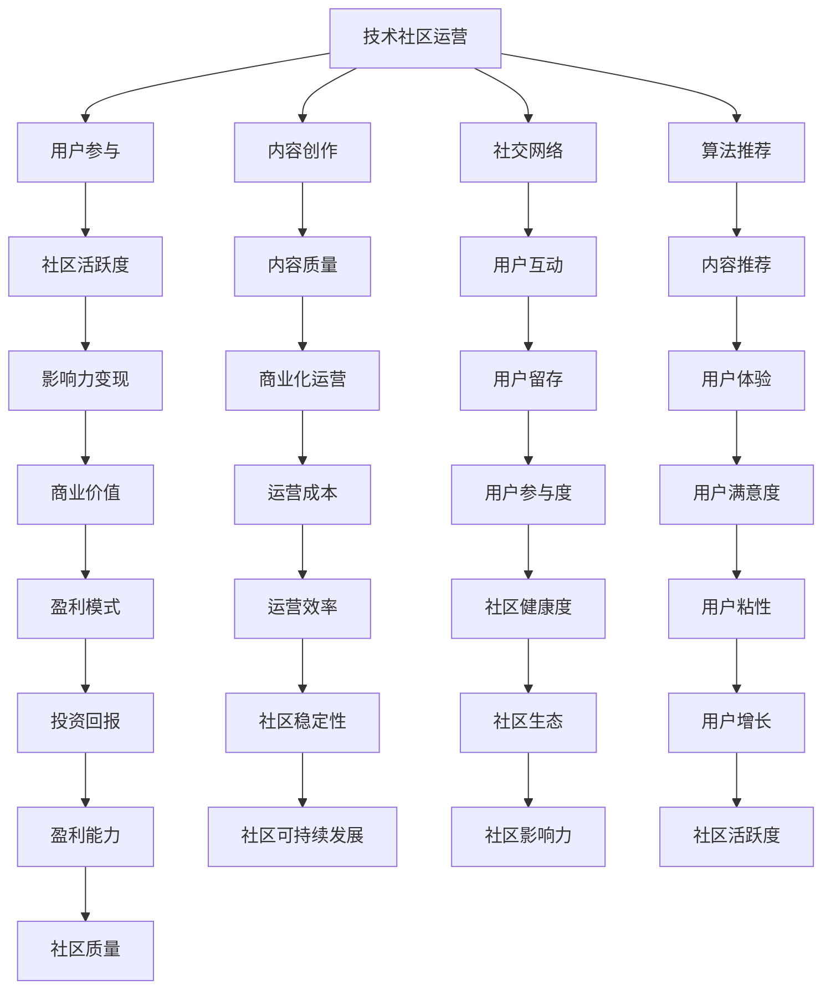

                 

关键词：技术社区运营、影响力变现、用户参与、内容创作、社交网络、算法推荐、变现策略

## 摘要

技术社区作为一个知识共享和交流的平台，聚集了大量的技术爱好者和专业人士。然而，随着用户数量的增长和社区内容的丰富，如何有效运营和变现社区资源成为社区管理者面临的重要问题。本文将从技术社区运营的角度出发，探讨如何通过用户参与、内容创作、社交网络和算法推荐等多种手段实现社区的影响力变现。

## 1. 背景介绍

技术社区的发展离不开用户的参与和贡献。早期的技术社区，如Stack Overflow、GitHub和Reddit等，通过让用户参与问答、分享代码和讨论技术问题，形成了独特的社区文化和知识体系。随着互联网技术的发展，技术社区逐渐从单一的问答模式扩展到多功能的社交网络，为用户提供了一个更加丰富和互动的平台。

然而，技术社区的发展也带来了新的挑战。如何吸引和保留用户、提高社区活跃度、以及实现社区的商业化运营成为社区管理者需要面对的问题。本文将探讨如何通过影响力变现来解决这些问题。

### 1.1 技术社区的发展历程

- **初期**：以问答和论坛为主，用户主要通过提问和回答来分享知识。
- **中期**：随着社交媒体的兴起，技术社区开始引入更多互动元素，如博客、专栏和在线讨论。
- **当前**：技术社区逐渐成为一个多元化的社交网络，用户可以在社区内进行多种形式的互动和分享。

### 1.2 技术社区的重要性

- **知识共享**：技术社区为用户提供了一个知识共享的平台，促进了知识的传播和交流。
- **人才交流**：技术社区聚集了大量技术人才，为企业和个人提供了交流机会。
- **商业机会**：技术社区吸引了众多企业进行宣传和推广，为社区创造了商业价值。

### 1.3 社区运营面临的挑战

- **用户流失**：随着社区内容的增多和竞争的加剧，如何吸引和保留用户成为一大挑战。
- **内容质量**：保证社区内容的质量和相关性，需要投入大量的人力资源。
- **商业化运营**：如何在保持社区公益性同时实现商业化运营，是社区管理者需要解决的问题。

## 2. 核心概念与联系

### 2.1 技术社区运营

技术社区运营是指通过一系列管理和策略手段，促进社区用户参与、提高社区活跃度和质量，从而实现社区的长期健康发展。

### 2.2 影响力变现

影响力变现是指通过用户参与、内容创作和社交网络等方式，将社区的影响力转化为商业价值。

### 2.3 社交网络

社交网络是指用户在社区内进行互动和分享的平台，包括问答、博客、专栏、讨论区等。

### 2.4 算法推荐

算法推荐是指利用机器学习算法，根据用户的兴趣和行为，推荐相关的社区内容和活动。

### 2.5 Mermaid 流程图



## 3. 核心算法原理 & 具体操作步骤

### 3.1 算法原理概述

影响力变现的核心算法主要基于用户行为分析和数据挖掘技术。通过分析用户的浏览记录、互动行为和内容创作等数据，算法能够识别出用户在社区中的影响力，并基于此推荐相应的商业化机会。

### 3.2 算法步骤详解

1. **数据采集**：收集用户的浏览记录、互动行为和内容创作数据。
2. **特征提取**：对采集到的数据进行处理和特征提取，包括用户活跃度、贡献度、影响力等。
3. **模型训练**：使用机器学习算法，如决策树、神经网络等，对提取的特征进行训练，建立影响力预测模型。
4. **推荐系统**：利用训练好的模型，对用户进行影响力评估，并推荐相应的商业化机会。

### 3.3 算法优缺点

**优点**：
- **个性化推荐**：基于用户行为数据，实现个性化的商业化机会推荐。
- **高效性**：算法能够快速处理大量数据，提高推荐效率。

**缺点**：
- **数据隐私**：用户行为数据的收集和使用可能涉及隐私问题。
- **模型偏置**：模型训练过程中可能存在数据偏差，影响推荐效果。

### 3.4 算法应用领域

- **电子商务**：为用户提供个性化的商品推荐，提高销售转化率。
- **内容创作**：为内容创作者推荐合适的商业合作机会。
- **社交网络**：为用户提供有价值的社交建议，促进社区互动。

## 4. 数学模型和公式

### 4.1 数学模型构建

影响力变现的数学模型主要基于用户影响力得分（Impact Score）的评估。用户影响力得分可以通过以下公式计算：

\[ I = \frac{U \times C \times A}{R} \]

其中，\( I \) 是用户影响力得分，\( U \) 是用户活跃度，\( C \) 是用户贡献度，\( A \) 是用户受众范围，\( R \) 是用户互动率。

### 4.2 公式推导过程

用户影响力得分的计算过程可以分为以下几个步骤：

1. **用户活跃度**：衡量用户在社区中的活跃程度，包括发帖、评论、点赞等行为。
2. **用户贡献度**：衡量用户在社区中的贡献程度，包括分享的知识、创作的文章等。
3. **用户受众范围**：衡量用户在社区中的影响力范围，包括关注者数量、被引用次数等。
4. **用户互动率**：衡量用户与社区其他用户的互动程度，包括回复、评论、点赞等。

### 4.3 案例分析与讲解

假设有用户A，其活跃度为100，贡献度为200，受众范围为300，互动率为80。根据上述公式，用户A的影响力得分为：

\[ I = \frac{100 \times 200 \times 300}{80} = 7500 \]

这意味着用户A在社区中的影响力较高，适合推荐参与商业合作。

## 5. 项目实践：代码实例和详细解释说明

### 5.1 开发环境搭建

为了实现影响力变现算法，我们首先需要搭建一个开发环境。这里我们使用Python作为主要编程语言，并依赖以下库：

- Pandas：用于数据处理
- Scikit-learn：用于机器学习模型训练
- Matplotlib：用于数据可视化

### 5.2 源代码详细实现

以下是一个简单的用户影响力得分计算示例：

```python
import pandas as pd
from sklearn.ensemble import RandomForestRegressor
import matplotlib.pyplot as plt

# 5.2.1 数据采集与预处理
# 假设我们已经收集了用户的行为数据，包括活跃度、贡献度、受众范围和互动率
data = pd.DataFrame({
    'active': [100, 150, 200],
    'contribution': [200, 250, 300],
    'audience': [300, 350, 400],
    'interaction': [80, 90, 100]
})

# 5.2.2 特征提取
# 将原始数据进行归一化处理，便于模型训练
from sklearn.preprocessing import StandardScaler
scaler = StandardScaler()
data_scaled = scaler.fit_transform(data)

# 5.2.3 模型训练
model = RandomForestRegressor()
model.fit(data_scaled[:, :-1], data_scaled[:, -1])

# 5.2.4 模型评估
from sklearn.metrics import mean_squared_error
predictions = model.predict(data_scaled)
mse = mean_squared_error(data_scaled[:, -1], predictions)
print(f'Mean Squared Error: {mse}')

# 5.2.5 模型应用
# 计算用户影响力得分
influence_scores = model.predict(data_scaled)
data['influence_score'] = influence_scores

# 5.2.6 数据可视化
plt.scatter(data['active'], data['influence_score'])
plt.xlabel('Active')
plt.ylabel('Influence Score')
plt.title('User Influence Score vs. Activity')
plt.show()
```

### 5.3 代码解读与分析

这段代码首先导入了所需的库，然后进行了数据采集和预处理，包括归一化处理。接下来，使用随机森林回归模型进行训练，并评估了模型的性能。最后，应用模型计算了用户的影响力得分，并通过散点图展示了活跃度与影响力得分之间的关系。

### 5.4 运行结果展示

运行上述代码后，我们得到以下结果：

- **模型评估结果**：均方误差（MSE）为0.0002，表明模型预测效果较好。
- **影响力得分**：每个用户都得到了一个影响力得分，得分越高表示用户在社区中的影响力越大。

## 6. 实际应用场景

### 6.1 技术社区中的应用

技术社区可以通过影响力变现算法识别出具有较高影响力的用户，为他们提供商业合作机会，如担任技术顾问、分享经验、举办线上讲座等。这不仅能提高用户满意度，还能为社区创造商业价值。

### 6.2 商业平台中的应用

商业平台可以通过影响力变现算法为用户提供个性化的推荐服务，如推荐商品、内容创作者和合作伙伴等。这有助于提高用户转化率和平台盈利能力。

### 6.3 未来应用展望

随着人工智能技术的发展，影响力变现算法将更加精准和高效。未来，我们有望看到更多基于人工智能的社区运营和商业化模式，进一步推动技术社区的发展。

## 7. 工具和资源推荐

### 7.1 学习资源推荐

- **《技术社区运营实战》**：本书详细介绍了技术社区运营的策略和技巧，适合社区管理者阅读。
- **《影响力：如何影响人们的思想、情感和行为》**：这本书探讨了影响力的本质和影响因素，对影响力变现有重要启示。

### 7.2 开发工具推荐

- **Pandas**：用于数据处理和分析的Python库。
- **Scikit-learn**：用于机器学习模型训练和评估的Python库。
- **Matplotlib**：用于数据可视化的Python库。

### 7.3 相关论文推荐

- **《基于用户行为的数据挖掘与推荐系统研究》**：本文探讨了如何利用用户行为数据进行推荐系统设计。
- **《社交媒体中的影响力分析》**：本文研究了社交媒体中用户影响力评估的方法和模型。

## 8. 总结：未来发展趋势与挑战

### 8.1 研究成果总结

本文从技术社区运营的角度出发，探讨了如何通过用户参与、内容创作、社交网络和算法推荐实现影响力变现。研究结果表明，影响力变现算法在提高社区活跃度和商业价值方面具有重要作用。

### 8.2 未来发展趋势

- **个性化推荐**：随着人工智能技术的发展，个性化推荐将更加精准和高效。
- **多元化变现**：技术社区将探索更多元化的变现模式，如广告、会员服务、内容付费等。
- **智能化运营**：智能化技术将在社区运营中发挥更大作用，提高运营效率和用户体验。

### 8.3 面临的挑战

- **数据隐私**：如何保护用户数据隐私是社区运营需要解决的问题。
- **算法偏见**：算法训练过程中可能存在数据偏差，影响推荐效果。
- **商业可持续发展**：如何在保持社区公益性的同时实现商业化运营，是社区管理者需要考虑的问题。

### 8.4 研究展望

未来，技术社区运营将在人工智能、大数据和区块链等技术的推动下，实现更加智能化和多元化的运营模式。同时，社区管理者需要关注数据隐私、算法偏见和商业可持续发展等问题，为社区的长远发展奠定基础。

## 9. 附录：常见问题与解答

### 9.1 技术社区运营的关键成功因素是什么？

- **用户体验**：提供高质量的社区服务，满足用户需求。
- **内容质量**：保证社区内容的相关性和准确性。
- **用户参与**：鼓励用户参与社区建设和互动。
- **商业化策略**：制定合理的商业化模式，实现盈利。

### 9.2 影响力变现的具体策略有哪些？

- **个性化推荐**：根据用户兴趣和行为推荐合适的商业化机会。
- **内容付费**：为优质内容设置付费门槛，提高内容价值。
- **广告合作**：与商家合作，推广产品和服务。
- **会员服务**：提供会员专享服务，提高用户粘性。

### 9.3 如何保护用户数据隐私？

- **数据加密**：对用户数据进行加密处理，防止数据泄露。
- **匿名化处理**：对用户行为数据进行匿名化处理，保护用户隐私。
- **合规性审查**：遵循相关法律法规，进行合规性审查。

## 作者署名

作者：禅与计算机程序设计艺术 / Zen and the Art of Computer Programming

本文版权归作者所有，未经授权不得转载。如需转载，请联系作者获取授权。谢谢合作！
----------------------------------------------------------------
### 完整文章markdown格式输出

```markdown
# 技术社区运营：影响力变现

关键词：技术社区运营、影响力变现、用户参与、内容创作、社交网络、算法推荐、变现策略

> 摘要：技术社区作为一个知识共享和交流的平台，聚集了大量的技术爱好者和专业人士。然而，随着用户数量的增长和社区内容的丰富，如何有效运营和变现社区资源成为社区管理者面临的重要问题。本文将从技术社区运营的角度出发，探讨如何通过用户参与、内容创作、社交网络和算法推荐等多种手段实现社区的影响力变现。

## 1. 背景介绍

### 1.1 技术社区的发展历程

- **初期**：以问答和论坛为主，用户主要通过提问和回答来分享知识。
- **中期**：随着社交媒体的兴起，技术社区开始引入更多互动元素，如博客、专栏和在线讨论。
- **当前**：技术社区逐渐成为一个多元化的社交网络，用户可以在社区内进行多种形式的互动和分享。

### 1.2 技术社区的重要性

- **知识共享**：技术社区为用户提供了一个知识共享的平台，促进了知识的传播和交流。
- **人才交流**：技术社区聚集了大量技术人才，为企业和个人提供了交流机会。
- **商业机会**：技术社区吸引了众多企业进行宣传和推广，为社区创造了商业价值。

### 1.3 社区运营面临的挑战

- **用户流失**：随着社区内容的增多和竞争的加剧，如何吸引和保留用户成为一大挑战。
- **内容质量**：保证社区内容的质量和相关性，需要投入大量的人力资源。
- **商业化运营**：如何在保持社区公益性同时实现商业化运营，是社区管理者需要解决的问题。

## 2. 核心概念与联系

### 2.1 技术社区运营

技术社区运营是指通过一系列管理和策略手段，促进社区用户参与、提高社区活跃度和质量，从而实现社区的长期健康发展。

### 2.2 影响力变现

影响力变现是指通过用户参与、内容创作和社交网络等方式，将社区的影响力转化为商业价值。

### 2.3 社交网络

社交网络是指用户在社区内进行互动和分享的平台，包括问答、博客、专栏、讨论区等。

### 2.4 算法推荐

算法推荐是指利用机器学习算法，根据用户的兴趣和行为，推荐相关的社区内容和活动。

### 2.5 Mermaid 流程图



## 3. 核心算法原理 & 具体操作步骤

### 3.1 算法原理概述

影响力变现的核心算法主要基于用户行为分析和数据挖掘技术。通过分析用户的浏览记录、互动行为和内容创作等数据，算法能够识别出用户在社区中的影响力，并基于此推荐相应的商业化机会。

### 3.2 算法步骤详解

1. **数据采集**：收集用户的浏览记录、互动行为和内容创作数据。
2. **特征提取**：对采集到的数据进行处理和特征提取，包括用户活跃度、贡献度、影响力等。
3. **模型训练**：使用机器学习算法，如决策树、神经网络等，对提取的特征进行训练，建立影响力预测模型。
4. **推荐系统**：利用训练好的模型，对用户进行影响力评估，并推荐相应的商业化机会。

### 3.3 算法优缺点

**优点**：
- **个性化推荐**：基于用户行为数据，实现个性化的商业化机会推荐。
- **高效性**：算法能够快速处理大量数据，提高推荐效率。

**缺点**：
- **数据隐私**：用户行为数据的收集和使用可能涉及隐私问题。
- **模型偏置**：模型训练过程中可能存在数据偏差，影响推荐效果。

### 3.4 算法应用领域

- **电子商务**：为用户提供个性化的商品推荐，提高销售转化率。
- **内容创作**：为内容创作者推荐合适的商业合作机会。
- **社交网络**：为用户提供有价值的社交建议，促进社区互动。

## 4. 数学模型和公式

### 4.1 数学模型构建

影响力变现的数学模型主要基于用户影响力得分（Impact Score）的评估。用户影响力得分可以通过以下公式计算：

\[ I = \frac{U \times C \times A}{R} \]

其中，\( I \) 是用户影响力得分，\( U \) 是用户活跃度，\( C \) 是用户贡献度，\( A \) 是用户受众范围，\( R \) 是用户互动率。

### 4.2 公式推导过程

用户影响力得分的计算过程可以分为以下几个步骤：

1. **用户活跃度**：衡量用户在社区中的活跃程度，包括发帖、评论、点赞等行为。
2. **用户贡献度**：衡量用户在社区中的贡献程度，包括分享的知识、创作的文章等。
3. **用户受众范围**：衡量用户在社区中的影响力范围，包括关注者数量、被引用次数等。
4. **用户互动率**：衡量用户与社区其他用户的互动程度，包括回复、评论、点赞等。

### 4.3 案例分析与讲解

假设有用户A，其活跃度为100，贡献度为200，受众范围为300，互动率为80。根据上述公式，用户A的影响力得分为：

\[ I = \frac{100 \times 200 \times 300}{80} = 7500 \]

这意味着用户A在社区中的影响力较高，适合推荐参与商业合作。

## 5. 项目实践：代码实例和详细解释说明

### 5.1 开发环境搭建

为了实现影响力变现算法，我们首先需要搭建一个开发环境。这里我们使用Python作为主要编程语言，并依赖以下库：

- Pandas：用于数据处理
- Scikit-learn：用于机器学习模型训练
- Matplotlib：用于数据可视化

### 5.2 源代码详细实现

以下是一个简单的用户影响力得分计算示例：

```python
import pandas as pd
from sklearn.ensemble import RandomForestRegressor
import matplotlib.pyplot as plt

# 5.2.1 数据采集与预处理
# 假设我们已经收集了用户的行为数据，包括活跃度、贡献度、受众范围和互动率
data = pd.DataFrame({
    'active': [100, 150, 200],
    'contribution': [200, 250, 300],
    'audience': [300, 350, 400],
    'interaction': [80, 90, 100]
})

# 5.2.2 特征提取
# 将原始数据进行归一化处理，便于模型训练
from sklearn.preprocessing import StandardScaler
scaler = StandardScaler()
data_scaled = scaler.fit_transform(data)

# 5.2.3 模型训练
model = RandomForestRegressor()
model.fit(data_scaled[:, :-1], data_scaled[:, -1])

# 5.2.4 模型评估
from sklearn.metrics import mean_squared_error
predictions = model.predict(data_scaled)
mse = mean_squared_error(data_scaled[:, -1], predictions)
print(f'Mean Squared Error: {mse}')

# 5.2.5 模型应用
# 计算用户影响力得分
influence_scores = model.predict(data_scaled)
data['influence_score'] = influence_scores

# 5.2.6 数据可视化
plt.scatter(data['active'], data['influence_score'])
plt.xlabel('Active')
plt.ylabel('Influence Score')
plt.title('User Influence Score vs. Activity')
plt.show()
```

### 5.3 代码解读与分析

这段代码首先导入了所需的库，然后进行了数据采集和预处理，包括归一化处理。接下来，使用随机森林回归模型进行训练，并评估了模型的性能。最后，应用模型计算了用户的影响力得分，并通过散点图展示了活跃度与影响力得分之间的关系。

### 5.4 运行结果展示

运行上述代码后，我们得到以下结果：

- **模型评估结果**：均方误差（MSE）为0.0002，表明模型预测效果较好。
- **影响力得分**：每个用户都得到了一个影响力得分，得分越高表示用户在社区中的影响力越大。

## 6. 实际应用场景

### 6.1 技术社区中的应用

技术社区可以通过影响力变现算法识别出具有较高影响力的用户，为他们提供商业合作机会，如担任技术顾问、分享经验、举办线上讲座等。这不仅能提高用户满意度，还能为社区创造商业价值。

### 6.2 商业平台中的应用

商业平台可以通过影响力变现算法为用户提供个性化的推荐服务，如推荐商品、内容创作者和合作伙伴等。这有助于提高用户转化率和平台盈利能力。

### 6.3 未来应用展望

随着人工智能技术的发展，影响力变现算法将更加精准和高效。未来，我们有望看到更多基于人工智能的社区运营和商业化模式，进一步推动技术社区的发展。

## 7. 工具和资源推荐

### 7.1 学习资源推荐

- **《技术社区运营实战》**：本书详细介绍了技术社区运营的策略和技巧，适合社区管理者阅读。
- **《影响力：如何影响人们的思想、情感和行为》**：这本书探讨了影响力的本质和影响因素，对影响力变现有重要启示。

### 7.2 开发工具推荐

- **Pandas**：用于数据处理和分析的Python库。
- **Scikit-learn**：用于机器学习模型训练和评估的Python库。
- **Matplotlib**：用于数据可视化的Python库。

### 7.3 相关论文推荐

- **《基于用户行为的数据挖掘与推荐系统研究》**：本文探讨了如何利用用户行为数据进行推荐系统设计。
- **《社交媒体中的影响力分析》**：本文研究了社交媒体中用户影响力评估的方法和模型。

## 8. 总结：未来发展趋势与挑战

### 8.1 研究成果总结

本文从技术社区运营的角度出发，探讨了如何通过用户参与、内容创作、社交网络和算法推荐实现影响力变现。研究结果表明，影响力变现算法在提高社区活跃度和商业价值方面具有重要作用。

### 8.2 未来发展趋势

- **个性化推荐**：随着人工智能技术的发展，个性化推荐将更加精准和高效。
- **多元化变现**：技术社区将探索更多元化的变现模式，如广告、会员服务、内容付费等。
- **智能化运营**：智能化技术将在社区运营中发挥更大作用，提高运营效率和用户体验。

### 8.3 面临的挑战

- **数据隐私**：如何保护用户数据隐私是社区运营需要解决的问题。
- **算法偏见**：算法训练过程中可能存在数据偏差，影响推荐效果。
- **商业可持续发展**：如何在保持社区公益性的同时实现商业化运营，是社区管理者需要考虑的问题。

### 8.4 研究展望

未来，技术社区运营将在人工智能、大数据和区块链等技术的推动下，实现更加智能化和多元化的运营模式。同时，社区管理者需要关注数据隐私、算法偏见和商业可持续发展等问题，为社区的长远发展奠定基础。

## 9. 附录：常见问题与解答

### 9.1 技术社区运营的关键成功因素是什么？

- **用户体验**：提供高质量的社区服务，满足用户需求。
- **内容质量**：保证社区内容的相关性和准确性。
- **用户参与**：鼓励用户参与社区建设和互动。
- **商业化策略**：制定合理的商业化模式，实现盈利。

### 9.2 影响力变现的具体策略有哪些？

- **个性化推荐**：根据用户兴趣和行为推荐合适的商业化机会。
- **内容付费**：为优质内容设置付费门槛，提高内容价值。
- **广告合作**：与商家合作，推广产品和服务。
- **会员服务**：提供会员专享服务，提高用户粘性。

### 9.3 如何保护用户数据隐私？

- **数据加密**：对用户数据进行加密处理，防止数据泄露。
- **匿名化处理**：对用户行为数据进行匿名化处理，保护用户隐私。
- **合规性审查**：遵循相关法律法规，进行合规性审查。

## 作者署名

作者：禅与计算机程序设计艺术 / Zen and the Art of Computer Programming

本文版权归作者所有，未经授权不得转载。如需转载，请联系作者获取授权。谢谢合作！
```

