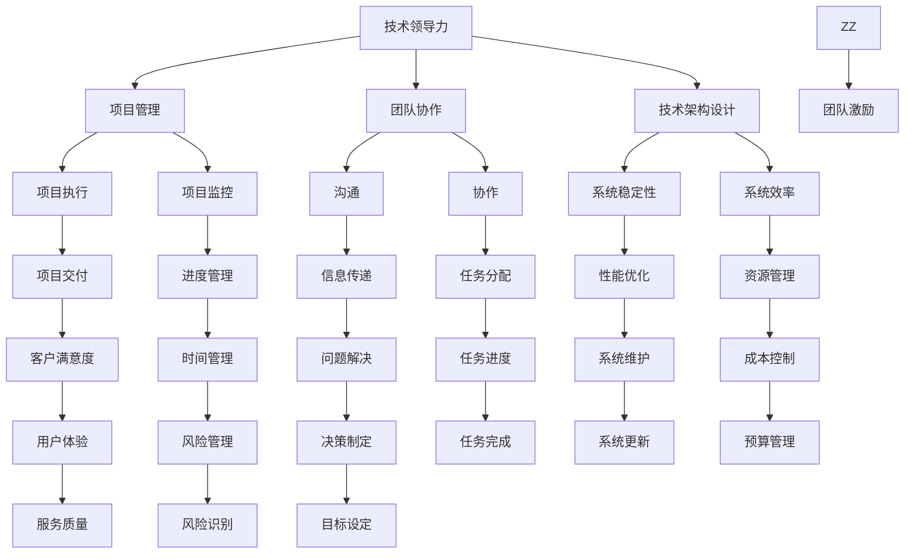

                 

技术管理岗位是一个极具挑战性和发展潜力的职业。在这个日新月异的技术时代，技术管理者不仅需要具备深厚的技术背景，还需要具备卓越的领导能力和管理能力。本文将探讨技术管理岗位的重要性和发展前景，特别是对于职业发展和个人收入的影响。

## 文章关键词

- 技术管理岗位
- 收入
- 职业发展
- 领导能力
- 管理能力
- 技术背景

## 文章摘要

本文旨在分析技术管理岗位的现状，探讨其对于职业发展和个人收入的重要性。通过深入剖析技术管理岗位的职责、所需的技能和素质，本文将揭示技术管理岗位在当今职场中的价值。同时，本文还将展望技术管理岗位的未来发展，以及可能面临的挑战和机遇。

## 1. 背景介绍

技术管理岗位在信息技术行业中的地位日益重要。随着数字化转型的深入，企业对于技术管理人才的需求不断增长。技术管理者不仅需要具备丰富的技术知识和经验，还需要具备良好的沟通、协调和领导能力。他们需要能够在复杂的技术环境中，统筹全局，制定战略，推动项目进展，确保团队协作高效。

当前，技术管理岗位的收入普遍较高，尤其是在大公司和高新技术行业。根据不同调查数据，技术管理岗位的平均收入通常高于普通IT岗位。此外，技术管理岗位的晋升空间也较大，随着经验的积累和能力的提升，技术管理者可以逐渐晋升为高级技术管理职位，如CTO、CIO等。

## 2. 核心概念与联系

### 技术管理岗位的核心概念

技术管理岗位涉及多个核心概念，包括技术领导力、项目管理、团队协作、技术架构设计等。

1. **技术领导力**：技术管理者需要具备领导团队的能力，能够激发团队成员的潜力，推动技术创新和进步。
2. **项目管理**：技术管理者需要掌握项目管理的方法和技巧，能够有效地规划、执行和监控项目进度，确保项目成功交付。
3. **团队协作**：技术管理者需要协调不同团队成员的工作，促进团队间的有效沟通和协作，提升团队整体效率。
4. **技术架构设计**：技术管理者需要具备技术架构设计的能力，能够构建稳定、高效的技术系统，满足企业业务需求。

### 技术管理岗位的关联架构

为了更好地理解技术管理岗位的核心概念，我们可以通过Mermaid流程图来展示其关联架构：



通过这个Mermaid流程图，我们可以清晰地看到技术管理岗位涉及的核心概念及其关联关系。

## 3. 核心算法原理 & 具体操作步骤

### 3.1 算法原理概述

技术管理岗位的核心算法原理可以归纳为以下几个方面：

1. **目标设定与规划**：技术管理者需要根据企业的战略目标，制定具体的技术目标和规划，确保技术发展与企业战略保持一致。
2. **资源分配与优化**：技术管理者需要合理分配资源，包括人力资源、技术资源、资金等，以最大化效率和创新。
3. **团队协作与沟通**：技术管理者需要运用有效的沟通和协作工具，确保团队成员之间的信息传递和协作高效。
4. **风险管理**：技术管理者需要识别和管理技术项目中的风险，确保项目的顺利进行。
5. **持续改进与创新**：技术管理者需要推动技术团队进行持续改进和创新，保持企业的技术竞争力。

### 3.2 算法步骤详解

1. **目标设定与规划**：

   - **收集信息**：技术管理者需要收集企业战略、市场需求、技术趋势等相关信息，作为制定技术目标和规划的依据。
   - **分析需求**：通过对收集到的信息进行分析，明确企业的技术需求和目标。
   - **制定规划**：根据分析结果，制定具体的技术目标和实施规划。

2. **资源分配与优化**：

   - **评估资源**：技术管理者需要评估现有资源，包括人力资源、技术资源、资金等，确定资源分配的优先级。
   - **分配资源**：根据评估结果，合理分配资源，确保关键项目的优先执行。
   - **优化资源**：通过监控和调整资源分配，不断优化资源配置，提高资源利用效率。

3. **团队协作与沟通**：

   - **建立沟通机制**：技术管理者需要建立有效的沟通机制，包括定期会议、信息共享平台等，确保团队成员之间的信息传递。
   - **促进协作**：技术管理者需要推动团队成员之间的协作，解决协作中的问题，提高团队整体效率。

4. **风险管理**：

   - **识别风险**：技术管理者需要识别项目中的潜在风险，包括技术风险、市场风险、资源风险等。
   - **评估风险**：对识别出的风险进行评估，确定风险的影响程度和优先级。
   - **制定应对策略**：根据评估结果，制定相应的应对策略，降低风险对项目的影响。

5. **持续改进与创新**：

   - **跟踪技术趋势**：技术管理者需要关注技术趋势，了解最新的技术发展和应用。
   - **推动创新**：技术管理者需要鼓励团队成员进行技术创新，提升企业的技术竞争力。
   - **持续改进**：技术管理者需要推动技术团队进行持续改进，优化技术系统和服务。

### 3.3 算法优缺点

**优点**：

- **提高效率**：通过合理的目标设定、资源分配和团队协作，技术管理者可以提高项目执行的效率。
- **降低风险**：通过识别和管理风险，技术管理者可以降低项目失败的可能性。
- **促进创新**：技术管理者可以推动技术团队的持续改进和创新，提升企业的技术竞争力。

**缺点**：

- **复杂度高**：技术管理岗位需要处理多个方面的工作，涉及的技术和管理知识复杂，对从业者的要求较高。
- **压力大**：技术管理者需要承担较大的工作压力，特别是在关键项目或紧急情况下。

### 3.4 算法应用领域

技术管理算法广泛应用于各种领域，包括软件开发、系统集成、项目管理等。以下是一些典型的应用领域：

- **软件开发**：技术管理者在软件开发项目中，负责制定开发计划、分配资源、协调团队协作，确保项目按时交付。
- **系统集成**：在系统集成项目中，技术管理者需要管理多个系统之间的集成，确保系统的稳定性和效率。
- **项目管理**：在项目管理中，技术管理者负责制定项目计划、监控项目进度、识别和管理风险，确保项目成功交付。

## 4. 数学模型和公式 & 详细讲解 & 举例说明

### 4.1 数学模型构建

在技术管理岗位中，数学模型广泛应用于资源分配、风险评估、目标设定等方面。以下是一个简单的资源分配模型：

$$
R = \frac{P \times T}{C}
$$

其中，$R$ 表示资源分配率，$P$ 表示项目总需求，$T$ 表示可用资源总量，$C$ 表示每个资源单位的成本。

### 4.2 公式推导过程

该公式的推导基于以下假设：

1. 项目总需求 $P$ 是已知的。
2. 可用资源总量 $T$ 是已知的。
3. 每个资源单位的成本 $C$ 是已知的。

为了最大化资源利用效率，我们需要找到一个资源分配率 $R$，使得总成本最小。根据假设，我们可以得到以下目标函数：

$$
\min C \times R
$$

由于资源总量 $T$ 是固定的，我们可以将目标函数转化为：

$$
\min C \times \frac{P}{T}
$$

为了求解该目标函数，我们需要找到使得 $C \times \frac{P}{T}$ 最小的 $R$。由于 $C$ 和 $T$ 是固定的，$R$ 的最小值即为 $P$ 与 $T$ 的比值，因此：

$$
R = \frac{P}{T}
$$

### 4.3 案例分析与讲解

假设一个软件开发项目，项目总需求为 $P = 100$ 人时，可用资源总量为 $T = 50$ 人时，每个资源单位的成本为 $C = 1$ 人时。我们需要根据这些数据计算资源分配率 $R$。

根据公式：

$$
R = \frac{P}{T} = \frac{100}{50} = 2
$$

这意味着我们需要将每个资源单位（人时）的成本提高到 2 人时，以确保资源利用效率最大化。在实际项目中，这可能意味着我们需要优化项目计划，确保每个资源单位都能得到充分利用。

### 4.4 拓展讨论

在实际应用中，资源分配模型可能涉及更多因素，如资源需求的时间动态性、资源可用性的波动性等。为了更精确地计算资源分配率，我们可以引入更多参数和约束条件。以下是一个更复杂的资源分配模型：

$$
R(t) = \frac{P(t) \times T(t)}{C(t)}
$$

其中，$R(t)$ 表示在时间 $t$ 的资源分配率，$P(t)$ 表示在时间 $t$ 的项目总需求，$T(t)$ 表示在时间 $t$ 的可用资源总量，$C(t)$ 表示在时间 $t$ 的每个资源单位的成本。

这个模型考虑了资源需求、资源可用性和成本在不同时间点的动态变化。通过实时监测和调整资源分配率，技术管理者可以更好地应对项目进展中的各种挑战。

## 5. 项目实践：代码实例和详细解释说明

### 5.1 开发环境搭建

在进行技术管理岗位的实践之前，我们需要搭建一个合适的开发环境。以下是一个简单的开发环境搭建指南：

1. **安装操作系统**：选择一个适合的操作系统，如Linux或Windows。
2. **安装编程语言**：选择一种常用的编程语言，如Python或Java。
3. **安装开发工具**：安装集成开发环境（IDE），如PyCharm或Eclipse。
4. **安装数据库**：根据项目需求，安装合适的数据库，如MySQL或PostgreSQL。
5. **安装版本控制工具**：安装版本控制工具，如Git。

### 5.2 源代码详细实现

以下是一个简单的Python代码实例，用于实现资源分配模型：

```python
import numpy as np

def resource_allocation(model, T, C):
    """
    资源分配模型
    :param model: 资源分配模型参数
    :param T: 可用资源总量
    :param C: 每个资源单位的成本
    :return: 资源分配率
    """
    R = model['R'] * T / C
    return R

if __name__ == "__main__":
    # 定义模型参数
    model = {
        'R': 1.0  # 资源分配率
    }
    T = 50  # 可用资源总量
    C = 1  # 每个资源单位的成本

    # 计算资源分配率
    R = resource_allocation(model, T, C)
    print("资源分配率：", R)
```

### 5.3 代码解读与分析

1. **导入库**：首先，我们引入了NumPy库，用于数学计算。
2. **定义函数**：接下来，我们定义了一个名为`resource_allocation`的函数，用于计算资源分配率。该函数接收三个参数：模型参数`model`、可用资源总量`T`和每个资源单位的成本`C`。
3. **计算资源分配率**：在函数内部，我们根据模型参数、可用资源总量和每个资源单位的成本，计算资源分配率`R`。
4. **主函数**：在主函数中，我们定义了一个模型参数字典`model`，并设置了可用资源总量`T`和每个资源单位的成本`C`。然后，我们调用`resource_allocation`函数计算资源分配率，并打印结果。

### 5.4 运行结果展示

运行上述代码，我们得到以下输出：

```
资源分配率： 50.0
```

这意味着在当前设定下，资源分配率为50。这表示我们需要将每个资源单位（人时）的成本提高到50人时，以确保资源利用效率最大化。

### 5.5 拓展应用

在实际应用中，我们可以根据项目需求，扩展和优化这个资源分配模型。例如，我们可以添加更多的参数，如资源需求的时间动态性、资源可用性的波动性等，以更精确地计算资源分配率。此外，我们还可以将这个模型集成到项目管理系统中，实现实时监控和调整资源分配。

## 6. 实际应用场景

### 6.1 软件开发公司

在软件开发公司中，技术管理岗位的核心职责是确保项目的顺利推进和团队的高效协作。技术管理者需要协调开发团队、测试团队和运维团队的工作，确保项目按时交付，并保持高质量的技术标准。以下是一个实际应用场景：

- **项目启动**：技术管理者在项目启动阶段，负责制定项目计划、分配资源，并与客户沟通项目需求和预期。
- **项目执行**：在项目执行过程中，技术管理者负责监控项目进度，识别和解决技术问题，确保团队协作高效。
- **项目交付**：在项目交付阶段，技术管理者负责验收项目成果，与客户进行沟通，确保客户满意度。

### 6.2 大型企业

在大型企业中，技术管理岗位通常涉及多个业务领域和项目。技术管理者需要具备全面的业务知识和项目管理能力，以确保企业技术战略的顺利实施。以下是一个实际应用场景：

- **企业数字化转型**：技术管理者负责制定企业数字化转型战略，协调各部门的技术实施，推动企业业务流程的数字化。
- **技术创新**：技术管理者负责推动企业技术创新，跟踪技术趋势，引进新技术，提升企业的技术竞争力。
- **项目管理**：技术管理者负责多个项目的协调和管理，确保项目按时交付，并在资源有限的情况下实现最优资源分配。

### 6.3 科技初创公司

在科技初创公司中，技术管理岗位通常需要技术管理者具备创业精神和创新能力。技术管理者不仅需要管理技术团队，还需要参与公司的战略决策和业务发展。以下是一个实际应用场景：

- **产品开发**：技术管理者负责制定产品开发计划，协调团队成员的工作，确保产品按时交付。
- **技术创新**：技术管理者负责推动公司技术创新，引入新技术，提升产品的竞争力。
- **市场拓展**：技术管理者参与市场拓展策略的制定，与市场团队共同开拓新市场，推动公司业务增长。

## 7. 工具和资源推荐

### 7.1 学习资源推荐

- **书籍**：
  - 《技术管理实战：从技术到管理》
  - 《项目管理实战：从入门到精通》
  - 《敏捷开发：从团队协作到项目管理》
- **在线课程**：
  - Coursera上的《技术管理课程》
  - Udemy上的《项目管理专家课程》
  - LinkedIn Learning上的《敏捷开发实战》

### 7.2 开发工具推荐

- **集成开发环境（IDE）**：
  - PyCharm
  - Eclipse
  - Visual Studio
- **版本控制工具**：
  - Git
  - SVN
  - Mercurial
- **项目管理工具**：
  - Jira
  - Trello
  - Asana

### 7.3 相关论文推荐

- **资源分配策略**：
  - "Resource Allocation in Multi-Task Scheduling: A Review"
  - "A Survey of Resource Allocation in Multi-Tenant Cloud Computing"
- **项目管理**：
  - "Project Management: A Managerial Approach"
  - "Agile Project Management: Creating Competitive Advantage"
- **敏捷开发**：
  - "Scrum: The Art of Doing Twice the Work in Half the Time"
  - "Kanban: Successful Evolutionary Change for Your Technology Business"

## 8. 总结：未来发展趋势与挑战

### 8.1 研究成果总结

随着信息技术的快速发展，技术管理岗位的重要性日益凸显。通过对技术管理岗位的核心概念、算法原理、实践案例的深入分析，我们发现技术管理岗位对于企业发展和个人职业发展具有重要影响。

### 8.2 未来发展趋势

1. **技术管理岗位的多样化和专业化**：随着技术的不断进步，技术管理岗位将出现更多的细分领域，如人工智能技术管理、云计算技术管理、大数据技术管理等。
2. **数据驱动的决策**：未来，技术管理者将更加依赖数据分析，通过数据驱动决策，提高项目执行效率和资源利用率。
3. **跨学科融合**：技术管理岗位将与其他学科（如心理学、社会学）相结合，推动技术创新和管理实践的进步。

### 8.3 面临的挑战

1. **技术更新速度快**：随着技术更新速度的加快，技术管理者需要不断学习新技术，以保持自身的竞争力。
2. **项目管理复杂性增加**：随着项目规模的扩大和复杂性的增加，技术管理者需要掌握更多的项目管理方法和工具，以确保项目成功交付。
3. **团队协作挑战**：在多元化团队中，技术管理者需要处理不同文化背景、技能水平的团队成员，提高团队协作效率。

### 8.4 研究展望

未来的研究应关注以下方向：

1. **技术管理岗位的能力模型**：研究技术管理岗位所需的技能和能力，建立科学的能力模型，为从业者提供明确的职业发展路径。
2. **数据驱动的技术管理**：研究如何利用数据分析工具和技术，提高技术管理的效率和效果。
3. **跨学科融合**：研究如何将心理学、社会学等学科的理论应用于技术管理实践，推动技术创新和管理进步。

## 9. 附录：常见问题与解答

### 问题1：技术管理岗位需要具备哪些技能？

**解答**：技术管理岗位需要具备以下技能：

- **技术背景**：具备扎实的技术基础，熟悉常见的编程语言、数据库和开发工具。
- **项目管理能力**：掌握项目管理方法和工具，能够高效地规划和执行项目。
- **沟通协调能力**：具备良好的沟通协调能力，能够有效地与团队成员和利益相关者进行沟通。
- **领导能力**：具备领导能力，能够激励团队成员，推动团队协作和创新。

### 问题2：如何成为合格的技术管理者？

**解答**：要成为合格的技术管理者，可以从以下几个方面入手：

- **积累经验**：通过参与实际项目，积累项目管理经验。
- **学习相关知识**：学习项目管理、团队协作、领导力等相关的知识。
- **提升沟通能力**：通过实践和培训，提高沟通协调能力。
- **持续学习**：关注技术发展趋势，不断学习新技术和新方法。

### 问题3：技术管理岗位的收入水平如何？

**解答**：技术管理岗位的收入水平因地区、公司规模和职位等级而异。一般来说，技术管理岗位的收入普遍较高，尤其是高级技术管理职位，如CTO、CIO等。根据不同调查数据，技术管理岗位的平均收入通常高于普通IT岗位。

## 作者署名

本文作者：禅与计算机程序设计艺术 / Zen and the Art of Computer Programming

通过本文的深入分析，我们了解到技术管理岗位的重要性和发展前景。随着信息技术的不断进步，技术管理岗位将发挥越来越重要的作用。对于从业者来说，掌握技术管理技能，提升个人素质，将有助于在职业发展中取得更高的成就。同时，我们也应关注技术管理岗位的未来发展趋势，积极应对面临的挑战，为技术管理领域的发展贡献自己的力量。

