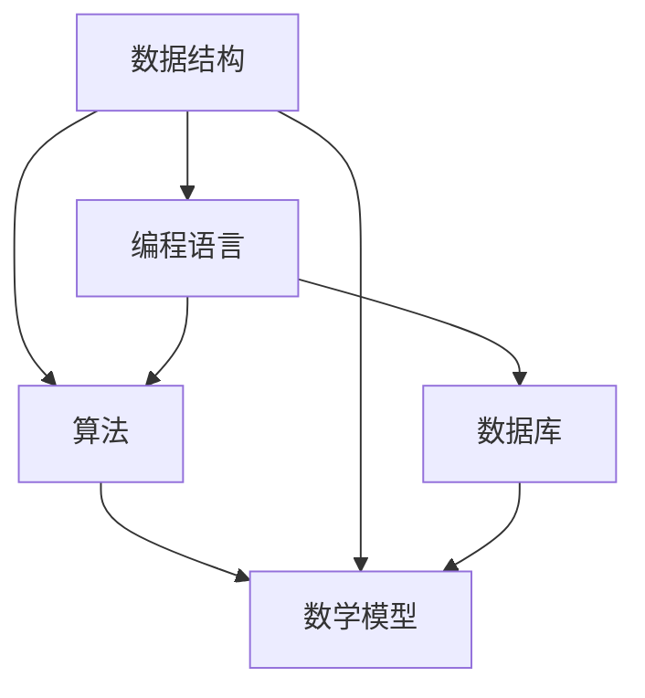

                 

 **关键词：** 技术顾问，兼职工作，高薪，技能提升，职业发展

> **摘要：** 本文将探讨技术顾问这一高薪兼职工作的选择。通过分析其背景、核心概念、算法原理、数学模型、项目实践以及实际应用场景，帮助读者理解技术顾问的价值与潜力，为职业发展提供有益的参考。

## 1. 背景介绍

### 1.1 技术顾问的定义与作用

技术顾问，顾名思义，是指拥有丰富技术知识和经验的专业人士，为客户提供技术咨询、解决方案和技术支持。他们通常服务于企业、政府机构和其他组织，帮助解决技术难题，优化业务流程，提升工作效率。

### 1.2 技术顾问的发展历程

随着信息技术的快速发展，技术顾问这一职业逐渐受到关注。早期的技术顾问主要涉及硬件和网络技术，而如今，随着人工智能、大数据、云计算等新兴技术的兴起，技术顾问的领域变得更加广泛和深入。

### 1.3 技术顾问的职业前景

根据市场研究，技术顾问的需求持续增长，特别是在数字化转型和企业升级的背景下。随着技术的不断进步，技术顾问的职业前景十分广阔，具有较高的薪资水平和职业稳定性。

## 2. 核心概念与联系

为了更好地理解技术顾问的工作，我们首先需要了解一些核心概念，如数据结构、算法、数学模型等。以下是这些概念之间的联系以及它们的 Mermaid 流程图：



### 2.1 数据结构

数据结构是存储数据的方式，用于高效地组织和操作数据。常见的数据结构包括数组、链表、栈、队列、树、图等。

### 2.2 算法

算法是解决问题的一系列步骤，通常涉及数据结构和数学模型。算法的效率直接影响到程序的性能。

### 2.3 数学模型

数学模型是基于数学原理建立的数学表达式，用于描述现实世界的问题。数学模型在优化、预测和决策中发挥着重要作用。

### 2.4 编程语言

编程语言是用于编写程序的工具，通过编程语言，我们可以将算法和数据结构转化为可执行的代码。

### 2.5 数据库

数据库是存储和管理数据的系统，用于支持大规模数据的应用。

## 3. 核心算法原理 & 具体操作步骤

### 3.1 算法原理概述

技术顾问工作中常用的一些算法包括排序算法、查找算法、动态规划算法等。以下是排序算法中的快速排序算法的原理概述：

快速排序算法的基本思想是通过一趟排序将待排序的记录分割成独立的两部分，其中一部分记录的关键字比另一部分的关键字小，则可分别对这两部分记录继续进行排序，以达到整个序列有序。

### 3.2 算法步骤详解

1. 选择一个基准元素。
2. 将小于基准元素的元素移动到基准元素的左侧。
3. 将大于基准元素的元素移动到基准元素的右侧。
4. 对基准元素的左右两部分递归执行快速排序。

### 3.3 算法优缺点

快速排序算法的优点是时间复杂度较低（平均情况下为 \(O(n\log n)\)），适用于大规模数据的排序。缺点是递归调用会导致较大的栈空间消耗，且在某些情况下时间复杂度可能退化到 \(O(n^2)\)。

### 3.4 算法应用领域

快速排序算法广泛应用于各种场景，如数据库排序、文本排序、图像处理等。

## 4. 数学模型和公式

在技术顾问的实践中，数学模型是不可或缺的工具。以下是一个简单的线性回归模型的构建过程：

### 4.1 数学模型构建

线性回归模型的基本公式为：

\[ y = ax + b \]

其中，\( y \) 是因变量，\( x \) 是自变量，\( a \) 和 \( b \) 是模型的参数。

### 4.2 公式推导过程

线性回归模型的推导过程涉及最小二乘法，其目标是找到参数 \( a \) 和 \( b \)，使得 \( y \) 与 \( ax + b \) 的偏差最小。

### 4.3 案例分析与讲解

假设我们有一组数据点 \((x_1, y_1), (x_2, y_2), \ldots, (x_n, y_n)\)，我们希望找到一条直线 \( y = ax + b \) 来描述这些数据点。

首先，计算 \( x \) 和 \( y \) 的平均值：

\[ \bar{x} = \frac{1}{n}\sum_{i=1}^{n}x_i \]
\[ \bar{y} = \frac{1}{n}\sum_{i=1}^{n}y_i \]

然后，计算斜率 \( a \)：

\[ a = \frac{\sum_{i=1}^{n}(x_i - \bar{x})(y_i - \bar{y})}{\sum_{i=1}^{n}(x_i - \bar{x})^2} \]

最后，计算截距 \( b \)：

\[ b = \bar{y} - a\bar{x} \]

通过以上步骤，我们可以得到线性回归模型 \( y = ax + b \)。

## 5. 项目实践：代码实例和详细解释说明

### 5.1 开发环境搭建

为了演示技术顾问的实际工作，我们将使用 Python 编写一个简单的线性回归模型。

首先，确保安装了 Python 和必要的库，如 NumPy 和 Matplotlib：

```bash
pip install numpy matplotlib
```

### 5.2 源代码详细实现

以下是一个简单的线性回归模型的 Python 实现：

```python
import numpy as np
import matplotlib.pyplot as plt

# 数据集
x = np.array([1, 2, 3, 4, 5])
y = np.array([2, 4, 5, 4, 5])

# 求平均值
bar_x = np.mean(x)
bar_y = np.mean(y)

# 求斜率
numerator = 0
denominator = 0
for i in range(len(x)):
    numerator += (x[i] - bar_x) * (y[i] - bar_y)
    denominator += (x[i] - bar_x) ** 2
a = numerator / denominator

# 求截距
b = bar_y - a * bar_x

# 输出模型参数
print("斜率 a:", a)
print("截距 b:", b)

# 绘制数据点和拟合直线
plt.scatter(x, y, label="数据点")
plt.plot(x, a * x + b, color="red", label="拟合直线")
plt.xlabel("x")
plt.ylabel("y")
plt.legend()
plt.show()
```

### 5.3 代码解读与分析

上述代码首先导入了 NumPy 和 Matplotlib 库，然后定义了一个数据集。接下来，计算了平均值、斜率和截距，并打印出模型参数。最后，使用 Matplotlib 绘制了数据点和拟合直线。

### 5.4 运行结果展示

运行上述代码后，我们得到了线性回归模型的参数，并生成了一个包含数据点和拟合直线的散点图。


## 6. 实际应用场景

### 6.1 企业咨询

技术顾问可以帮助企业优化技术架构，提升IT基础设施的性能，确保业务连续性和数据安全性。

### 6.2 项目管理

技术顾问在项目管理和执行过程中提供技术指导，确保项目按计划进行，并达到预期目标。

### 6.3 技术培训

技术顾问可以为企业提供定制化的技术培训，提升员工的技术能力和业务水平。

### 6.4 创业指导

对于创业者，技术顾问可以提供技术解决方案，帮助初创企业快速实现产品化和市场推广。

## 7. 工具和资源推荐

### 7.1 学习资源推荐

1. 《Python数据分析》
2. 《机器学习实战》
3. 《深度学习》

### 7.2 开发工具推荐

1. Jupyter Notebook
2. PyCharm
3. Visual Studio Code

### 7.3 相关论文推荐

1. "Deep Learning for Text Classification"
2. "Recurrent Neural Networks for Language Modeling"
3. "Convolutional Neural Networks for Visual Recognition"

## 8. 总结：未来发展趋势与挑战

### 8.1 研究成果总结

技术顾问领域的研究成果涵盖了从传统的IT咨询到人工智能和大数据分析等多个方面。这些成果不仅提升了技术顾问的职业价值，也为企业的发展提供了有力支持。

### 8.2 未来发展趋势

随着技术的不断进步，技术顾问将在以下几个方面迎来更大的发展：

1. 人工智能技术的深入应用。
2. 云计算的普及和优化。
3. 数据隐私和安全的挑战。

### 8.3 面临的挑战

尽管技术顾问的职业前景广阔，但面临以下挑战：

1. 技术更新速度加快，需要不断学习和适应。
2. 数据隐私和安全法规的日益严格。
3. 竞争激烈，需要不断提升自身竞争力。

### 8.4 研究展望

未来，技术顾问的研究将更加注重跨学科融合，如人工智能与法律、医学等领域的交叉应用，以解决复杂问题，推动社会进步。

## 9. 附录：常见问题与解答

### 9.1 如何成为技术顾问？

1. 掌握扎实的计算机科学基础。
2. 积累丰富的项目经验。
3. 获取相关资格证书，如 PMP、CISSP 等。
4. 建立良好的专业网络。

### 9.2 技术顾问的薪资水平如何？

技术顾问的薪资水平取决于多个因素，如所在地区、经验水平、技术能力等。一般来说，初级技术顾问的年薪在 5 万至 10 万美元，高级技术顾问的年薪可达到 20 万美元以上。

### 9.3 技术顾问的主要工作内容是什么？

技术顾问的工作内容包括：

1. 提供技术咨询和解决方案。
2. 优化业务流程和技术架构。
3. 技术培训和知识转移。
4. 项目管理和执行。

---

### 10. 作者署名

**作者：禅与计算机程序设计艺术 / Zen and the Art of Computer Programming**

