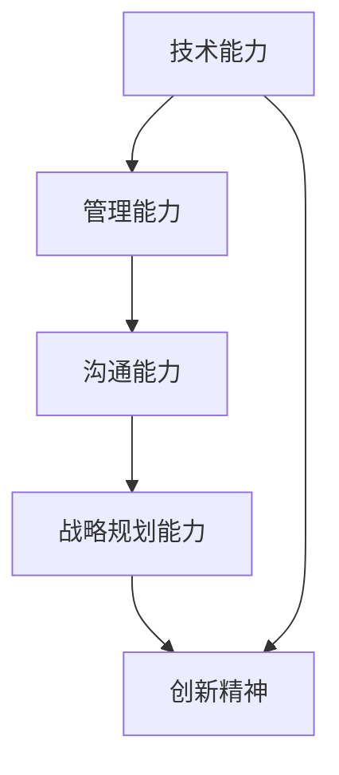

                 

关键词：技术领导力、职场价值、IT管理、团队协作、战略规划

> 摘要：本文旨在探讨技术领导力在职场中的重要性，以及如何通过提升技术领导力来增加个人的职场价值。我们将分析技术领导力的核心要素，提供实用的策略和技巧，并探讨未来技术领导力的发展趋势和面临的挑战。

## 1. 背景介绍

在当今快速变化的技术环境中，技术领导力的需求比以往任何时候都更加迫切。技术领导不仅仅是技术层面的掌控，它更涉及到战略规划、团队管理和跨部门协作等多个方面。随着数字化转型的加速，企业对于具备技术领导力的人才需求日益增加。然而，许多技术人员在面对晋升和职业发展时，往往因为缺乏有效的领导力和管理技能而受限。

本文将围绕技术领导力的定义、核心要素、提升策略、实际应用和未来趋势展开讨论，旨在帮助技术人员认识到技术领导力的重要性，掌握提升技术领导力的方法，从而在职场中实现更大的价值。

## 2. 核心概念与联系

### 2.1 技术领导力的定义

技术领导力是一种将技术专长与领导能力相结合的综合能力，它不仅要求个人在技术领域具备深厚的专业知识和技能，还需要在团队管理、战略规划和跨部门协作等方面具备出色的能力。

### 2.2 技术领导力的核心要素

- **技术能力**：作为技术领导，必须拥有扎实的技术基础和持续学习的态度，以应对快速变化的技术环境。
- **管理能力**：技术领导需要具备项目管理和团队管理的能力，能够有效地协调团队成员的工作，确保项目顺利进行。
- **沟通能力**：良好的沟通能力是技术领导力的重要组成部分，它有助于技术领导与团队成员、上级和其他部门有效沟通，确保信息的准确传达和理解。
- **战略规划能力**：技术领导需要具备前瞻性思维和战略规划能力，能够为企业制定和实施长期的技术战略。
- **创新精神**：创新是技术领导力的灵魂，技术领导需要具备探索新技术和推动创新的能力。

### 2.3 Mermaid 流程图



## 3. 核心算法原理 & 具体操作步骤

### 3.1 算法原理概述

技术领导力提升的核心算法可以理解为一种综合能力的提升模型。这个模型由以下几个关键步骤组成：

1. **自我评估**：首先，技术人员需要对自己在技术、管理、沟通、战略和创新等方面的能力进行全面的评估，找出自己的优势和劣势。
2. **制定计划**：基于自我评估的结果，技术人员可以制定一个具体的提升计划，包括学习目标、行动步骤和时间表。
3. **持续学习**：通过参加培训、阅读专业书籍、参加行业会议等方式，不断提升自己的专业知识和技能。
4. **实践应用**：在实际工作中，技术人员需要将所学知识应用到项目中，通过实践来提升自己的管理能力和沟通能力。
5. **反馈与调整**：通过定期的自我评估和团队反馈，技术人员可以及时了解自己的提升情况，并调整学习计划。

### 3.2 算法步骤详解

1. **自我评估**：
   - **技术能力评估**：可以通过参加技术考试、完成技术挑战等方式来评估自己的技术能力。
   - **管理能力评估**：可以通过模拟项目管理和团队管理任务来评估自己的管理能力。
   - **沟通能力评估**：可以通过角色扮演和模拟会议来评估自己的沟通能力。
   - **战略规划能力评估**：可以通过案例分析来评估自己的战略规划能力。
   - **创新精神评估**：可以通过创意挑战和发明创造来评估自己的创新精神。

2. **制定计划**：
   - **学习目标**：根据评估结果，设定具体的提升目标。
   - **行动步骤**：制定实现目标的详细步骤，包括学习内容、实践项目和反馈机制。
   - **时间表**：为每个步骤设定明确的时间框架，确保计划的可执行性。

3. **持续学习**：
   - **专业培训**：参加针对技术、管理和沟通的专业培训课程。
   - **读书**：阅读相关的专业书籍和行业报告。
   - **行业会议**：参加行业会议，了解最新的技术趋势和市场动态。

4. **实践应用**：
   - **项目实践**：在项目中应用所学知识，提升管理能力和沟通能力。
   - **团队协作**：积极参与团队协作，提升协作能力和跨部门沟通能力。
   - **反馈与调整**：定期评估学习效果，根据反馈调整学习计划。

5. **反馈与调整**：
   - **自我反馈**：通过反思自己的工作和学习，找出改进点。
   - **团队反馈**：通过团队成员的反馈，了解自己在团队中的表现。
   - **调整计划**：根据反馈结果，调整学习目标和行动步骤。

### 3.3 算法优缺点

**优点**：
- **全面性**：该算法涵盖了技术、管理、沟通、战略和创新等多个方面，能够全面提升技术领导力。
- **实用性**：算法中的步骤和措施都是实际可行的，可以帮助技术人员在短时间内提升领导力。
- **灵活性**：算法允许技术人员根据个人情况调整学习计划，确保计划的可执行性。

**缺点**：
- **时间成本**：提升技术领导力需要投入大量的时间和精力，可能对技术人员的工作和生活造成一定影响。
- **挑战性**：技术领导力提升过程中可能会遇到各种挑战和困难，需要技术人员具备坚定的意志和持续的努力。

### 3.4 算法应用领域

- **企业内部培训**：企业可以采用这个算法对技术人员进行内部培训，提升团队的整体技术领导力。
- **个人职业发展**：技术人员可以通过这个算法来规划自己的职业发展，实现从技术专家到技术领导的转型。
- **跨部门协作**：在跨部门协作项目中，技术人员可以通过这个算法提升自己的沟通能力和团队管理能力，促进项目的顺利进行。

## 4. 数学模型和公式 & 详细讲解 & 举例说明

### 4.1 数学模型构建

技术领导力提升过程可以用一个综合能力提升模型来表示，该模型包含以下几个关键参数：

- **技术能力（Tech）**：表示技术人员的专业知识和技能水平。
- **管理能力（Manage）**：表示技术人员在项目管理、团队管理等方面的能力。
- **沟通能力（Communicate）**：表示技术人员在沟通、协作等方面的能力。
- **战略规划能力（Strategy）**：表示技术人员在战略规划、市场分析等方面的能力。
- **创新精神（Innovation）**：表示技术人员的创新思维和创新能力。

技术领导力的提升可以视为一个多维度的综合能力提升过程，可以用以下数学模型来表示：

\[ \text{Tech Leadership} = f(Tech, Manage, Communicate, Strategy, Innovation) \]

其中，\( f \) 表示综合能力的提升函数，该函数通常是一个复杂的多变量函数，可以通过数据驱动的方法进行拟合和优化。

### 4.2 公式推导过程

技术领导力提升模型的推导过程可以从以下几个方面进行：

1. **技术能力提升**：
   - **学习曲线**：技术人员通过学习获得技术能力，可以用学习曲线来表示，即：
     \[ Tech = \alpha \cdot L \]
     其中，\( L \) 表示学习量，\( \alpha \) 表示学习效率。
   - **经验积累**：技术人员通过实际工作经验积累技术能力，可以用以下公式表示：
     \[ Tech = \beta \cdot E \]
     其中，\( E \) 表示工作经验，\( \beta \) 表示经验系数。

2. **管理能力提升**：
   - **项目管理**：通过完成项目管理任务提升管理能力，可以用以下公式表示：
     \[ Manage = \gamma \cdot P \]
     其中，\( P \) 表示项目数量，\( \gamma \) 表示项目管理效率。
   - **团队管理**：通过团队管理任务提升管理能力，可以用以下公式表示：
     \[ Manage = \delta \cdot T \]
     其中，\( T \) 表示团队数量，\( \delta \) 表示团队管理效率。

3. **沟通能力提升**：
   - **沟通训练**：通过沟通训练提升沟通能力，可以用以下公式表示：
     \[ Communicate = \epsilon \cdot C \]
     其中，\( C \) 表示沟通训练次数，\( \epsilon \) 表示沟通训练效果。

4. **战略规划能力提升**：
   - **市场分析**：通过市场分析提升战略规划能力，可以用以下公式表示：
     \[ Strategy = \zeta \cdot A \]
     其中，\( A \) 表示市场分析次数，\( \zeta \) 表示市场分析效果。
   - **战略实施**：通过战略实施提升战略规划能力，可以用以下公式表示：
     \[ Strategy = \eta \cdot S \]
     其中，\( S \) 表示战略实施次数，\( \eta \) 表示战略实施效果。

5. **创新精神提升**：
   - **创新训练**：通过创新训练提升创新精神，可以用以下公式表示：
     \[ Innovation = \theta \cdot I \]
     其中，\( I \) 表示创新训练次数，\( \theta \) 表示创新训练效果。

综合上述公式，可以得到技术领导力提升的数学模型：

\[ \text{Tech Leadership} = f(Tech, Manage, Communicate, Strategy, Innovation) \]

### 4.3 案例分析与讲解

**案例一：某技术人员提升技术领导力的过程**

某技术人员小李在入职后的第一年，对自己的技术领导力进行了全面评估，发现自己在技术能力和管理能力方面相对较强，但在沟通能力和战略规划能力方面有待提升。基于这个评估结果，小李制定了以下提升计划：

1. **技术能力提升**：
   - **学习曲线**：小李每天投入 2 小时进行技术学习，学习效率为 1.2。
     \[ Tech = 1.2 \cdot L \]
   - **经验积累**：小李在一年内参与了 5 个项目，经验系数为 1.5。
     \[ Tech = 1.5 \cdot E \]

2. **管理能力提升**：
   - **项目管理**：小李在一年内完成了 3 个项目管理任务，项目管理效率为 1.3。
     \[ Manage = 1.3 \cdot P \]
   - **团队管理**：小李在一年内负责了 2 个团队，团队管理效率为 1.2。
     \[ Manage = 1.2 \cdot T \]

3. **沟通能力提升**：
   - **沟通训练**：小李参加了 5 次沟通训练课程，沟通训练效果为 1.1。
     \[ Communicate = 1.1 \cdot C \]

4. **战略规划能力提升**：
   - **市场分析**：小李在一年内进行了 10 次市场分析，市场分析效果为 1.2。
     \[ Strategy = 1.2 \cdot A \]
   - **战略实施**：小李在一年内参与了 5 次战略实施，战略实施效果为 1.3。
     \[ Strategy = 1.3 \cdot S \]

5. **创新精神提升**：
   - **创新训练**：小李参加了 3 次创新训练课程，创新训练效果为 1.15。
     \[ Innovation = 1.15 \cdot I \]

根据上述提升计划，小李的技术领导力可以表示为：

\[ \text{Tech Leadership}_{\text{小李}} = f(1.2L + 1.5E, 1.3P + 1.2T, 1.1C, 1.2A + 1.3S, 1.15I) \]

通过一年的持续努力，小李的技术领导力得到了显著提升，不仅技术能力得到了巩固和提升，管理能力、沟通能力、战略规划能力和创新精神也得到了全面的发展。

**案例二：某企业提升技术领导力的策略**

某企业在进行技术领导力提升的过程中，采用了以下策略：

1. **内部培训**：企业定期组织技术、管理和沟通方面的内部培训，提高技术人员的专业能力和领导力。
2. **项目实践**：企业鼓励技术人员参与项目管理，通过实际操作提升管理能力和沟通能力。
3. **市场分析**：企业要求技术人员参与市场分析，提升战略规划能力。
4. **创新竞赛**：企业举办创新竞赛，激发技术人员的创新精神。

通过这些策略，企业有效地提升了技术人员的整体领导力，推动了企业的数字化转型和创新发展。

## 5. 项目实践：代码实例和详细解释说明

### 5.1 开发环境搭建

为了更好地理解技术领导力的提升过程，我们选择了一个简单的项目——一个基于 Python 的数据分析工具，用于对销售数据进行分析和可视化。以下是在开发这个项目时需要搭建的开发环境：

1. **Python 环境**：安装 Python 3.8 或以上版本。
2. **数据可视化库**：安装 Matplotlib 和 Seaborn，用于数据可视化。
3. **数据分析库**：安装 Pandas 和 NumPy，用于数据处理。

### 5.2 源代码详细实现

```python
import pandas as pd
import matplotlib.pyplot as plt
import seaborn as sns

# 读取数据
data = pd.read_csv('sales_data.csv')

# 数据清洗
data.dropna(inplace=True)

# 数据分析
# 销售额统计
sales_summary = data.groupby('month')['sales'].sum()

# 销售额可视化
sales_summary.plot(kind='bar')
plt.title('Monthly Sales')
plt.xlabel('Month')
plt.ylabel('Sales')
plt.show()

# 关联分析
correlation_matrix = data.corr()
sns.heatmap(correlation_matrix, annot=True)
plt.title('Correlation Matrix')
plt.show()
```

### 5.3 代码解读与分析

1. **数据读取与清洗**：首先，我们使用 Pandas 读取销售数据，并进行数据清洗，去除缺失值。
2. **数据分析**：我们计算了每个月的销售总额，并使用 Matplotlib 绘制了柱状图，展示销售趋势。
3. **关联分析**：我们计算了销售数据的相关性矩阵，并使用 Seaborn 绘制了热力图，展示各变量之间的相关性。

通过这个简单的项目，我们可以看到如何将技术领导力的提升应用到实际工作中，通过数据分析、可视化等技能的提升，提高工作效率和决策能力。

### 5.4 运行结果展示

运行上述代码后，我们会得到两个可视化结果：

1. **月度销售柱状图**：展示每个月的销售总额，有助于分析销售趋势。
2. **相关性热力图**：展示销售数据中各变量之间的相关性，有助于发现潜在的业务规律。

这些结果不仅能够为销售团队提供有价值的参考，还可以为企业的战略决策提供数据支持。

## 6. 实际应用场景

### 6.1 在企业中的应用

在企业中，技术领导力的重要性体现在多个方面：

1. **团队管理**：技术领导需要管理团队，确保项目按计划进行，提升团队整体效率。
2. **技术创新**：技术领导需要推动技术创新，为企业带来新的增长点。
3. **跨部门协作**：技术领导需要与不同部门进行有效沟通和协作，确保项目的顺利进行。
4. **战略规划**：技术领导需要参与企业的战略规划，提供技术方向和方案。

### 6.2 在项目管理中的应用

在项目管理中，技术领导力能够发挥重要作用：

1. **项目规划**：技术领导需要制定详细的项目规划，明确项目目标、进度和资源分配。
2. **风险控制**：技术领导需要识别和评估项目风险，制定相应的风险应对措施。
3. **团队协作**：技术领导需要协调团队成员的工作，确保项目顺利推进。
4. **质量保证**：技术领导需要确保项目输出达到预期的质量标准。

### 6.3 在个人职业发展中的应用

在个人职业发展中，提升技术领导力可以帮助技术人员：

1. **晋升机会**：技术领导力是晋升到更高职位的重要能力。
2. **项目承担**：技术领导力使技术人员能够承担更重要的项目，提升个人影响力。
3. **薪资增长**：具备技术领导力的技术人员通常能够获得更高的薪资和奖金。
4. **职业发展**：技术领导力为技术人员提供了更广阔的职业发展空间。

### 6.4 未来应用展望

随着技术的不断进步和数字化转型的发展，技术领导力的应用前景将更加广泛：

1. **云计算与大数据**：技术领导需要在云计算和大数据领域发挥领导作用，推动企业创新。
2. **人工智能与机器学习**：技术领导需要掌握人工智能和机器学习技术，为企业提供智能化解决方案。
3. **区块链**：技术领导需要关注区块链技术的发展，探索其在企业中的应用。
4. **边缘计算**：技术领导需要在边缘计算领域发挥作用，推动企业实现实时数据处理和智能决策。

## 7. 工具和资源推荐

### 7.1 学习资源推荐

1. **在线课程**：Coursera、edX、Udacity 等平台提供了丰富的技术和管理课程。
2. **专业书籍**：《软件工程：实践者的研究方法》、《敏捷软件开发：原则、模式与实践》等经典著作。
3. **技术博客**：Stack Overflow、GitHub、Medium 等平台上有大量技术文章和代码实例。

### 7.2 开发工具推荐

1. **集成开发环境（IDE）**：PyCharm、Visual Studio Code 等支持多种编程语言的 IDE。
2. **版本控制系统**：Git，用于代码管理和版本控制。
3. **数据可视化工具**：Tableau、Power BI 等，用于数据分析和可视化。

### 7.3 相关论文推荐

1. **技术领导力**：《技术领导者的挑战与机遇》、《技术领导力模型》等。
2. **项目管理**：《敏捷项目管理》、《项目管理知识体系》等。
3. **数据分析与机器学习**：《机器学习：概率视角》、《深入浅出数据分析》等。

## 8. 总结：未来发展趋势与挑战

### 8.1 研究成果总结

通过本文的探讨，我们明确了技术领导力在职场中的重要性，并分析了技术领导力的核心要素和提升策略。我们还通过数学模型和项目实践，阐述了技术领导力提升的具体方法和实际应用。

### 8.2 未来发展趋势

1. **数字化与智能化**：随着数字化和智能化的发展，技术领导力在企业和个人职业发展中的作用将更加突出。
2. **跨界融合**：技术领导力将跨越不同领域，与业务、管理等深度融合，推动企业创新和数字化转型。
3. **自主学习和适应能力**：未来，技术领导力将更加注重自主学习和适应能力，以应对快速变化的技术环境。

### 8.3 面临的挑战

1. **技术更新**：技术的快速发展带来了巨大的更新压力，技术领导需要不断学习和适应新技术。
2. **团队协作**：在多元化、远程化办公的背景下，团队协作将成为技术领导力提升的重要挑战。
3. **领导力发展**：技术领导力的提升不仅需要技术能力的提升，还需要领导力的发展，包括沟通、管理、战略规划等方面。

### 8.4 研究展望

未来的研究可以进一步探讨技术领导力在不同行业和领域的应用，以及如何通过人工智能和大数据技术提升技术领导力的评价和培养。此外，还可以研究技术领导力在全球化背景下的挑战和机遇，为企业和个人提供更有针对性的指导和建议。

## 9. 附录：常见问题与解答

### 9.1 技术领导力是什么？

技术领导力是一种将技术专长与领导能力相结合的综合能力，它不仅要求个人在技术领域具备深厚的专业知识和技能，还需要在团队管理、战略规划和跨部门协作等方面具备出色的能力。

### 9.2 技术领导力的重要性是什么？

技术领导力在职场中的重要性体现在多个方面，包括提升个人职业价值、推动企业创新、提高团队效率和实现战略目标等。

### 9.3 如何提升技术领导力？

提升技术领导力可以通过以下几个步骤进行：

1. **自我评估**：评估自身在技术、管理、沟通、战略和创新等方面的能力。
2. **制定计划**：根据评估结果，制定具体的提升计划，包括学习目标、行动步骤和时间表。
3. **持续学习**：通过参加培训、阅读专业书籍、参加行业会议等方式，不断提升自己的专业知识和技能。
4. **实践应用**：在实际工作中，将所学知识应用到项目中，通过实践来提升自己的管理能力和沟通能力。
5. **反馈与调整**：通过定期的自我评估和团队反馈，及时了解自己的提升情况，并调整学习计划。

### 9.4 技术领导力与普通技术人员的区别是什么？

普通技术人员主要专注于技术本身，而技术领导需要不仅具备技术专长，还需要在团队管理、战略规划和跨部门协作等方面具备出色的能力，能够在组织中发挥领导作用。

### 9.5 技术领导力在跨部门协作中的作用是什么？

技术领导力在跨部门协作中的作用主要体现在以下几个方面：

1. **沟通协调**：技术领导需要与不同部门的团队成员进行有效沟通，确保信息的准确传达和理解。
2. **资源整合**：技术领导需要协调不同部门的资源，确保项目顺利进行。
3. **问题解决**：在跨部门协作中，技术领导需要具备解决复杂问题的能力，推动项目向前推进。
4. **决策支持**：技术领导需要为团队提供决策支持，确保项目符合企业战略目标。

### 9.6 技术领导力的评价标准是什么？

技术领导力的评价标准可以从以下几个方面进行：

1. **技术能力**：技术领导在技术领域的专业知识和技能水平。
2. **管理能力**：技术领导在项目管理和团队管理方面的能力。
3. **沟通能力**：技术领导在沟通和协作方面的能力。
4. **战略规划能力**：技术领导在战略规划和市场分析方面的能力。
5. **创新能力**：技术领导在推动技术创新和业务增长方面的能力。

### 9.7 技术领导力的培养方法是什么？

技术领导力的培养方法包括：

1. **内部培训**：企业可以定期组织内部培训，提升技术人员的技术和管理能力。
2. **项目实践**：通过参与实际项目，提升技术人员的项目管理和团队协作能力。
3. **导师指导**：聘请经验丰富的导师，为技术人员提供指导和建议。
4. **外部学习**：参加外部培训和行业会议，了解最新的技术趋势和行业动态。
5. **自我反思**：定期进行自我反思，找出自身的优势和不足，并制定相应的提升计划。

---

作者：禅与计算机程序设计艺术 / Zen and the Art of Computer Programming

